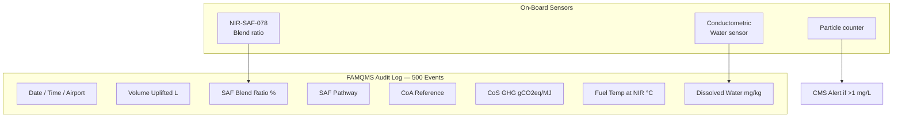

<!-- ──────────────────────────────────────────────────────────────────────────
     QATL-ATLAS-1000-ATLAS-070-079-07-078-030-FUEL-QUALITY-CONTAMINATION-AND-TRACEABILITY
     ATA 78 · Fuel Quality, Contamination and Traceability
     programme-defined aircraft type — ATLAS Register 1000
────────────────────────────────────────────────────────────────────────────── -->

# Fuel Quality, Contamination and Traceability


---

## §0 Hyperlink Policy

> All hyperlinks in this document are **relative** (five directory levels: `../../../../../`).
> Absolute URLs are forbidden. Every linked document must exist in the Q+ATLANTIDE repository
> before the link is activated. Broken links are treated as open issues and must be resolved
> before the document is promoted from `DRAFT` to `APPROVED`.

---

## §1 Purpose

This document defines the agnostic ATLAS standard-level architecture context for `Fuel Quality, Contamination and Traceability`.

It describes the controlled scope, functions, interfaces, safety considerations, lifecycle traceability, and S1000D/CSDB mapping logic that programme implementations shall instantiate when this node is applicable.

This document is not a programme design baseline. Programme-specific capacities, locations, part numbers, effectivity, operating limits, maintenance references, and data module codes shall be defined only inside the applicable programme implementation branch.
## §2 Applicability

| Applicability Level | Rule |
|---|---|
| Standard taxonomy | Applies to the ATLAS node `078` |
| Programme implementation | Conditional; determined by programme architecture, trade studies, certification basis, and applicability model |
| Product configuration | Defined in the programme-specific configuration baseline |
| Effectivity | Defined in the programme CSDB / applicability layer |
| Non-applicability | Must be explicitly stated in the programme impact-study branch when excluded |
## §3 Functional Description ![DRAFT]

Fuel quality control for SAF blends on the programme-defined aircraft type follows a three-layer architecture: pre-delivery laboratory verification, receiving inspection at the point of uplift, and continuous in-flight on-board monitoring.

**Layer 1 — Pre-delivery laboratory verification**: The SAF blend producer/depot issues a Certificate of Analysis (CoA) per ASTM D7566 Table 1 for each batch. For SAF, a Certificate of Sustainability (CoS) per ICAO CORSIA methodology (and EU RED II for European operations) accompanies the CoA, documenting the feedstock origin, production pathway, GHG lifecycle emissions (gCO₂eq/MJ), and volume. The airline/operator performs a CoA review against the ASTM D7566 Table 1 specification limits and the [PROGRAMME-AIRCRAFT] Approved Fuel List (AFL) before approving the batch for aircraft uplift.

**Layer 2 — Receiving inspection (point of uplift)**: On-aircraft, before refuelling is completed, the ground engineer performs a colour/clarity visual check on a fuel sample drawn from the uplift tanker or hydrant system. A conductometric water check (field-portable instrument PN KFT-GSE-078) confirms dissolved water ≤30 mg/kg (Karl Fischer D6304). Particulate is verified against the batch CoA (ASTM D5452 ≤1 mg/L). Where any doubt exists regarding contamination, a refuelling hold is issued and a formal lab sample is sent for full analysis.

**Layer 3 — On-board monitoring (FAMQMS)**: After refuelling, the FAMQMS (PN FAMQMS-078) records the event: date, time, airport, volume uplifted, SAF blend ratio (NIR reading), pathway (from CoA), supplier, and CoS reference number. The conductometric water sensor in the FAMQMS continuously monitors dissolved water levels in the fuel return manifold. The particle counter sub-module monitors fuel cleanliness during engine operation. Any exceedance triggers a CMS fault and crew advisory.

**Microbial growth risk**: SAF blends, particularly HEFA-SPK, have lower sulphur and aromatic content than Jet-A1, which slightly reduces the natural microbial inhibition. However, the primary driver of microbial growth in aviation fuel tanks is undrained free water, not hydrocarbon composition. FAMQMS water monitoring and rigorous water drain discipline (per IATA Guidance Material EI 1530) are the primary mitigations. A biocide additive (Biobor JF — DMOT; ASTM D3464) may be added per AMM if microbial growth is detected during D6469 testing.

**Cold chain for HEFA-SPK**: HEFA-SPK derived from tallow or palm oil feedstocks may contain trace waxy components with higher cloud/freeze points than aromatic/naphthenic Jet-A1. The ASTM D7566 requirement for freeze point ≤−47 °C at the blend level addresses this, but transit temperature during fuelling at cold-weather airports requires that the blend remains above cloud point throughout. The FAMQMS logs refuelling ambient temperature and flags if fuel temperature at the NIR sensor (return manifold) falls within 5 °C of the blend freeze point specification.

---

## §4 Functional Breakdown

| ID | Name | Description | Lead Division |
|---|---|---|---|
| F-001 | Receiving inspection | CoA review, visual/clarity check, water check, and particulate verification at point of uplift | Q-INDUSTRY |
| F-002 | On-board contamination monitoring | FAMQMS water sensor and particle counter continuous monitoring during operation | Q-HPC |
| F-003 | CoA traceability | FAMQMS logs CoA reference number and key properties per refuelling event; downloadable audit record | Q-DATAGOV |
| F-004 | CORSIA/EU RED CoS documentation | FAMQMS logs CoS reference, GHG intensity, pathway, and volume for regulatory reporting | Q-DATAGOV |
| F-005 | FAMQMS audit log | Non-volatile 500-event log with checksum; GSE port download; regulatory audit support | Q-HPC |

---

## §5 System Context — Mermaid Diagram

```mermaid
flowchart LR
    PRODUCER[SAF Producer\nHEFA/FT/ATJ/SIP/DHC] --> |CoA + CoS| DEPOT[Blending Depot]
    DEPOT --> |Blended fuel + CoA/CoS docs| TANKER[Refuelling Tanker\nor Hydrant]
    TANKER --> |Receiving Inspection\nKF water + clarity| AIRCRAFT[[PROGRAMME-AIRCRAFT]\nWing/Centre Tanks]
    AIRCRAFT --> |NIR + conductometry| FAMQMS[FAMQMS-078\nEvent Log + Contamination Monitor]
    FAMQMS --> |ARINC 429| CMS[CMS ATA 45\nFault Reporting]
    FAMQMS --> |GSE USB-C| AUDIT[Regulatory Audit\nCORSIA / EU RED II]
```

---

## §6 Internal Architecture — Mermaid Diagram



---

## §7 Components and LRUs

| Component | Part Number | Qty | Location | Maintenance Interval | Notes |
|---|---|---|---|---|---|
| FAMQMS Avionics LRU | FAMQMS-078 | 1 | EE bay zone 121 | 500 FH calibration | Contamination + traceability logging |
| NIR Spectroscopy Sensor | NIR-SAF-078 | 1 | Fuel return manifold zone 131 | 500 FH calibration | SAF blend ratio ±2 % |
| Conductometric Water Sensor | CWS-078 | 1 | Fuel return manifold zone 131 | A-check verification | ≤30 mg/kg water sensitivity |
| Particle Counter Module | PCM-078 | 1 | Integrated in FAMQMS LRU | Annual calibration | ISO 4406 code 17/15/12 alarm |
| Karl Fischer Field Titrator (GSE) | KFT-GSE-078 | — | Ground stores (GSE) | Annual calibration | D6304 field water check at uplift |
| FAMQMS Download Terminal (GSE) | FAM-DL-078 | — | Ground stores (GSE) | N/A | USB-C / ARINC 429 GSE download |

---

## §8 Interfaces

| Interface Type | Connected System | Protocol / Medium | Data / Function |
|---|---|---|---|
| Contamination fault | ATA 45 CMS | ARINC 429 | Water/particle exceedance alerts |
| CoS/CoA data input | Ground operations (manual) | FAMQMS GSE USB-C port | CoA and CoS reference data entered at refuelling |
| Regulatory download | Airline operations / audit authority | GSE USB-C | 500-event log export for CORSIA / EU RED II |
| NIR blend signal | FAMQMS internal | Embedded sensor bus | Blend ratio fed into event log and FADEC interface |
| Fuel supply monitoring | ATA 28 fuel system | Physical fuel flow | FAMQMS sensors in return manifold |

---

## §9 Operating Modes

| Mode | Trigger | System State | Actions / Consequences |
|---|---|---|---|
| Refuelling event | Fuel uplift complete | FAMQMS logs event; operator enters CoA/CoS data | New event record created; blend ratio NIR reading logged |
| Normal monitoring | Engine running | CWS and PCM sampling at 1 Hz | No alert if within limits; CO₂ saved computed per flight |
| Water exceedance | Dissolved water >30 mg/kg | FAMQMS red alert to CMS | Crew advisory; check tank sump drains per QRH; land at nearest suitable airport if in-flight |
| Particulate exceedance | Particle count >1 mg/L (D5452) | FAMQMS red alert to CMS | Maintenance action: filter FFC-078 check; ground until cleared |
| Microbial growth detected | Lab D6469 result on ground sample | Maintenance action | Biocide addition (Biobor JF per AMM 028-xxx-xx); re-test before dispatch |
| CoS chain broken | CoS document not available at uplift | FAMQMS flags event with "CoS pending" | No dispatch restriction (safety issue); but no CORSIA carbon credit claimed |

---

## §10 Performance and Budgets ![DRAFT]

| Parameter | Specification Limit | Applicable Standard | Status |
|---|---|---|---|
| Dissolved water in fuel (max) | ≤30 mg/kg | ASTM D6304 (Karl Fischer) | ![TBD] |
| Particulate contamination (max) | ≤1 mg/L | ASTM D5452 | ![TBD] |
| FAME contamination (max) | ≤5 mg/kg | ASTM D7797 | ![TBD] |
| Microbial growth (max) | <1 × 10³ CFU/mL (alert) | ASTM D6469 | ![TBD] |
| NIR water proxy accuracy | ±3 mg/kg (cross-check vs KF) | Internal calibration | ![TBD] |
| Particle counter ISO code | ≤17/15/12 (alarm at 18/16/13) | ISO 4406 | ![TBD] |
| FAMQMS log capacity | 500 refuelling events | Design spec | ![TBD] |
| CoS documentation latency | CoS entered within 24 h of uplift | ICAO CORSIA requirement | ![TBD] |

---

## §11 Safety, Redundancy and Fault Tolerance

- **Dual water detection**: Conductometric CWS-078 on-board sensor cross-checked against pre-uplift Karl Fischer field test (KFT-GSE-078) — two-layer detection prevents fuel system water contamination.
- **FAMQMS non-volatile log**: 500-event flash log with dual copy and checksums; power-fail safe write — no data loss on electrical transient or aircraft power-down.
- **CORSIA backup**: If FAMQMS GSE download is unavailable, paper CoS records retained by airline operations per ICAO CORSIA documentation requirements — dual-record system prevents regulatory gap.
- **Cold soak alert**: FAMQMS fuel temperature monitoring at NIR manifold alerts if fuel approaches blend freeze point, triggering crew to descend or activate CTRH-078 — prevents fuel gelation event.
- **Contamination hold**: Receiving inspection protocol requires formal lab sample for any visual haze, unexpected colour, or field water >30 mg/kg — no aircraft departure until cleared. Decentralised decision authority to ground engineer prevents pressure to accept contaminated fuel.

---

## §12 Maintenance and Diagnostics

| Task | Interval | Access | Special Tools |
|---|---|---|---|
| FAMQMS log download and CoS audit | Monthly (regulatory) | EE bay GSE port | FAM-DL-078 download terminal |
| CWS-078 calibration verification | A-check | Return manifold access zone 131 | Conductivity Calibration Kit PN CWS-CAL-078 |
| Particle counter PCM-078 calibration | 12 months | Integrated in FAMQMS; EE bay access | ISO particle calibration fluid PN PCM-CAL-078 |
| Tank sump drain and water check | Pre-flight (per AMM) | Fuel drain valves, underside fuselage | Drain cup; KFT-GSE-078 if visual haze |
| Fuel sample for lab analysis | C-check or after contamination event | Fuel drain port zone 131 | Sample bottle (clean, dry) PN FSB-078 |
| Biocide addition (if required) | On-condition (after D6469 result) | Refuelling panel | Biocide injection kit PN BIO-078; Biobor JF |

---

## §13 Footprint

| Footprint Type | Parameter | Value | Notes |
|---|---|---|---|
| FAMQMS LRU | 2.1 kg; 35 W | EE bay 121 | Includes contamination monitoring |
| CWS-078 sensor | 0.15 kg | Return manifold zone 131 | Conductometric; in-line |
| PCM-078 (integrated) | Included in FAMQMS | EE bay 121 | No separate installation |
| GSE Karl Fischer | 1.8 kg portable | Ground stores | Per airport / operator |
| CoS documentation | Electronic (FAMQMS) + paper backup | Airline records system | ICAO CORSIA compliant |

---

## §14 Safety and Certification References ![DRAFT]

| Standard / Document | Title | Issuing Body | Applicability |
|---|---|---|---|
| ASTM D5452 | Standard Test Method for Particulate Contamination in Aviation Fuels by Laboratory Filtration | ASTM International | Particulate cleanliness limit |
| ASTM D6304 | Standard Test Method for Determination of Water in Petroleum Products by Karl Fischer Titration | ASTM International | Water content field and lab test |
| ASTM D6469 | Standard Guide for Microbial Contamination in Fuels and Fuel System Components | ASTM International | Microbial contamination assessment |
| EI 1530 | Guidance on Minimising Water in Aviation Fuel Storage Systems | Energy Institute | Water management good practice |
| ICAO CORSIA SARPs | Standards and Recommended Practices for CORSIA | ICAO | SAF CoS chain of custody |
| EU RED II (2018/2001) | Renewable Energy Directive II — sustainability criteria | European Parliament | SAF GHG and sustainability documentation |
| IATA Guidance Material | Guidance on Aviation Turbine Fuels — SAF chapter | IATA | Operational guidance for SAF quality |
| AFQRJOS Issue 30 | Aviation Fuel Quality Requirements for Jointly Operated Systems | EI / IATA / ATA | Minimum fuel quality for uplift |

---

## §15 V&V Approach ![TBD]

| Phase | Method | Acceptance Criterion | Status |
|---|---|---|---|
| CWS-078 accuracy | Comparison with D6304 Karl Fischer lab test | ±5 mg/kg vs reference | ![TBD] |
| PCM-078 accuracy | ISO 4406 reference particle injection | ±1 ISO code accuracy | ![TBD] |
| FAMQMS log integrity | Power-fail during write; verify record completeness | Zero data loss; checksum valid | ![TBD] |
| CoS workflow audit | End-to-end test with airline ops system | CoS reference traceable FAMQMS → CORSIA registry | ![TBD] |
| Receiving inspection procedure | Procedure walkthrough with ground handling test | KF field result ≤30 mg/kg; no visual haze | ![TBD] |

---

## §16 Glossary

| Term | Definition |
|---|---|
| CoA | Certificate of Analysis — per-batch fuel laboratory quality document |
| CoS | Chain of Sustainability — ICAO CORSIA traceability document for SAF carbon credits |
| CORSIA | Carbon Offsetting and Reduction Scheme for International Aviation (ICAO) |
| EU RED II | European Renewable Energy Directive II — mandates SAF sustainability criteria |
| Karl Fischer | D6304 titration method for measuring dissolved water in fuel (mg/kg) |
| ASTM D5452 | Particulate contamination gravimetric test for aviation fuels (mg/L) |
| ASTM D6469 | Microbial contamination guide for fuel systems — colony-forming units (CFU/mL) |
| Biobor JF | Registered biocide (DMOT — dimethyloxazolidine) approved for aviation fuel per ASTM D3464 |
| CWS | Conductometric Water Sensor — in-line sensor measuring dissolved water via electrical conductivity change |
| PCM | Particle Counter Module — ISO 4406 particle sizing and counting sub-module in FAMQMS |
| AFQRJOS | Aviation Fuel Quality Requirements for Jointly Operated Systems — EI/IATA joint standard |
| FAMQMS | Fuel Accountability and Material Quality Monitoring System — avionics LRU PN FAMQMS-078 |

---

## §17 Open Issues

| ID | Description | Owner | Target |
|---|---|---|---|
| OI-078-030-001 | Define CORSIA CoS data entry workflow between airline ERP system and FAMQMS GSE port (API or manual) | Q-DATAGOV / Q-INDUSTRY | 2026-Q4 |
| OI-078-030-002 | Confirm CWS-078 accuracy at extreme temperatures (−40 °C, +50 °C ambient) | Q-HPC | 2026-Q4 |
| OI-078-030-003 | Develop AMM task card for biocide (Biobor JF) addition procedure specific to SAF blends | Q-MECHANICS | 2027-Q1 |
| OI-078-030-004 | Establish regulatory acceptance of FAMQMS digital log as primary CORSIA CoS record (vs paper) | Q-AIR | 2027-Q2 |

---

## §18 Status Legend

| Badge | Meaning |
|---|---|
| `![DRAFT]` | Section is drafted but not yet reviewed |
| `![TBD]` | Content not yet started — to be defined |
| `![To Be Completed]` | Partially complete — needs additional content |
| `![APPROVED]` | Reviewed and formally approved |

---

## §19 Related Documents (Siblings in this Subsection)

- [078-000](./078-000-SAF-and-Drop-In-Compatibility-General.md)
- [078-010](./078-010-SAF-Fuel-Compatibility-Basis.md)
- [078-020](./078-020-Drop-In-Fuel-Material-Compatibility.md)
- [078-040](./078-040-SAF-Storage-Handling-and-Servicing.md)
- [078-050](./078-050-Combustion-Emissions-and-Performance-Effects.md)
- [078-060](./078-060-SAF-Certification-and-Operational-Limits.md)
- [078-070](./078-070-SAF-System-Inspection-Test-and-Maintenance.md)
- [078-080](./078-080-SAF-Monitoring-Diagnostics-and-Control-Interfaces.md)
- [078-090](./078-090-S1000D-CSDB-Mapping-and-Traceability.md)

---

## §20 Change Log

| Rev | Date | Author | Description |
|---|---|---|---|
| 0.1 | 2026-05-12 | @copilot | Initial DRAFT — fuel quality, contamination and traceability for ATA 78-030 |
