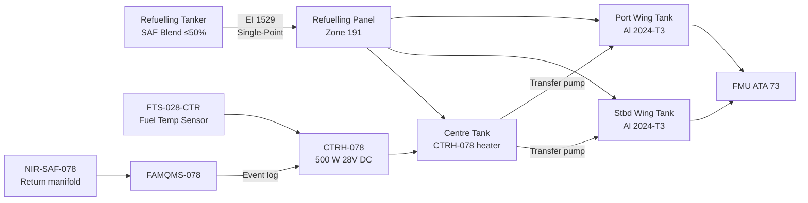
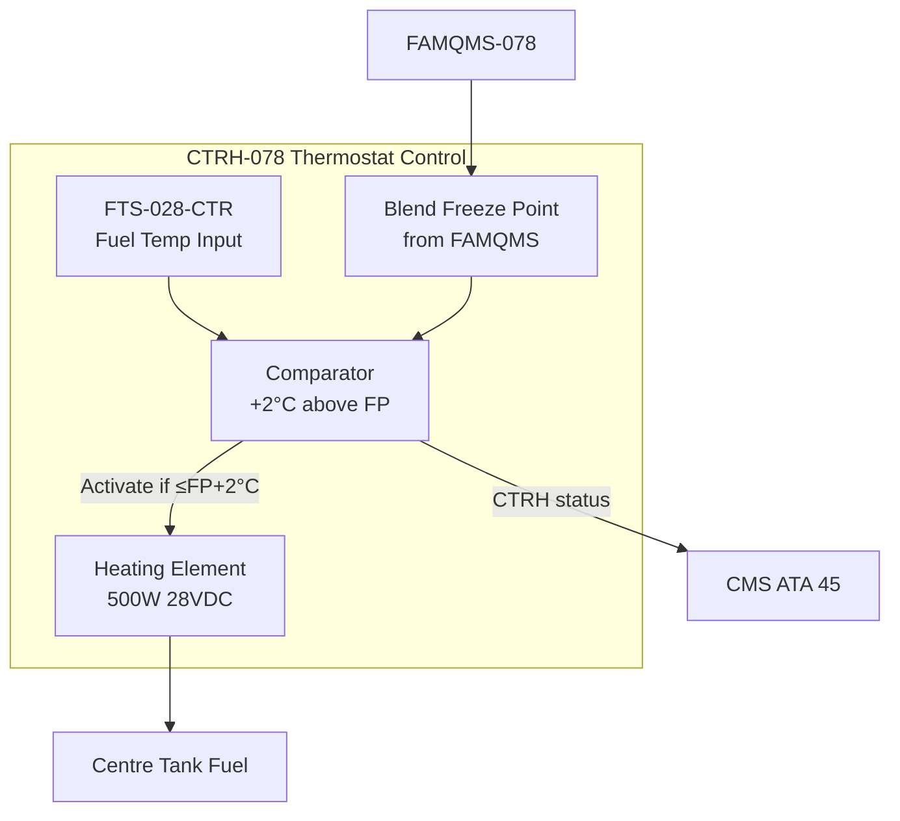

<!-- ──────────────────────────────────────────────────────────────────────────
     QATL-ATLAS-1000-ATLAS-070-079-07-078-040-SAF-STORAGE-HANDLING-AND-SERVICING
     ATA 78 · SAF Storage, Handling and Servicing
     AMPEL360E eWTW — ATLAS Register 1000
────────────────────────────────────────────────────────────────────────────── -->

# SAF Storage, Handling and Servicing

---

## §0 Hyperlink Policy

> All hyperlinks in this document are **relative** (five directory levels: `../../../../../`).
> Absolute URLs are forbidden. Every linked document must exist in the Q+ATLANTIDE repository
> before the link is activated. Broken links are treated as open issues and must be resolved
> before the document is promoted from `DRAFT` to `APPROVED`.

---

## §1 Purpose

This document (078-040) defines the on-aircraft fuel storage requirements, ground handling procedures, refuelling servicing instructions, and cold soak protection strategy for SAF blends (≤50 % v/v ASTM D7566) on the AMPEL360E eWTW. It establishes that no special airport infrastructure, dedicated storage vessels, or modified refuelling equipment is required for blended SAF ≤50 % v/v — the core "drop-in" attribute — while identifying the specific monitoring and heating provisions unique to SAF operation.

---

## §2 Applicability

| Parameter | Value |
|---|---|
| Aircraft Program | AMPEL360E eWTW |
| ATA reference | ATA 78-040 — SAF Storage, Handling and Servicing |
| Certification basis | EASA CS-25 §25.951–25.979; EASA SC E-19 |
| S1000D SNS | 078-040-00 |
| Related ATAs | ATA 12 (Ground Servicing); ATA 28 (Fuel System); ATA 73 (Fuel and Control) |
| Refuelling standard | AFQRJOS Issue 30; EI 1529 (into-plane fuelling) |

---

## §3 Functional Description ![DRAFT]

**On-aircraft storage**: The AMPEL360E eWTW fuel system (ATA 28) comprises port and starboard integral wing tanks (wet wing construction, Al 2024-T3 primary structure with PR-1776 B-2 polysulfide sealant) and a centre tank. Total usable fuel capacity: 97,000 L (approximately 78,000 kg at Jet-A1 density). SAF blends ≤50 % v/v do not require any modification to these tanks, tank bays, venting systems, or fuel quantity measurement system (FQMS). Fuel density difference between 50 % SAF blend and pure Jet-A1 is within the FQMS calibration tolerance.

**Airport infrastructure**: The vast majority of commercial airports supply SAF as a pre-blended product — the SAF is blended with Jet-A1 at the fuel depot or refinery at the prescribed blend ratio, then transported to the aircraft in standard refuelling trucks or through existing hydrant systems. The AMPEL360E requires no dedicated SAF piping, separate storage tanks, or modified fuelling adapters at any airport.

**Ground refuelling (single-point pressure refuelling)**: Standard single-point refuelling per ATA 12 and EI 1529. The refuelling panel is located on the lower fuselage (zone 191). Bonding cable connection, open-circuit interlock, pressure refuelling at ≤345 kPa (50 psi), and quantity pre-select via FQMS are all identical to Jet-A1 operations. FAMQMS (PN FAMQMS-078) records the refuelling event automatically when fuel flow is detected in the return manifold sensor (NIR-SAF-078).

**Over-wing gravity refuelling** (alternate/emergency): Standard wing access points (port and starboard). Flow rate ≤100 L/min per point. Identical procedure to Jet-A1.

**Cold soak protection — CTRH-078**: The Central Tank Recirculation Heater (CTRH-078, PN CTRH-078) is installed in the centre tank. It is a fuel-immersed electrical heater element (28 V DC, 500 W) with a thermostatic control loop that activates when the centre tank fuel temperature falls within 2 °C of the blend freeze point. The blend freeze point is derived from the CoA value stored in FAMQMS and transmitted to the thermostat controller via the fuel temperature sensor (FTS-028-CTR). For a 50 % HEFA-SPK/Jet-A1 blend with freeze point −52 °C, the CTRH activates at ≤−50 °C fuel temperature.

**Fuel transfer and crossfeed**: Crossfeed valve operation (XFCV-028) and transfer pump sequence are unchanged from Jet-A1 operation. FAMQMS blend ratio is treated as uniform across all tanks (blending occurs at depot, not on-aircraft).

**Fuel inerting**: The OBIGGS (On-Board Inert Gas Generating System, ATA 47) provides nitrogen-enriched air (NEA) to fuel tank ullage spaces. SAF blends have slightly different flammability limits than Jet-A1 (lower aromatic content slightly narrows the flammable range); however, the OBIGGS NEA target of ≤12 % O₂ provides a sufficient safety margin for all approved SAF blends — no OBIGGS modification is required.

**LOTO for maintenance**: Fuel system Lockout/Tagout follows standard ATA 28/AMM procedures. No additional LOTO steps are required for SAF beyond those applicable to Jet-A1 (i.e., fuel drain, inerting, panel lockout). SAF blends at ≤50 % have identical flash point category to Jet-A1 (≥38 °C closed cup).

---

## §4 Functional Breakdown

| ID | Name | Description | Lead Division |
|---|---|---|---|
| F-001 | On-aircraft storage | Integral wing and centre tanks; no modification for SAF ≤50 % blend | Q-MECHANICS |
| F-002 | Ground refuelling | Standard single-point or over-wing refuelling; FAMQMS auto-log at fuel flow start | Q-INDUSTRY |
| F-003 | Cold soak protection | CTRH-078 thermostatic heater activates at freeze point −2 °C margin; logs event | Q-MECHANICS |
| F-004 | Fuel heating and recirculation | CTRH-078 and engine boost pump recirculation maintain centre tank above freeze point | Q-MECHANICS |
| F-005 | FAMQMS fuelling log update | Automatic event log at every refuelling; operator enters CoA/CoS data via GSE port | Q-HPC |

---

## §5 System Context — Mermaid Diagram

---

## §6 Internal Architecture — Mermaid Diagram

---

## §7 Components and LRUs

| Component | Part Number | Qty | Location | Maintenance Interval | Notes |
|---|---|---|---|---|---|
| Central Tank Recirculation Heater | CTRH-078 | 1 | Centre tank bay, zone 151 | C-check functional test | 500 W, 28 V DC; thermostatic control |
| Fuel Temperature Sensor (centre tank) | FTS-028-CTR | 1 | Centre tank lower surface | B-check calibration | −60 to +60 °C range; ±0.5 °C accuracy |
| NIR Spectroscopy Sensor | NIR-SAF-078 | 1 | Fuel return manifold zone 131 | 500 FH calibration | Blend ratio for CTRH freeze point calc |
| FAMQMS Avionics LRU | FAMQMS-078 | 1 | EE bay zone 121 | 500 FH calibration | Fuelling log + CTRH interface |
| Refuelling Adapter (single-point) | RFA-028-01 | 2 | Zone 191 (port/stbd) | On-condition | NATO standard NATO-F-34 / F-35 compatible |
| Bonding Cable Reel | BCR-028 | 2 | Zone 191 (port/stbd) | A-check visual | Standard aviation bonding; 1 MΩ or less |

---

## §8 Interfaces

| Interface Type | Connected System | Protocol / Medium | Data / Function |
|---|---|---|---|
| CTRH activation | ATA 28 fuel temperature sensor | Thermostatic control loop | Heater on/off based on fuel temp vs blend FP |
| CTRH status | ATA 45 CMS | ARINC 429 | CTRH active/fault status reported to CMS |
| Blend freeze point | FAMQMS internal | Embedded signal | Freeze point from CoA; transmitted to CTRH controller |
| Refuelling event | FAMQMS event log | NIR flow detection | Automatic event creation at fuel flow; operator adds CoA/CoS |
| Ground power | ATA 24 electrical | 28 V DC essential bus | CTRH power; FAMQMS power |

---

## §9 Operating Modes

| Mode | Trigger | System State | Actions / Consequences |
|---|---|---|---|
| Ground refuelling | Fuel flow detected (NIR) | FAMQMS event log opens | Operator enters CoA/CoS data; blend ratio logged |
| Normal inflight | Fuel temp > blend FP + 2 °C | CTRH-078 off | Normal fuel feed; no heating required |
| CTRH active | Fuel temp ≤ blend FP + 2 °C | CTRH-078 energised | Fuel heated; ECAM advisory "CTR TANK HEAT ON" |
| CTRH fault | CTRH-078 BITE failure | FAMQMS/CMS fault | Maintenance required; dispatch under MEL if fuel temp monitored |
| Cold soak ground | Aircraft on ground at cold airport | Fuel cooling during turnaround | CTRH activates if required; prevent wax before next departure |
| Fuel defuel/transfer | Maintenance LOTO | Standard ATA 28 LOTO | Identical to Jet-A1; no additional steps |

---

## §10 Performance and Budgets ![DRAFT]

| Parameter | Requirement | Design Value | Status |
|---|---|---|---|
| CTRH-078 heating capacity | Raise 500 L centre tank fuel by 5 °C in ≤60 min | 500 W element in 500 L = +0.5 °C/kg/min ≈ 12 min | ![TBD] |
| CTRH thermostatic accuracy | ±1 °C of target setpoint (blend FP + 2 °C) | ±0.8 °C (design target) | ![TBD] |
| Refuelling rate (single-point) | ≤345 kPa; ≤4,000 L/min total | 3,500 L/min (design) | ![TBD] |
| Fuel density measurement (FQMS) | ±0.5 % accuracy for SAF blend density | ±0.3 % (TBD test data) | ![TBD] |
| FAMQMS event log latency | Event logged within 30 s of fuel flow start | <10 s | ![TBD] |
| Bonding resistance | ≤1 MΩ aircraft-to-ground | <100 kΩ (bonding cable) | ![TBD] |

---

## §11 Safety, Redundancy and Fault Tolerance

- **Flash point identical to Jet-A1**: SAF blends ≥8 % aromatics maintain flash point ≥38 °C — fire and explosion hazard classification unchanged from Jet-A1; standard fuelling fire precautions apply.
- **CTRH over-temperature protection**: CTRH-078 has a dual thermostat — primary (thermostatic control) + secondary (thermal cutoff at +70 °C fuel temperature) — preventing fuel overheating and vaporisation.
- **OBIGGS compatibility**: No change required to OBIGGS NEA target; SAF blend flammability limits are within envelope. Fuel tank flammability assessment (FTFA per CS-25 §25.981) updated for SAF blend properties.
- **No dedicated SAF piping risk**: Use of standard airport hydrant/tanker system eliminates risk of cross-contamination from dedicated (potentially mis-labelled) SAF-only infrastructure; responsibility for CoA/CoS lies with depot blending operation.
- **FQMS density calibration**: FQMS calibrated for Jet-A1 density (0.780–0.840 kg/L); SAF 50 % blend density is within this range — no fuel quantity underread risk.
- **Bonding**: Standard 1 MΩ or lower aircraft-to-ground bonding protects against electrostatic discharge during fuelling; paraffinic SAF has similar electrical conductivity to Jet-A1 (conductivity enhancer additive per ASTM D3948 authorised if required).

---

## §12 Maintenance and Diagnostics

| Task | Interval | Access | Special Tools |
|---|---|---|---|
| CTRH-078 functional test | C-check | Centre tank bay zone 151 | Thermocouple Calibrator PN TCC-GSE-078; CTRH test harness |
| FTS-028-CTR calibration | B-check | Centre tank lower surface probe | RTD Calibrator PN RTDC-GSE-028 |
| Refuelling adapter RFA-028-01 inspection | A-check | Zone 191 | Visual + pressure test; no special tool |
| Bonding cable BCR-028 resistance check | A-check | Zone 191 | Multimeter 1 MΩ range |
| FAMQMS fuelling log consistency check | Monthly | EE bay GSE port | FAM-DL-078 download terminal |
| CTRH element resistance check | D-check or on-condition | Centre tank LOTO required | Megohmmeter PN MEG-GSE-078 |

---

## §13 Footprint

| Footprint Type | Parameter | Value | Notes |
|---|---|---|---|
| CTRH-078 heater | 0.8 kg; 500 W | Centre tank bay zone 151 | Fuel-immersed; no external heat rejection |
| FTS-028-CTR | 0.1 kg | Centre tank lower surface | Mineral-insulated RTD |
| Refuelling panel modification | Nil | Zone 191 | No change vs Jet-A1 — drop-in |
| OBIGGS modification | Nil | ATA 47 | No modification required |
| Ground fuelling infrastructure | Nil | Airport-side | Airport-provided SAF-blend truck / hydrant |

---

## §14 Safety and Certification References ![DRAFT]

| Standard / Document | Title | Issuing Body | Applicability |
|---|---|---|---|
| EASA CS-25 §25.981 | Fuel Tank Flammability | EASA | FTFA for SAF blend flammability |
| EASA CS-25 §25.979 | Pressure Fueling System | EASA | Refuelling rate and pressure limits |
| EI 1529 | Criteria for the Design and Construction of Fuelling Facilities for Aviation Fuel | Energy Institute | Into-plane fuelling standard |
| AFQRJOS Issue 30 | Aviation Fuel Quality Requirements for Jointly Operated Systems | EI / IATA | Minimum fuel quality for uplift |
| ASTM D3948 | Standard Test Method for Determining the Electrical Conductivity of Petroleum-Based Fuels | ASTM International | Static conductivity check for SAF |
| SAE ARP4754A | Guidelines for Development of Civil Aircraft and Systems | SAE International | System safety assessment — CTRH |
| DEF STAN 91-091 | Turbine Fuel, Kerosine Type, Jet A-1 | UK MOD | Jet-A1 baseline for blend specification |

---

## §15 V&V Approach ![TBD]

| Phase | Method | Acceptance Criterion | Status |
|---|---|---|---|
| CTRH functional test | Heater energised in bench tank; temperature rise measured | +5 °C in ≤60 min in 500 L; thermostat ±1 °C | ![TBD] |
| CTRH over-temperature protection | Thermal cutoff test: raise fuel to 70 °C setpoint | Cutoff activates at ≤70 °C ±2 °C | ![TBD] |
| Refuelling procedure validation | Simulated refuelling with SAF-blend density fluid | FQMS quantity accurate ±0.5 %; FAMQMS log created | ![TBD] |
| FTFA update for SAF | CS-25 §25.981 analysis with SAF blend flammability properties | Tank flammability ≤7 % fleet average | ![TBD] |
| OBIGGS SAF compatibility | Analysis: SAF blend LOC vs NEA 12 % O₂ | Adequate margin at NEA 12 % | ![TBD] |

---

## §16 Glossary

| Term | Definition |
|---|---|
| CTRH | Central Tank Recirculation Heater — thermostatic electric heater preventing fuel freeze in centre tank |
| FTS | Fuel Temperature Sensor — RTD probe measuring tank fuel temperature |
| FQMS | Fuel Quantity Management System — ATA 28 system for measuring and managing fuel quantity |
| OBIGGS | On-Board Inert Gas Generating System — produces NEA for fuel tank inerting |
| NEA | Nitrogen-Enriched Air — OBIGGS output; used to inert fuel tank ullage |
| FTFA | Fuel Tank Flammability Assessment — CS-25 §25.981 analysis |
| AFQRJOS | Aviation Fuel Quality Requirements for Jointly Operated Systems |
| EI 1529 | Energy Institute into-plane fuelling criteria standard |
| LOTO | Lockout/Tagout — maintenance safety isolation procedure |
| RFA | Refuelling Adapter — aircraft single-point refuelling panel connector |
| LOC | Lower Oxygen Concentration — minimum O₂ level at which combustion cannot be sustained |
| SAF blend density | Typically 775–800 kg/m³ for 50% SAF blend vs 790–820 kg/m³ for Jet-A1 |

---

## §17 Open Issues

| ID | Description | Owner | Target |
|---|---|---|---|
| OI-078-040-001 | Confirm FQMS density calibration accuracy for HEFA-SPK/Jet-A1 50 % blend (density ~780 kg/m³) | Q-MECHANICS | 2026-Q4 |
| OI-078-040-002 | Update FTFA (CS-25 §25.981) with SAF blend lower flammability limit (LFL) data from laboratory | Q-AIR / Safety | 2027-Q1 |
| OI-078-040-003 | Confirm static conductivity of all five ASTM D7566 approved SAF blend variants; determine if conductivity enhancer required | Q-INDUSTRY | 2026-Q4 |
| OI-078-040-004 | Define cold weather dispatch procedure for SAF blend when CTRH is inoperative (MEL item) | Q-AIR | 2027-Q1 |

---

## §18 Status Legend

| Badge | Meaning |
|---|---|
| `![DRAFT]` | Section is drafted but not yet reviewed |
| `![TBD]` | Content not yet started — to be defined |
| `![To Be Completed]` | Partially complete — needs additional content |
| `![APPROVED]` | Reviewed and formally approved |

---

## §19 Related Documents (Siblings in this Subsection)

- [078-000](./078-000-SAF-and-Drop-In-Compatibility-General.md)
- [078-010](./078-010-SAF-Fuel-Compatibility-Basis.md)
- [078-020](./078-020-Drop-In-Fuel-Material-Compatibility.md)
- [078-030](./078-030-Fuel-Quality-Contamination-and-Traceability.md)
- [078-050](./078-050-Combustion-Emissions-and-Performance-Effects.md)
- [078-060](./078-060-SAF-Certification-and-Operational-Limits.md)
- [078-070](./078-070-SAF-System-Inspection-Test-and-Maintenance.md)
- [078-080](./078-080-SAF-Monitoring-Diagnostics-and-Control-Interfaces.md)
- [078-090](./078-090-S1000D-CSDB-Mapping-and-Traceability.md)

---

## §20 Change Log

| Rev | Date | Author | Description |
|---|---|---|---|
| 0.1 | 2026-05-12 | @copilot | Initial DRAFT — SAF storage, handling and servicing for ATA 78-040 |
