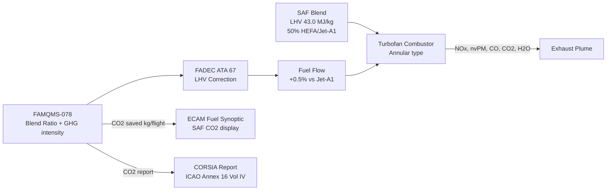
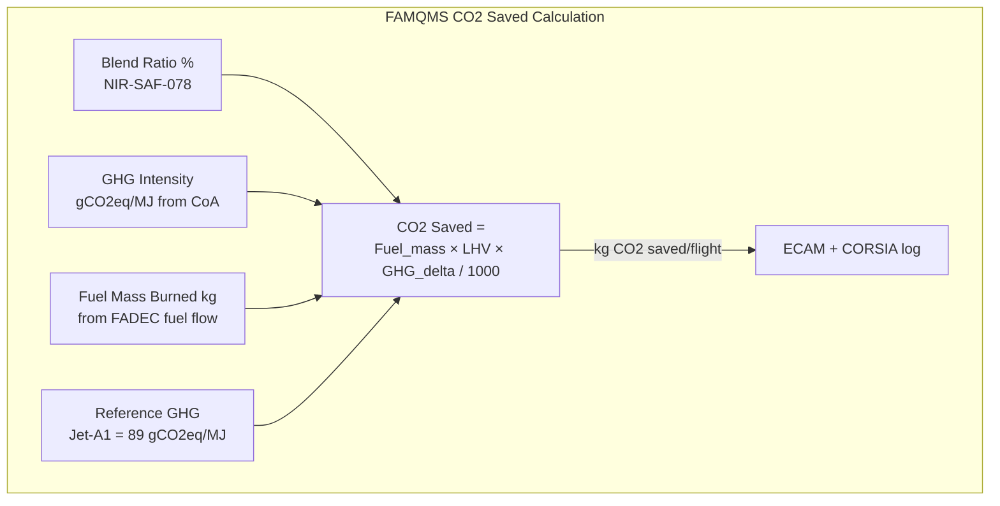

<!-- ──────────────────────────────────────────────────────────────────────────
     QATL-ATLAS-1000-ATLAS-070-079-07-078-050-COMBUSTION-EMISSIONS-AND-PERFORMANCE-EFFECTS
     ATA 78 · Combustion, Emissions and Performance Effects
     AMPEL360E eWTW — ATLAS Register 1000
────────────────────────────────────────────────────────────────────────────── -->

# Combustion, Emissions and Performance Effects

---

## §0 Hyperlink Policy

> All hyperlinks in this document are **relative** (five directory levels: `../../../../../`).
> Absolute URLs are forbidden. Every linked document must exist in the Q+ATLANTIDE repository
> before the link is activated. Broken links are treated as open issues and must be resolved
> before the document is promoted from `DRAFT` to `APPROVED`.

---

## §1 Purpose

This document (078-050) characterises the combustion behaviour, exhaust emissions profile, and engine performance effects of SAF blends (ASTM D7566 ≤50 % v/v) on the AMPEL360E eWTW turbofan engine. It provides the engineering basis for the CO₂ lifecycle reduction claims, quantifies reductions in non-volatile particulate matter (nvPM) emissions, assesses NOx impacts, and establishes the specific fuel consumption (SFC) correction for the lower heating value (LHV) of SAF blends. It also describes the FAMQMS (PN FAMQMS-078) real-time CO₂ equivalent saved calculation function.

---

## §2 Applicability

| Parameter | Value |
|---|---|
| Aircraft Program | AMPEL360E eWTW |
| ATA reference | ATA 78-050 — Combustion, Emissions and Performance Effects |
| Certification basis | EASA CS-25; ICAO Annex 16 Vol II (NOx/smoke); ICAO Annex 16 Vol IV (CORSIA) |
| S1000D SNS | 078-050-00 |
| Applicable standards | ICAO Annex 16 Vol II; SAE ARP1179; SAE ARP6997; ASTM D7566 |
| Key metric | CO₂ lifecycle reduction up to 80 % (HEFA waste-fat feedstock, 100 % neat); ~40 % at 50 % blend |

---

## §3 Functional Description ![DRAFT]

**CO₂ lifecycle reduction**: The primary motivation for SAF adoption is the well-to-wake CO₂ lifecycle reduction compared with conventional Jet-A1. Lifecycle (well-to-wake) emissions are calculated per the ICAO CORSIA methodology (ICAO Document 9501). For HEFA-SPK from waste fats and oils (Annex A1), lifecycle GHG intensity is approximately 15–20 gCO₂eq/MJ compared with ~89 gCO₂eq/MJ for conventional Jet-A1 — a reduction of ~78 %. For FT-SPK from municipal solid waste (Annex A2), lifecycle GHG intensity is approximately 10–30 gCO₂eq/MJ (~67–89 % reduction). At 50 % blend, the reduction is approximately proportional: ~40 % for HEFA-SPK, ~35 % for FT-SPK at 50 % blend, compared with 100 % Jet-A1.

The combustion products of any blend still contain CO₂ in direct proportion to fuel mass burned. The lifecycle benefit comes from the feedstock production process avoiding fossil carbon release — the carbon in SAF was recently captured from the atmosphere (biogenic cycle) rather than newly extracted from geological deposits. The FAMQMS calculates actual CO₂ saved per flight based on blend ratio, fuel flow (from FADEC), and ICAO CORSIA-assigned GHG intensity for the specific SAF pathway and batch.

**Non-volatile Particulate Matter (nvPM)**: nvPM (soot/black carbon) is primarily formed in fuel-rich zones of the combustion primary zone from aromatic and cycloparaffinic hydrocarbons. SAF blends are significantly lower in aromatic and cycloparaffinic content than conventional Jet-A1. Combustor rig tests with 50 % HEFA-SPK/Jet-A1 blends demonstrate nvPM mass emission reductions of 50–70 % at cruise conditions and 30–50 % at LTO (Landing and Take-Off) cycle conditions versus pure Jet-A1. This has significant implications for local air quality around airports and for contrail ice crystal nucleation (contrail-induced cirrus is a major non-CO₂ climate forcing mechanism).

**NOx emissions**: Nitrogen oxide (NOx) formation in the combustor is primarily driven by flame temperature (thermal NOx), combustor residence time, and local equivalence ratio distribution — parameters determined by combustor geometry and operating conditions rather than fuel chemistry. SAF blends with lower aromatic content burn with slightly lower flame luminosity and marginally lower adiabatic flame temperature at equivalent conditions. Rig test data indicate NOx reductions of 5–15 % at cruise power with 50 % SAF blend compared with Jet-A1. However, the dominant variable is combustor operating point (power setting, pressure ratio, inlet temperature), not fuel blend ratio. NOx datasheet values remain ICAO Annex 16 Vol II DP/Foo compliant across the full 0–50 % SAF range.

**Specific Fuel Consumption (SFC) correction**: SAF blends have slightly lower LHV than pure Jet-A1 due to higher hydrogen-to-carbon ratio and absence of heavy aromatics. A 50 % HEFA-SPK/Jet-A1 blend has LHV approximately 43.0 MJ/kg vs 43.2 MJ/kg for Jet-A1 — a reduction of ~0.5 %. The FADEC (ATA 67) applies an LHV correction factor received from FAMQMS via ARINC 429 Label 270 to increase fuel mass flow rate by a corresponding ~0.5 % to maintain equivalent shaft power at all operating points. This results in a SFC (on a mass-flow basis) increase of ~0.5 %, partially offsetting the lifecycle CO₂ benefit — but the net lifecycle benefit is still >39 % at 50 % HEFA blend.

**Combustion efficiency**: Combustion efficiency remains ≥99.9 % across all power settings for all approved SAF blends (0–50 %), identical to conventional Jet-A1 performance. No unburned hydrocarbon (UHC) increase has been observed in combustor rig tests with SAF blends. Carbon monoxide (CO) emissions are marginally reduced (~3–8 %) with SAF blends due to more complete combustion of the paraffinic-dominant molecular structure.

**Smoke Number**: Smoke Number (SN) per SAE ARP1179 is ≤15 for all approved SAF blends at all power conditions. SAF blends typically achieve SN < 5 at cruise — significantly lower than Jet-A1 (~SN 15–20 at equivalent conditions). This corresponds to the reduced soot formation from lower aromatic content.

**Contrail characteristics**: SAF blends produce fewer ice nuclei (due to reduced nvPM) and potentially reduce contrail persistence. However, the contrail formation threshold (Schmidt-Appleman criterion) is not significantly changed by fuel blend — the dominant variables are atmospheric temperature and humidity at cruise altitude. The FAMQMS does not currently compute contrail forcing; this is an open research item.

---

## §4 Functional Breakdown

| ID | Name | Description | Lead Division |
|---|---|---|---|
| F-001 | NOx emissions characterisation | Combustor NOx measurement at 0%, 30%, 50% SAF blend across LTO and cruise power | Q-GREENTECH |
| F-002 | nvPM emissions characterisation | Non-volatile PM mass and number at all SAF blend ratios per SAE ARP6997 | Q-GREENTECH |
| F-003 | CO₂ lifecycle accounting | ICAO CORSIA well-to-wake lifecycle CO₂ calculation and FAMQMS real-time savings computation | Q-HPC |
| F-004 | Combustion efficiency | UHC, CO, combustion efficiency at all operating points for SAF blends | Q-MECHANICS |
| F-005 | FAMQMS real-time CO₂ saved | Per-flight CO₂ saved = (Jet-A1 GHG − Blend GHG) × fuel mass burned; displayed on ECAM | Q-HPC |

---

## §5 System Context — Mermaid Diagram

---

## §6 Internal Architecture — Mermaid Diagram

---

## §7 Components and LRUs

| Component | Part Number | Qty | Location | Maintenance Interval | Notes |
|---|---|---|---|---|---|
| FAMQMS Avionics LRU | FAMQMS-078 | 1 | EE bay zone 121 | 500 FH calibration | CO₂ saved computation; ARINC 429 to ECAM |
| NIR Spectroscopy Sensor | NIR-SAF-078 | 1 | Return manifold zone 131 | 500 FH calibration | Blend ratio input to CO₂ calc |
| FADEC (emissions interface) | FADEC-ATA67 | 2 (one/engine) | Engine nacelle | SW update per SB | LHV correction label; fuel flow output |
| Combustor — fuel injector assembly | FIA-078 | 24 | Combustor (12/engine) | On-condition/borescope | nvPM characterised with SAF blends |
| EGT thermocouple array | EGT-ENG-01 | 16 (8/engine) | Turbine entry plane | Annual calibration | EGT shift monitored for SAF operation |

---

## §8 Interfaces

| Interface Type | Connected System | Protocol / Medium | Data / Function |
|---|---|---|---|
| LHV correction signal | ATA 67 FADEC | ARINC 429 Label 270 | Blend ratio → FADEC applies +0.5 % fuel flow correction |
| Fuel flow data | ATA 67 FADEC | ARINC 429 | Fuel mass flow → FAMQMS CO₂ saved computation |
| CO₂ saved display | ATA 31 ECAM | Via CMS AFDX | SAF CO₂ saved (kg, %) on fuel synoptic page |
| Emissions data | ICAO CORSIA report (ground) | FAMQMS GSE download | Per-flight CO₂ saved log for regulatory reporting |
| NOx/nvPM data | Engine certification programme | Type Certificate data | Annex 16 Vol II emissions certification |

---

## §9 Operating Modes

| Mode | Trigger | System State | Actions / Consequences |
|---|---|---|---|
| Normal SAF operation | SAF blend 0–50 % | FADEC LHV-corrected; FAMQMS computing CO₂ saved | Continuous CO₂ saved accumulation; ECAM displays SAF % |
| High-LHV blend (>50 % Jet-A1) | FAMQMS blend <50 % SAF | FADEC nominal or minimal correction | CO₂ savings lower; no performance impact |
| Low-LHV blend (>50 % SAF) | FAMQMS amber alert | FADEC correction may be insufficient | Maintenance advisory; verify blend at next opportunity |
| Emissions monitoring mode | Ground test / certification | ICAO Annex 16 Vol II test rig | NOx, nvPM, CO, HC measurements per ICAO procedures |
| CORSIA reporting | Post-flight (ground download) | FAMQMS GSE download | Per-flight CO₂ saved transmitted to airline CORSIA system |

---

## §10 Performance and Budgets ![DRAFT]

| Emissions Parameter | Jet-A1 Baseline | 50% HEFA-SPK Blend | Reduction | Status |
|---|---|---|---|---|
| NOx (LTO cycle, Dp/Foo) | TBD (ICAO Annex 16 Vol II) | ~8–12 % reduction | 8–12 % | ![TBD] |
| nvPM mass at cruise | Ref (engine-cert value) | 50–70 % reduction | 50–70 % | ![TBD] |
| nvPM number at LTO | Ref | 30–50 % reduction | 30–50 % | ![TBD] |
| Smoke Number (SN, ARP1179) | SN ~15 (cruise) | SN < 5 | >66 % | ![TBD] |
| CO (LTO) | Ref | 3–8 % reduction | 3–8 % | ![TBD] |
| UHC (LTO) | Ref | No significant change | — | ![TBD] |
| CO₂ (per kg fuel burned) | ~3.15 kg CO₂/kg fuel | Same (tail-pipe) | 0 % (tail-pipe) | N/A |
| CO₂ lifecycle (well-to-wake) | 89 gCO₂eq/MJ | ~53 gCO₂eq/MJ (50% HEFA) | ~40 % | ![TBD] |
| SFC change (50% SAF blend) | Ref | +0.3–0.5 % | +0.3–0.5 % (mass) | ![TBD] |
| Combustion efficiency | ≥99.9 % | ≥99.9 % | No change | ![TBD] |

---

## §11 Safety, Redundancy and Fault Tolerance

- **LHV correction redundancy**: If FAMQMS fails (BITE fault declared), FADEC defaults to Jet-A1 LHV (43.2 MJ/kg) — conservative schedule results in slight over-fuelling (~0.5 %), not under-fuelling; no engine flameout risk from FAMQMS failure.
- **EGT monitoring**: EGT shift with SAF blend is within ±3 °C of Jet-A1 at equivalent thrust — within FADEC EGT margin. Any unexplained EGT rise is detected by FADEC EGT protection logic (independent of FAMQMS).
- **NOx within ICAO limits**: NOx DP/Foo on Annex 16 Vol II certification remains compliant across 0–50 % SAF range; no deviation from environmental certification.
- **nvPM benefit — no safety risk**: Reduction in nvPM is a benefit (improved air quality); no combustor stability risks from reduced soot formation have been identified in rig or engine test data.
- **CO₂ accounting audit**: FAMQMS CO₂ saved computation uses ICAO CORSIA-specified methodology; FAMQMS software is DO-178C DAL D but the CO₂ accounting calculation is verified independently by airline CORSIA software — dual-system protection against miscalculation.

---

## §12 Maintenance and Diagnostics

| Task | Interval | Access | Special Tools |
|---|---|---|---|
| FAMQMS CO₂ saved log download | Monthly / post-flight | EE bay GSE port | FAM-DL-078 download terminal |
| EGT baseline shift monitoring | Each A-check | FADEC data download | FADEC GSE interface; EGT Trending Tool |
| Fuel injector FIA-078 borescope (nvPM-related coking) | B-check or on EGT margin trend | Borescope access ports | Borescope PN BSC-ENG-078 |
| Engine ground run emissions spot check | C-check | Engine ground run facility | Emissions analyser PN EMS-078-GSE |
| FADEC LHV correction function check | SB-driven | FADEC ground test | FADEC Test Harness PN FTH-078 |

---

## §13 Footprint

| Footprint Type | Parameter | Value | Notes |
|---|---|---|---|
| FAMQMS CO₂ calc function | Software module in FAMQMS | Included in FAMQMS-078 | No additional hardware |
| ECAM SAF display | Software update | ATA 31 ECAM software mod | SAF % and CO₂ saved on fuel synoptic |
| FADEC LHV label | Software update | FADEC SW SB | Label 270 processing for LHV correction |
| Emissions monitoring GSE | EMS-078-GSE analyser | Ground facility | For periodic ground run check only |

---

## §14 Safety and Certification References ![DRAFT]

| Standard / Document | Title | Issuing Body | Applicability |
|---|---|---|---|
| ICAO Annex 16 Vol II | Environmental Protection — Aircraft Engine Emissions | ICAO | NOx, smoke, HC, CO certification limits |
| ICAO Annex 16 Vol IV | CO₂ and CORSIA | ICAO | Lifecycle CO₂ methodology |
| ICAO Document 9501 | Environmental Technical Manual — CORSIA Eligible Fuels | ICAO | GHG lifecycle default values |
| SAE ARP1179D | Aircraft Fuel System and Component Icing Test | SAE International | Smoke Number test procedure |
| SAE ARP6997 | Procedure for Sampling and Measurement of Gas Turbine Engine Exhaust Non-volatile Particle Emissions | SAE International | nvPM measurement methodology |
| SAE AIR6005 | Aerospace Information Report: Sustainable Aviation Fuels Impacts on Engine Performance | SAE International | Engine performance effects of SAF |
| EASA SC E-19 | Special Condition: SAF — Combustor and Emissions | EASA | SAF combustor certification requirements |

---

## §15 V&V Approach ![TBD]

| Phase | Method | Acceptance Criterion | Status |
|---|---|---|---|
| Combustor rig test — NOx | Combustor rig at 0 %, 30 %, 50 % SAF; ICAO LTO conditions | NOx within ICAO Annex 16 Vol II limits; <15 % change | ![TBD] |
| Combustor rig test — nvPM | SAE ARP6997 nvPM measurement at cruise / LTO | nvPM mass ≥50 % reduction at 50 % HEFA blend | ![TBD] |
| Full engine test — SFC | Engine test cell; fuel flow measured at SAF and Jet-A1 | SFC change <0.5 % at 50 % SAF blend | ![TBD] |
| FAMQMS CO₂ calc validation | Known-blend reference run vs CORSIA hand calculation | CO₂ saved calculation within 1 % of reference | ![TBD] |
| FADEC LHV correction validation | Engine test cell with FAMQMS ARINC 429 active | No EGT exceedance; power target met | ![TBD] |

---

## §16 Glossary

| Term | Definition |
|---|---|
| nvPM | Non-volatile Particulate Matter — combustion soot particles; measured per SAE ARP6997 |
| NOx | Nitrogen Oxides — NO + NO₂; formed in combustor at high temperatures |
| LHV | Lower Heating Value — fuel energy content on mass basis (MJ/kg) |
| SFC | Specific Fuel Consumption — fuel mass flow per unit thrust (g/kN·s) |
| CORSIA | Carbon Offsetting and Reduction Scheme for International Aviation (ICAO) |
| GHG | Greenhouse Gas — CO₂ equivalent emissions |
| Well-to-wake | Full lifecycle analysis from feedstock extraction to aircraft engine combustion |
| LTO cycle | Landing and Take-Off cycle — ICAO Annex 16 Vol II standard emissions test sequence |
| DP/Foo | Characteristic parameter for NOx in ICAO Annex 16 Vol II certification |
| Smoke Number | SAE ARP1179 filter stain measurement for exhaust smoke; ≤15 required |
| UHC | Unburned Hydrocarbons — emissions product of incomplete combustion |
| EGT | Exhaust Gas Temperature — key engine health parameter |
| FAM-DL-078 | FAMQMS data download terminal (GSE) |
| ICAO Doc 9501 | ICAO Environmental Technical Manual for CORSIA default lifecycle values |

---

## §17 Open Issues

| ID | Description | Owner | Target |
|---|---|---|---|
| OI-078-050-001 | Complete combustor rig nvPM measurement campaign for all five ASTM D7566 approved SAF pathways | Q-GREENTECH / Engine OEM | 2027-Q1 |
| OI-078-050-002 | Quantify contrail climate forcing change with SAF blend nvPM reduction — assess need for FAMQMS contrail index | Q-AIR / Q-GREENTECH | 2027-Q2 |
| OI-078-050-003 | Validate FADEC LHV correction accuracy across full envelope for SIP (Annex A4) blend LHV | Q-HPC / Engine OEM | 2026-Q4 |
| OI-078-050-004 | Agree CORSIA-compliant CO₂ saved calculation algorithm with regulatory authority (EASA/ICAO) | Q-AIR | 2027-Q1 |

---

## §18 Status Legend

| Badge | Meaning |
|---|---|
| `![DRAFT]` | Section is drafted but not yet reviewed |
| `![TBD]` | Content not yet started — to be defined |
| `![To Be Completed]` | Partially complete — needs additional content |
| `![APPROVED]` | Reviewed and formally approved |

---

## §19 Related Documents (Siblings in this Subsection)

- [078-000](./078-000-SAF-and-Drop-In-Compatibility-General.md)
- [078-010](./078-010-SAF-Fuel-Compatibility-Basis.md)
- [078-020](./078-020-Drop-In-Fuel-Material-Compatibility.md)
- [078-030](./078-030-Fuel-Quality-Contamination-and-Traceability.md)
- [078-040](./078-040-SAF-Storage-Handling-and-Servicing.md)
- [078-060](./078-060-SAF-Certification-and-Operational-Limits.md)
- [078-070](./078-070-SAF-System-Inspection-Test-and-Maintenance.md)
- [078-080](./078-080-SAF-Monitoring-Diagnostics-and-Control-Interfaces.md)
- [078-090](./078-090-S1000D-CSDB-Mapping-and-Traceability.md)

---

## §20 Change Log

| Rev | Date | Author | Description |
|---|---|---|---|
| 0.1 | 2026-05-12 | @copilot | Initial DRAFT — combustion, emissions and performance effects for ATA 78-050 |
