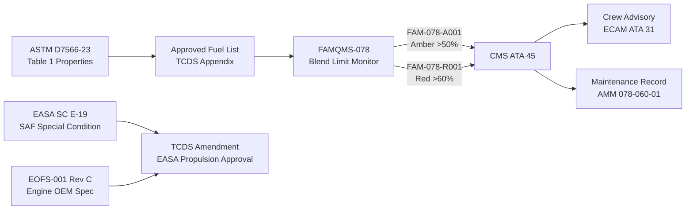
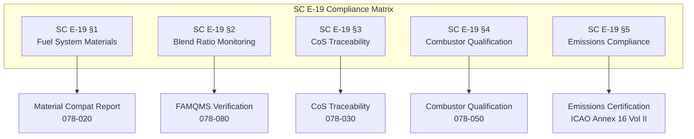

<!-- ──────────────────────────────────────────────────────────────────────────
     QATL-ATLAS-1000-ATLAS-070-079-07-078-060-SAF-CERTIFICATION-AND-OPERATIONAL-LIMITS
     ATA 78 · SAF Certification and Operational Limits
     AMPEL360E eWTW — ATLAS Register 1000
────────────────────────────────────────────────────────────────────────────── -->

# SAF Certification and Operational Limits

---

## §0 Hyperlink Policy

> All hyperlinks in this document are **relative** (five directory levels: `../../../../../`).
> Absolute URLs are forbidden. Every linked document must exist in the Q+ATLANTIDE repository
> before the link is activated. Broken links are treated as open issues and must be resolved
> before the document is promoted from `DRAFT` to `APPROVED`.

---

## §1 Purpose

This document (078-060) defines the airworthiness certification basis, compliance matrix, and operational limits for SAF blends on the AMPEL360E eWTW. It covers conformance to ASTM D7566 Table 1, the EASA Special Condition SC E-19 compliance programme, the Engine OEM Fuel Specification EOFS-001, and the Type Certificate Data Sheet (TCDS) amendment process. It also establishes the FAMQMS (PN FAMQMS-078) role as the on-board enforcement mechanism for blend limit monitoring and exceedance alerting.

---

## §2 Applicability

| Parameter | Value |
|---|---|
| Aircraft Program | AMPEL360E eWTW |
| ATA reference | ATA 78-060 — SAF Certification and Operational Limits |
| Certification authority | EASA (primary); FAA (supplemental, ETSOA/STC) |
| Certification basis | EASA CS-25 Amdt 27+; EASA SC E-19; ASTM D7566-23; DEF STAN 91-091 Issue 10 |
| Engine certification | EASA CS-E 2015 Amdt 5; EASA SC E-19 |
| S1000D SNS | 078-060-00 |

---

## §3 Functional Description ![DRAFT]

**Regulatory framework**: The AMPEL360E eWTW SAF certification programme is structured around three interlocking regulatory instruments:

1. **EASA Special Condition SC E-19** (Sustainable Aviation Fuels): EASA has issued SC E-19 specifically for civil aircraft type certification with SAF. SC E-19 defines additional requirements for fuel system material qualification, FAMQMS-equivalent monitoring, CoS traceability, and combustor/emissions qualification with SAF blends. Compliance with SC E-19 forms the primary certification basis for the ATA 78 SAF subsection.

2. **ASTM D7566 Table 1 conformance**: All fuel blends uplifted to the AMPEL360E must conform to ASTM D7566 Table 1 for all physical and chemical properties. Conformance is verified at the blending depot (supplier CoA) and monitored on-board by FAMQMS. The Type Certificate Data Sheet (TCDS) amendment lists all approved SAF pathways (Annexes A1–A5) and the maximum blend ratio (currently 50 % v/v).

3. **Engine OEM Fuel Specification EOFS-001 Rev C**: The turbofan engine OEM specifies permissible fuel properties for the combustor and fuel metering unit. EOFS-001 Rev C has been updated to include all five ASTM D7566 approved annexes at ≤50 % blend. Engine Type Certificate (ETC) amendment is required before TCDS amendment can be issued for the aircraft.

**TCDS amendment process**: The EASA TCDS for the AMPEL360E eWTW includes the Approved Fuel List (AFL) as a controlled appendix. Each new SAF pathway or blend ratio increase requires a TCDS amendment (proposed by the OEM and approved by EASA propulsion section). The amendment package includes: compliance matrix against SC E-19, updated AFL, combustor qualification test report, material compatibility report, and FAMQMS software verification evidence.

**Operational limits (Approved Fuel List)**:

| Fuel Type | SAF Pathway | ASTM D7566 Annex | Max Blend (% v/v) | Min Aromatics (% v/v) | Max FAME (mg/kg) | Status |
|---|---|---|---|---|---|---|
| HEFA-SPK / Jet-A1 | HEFA | A1 | 50 | 8 | 5 | Approved |
| FT-SPK / Jet-A1 | Fischer-Tropsch | A2 | 50 | 8 | 5 | Approved |
| ATJ-SPK / Jet-A1 | Alcohol-to-Jet | A3 | 50 | 8 | 5 | Approved |
| SIP / Jet-A1 | Synthesised Iso-Paraffins | A4 | 10 | 8 | 5 | Approved |
| DHC-SPK / Jet-A1 | Direct Hydrothermal | A5 | 10 | 8 | 5 | Approved (provisional) |

**FAMQMS blend limit monitoring**: FAMQMS generates an amber advisory (CMS fault code FAM-078-A001) when the NIR blend ratio reading exceeds 50 % SAF. A maintenance action is required before the next revenue flight to verify the blend via CoA review and, if required, reduce the blend by additional Jet-A1 uplift. Dispatch with FAM-078-A001 active is not permitted (no MEL relief for first 12 months in service). Red alert (FAM-078-R001) is generated if blend exceeds 60 % SAF (NIR reading — 10 % above limit) — flight operations advisory with crew notification.

**FAMQMS aromatics floor monitoring**: FAMQMS generates amber advisory (FAM-078-A002) if CoA aromatics value entered at refuelling is below 8 % v/v. Advisory cleared when CoA is reviewed and corrected blend confirmed.

---

## §4 Functional Breakdown

| ID | Name | Description | Lead Division |
|---|---|---|---|
| F-001 | ASTM D7566 Table 1 compliance verification | Verify all ASTM D7566 properties met for each approved pathway in Approved Fuel List | Q-GREENTECH |
| F-002 | EASA SC E-19 compliance | Develop and document compliance evidence against each SC E-19 paragraph | Q-AIR |
| F-003 | OEM fuel spec EOFS-001 compliance | Verify engine combustor and FMU conformance to EOFS-001 Rev C for SAF blends | Q-MECHANICS |
| F-004 | FAMQMS blend limit monitoring | NIR blend ratio monitoring with amber >50% and red >60% advisories | Q-HPC |
| F-005 | TCDS amendment management | Manage TCDS amendment process with EASA for AFL updates and new SAF pathways | Q-AIR |

---

## §5 System Context — Mermaid Diagram

---

## §6 Internal Architecture — Mermaid Diagram

---

## §7 Components and LRUs

| Component | Part Number | Qty | Location | Maintenance Interval | Notes |
|---|---|---|---|---|---|
| FAMQMS Avionics LRU | FAMQMS-078 | 1 | EE bay zone 121 | 500 FH calibration; SW per SB | Blend limit enforcement; CMS fault generation |
| NIR Spectroscopy Sensor | NIR-SAF-078 | 1 | Return manifold zone 131 | 500 FH calibration | ±2 % accuracy for blend limit monitoring |
| TCDS Amendment Package | TCDS-AMPEL360E-SAF-01 | 1 (document) | EASA / OEM records | Per EASA TCDS amendment cycle | AFL appendix controlled by EASA |
| EOFS-001 Rev C | EOFS-001-REVC | 1 (document) | Engine OEM records | Per engine OEM SB / Rev cycle | Controlling fuel spec for combustor |

---

## §8 Interfaces

| Interface Type | Connected System | Protocol / Medium | Data / Function |
|---|---|---|---|
| Blend limit alert | ATA 45 CMS | ARINC 429 | FAM-078-A001 (amber, >50% SAF) and FAM-078-R001 (red, >60%) |
| Crew advisory | ATA 31 ECAM | Via CMS | Blend exceedance message on fuel synoptic page |
| Maintenance record | AMM task card 078-060-01 | Manual | Blend exceedance corrective action record |
| Regulatory evidence | EASA / Operator | FAMQMS GSE download | Blend ratio logs for compliance audit |

---

## §9 Operating Modes

| Mode | Trigger | System State | Actions / Consequences |
|---|---|---|---|
| Normal SAF operation | Blend ≤50 % confirmed by NIR | FAMQMS green; no alerts | Full dispatch freedom; CO₂ savings credited |
| Amber blend advisory | NIR reads >50 % SAF | FAMQMS amber (FAM-078-A001) | No dispatch; verify CoA; add Jet-A1 if required |
| Red blend advisory | NIR reads >60 % SAF | FAMQMS red (FAM-078-R001) | Crew alert; operator advisory; maintenance hold |
| Aromatics floor advisory | CoA aromatics <8 % entered | FAMQMS amber (FAM-078-A002) | Review CoA; reject fuel uplift or obtain corrected CoA |
| TCDS amendment pending | New SAF pathway under review | AFL restricted to current approved list | New pathway not approved until TCDS amendment issued |

---

## §10 Performance and Budgets ![DRAFT]

| Certification Limit | Specification | Status |
|---|---|---|
| Max SAF blend (current TCDS) | 50 % v/v SAF + 50 % Jet-A1 | ![TBD] |
| Min aromatics in blend | 8 % v/v (AFL requirement) | ![TBD] |
| Max FAME in blend | 5 mg/kg (cross-contamination limit) | ![TBD] |
| Max FAMQMS blend ratio alert threshold (amber) | >50 % SAF (NIR) | ![TBD] |
| Max FAMQMS blend ratio alert threshold (red) | >60 % SAF (NIR) | ![TBD] |
| FAMQMS NIR accuracy at 50 % blend | ±2 % v/v | ![TBD] |
| SIP / DHC-SPK max blend (current TCDS) | 10 % v/v | ![TBD] |
| TCDS amendment cycle | Per EASA regulatory process (~12–18 months per change) | ![TBD] |

---

## §11 Safety, Redundancy and Fault Tolerance

- **Dual-layer blend enforcement**: ASTM D7566 compliance enforced at depot (CoA) + on-board (FAMQMS NIR) — two independent enforcement points prevent out-of-specification fuel from reaching the combustor undetected.
- **FAMQMS BITE**: If NIR sensor (NIR-SAF-078) fails BITE, FAMQMS adopts a conservative (declared Jet-A1 only) operating assumption and generates fault code FAM-078-F001 to CMS; dispatch under MEL requires CoA-only blend verification.
- **No dispatch with amber advisory (first 12 months)**: Conservative in-service entry policy — no MEL relief for first 12 months of SAF operation ensures fleet experience accumulates before any relaxation.
- **TCDS Amendment process**: EASA TCDS amendment requirement for any AFL change ensures regulatory oversight of every new SAF pathway or blend ratio increase — no unilateral OEM expansion of approved fuel types.
- **Engine retest for new pathways**: EOFS-001 Rev C requires combustor rig test for any SAF pathway not previously qualified — prevents extrapolation of approval to untested fuel chemistry.

---

## §12 Maintenance and Diagnostics

| Task | Interval | Access | Special Tools |
|---|---|---|---|
| FAMQMS blend alert history download | A-check | EE bay GSE port | FAM-DL-078 download terminal |
| NIR-SAF-078 calibration check | 500 FH | Return manifold zone 131 | NIR Calibration Reference Cell PN NIR-CAL-078 |
| AFL/TCDS review for SAF updates | Annual (or per EASA TCDS amendment) | Document control | N/A — document review |
| FAMQMS blend alert corrective action | On alert (FAM-078-A001/R001) | CoA review + Jet-A1 top-up if required | Standard refuelling equipment |
| EOFS-001 currency check | Per engine SB / Rev cycle | Maintenance records | N/A — document review |

---

## §13 Footprint

| Footprint Type | Parameter | Value | Notes |
|---|---|---|---|
| Certification documentation | TCDS amendment package | ~200 pages + test reports | EASA-controlled; OEM-prepared |
| FAMQMS software (blend enforcement) | SW module in FAMQMS-078 | Included in FAMQMS LRU | DO-178C DAL D |
| AFL document | TCDS Appendix | 1 page controlled appendix | Updateable by TCDS amendment |

---

## §14 Safety and Certification References ![DRAFT]

| Standard / Document | Title | Issuing Body | Applicability |
|---|---|---|---|
| EASA SC E-19 | Special Condition: Sustainable Aviation Fuels for Turbine Engines | EASA | Primary SAF certification requirement |
| EASA CS-25 §25.1583 | Operating Limitations | EASA | TCDS and AFL as operating limitation |
| ASTM D7566-23 | Standard Specification for Aviation Turbine Fuel Containing Synthesized Hydrocarbons | ASTM International | SAF blend property qualification standard |
| EASA CS-E 2015 Amdt 5 | Certification Specifications for Engines | EASA | Engine type certificate basis for SAF |
| EOFS-001 Rev C | Engine OEM Fuel Specification | Engine OEM (TBD) | Combustor fuel requirements |
| DEF STAN 91-091 Issue 10 | Turbine Fuel, Kerosine Type, Jet A-1 | UK MOD | Conventional fuel baseline spec |
| ICAO Doc 9501 Pt III | CORSIA Eligible Fuels Lifecycle Assessment | ICAO | Lifecycle values for AFL-listed SAF |

---

## §15 V&V Approach ![TBD]

| Phase | Method | Acceptance Criterion | Status |
|---|---|---|---|
| SC E-19 compliance matrix | Line-by-line review vs certification evidence | All SC E-19 paragraphs compliance status = "compliant" | ![TBD] |
| FAMQMS blend alert test | Inject simulated NIR reading of 51 %, 61 % SAF; verify alert generation | FAM-078-A001 at 51 %; FAM-078-R001 at 61 % | ![TBD] |
| AFL boundary test | Physical blend at exactly 50 % SAF; verify FAMQMS no-alert | No alert at 50 % v/v blend | ![TBD] |
| TCDS amendment review | EASA propulsion section review | TCDS issued with AFL appendix | ![TBD] |
| EOFS-001 compliance test | Engine OEM qualification rig test for all A1–A5 at ≤50 % | EOFS-001 all properties met | ![TBD] |

---

## §16 Glossary

| Term | Definition |
|---|---|
| TCDS | Type Certificate Data Sheet — EASA document defining certified configuration including AFL |
| AFL | Approved Fuel List — list of fuel types and blend ratios approved for aircraft |
| SC E-19 | EASA Special Condition E-19 — SAF-specific airworthiness requirements for turbine engines |
| EOFS-001 | Engine OEM Fuel Specification — turbofan combustor fuel property requirements |
| ASTM D7566 | SAF qualification standard — Table 1 defines blend properties; Annexes A1–A5 define pathways |
| FAM-078-A001 | FAMQMS CMS fault code — amber advisory, SAF blend >50 % NIR reading |
| FAM-078-R001 | FAMQMS CMS fault code — red advisory, SAF blend >60 % NIR reading |
| FAM-078-A002 | FAMQMS CMS fault code — amber advisory, CoA aromatics <8 % v/v |
| FAM-078-F001 | FAMQMS CMS fault code — NIR sensor BITE failure |
| MEL | Minimum Equipment List — lists permitted equipment inoperabilities for dispatch |
| ETC | Engine Type Certificate — EASA certification document for the turbofan engine |

---

## §17 Open Issues

| ID | Description | Owner | Target |
|---|---|---|---|
| OI-078-060-001 | Submit SC E-19 compliance matrix to EASA propulsion section for pre-approval review | Q-AIR | 2026-Q4 |
| OI-078-060-002 | Obtain EOFS-001 Rev C written acceptance from engine OEM covering all five ASTM D7566 annexes | Q-GREENTECH / Engine OEM | 2027-Q1 |
| OI-078-060-003 | Define MEL relief criteria for FAM-078-A001 (amber blend advisory) after 12-month in-service period | Q-AIR / Safety | 2027-Q4 |
| OI-078-060-004 | Initiate TCDS amendment package for DHC-SPK (Annex A5) upgrade from 10 % to 50 % blend limit (pending D4054) | Q-AIR | 2028-Q1 |

---

## §18 Status Legend

| Badge | Meaning |
|---|---|
| `![DRAFT]` | Section is drafted but not yet reviewed |
| `![TBD]` | Content not yet started — to be defined |
| `![To Be Completed]` | Partially complete — needs additional content |
| `![APPROVED]` | Reviewed and formally approved |

---

## §19 Related Documents (Siblings in this Subsection)

- [078-000](./078-000-SAF-and-Drop-In-Compatibility-General.md)
- [078-010](./078-010-SAF-Fuel-Compatibility-Basis.md)
- [078-020](./078-020-Drop-In-Fuel-Material-Compatibility.md)
- [078-030](./078-030-Fuel-Quality-Contamination-and-Traceability.md)
- [078-040](./078-040-SAF-Storage-Handling-and-Servicing.md)
- [078-050](./078-050-Combustion-Emissions-and-Performance-Effects.md)
- [078-070](./078-070-SAF-System-Inspection-Test-and-Maintenance.md)
- [078-080](./078-080-SAF-Monitoring-Diagnostics-and-Control-Interfaces.md)
- [078-090](./078-090-S1000D-CSDB-Mapping-and-Traceability.md)

---

## §20 Change Log

| Rev | Date | Author | Description |
|---|---|---|---|
| 0.1 | 2026-05-12 | @copilot | Initial DRAFT — SAF certification and operational limits for ATA 78-060 |
