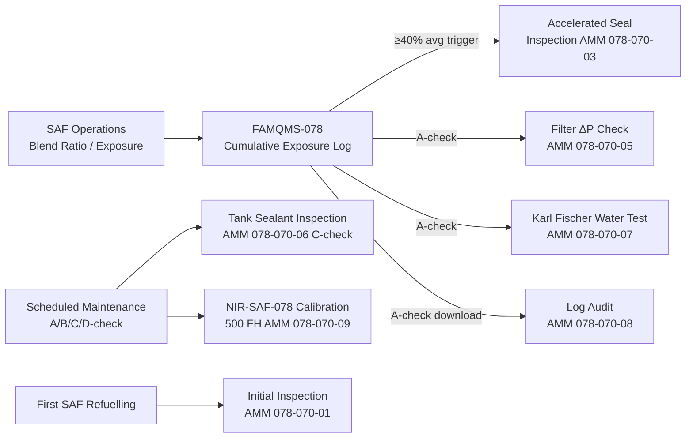
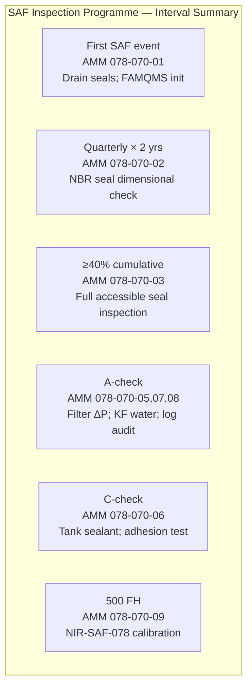

<!-- ──────────────────────────────────────────────────────────────────────────
     QATL-ATLAS-1000-ATLAS-070-079-07-078-070-SAF-SYSTEM-INSPECTION-TEST-AND-MAINTENANCE
     ATA 78 · SAF System Inspection, Test and Maintenance
     AMPEL360E eWTW — ATLAS Register 1000
────────────────────────────────────────────────────────────────────────────── -->

# SAF System Inspection, Test and Maintenance

---

## §0 Hyperlink Policy

> All hyperlinks in this document are **relative** (five directory levels: `../../../../../`).
> Absolute URLs are forbidden. Every linked document must exist in the Q+ATLANTIDE repository
> before the link is activated. Broken links are treated as open issues and must be resolved
> before the document is promoted from `DRAFT` to `APPROVED`.

---

## §1 Purpose

This document (078-070) defines the SAF-specific inspection, test, and maintenance programme for the AMPEL360E eWTW. It establishes maintenance task requirements, inspection intervals, and special procedures associated with SAF blend operation that supplement or modify the standard ATA 28 (Fuel System) maintenance programme. The key driver for SAF-specific maintenance is the progressive monitoring of elastomeric seal condition and tank sealant integrity as a function of cumulative SAF exposure, as tracked by the FAMQMS (PN FAMQMS-078) cumulative exposure log.

---

## §2 Applicability

| Parameter | Value |
|---|---|
| Aircraft Program | AMPEL360E eWTW |
| ATA reference | ATA 78-070 — SAF System Inspection, Test and Maintenance |
| Certification basis | EASA CS-25; EASA SC E-19; AMM Task Cards 078-070-01 through 078-070-10 |
| S1000D SNS | 078-070-00 |
| Maintenance planning | MSG-3 analysis basis; on-condition items flagged by FAMQMS |
| First SAF refuelling event | Triggers initial inspection and FAMQMS log initialisation |

---

## §3 Functional Description ![DRAFT]

The SAF maintenance programme for the AMPEL360E eWTW is built on the principle that SAF blends ≤50 % v/v are materially compatible with all fuel system components (see 078-020), but that the slightly different chemical environment (lower aromatics, different sulphur profile, potentially different trace contaminant behaviour) warrants additional monitoring during the initial in-service period and at defined exposure milestones.

**First SAF refuelling event (AMM 078-070-01)**: At the aircraft's first ever SAF refuelling event, the following initial tasks are required:
- Visual inspection of all drain manifold elastomeric seals (PN ORS-NBR-078 series) — confirm no pre-existing degradation before SAF exposure begins.
- FAMQMS log initialisation: reset cumulative SAF exposure counter; confirm NIR-SAF-078 calibration current; confirm CWS-078 water sensor functional.
- Record baseline fuel system sump drain performance (drain time and volume) for trend comparison.

**Seal inspection programme (AMM 078-070-02 through 078-070-04)**:
- **Quarterly for first two years** (0–24 months of SAF operation): Visual inspection and dimensional check of representative NBR O-ring samples (drain manifold seals, wing root crossfeed seals) to confirm swell within design range.
- **At ≥40 % cumulative average SAF blend** (FAMQMS-triggered, may occur at any A-check): Full NBR seal inspection across all accessible fuel system connection points; dimensional measurement against baseline.
- **C-check interval thereafter**: Standard seal inspection cycle supplemented by swab test (ASTM D471 coupon review) to verify ongoing compatibility.

**Fuel filter inspection (AMM 078-070-05)**:
SAF blend may produce a different particulate profile than Jet-A1 during initial operation due to mobilisation of accumulated deposits in older fuel infrastructure (airport hydrant systems, tankers). At the A-check:
- Inspect SAF-rated fuel filter cartridges (PN FFC-078) for ΔP accumulation. Replace if ΔP exceeds 250 mbar (alarm setpoint) OR at the A-check replacement interval, whichever occurs first.
- Retain a used filter for contamination analysis at C-check if FAMQMS particle counter PCM-078 has registered any exceedances in the preceding interval.

**Tank sealant inspection (AMM 078-070-06)**:
At each C-check, or after any sustained period (>60 days) of continuous SAF blend ≥40 % operation:
- Entry into wing/centre tank bays (confined space procedures apply).
- Visual inspection of all PR-1776 B-2 sealant beads for softening, swelling, blistering, or adhesion loss.
- Adhesion peel test at minimum 3 representative locations per tank using portable adhesion tester (PN ADH-GSE-078). Acceptance criterion: ≥15 N/25 mm (AMS 3281).
- Sealant re-application with FSS-078 kit if adhesion or visual criteria not met; re-test before tank is closed.

**Water contamination testing (AMM 078-070-07)**:
At each A-check, collect a fuel sample from the drain port (zone 131) and test with the Karl Fischer field titrator (KFT-GSE-078). Acceptance: dissolved water ≤30 mg/kg. If exceeded, drain all free water from sump, retest, and investigate water source before return to service.

**FAMQMS maintenance event log (AMM 078-070-08)**:
At each A-check, download and review the FAMQMS maintenance event log (via FAM-DL-078). Confirm all refuelling events have CoA and CoS references completed. Verify cumulative SAF exposure log is consistent with operational records. Correct any missing entries before the log is submitted to the airline CORSIA system.

---

## §4 Functional Breakdown

| ID | Name | Description | Lead Division |
|---|---|---|---|
| F-001 | Seal inspection | Visual, dimensional, and swab inspection of NBR/FKM/FVMQ seals per FAMQMS-triggered and scheduled intervals | Q-MECHANICS |
| F-002 | Filter inspection | FFC-078 filter cartridge ΔP monitoring and replacement at A-check | Q-MECHANICS |
| F-003 | Tank/sealant inspection | C-check visual + adhesion test for PR-1776 B-2 tank sealant | Q-MECHANICS |
| F-004 | Contamination sampling | A-check Karl Fischer water test; particle count review from PCM-078 | Q-INDUSTRY |
| F-005 | FAMQMS maintenance event log | A-check download and verification of FAMQMS 500-event log completeness | Q-HPC |

---

## §5 System Context — Mermaid Diagram

---

## §6 Internal Architecture — Mermaid Diagram

---

## §7 Components and LRUs

| Component | Part Number | Qty | Location | Maintenance Interval | Notes |
|---|---|---|---|---|---|
| FAMQMS Avionics LRU | FAMQMS-078 | 1 | EE bay zone 121 | 500 FH calibration; SW per SB | Exposure log; maintenance trigger source |
| NIR Spectroscopy Sensor | NIR-SAF-078 | 1 | Return manifold zone 131 | 500 FH calibration | Calibration per AMM 078-070-09 |
| SAF-rated Fuel Filter Cartridge | FFC-078 | 4 | Engine pylons | A-check replacement | ΔP alert at 250 mbar |
| NBR O-ring seal set | ORS-NBR-078 | ~120 | Fuel system zones 131–141 | On-condition (FAMQMS-triggered) | Dimensional inspection and replacement |
| Tank sealant kit PR-1776 B-2 | FSS-078 | — | Stores | C-check / on-condition | Sealant replenishment if degradation found |
| Conductometric Water Sensor | CWS-078 | 1 | Return manifold zone 131 | A-check verification | Cross-check with KFT-GSE-078 at A-check |

---

## §8 Interfaces

| Interface Type | Connected System | Protocol / Medium | Data / Function |
|---|---|---|---|
| Maintenance trigger | ATA 45 CMS | ARINC 429 | FAMQMS fault codes generate maintenance tasks in CMS |
| Exposure log download | Ground maintenance system | FAMQMS GSE USB-C | 500-event log download for maintenance planning |
| Inspection record | AMM task cards | Manual | Inspection results recorded; cross-referenced to FAMQMS log |
| Filter ΔP indication | ATA 28 fuel system | Differential pressure switch | ΔP alert to ECAM/CMS at 250 mbar |
| CTRH functional test | ATA 28 / ATA 24 | 28 V DC; thermostat | C-check CTRH-078 heater and thermostat verification |

---

## §9 Operating Modes

| Mode | Trigger | System State | Actions / Consequences |
|---|---|---|---|
| Normal operation | SAF blend within limits; no maintenance triggers | All systems nominal; FAMQMS monitoring | Maintenance per standard intervals |
| First SAF event | First SAF refuelling recorded in FAMQMS | Initial inspection task generated | AMM 078-070-01 completed before next revenue flight |
| FAMQMS 40 % trigger | Cumulative average SAF exposure ≥40 % | Accelerated inspection flag generated | AMM 078-070-03 at next A-check |
| Filter ΔP amber | FFC-078 ΔP ≥250 mbar | Fuel system ΔP advisory to CMS | Replace FFC-078 per AMM 078-070-05 at next A-check |
| Water exceedance | KF water >30 mg/kg or CWS-078 alert | FAMQMS red alert | AMM 078-070-07; investigate and drain before dispatch |
| Sealant degradation | C-check adhesion <15 N/25 mm | Tank unserviceable | Re-seal per AMM 028-xxx-xx; re-inspect before close |

---

## §10 Performance and Budgets ![DRAFT]

| Maintenance Parameter | Specification | Status |
|---|---|---|
| NBR seal dimensional inspection interval (first 2 yrs) | Quarterly | ![TBD] |
| NBR seal accelerated inspection trigger | FAMQMS cumulative average SAF ≥40 % | ![TBD] |
| PR-1776 B-2 adhesion acceptance | ≥15 N/25 mm (AMS 3281) | ![TBD] |
| FFC-078 replacement interval | A-check or ΔP ≥250 mbar | ![TBD] |
| NIR-SAF-078 calibration interval | 500 FH | ![TBD] |
| FAMQMS log completeness target | 100 % of refuelling events logged with CoA/CoS | ![TBD] |
| Water contamination limit (KF test) | ≤30 mg/kg | ![TBD] |

---

## §11 Safety, Redundancy and Fault Tolerance

- **Staged inspection programme**: Quarterly inspections in the first two years of SAF operation provide early warning of any accelerated seal degradation before safety impact — conservative in-service entry policy.
- **FAMQMS exposure trigger**: Automatic FAMQMS alert at ≥40 % cumulative average SAF prevents inspections being inadvertently missed as exposure accumulates gradually across many flights.
- **Dual water detection**: KF field test at A-check provides independent verification of CWS-078 on-board sensor — two-level assurance for water contamination control.
- **Tank sealant redundancy**: PR-1776 B-2 is applied in overlapping beads with redundant sealant coverage at all structural interfaces — initial degradation of one bead does not immediately lead to fuel leakage; C-check detection interval is adequate.
- **Filter ΔP protection**: FFC-078 filter ΔP switch provides engine protection against particulate-loaded fuel — if ΔP alert occurs in flight, fuel filter bypass valve (ATA 28) opens, maintaining engine fuel supply while generating CMS fault for maintenance action.

---

## §12 Maintenance and Diagnostics

| Task | Interval | Access | Special Tools |
|---|---|---|---|
| Initial SAF inspection (AMM 078-070-01) | First SAF refuelling | Fuel drain manifold access, zone 131 | Mirror PN MIR-GSE-078; feeler gauge |
| NBR seal quarterly inspection (AMM 078-070-02) | Quarterly × 2 years | Fuel system access panels zones 131–141 | Seal Calliper PN CAL-GSE-078 |
| Accelerated seal inspection (AMM 078-070-03) | FAMQMS 40% trigger | All accessible fuel access panels | Seal Calliper PN CAL-GSE-078; swab kit |
| Filter FFC-078 replacement (AMM 078-070-05) | A-check | Engine pylon cowl | Filter Wrench PN FW-GSE-078 |
| Tank sealant inspection (AMM 078-070-06) | C-check | Wing/centre tank entry (confined space) | Adhesion Tester PN ADH-GSE-078; FSS-078 kit |
| KF water test (AMM 078-070-07) | A-check | Fuel drain port zone 131 | Karl Fischer Titrator PN KFT-GSE-078 |
| FAMQMS log download (AMM 078-070-08) | A-check | EE bay GSE port | FAM-DL-078 download terminal |
| NIR calibration (AMM 078-070-09) | 500 FH | Return manifold access panel zone 131 | NIR Reference Cell PN NIR-CAL-078 |
| CTRH-078 functional test (AMM 078-070-10) | C-check | Centre tank bay zone 151 | Thermocouple Calibrator PN TCC-GSE-078 |

---

## §13 Footprint

| Footprint Type | Parameter | Value | Notes |
|---|---|---|---|
| Ground support equipment | KFT-GSE-078, ADH-GSE-078, FAM-DL-078, NIR-CAL-078 | 4 GSE items | Per maintenance base; portable |
| Consumable materials | FSS-078 (sealant), ORS-NBR-078 (O-rings), FFC-078 (filters) | Per maintenance plan | Sealant and seals are standard stock items |
| FAMQMS inspection data storage | 500-event flash log | FAMQMS-078 EE bay | Non-volatile; downloadable |
| Tank confined space entry | Per airline confined space procedure | Wing/centre tank | Standard confined space permit; O₂ monitor |

---

## §14 Safety and Certification References ![DRAFT]

| Standard / Document | Title | Issuing Body | Applicability |
|---|---|---|---|
| EASA CS-25 §25.963 | Fuel Tanks — General | EASA | Tank structural integrity requirements |
| EASA SC E-19 | Sustainable Aviation Fuels — SAF maintenance requirements | EASA | SAF-specific maintenance basis |
| AMS 3281 | Sealing Compound, Polysulfide, Integral Fuel Tank | SAE International | Tank sealant adhesion acceptance criterion |
| ASTM D471 | Standard Test Method for Rubber Property — Effect of Liquids | ASTM International | Seal compatibility acceptance basis |
| MSG-3 Rev 3 | Airline/Manufacturer Maintenance Program Development Document | ATA | Maintenance programme development methodology |
| EASA Part 145 | Approved Maintenance Organisations | EASA | Maintenance organisation requirements |
| ASTM D6304 | Karl Fischer Water Content Test | ASTM International | Fuel water content acceptance |

---

## §15 V&V Approach ![TBD]

| Phase | Method | Acceptance Criterion | Status |
|---|---|---|---|
| First SAF inspection procedure validation | Procedure walkthrough with maintenance personnel | All steps feasible; no special tool gap | ![TBD] |
| Seal inspection dimensional method | Calliper measurement repeatability test on sample seals | Measurement reproducibility ±0.1 mm | ![TBD] |
| Sealant adhesion test procedure | Adhesion tester PN ADH-GSE-078 correlation to standard pull-off test | ±10 % vs reference pull-off test | ![TBD] |
| FAMQMS 40 % trigger test | Load FAMQMS with cumulative 40 % average; confirm maintenance flag | Flag generated within 24 h of threshold crossing | ![TBD] |
| KF field titrator accuracy | Compare PN KFT-GSE-078 field result vs lab Karl Fischer | ±5 mg/kg vs certified lab result | ![TBD] |

---

## §16 Glossary

| Term | Definition |
|---|---|
| FAMQMS | Fuel Accountability and Material Quality Monitoring System — cumulative exposure log and maintenance trigger |
| FFC-078 | Fuel Filter Cartridge (SAF-rated) — Beta 15 pore size; A-check replacement |
| ORS-NBR-078 | NBR O-ring seal set for fuel system low-pressure circuit |
| FSS-078 | Fuel System Sealant Kit — PR-1776 B-2 polysulfide |
| AMM | Aircraft Maintenance Manual — controlled maintenance task documentation |
| MSG-3 | Maintenance Steering Group 3 — methodology for developing maintenance programmes |
| ΔP | Differential Pressure — filter condition indicator |
| KF | Karl Fischer titration — water content test (ASTM D6304) |
| AMS 3281 | SAE sealant specification for integral fuel tanks; adhesion acceptance |
| Confined space | Tank bays requiring permit, O₂ monitoring, and trained personnel |
| BITE | Built-In Test Equipment — self-test function of FAMQMS LRU |
| CTRH-078 | Central Tank Recirculation Heater — thermostatic heater in centre tank |

---

## §17 Open Issues

| ID | Description | Owner | Target |
|---|---|---|---|
| OI-078-070-001 | Draft AMM task cards 078-070-01 through 078-070-10 for initial SAF fleet introduction | Q-MECHANICS | 2026-Q4 |
| OI-078-070-002 | Confirm MSG-3 interval basis for quarterly NBR seal inspection (first 2 years) with regulator | Q-AIR | 2027-Q1 |
| OI-078-070-003 | Define required GSE calibration schedule for KFT-GSE-078 and ADH-GSE-078 at maintenance bases | Q-INDUSTRY | 2027-Q1 |
| OI-078-070-004 | Establish FAMQMS 40 % cumulative trigger rollback procedure (if aircraft switches to lower SAF blend) | Q-HPC | 2026-Q4 |

---

## §18 Status Legend

| Badge | Meaning |
|---|---|
| `![DRAFT]` | Section is drafted but not yet reviewed |
| `![TBD]` | Content not yet started — to be defined |
| `![To Be Completed]` | Partially complete — needs additional content |
| `![APPROVED]` | Reviewed and formally approved |

---

## §19 Related Documents (Siblings in this Subsection)

- [078-000](./078-000-SAF-and-Drop-In-Compatibility-General.md)
- [078-010](./078-010-SAF-Fuel-Compatibility-Basis.md)
- [078-020](./078-020-Drop-In-Fuel-Material-Compatibility.md)
- [078-030](./078-030-Fuel-Quality-Contamination-and-Traceability.md)
- [078-040](./078-040-SAF-Storage-Handling-and-Servicing.md)
- [078-050](./078-050-Combustion-Emissions-and-Performance-Effects.md)
- [078-060](./078-060-SAF-Certification-and-Operational-Limits.md)
- [078-080](./078-080-SAF-Monitoring-Diagnostics-and-Control-Interfaces.md)
- [078-090](./078-090-S1000D-CSDB-Mapping-and-Traceability.md)

---

## §20 Change Log

| Rev | Date | Author | Description |
|---|---|---|---|
| 0.1 | 2026-05-12 | @copilot | Initial DRAFT — SAF system inspection, test and maintenance for ATA 78-070 |
