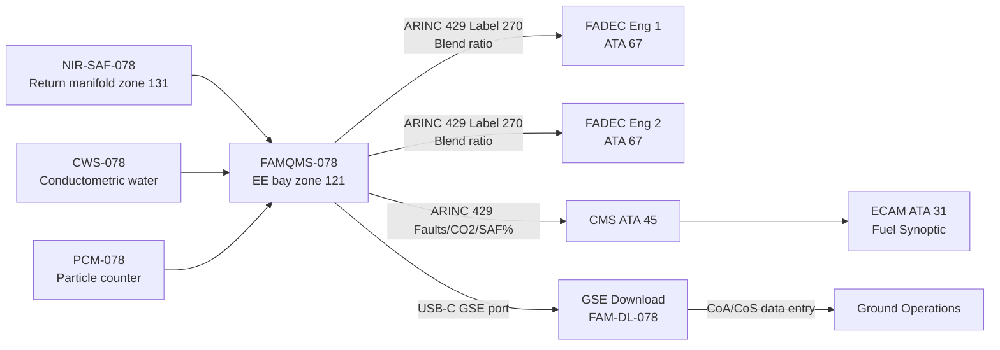

<!-- ──────────────────────────────────────────────────────────────────────────
     QATL-ATLAS-1000-ATLAS-070-079-07-078-080-SAF-MONITORING-DIAGNOSTICS-AND-CONTROL-INTERFACES
     ATA 78 · SAF Monitoring, Diagnostics and Control Interfaces
     AMPEL360E eWTW — ATLAS Register 1000
────────────────────────────────────────────────────────────────────────────── -->

# SAF Monitoring, Diagnostics and Control Interfaces

---

## §0 Hyperlink Policy

> All hyperlinks in this document are **relative** (five directory levels: `../../../../../`).
> Absolute URLs are forbidden. Every linked document must exist in the Q+ATLANTIDE repository
> before the link is activated. Broken links are treated as open issues and must be resolved
> before the document is promoted from `ATLAS` to `APPROVED`.

---

## §1 Purpose

This document (078-080) defines the architecture, interfaces, diagnostics, and data management for the Fuel Accountability and Material Quality Monitoring System (FAMQMS, PN FAMQMS-078) — the central avionics LRU for SAF monitoring on the AMPEL360E eWTW. It covers the near-infrared (NIR) spectroscopy blend measurement system, FADEC (ATA 67) LHV correction interface, Central Maintenance System (CMS, ATA 45) and ECAM (ATA 31) interfaces, on-board contamination monitoring, and FAMQMS data logging and download capability.

---

## §2 Applicability

| Parameter | Value |
|---|---|
| Aircraft Program | AMPEL360E eWTW |
| ATA reference | ATA 78-080 — SAF Monitoring, Diagnostics and Control Interfaces |
| Certification basis | EASA CS-25; DO-178C DAL D; DO-254 DAL D; ARINC 429 Mark 33 |
| S1000D SNS | 078-080-00 |
| FAMQMS design assurance | DO-178C DAL D (software); DO-254 DAL D (hardware) |
| FAMQMS communication | ARINC 429 (dual bus, TX); ARINC 429 (single bus, RX); USB-C GSE port |

---

## §3 Functional Description ![DRAFT]

**FAMQMS (Fuel Accountability and Material Quality Monitoring System — PN FAMQMS-078)** is a single-box avionics Line Replaceable Unit (LRU) hosted in the EE bay (zone 121) in a standard ARINC 404A 1/2 ATR short tray. It provides the following functions:

**F-001 — SAF Blend Ratio Measurement (NIR)**: A near-infrared spectroscopy sensor (PN NIR-SAF-078), installed in-line in the fuel return manifold (zone 131), transmits a spectral fingerprint to the FAMQMS processor via a dedicated shielded sensor bus. The FAMQMS processor analyses absorption peaks at specific NIR wavelengths characteristic of aromatic (750–900 nm region) and aliphatic/paraffinic (1150–1350 nm region) hydrocarbon types to compute the SAF blend ratio with ±2 % v/v accuracy. The sensor samples at 1 Hz in normal operation; a burst mode (10 Hz) is available for calibration.

**F-002 — FADEC Interface (LHV Correction)**: FAMQMS transmits the SAF blend ratio to both FADEC units (engine 1 and engine 2) via dedicated ARINC 429 transmit buses. ARINC 429 Label 270 carries the SAF blend percentage (BNR encoded, 0–100 %, 0.1 % resolution, 100 ms update rate). FADEC uses this value to apply a proportional LHV correction to its fuel scheduling algorithm, ensuring that the slightly lower LHV of SAF blends (~42.8–43.0 MJ/kg for 50 % blend vs 43.2 MJ/kg for pure Jet-A1) is compensated by a proportional fuel mass flow increase. If FAMQMS BITE declares a fault, FADEC defaults to 0 % SAF blend (pure Jet-A1 LHV = 43.2 MJ/kg) — a conservative over-fuel condition of ~0.5 %, not hazardous.

**F-003 — CMS/ECAM Interface**: FAMQMS transmits data to the Central Maintenance System (CMS, ATA 45) and Electronic Centralised Aircraft Monitoring (ECAM, ATA 31) via ARINC 429:
- CMS: fault codes (FAM-078-A001, FAM-078-R001, FAM-078-A002, FAM-078-F001), system health, maintenance flags.
- ECAM: SAF blend percentage (for display on fuel synoptic page), real-time CO₂ saved (kg per flight, accumulated), CTRH-078 status.

**F-004 — Contamination Monitoring**: FAMQMS houses two integrated contamination monitoring sub-modules:
- **Conductometric Water Sensor (CWS-078)**: Inline conductometric probe in the fuel return manifold. Resolution: 1 mg/kg. Alert threshold: >30 mg/kg dissolved water. Response time: <30 s.
- **Particle Counter Module (PCM-078)**: Laser diode particle counter integrated in FAMQMS LRU body, with a fuel sample extraction port in the return manifold. ISO 4406 coding; alarm at code 18/16/13 (above cleanliness target of 17/15/12).

**F-005 — FAMQMS Data Logging**: Non-volatile flash memory stores the last 500 refuelling events, each containing: date/time/airport (ICAO code), volume uplifted (litres), SAF blend ratio (NIR reading), SAF pathway, supplier name, CoA reference, CoS reference, GHG intensity (gCO₂eq/MJ from CoA), dissolved water at uplift (CWS), ambient temperature at NIR sensor (°C), cumulative SAF exposure (avg % to date). Data is downloaded via the FAMQMS GSE port (USB-C receptacle with ARINC 429 bridge; accessible via EE bay access door). Dual-copy flash with hardware checksum; power-fail safe write.

---

## §4 Functional Breakdown

| ID | Name | Description | Lead Division |
|---|---|---|---|
| F-001 | SAF blend ratio measurement (NIR) | NIR-SAF-078 spectroscopy sensor; blend ratio ±2 % v/v; 1 Hz sampling | Q-HPC |
| F-002 | FADEC interface | ARINC 429 Label 270 blend ratio TX to FADEC E1 and E2; LHV correction application | Q-HPC |
| F-003 | CMS/ECAM interface | ARINC 429 fault codes, health data, CO₂ saved, SAF % to CMS and ECAM | Q-HPC |
| F-004 | Contamination monitoring | CWS-078 dissolved water + PCM-078 particle counter; alert to CMS | Q-HPC |
| F-005 | FAMQMS data logging | 500-event non-volatile log; USB-C/ARINC 429 GSE download; regulatory audit support | Q-HPC |

---

## §5 System Context — Mermaid Diagram

---

## §6 Internal Architecture — Mermaid Diagram

```mermaid
flowchart TB
    subgraph FAMQMS_INT[FAMQMS-078 Internal Architecture]
        PROC[Main Processor\nDAL D FPGA+μP]
        NIR_IF[NIR Sensor Interface\nSpectral data acquisition]
        CWS_IF[CWS Interface\nConductometric ADC]
        PCM_IF[PCM Interface\nLaser diode + APD detector]
        A429_TX1[ARINC 429 TX Bus 1\nFADEC E1 + CMS]
        A429_TX2[ARINC 429 TX Bus 2\nFADEC E2]
        A429_RX[ARINC 429 RX\nADC / clock sync]
        FLASH_LOG[Flash Log\n500 events × dual copy]
        BITE_MON[BITE Monitor\nSelf-test at power-up + continuous]
        USB_PORT[USB-C GSE Port\nARINC bridge + manual data entry]
        PROC --> NIR_IF
        PROC --> CWS_IF
        PROC --> PCM_IF
        PROC --> A429_TX1
        PROC --> A429_TX2
        PROC --> A429_RX
        PROC --> FLASH_LOG
        PROC --> BITE_MON
        PROC --> USB_PORT
    end
    NIR_SENS_EXT[NIR-SAF-078] --> NIR_IF
    CWS_EXT[CWS-078] --> CWS_IF
    PCM_EXT_SAMP[Fuel sample port] --> PCM_IF
```

---

## §7 Components and LRUs

| Component | Part Number | Qty | Location | Maintenance Interval | Notes |
|---|---|---|---|---|---|
| FAMQMS Avionics LRU | FAMQMS-078 | 1 | EE bay zone 121, ARINC 404A 1/2 ATR | 500 FH calibration; SW per SB | DO-178C DAL D; dual ARINC 429 TX |
| NIR Spectroscopy Sensor | NIR-SAF-078 | 1 | Fuel return manifold zone 131 | 500 FH calibration | In-line; ±2 % v/v accuracy |
| Conductometric Water Sensor | CWS-078 | 1 | Integrated with NIR manifold housing | A-check verification | ≤30 mg/kg alert threshold |
| Particle Counter Module | PCM-078 | 1 | Integrated within FAMQMS LRU | Annual calibration | ISO 4406 laser particle counter |
| FAMQMS Download Terminal (GSE) | FAM-DL-078 | — | Ground stores | N/A | USB-C to laptop; ARINC 429 bridge |
| NIR Calibration Reference Cell (GSE) | NIR-CAL-078 | — | Ground stores | Certified annually | Reference absorption cell for NIR-SAF-078 |

---

## §8 Interfaces

| Interface Type | Connected System | Protocol / Medium | Data / Function |
|---|---|---|---|
| SAF blend ratio TX | ATA 67 FADEC Engine 1 | ARINC 429 Bus TX1, Label 270 | BNR SAF blend %, 0.1 % res, 100 ms update |
| SAF blend ratio TX | ATA 67 FADEC Engine 2 | ARINC 429 Bus TX2, Label 270 | BNR SAF blend %, 0.1 % res, 100 ms update |
| Fault / health data TX | ATA 45 CMS | ARINC 429 Bus TX1, Labels 350/351/352 | FAM-078-Axxx/Fxxx codes; FAMQMS health word |
| CO₂ saved / SAF % TX | ATA 31 ECAM (via CMS) | ARINC 429 → CMS AFDX → ECAM | Fuel synoptic: SAF %, CO₂ saved kg |
| GSE data download | Ground maintenance | USB-C GSE port | 500-event log export; CoA/CoS manual entry |
| NIR sensor data RX | NIR-SAF-078 | Shielded sensor bus (RS-485) | Spectral data @ 1 Hz |
| Water sensor data RX | CWS-078 | Analogue 4–20 mA | Dissolved water mg/kg |

---

## §9 Operating Modes

| Mode | Trigger | System State | Actions / Consequences |
|---|---|---|---|
| Power-on BITE | Aircraft powered | FAMQMS self-test; NIR warm-up (90 s) | BITE pass → green; BITE fail → FAM-078-F001 to CMS |
| Normal monitoring | Aircraft powered; NIR warm-up complete | 1 Hz NIR sampling; CWS + PCM continuous | FADEC labels updated; ECAM SAF % updated |
| Refuelling event | Fuel flow detected (NIR flow change) | New log event created; operator enters CoA/CoS | Event stored in flash log; cumulative exposure updated |
| Amber blend advisory | NIR SAF blend >50 % | FAM-078-A001 to CMS; ECAM amber | No dispatch; resolve blend exceedance |
| Red blend advisory | NIR SAF blend >60 % | FAM-078-R001 to CMS; ECAM red | Crew advisory; maintenance action required |
| BITE failure | NIR-SAF-078 out of calibration range | FAM-078-F001 to CMS; FADEC defaults to 0 % SAF | Maintenance action; dispatch under MEL condition |
| GSE download | Ground — GSE port connected | USB-C protocol active; 500-event log transfer | CoA/CoS data entry enabled; log download |

---

## §10 Performance and Budgets ![DRAFT]

| Parameter | Specification | Status |
|---|---|---|
| NIR blend ratio accuracy | ±2 % v/v | ![TBD] |
| NIR sampling rate (normal) | 1 Hz | ![TBD] |
| ARINC 429 Label 270 update rate | 100 ms | ![TBD] |
| CWS-078 water resolution | 1 mg/kg | ![TBD] |
| CWS-078 alert threshold | >30 mg/kg | ![TBD] |
| PCM-078 particle ISO target | ≤17/15/12 (alarm 18/16/13) | ![TBD] |
| FAMQMS BITE coverage | ≥95 % of detectable faults | ![TBD] |
| FAMQMS flash log capacity | 500 events | ![TBD] |
| FAMQMS power consumption | 35 W @ 28 V DC | ![TBD] |
| NIR sensor warm-up time | ≤90 s after power-on | ![TBD] |
| USB-C download speed | ≥1 MB/s (full 500-event log in <10 s) | ![TBD] |

---

## §11 Safety, Redundancy and Fault Tolerance

- **FADEC fail-safe default**: FAMQMS fault → FADEC defaults to 0 % SAF LHV = slight over-fuel conservative default → no engine instability or safety risk; ECAM advisory only.
- **Dual ARINC 429 TX buses**: FADEC engines 1 and 2 receive blend ratio on independent ARINC 429 TX buses — single bus failure does not affect the opposite engine's LHV correction.
- **NIR calibration monitoring**: FAMQMS BITE continuously monitors NIR sensor signal quality (noise level, reference channel absorption) and declares degradation fault (FAM-078-F002) before out-of-spec measurement propagates to FADEC — proactive fault detection.
- **Dual-copy flash log**: Non-volatile flash with hardware-enforced dual copy and per-record 32-bit CRC checksum — prevents silent data corruption; log integrity verified at each power-up BITE.
- **CWS analogue redundancy**: CWS-078 analogue 4–20 mA current loop is intrinsically fault-reporting — open circuit → 0 mA (detected as wire-off fault), short circuit → >20 mA (detected as sensor fault); both generate FAM-078-F003.
- **DAL D rationale**: FAMQMS is classified DAL D (minor failure condition) — failure causes FADEC over-fuel (conservative) and loss of CO₂ accounting; not a hazardous condition. Full DO-178C DAL D development assurance applied.

---

## §12 Maintenance and Diagnostics

| Task | Interval | Access | Special Tools |
|---|---|---|---|
| FAMQMS BITE log download | A-check | EE bay GSE port | FAM-DL-078 download terminal |
| NIR-SAF-078 calibration | 500 FH | Return manifold access panel zone 131 | NIR-CAL-078 reference absorption cell |
| CWS-078 function verification | A-check | Return manifold zone 131 | Conductivity reference solution PN CWS-CAL-078 |
| PCM-078 calibration | Annual | EE bay (FAMQMS removed) | ISO particle calibration fluid PN PCM-CAL-078 |
| FAMQMS LRU replacement | On-condition (BITE fail) | EE bay zone 121 ARINC 404A tray | Standard EE bay toolset; log export before replacement |
| ARINC 429 bus test | C-check or after wiring repair | EE bay wiring harness | ARINC 429 bus tester PN A429-TST-078 |

---

## §13 Footprint

| Footprint Type | Parameter | Value | Notes |
|---|---|---|---|
| FAMQMS LRU dimensions | ARINC 404A 1/2 ATR short | 124 × 96 × 196 mm (est) | Standard tray; EE bay zone 121 |
| FAMQMS mass | 2.1 kg | EE bay zone 121 | Including connectors |
| NIR-SAF-078 dimensions | In-line manifold fitting | 80 mm OAL × 38 mm bore | Zone 131; standard AN6 fittings |
| NIR-SAF-078 mass | 0.45 kg | Return manifold zone 131 | Includes housing |
| Power | 35 W nominal @ 28 V DC | 28 V DC essential bus | 1.25 A at 28 V |
| ARINC 429 harness | TX ×2, RX ×1 (78-pin + 29-pin D-sub) | EE bay to engine harness | Via existing wiring bundle |

---

## §14 Safety and Certification References ![DRAFT]

| Standard / Document | Title | Issuing Body | Applicability |
|---|---|---|---|
| DO-178C | Software Considerations in Airborne Systems and Equipment | RTCA | FAMQMS SW — DAL D |
| DO-254 | Design Assurance Guidance for Airborne Electronic Hardware | RTCA | FAMQMS HW — DAL D |
| DO-160G | Environmental Conditions and Test Procedures for Airborne Equipment | RTCA | FAMQMS LRU qualification |
| ARINC 429 Mark 33 | Digital Information Transfer System | Airlines Electronic Engineering Committee | FAMQMS TX/RX bus standard |
| ARINC 404A | Air Transport Equipment Cases and Racking | Airlines Electronic Engineering Committee | FAMQMS LRU form factor |
| EASA SC E-19 §2 | SAF Blend Ratio Monitoring Requirements | EASA | FAMQMS design basis |
| SAE AS50881 | Wiring Aerospace Vehicle | SAE International | FAMQMS harness design |

---

## §15 V&V Approach ![TBD]

| Phase | Method | Acceptance Criterion | Status |
|---|---|---|---|
| FAMQMS BITE coverage analysis | Fault injection test (all declared failure modes) | ≥95 % fault coverage; all safety-critical faults detected | ![TBD] |
| NIR accuracy test | GC reference vs FAMQMS NIR for 5 blend ratios (0, 10, 30, 50, 50+2%) | ±2 % v/v vs GC for all blend ratios | ![TBD] |
| ARINC 429 Label 270 conformance | ARINC 429 bus protocol analyser test | Label 270 format correct; update rate 100 ±5 ms | ![TBD] |
| FADEC LHV correction integration test | Engine ground test with FAMQMS ARINC 429 active | FADEC fuel flow increases proportionally to LHV correction | ![TBD] |
| Environmental qualification | DO-160G Sections 4 (temp/alt), 8 (vibration), 18 (power input), 21 (EMI) | All tests pass | ![TBD] |
| Data log integrity test | Power-fail during write; checksum verification | Zero data corruption; dual copy consistent | ![TBD] |

---

## §16 Glossary

| Term | Definition |
|---|---|
| FAMQMS | Fuel Accountability and Material Quality Monitoring System — SAF avionics LRU PN FAMQMS-078 |
| NIR | Near-Infrared Spectroscopy — optical blend ratio measurement technique |
| NIR-SAF-078 | Near-infrared spectroscopy sensor for SAF blend ratio measurement |
| CWS-078 | Conductometric Water Sensor — inline dissolved water measurement |
| PCM-078 | Particle Counter Module — ISO 4406 laser particle counter |
| ARINC 429 | Avionics serial data bus standard — used for FADEC and CMS interfaces |
| Label 270 | ARINC 429 label for SAF blend ratio (BNR encoded) |
| DAL D | Design Assurance Level D — minor failure condition; DO-178C/DO-254 |
| DO-178C | RTCA software certification standard for airborne systems |
| DO-254 | RTCA hardware certification standard for airborne electronic equipment |
| BITE | Built-In Test Equipment — self-diagnostic function |
| BNR | Binary Number Representation — ARINC 429 data encoding format |
| APD | Avalanche Photodiode — light detector in laser particle counter |
| FAM-DL-078 | FAMQMS GSE download terminal |

---

## §17 Open Issues

| ID | Description | Owner | Target |
|---|---|---|---|
| OI-078-080-001 | Define ARINC 429 Label 270 word bit allocation and sign convention with FADEC ICD | Q-HPC / Engine OEM | 2026-Q4 |
| OI-078-080-002 | Complete DO-178C DAL D Software Development Plan for FAMQMS-078 | Q-HPC | 2026-Q4 |
| OI-078-080-003 | Validate NIR-SAF-078 measurement accuracy for SIP (Annex A4) and DHC-SPK (Annex A5) blends | Q-HPC | 2027-Q1 |
| OI-078-080-004 | Define FAMQMS GSE USB-C protocol specification and CoA/CoS data schema | Q-DATAGOV / Q-HPC | 2026-Q4 |
| OI-078-080-005 | Confirm FAMQMS PCM-078 fuel sample extraction port does not create air bubble ingestion risk | Q-MECHANICS | 2027-Q1 |

---

## §18 Status Legend

| Badge | Meaning |
|---|---|
| `![DRAFT]` | Section is drafted but not yet reviewed |
| `![TBD]` | Content not yet started — to be defined |
| `![To Be Completed]` | Partially complete — needs additional content |
| `![APPROVED]` | Reviewed and formally approved |

---

## §19 Related Documents (Siblings in this Subsection)

- [078-000](./078-000-SAF-and-Drop-In-Compatibility-General.md)
- [078-010](./078-010-SAF-Fuel-Compatibility-Basis.md)
- [078-020](./078-020-Drop-In-Fuel-Material-Compatibility.md)
- [078-030](./078-030-Fuel-Quality-Contamination-and-Traceability.md)
- [078-040](./078-040-SAF-Storage-Handling-and-Servicing.md)
- [078-050](./078-050-Combustion-Emissions-and-Performance-Effects.md)
- [078-060](./078-060-SAF-Certification-and-Operational-Limits.md)
- [078-070](./078-070-SAF-System-Inspection-Test-and-Maintenance.md)
- [078-090](./078-090-S1000D-CSDB-Mapping-and-Traceability.md)

---

## §20 Change Log

| Rev | Date | Author | Description |
|---|---|---|---|
| 0.1 | 2026-05-12 | @copilot | Initial DRAFT — SAF monitoring, diagnostics and control interfaces for ATA 78-080 |
