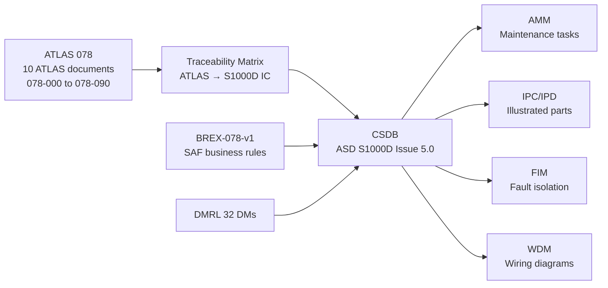
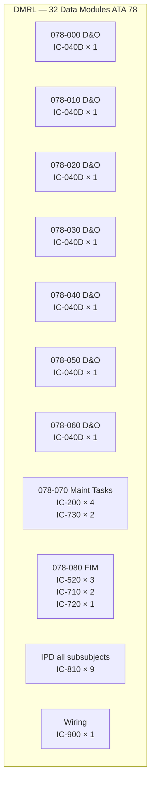

<!-- ──────────────────────────────────────────────────────────────────────────
     QATL-ATLAS-1000-ATLAS-070-079-07-078-090-S1000D-CSDB-MAPPING-AND-TRACEABILITY
     ATA 78 · S1000D CSDB Mapping and Traceability
     AMPEL360E eWTW — ATLAS Register 1000
────────────────────────────────────────────────────────────────────────────── -->

# S1000D CSDB Mapping and Traceability


---

## §0 Hyperlink Policy

> All hyperlinks in this document are **relative** (five directory levels: `../../../../../`).
> Absolute URLs are forbidden. Every linked document must exist in the Q+ATLANTIDE repository
> before the link is activated. Broken links are treated as open issues and must be resolved
> before the document is promoted from `DRAFT` to `APPROVED`.

---

## §1 Purpose

This document (078-090) defines the S1000D Issue 5.0 Common Source Data Base (CSDB) mapping for the AMPEL360E eWTW ATA 78 SAF and Drop-In Compatibility subsection. It provides the Data Module Code (DMC) allocation table, Data Module Requirements List (DMRL), Business Rules Exchange (BREX) reference, and the full traceability matrix linking ATLAS §7 (components), §12 (maintenance), and §14 (certification) content to the corresponding S1000D Information Codes (IC). This document is the single authoritative source for all S1000D publication planning for ATA 78.

---

## §2 Applicability

| Parameter | Value |
|---|---|
| Aircraft Program | AMPEL360E eWTW |
| ATA reference | ATA 78-090 — S1000D CSDB Mapping and Traceability |
| S1000D Issue | S1000D Issue 5.0 |
| CSDB system | ASD Common Source Data Base (CSDB) |
| S1000D SNS | 078-090-00 |
| DMRL total planned DMs | 32 Data Modules across 078-000 through 078-080 |
| BREX identifier | BREX-078-v1 (SAF-specific business rules) |
| Governing standard | ASD S1000D Issue 5.0; ASD S2000M Issue 6.1 |

---

## §3 Functional Description ![DRAFT]

S1000D is the international specification for technical publications for military and civil aircraft, defence products, and complex systems. The AMPEL360E eWTW uses S1000D Issue 5.0 as the basis for all Technical Publications (TP) content — Aircraft Maintenance Manual (AMM), Illustrated Parts Catalogue (IPC/IPD), Fault Isolation Manual (FIM), Wiring Diagram Manual (WDM), and Engine Shop Manual (ESM) — all authored as Data Modules (DMs) stored in the CSDB.

**Data Module Code (DMC) Structure for ATA 78**:

The AMPEL360E eWTW DMC schema follows the S1000D SNS chapter-section-subject numbering aligned with ATA iSpec 2200 / ATA 100. The model identification code is `AMPEL360E-EWTW`. The DMC structure is:

```
DMC-AMPEL360E-EWTW-{SNS chapter}{SNS section}{SNS subject}-{disassembly code}-{disassembly code variant}-{info code}{info code variant}-{language code}{country code}
```

For ATA 78 subsection: SNS chapter = `0078`, section = `{010 to 090}`, subject = `{00 to 00}`.

Example: `DMC-AMPEL360E-EWTW-0078-010-00-040D-A-AAA-EN-US` (FAMQMS 078-010 subsubject, D&O, variant A, English US).

**Information Codes (IC) mapped for ATA 78**:

| IC | Information Code Name | Content Type | ATA 78 Applicability |
|---|---|---|---|
| 040D | Description and Operation (D&O) | Functional description, interfaces | All 078-0xx subsubjects |
| 200 | Scheduled Maintenance (task) | Inspection and replacement tasks | 078-070 |
| 520 | Fault Isolation (FIM) | Diagnostic trees for FAMQMS faults | 078-080 |
| 710 | Functional Check (task) | CTRH, NIR, CWS functional checks | 078-040, 078-080 |
| 720 | Operational Check (task) | FAMQMS power-on BITE check | 078-080 |
| 730 | Visual Check (task) | Seal and sealant visual inspection | 078-070 |
| 810 | Illustrated Parts Data (IPD) | Component breakdown tables | All 078-0xx |
| 900 | Wiring Data | ARINC 429 wiring, FAMQMS harness | 078-080 |

**BREX-078-v1 (Business Rules Exchange)**:

The SAF-specific BREX `BREX-078-v1` extends the aircraft-level BREX with the following ATA 78-specific rules:
- BRX-078-001: All SAF-related DMs shall include ASTM D7566 annex reference in the DM title.
- BRX-078-002: FAMQMS fault codes (FAM-078-Axxx/Fxxx) shall be mapped to FIM DMs as primary diagnostic entry points.
- BRX-078-003: Maintenance DMs for SAF-specific tasks shall include a FAMQMS event log reference in the prerequisite section.
- BRX-078-004: All IPD DMs for wetted components shall include a "SAF compatible: YES/NO @ blend %" attribute in the parts data.
- BRX-078-005: CO₂ lifecycle values shall be sourced from the ICAO CORSIA default value table (Doc 9501 Appendix 1) unless a batch-specific CoS value is available.

---

## §4 Functional Breakdown

| ID | Name | Description | Lead Division |
|---|---|---|---|
| F-001 | DMRL management | Define, maintain, and track the 32-DM DMRL for ATA 78 | Q-DATAGOV |
| F-002 | DMC allocation | Assign and register DMCs in CSDB for each ATA 78 DM | Q-DATAGOV |
| F-003 | BREX-078-v1 | Define and maintain SAF-specific business rules in BREX-078-v1 | Q-DATAGOV |
| F-004 | Traceability matrix | Maintain ATLAS §7/§12/§14 → S1000D IC traceability mapping | Q-DATAGOV |
| F-005 | CSDB publication | Manage CSDB authoring, review, and publication workflow for all 32 ATA 78 DMs | Q-DATAGOV |

---

## §5 System Context — Mermaid Diagram



---

## §6 Internal Architecture — Mermaid Diagram



---

## §7 Components and LRUs

| S1000D Object | DMC (abbreviated) | IC | Publication | Status |
|---|---|---|---|---|
| FAMQMS-078 LRU | DMC-...0078-000-00-040D-A | 040D | AMM General | Planned |
| NIR-SAF-078 sensor | DMC-...0078-010-00-040D-A | 040D | AMM D&O | Planned |
| SAF compatibility basis | DMC-...0078-010-00-040D-B | 040D | AMM D&O | Planned |
| Material compatibility | DMC-...0078-020-00-040D-A | 040D | AMM D&O | Planned |
| Fuel quality/traceability | DMC-...0078-030-00-040D-A | 040D | AMM D&O | Planned |
| SAF storage and handling | DMC-...0078-040-00-040D-A | 040D | AMM D&O | Planned |
| Combustion/emissions | DMC-...0078-050-00-040D-A | 040D | AMM D&O | Planned |
| Certification limits | DMC-...0078-060-00-040D-A | 040D | AMM D&O | Planned |
| SAF maintenance tasks | DMC-...0078-070-00-200-A | 200 | AMM Tasks | Planned |
| FAMQMS fault isolation | DMC-...0078-080-00-520-A | 520 | FIM | Planned |
| FAMQMS wiring data | DMC-...0078-080-00-900-A | 900 | WDM | Planned |

---

## §8 Interfaces

| Interface Type | Connected System | Protocol / Medium | Data / Function |
|---|---|---|---|
| CSDB authoring | CSDB tool (Simplified XML S1000D) | S1000D Issue 5.0 XML schema | DM authoring and validation |
| BREX validation | CSDB BREX engine | BREX-078-v1 rules | Validate all 078-xxx DMs against business rules |
| Publication output | AMM, IPC, FIM, WDM | IETP / PDF / print | Deliver to operators and MRO |
| Traceability input | ATLAS 078 documents (this repo) | Markdown → CSDB DM crosswalk | ATLAS §7/§12/§14 → IC codes |
| Change management | ATLAS change log → CSDB revision | CSDB revision history | ATLAS Rev 0.1 → DMC issue 001 |

---

## §9 Operating Modes

| Mode | Trigger | System State | Actions / Consequences |
|---|---|---|---|
| DMRL initial baseline | ATLAS 078 Rev 0.1 approved | 32 DMs planned; DMCs allocated in CSDB | Authors assigned; authoring starts |
| DM authoring | DMRL item allocated to author | DM in "Draft" status in CSDB | Author produces XML DM per BREX-078-v1 |
| BREX validation | DM submitted for review | Automated BREX check | BRX-078-001 through BRX-078-005 checked; non-conformances raised |
| Technical review | DM approved by BREX; submitted to reviewer | DM in "Review" status | Technical reviewer (Q-MECHANICS / Q-GREENTECH) signs off |
| Publication release | All DMs for a revision approved | DM status = "Released" | Publication assembly; IETP/PDF output |
| ATLAS change → CSDB | ATLAS document revised | Traceability matrix updated | Affected DMs revised and re-released via CSDB change record |

---

## §10 Performance and Budgets ![DRAFT]

| DMRL Metric | Planned | Status |
|---|---|---|
| Total ATA 78 DMs | 32 | ![TBD] |
| D&O (040D) DMs | 9 (one per 078-0xx subsubject) | ![TBD] |
| Maintenance task (200) DMs | 10 (078-070 tasks) | ![TBD] |
| Visual check (730) DMs | 4 (seal, sealant, filter, NIR) | ![TBD] |
| Functional check (710) DMs | 3 (CTRH, NIR cal, CWS check) | ![TBD] |
| Operational check (720) DMs | 1 (FAMQMS BITE) | ![TBD] |
| Fault isolation (520) DMs | 3 (FAMQMS, NIR, CWS faults) | ![TBD] |
| IPD (810) DMs | 1 composite (all 078-0xx LRUs) | ![TBD] |
| Wiring (900) DMs | 1 (FAMQMS harness) | ![TBD] |

---

## §11 Safety, Redundancy and Fault Tolerance

- **BREX-078-v1 enforcement**: Automated BREX validation in CSDB prevents DMs being published without mandatory SAF-specific attributes (FAMQMS fault code references, ASTM D7566 annex tags, CO₂ value sources) — reducing risk of incomplete or misleading maintenance instructions reaching operators.
- **Traceability matrix integrity**: The ATLAS → S1000D traceability matrix is maintained in version control alongside the ATLAS documents; any ATLAS document revision triggers an automatic DMRL change request — preventing orphaned DMs or stale maintenance instructions.
- **CSDB access control**: Q-DATAGOV manages CSDB authoring and release permissions — only authorised technical authors can modify released DMs; all changes require peer review.
- **Dual publication format**: All critical maintenance DMs (IC-200, IC-520, IC-710) are published in both IETP (interactive electronic) and print-ready PDF — operators without IETP capability retain access to maintenance instructions.

---

## §12 Maintenance and Diagnostics

| Task | Interval | Access | Special Tools |
|---|---|---|---|
| DMRL status review | Monthly (during active authoring) | CSDB tool | CSDB project management dashboard |
| BREX-078-v1 rule update | Per ATLAS document revision | CSDB BREX editor | BREX XML editor |
| Traceability matrix review | Per ATLAS document revision | This document (078-090) | Markdown / CSDB crosswalk tool |
| DM peer technical review | Per DM authoring cycle | CSDB review workflow | CSDB DM review + Q-division SME |
| Publication release check | Per CSDB release | CSDB release manager | CSDB publication preview |

---

## §13 Footprint

| Footprint Type | Parameter | Value | Notes |
|---|---|---|---|
| CSDB DM count | 32 DMs planned | ATA 78 subsection | Covers IC-040D, 200, 520, 710, 720, 730, 810, 900 |
| BREX document | BREX-078-v1 | 5 SAF-specific rules | Extension to aircraft-level BREX |
| DMRL document | DMRL-078-v1 | 32 rows | S1000D DMRL format |
| CSDB storage estimate | ~0.8 MB total | 32 DMs × ~25 kB average | XML source; graphics excluded |

---

## §14 Safety and Certification References ![DRAFT]

| Standard / Document | Title | Issuing Body | Applicability |
|---|---|---|---|
| ASD S1000D Issue 5.0 | International Specification for Technical Publications | ASD/AIA/ATA | CSDB, DMC, BREX standard |
| ATA iSpec 2200 | Information Standards for Aviation Maintenance | Airlines for America | SNS chapter-section-subject numbering |
| ASD S2000M Issue 6.1 | International Specification for Materiel Management | ASD | IPD and parts management interface |
| EASA Part 21J | Type Design Organisation Approval | EASA | Control of technical publication content |
| EASA Part 145 AMO | Approved Maintenance Organisation Requirements | EASA | User of CSDB-published maintenance instructions |
| IATA AHM 800 series | Aircraft Maintenance Manual content requirements | IATA | AMM content standards |
| ASD SX001D Issue 1 | S1000D Maintenance Business Rules | ASD | BREX business rules development guidance |

---

## §15 V&V Approach ![TBD]

| Phase | Method | Acceptance Criterion | Status |
|---|---|---|---|
| BREX-078-v1 validation | All 32 DMs validated against BREX-078-v1 in CSDB | Zero BREX non-conformances at release | ![TBD] |
| DMRL completeness review | Cross-check DMRL against all ATLAS §7/§12/§14 items | Every ATLAS §12 task maps to ≥1 IC-200/710/720/730 DM | ![TBD] |
| Traceability matrix coverage | Matrix review — all ATLAS §7 LRUs have IC-810 entry | 100 % ATLAS §7 items in IPD DM | ![TBD] |
| DM technical accuracy review | Q-MECHANICS and Q-GREENTECH subject matter review | All technical data consistent with ATLAS source | ![TBD] |
| IETP rendering test | DM rendered in IETP viewer | Correct graphics, links, warnings displayed | ![TBD] |

---

## §16 Glossary

| Term | Definition |
|---|---|
| S1000D | International ASD specification for technical publications (Issue 5.0) |
| CSDB | Common Source Data Base — S1000D repository for Data Modules |
| DMC | Data Module Code — unique identifier for each S1000D Data Module |
| DMRL | Data Module Requirements List — planned set of DMs for a project |
| BREX | Business Rules Exchange — S1000D document defining project-specific authoring rules |
| IC | Information Code — S1000D classification of DM content type (D&O, task, FIM, IPD, etc.) |
| IC-040D | S1000D information code for Description and Operation |
| IC-200 | S1000D information code for Scheduled Maintenance task |
| IC-520 | S1000D information code for Fault Isolation |
| IC-710 | S1000D information code for Functional Check task |
| IC-720 | S1000D information code for Operational Check task |
| IC-730 | S1000D information code for Visual Check task |
| IC-810 | S1000D information code for Illustrated Parts Data (IPD) |
| IC-900 | S1000D information code for Wiring Data |
| IETP | Interactive Electronic Technical Publication — digital format for S1000D content delivery |
| SNS | Standard Numbering System — S1000D/ATA chapter-section-subject numbering |
| BRX | Business Rule Exchange item — individual rule within a BREX document |
| DM | Data Module — atomic unit of technical information in S1000D |

---

## §17 Open Issues

| ID | Description | Owner | Target |
|---|---|---|---|
| OI-078-090-001 | Complete DMRL-078-v1 with author assignments and planned delivery dates for all 32 DMs | Q-DATAGOV | 2026-Q4 |
| OI-078-090-002 | Register BREX-078-v1 in aircraft-level CSDB and validate against aircraft master BREX | Q-DATAGOV | 2026-Q4 |
| OI-078-090-003 | Define IC-810 IPD DM graphics requirement for NIR-SAF-078 sensor installation diagram | Q-DATAGOV / Q-MECHANICS | 2027-Q1 |
| OI-078-090-004 | Agree CSDB DM numbering convention for FAMQMS fault codes (IC-520) with CMS supplier (ATA 45) | Q-DATAGOV / Q-HPC | 2026-Q4 |
| OI-078-090-005 | Establish traceability from ATLAS 078 open issues to CSDB "TBD" DM placeholders | Q-DATAGOV | 2027-Q1 |

---

## §18 Status Legend

| Badge | Meaning |
|---|---|
| `![DRAFT]` | Section is drafted but not yet reviewed |
| `![TBD]` | Content not yet started — to be defined |
| `![To Be Completed]` | Partially complete — needs additional content |
| `![APPROVED]` | Reviewed and formally approved |

---

## §19 Related Documents (Siblings in this Subsection)

- [078-000](./078-000-SAF-and-Drop-In-Compatibility-General.md)
- [078-010](./078-010-SAF-Fuel-Compatibility-Basis.md)
- [078-020](./078-020-Drop-In-Fuel-Material-Compatibility.md)
- [078-030](./078-030-Fuel-Quality-Contamination-and-Traceability.md)
- [078-040](./078-040-SAF-Storage-Handling-and-Servicing.md)
- [078-050](./078-050-Combustion-Emissions-and-Performance-Effects.md)
- [078-060](./078-060-SAF-Certification-and-Operational-Limits.md)
- [078-070](./078-070-SAF-System-Inspection-Test-and-Maintenance.md)
- [078-080](./078-080-SAF-Monitoring-Diagnostics-and-Control-Interfaces.md)

---

## §20 Change Log

| Rev | Date | Author | Description |
|---|---|---|---|
| 0.1 | 2026-05-12 | @copilot | Initial DRAFT — S1000D CSDB mapping and traceability for ATA 78-090 |
