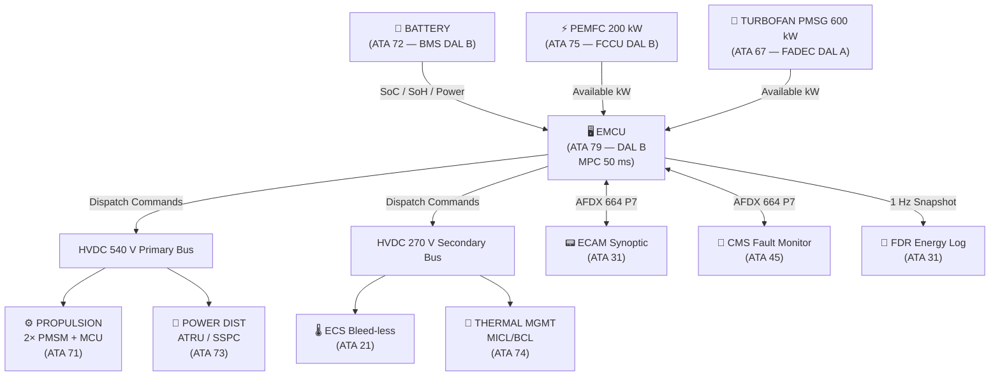
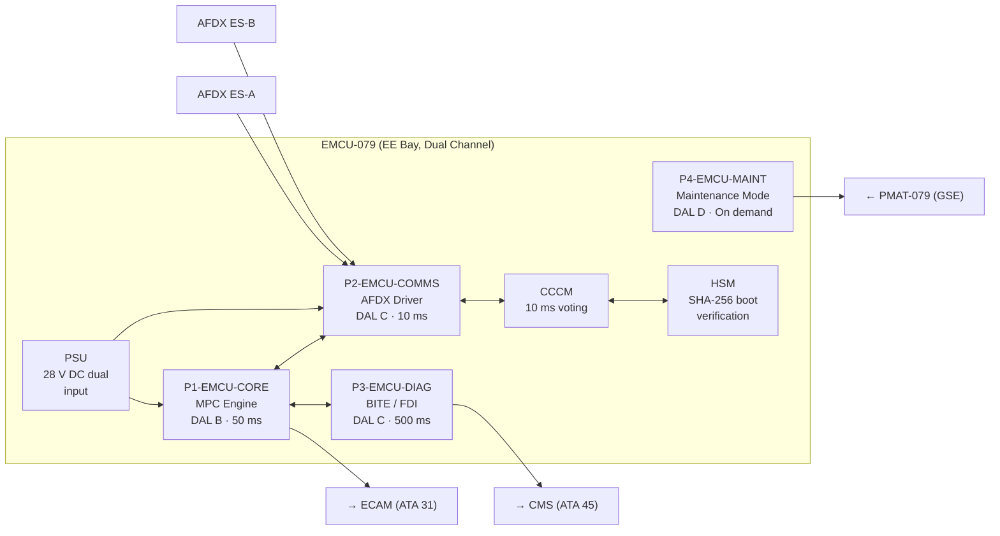

<!-- ──────────────────────────────────────────────────────────────────────────
     QATL-ATLAS-1000-ATLAS-070-079-07-079-000-ENERGY-MANAGEMENT-SYSTEM-GENERAL
     ATA 79 · Energy Management System General
     programme-defined aircraft type — ATLAS Register 1000
────────────────────────────────────────────────────────────────────────────── -->

# Energy Management System General

---

## §0 Hyperlink Policy

> All hyperlinks in this document are **relative** (five directory levels: `../../../../../`).
> Absolute URLs are forbidden. Every linked document must exist in the Q+ATLANTIDE repository
> before the link is activated. Broken links are treated as open issues and must be resolved
> before the document is promoted from `DRAFT` to `APPROVED`.

---

## §1 Purpose

This document defines the agnostic ATLAS standard-level architecture context for `Energy Management System General`.

It describes the controlled scope, functions, interfaces, safety considerations, lifecycle traceability, and S1000D/CSDB mapping logic that programme implementations shall instantiate when this node is applicable.

This document is not a programme design baseline. Programme-specific capacities, locations, part numbers, effectivity, operating limits, maintenance references, and data module codes shall be defined only inside the applicable programme implementation branch.
## §2 Applicability

| Applicability Level | Rule |
|---|---|
| Standard taxonomy | Applies to the ATLAS node `079` |
| Programme implementation | Conditional; determined by programme architecture, trade studies, certification basis, and applicability model |
| Product configuration | Defined in the programme-specific configuration baseline |
| Effectivity | Defined in the programme CSDB / applicability layer |
| Non-applicability | Must be explicitly stated in the programme impact-study branch when excluded |
## §3 Functional Description ![DRAFT]

The EMCU executes a **Model Predictive Control (MPC)** algorithm at a **50 ms cycle time**, predicting a **60-second energy demand horizon** across the aircraft's full electrical load envelope.

### 3.1 Power Sources

Three primary electrical energy sources are available to the EMCU for dispatch:

| Source | Interface | Max Rated Output | Bus |
|--------|-----------|-----------------|-----|
| HVDC Battery (<BATTERY-CHEMISTRY>) | BMS via AFDX | 0–400 kW (discharge) | HVDC 540 V |
| PEMFC Module | FCCU via AFDX | 0–200 kW | HVDC 270 V |
| Turbofan PMSG Generator | FADEC via AFDX | 0–600 kW | HVDC 540 V |

Total installed electrical generation capacity = **1 200 kW**.
Maximum simultaneous design demand < **900 kW**.
Design margin ≥ **25 %** above peak demand.

### 3.2 Load Priority Classes

All aircraft electrical consumers are classified into three priority tiers:

| Class | Description | Examples | Sheddable |
|-------|-------------|---------|-----------|
| Class 1 | Critical / Flight Safety | Flight controls (ATA 27), avionics (ATA 34), cockpit displays (ATA 31), navigation (ATA 34) | **Never** |
| Class 2 | Essential | ECS (ATA 21), fuel pumps (ATA 76), hydraulic backup pumps (ATA 29), landing gear actuation (ATA 32) | Partial — with ECAM MASTER WARNING |
| Class 3 | Normal / Comfort | Galleys, IFE, cabin lighting (non-essential), passenger services | Automatic — ECAM MASTER CAUTION |

### 3.3 MPC Algorithm Overview

The EMCU MPC engine (partition P1-EMCU-CORE, DAL B):

1. Collects 14 demand inputs via AFDX at 50 ms intervals.
2. Constructs a 20-step (60 s) prediction horizon using a linear state-space model.
3. Solves a quadratic programming (QP) optimisation problem minimising: (a) deviation of battery SoC from target band [30 %–80 %], and (b) specific fuel consumption penalty from PMSG off-take.
4. Outputs a power dispatch vector to BMS, FCCU, and FADEC.
5. Publishes a power budget message to all Class 2/3 load controllers via AFDX at 100 ms.

---

## §4 Functional Breakdown

| ID | Function | Cycle | Interface |
|----|----------|-------|-----------|
| F-001 | Energy source dispatch (MPC engine) | 50 ms | BMS, FCCU, FADEC |
| F-002 | Load priority management | 50 ms | SSPC arrays (ATA 73) |
| F-003 | Battery SoC / SoH management | 200 ms | BMS (ATA 72) |
| F-004 | PEMFC demand signalling | 100 ms | FCCU (ATA 75) |
| F-005 | Turbofan PMSG off-take scheduling | 100 ms | FADEC (ATA 67) |
| F-006 | Thermal load coordination with TMC | 200 ms | TMC (ATA 74) |
| F-007 | Fault detection and energy degraded mode activation | 50 ms | Internal / ECAM / CMS |
| F-008 | AFDX health reporting to CMS / ECAM | 100 ms | CMS (ATA 45), ECAM (ATA 31) |
| F-009 | FDR energy data snapshot | 1 Hz | FDR (ATA 31) |
| F-010 | Regenerative energy capture coordination | 50 ms | BMS, MCU (ATA 71) |

---

## §5 System Context — Mermaid Diagram

---

## §6 Internal Architecture — Mermaid Diagram

---

## §7 Components and LRUs

| LRU Part Number | Qty | Location | Description | DAL |
|----------------|-----|----------|-------------|-----|
| EMCU-079 | 1 | EE Bay Zone 100 | Energy Management Control Unit (dual-channel) | DO-254 DAL B |
| EMCU-PSUP-079 | 1 | EE Bay Zone 100 | EMCU Power Supply Unit (28 V DC dual redundant) | DAL C |
| EMCU-IO-079 | 2 | EE Bay Zone 100 | EMCU I/O Expander Module (discrete & analogue I/O) | DAL C |
| EMCU-HSM-079 | 1 | Integral to EMCU-079 | Hardware Security Module (SHA-256 firmware integrity) | DAL B |
| EMCU-DISP-079 | 1 | Cockpit / ECAM (ATA 31) | EMS synoptic display module (ECAM hosted) | DAL C |

### 7.1 EMCU-079 Key Specifications

| Parameter | Value |
|-----------|-------|
| Dimensions | 4 MCU (ARINC 600) |
| Mass (TBD) | ≤ 3.5 kg (estimate) |
| Power consumption | ≤ 45 W (28 V DC) |
| Operating temperature | −55 °C to +70 °C (DO-160G Cat. A2) |
| MTBF | ≥ 50 000 FH |
| Shelf life | 10 years |
| Software certification | DO-178C DAL B (P1), DAL C (P2, P3), DAL D (P4) |
| Hardware certification | DO-254 DAL B |

---

## §8 Interfaces

| Interface | Direction | Protocol | Cycle | ATA Peer |
|-----------|-----------|----------|-------|----------|
| BMS energy data | In | AFDX ARINC 664 P7 | 50 ms | ATA 72 |
| FCCU available power | In | AFDX ARINC 664 P7 | 100 ms | ATA 75 |
| FADEC PMSG capacity | In/Out | AFDX ARINC 664 P7 | 100 ms | ATA 67 |
| MCU torque demand | In | AFDX ARINC 664 P7 | 50 ms | ATA 71 |
| TMC thermal limits | In/Out | AFDX ARINC 664 P7 | 200 ms | ATA 74 |
| SSPC load control | Out | AFDX ARINC 664 P7 | 100 ms | ATA 73 |
| ATRU status | In | AFDX ARINC 664 P7 | 200 ms | ATA 73 |
| ECS controller demand | In | AFDX ARINC 664 P7 | 200 ms | ATA 21 |
| ECAM EMS synoptic | Out | AFDX ARINC 664 P7 | 200 ms | ATA 31 |
| CMS fault codes | Out | AFDX ARINC 664 P7 | 100 ms | ATA 45 |
| FDR energy snapshot | Out | AFDX ARINC 664 P7 | 1 Hz | ATA 31 |
| PMAT-079 maintenance | In/Out | Ethernet 1 Gbps | On demand | GSE |
| Emergency discrete | In | Discrete 28 V | < 10 ms | ATA 24 |

---

## §9 Operating Modes

| Mode | Phase | Active Sources | Battery Target SoC | Load Classes |
|------|-------|---------------|-------------------|--------------|
| GROUND | Pre-departure / post-arrival | GPU or PMSG (APU) | Charging to 80 % | 1, 2, 3 |
| TAXI | Ground movement | PMSG + Battery | 70–80 % | 1, 2, 3 |
| TAKEOFF | T/O roll + initial climb | PMSG + PEMFC + Battery | 50–80 % | 1, 2, 3 |
| CLIMB | From 1 500 ft to cruise FL | PMSG + PEMFC | 45–75 % | 1, 2, 3 |
| CRUISE | Cruise FL | PMSG primary, PEMFC supplement | 40–70 % | 1, 2, 3 |
| DESCENT | TOD to FAF | PMSG + regen battery charging | Charging 50–80 % | 1, 2, 3 |
| APPROACH | FAF to threshold | PMSG + Battery | 45–70 % | 1, 2, 3 |
| LANDING | Touchdown + rollout | PMSG + Battery | 40–70 % | 1, 2 |
| EMERGENCY | Any phase — DM-5 | Battery only (reserve) | ≥ 20 % | 1 only |
| MAINTENANCE | On ground, aircraft powered | PMSG (GPU) | Any | 1, 2, 3 |

---

## §10 Performance and Budgets ![DRAFT]

| Parameter | Requirement | Note |
|-----------|-------------|------|
| Total installed generation capacity | 1 200 kW | PMSG 600 + PEMFC 200 + Battery 400 |
| Maximum simultaneous demand | < 900 kW | Verified by load analysis |
| Design margin | ≥ 25 % | Above peak demand |
| MPC cycle time | 50 ms | DO-178C DAL B verified |
| Prediction horizon | 60 s (20 steps × 3 s) | Linear MPC |
| Battery SoC target band | 30 %–80 % | Normal operations |
| Battery SoC minimum (DM-5 reserve) | ≥ 20 % | 30 min Class 1 power |
| EMCU system availability | ≥ 99.9 % | Per mission |
| EMCU channel switchover time | < 100 ms | Dual-channel |
| CCCM cycle | 10 ms | Cross-channel monitoring |
| Load shedding decision latency | < 50 ms | From imbalance detection |
| ECAM advisory latency | < 1 s | From fault detection |
| AFDX message latency | < 5 ms | End-to-end |

---

## §11 Safety, Redundancy and Fault Tolerance

### 11.1 Redundancy Architecture

- **Dual-channel EMCU** (Channel A / Channel B) with Cross-Channel Comparison Monitor (CCCM) running at 10 ms cycle.
- **Channel switchover** < 100 ms, transparent to connected subsystems.
- **Dual power supply** (28 V DC essential bus + 28 V DC hot standby bus, ATA 24/73).
- **Dual AFDX** star topology (ES-A primary / ES-B secondary, ARINC 664 P7).

### 11.2 Fault Tolerance

- Single-fault tolerant for all Class 1 load power supply functions.
- Class 1 loads **cannot** be shed by any EMCU automatic action.
- No single point of failure in the EMCU can cause loss of Class 1 power.

### 11.3 Certification Requirements

| Standard | Requirement |
|----------|-------------|
| EASA CS-25 §25.1353 | Electrical equipment and installations |
| EASA CS-25 §25.1309 | Equipment, systems and installations — FHA + FMEA |
| DO-178C | DAL B for P1-EMCU-CORE |
| DO-254 | DAL B for EMCU hardware |
| SAE ARP4754A | System development process |
| DO-160G | Environmental qualification |

### 11.4 Watchdog and Integrity

- Hardware watchdog on each EMCU channel (timeout 150 ms → channel reset).
- HSM verifies firmware SHA-256 digest at each power-on boot.
- CCCM disagreement > 5 % on any power dispatch output → ECAM MASTER CAUTION + single-channel degraded mode.

---

## §12 Maintenance and Diagnostics

| Maintenance Event | Interval | Duration | Tool Required |
|------------------|----------|----------|--------------|
| BITE data download | A-check (600 FH) | ~10 min | PMAT-079 |
| Functional verification | C-check (6 000 FH) | ~4 hr | GTU-EMCU-079 |
| MPC parameter verification | C-check | ~30 min | PMAT-079 |
| Software integrity hash check | Annual | ~5 min | PMAT-079 |
| EMCU-079 swap-out | On condition | ≤ 45 min | Standard hand tools |
| EMCU-IO-079 swap | On condition | ~20 min | Standard hand tools |
| EMCU-PSUP-079 swap | On condition | ~15 min | Standard hand tools |

BITE provides three levels of diagnostic coverage:
- **Level 1** (flight BITE): continuous 50 ms monitoring, fault storage in NVM.
- **Level 2** (ground BITE): extended diagnostics via PMAT-079, LRU-level isolation.
- **Level 3** (shop BITE): full bench verification of all EMCU internal functions.

---

## §13 Footprint

| Attribute | Value |
|-----------|-------|
| EMCU-079 location | EE Bay Zone 100, Rack R-079 |
| Form factor | 4 MCU ARINC 600 |
| Mass estimate | ≤ 3.5 kg |
| Power consumption | ≤ 45 W |
| AFDX connection | Dual-star (ES-A + ES-B), 100BASE-TX |
| Cooling | Forced-air (EE bay HVAC) |
| Connector | ARINC 600 Series I, 100-pin |

---

## §14 Safety and Certification References ![DRAFT]

| Reference | Description |
|-----------|-------------|
| EASA CS-25 Amdt 27, §25.1353 | Electrical equipment — current overload protection |
| EASA CS-25 §25.1309 | Equipment, systems — safety assessment |
| DO-178C (RTCA) | Software considerations in airborne systems (DAL B) |
| DO-254 (RTCA) | Design assurance guidance for airborne electronic hardware (DAL B) |
| DO-160G (RTCA) | Environmental conditions and test procedures |
| SAE ARP4754A | Guidelines for development of civil aircraft and systems |
| ARINC 664 Part 7 | Aircraft data network — AFDX |
| RTCA DO-297 | Integrated modular avionics (IMA) development guidance |
| EASA AMC 20-115D | Software aspects of certification |
| EASA AMC 25.1309 | System safety assessment methodology |

---

## §15 V&V Approach ![TBD]

| Phase | Activity | Standard |
|-------|----------|----------|
| Design | Functional Hazard Assessment (FHA), FMEA, Fault Tree Analysis | SAE ARP4754A |
| Software | MC/DC coverage ≥ 100 % for DAL B (P1-EMCU-CORE) | DO-178C |
| Hardware | DO-254 DAL B verification plan | DO-254 |
| Integration | Hardware-In-Loop (HIL) test with simulated BMS/FCCU/FADEC | SAE ARP4754A |
| Environmental | DO-160G qualification (temperature, vibration, EMI, lightning) | DO-160G |
| Certification | EASA certification flight test — all operating modes and degraded modes | EASA CS-25 |
| Maintenance | C-check functional test via GTU-EMCU-079 | AMM Chapter 79 |

---

## §16 Glossary

| Acronym | Definition |
|---------|-----------|
| AFDX | Avionics Full-Duplex Switched Ethernet (ARINC 664 P7) |
| ATRU | Auto-Transformer Rectifier Unit |
| BMS | Battery Management System |
| CCCM | Cross-Channel Comparison Monitor |
| DAL | Design Assurance Level |
| ECS | Environmental Control System |
| EMCU | Energy Management Control Unit |
| FADEC | Full Authority Digital Engine Control |
| FCCU | Fuel Cell Control Unit |
| FDR | Flight Data Recorder |
| HSM | Hardware Security Module |
| HVDC | High-Voltage Direct Current |
| IFE | In-Flight Entertainment |
| LRU | Line Replaceable Unit |
| MCU | Motor Control Unit |
| MPC | Model Predictive Control |
| MTBF | Mean Time Between Failures |
| NMC | Nickel Manganese Cobalt (battery chemistry) |
| PEMFC | Proton Exchange Membrane Fuel Cell |
| PMSG | Permanent Magnet Synchronous Generator |
| PMSM | Permanent Magnet Synchronous Motor |
| PMAT | Portable Maintenance Access Terminal |
| QP | Quadratic Programming |
| SoC | State of Charge |
| SoH | State of Health |
| SSPC | Solid-State Power Controller |
| TMC | Thermal Management Controller |

---

## §17 Open Issues

| ID | Description | Owner | Target |
|----|-------------|-------|--------|
| OI-079-000-001 | Finalise EMCU OEM selection and freeze hardware specification | Q-GREENTECH | 2026-Q3 |
| OI-079-000-002 | Complete FHA for dual energy source simultaneous failure scenario | Q-GREENTECH / Q-AIR | 2026-Q4 |
| OI-079-000-003 | Validate MPC prediction accuracy ≥ 90 % against HIL test data | Q-HPC | 2027-Q1 |
| OI-079-000-004 | Confirm EMCU mass budget ≤ 3.5 kg with OEM dimensional data | Q-MECHANICS | 2026-Q4 |
| OI-079-000-005 | Resolve CCCM disagreement threshold with safety assessment team | Q-GREENTECH | 2026-Q3 |

---

## §18 Status Legend

| Badge | Meaning |
|-------|---------|
|  | Content drafted but not yet reviewed by all stakeholders |
|  | Content to be determined — open issue raised |
|  | Content reviewed, approved and baselined |
|  | Replaced by a later revision |

---

## §19 Related Documents (Siblings in this Subsection)

| Document ID | Title | SNS |
|-------------|-------|-----|
| [079-010](./079-010-Energy-Management-Architecture.md) | Energy Management Architecture | 079-010-00 |
| [079-020](./079-020-Power-Demand-Prediction-and-Allocation.md) | Power Demand Prediction and Allocation | 079-020-00 |
| [079-030](./079-030-Energy-Source-Prioritization-and-Load-Shedding.md) | Energy Source Prioritization and Load Shedding | 079-030-00 |
| [079-040](./079-040-Propulsion-and-ECS-Energy-Coordination.md) | Propulsion and ECS Energy Coordination | 079-040-00 |
| [079-050](./079-050-Energy-Degraded-Modes-and-Reconfiguration.md) | Energy Degraded Modes and Reconfiguration | 079-050-00 |
| [079-060](./079-060-Energy-Management-Software-and-Configuration.md) | Energy Management Software and Configuration | 079-060-00 |
| [079-070](./079-070-Energy-Management-Test-and-Maintenance.md) | Energy Management Test and Maintenance | 079-070-00 |
| [079-080](./079-080-Energy-Management-Monitoring-Diagnostics-and-Control-Interfaces.md) | Energy Management Monitoring, Diagnostics and Control Interfaces | 079-080-00 |
| [079-090](./079-090-S1000D-CSDB-Mapping-and-Traceability.md) | S1000D CSDB Mapping and Traceability | 079-090-00 |

**Cross-ATA References:**

| ATA | Title | Relevance |
|-----|-------|-----------|
| [ATA 21](../../021_ECS/README.md) | Environmental Control System | ECS load scheduling |
| [ATA 27](../../027_Flight-Controls/README.md) | Flight Controls | Class 1 loads |
| [ATA 31](../../031_Instruments/README.md) | Instruments / ECAM / FDR | EMS synoptic, energy log |
| [ATA 45](../../045_CMS/README.md) | Central Maintenance System | Fault monitoring |
| [ATA 67](../../067_FADEC/README.md) | FADEC / Engine Control | PMSG off-take |
| [ATA 71](../../071_Propulsion-Electric/README.md) | Electric Propulsion (PMSM/MCU) | Motor power demand |
| [ATA 72](../../072_Battery/README.md) | Battery System (BMS) | Energy storage |
| [ATA 73](../../073_Power-Distribution/README.md) | Power Distribution (ATRU/SSPC) | Load switching |
| [ATA 74](../../074_Thermal-Management/README.md) | Thermal Management (TMC) | Thermal limits |
| [ATA 75](../../075_Fuel-Cell/README.md) | Fuel Cell System (FCCU) | PEMFC dispatch |
| [ATA 76](../../076_LH2-Fuel/README.md) | LH₂ Fuel System | Fuel pump loads |

---

## §20 Change Log

| Rev | Date | Author | Description |
|-----|------|--------|-------------|
| 0.1 | 2026-05-12 | Q-GREENTECH | Initial DRAFT — baseline document creation |
