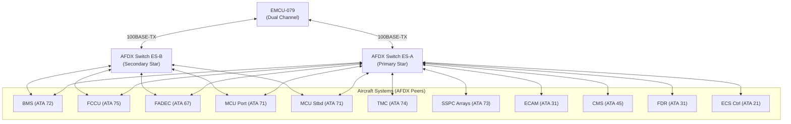
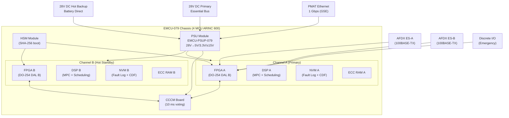

<!-- ──────────────────────────────────────────────────────────────────────────
     QATL-ATLAS-1000-ATLAS-070-079-07-079-010-ENERGY-MANAGEMENT-ARCHITECTURE
     ATA 79 · Energy Management Architecture
     AMPEL360E eWTW — ATLAS Register 1000
────────────────────────────────────────────────────────────────────────────── -->

# Energy Management Architecture

---

## §0 Hyperlink Policy

> All hyperlinks in this document are **relative** (five directory levels: `../../../../../`).
> Absolute URLs are forbidden. Every linked document must exist in the Q+ATLANTIDE repository
> before the link is activated. Broken links are treated as open issues and must be resolved
> before the document is promoted from `DRAFT` to `APPROVED`.

---

## §1 Purpose

This document defines the hardware and software architecture of the **Energy Management Control Unit (EMCU)** for the AMPEL360E eWTW aircraft. It describes the dual-channel redundancy model, FPGA/DSP hybrid processing approach, AFDX dual-star data bus topology, ARINC 653 partitioned operating system structure, Hardware Security Module (HSM) firmware integrity verification, and integration interfaces with all energy subsystems.

This document is the architectural reference for all EMCU design, integration, and certification activities. It informs the software architecture document (079-060), the test and maintenance plan (079-070), and the monitoring interfaces document (079-080).

---

## §2 Applicability

| Field | Value |
|-------|-------|
| Aircraft Program | AMPEL360E eWTW |
| ATA Reference | ATA 79-010 |
| Certification Basis | EASA CS-25 Amendment 27+, DO-178C, DO-254 |
| S1000D SNS | 079-010-00 |
| Applicable MSN | All AMPEL360E eWTW series aircraft |
| Effectivity | From MSN 001 |

---

## §3 Functional Description ![DRAFT]

### 3.1 Dual-Channel Architecture

The EMCU is a **dual-channel LRU** housed in a single ARINC 600 4-MCU chassis. Channel A (primary) and Channel B (hot standby) execute identical control algorithms in parallel. A dedicated **Cross-Channel Comparison Monitor (CCCM)** board compares both channels' output dispatch vectors at a **10 ms** cycle.

- If Channel A and Channel B agree within tolerance: Channel A outputs are used.
- If CCCM detects disagreement > 5 % on any power dispatch value: ECAM MASTER CAUTION is generated, and the EMCU transitions to single-channel degraded mode (DM-4) using Channel B.
- Channel switchover is completed in **< 100 ms**, transparent to all AFDX-connected subsystems.

### 3.2 Processing Architecture

Each channel uses a **hybrid FPGA + DSP** processing architecture:

| Component | Role | Device Class |
|-----------|------|-------------|
| FPGA | Hard real-time I/O handling, CCCM input processing, AFDX frame assembly | DO-254 DAL B FPGA |
| DSP | MPC QP solver, floating-point calculations, partition scheduling | Commercial-grade rad-tolerant DSP |
| NVM | Fault log storage (≥ 10 000 entries), configuration data | NAND flash with ECC |
| RAM | Runtime workspace (ARINC 653 partition memory spaces) | ECC SDRAM |

### 3.3 ARINC 653 Partitioned OS

The EMCU software executes under an **ARINC 653 Issue 2** compliant partitioned Real-Time Operating System (RTOS). Four partitions provide temporal and spatial separation:

| Partition | Name | DAL | Cycle | Function |
|-----------|------|-----|-------|---------|
| P1 | P1-EMCU-CORE | B | 50 ms | MPC engine, source dispatch, load management |
| P2 | P2-EMCU-COMMS | C | 10 ms | AFDX dual-star driver, message routing |
| P3 | P3-EMCU-DIAG | C | 500 ms | BITE Level 1/2, FDI, CMS health reporting |
| P4 | P4-EMCU-MAINT | D | On demand | Maintenance mode, PMAT interface, CDF management |

Partition memory is protected by MMU (Memory Management Unit) to prevent any cross-partition write violation. A DAL D partition (P4) **cannot** corrupt a DAL B partition (P1) memory space.

### 3.4 Power Supply Architecture

| Input | Source | Nominal Voltage | Redundancy |
|-------|--------|----------------|-----------|
| Primary | 28 V DC Essential Bus | 22–29 V DC | Essential bus |
| Hot backup | 28 V DC Hot Bus | 22–29 V DC | Battery direct |

The EMCU-PSUP-079 provides internal DC/DC conversion to 5 V (logic), 3.3 V (FPGA), and ±15 V (analogue I/O). Auto-changeover from primary to hot backup < 2 ms.

### 3.5 HSM Firmware Integrity

The **Hardware Security Module (HSM)** performs a SHA-256 digest verification of all EMCU software partitions at every power-on boot, before allowing the RTOS to start. If any partition digest fails:
- EMCU enters **Safe Mode**: all outputs held at zero.
- ECAM MASTER WARNING generated.
- CMS fault code EMCU-079-0001 (HSM BOOT FAIL) raised.
- Aircraft must not be dispatched until EMCU software is reloaded and verified.

---

## §4 Functional Breakdown

| ID | Function | Description | Cycle | DAL |
|----|----------|-------------|-------|-----|
| F-001 | Dual-channel parallel processing | Channel A/B execute identical algorithms, CCCM compares | 10 ms (CCCM) | B |
| F-002 | CCCM voting logic | Compare A/B dispatch vectors, trigger DM-4 on disagreement | 10 ms | B |
| F-003 | AFDX dual-star communication | AFDX ES-A primary, ES-B secondary; auto-switch on ES-A failure | 10 ms | C |
| F-004 | Power dispatch command interface | Issue BMS/FCCU/FADEC dispatch commands via AFDX | 50 ms | B |
| F-005 | HSM firmware integrity verification | SHA-256 boot check; safe mode on failure | Boot | B |
| F-006 | Configuration data management | CDF per DO-178C §7; dual-key update authorization | On change | B |
| F-007 | ARINC 653 partitioned OS | 4 partitions (P1–P4) with time/space separation | Partition-specific | B/C/D |
| F-008 | Redundant power supply management | Auto-changeover < 2 ms on primary PSU failure | Continuous | C |
| F-009 | NVM fault log management | Store ≥ 10 000 fault events with timestamp | On fault | C |
| F-010 | PMAT maintenance interface | Ethernet 1 Gbps + ARINC 429 legacy port | On demand | D |

---

## §5 System Context — Mermaid Diagram

---

## §6 Internal Architecture — Mermaid Diagram

---

## §7 Components and LRUs

| LRU Part Number | Qty | Location | Description | Replaceability |
|----------------|-----|----------|-------------|---------------|
| EMCU-079 | 1 | EE Bay R-079 | Dual-channel EMCU chassis (Channel A/B, CCCM, HSM) | Field (≤ 45 min) |
| EMCU-PSUP-079 | 1 | Integral to EMCU-079 | PSU module (28 V → 5/3.3/±15 V, dual input) | Field (≤ 15 min) |
| EMCU-IO-079 | 2 | EE Bay R-079 | I/O expander (discrete + analogue, DO-254 DAL C) | Field (≤ 20 min) |
| EMCU-HSM-079 | 1 | Integral to EMCU-079 | Hardware Security Module (non-field replaceable) | Shop only |
| AFDX-SW-ESA | 1 | EE Bay (shared, ATA 73) | AFDX Primary Star Switch (shared with other systems) | ATA 73 AMM |
| AFDX-SW-ESB | 1 | EE Bay (shared, ATA 73) | AFDX Secondary Star Switch (shared with other systems) | ATA 73 AMM |

### 7.1 Channel A / B Board Assembly

| Subcomponent | Specification | Qty per Channel |
|-------------|---------------|----------------|
| FPGA | Xilinx Virtex UltraScale+ (or equivalent DO-254 DAL B qualified) | 1 |
| DSP | Texas Instruments TMS320C6748 (or equivalent rad-tolerant) | 1 |
| NVM | 256 MB NAND Flash with 8-bit ECC | 1 |
| ECC RAM | 512 MB DDR4 ECC SDRAM | 2 (dual-rank) |
| Crystal oscillator | TCXO 40 MHz ±0.5 ppm (DO-160G qualified) | 1 |

---

## §8 Interfaces

| Interface ID | Signal Name | Direction | Protocol | Connector | Notes |
|-------------|------------|-----------|----------|-----------|-------|
| INT-001 | AFDX ES-A Data | In/Out | ARINC 664 P7, 100BASE-TX | ARINC 600 J3 | Primary AFDX |
| INT-002 | AFDX ES-B Data | In/Out | ARINC 664 P7, 100BASE-TX | ARINC 600 J4 | Secondary AFDX |
| INT-003 | 28 V DC Primary | In | 28 V DC, 5 A max | ARINC 600 J1 | Essential bus |
| INT-004 | 28 V DC Hot Backup | In | 28 V DC, 5 A max | ARINC 600 J2 | Battery direct |
| INT-005 | Emergency Discrete In | In | 28 V DC discrete | ARINC 600 J5 | ATA 24 emergency bus |
| INT-006 | WoW Discrete In | In | 28 V DC discrete | ARINC 600 J5 | Weight-on-wheels (ground lock) |
| INT-007 | PMAT Ethernet | In/Out | Ethernet 1 Gbps (GSE) | RJ-45 panel port | L2/L3 BITE access |
| INT-008 | ARINC 429 Legacy | In/Out | ARINC 429 high-speed | ARINC 600 J6 | Legacy GSE compatibility |
| INT-009 | Channel A/B CCCM Bus | Internal | Proprietary 10 ms | Internal backplane | Not externally accessible |

---

## §9 Operating Modes

| Mode | Condition | Channel State | Optimization | Notes |
|------|-----------|--------------|-------------|-------|
| Normal Dual-Channel | Both channels healthy, CCCM agrees | A active, B mirroring | Full MPC optimization | Nominal |
| Single-Channel Degraded (DM-4) | Channel A CCCM disagreement or hardware fault | B active, A offline | Reduced optimization (reactive fallback) | ECAM CAUTION |
| Safe Mode | HSM boot failure | Neither active | None — all outputs zero | Dispatch prohibited |
| Maintenance Mode | Weight-on-Wheels, PMAT connected | A active (P4 enabled) | Manual override allowed | Ground only |
| Reboot/Recovery | Post-fault recovery sequence | Restarting | None during recovery | < 30 s recovery |

---

## §10 Performance and Budgets ![DRAFT]

| Parameter | Requirement | Measured/Estimated |
|-----------|-------------|-------------------|
| CCCM cycle time | 10 ms | 10 ms (design) |
| Channel switchover time | < 100 ms | 80 ms (estimate) |
| AFDX end-to-end latency | < 5 ms | 3.5 ms (estimate) |
| EMCU processing load (P1-CORE) | < 70 % WCET | TBD by HIL test |
| HSM boot verification time | < 2 s | 1.8 s (estimate) |
| PSU auto-changeover | < 2 ms | 1.5 ms (design) |
| NVM fault log capacity | ≥ 10 000 entries | 10 000 (design) |
| EMCU system availability | ≥ 99.9 % | TBD |
| Channel A MTBF | ≥ 100 000 FH | TBD (OEM) |
| PSU efficiency | > 90 % | 92 % (design estimate) |

---

## §11 Safety, Redundancy and Fault Tolerance

### 11.1 Fault Containment

- ARINC 653 time/space partitioning prevents any lower-DAL partition (P4 DAL D) from corrupting higher-DAL partition (P1 DAL B) memory or execution.
- CCCM is implemented in a physically separate FPGA-based board — failure of the CCCM board defaults to Channel A control with ECAM MASTER CAUTION.
- Dual power supply ensures EMCU remains powered through any single bus fault.

### 11.2 Single-Fault Tolerance Matrix

| Failure | Effect | System Response | Safety Outcome |
|---------|--------|----------------|---------------|
| Channel A failure | DM-4 — Channel B takes control | ECAM CAUTION, < 100 ms switchover | Acceptable — continued safe flight |
| Channel B failure | Channel A continues solo | ECAM CAUTION — DM-4 | Acceptable |
| CCCM board failure | Default to Channel A, DM-4 | ECAM CAUTION | Acceptable |
| PSU primary failure | Hot backup takes over < 2 ms | Transparent | No effect on output |
| PSU total failure | EMCU power loss | DM-5 activation (bus monitoring) | Acceptable — emergency mode |
| HSM failure at boot | Safe mode — no dispatch | ECAM WARNING, no dispatch | Aircraft must not be dispatched |
| AFDX ES-A failure | Switch to ES-B | Automatic AFDX redundancy | No effect on function |

### 11.3 Certification Requirements

| Requirement | Standard | EMCU Compliance |
|-------------|----------|----------------|
| DAL B software (P1) | DO-178C | Full compliance, MC/DC 100 % |
| DAL B hardware | DO-254 | Full compliance, FPGA verified |
| Environmental qualification | DO-160G | Category A2, vibration, EMI |
| System safety | SAE ARP4754A | FHA + FMEA completed at SRR |
| AFDX compliance | ARINC 664 P7 | Verified by end-system conformance test |

---

## §12 Maintenance and Diagnostics

| Task | Interval | Duration | Tool | Procedure |
|------|----------|----------|------|-----------|
| BITE Level 1 data download | A-check | 10 min | PMAT-079 | AMM 79-010-10 |
| Channel A/B health check | C-check | 1 hr | GTU-EMCU-079 | AMM 79-010-20 |
| CCCM disagreement log review | C-check | 30 min | PMAT-079 | AMM 79-010-30 |
| HSM integrity check (manual) | Each power-on (automatic) | < 2 s | Automatic | None required |
| EMCU-079 swap | On condition | ≤ 45 min | Standard hand tools | AMM 79-010-40 |
| EMCU-PSUP-079 swap | On condition | ≤ 15 min | Standard hand tools | AMM 79-010-50 |
| PMAT L2 BITE diagnostic session | On condition | 30 min | PMAT-079 | AMM 79-010-60 |

---

## §13 Footprint

| Attribute | Value |
|-----------|-------|
| Chassis location | EE Bay Zone 100, Rack R-079, Slot 4 |
| Form factor | 4 MCU ARINC 600 (Series I) |
| External dimensions (estimate) | 194 mm × 160 mm × 320 mm |
| Mass (estimate) | ≤ 3.5 kg |
| Connector type | ARINC 600 Series I — 6 connectors (J1–J6) |
| AFDX ports | 2 × 100BASE-TX RJ-45 (internal to ARINC 600) |
| PMAT port | 1 × RJ-45 Ethernet 1 Gbps (panel-accessible) |
| Cooling requirement | EE bay forced-air (minimum 0.5 m³/min at 40 °C inlet) |

---

## §14 Safety and Certification References ![DRAFT]

| Reference | Description |
|-----------|-------------|
| DO-178C | Software certification — DAL B for P1, DAL C for P2/P3, DAL D for P4 |
| DO-254 | Hardware certification — DAL B for FPGA |
| ARINC 653 Issue 2 | Partitioned OS specification |
| ARINC 664 Part 7 | AFDX specification |
| DO-160G | Environmental qualification |
| MIL-STD-1553B | Not applicable — AFDX preferred and used exclusively |
| EASA AMC 20-115D | Software aspects of certification (adapted for DO-178C) |
| SAE ARP4754A | System development guidelines |
| SAE ARP4761 | Safety assessment guidelines |
| RTCA DO-297 | IMA development guidance |

---

## §15 V&V Approach ![TBD]

| Phase | Activity | Pass Criterion | Standard |
|-------|----------|---------------|----------|
| Software unit test | MC/DC coverage for P1-EMCU-CORE | 100 % MC/DC coverage | DO-178C |
| FPGA verification | Functional verification of CCCM logic | All test vectors pass | DO-254 |
| Integration test | EMCU with simulated BMS/FCCU/FADEC/MCU | All interface messages correct | SAE ARP4754A |
| HIL test | Full EMS operation on Hardware-In-Loop rig | All operating modes verified | SAE ARP4754A |
| DO-160G qualification | Temperature, vibration, EMI, lightning | All DO-160G categories pass | DO-160G |
| CCCM test | Inject intentional Channel A/B disagreement | DM-4 activates within 100 ms | DO-178C |
| HSM test | Corrupt P1 firmware digest | Safe mode activates, no dispatch | DO-178C |
| Certification flight test | All modes, degraded mode activation | EASA evaluator approval | EASA CS-25 |

---

## §16 Glossary

| Acronym | Definition |
|---------|-----------|
| CCCM | Cross-Channel Comparison Monitor |
| CDF | Configuration Data File |
| DSP | Digital Signal Processor |
| ECC | Error Correcting Code |
| FPGA | Field-Programmable Gate Array |
| HSM | Hardware Security Module |
| IMA | Integrated Modular Avionics |
| MMU | Memory Management Unit |
| MTBF | Mean Time Between Failures |
| NVM | Non-Volatile Memory |
| RTOS | Real-Time Operating System |
| SHA-256 | Secure Hash Algorithm 256-bit |
| TCXO | Temperature-Compensated Crystal Oscillator |
| WCET | Worst-Case Execution Time |
| WoW | Weight-on-Wheels |

---

## §17 Open Issues

| ID | Description | Owner | Target |
|----|-------------|-------|--------|
| OI-079-010-001 | Select and qualify FPGA device for DO-254 DAL B compliance | Q-GREENTECH / OEM | 2026-Q3 |
| OI-079-010-002 | Determine WCET for P1-EMCU-CORE MPC QP solver on selected DSP | Q-HPC | 2026-Q4 |
| OI-079-010-003 | Complete ARINC 653 RTOS selection and DAL verification plan | Q-GREENTECH | 2026-Q3 |
| OI-079-010-004 | Define CCCM disagreement tolerance threshold (currently 5 %) with safety team | Q-AIR | 2026-Q3 |
| OI-079-010-005 | Validate PSU auto-changeover < 2 ms by bench test | Q-MECHANICS | 2027-Q1 |

---

## §18 Status Legend

| Badge | Meaning |
|-------|---------|
|  | Content drafted but not yet reviewed |
|  | Content to be determined — open issue raised |
|  | Reviewed, approved and baselined |
|  | Replaced by a later revision |

---

## §19 Related Documents (Siblings in this Subsection)

| Document ID | Title | SNS |
|-------------|-------|-----|
| [079-000](./079-000-Energy-Management-System-General.md) | Energy Management System General | 079-000-00 |
| [079-020](./079-020-Power-Demand-Prediction-and-Allocation.md) | Power Demand Prediction and Allocation | 079-020-00 |
| [079-030](./079-030-Energy-Source-Prioritization-and-Load-Shedding.md) | Energy Source Prioritization and Load Shedding | 079-030-00 |
| [079-040](./079-040-Propulsion-and-ECS-Energy-Coordination.md) | Propulsion and ECS Energy Coordination | 079-040-00 |
| [079-050](./079-050-Energy-Degraded-Modes-and-Reconfiguration.md) | Energy Degraded Modes and Reconfiguration | 079-050-00 |
| [079-060](./079-060-Energy-Management-Software-and-Configuration.md) | Energy Management Software and Configuration | 079-060-00 |
| [079-070](./079-070-Energy-Management-Test-and-Maintenance.md) | Energy Management Test and Maintenance | 079-070-00 |
| [079-080](./079-080-Energy-Management-Monitoring-Diagnostics-and-Control-Interfaces.md) | Energy Management Monitoring, Diagnostics and Control Interfaces | 079-080-00 |
| [079-090](./079-090-S1000D-CSDB-Mapping-and-Traceability.md) | S1000D CSDB Mapping and Traceability | 079-090-00 |

---

## §20 Change Log

| Rev | Date | Author | Description |
|-----|------|--------|-------------|
| 0.1 | 2026-05-12 | Q-GREENTECH | Initial DRAFT — baseline document creation |
