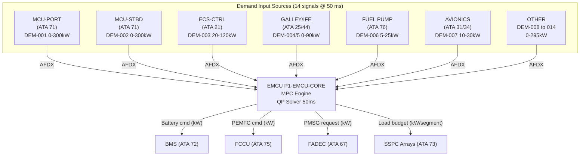
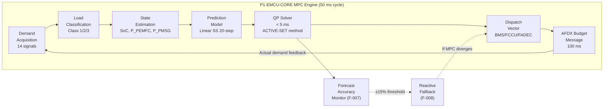

<!-- ──────────────────────────────────────────────────────────────────────────
     QATL-ATLAS-1000-ATLAS-070-079-07-079-020-POWER-DEMAND-PREDICTION-AND-ALLOCATION
     ATA 79 · Power Demand Prediction and Allocation
     AMPEL360E eWTW — ATLAS Register 1000
────────────────────────────────────────────────────────────────────────────── -->

# Power Demand Prediction and Allocation


---

## §0 Hyperlink Policy

> All hyperlinks in this document are **relative** (five directory levels: `../../../../../`).
> Absolute URLs are forbidden. Every linked document must exist in the Q+ATLANTIDE repository
> before the link is activated. Broken links are treated as open issues and must be resolved
> before the document is promoted from `DRAFT` to `APPROVED`.

---

## §1 Purpose

This document describes the **Model Predictive Control (MPC)-based power demand prediction algorithm**, all demand forecasting inputs, and the real-time power allocation architecture across all AMPEL360E eWTW electrical consumers.

The MPC prediction engine (partition P1-EMCU-CORE, DO-178C DAL B) acquires 14 distinct demand signals from the aircraft bus systems at 50 ms intervals, constructs a 60-second ahead prediction horizon, solves a constrained quadratic programming (QP) optimisation, and publishes allocation results to all connected load controllers via AFDX ARINC 664 P7 at a 100 ms cycle rate.

---

## §2 Applicability

| Field | Value |
|-------|-------|
| Aircraft Program | AMPEL360E eWTW |
| ATA Reference | ATA 79-020 |
| Certification Basis | EASA CS-25 Amendment 27+, DO-178C DAL B |
| S1000D SNS | 079-020-00 |
| Applicable MSN | All AMPEL360E eWTW series aircraft |
| Effectivity | From MSN 001 |

---

## §3 Functional Description ![DRAFT]

### 3.1 Demand Signal Acquisition

The EMCU collects **14 electrical demand input signals** via AFDX at a 50 ms acquisition cycle:

| Input ID | Signal | Source ATA | Nominal Range | Units |
|----------|--------|-----------|---------------|-------|
| DEM-001 | Propulsion motor port torque demand | ATA 71 MCU-PORT | 0–300 | kW |
| DEM-002 | Propulsion motor starboard torque demand | ATA 71 MCU-STBD | 0–300 | kW |
| DEM-003 | ECS compressor electric demand | ATA 21 ECS-CTRL | 20–120 | kW |
| DEM-004 | Galley load demand | ATA 25 / SSPC | 0–60 | kW |
| DEM-005 | IFE system load | ATA 44 / SSPC | 0–30 | kW |
| DEM-006 | LH₂ fuel pump demand | ATA 76 FPC | 5–25 | kW |
| DEM-007 | Avionics bus load (ATA 31/34) | ATA 73 SSPC | 10–30 | kW |
| DEM-008 | Cabin lighting demand | ATA 33 | 0–15 | kW |
| DEM-009 | Hydraulic electric backup pump demand | ATA 29 HYD-CTRL | 0–50 | kW |
| DEM-010 | Landing gear actuation demand | ATA 32 LG-CTRL | 0–80 | kW (transient) |
| DEM-011 | Flight control actuation demand | ATA 27 FCC | 5–60 | kW |
| DEM-012 | Wing ice protection (WIPS) demand | ATA 30 WIPS-CTRL | 0–90 | kW |
| DEM-013 | Cabin pressurization demand | ATA 21 ECS-CTRL | 10–40 | kW |
| DEM-014 | Passenger service / miscellaneous | ATA 25 / SSPC | 0–20 | kW |

**Total maximum simultaneous demand** (all at peak): 1 170 kW (theoretical maximum — simultaneous peak unlikely; design limit < 900 kW).

### 3.2 Load Classification

All 14 demand inputs are pre-classified into priority classes:

| Class | Demand Inputs | Max Combined | Sheddable |
|-------|--------------|-------------|-----------|
| Class 1 (Critical) | DEM-001, DEM-002, DEM-007, DEM-011 | 690 kW | Never |
| Class 2 (Essential) | DEM-003, DEM-006, DEM-009, DEM-010, DEM-012, DEM-013 | 405 kW | Partial |
| Class 3 (Normal) | DEM-004, DEM-005, DEM-008, DEM-014 | 125 kW | Automatic |

### 3.3 MPC Algorithm

The EMCU MPC engine solves the following optimisation at every 50 ms cycle:

**State vector** x(k): [Battery SoC, PEMFC output power, PMSG output power]
**Input vector** u(k): [Battery discharge/charge command, PEMFC dispatch command, PMSG off-take command]
**Prediction horizon**: N = 20 steps × 3 s/step = **60 s**

**Quadratic cost function:**

```
J = Σ[k=0 to N-1] { w₁·(SoC(k) - SoC_target)² + w₂·(P_PMSG(k))·η_penalty + w₃·(P_battery(k))² }
```

Where:
- `SoC_target` = 55 % (midpoint of [30 %, 80 %] target band)
- `w₁` = 1.0 (SoC deviation weighting)
- `w₂` = 0.3 (fuel consumption penalty from PMSG off-take)
- `w₃` = 0.1 (battery stress minimisation)
- `η_penalty` = specific fuel consumption increase coefficient (from FADEC model)

**Constraints:**
- 0 ≤ P_battery ≤ 400 kW (discharge); −200 kW ≤ P_battery (charging, regenerative)
- 0 ≤ P_PEMFC ≤ 200 kW
- 0 ≤ P_PMSG ≤ 600 kW (limited by FADEC available off-take)
- Battery SoC: 20 % ≤ SoC ≤ 95 % (hard limits)
- Total supply ≥ Class 1 demand at all times (hard constraint)

### 3.4 Power Budget Publication

After QP solver completion (< 5 ms), the EMCU publishes an **AFDX Power Budget Message** at 100 ms to:
- BMS: battery charge/discharge command (kW)
- FCCU: PEMFC dispatch command (kW)
- FADEC: PMSG off-take request (kW)
- SSPC arrays: Class 2/3 load approval limits (kW per bus segment)

---

## §4 Functional Breakdown

| ID | Function | Description | Cycle | DAL |
|----|----------|-------------|-------|-----|
| F-001 | Demand signal acquisition | Acquire 14 demand signals via AFDX | 50 ms | B |
| F-002 | Load classification | Assign each demand signal to Class 1/2/3 | 50 ms | B |
| F-003 | State estimation | Estimate battery SoC, PEMFC output, PMSG output from current measurements | 50 ms | B |
| F-004 | MPC prediction engine | Linear MPC, N=20 steps, 60 s horizon, QP solver | 50 ms | B |
| F-005 | Power budget message publication | Publish allocation to BMS/FCCU/FADEC/SSPCs via AFDX | 100 ms | B |
| F-006 | Priority override handling | Emergency Class 1 protection override in < 10 ms | < 10 ms | B |
| F-007 | Load forecast accuracy monitoring | Monitor prediction error vs actual demand; flag if > ±15 % | 1 s | C |
| F-008 | Fallback to reactive control | If MPC diverges or forecast error > 15 %: switch to proportional reactive control | 50 ms | B |
| F-009 | SoC target band management | Dynamically adjust SoC target based on flight phase | 1 s | C |
| F-010 | Regenerative demand coordination | Coordinate battery charging command during descent | 50 ms | B |

---

## §5 System Context — Mermaid Diagram



---

## §6 Internal Architecture — Mermaid Diagram



---

## §7 Components and LRUs

| Component | Location | Description |
|-----------|----------|-------------|
| EMCU-079 P1-EMCU-CORE | EE Bay R-079 | Hosts MPC engine software (DO-178C DAL B) |
| AFDX ES-A / ES-B | EE Bay (ATA 73) | AFDX dual-star switches (shared infrastructure) |
| SSPC arrays | Power Distribution Bays (ATA 73) | Execute load allocation limits from EMCU |
| PMAT-079 | GSE (portable) | MPC parameter verification and CDF update |

**No dedicated hardware LRU** is required beyond the EMCU-079 for the MPC algorithm itself — it runs as a software partition on the existing EMCU hardware.

---

## §8 Interfaces

| Interface | Signal | Direction | Protocol | Cycle |
|-----------|--------|-----------|----------|-------|
| MCU-PORT (ATA 71) | Propulsion torque demand (DEM-001) | In | AFDX 664 P7 | 50 ms |
| MCU-STBD (ATA 71) | Propulsion torque demand (DEM-002) | In | AFDX 664 P7 | 50 ms |
| ECS-CTRL (ATA 21) | ECS compressor demand (DEM-003) | In | AFDX 664 P7 | 200 ms |
| FPC (ATA 76) | Fuel pump demand (DEM-006) | In | AFDX 664 P7 | 200 ms |
| SSPC (ATA 73) | Galley/IFE demand (DEM-004/005) | In | AFDX 664 P7 | 200 ms |
| AVIONICS bus (ATA 31/34) | Avionics load (DEM-007) | In | AFDX 664 P7 | 1 s |
| HYD-CTRL (ATA 29) | Hydraulic pump demand (DEM-009) | In | AFDX 664 P7 | 200 ms |
| LG-CTRL (ATA 32) | Landing gear demand (DEM-010) | In | AFDX 664 P7 | 200 ms |
| FCC (ATA 27) | Flight control demand (DEM-011) | In | AFDX 664 P7 | 50 ms |
| WIPS-CTRL (ATA 30) | Ice protection demand (DEM-012) | In | AFDX 664 P7 | 500 ms |
| BMS (ATA 72) | Battery cmd (power budget output) | Out | AFDX 664 P7 | 100 ms |
| FCCU (ATA 75) | PEMFC dispatch cmd | Out | AFDX 664 P7 | 100 ms |
| FADEC (ATA 67) | PMSG off-take request | Out | AFDX 664 P7 | 100 ms |
| SSPC arrays (ATA 73) | Load budget per segment | Out | AFDX 664 P7 | 100 ms |

---

## §9 Operating Modes

| Mode | Description | MPC Active | Budget Publication |
|------|-------------|-----------|-------------------|
| Normal Prediction | All 14 demand signals valid, MPC running | Full MPC (QP 20-step) | 100 ms |
| Reduced Prediction | 1–3 demand signals stale (> 5 cycles), MPC uses last-known values | Full MPC with stale holdover | 100 ms |
| Reactive Fallback | MPC prediction error > ±15 % sustained ≥ 3 s, OR QP solver fails to converge | Proportional reactive control | 50 ms (faster) |
| Emergency Override | DM-5 active — Class 1 only | No MPC — hardcoded Class 1 allocation | 10 ms |
| Maintenance | PMAT connected, ground mode | MPC suspended — manual override | N/A |

---

## §10 Performance and Budgets ![DRAFT]

| Parameter | Requirement | Estimate / TBD |
|-----------|-------------|----------------|
| Demand acquisition cycle | 50 ms | 50 ms |
| QP solver execution time | < 5 ms (WCET) | TBD by HIL |
| Prediction horizon | 60 s (N=20, Δt=3 s) | Fixed |
| Prediction accuracy | ≥ 90 % for 60 s horizon | TBD by test |
| Forecast error detection threshold | ±15 % | Design |
| Budget publication cycle | 100 ms | 100 ms |
| Fallback trigger latency | ≤ 150 ms (3 × 50 ms) | Design |
| Battery SoC target band | 30 %–80 % normal | Design |
| Maximum simultaneous demand | < 900 kW | Load analysis |
| QP solver convergence rate | > 99.9 % of cycles | TBD |

---

## §11 Safety, Redundancy and Fault Tolerance

### 11.1 Safety Provisions

- **Class 1 protection**: MPC QP hard constraint ensures Class 1 demand is always fully supplied. QP solver infeasibility in Class 1 supply triggers immediate fallback.
- **MPC parameter bounds**: All MPC weighting parameters (w₁, w₂, w₃) are range-checked by watchdog at each cycle. Out-of-range parameters → fallback to reactive control.
- **Stale data handling**: Demand signal stale detection (> 5 × 50 ms = 250 ms with no update) → substitute with peak-bound conservative estimate.
- **QP solver failure**: If QP fails to converge in ≤ 5 ms → reactive proportional fallback (F-008) engages within same 50 ms cycle.

### 11.2 Failure Modes

| Failure | Detection | Response | Safety Impact |
|---------|-----------|----------|---------------|
| Single demand signal loss (DEM-xxx) | Stale detection 250 ms | Conservative holdover value used | Minimal — MPC continues |
| Multiple demand signal loss (≥ 4) | Stale detection | Reactive fallback F-008 | Reduced optimization |
| QP solver divergence | Solver convergence check | Reactive fallback F-008 | Reduced optimization |
| MPC prediction error > ±15 % | Forecast accuracy monitor | Reactive fallback F-008 + ECAM advisory | Reduced optimization |
| Total demand > 900 kW | Supply/demand balance monitor | Load shedding (see 079-030) | Controlled load shed |

---

## §12 Maintenance and Diagnostics

| Task | Interval | Tool | Procedure |
|------|----------|------|-----------|
| MPC prediction accuracy log review | C-check | PMAT-079 | AMM 79-020-10 |
| MPC parameter CDF verification | C-check | PMAT-079 | AMM 79-020-20 |
| QP solver convergence statistics download | A-check | PMAT-079 | AMM 79-020-30 |
| Demand signal calibration verification | C-check | GTU-EMCU-079 with signal injector | AMM 79-020-40 |
| Fallback activation history review | A-check | PMAT-079 (NVM log) | AMM 79-020-50 |

---

## §13 Footprint

This document describes a **software function** hosted within the EMCU-079 hardware (EE Bay R-079). No additional LRU footprint beyond EMCU-079.

| Software Partition | Host | Memory Footprint (estimate) | CPU Load (estimate) |
|-------------------|------|---------------------------|---------------------|
| P1-EMCU-CORE (MPC engine) | EMCU-079 DSP A/B | ≤ 4 MB code + 512 KB data | ≤ 55 % of DSP capacity at 50 ms |

---

## §14 Safety and Certification References ![DRAFT]

| Reference | Description |
|-----------|-------------|
| DO-178C DAL B | Software certification for P1-EMCU-CORE MPC engine |
| EASA CS-25 §25.1309 | Safety assessment — demand prediction failure modes |
| SAE ARP4754A | System FHA for demand prediction function |
| RTCA DO-297 | IMA guidance for MPC partition hosting |
| EASA AMC 20-115D | Software certification methodology |

---

## §15 V&V Approach ![TBD]

| Activity | Description | Pass Criterion |
|----------|-------------|---------------|
| Unit test — QP solver | Test all constraint configurations | Convergence in < 5 ms, correct solution |
| Unit test — demand acquisition | Inject all 14 demand signals and verify classification | All signals correctly classified |
| MC/DC coverage — P1-EMCU-CORE | Structural coverage analysis | 100 % MC/DC |
| Integration test — demand signal stale | Remove individual demand signals and verify holdover | Conservative holdover applied |
| HIL test — MPC accuracy | Compare MPC predictions against flight profile playback | ≥ 90 % prediction accuracy |
| HIL test — fallback activation | Inject QP divergence condition | Fallback activates ≤ 50 ms |
| Certification flight test | Full flight profile — MPC prediction log reviewed | Prediction accuracy meets requirement |

---

## §16 Glossary

| Acronym | Definition |
|---------|-----------|
| DEM | Demand signal identifier |
| FCC | Flight Control Computer |
| FPC | Fuel Pump Controller |
| IFE | In-Flight Entertainment |
| MPC | Model Predictive Control |
| QP | Quadratic Programming |
| SS | State-Space (model form) |
| WIPS | Wing Ice Protection System |
| WCET | Worst-Case Execution Time |

---

## §17 Open Issues

| ID | Description | Owner | Target |
|----|-------------|-------|--------|
| OI-079-020-001 | Validate MPC prediction accuracy ≥ 90 % against flight profile HIL data | Q-HPC | 2027-Q1 |
| OI-079-020-002 | Confirm QP solver WCET ≤ 5 ms on selected DSP hardware | Q-HPC | 2026-Q4 |
| OI-079-020-003 | Define demand signal update rates for all 14 inputs with each subsystem OEM | Q-GREENTECH | 2026-Q3 |
| OI-079-020-004 | Finalise MPC weighting factors (w₁, w₂, w₃) via trade study | Q-HPC | 2026-Q4 |
| OI-079-020-005 | Define fallback reactive control algorithm parameters | Q-GREENTECH | 2026-Q4 |

---

## §18 Status Legend

| Badge | Meaning |
|-------|---------|
|  | Content drafted but not yet reviewed |
|  | Content to be determined — open issue raised |
|  | Reviewed, approved and baselined |
|  | Replaced by a later revision |

---

## §19 Related Documents (Siblings in this Subsection)

| Document ID | Title | SNS |
|-------------|-------|-----|
| [079-000](./079-000-Energy-Management-System-General.md) | Energy Management System General | 079-000-00 |
| [079-010](./079-010-Energy-Management-Architecture.md) | Energy Management Architecture | 079-010-00 |
| [079-030](./079-030-Energy-Source-Prioritization-and-Load-Shedding.md) | Energy Source Prioritization and Load Shedding | 079-030-00 |
| [079-040](./079-040-Propulsion-and-ECS-Energy-Coordination.md) | Propulsion and ECS Energy Coordination | 079-040-00 |
| [079-050](./079-050-Energy-Degraded-Modes-and-Reconfiguration.md) | Energy Degraded Modes and Reconfiguration | 079-050-00 |
| [079-060](./079-060-Energy-Management-Software-and-Configuration.md) | Energy Management Software and Configuration | 079-060-00 |
| [079-070](./079-070-Energy-Management-Test-and-Maintenance.md) | Energy Management Test and Maintenance | 079-070-00 |
| [079-080](./079-080-Energy-Management-Monitoring-Diagnostics-and-Control-Interfaces.md) | EMS Monitoring, Diagnostics and Control Interfaces | 079-080-00 |
| [079-090](./079-090-S1000D-CSDB-Mapping-and-Traceability.md) | S1000D CSDB Mapping and Traceability | 079-090-00 |

---

## §20 Change Log

| Rev | Date | Author | Description |
|-----|------|--------|-------------|
| 0.1 | 2026-05-12 | Q-GREENTECH / Q-HPC | Initial DRAFT — baseline document creation |
