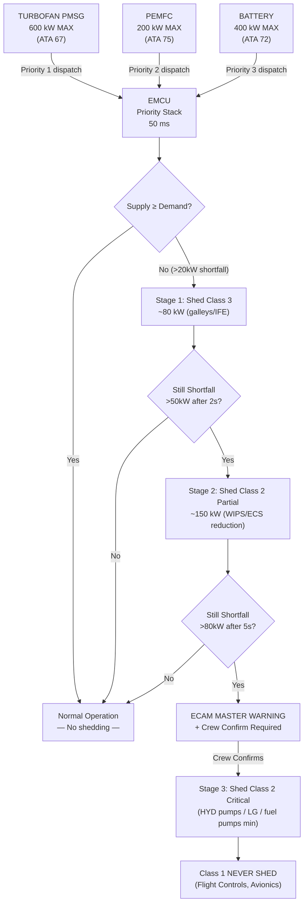
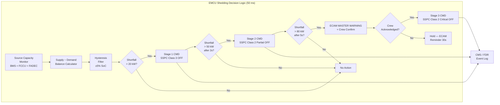

<!-- ──────────────────────────────────────────────────────────────────────────
     QATL-ATLAS-1000-ATLAS-070-079-07-079-030-ENERGY-SOURCE-PRIORITIZATION-AND-LOAD-SHEDDING
     ATA 79 · Energy Source Prioritization and Load Shedding
     AMPEL360E eWTW — ATLAS Register 1000
────────────────────────────────────────────────────────────────────────────── -->

# Energy Source Prioritization and Load Shedding

---

## §0 Hyperlink Policy

> All hyperlinks in this document are **relative** (five directory levels: `../../../../../`).
> Absolute URLs are forbidden. Every linked document must exist in the Q+ATLANTIDE repository
> before the link is activated. Broken links are treated as open issues and must be resolved
> before the document is promoted from `DRAFT` to `APPROVED`.

---

## §1 Purpose

This document defines the **energy source prioritization logic** and the **three-tier load shedding protocol** for the AMPEL360E eWTW Energy Management System. It specifies the source dispatch priority stack (turbofan PMSG → PEMFC → battery), the conditions under which each load class is shed, hysteresis logic to prevent oscillation, regenerative energy capture coordination during descent, and crew advisory generation through the ECAM system.

---

## §2 Applicability

| Field | Value |
|-------|-------|
| Aircraft Program | AMPEL360E eWTW |
| ATA Reference | ATA 79-030 |
| Certification Basis | EASA CS-25 Amendment 27+, DO-178C DAL B |
| S1000D SNS | 079-030-00 |
| Applicable MSN | All AMPEL360E eWTW series aircraft |
| Effectivity | From MSN 001 |

---

## §3 Functional Description ![DRAFT]

### 3.1 Source Priority Stack

The EMCU dispatches available electrical energy from three sources in a defined priority sequence:

| Priority | Source | Max Output | Interface | Dispatch Speed |
|----------|--------|-----------|-----------|---------------|
| 1 (Primary) | Turbofan PMSG | 0–600 kW | FADEC (ATA 67) via AFDX | 100 ms response |
| 2 (Secondary) | PEMFC | 0–200 kW | FCCU (ATA 75) via AFDX | 500 ms warm-up to rated |
| 3 (Tertiary) | Battery (NMC 811) | 0–400 kW discharge | BMS (ATA 72) via AFDX | < 50 ms response |

**Priority dispatch logic:**
1. EMCU first requests maximum available PMSG off-take from FADEC (not to exceed engine structural limits).
2. Remaining demand is satisfied by PEMFC (up to 200 kW) — PEMFC preferred over battery to preserve battery SoC.
3. Remaining demand (peaks or PMSG/PEMFC shortfall) is supplied by battery.
4. If total supply < total demand: **load shedding activates**.

### 3.2 Load Shedding Protocol

Shedding is executed in reverse order of criticality (lowest priority shed first):

#### Stage 1 — Class 3 Shed (~80 kW)
- **Trigger**: Total supply < total demand AND supply shortfall > 20 kW.
- **Action**: EMCU commands SSPC arrays to de-energize Class 3 loads: galleys (50 kW), IFE (20 kW), non-essential cabin lighting (10 kW).
- **Crew advisory**: ECAM MASTER CAUTION + EMS LOAD SHED CLASS 3 message.
- **Execution**: SSPC switching ≤ 20 ms.

#### Stage 2 — Class 2 Non-Essential Shed (~150 kW)
- **Trigger**: Shortfall persists > 2 s after Stage 1 AND residual shortfall > 50 kW.
- **Action**: EMCU commands partial Class 2 loads: WIPS (ATA 30, 90 kW), non-essential galley heat (40 kW), reduced ECS setpoint (20 kW reduction).
- **Crew advisory**: ECAM MASTER CAUTION + EMS LOAD SHED CLASS 2 PARTIAL message.
- **Execution**: SSPC switching ≤ 20 ms.

#### Stage 3 — Class 2 Critical Shed (requires crew acknowledgement)
- **Trigger**: Shortfall persists > 5 s after Stage 2 AND residual shortfall > 80 kW.
- **Action**: EMCU requests crew confirmation before shedding critical Class 2 loads: hydraulic backup pumps (ATA 29, 50 kW), landing gear actuation (ATA 32, 80 kW — ground only), LH₂ fuel pumps to minimum (ATA 76).
- **Crew advisory**: ECAM **MASTER WARNING** + EMS LOAD SHED CLASS 2 CRITICAL + crew confirmation required.
- **Safety note**: Class 1 loads are **never** shed by any automatic or crew-initiated action.

### 3.3 Hysteresis Logic

To prevent load shedding oscillation (hunting), the EMCU applies ±5 % battery SoC hysteresis:

| Condition | Action |
|-----------|--------|
| Battery SoC drops below lower threshold − 5 % | Initiate next shedding stage |
| Battery SoC recovers above upper threshold + 5 % | Restore previously shed loads (in reverse order of shedding) |

Load restoration also requires supply-demand balance confirmation (supply > demand + 50 kW margin) for ≥ 3 s before restoring.

### 3.4 Regenerative Energy Capture

During descent phase, PMSG output may exceed demand. The EMCU coordinates:
- Battery charging from PMSG excess power: up to 200 kW charging rate (BMS command).
- PEMFC output reduced to minimum during active regenerative charging.
- Excess regen power > 200 kW: FADEC commanded to reduce PMSG output (engine bleed/fan load management).

---

## §4 Functional Breakdown

| ID | Function | Description | Cycle | DAL |
|----|----------|-------------|-------|-----|
| F-001 | Source capacity monitoring | Real-time available power from BMS, FCCU, FADEC | 50 ms | B |
| F-002 | Priority dispatch stack execution | Execute PMSG → PEMFC → battery dispatch sequence | 50 ms | B |
| F-003 | Supply/demand balance computation | Compute supply − demand; detect shortfall | 50 ms | B |
| F-004 | Stage 1 Class 3 load shed | Auto-shed galleys/IFE/lighting via SSPC | 50 ms | B |
| F-005 | Stage 2 Class 2 partial load shed | Auto-shed WIPS/non-essential Class 2 via SSPC | 50 ms | B |
| F-006 | Stage 3 Class 2 critical shed | Request crew confirmation; shed on acknowledgement | N/A + crew | B |
| F-007 | ECAM advisory generation | Generate MASTER CAUTION / WARNING messages | < 1 s | C |
| F-008 | Hysteresis management | Apply ±5 % SoC hysteresis to prevent oscillation | Continuous | B |
| F-009 | Load restoration sequencing | Restore shed loads when supply recovered | 3 s confirm | B |
| F-010 | Regenerative energy capture | Coordinate battery charging during descent | 50 ms | B |
| F-011 | Shedding event logging | Log all shedding/restoration events to CMS/FDR | On event | C |
| F-012 | Manual shed override prevention | Prevent Class 1 shedding from any input source | Hard-wired | B |

---

## §5 System Context — Mermaid Diagram

---

## §6 Internal Architecture — Mermaid Diagram

---

## §7 Components and LRUs

| LRU | Location | Function in Load Shedding |
|-----|----------|--------------------------|
| EMCU-079 | EE Bay R-079 | Executes priority stack and shedding logic |
| SSPC-MAIN-073 | Forward power distribution bay | Switches Class 1/2/3 loads per EMCU command |
| SSPC-AFT-073 | Aft power distribution bay | Switches Class 1/2/3 loads per EMCU command |
| ECAM-CDS-031 | Cockpit — captain/FO displays | Displays MASTER CAUTION / WARNING + EMS messages |
| CMS-045 | EE Bay | Stores shedding event fault codes |
| FDR-031 | EE Bay | Records shedding events at 1 Hz |

### 7.1 SSPC Load Shedding Capability

| SSPC Array | Bus | Shedding Stages Supported | Max Shed kW |
|-----------|-----|--------------------------|------------|
| SSPC-MAIN-073 | HVDC 540 V | Stage 1, 2, 3 | 120 kW |
| SSPC-AFT-073 | HVDC 270 V | Stage 1, 2 | 90 kW |
| SSPC-ECS-073 | 115 V AC | Stage 2 partial | 40 kW |

---

## §8 Interfaces

| Interface | Signal | Direction | Protocol | Cycle |
|-----------|--------|-----------|----------|-------|
| BMS (ATA 72) | Available battery power, SoC | In | AFDX 664 P7 | 50 ms |
| FCCU (ATA 75) | Available PEMFC power | In | AFDX 664 P7 | 100 ms |
| FADEC (ATA 67) | Available PMSG output | In | AFDX 664 P7 | 100 ms |
| SSPC-MAIN-073 | Stage 1/2/3 shed commands | Out | AFDX 664 P7 | 50 ms |
| SSPC-AFT-073 | Stage 1/2 shed commands | Out | AFDX 664 P7 | 50 ms |
| ECAM (ATA 31) | MASTER CAUTION / WARNING | Out | AFDX 664 P7 | < 1 s |
| CMS (ATA 45) | Shedding event fault codes | Out | AFDX 664 P7 | On event |
| FDR (ATA 31) | Shedding event snapshot | Out | AFDX 664 P7 | 1 Hz |
| Crew discrete | Stage 3 confirmation input | In | 28 V DC discrete | Event |

---

## §9 Operating Modes

| Mode | Supply Status | Active Shed Stage | Crew Advisory |
|------|--------------|-------------------|--------------|
| Normal | Supply ≥ demand + 50 kW margin | None | None |
| Stage 1 Active | Shortfall 20–130 kW | Class 3 shed (80 kW) | ECAM MASTER CAUTION |
| Stage 2 Active | Shortfall 50–230 kW after Stage 1 | Class 3 + Class 2 partial (230 kW total) | ECAM MASTER CAUTION |
| Stage 3 Pending | Shortfall > 80 kW after Stage 2 | Waiting crew confirmation | ECAM MASTER WARNING |
| Stage 3 Active | Stage 3 confirmed by crew | Class 3 + Class 2 full shed (~380 kW) | ECAM WARNING active |
| Regen Capture | Supply > demand (descent) | None — charging active | ECAM EMS REGEN ACTIVE (advisory) |
| Restoration | Supply recovered | Staged restoration in progress | ECAM EMS RESTORE advisory |

---

## §10 Performance and Budgets ![DRAFT]

| Parameter | Requirement | Design Value |
|-----------|-------------|-------------|
| Imbalance detection latency | < 50 ms | 50 ms cycle |
| Stage 1 shedding execution | < 50 ms (EMCU command) + < 20 ms (SSPC switch) | 70 ms total |
| Stage 2 shedding execution | < 50 ms + 20 ms SSPC | 70 ms total |
| ECAM advisory latency | < 1 s | < 500 ms |
| Hysteresis band | ±5 % SoC | ±5 % |
| Load restoration confirmation | ≥ 3 s stable supply margin | 3 s |
| Stage 1 load removed | ~80 kW | 80 kW design |
| Stage 2 additional load removed | ~150 kW | 150 kW design |
| Stage 3 additional load removed | ~150 kW | 150 kW design |
| Class 1 protection | Always powered — no shed possible | Hard constraint |
| Regen charging rate | ≤ 200 kW | 200 kW (BMS limit) |

---

## §11 Safety, Redundancy and Fault Tolerance

### 11.1 Class 1 Load Protection

Class 1 loads (flight controls, avionics, navigation) are **never shed** under any condition:
- Hardware protection: Class 1 SSPC channels are write-protected; EMCU cannot issue an OFF command to Class 1 channels.
- Software protection: DO-178C DAL B verified constraint in QP solver and shedding logic.
- The design is verified by independent safety assessment per SAE ARP4761.

### 11.2 Staged Shedding Safety Rationale

| Stage | Safety Justification |
|-------|---------------------|
| Stage 1 (Class 3) | No flight safety impact; passenger comfort loads only |
| Stage 2 (Class 2 partial) | De-icing and ECS reduction are reversible; aircraft airworthiness maintained |
| Stage 3 (Class 2 critical) | Requires crew awareness and positive confirmation; maintains essential minimum avionics |

### 11.3 Regulatory Compliance

| Requirement | Standard |
|-------------|----------|
| No single failure causes loss of essential loads | EASA CS-25 §25.1351, §25.1353 |
| Load shedding crew notification | EASA CS-25 §25.1309 |
| Load shedding logic software certification | DO-178C DAL B |
| SSPC qualification | DO-160G |

---

## §12 Maintenance and Diagnostics

| Task | Interval | Tool | Procedure |
|------|----------|------|-----------|
| Shedding event log download | A-check | PMAT-079 | AMM 79-030-10 |
| SSPC Stage 1/2/3 functional verification | C-check | GTU-EMCU-079 | AMM 79-030-20 |
| ECAM advisory verification for all shed stages | C-check | GTU-EMCU-079 | AMM 79-030-30 |
| Hysteresis logic test | C-check | PMAT-079 (SoC injection) | AMM 79-030-40 |
| Class 1 protection hardware verification | C-check | GTU + SSPC test box | AMM 79-030-50 |
| Restoration sequencing test | C-check | GTU-EMCU-079 | AMM 79-030-60 |

---

## §13 Footprint

Software function hosted within EMCU-079 P1-EMCU-CORE partition. No additional hardware footprint. SSPC arrays are ATA 73 LRUs — reference ATA 73 AMM for SSPC maintenance.

---

## §14 Safety and Certification References ![DRAFT]

| Reference | Description |
|-----------|-------------|
| EASA CS-25 §25.1351 | General — electrical systems and equipment |
| EASA CS-25 §25.1353 | Electrical equipment — protection from overload |
| EASA CS-25 §25.1309 | Equipment, systems and installations — safety assessment |
| DO-178C DAL B | Software certification for shedding logic (P1-EMCU-CORE) |
| SAE ARP4761 | Safety assessment guidelines — FMEA for load shedding |
| DO-160G | SSPC environmental qualification |
| EASA AMC 25.1309 | Acceptable means of compliance for safety assessment |

---

## §15 V&V Approach ![TBD]

| Activity | Pass Criterion | Standard |
|----------|---------------|----------|
| SSPC Stage 1/2/3 shed test (HIL) | All loads shed within timing | DO-178C + AMM |
| Class 1 protection test (HIL) | No Class 1 shed under any EMCU command | DO-178C DAL B |
| Hysteresis test | No oscillation in ±5 % SoC band | Design spec |
| ECAM advisory test | All advisories generated within 1 s | ECAM conformance |
| Certification flight test — load shortfall injection | Staged shedding correct sequence | EASA CS-25 |

---

## §16 Glossary

| Acronym | Definition |
|---------|-----------|
| HYD | Hydraulic |
| IFE | In-Flight Entertainment |
| LG | Landing Gear |
| SSPC | Solid-State Power Controller |
| WIPS | Wing Ice Protection System |

---

## §17 Open Issues

| ID | Description | Owner | Target |
|----|-------------|-------|--------|
| OI-079-030-001 | Confirm Stage 3 shedding crew confirmation UI with cockpit team | Q-AIR | 2026-Q4 |
| OI-079-030-002 | Verify SSPC switching time ≤ 20 ms by bench test for all channels | Q-MECHANICS | 2026-Q4 |
| OI-079-030-003 | Define exact Class 2 critical shed sequence with ATA 29, 32, 76 OEMs | Q-GREENTECH | 2026-Q4 |
| OI-079-030-004 | Complete FMEA for shedding logic failure modes | Q-AIR | 2027-Q1 |

---

## §18 Status Legend

| Badge | Meaning |
|-------|---------|
|  | Content drafted but not yet reviewed |
|  | Content to be determined |
|  | Reviewed, approved and baselined |
|  | Replaced by a later revision |

---

## §19 Related Documents (Siblings in this Subsection)

| Document ID | Title | SNS |
|-------------|-------|-----|
| [079-000](./079-000-Energy-Management-System-General.md) | Energy Management System General | 079-000-00 |
| [079-010](./079-010-Energy-Management-Architecture.md) | Energy Management Architecture | 079-010-00 |
| [079-020](./079-020-Power-Demand-Prediction-and-Allocation.md) | Power Demand Prediction and Allocation | 079-020-00 |
| [079-040](./079-040-Propulsion-and-ECS-Energy-Coordination.md) | Propulsion and ECS Energy Coordination | 079-040-00 |
| [079-050](./079-050-Energy-Degraded-Modes-and-Reconfiguration.md) | Energy Degraded Modes and Reconfiguration | 079-050-00 |
| [079-060](./079-060-Energy-Management-Software-and-Configuration.md) | Energy Management Software and Configuration | 079-060-00 |
| [079-070](./079-070-Energy-Management-Test-and-Maintenance.md) | Energy Management Test and Maintenance | 079-070-00 |
| [079-080](./079-080-Energy-Management-Monitoring-Diagnostics-and-Control-Interfaces.md) | EMS Monitoring, Diagnostics and Control Interfaces | 079-080-00 |
| [079-090](./079-090-S1000D-CSDB-Mapping-and-Traceability.md) | S1000D CSDB Mapping and Traceability | 079-090-00 |

---

## §20 Change Log

| Rev | Date | Author | Description |
|-----|------|--------|-------------|
| 0.1 | 2026-05-12 | Q-GREENTECH | Initial DRAFT — baseline document creation |
