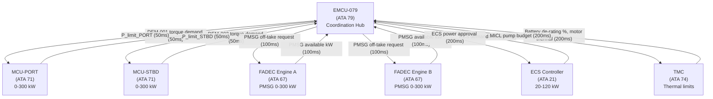
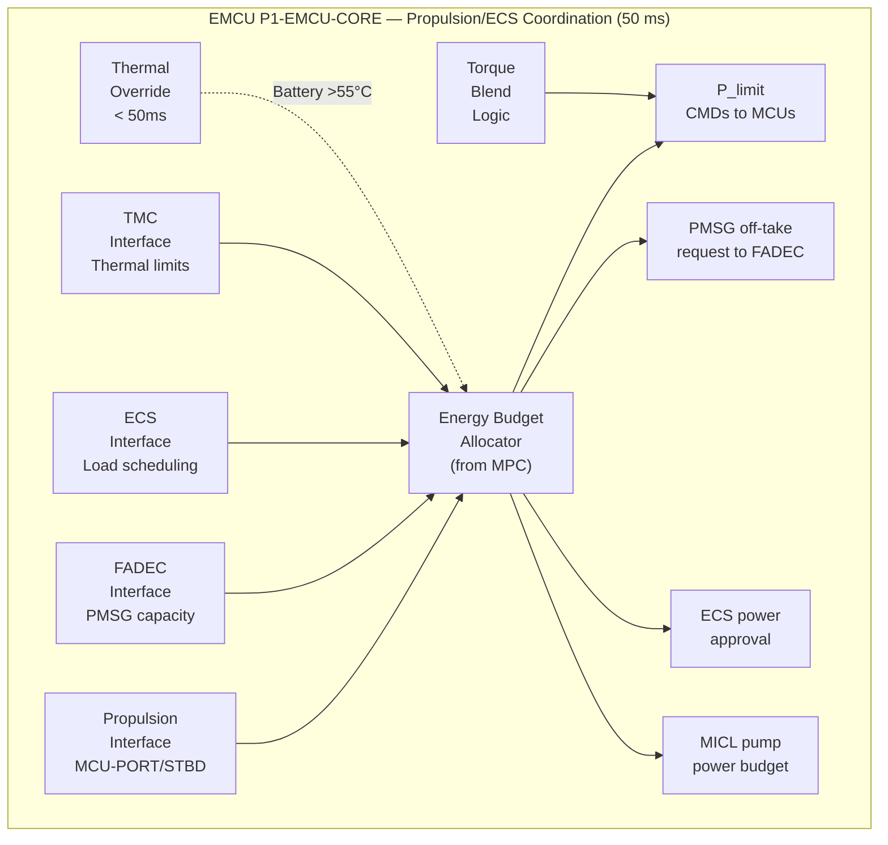

<!-- ──────────────────────────────────────────────────────────────────────────
     QATL-ATLAS-1000-ATLAS-070-079-07-079-040-PROPULSION-AND-ECS-ENERGY-COORDINATION
     ATA 79 · Propulsion and ECS Energy Coordination
     programme-defined aircraft type — ATLAS Register 1000
────────────────────────────────────────────────────────────────────────────── -->

# Propulsion and ECS Energy Coordination

---

## §0 Hyperlink Policy

> All hyperlinks in this document are **relative** (five directory levels: `../../../../../`).
> Absolute URLs are forbidden. Every linked document must exist in the Q+ATLANTIDE repository
> before the link is activated. Broken links are treated as open issues and must be resolved
> before the document is promoted from `DRAFT` to `APPROVED`.

---

## §1 Purpose

This document defines the agnostic ATLAS standard-level architecture context for `Propulsion and ECS Energy Coordination`.

It describes the controlled scope, functions, interfaces, safety considerations, lifecycle traceability, and S1000D/CSDB mapping logic that programme implementations shall instantiate when this node is applicable.

This document is not a programme design baseline. Programme-specific capacities, locations, part numbers, effectivity, operating limits, maintenance references, and data module codes shall be defined only inside the applicable programme implementation branch.
## §2 Applicability

| Applicability Level | Rule |
|---|---|
| Standard taxonomy | Applies to the ATLAS node `079` |
| Programme implementation | Conditional; determined by programme architecture, trade studies, certification basis, and applicability model |
| Product configuration | Defined in the programme-specific configuration baseline |
| Effectivity | Defined in the programme CSDB / applicability layer |
| Non-applicability | Must be explicitly stated in the programme impact-study branch when excluded |
## §3 Functional Description ![DRAFT]

### 3.1 Electric Propulsion Coordination (ATA 71)

The programme-defined aircraft type uses two **PMSM (Permanent Magnet Synchronous Motor)** propulsors:

| Motor | Rated Power | Drive | AFDX Node |
|-------|------------|-------|-----------|
| Port PMSM | 300 kW continuous, 350 kW (10 s peak) | MCU-PORT (ATA 71) | MCU-PORT-AFDX |
| Starboard PMSM | 300 kW continuous, 350 kW (10 s peak) | MCU-STBD (ATA 71) | MCU-STBD-AFDX |

**EMCU → MCU coordination (50 ms cycle):**
1. MCU-PORT and MCU-STBD transmit their instantaneous torque demand to EMCU via AFDX (DEM-001, DEM-002).
2. EMCU MPC computes the total available power for propulsion: `P_prop_avail = P_total_avail − P_ECS − P_Class1_others`.
3. EMCU transmits a **power limit message** to each MCU: `P_limit_PORT` and `P_limit_STBD`.
4. MCU uses the EMCU power limit as an upper bound; actual motor power draw is MCU-commanded, not directly by EMCU.
5. **Torque blending**: EMCU can recommend a port/starboard power split (e.g., 50/50 nominal, adjusted for motor temperature asymmetry or yaw compensation request from FCC).
6. EMCU cannot command MCU below the **minimum safe propulsion power threshold** (established by flight safety assessment — TBD, provisional: 40 kW per motor minimum during climb/cruise).

### 3.2 FADEC / PMSG Coordination (ATA 67)

The turbofan engines each drive a **PMSG** generator. FADEC (ATA 67) is the master controller for engine operation; EMCU is a requestor of PMSG off-take.

**Coordination protocol (100 ms cycle):**
1. EMCU transmits a **PMSG off-take request** (kW per engine) to FADEC via AFDX.
2. FADEC responds with **available PMSG capacity** (kW per engine) within 2 engine control cycles (100 ms).
3. FADEC limits PMSG off-take to protect engine operability (surge margin, thermal limits, structural limits).
4. EMCU accepts FADEC's available capacity as a hard constraint in the MPC optimisation (see 079-020).
5. During single-engine operation, EMCU adjusts MPC to reflect reduced PMSG availability.

**PMSG power range:**
- Port engine PMSG: 0–300 kW
- Starboard engine PMSG: 0–300 kW
- Combined maximum: 600 kW

### 3.3 ECS Coordination (ATA 21)

The programme-defined aircraft type uses a **bleed-less, electrically powered ECS** with two electric compressor packs.

**EMCU → ECS coordination (200 ms cycle):**
1. ECS controller transmits its thermal comfort demand (kW equivalent) to EMCU: 20–120 kW range.
2. EMCU evaluates ECS demand against total available budget and propulsion priority.
3. EMCU transmits an **ECS power approval** message to ECS controller: either full demand approved, or a reduced limit (minimum 20 kW for cabin pressurization safety).
4. During **thermal emergency** (battery or motor over-temperature): EMCU may override ECS schedule to protect thermal-critical systems; ECS receives PRIORITY THERMAL advisory.

**ECS power budget allocation:**

| Flight Phase | ECS Nominal | ECS Minimum (Emergency) |
|-------------|-------------|------------------------|
| Cruise | 60–80 kW | 20 kW (pressurization only) |
| Descent/Approach | 40–60 kW | 20 kW |
| Takeoff/Climb | 40–60 kW | 20 kW |
| Ground/Taxi | 80–120 kW | 40 kW |

### 3.4 Thermal Management Coordination (ATA 74)

The EMCU exchanges thermal limit data with the **Thermal Management Controller (TMC, ATA 74)** at a 200 ms cycle:

1. TMC transmits **battery discharge current de-rating** signal: percentage of rated current available before thermal de-rating activates.
2. TMC transmits **motor cooling status**: MICL loop pump power request (5–20 kW).
3. EMCU incorporates battery thermal de-rating into MPC as a modified battery power limit.
4. EMCU budgets power for MICL loop pumps as a Class 2 essential load.
5. If TMC signals **battery thermal critical** (cell temperature > 55 °C): EMCU immediately reduces battery discharge command to ≤ 50 % rated power (hard constraint, bypasses MPC).

### 3.5 Combined Power Budget Example — Cruise

| Consumer | Nominal (kW) | Peak (kW) | Priority |
|----------|-------------|-----------|---------|
| Port PMSM (ATA 71) | 180 | 300 | Class 1 |
| Starboard PMSM (ATA 71) | 180 | 300 | Class 1 |
| ECS (ATA 21) | 70 | 120 | Class 2 |
| MICL pumps (ATA 74) | 12 | 20 | Class 2 |
| Avionics (ATA 31/34) | 20 | 30 | Class 1 |
| Flight controls (ATA 27) | 15 | 60 | Class 1 |
| Other Class 2 | 50 | 150 | Class 2 |
| Class 3 comfort | 40 | 80 | Class 3 |
| **Total** | **567** | **1060** | — |
| **Available supply** | **800** | **900** | — |
| **Margin** | **233** | **−160*** | — |

*Peak case assumes simultaneous LG retraction + WIPS + max ECS — EMCU prevents simultaneous peak by scheduling.

---

## §4 Functional Breakdown

| ID | Function | Description | Cycle | DAL |
|----|----------|-------------|-------|-----|
| F-001 | MCU propulsion power limit dispatch | Transmit P_limit_PORT/STBD to MCUs | 50 ms | B |
| F-002 | FADEC PMSG off-take request/response | Send PMSG request; receive available capacity | 100 ms | B |
| F-003 | ECS load scheduling | Transmit ECS power approval to ECS controller | 200 ms | B |
| F-004 | TMC thermal limit exchange | Receive battery de-rating; transmit motor budget | 200 ms | B |
| F-005 | Motor cooling power budgeting | Budget MICL pump power as Class 2 essential | 200 ms | C |
| F-006 | Port/starboard torque blending | Recommend MCU power split per thermal/yaw asymmetry | 50 ms | C |
| F-007 | Regenerative braking coordination | Coordinate battery charging during descent decel | 50 ms | B |
| F-008 | ECS priority thermal override | Override ECS schedule during battery thermal critical | < 50 ms | B |
| F-009 | Minimum safe propulsion power enforcement | Prevent MCU power limit below flight safety minimum | Continuous | B |
| F-010 | Single-engine PMSG availability adjustment | Reduce MPC PMSG constraint on engine failure | 50 ms | B |

---

## §5 System Context — Mermaid Diagram

---

## §6 Internal Architecture — Mermaid Diagram

---

## §7 Components and LRUs

| LRU | ATA | Location | Role in Coordination |
|-----|-----|----------|---------------------|
| EMCU-079 | ATA 79 | EE Bay R-079 | Coordination host |
| MCU-PORT-071 | ATA 71 | Nacelle Port | Port motor drive — receives power limit from EMCU |
| MCU-STBD-071 | ATA 71 | Nacelle Starboard | Starboard motor drive — receives power limit from EMCU |
| FADEC-067-A | ATA 67 | Engine A | Engine control — provides PMSG capacity to EMCU |
| FADEC-067-B | ATA 67 | Engine B | Engine control — provides PMSG capacity to EMCU |
| ECS-CTRL-021 | ATA 21 | EE Bay | ECS controller — receives power approval from EMCU |
| TMC-074 | ATA 74 | EE Bay | Thermal controller — exchanges de-rating with EMCU |

---

## §8 Interfaces

| Interface | Signal | Direction | Protocol | Cycle | Notes |
|-----------|--------|-----------|----------|-------|-------|
| MCU-PORT (ATA 71) | Torque demand DEM-001 | In | AFDX 664 P7 | 50 ms | — |
| MCU-STBD (ATA 71) | Torque demand DEM-002 | In | AFDX 664 P7 | 50 ms | — |
| MCU-PORT (ATA 71) | Power limit P_limit_PORT | Out | AFDX 664 P7 | 50 ms | Hard upper bound |
| MCU-STBD (ATA 71) | Power limit P_limit_STBD | Out | AFDX 664 P7 | 50 ms | Hard upper bound |
| FADEC-A (ATA 67) | PMSG available capacity | In | AFDX 664 P7 | 100 ms | FADEC response |
| FADEC-B (ATA 67) | PMSG available capacity | In | AFDX 664 P7 | 100 ms | FADEC response |
| FADEC-A/B (ATA 67) | PMSG off-take request | Out | AFDX 664 P7 | 100 ms | EMCU request |
| ECS-CTRL (ATA 21) | ECS thermal demand | In | AFDX 664 P7 | 200 ms | DEM-003 |
| ECS-CTRL (ATA 21) | ECS power approval | Out | AFDX 664 P7 | 200 ms | — |
| TMC (ATA 74) | Battery de-rating % | In | AFDX 664 P7 | 200 ms | — |
| TMC (ATA 74) | Motor cooling demand | In | AFDX 664 P7 | 200 ms | — |
| TMC (ATA 74) | MICL pump power budget | Out | AFDX 664 P7 | 200 ms | — |
| FCC (ATA 27) | Yaw compensation request | In | AFDX 664 P7 | 50 ms | Torque blending input |
| ECAM (ATA 31) | Priority thermal advisory | Out | AFDX 664 P7 | On event | ECS thermal override |

---

## §9 Operating Modes

| Mode | Propulsion Limit | ECS Approval | PMSG Engagement | Battery Role |
|------|-----------------|-------------|----------------|-------------|
| Normal Coordinated | Full MPC optimized | Full demand | Both engines full | MPC optimized |
| Propulsion Priority | EMCU protects propulsion budget — ECS reduced | Reduced to minimum | Both engines full | Peak filler |
| ECS Priority Thermal | ECS maintained — propulsion limited if required | Full | Both engines full | Peak filler |
| Degraded Propulsion (one MCU fault) | One motor only, P_limit × 1.3 for surviving motor | Full | Both engines | Battery boost |
| Single Engine (DM-3) | Both PMSMs from one PMSG + battery | Minimum (20 kW) | One engine only | Heavy dispatch |
| Regenerative Descent | P_limit reduced — motors in regen | Minimum | Engines idle | Charging (−200 kW) |
| Thermal Critical Battery | P_battery ≤ 50 % rated — PMSG max + PEMFC | Reduced | Max off-take | Limited |

---

## §10 Performance and Budgets ![DRAFT]

| Parameter | Requirement | Design Value |
|-----------|-------------|-------------|
| MCU power limit update cycle | 50 ms | 50 ms |
| FADEC PMSG response latency | ≤ 100 ms | 100 ms (2 engine cycles) |
| ECS scheduling cycle | 200 ms | 200 ms |
| TMC thermal limit exchange cycle | 200 ms | 200 ms |
| Thermal override response (battery >55 °C) | < 50 ms | 50 ms |
| Max propulsion electrical demand | 600 kW (2 × 300 kW) | 600 kW |
| Max ECS demand | 120 kW | 120 kW |
| Combined propulsion + ECS max | 720 kW | 720 kW |
| Remaining Class 1/2 budget (900 kW total) | ≥ 180 kW | 180 kW |
| Minimum propulsion power per motor | TBD (flight safety) | Provisional 40 kW |
| MICL pump power budget | ≤ 20 kW | 20 kW |

---

## §11 Safety, Redundancy and Fault Tolerance

### 11.1 Propulsion Safety Limits

- EMCU **cannot** command MCU-PORT or MCU-STBD below the minimum safe propulsion power threshold (flight safety limit, certified per CS-25 §25.903 and ARP4754A FHA).
- If EMCU fails (DM-4): MCUs revert to local torque demand with last-known EMCU power limit held for ≤ 10 s, then self-governed.
- If both EMCU channels fail: MCUs revert to full torque demand (no EMCU limitation) — acceptable per CS-25 analysis.

### 11.2 ECS Safety Limits

- ECS controller will not accept an EMCU power approval below 20 kW (minimum pressurization). If EMCU sends < 20 kW: ECS ignores the command and operates at 20 kW minimum.
- ECS has independent pressure/temperature safety controls (ATA 21) not overrideable by EMCU.

### 11.3 Thermal De-rating Safety

- TMC thermal de-rating has **priority over** EMCU schedule for battery current limits.
- If EMCU and TMC disagree on battery current limit, the **lower** of the two limits prevails (implemented in BMS).

---

## §12 Maintenance and Diagnostics

| Task | Interval | Tool | Procedure |
|------|----------|------|-----------|
| Propulsion coordination interface test | C-check | GTU-EMCU-079 + MCU test adaptor | AMM 79-040-10 |
| FADEC PMSG coordination test | C-check | GTU-EMCU-079 + FADEC test mode | AMM 79-040-20 |
| ECS coordination test | C-check | GTU-EMCU-079 + ECS controller | AMM 79-040-30 |
| TMC thermal de-rating interface test | C-check | PMAT-079 + TMC test mode | AMM 79-040-40 |
| Thermal override test (battery >55 °C) | C-check | PMAT-079 (SoT injection) | AMM 79-040-50 |

---

## §13 Footprint

This document describes software coordination functions within EMCU-079 P1-EMCU-CORE. No additional LRU footprint. Interface LRUs (MCU, FADEC, ECS controller, TMC) are maintained under their respective ATA chapters.

---

## §14 Safety and Certification References ![DRAFT]

| Reference | Description |
|-----------|-------------|
| EASA CS-25 §25.903 | Engine installation requirements |
| EASA CS-25 §25.1309 | Systems safety assessment |
| DO-178C DAL B | Software certification for propulsion/ECS coordination logic |
| SAE ARP4754A | Propulsion/ECS coordination FHA |
| EASA CS-25 §25.831 | Ventilation (ECS minimum requirements) |

---

## §15 V&V Approach ![TBD]

| Activity | Pass Criterion |
|----------|---------------|
| MCU power limit HIL test | MCU honours P_limit within 50 ms |
| FADEC PMSG response HIL test | FADEC responds within 100 ms |
| ECS scheduling HIL test | ECS does not draw above approved budget |
| Thermal override test | Battery de-rating applied ≤ 50 ms after trigger |
| Certification flight test — propulsion/ECS coordination | All modes verified in flight |

---

## §16 Glossary

| Acronym | Definition |
|---------|-----------|
| BCL | Battery Cooling Loop |
| FCC | Flight Control Computer |
| MICL | Motor Inverter Cooling Loop |
| PMSM | Permanent Magnet Synchronous Motor |
| PMSG | Permanent Magnet Synchronous Generator |
| SoT | State of Temperature |
| TMC | Thermal Management Controller |

---

## §17 Open Issues

| ID | Description | Owner | Target |
|----|-------------|-------|--------|
| OI-079-040-001 | Define minimum safe propulsion power threshold per motor (flight safety assessment) | Q-AIR | 2026-Q4 |
| OI-079-040-002 | Confirm ECS minimum pressurization power (20 kW) with ATA 21 OEM | Q-GREENTECH | 2026-Q3 |
| OI-079-040-003 | Define torque blending split logic with FCC team (yaw compensation) | Q-AIR | 2026-Q4 |
| OI-079-040-004 | Validate TMC–EMCU de-rating protocol with ATA 74 document | Q-GREENTECH | 2026-Q4 |
| OI-079-040-005 | Confirm FADEC PMSG response latency ≤ 100 ms by engine test | Q-INDUSTRY | 2027-Q1 |

---

## §18 Status Legend

| Badge | Meaning |
|-------|---------|
|  | Content drafted but not yet reviewed |
|  | Content to be determined |
|  | Reviewed, approved and baselined |
|  | Replaced by a later revision |

---

## §19 Related Documents (Siblings in this Subsection)

| Document ID | Title | SNS |
|-------------|-------|-----|
| [079-000](./079-000-Energy-Management-System-General.md) | Energy Management System General | 079-000-00 |
| [079-010](./079-010-Energy-Management-Architecture.md) | Energy Management Architecture | 079-010-00 |
| [079-020](./079-020-Power-Demand-Prediction-and-Allocation.md) | Power Demand Prediction and Allocation | 079-020-00 |
| [079-030](./079-030-Energy-Source-Prioritization-and-Load-Shedding.md) | Energy Source Prioritization and Load Shedding | 079-030-00 |
| [079-050](./079-050-Energy-Degraded-Modes-and-Reconfiguration.md) | Energy Degraded Modes and Reconfiguration | 079-050-00 |
| [079-060](./079-060-Energy-Management-Software-and-Configuration.md) | Energy Management Software and Configuration | 079-060-00 |
| [079-070](./079-070-Energy-Management-Test-and-Maintenance.md) | Energy Management Test and Maintenance | 079-070-00 |
| [079-080](./079-080-Energy-Management-Monitoring-Diagnostics-and-Control-Interfaces.md) | EMS Monitoring, Diagnostics and Control Interfaces | 079-080-00 |
| [079-090](./079-090-S1000D-CSDB-Mapping-and-Traceability.md) | S1000D CSDB Mapping and Traceability | 079-090-00 |

**Cross-ATA References:**

| ATA | Relevance |
|-----|-----------|
| [ATA 21](../../021_ECS/README.md) | Bleed-less ECS — power coordination |
| [ATA 67](../../067_FADEC/README.md) | FADEC / PMSG — engine off-take |
| [ATA 71](../../071_Propulsion-Electric/README.md) | Electric propulsion MCUs |
| [ATA 74](../../074_Thermal-Management/README.md) | TMC — thermal de-rating |

---

## §20 Change Log

| Rev | Date | Author | Description |
|-----|------|--------|-------------|
| 0.1 | 2026-05-12 | Q-GREENTECH | Initial DRAFT — baseline document creation |
