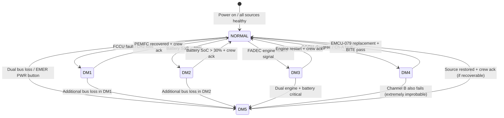
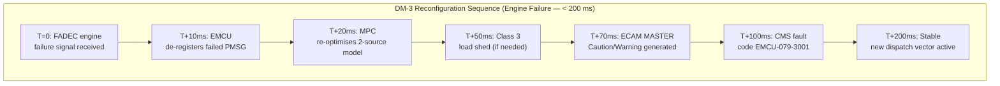

<!-- ──────────────────────────────────────────────────────────────────────────
     QATL-ATLAS-1000-ATLAS-070-079-07-079-050-ENERGY-DEGRADED-MODES-AND-RECONFIGURATION
     ATA 79 · Energy Degraded Modes and Reconfiguration
     programme-defined aircraft type — ATLAS Register 1000
────────────────────────────────────────────────────────────────────────────── -->

# Energy Degraded Modes and Reconfiguration

---

## §0 Hyperlink Policy

> All hyperlinks in this document are **relative** (five directory levels: `../../../../../`).
> Absolute URLs are forbidden. Every linked document must exist in the Q+ATLANTIDE repository
> before the link is activated. Broken links are treated as open issues and must be resolved
> before the document is promoted from `DRAFT` to `APPROVED`.

---

## §1 Purpose

This document defines the agnostic ATLAS standard-level architecture context for `Energy Degraded Modes and Reconfiguration`.

It describes the controlled scope, functions, interfaces, safety considerations, lifecycle traceability, and S1000D/CSDB mapping logic that programme implementations shall instantiate when this node is applicable.

This document is not a programme design baseline. Programme-specific capacities, locations, part numbers, effectivity, operating limits, maintenance references, and data module codes shall be defined only inside the applicable programme implementation branch.
## §2 Applicability

| Applicability Level | Rule |
|---|---|
| Standard taxonomy | Applies to the ATLAS node `079` |
| Programme implementation | Conditional; determined by programme architecture, trade studies, certification basis, and applicability model |
| Product configuration | Defined in the programme-specific configuration baseline |
| Effectivity | Defined in the programme CSDB / applicability layer |
| Non-applicability | Must be explicitly stated in the programme impact-study branch when excluded |
## §3 Functional Description ![DRAFT]

### 3.1 Degraded Mode Overview

| Mode | Name | Trigger | Available Sources | Max Available Power |
|------|------|---------|------------------|-------------------|
| DM-1 | PEMFC Loss | FCCU fault or H₂ fuel loss | PMSG + Battery | 1 000 kW |
| DM-2 | Battery Critical SoC | Battery SoC < 20 % | PMSG + PEMFC | 800 kW |
| DM-3 | Engine Failure | FADEC engine failure signal | Battery + PEMFC (+ one PMSG) | 600 kW |
| DM-4 | EMCU Channel A Failure | CCCM disagreement / Channel A fault | All sources (single-channel EMCU) | 900 kW (reduced optimization) |
| DM-5 | Total Power Emergency | Primary HVDC + secondary bus loss | Battery reserve only | ~120 kW (Class 1, 30 min) |

### 3.2 DM-1: PEMFC Loss

**Trigger:** FCCU reports PEMFC fault (shutdown or PEMFC output < 10 kW for > 5 s), OR LH₂ supply interrupted (ATA 76 fuel press loss).

**Available power:** PMSG (up to 600 kW) + Battery (up to 400 kW) = 1 000 kW max.

**Automatic actions (< 200 ms):**
1. EMCU de-registers PEMFC from power dispatch (P_PEMFC := 0).
2. MPC re-optimises with two-source model.
3. Class 3 loads shed if PMSG available < total Class 1+2 demand.
4. ECAM **MASTER CAUTION** + EMS PEMFC LOSS message generated.
5. CMS fault code EMCU-079-1001 raised.
6. FDR event logged.

**Exit criteria:** FCCU reports PEMFC recovered AND output ≥ 50 kW for ≥ 30 s AND crew acknowledgement.

### 3.3 DM-2: Battery Critical SoC

**Trigger:** BMS reports battery SoC < 20 % (hard threshold, independent of MPC SoC target band).

**Available power:** PMSG (up to 600 kW) + PEMFC (up to 200 kW) = 800 kW max.

**Automatic actions (< 200 ms):**
1. EMCU sets P_battery_discharge := 0 (battery protected for DM-5 reserve).
2. PEMFC dispatch maximised (up to 200 kW).
3. PMSG off-take maximised within FADEC limits.
4. Class 3 loads shed.
5. ECAM **MASTER CAUTION** + EMS BATTERY CRITICAL message.
6. CMS fault code EMCU-079-2001.

**Exit criteria:** BMS reports battery SoC > 30 % for ≥ 60 s (charging from PMSG) AND crew acknowledgement.

### 3.4 DM-3: Engine / Turbofan Failure

**Trigger:** FADEC engine failure signal (engine A or B) AND confirmed engine windmill/shutdown.

**Available power (one engine):** One PMSG (300 kW) + PEMFC (200 kW) + Battery (400 kW) = 900 kW (same as normal — no power loss if only one engine fails). However, propulsion is reduced: one PMSM motor available at full power; second motor reduced to PEMFC/battery-fed limit.

**Available power (both engines):** PEMFC (200 kW) + Battery (400 kW) = 600 kW.

**Automatic actions (< 200 ms):**
1. EMCU de-registers failed engine PMSG from power dispatch.
2. MPC re-optimises: increased PEMFC + battery dispatch.
3. Class 3 loads shed (mandatory in dual engine failure only).
4. Propulsion power limit to surviving PMSM motor adjusted.
5. ECAM **MASTER CAUTION** (single engine) or **MASTER WARNING** (dual engine) + EMS ENGINE FAILURE message.
6. CMS fault code EMCU-079-3001.

**Exit criteria:** FADEC engine restart confirmed AND PMSG output ≥ 100 kW for ≥ 30 s AND crew acknowledgement.

### 3.5 DM-4: EMCU Channel A Failure

**Trigger:** CCCM disagreement > 5 % sustained for ≥ 3 cycles (30 ms), OR Channel A hardware fault detected by watchdog, OR Channel A NVM fault.

**Effect:** EMCU transitions to single-channel operation (Channel B active). Dispatch continues — optimization capability reduced by < 10 % (reactive MPC fallback in Channel B).

**Automatic actions (< 100 ms):**
1. Channel B takes over dispatch commands.
2. CCCM disengaged (only one channel active).
3. EMCU optimization degrades to reactive-priority-stack mode (no full QP optimization).
4. ECAM **MASTER CAUTION** + EMS EMCU DEGRADED message.
5. CMS fault code EMCU-079-4001.
6. Aircraft may continue flight; dispatch is required within MEL maintenance interval.

**Exit criteria:** EMCU-079 replacement AND ground BITE verification AND crew reset.

### 3.6 DM-5: Total Power Emergency

**Trigger:** Primary HVDC 540 V bus lost AND secondary HVDC 270 V bus lost (dual bus fault), OR crew activates **EMER PWR** pushbutton manually.

**Available power:** Battery direct-feed to emergency DC bus: estimated **120 kW** Class 1 loads, for a minimum **30-minute** reserve from SoC ≥ 20 %.

**Automatic actions (< 200 ms):**
1. EMCU commands BMS to route battery to emergency DC bus directly (bus contactor reconfiguration).
2. All Class 2 and Class 3 loads shed automatically (SSPCs open).
3. Class 1 emergency bus powers: flight controls (ATA 27), avionics core (ATA 34), ECAM (ATA 31), navigation (ATA 34), lighting (emergency, ATA 33), emergency comms.
4. ECAM **MASTER WARNING** + EMS TOTAL POWER EMERGENCY + audio alert.
5. CMS fault code EMCU-079-5001.
6. FDR emergency snapshot at 10 Hz.

**Exit criteria (inflight):** Pilot restores at least one power source AND bus voltage confirmed ≥ 500 V HVDC for ≥ 10 s. Class 2/3 loads restored in sequence after crew acknowledgement.

**Crew manual activation:** EMER PWR pushbutton (ATA 24 cockpit overhead panel) directly signals EMCU discrete input — activates DM-5 regardless of bus voltage.

---

## §4 Functional Breakdown

| ID | Function | Description | Cycle | DAL |
|----|----------|-------------|-------|-----|
| F-001 | Degraded mode detection | Continuous monitoring of source health, CCCM, bus voltage | 50 ms | B |
| F-002 | Automatic reconfiguration sequencing | Execute DM-x reconfiguration in < 200 ms | < 200 ms | B |
| F-003 | ECAM advisory generation | MASTER CAUTION (DM-1/2/3/4) or WARNING (DM-5) | < 1 s | C |
| F-004 | Crew notification (audio + visual) | Synthesized voice alert + ECAM | < 1 s | C |
| F-005 | Class 3 load shedding (DM-1/2/3) | Auto-shed galleys/IFE via SSPC | < 50 ms | B |
| F-006 | Class 2 load shedding (DM-3 dual engine / DM-5) | Auto-shed Class 2 via SSPC | < 50 ms | B |
| F-007 | Class 1 emergency bus routing (DM-5) | BMS contactor command for direct battery → emergency bus | < 100 ms | B |
| F-008 | Mode exit criteria monitoring | Monitor source recovery + crew acknowledgement | 1 s | C |
| F-009 | Mode restoration sequencing | Restore loads in reverse order of shedding after exit | Per sequence | B |
| F-010 | DM-5 manual crew activation | EMER PWR pushbutton discrete input processing | < 10 ms | B |
| F-011 | Degraded mode logging to CMS/FDR | Log all mode transitions, timestamps, reasons | On event | C |
| F-012 | DM-4 single-channel dispatch continuity | Maintain dispatch in Channel B without Channel A | Continuous | B |

---

## §5 System Context — Mermaid Diagram

---

## §6 Internal Architecture — Mermaid Diagram

---

## §7 Components and LRUs

| LRU | ATA | Role in Degraded Modes |
|-----|-----|----------------------|
| EMCU-079 | ATA 79 | Degraded mode detection and sequencing host |
| BMS | ATA 72 | Battery SoC reporting (DM-2 trigger); emergency bus routing (DM-5) |
| FCCU | ATA 75 | PEMFC health reporting (DM-1 trigger) |
| FADEC A/B | ATA 67 | Engine failure signal (DM-3 trigger) |
| SSPC arrays | ATA 73 | Load shedding execution for all DMs |
| ECAM | ATA 31 | MASTER CAUTION / WARNING display |
| CMS | ATA 45 | Fault code storage for all DM events |
| FDR | ATA 31 | Flight data recording during DM events |
| Bus voltage monitors | ATA 24/73 | DM-5 trigger (dual bus loss detection) |
| EMER PWR pushbutton | ATA 24 | Crew manual DM-5 activation |

---

## §8 Interfaces

| Interface | Signal | Direction | Protocol | Notes |
|-----------|--------|-----------|----------|-------|
| FCCU (ATA 75) | PEMFC health / fault | In | AFDX 664 P7 | DM-1 trigger |
| BMS (ATA 72) | Battery SoC < 20 % alert | In | AFDX 664 P7 | DM-2 trigger |
| FADEC A/B (ATA 67) | Engine failure confirmed | In | AFDX 664 P7 | DM-3 trigger |
| EMCU CCCM (internal) | Channel A/B disagreement | Internal | CCCM bus | DM-4 trigger |
| Bus voltage monitors | HVDC 540 V / 270 V loss | In | Discrete 28 V | DM-5 trigger |
| EMER PWR button | Crew manual DM-5 | In | Discrete 28 V | Cockpit overhead |
| SSPC arrays (ATA 73) | Load shed commands | Out | AFDX 664 P7 | All DMs |
| BMS (ATA 72) | Emergency bus contactor cmd | Out | AFDX 664 P7 | DM-5 only |
| ECAM (ATA 31) | MASTER CAUTION / WARNING | Out | AFDX 664 P7 | All DMs |
| CMS (ATA 45) | Fault codes EMCU-079-x001 | Out | AFDX 664 P7 | All DMs |
| FDR (ATA 31) | DM event snapshot | Out | AFDX 664 P7 | All DMs |

---

## §9 Operating Modes

| Mode | Available Power | Load Classes Active | Crew Advisory | Dispatch Status |
|------|----------------|--------------------|--------------| ---------------|
| NORMAL | 1 200 kW installed | 1, 2, 3 | None | Full MPC |
| DM-1 | 1 000 kW (no PEMFC) | 1, 2 (Class 3 shed) | MASTER CAUTION | MPC 2-source |
| DM-2 | 800 kW (no battery) | 1, 2 (Class 3 shed) | MASTER CAUTION | MPC 2-source |
| DM-3 (single engine) | 900 kW (1 PMSG + PEMFC + Bat) | 1, 2, 3 | MASTER CAUTION | MPC adjusted |
| DM-3 (dual engine) | 600 kW (PEMFC + Bat only) | 1, 2 (Class 3 shed) | MASTER WARNING | Reactive |
| DM-4 | 900 kW (all sources, Ch-B only) | 1, 2, 3 | MASTER CAUTION | Reactive priority |
| DM-5 | ~120 kW (battery reserve) | 1 only | MASTER WARNING | Emergency only |

---

## §10 Performance and Budgets ![DRAFT]

| Parameter | Requirement | Design Value |
|-----------|-------------|-------------|
| Degraded mode detection latency | < 50 ms | 50 ms |
| Reconfiguration transition time | < 200 ms | 180 ms (estimate) |
| ECAM advisory generation | < 1 s | < 500 ms |
| DM-5 reserve duration (Class 1) | ≥ 30 min at SoC = 20 % | 30 min |
| DM-5 Class 1 power | ~120 kW | 120 kW estimate |
| DM-4 optimization degradation | < 10 % vs MPC | < 10 % |
| Load shedding execution (SSPC) | < 50 ms | < 20 ms |
| Mode restoration time | < 30 s per mode | < 30 s |
| EMER PWR discrete response | < 10 ms | 10 ms |

---

## §11 Safety, Redundancy and Fault Tolerance

### 11.1 Single-Fault Tolerance

- No single failure causes DM-5 (total power emergency).
- DM-5 requires either simultaneous dual bus fault OR crew action.
- DM-4 (EMCU channel failure) does **not** degrade Class 1 power supply.
- All degraded modes verified by system simulation per SAE ARP4754A Fault Tree Analysis.

### 11.2 Safety by Design

| Safety Property | Implementation |
|----------------|---------------|
| Class 1 never shed | Hard-wired SSPC write-protection + SW constraint |
| DM-5 30-min reserve | BMS manages 20 % SoC floor across all DMs |
| No single fault → DM-5 | Fault tree verified: all paths to DM-5 require ≥ 2 failures |
| Crew warning before critical shed | ECAM MASTER WARNING with confirmation required |

### 11.3 Certification Requirements

| Standard | Requirement |
|----------|-------------|
| EASA CS-25 §25.1309 | Probability of catastrophic failure < 10⁻⁹ per FH |
| SAE ARP4754A | FHA + FTA for all 5 degraded modes |
| DO-178C DAL B | Degraded mode logic software |
| EASA AMC 25.1309 | Means of compliance for safety assessment |

---

## §12 Maintenance and Diagnostics

| Task | Interval | Tool | Procedure | Duration |
|------|----------|------|-----------|---------|
| All 5 DM simulated activation | C-check | GTU-EMCU-079 | AMM 79-050-10 | 4 hr |
| ECAM advisory verification for all DMs | C-check | GTU-EMCU-079 | AMM 79-050-20 | 1 hr |
| DM-5 emergency bus routing test | C-check | GTU-EMCU-079 + BMS test | AMM 79-050-30 | 1 hr |
| CMS fault code verification for all DMs | C-check | PMAT-079 | AMM 79-050-40 | 30 min |
| EMER PWR pushbutton function test | C-check | GTU-EMCU-079 | AMM 79-050-50 | 20 min |
| DM event log download and analysis | A-check | PMAT-079 | AMM 79-050-60 | 15 min |

---

## §13 Footprint

Degraded mode logic is hosted within EMCU-079 P1-EMCU-CORE (DO-178C DAL B). Emergency bus routing hardware is within BMS (ATA 72) and bus contactors (ATA 73). No additional LRU footprint for this document.

---

## §14 Safety and Certification References ![DRAFT]

| Reference | Description |
|-----------|-------------|
| EASA CS-25 §25.1309 | Equipment, systems safety assessment |
| EASA AMC 25.1309 | Acceptable means of compliance |
| SAE ARP4754A | System safety assessment — FHA + FTA for all 5 DMs |
| SAE ARP4761 | Safety assessment guidelines — FMEA |
| DO-178C DAL B | Degraded mode reconfiguration software |
| DO-160G | Environmental qualification of DM-related LRUs |

---

## §15 V&V Approach ![TBD]

| Activity | Pass Criterion |
|----------|---------------|
| Fault injection test (HIL) — DM-1 to DM-5 | All modes activate within timing requirements |
| Class 1 continuity test — all DMs | Class 1 power uninterrupted through all mode transitions |
| DM-5 30-min reserve validation | Battery supports Class 1 for ≥ 30 min at SoC = 20 % |
| ECAM advisory conformance test | All messages generated correctly per crew procedures |
| Certification flight test — DM-3 (simulated engine failure) | DM-3 activates correctly; ECAM as expected |
| Fault tree analysis review | P(catastrophic) < 10⁻⁹ per FH verified |

---

## §16 Glossary

| Acronym | Definition |
|---------|-----------|
| CCCM | Cross-Channel Comparison Monitor |
| DM | Degraded Mode |
| FTA | Fault Tree Analysis |
| FHA | Functional Hazard Assessment |
| EMER PWR | Emergency Power pushbutton |

---

## §17 Open Issues

| ID | Description | Owner | Target |
|----|-------------|-------|--------|
| OI-079-050-001 | Complete FTA for all 5 DMs — verify P(catastrophic) < 10⁻⁹ per FH | Q-AIR | 2026-Q4 |
| OI-079-050-002 | Define DM-5 Class 1 load list and 30-min reserve validation test | Q-GREENTECH | 2026-Q4 |
| OI-079-050-003 | Confirm DM-3 dual-engine crew procedure with flight operations | Q-AIR | 2027-Q1 |
| OI-079-050-004 | Define EMER PWR pushbutton guard/cover design with cockpit team | Q-AIR | 2026-Q3 |
| OI-079-050-005 | Validate DM-4 optimization degradation < 10 % by HIL test | Q-HPC | 2027-Q1 |

---

## §18 Status Legend

| Badge | Meaning |
|-------|---------|
|  | Content drafted but not yet reviewed |
|  | Content to be determined |
|  | Reviewed, approved and baselined |
|  | Replaced by a later revision |

---

## §19 Related Documents (Siblings in this Subsection)

| Document ID | Title | SNS |
|-------------|-------|-----|
| [079-000](./079-000-Energy-Management-System-General.md) | Energy Management System General | 079-000-00 |
| [079-010](./079-010-Energy-Management-Architecture.md) | Energy Management Architecture | 079-010-00 |
| [079-020](./079-020-Power-Demand-Prediction-and-Allocation.md) | Power Demand Prediction and Allocation | 079-020-00 |
| [079-030](./079-030-Energy-Source-Prioritization-and-Load-Shedding.md) | Energy Source Prioritization and Load Shedding | 079-030-00 |
| [079-040](./079-040-Propulsion-and-ECS-Energy-Coordination.md) | Propulsion and ECS Energy Coordination | 079-040-00 |
| [079-060](./079-060-Energy-Management-Software-and-Configuration.md) | Energy Management Software and Configuration | 079-060-00 |
| [079-070](./079-070-Energy-Management-Test-and-Maintenance.md) | Energy Management Test and Maintenance | 079-070-00 |
| [079-080](./079-080-Energy-Management-Monitoring-Diagnostics-and-Control-Interfaces.md) | EMS Monitoring, Diagnostics and Control Interfaces | 079-080-00 |
| [079-090](./079-090-S1000D-CSDB-Mapping-and-Traceability.md) | S1000D CSDB Mapping and Traceability | 079-090-00 |

---

## §20 Change Log

| Rev | Date | Author | Description |
|-----|------|--------|-------------|
| 0.1 | 2026-05-12 | Q-GREENTECH | Initial DRAFT — baseline document creation |
