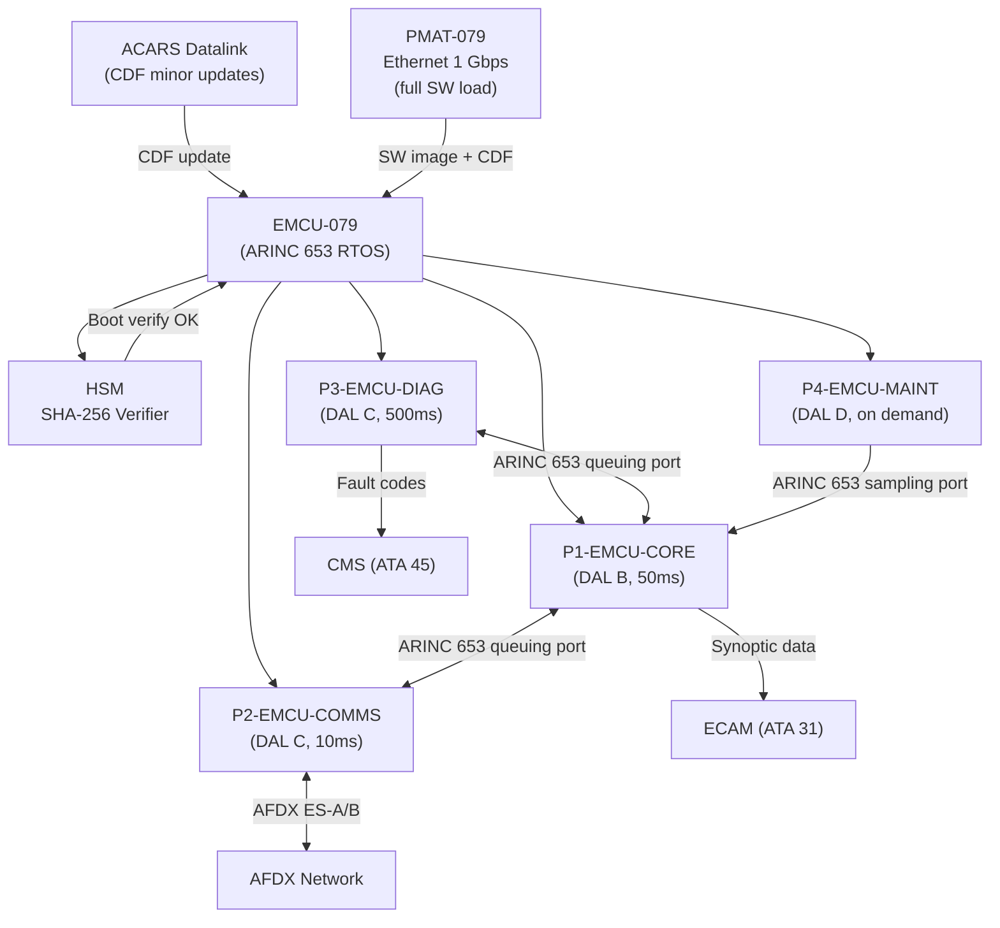
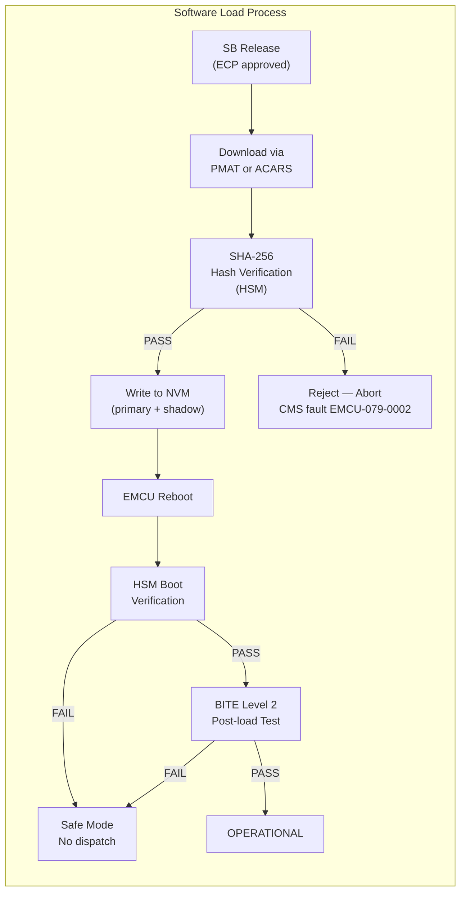

<!-- ──────────────────────────────────────────────────────────────────────────
     QATL-ATLAS-1000-ATLAS-070-079-07-079-060-ENERGY-MANAGEMENT-SOFTWARE-AND-CONFIGURATION
     ATA 79 · Energy Management Software and Configuration
     AMPEL360E eWTW — ATLAS Register 1000
────────────────────────────────────────────────────────────────────────────── -->

# Energy Management Software and Configuration


---

## §0 Hyperlink Policy

> All hyperlinks in this document are **relative** (five directory levels: `../../../../../`).
> Absolute URLs are forbidden. Every linked document must exist in the Q+ATLANTIDE repository
> before the link is activated. Broken links are treated as open issues and must be resolved
> before the document is promoted from `DRAFT` to `APPROVED`.

---

## §1 Purpose

This document describes the **EMCU software architecture**, ARINC 653 partition structure, **Configuration Data File (CDF)** management process, software load and verification procedures, and configuration-controlled MPC algorithm parameters.

It is the primary reference for EMCU software developers, system integrators, DER reviewers, and maintenance engineers responsible for EMCU software management throughout the aircraft service life.

---

## §2 Applicability

| Field | Value |
|-------|-------|
| Aircraft Program | AMPEL360E eWTW |
| ATA Reference | ATA 79-060 |
| Certification Basis | EASA CS-25 Amendment 27+, DO-178C, ARINC 653 Issue 2 |
| S1000D SNS | 079-060-00 |
| Applicable MSN | All AMPEL360E eWTW series aircraft |
| Effectivity | From MSN 001 |

---

## §3 Functional Description ![DRAFT]

### 3.1 ARINC 653 Partitioned RTOS

The EMCU executes under an **ARINC 653 Issue 2** compliant partitioned Real-Time Operating System. The RTOS scheduler enforces strict **temporal** (time budget per partition per Major Frame) and **spatial** (MMU-enforced memory) separation between all partitions.

**Major Frame** = 50 ms (driven by P1-EMCU-CORE MPC cycle requirement).

| Partition | Name | DAL | Time Slot | Memory Budget | Function |
|-----------|------|-----|-----------|--------------|---------|
| P1 | P1-EMCU-CORE | B | 25 ms / 50 ms MF | 128 MB | MPC engine, source dispatch, load management, degraded modes |
| P2 | P2-EMCU-COMMS | C | 8 ms / 50 ms MF | 32 MB | AFDX ES-A/B driver, message routing, watchdog monitoring |
| P3 | P3-EMCU-DIAG | C | 5 ms / 50 ms MF | 16 MB | BITE Level 1/2, FDI engine, CMS health reporting |
| P4 | P4-EMCU-MAINT | D | 2 ms / 50 ms MF (on demand) | 8 MB | Maintenance mode, PMAT interface, CDF management |

**Inter-partition communication** uses ARINC 653 QUEUING PORTS (P1 ↔ P2, P3 ↔ P1) and SAMPLING PORTS (P4 → P1 for CDF parameters). No direct inter-partition memory access is permitted.

### 3.2 Software Part Numbering

EMCU software Part Numbers follow the convention:

```
SW-EMCU-079-{PARTITION}-v{Major}.{Minor}.{Patch}
```

Examples:
- `SW-EMCU-079-P1-v1.0.0` — P1-EMCU-CORE version 1.0.0
- `SW-EMCU-079-CDF-v1.0.0` — Configuration Data File version 1.0.0
- `SW-EMCU-079-RTOS-v2.3.1` — RTOS kernel version 2.3.1

A **composite Software Configuration Index (SCI)** defines the complete EMCU software build:
```
SCI-EMCU-079-v{x}.{y} = {SW-P1-vX, SW-P2-vX, SW-P3-vX, SW-P4-vX, CDF-vX, RTOS-vX}
```

### 3.3 Configuration Data File (CDF)

The CDF contains all **operator-adjustable MPC parameters** that are not part of the certified software algorithm. The CDF is managed per **DO-178C Section 7 guidance** for user-modifiable software.

**CDF contents:**

| Parameter | Description | Nominal Value | Range | Units |
|-----------|-------------|---------------|-------|-------|
| SoC_target | Battery SoC optimisation target | 55 | 30–70 | % |
| SoC_min_hard | Hard minimum SoC (DM-2 trigger) | 20 | 15–25 | % |
| SoC_max_hard | Hard maximum SoC (overcharge protection) | 95 | 90–98 | % |
| w1_SoC | MPC SoC deviation weighting | 1.0 | 0.5–2.0 | — |
| w2_PMSG | MPC PMSG fuel penalty weighting | 0.3 | 0.1–0.8 | — |
| w3_battery | MPC battery stress weighting | 0.1 | 0.05–0.5 | — |
| P_prop_min_PORT | Min safe propulsion power limit — PORT | TBD | 10–100 | kW |
| P_prop_min_STBD | Min safe propulsion power limit — STBD | TBD | 10–100 | kW |
| ECS_min | Minimum ECS power (pressurisation) | 20 | 10–30 | kW |
| MPC_horizon_N | Prediction horizon steps | 20 | 10–30 | steps |
| MPC_dt | Prediction time step | 3 | 1–5 | s |
| shed_class3_threshold | Class 3 shed trigger shortfall | 20 | 5–50 | kW |
| shed_class2_threshold | Class 2 partial shed trigger shortfall | 50 | 20–100 | kW |
| regen_max_charge | Max battery charge rate (regen) | 200 | 50–200 | kW |

**CDF change process:**
1. Engineering Change Proposal (ECP) raised by Q-GREENTECH.
2. Impact assessment: CDF changes require SW-EMCU-079-CDF version increment.
3. If CDF change affects MPC algorithm logic: P1 re-verification required (full DO-178C cycle).
4. If CDF change is parameter-only: expedited review + independent DER acceptance.
5. CDF loaded via ACARS datalink or PMAT-079 with SHA-256 hash verification by HSM.
6. Dual-key authorization (OEM + airline engineering sign-off) required in PMAT-079 CDF loader.

### 3.4 Software Load and Verification

**Load paths:**

| Path | Speed | Use Case |
|------|-------|---------|
| ACARS datalink | ~50 kbps effective | Minor CDF updates in service |
| PMAT-079 Ethernet (1 Gbps) | Full partition images | Major SW updates, initial SW load |

**Load procedure:**
1. Initiate software load mode (P4-EMCU-MAINT active, aircraft WoW required).
2. Transmit SW image(s) to EMCU NVM via PMAT or ACARS.
3. EMCU verifies SHA-256 digest of each partition image (HSM).
4. Partition images written to NVM with redundant copy (primary + shadow NVM areas).
5. Reboot EMCU: HSM verifies both NVM copies; uses primary if both valid.
6. P3-EMCU-DIAG executes post-load BITE Level 2 self-test.
7. BITE Level 2 result reported to CMS and PMAT — PASS required before EMCU operational.

**Build environment requirements:**
- Deterministic build toolchain (DO-178C §12 configuration management).
- Cross-compiler: qualified per DO-178C §12 (qualification data maintained).
- Version control: all source code under configuration management.
- Build reproducibility: identical inputs → identical outputs (verified by independent rebuild).

---

## §4 Functional Breakdown

| ID | Function | Description | Cycle | DAL |
|----|----------|-------------|-------|-----|
| F-001 | ARINC 653 RTOS scheduling (4 partitions) | Time/space separation enforcement | 50 ms MF | RTOS |
| F-002 | P1-EMCU-CORE execution | MPC engine, dispatch, degraded modes | 50 ms | B |
| F-003 | P2-EMCU-COMMS execution | AFDX dual-star driver + message routing | 10 ms | C |
| F-004 | P3-EMCU-DIAG execution | BITE L1/L2, FDI, CMS reporting | 500 ms | C |
| F-005 | P4-EMCU-MAINT execution | Maintenance interface, CDF management | On demand | D |
| F-006 | CDF parameter management | Load, verify, apply CDF to P1 via sampling port | On CDF load | B |
| F-007 | Software load (PMAT/ACARS) | Receive, verify (SHA-256), write SW images to NVM | On demand | C |
| F-008 | HSM boot integrity check | Verify all partition SHA-256 digests at power-on | Boot | B |
| F-009 | Post-load BITE Level 2 | Automated verification after SW load | Post-load | C |
| F-010 | SW configuration index reporting | Report current SCI to CMS and PMAT | On demand | C |
| F-011 | Dual-key CDF authorization | Verify dual-key signatures before CDF application | On CDF load | C |
| F-012 | RTOS health monitoring | Detect partition overrun / missed deadlines | 50 ms MF | C |

---

## §5 System Context — Mermaid Diagram



---

## §6 Internal Architecture — Mermaid Diagram



---

## §7 Components and LRUs

| Component | Role | Notes |
|-----------|------|-------|
| EMCU-079 | Hosts all SW partitions (P1–P4) | 4 MCU ARINC 600 chassis |
| EMCU-HSM-079 | SHA-256 boot verification + CDF authorization | Integral to EMCU-079 |
| PMAT-079 | SW load tool (Ethernet 1 Gbps) | GSE — portable |
| ACARS subsystem | CDF minor update path | Aircraft standard (not EMCU LRU) |
| Build environment (OEM) | DO-178C §12 qualified toolchain | Not installed on aircraft |

### 7.1 NVM Partition Map

| NVM Area | Contents | Size (estimate) |
|----------|----------|----------------|
| Primary P1 | P1-EMCU-CORE image + CDF | 4 MB |
| Shadow P1 | Backup copy of primary P1 | 4 MB |
| Primary P2 | P2-EMCU-COMMS image | 1 MB |
| Shadow P2 | Backup | 1 MB |
| Primary P3 | P3-EMCU-DIAG image | 1 MB |
| Primary P4 | P4-EMCU-MAINT image | 500 KB |
| RTOS kernel | ARINC 653 RTOS image | 2 MB |
| Fault log | NVM fault event storage (≥ 10 000 entries) | 10 MB |
| CDF current | Active CDF parameters | 64 KB |
| CDF backup | Previous valid CDF | 64 KB |

---

## §8 Interfaces

| Interface | Signal | Direction | Protocol |
|-----------|--------|-----------|----------|
| PMAT-079 Ethernet | SW image + CDF transfer | In | Ethernet 1 Gbps (TFTP/SFTP) |
| ACARS datalink | CDF update | In | ACARS (via aircraft comms) |
| HSM (internal) | SW digest verification | Internal | Internal bus |
| AFDX ES-A/B (P2) | All EMCU runtime comms | In/Out | ARINC 664 P7 |
| CMS (ATA 45) | SW load status, BITE results | Out | AFDX 664 P7 |
| ECAM (ATA 31) | SW version advisory | Out | AFDX 664 P7 |
| WoW discrete | Ground-mode enable for SW load | In | 28 V DC discrete |

---

## §9 Operating Modes

| Mode | SW State | P4 Active | CDF Load Permitted |
|------|----------|-----------|-------------------|
| Normal Operational | All 4 partitions running | No (on-demand only) | No |
| SW Load Mode | P4 active, aircraft WoW | Yes | Yes (PMAT + dual-key) |
| Degraded SW (P2/P3 fault) | P1 continues, P2/P3 reset | No | No |
| Safe Mode | HSM boot failure — no P1 | No | Yes (required to clear) |
| CDF Update Mode | All partitions, P4 active briefly | Yes | Yes (ACARS or PMAT) |

---

## §10 Performance and Budgets ![DRAFT]

| Parameter | Requirement | Value |
|-----------|-------------|-------|
| P1-EMCU-CORE cycle (MF) | 50 ms | 50 ms |
| P1 WCET (MPC QP solver) | < 25 ms | TBD by bench test |
| P2-EMCU-COMMS cycle | 10 ms | 10 ms |
| P3-EMCU-DIAG cycle | 500 ms | 500 ms |
| HSM boot verification | < 2 s | 1.8 s (estimate) |
| BITE Level 2 post-load | < 15 min | TBD |
| SW load time (full image, PMAT) | < 10 min | TBD |
| CDF load time (ACARS) | < 5 min | TBD |
| MC/DC coverage (P1 DAL B) | 100 % | Requirement |
| NVM fault log capacity | ≥ 10 000 entries | 10 000 |

---

## §11 Safety, Redundancy and Fault Tolerance

### 11.1 Partition Isolation

ARINC 653 MMU hardware enforcement ensures:
- P4 (DAL D) cannot write to P1 (DAL B) memory — hardware fault on violation.
- P2 (DAL C) AFDX driver cannot corrupt P1 algorithm memory.
- Partition deadline miss detected by RTOS → partition reset (does not affect other partitions).

### 11.2 Software Integrity

- SHA-256 HSM verification prevents unauthorized or corrupted firmware from running.
- Primary + shadow NVM copies ensure recovery from single NVM cell failure.
- CDF dual-key authorization prevents unauthorized parameter changes.
- Independent DER review required for all DO-178C DAL B changes.

### 11.3 Build Integrity

| Control | Mechanism |
|---------|-----------|
| Source code control | Git with signed commits, access controlled |
| Build reproducibility | Verified by independent rebuild comparison |
| Tool qualification | Compiler/linker qualified per DO-178C §12 |
| Formal code review | Peer review + independent inspection for P1 |

---

## §12 Maintenance and Diagnostics

| Task | Interval | Tool | Procedure |
|------|----------|------|-----------|
| Annual SW integrity hash check | Annual | PMAT-079 | AMM 79-060-10 |
| SW update (SB-driven) | Per SB | PMAT-079 | AMM 79-060-20 (SW load) |
| CDF parameter verification | C-check | PMAT-079 | AMM 79-060-30 |
| SW configuration index readout | On condition / A-check | PMAT-079 | AMM 79-060-40 |
| BITE Level 2 post-load verification | After any SW load | Automatic (EMCU) | AMM 79-060-50 |
| CDF update (ACARS) | Per maintenance bulletin | ACARS / PMAT | AMM 79-060-60 |

---

## §13 Footprint

All software functions are hosted within EMCU-079 hardware. No additional LRU footprint.

| Software Element | NVM Size | RAM Size |
|-----------------|----------|---------|
| P1-EMCU-CORE | ~4 MB | ~64 MB (runtime) |
| P2-EMCU-COMMS | ~1 MB | ~16 MB |
| P3-EMCU-DIAG | ~1 MB | ~8 MB |
| P4-EMCU-MAINT | ~0.5 MB | ~4 MB |
| RTOS kernel | ~2 MB | ~4 MB |
| CDF | ~64 KB | ~16 KB |

---

## §14 Safety and Certification References ![DRAFT]

| Reference | Description |
|-----------|-------------|
| DO-178C | Software certification — DAL B (P1), DAL C (P2/P3), DAL D (P4) |
| ARINC 653 Issue 2 | Partitioned OS specification |
| RTCA DO-297 | IMA development guidance |
| EASA AMC 20-115D | Software aspects of certification |
| DO-178C §7 | User-modifiable software (CDF guidance) |
| DO-178C §12 | Configuration management — build environment |
| EASA AMC 20-189 | Software load guidelines |

---

## §15 V&V Approach ![TBD]

| Activity | Standard | Pass Criterion |
|----------|----------|---------------|
| Unit test — P1 | DO-178C | 100 % MC/DC coverage |
| Structural coverage — P1 | DO-178C DAL B | 100 % decision, condition, MC/DC |
| ARINC 653 partition isolation test | ARINC 653 | P4 cannot corrupt P1 memory |
| HSM integrity test (corrupt image) | DO-178C | Safe mode activates, no dispatch |
| CDF dual-key test | DO-178C §7 | Single key rejected, dual key accepted |
| SW load test | AMM 79-060-20 | All partitions load and verify |
| Post-load BITE test | Automatic | BITE Level 2 PASS |
| Independent DER review | DO-178C | DER acceptance of P1 software |

---

## §16 Glossary

| Acronym | Definition |
|---------|-----------|
| ACARS | Aircraft Communications Addressing and Reporting System |
| CDF | Configuration Data File |
| DER | Designated Engineering Representative |
| ECP | Engineering Change Proposal |
| MC/DC | Modified Condition/Decision Coverage |
| MMU | Memory Management Unit |
| NVM | Non-Volatile Memory |
| RTOS | Real-Time Operating System |
| SB | Service Bulletin |
| SCI | Software Configuration Index |
| SFTP | Secure File Transfer Protocol |
| TFTP | Trivial File Transfer Protocol |
| WCET | Worst-Case Execution Time |

---

## §17 Open Issues

| ID | Description | Owner | Target |
|----|-------------|-------|--------|
| OI-079-060-001 | Select and qualify ARINC 653 RTOS product | Q-GREENTECH / OEM | 2026-Q3 |
| OI-079-060-002 | Complete P1-EMCU-CORE WCET analysis on selected DSP | Q-HPC | 2026-Q4 |
| OI-079-060-003 | Define DO-178C §7 CDF qualification plan with DER | Q-GREENTECH | 2026-Q3 |
| OI-079-060-004 | Define ACARS CDF update protocol with airline ops team | Q-GREENTECH | 2026-Q4 |
| OI-079-060-005 | Establish DO-178C §12 build environment qualification record | Q-HPC | 2026-Q3 |

---

## §18 Status Legend

| Badge | Meaning |
|-------|---------|
|  | Content drafted but not yet reviewed |
|  | Content to be determined |
|  | Reviewed, approved and baselined |
|  | Replaced by a later revision |

---

## §19 Related Documents (Siblings in this Subsection)

| Document ID | Title | SNS |
|-------------|-------|-----|
| [079-000](./079-000-Energy-Management-System-General.md) | Energy Management System General | 079-000-00 |
| [079-010](./079-010-Energy-Management-Architecture.md) | Energy Management Architecture | 079-010-00 |
| [079-020](./079-020-Power-Demand-Prediction-and-Allocation.md) | Power Demand Prediction and Allocation | 079-020-00 |
| [079-030](./079-030-Energy-Source-Prioritization-and-Load-Shedding.md) | Energy Source Prioritization and Load Shedding | 079-030-00 |
| [079-040](./079-040-Propulsion-and-ECS-Energy-Coordination.md) | Propulsion and ECS Energy Coordination | 079-040-00 |
| [079-050](./079-050-Energy-Degraded-Modes-and-Reconfiguration.md) | Energy Degraded Modes and Reconfiguration | 079-050-00 |
| [079-070](./079-070-Energy-Management-Test-and-Maintenance.md) | Energy Management Test and Maintenance | 079-070-00 |
| [079-080](./079-080-Energy-Management-Monitoring-Diagnostics-and-Control-Interfaces.md) | EMS Monitoring, Diagnostics and Control Interfaces | 079-080-00 |
| [079-090](./079-090-S1000D-CSDB-Mapping-and-Traceability.md) | S1000D CSDB Mapping and Traceability | 079-090-00 |

---

## §20 Change Log

| Rev | Date | Author | Description |
|-----|------|--------|-------------|
| 0.1 | 2026-05-12 | Q-GREENTECH / Q-HPC | Initial DRAFT — baseline document creation |
