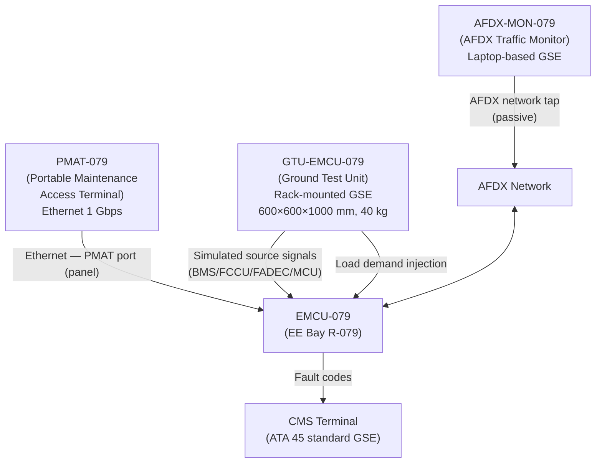

<!-- ──────────────────────────────────────────────────────────────────────────
     QATL-ATLAS-1000-ATLAS-070-079-07-079-070-ENERGY-MANAGEMENT-TEST-AND-MAINTENANCE
     ATA 79 · Energy Management Test and Maintenance
     AMPEL360E eWTW — ATLAS Register 1000
────────────────────────────────────────────────────────────────────────────── -->

# Energy Management Test and Maintenance

---

## §0 Hyperlink Policy

> All hyperlinks in this document are **relative** (five directory levels: `../../../../../`).
> Absolute URLs are forbidden. Every linked document must exist in the Q+ATLANTIDE repository
> before the link is activated. Broken links are treated as open issues and must be resolved
> before the document is promoted from `DRAFT` to `APPROVED`.

---

## §1 Purpose

This document defines all **scheduled maintenance tasks**, **ground test procedures**, **BITE diagnostic procedures**, and **special tooling** requirements for the EMCU and the EMS architecture. It serves as the primary maintenance engineering reference and as the basis for AMM Chapter 79 task development under the MSG-3 maintenance planning process.

---

## §2 Applicability

| Field | Value |
|-------|-------|
| Aircraft Program | AMPEL360E eWTW |
| ATA Reference | ATA 79-070 |
| Certification Basis | EASA CS-25 Amendment 27+, EASA Part-145 |
| S1000D SNS | 079-070-00 |
| Applicable MSN | All AMPEL360E eWTW series aircraft |
| Effectivity | From MSN 001 |

---

## §3 Functional Description ![DRAFT]

### 3.1 Maintenance Philosophy

The EMCU and EMS are maintained using a **MSG-3 on-condition and interval-based** philosophy:

- **On-condition**: EMCU-079 is replaced when BITE fault codes indicate a verified hardware fault (after BITE isolation to LRU level).
- **Interval-based**: BITE data download at A-check; functional verification at C-check; software integrity check annually.
- **No life limits**: The EMCU-079 has no defined hard-life limit; MTBF ≥ 50 000 FH; shelf-life 10 years.

### 3.2 Maintenance Task Summary

| Task ID | Task Name | Interval | Duration | Access Level |
|---------|-----------|----------|----------|-------------|
| MT-001 | BITE Level 1 data download | A-check (600 FH) | ~10 min | Line |
| MT-002 | EMCU functional verification (all modes) | C-check (6 000 FH) | ~4 hr | Heavy |
| MT-003 | MPC parameter CDF verification | C-check | ~30 min | Heavy |
| MT-004 | All 5 degraded modes activation and verification | C-check | ~2 hr (within MT-002) | Heavy |
| MT-005 | ECAM EMS synoptic advisory verification | C-check | ~1 hr (within MT-002) | Heavy |
| MT-006 | Software integrity hash check | Annual | ~5 min | Line |
| MT-007 | EMCU-079 swap-out | On condition | ≤ 45 min | Line |
| MT-008 | EMCU-IO-079 swap-out | On condition | ~20 min | Line |
| MT-009 | EMCU-PSUP-079 swap-out | On condition | ~15 min | Line |
| MT-010 | AFDX traffic analysis for EMCU nodes | On condition | ~30 min | Line |
| MT-011 | CMS fault code dictionary verification | C-check | ~30 min | Heavy |
| MT-012 | Load shedding Stage 1/2/3 functional test | C-check | ~1 hr (within MT-002) | Heavy |

### 3.3 Maintenance Access

**EE Bay Zone 100 Access:**
- EMCU-079 is accessible via EE Bay access panel (Zone 100, right side of fuselage).
- No special ladder or scaffolding required — standard EE bay access.
- EMCU PMAT Ethernet port accessible without removing EMCU from rack (panel-accessible connector).
- EMCU-079 rack hold-down screws: 4× ¼-turn quarter-lock fasteners (no tools required for removal after safety lock release).

**Electrical Isolation (before EMCU swap):**
1. Confirm aircraft is in maintenance mode (WoW).
2. Open CB EMCU-079-28VPB (Panel P7, CB Row C, position 14) — 28 V DC primary.
3. Open CB EMCU-079-28VHB (Panel P7, CB Row C, position 15) — 28 V DC hot backup.
4. Wait 30 s for EMCU internal capacitor discharge.
5. Verify EMCU POWER LED off before disconnecting connectors.

**No H₂ lock-out/tag-out required** for EMCU maintenance (EE bay is isolated from hydrogen fuel system).

---

## §4 Functional Breakdown

| ID | Function | Description | Cycle | DAL |
|----|----------|-------------|-------|-----|
| F-001 | BITE Level 1 data download (MT-001) | Extract NVM fault log via PMAT-079 Ethernet | A-check | C |
| F-002 | Full functional verification (MT-002) | GTU-EMCU-079 drives all EMCU modes; verify dispatch commands | C-check | C |
| F-003 | CDF parameter verification (MT-003) | Read CDF from EMCU NVM; compare to baseline | C-check | C |
| F-004 | Degraded mode test (MT-004) | GTU activates DM-1 to DM-5; verify ECAM + CMS | C-check | C |
| F-005 | SW integrity hash (MT-006) | PMAT requests hash; HSM computes and returns SHA-256 | Annual | C |
| F-006 | EMCU swap procedure (MT-007) | Remove/replace EMCU-079; verify BITE post-swap | On cond. | N/A |
| F-007 | AFDX traffic analysis (MT-010) | AFDX-MON-079 captures EMCU messages; verify frame rates | On cond. | N/A |
| F-008 | CMS fault dictionary update | Apply updated fault code dictionary via PMAT | C-check | N/A |
| F-009 | Load shedding test (MT-012) | GTU injects supply deficit; verify Stage 1/2/3 shedding | C-check | C |
| F-010 | EMCU configuration readout | Read and record EMCU SCI (SW version) via PMAT | Each event | C |

---

## §5 System Context — Mermaid Diagram

---

## §6 Internal Architecture — Mermaid Diagram

```mermaid
flowchart TD
    subgraph A_CHECK ["A-Check Maintenance Procedure (MT-001)"]
        A1["1. Connect PMAT-079\nto EMCU panel port"] --> A2["2. Select BITE L1\ndata download"]
        A2 --> A3["3. EMCU transmits\nNVM fault log\n(~10 min)"]
        A3 --> A4["4. Analyse fault log:\ncheck for recurring faults"]
        A4 --> A5["5. Record SCI (SW version)\nin maintenance log"]
        A5 --> A6["6. Disconnect PMAT-079\n— Task complete"]
    end

    subgraph C_CHECK ["C-Check Functional Test (MT-002 summary)"]
        C1["1. Connect GTU-EMCU-079\nand PMAT-079"] --> C2["2. GTU simulates\nall sources + loads"]
        C2 --> C3["3. Verify all operating\nmodes (§9 mode table)"]
        C3 --> C4["4. Activate DM-1 to DM-5\n(MT-004)"]
        C4 --> C5["5. Verify ECAM\nadvisories (MT-005)"]
        C5 --> C6["6. Verify load shedding\nStage 1/2/3 (MT-012)"]
        C6 --> C7["7. Verify CDF parameters\n(MT-003)"]
        C7 --> C8["8. Record results\nin AMM logbook"]
    end
```

---

## §7 Components and LRUs

### 7.1 Aircraft LRUs

| LRU Part Number | Qty | Location | Description | MTTRepair |
|----------------|-----|----------|-------------|-----------|
| EMCU-079 | 1 | EE Bay R-079 | Energy Management Control Unit | ≤ 45 min |
| EMCU-PSUP-079 | 1 | EE Bay R-079 | Power Supply Unit | ≤ 15 min |
| EMCU-IO-079 | 2 | EE Bay R-079 | I/O Expander Module | ≤ 20 min |

### 7.2 Ground Support Equipment (GSE)

| GSE Part Number | Description | Dimensions | Mass | Usage |
|----------------|-------------|-----------|------|-------|
| PMAT-079 | Portable Maintenance Access Terminal (handheld, ruggedised laptop with EMCU SW) | 350×250×50 mm | 3 kg | All maintenance tasks |
| GTU-EMCU-079 | Ground Test Unit — source simulators (BMS/FCCU/FADEC/MCU), load injectors, test sequencer | 600×600×1000 mm (rack) | 40 kg | C-check functional test |
| AFDX-MON-079 | AFDX Traffic Monitor/Analyser (laptop + AFDX tap) | Laptop-based | 2 kg | AFDX diagnostics |
| EMCU-BENCH-SET | Bench test equipment for Level 3 BITE (shop) | Varies (shop-installed) | — | Shop maintenance |

### 7.3 BITE Isolation Capability

| Fault Type | BITE Isolation Level | Fault Code Format |
|-----------|---------------------|------------------|
| EMCU-079 hardware fault (board-level) | LRU (EMCU-079) | EMCU-079-0xxx |
| EMCU-PSUP-079 fault | LRU (EMCU-PSUP-079) | EMCU-079-01xx |
| EMCU-IO-079 fault | LRU (EMCU-IO-079 S/N) | EMCU-079-02xx |
| AFDX ES-A loss | External LRU (see ATA 73) | EMCU-079-03xx |
| Channel A/B disagree (DM-4) | LRU (Channel A or B identified) | EMCU-079-40xx |
| CDF parameter out of range | Software — CDF reload required | EMCU-079-06xx |
| HSM failure | EMCU-079 (HSM integral) | EMCU-079-00xx |

---

## §8 Interfaces

| Interface | Signal | Direction | Protocol | Maintenance Use |
|-----------|--------|-----------|----------|----------------|
| PMAT-079 Ethernet | BITE data, CDF, SW load | In/Out | Ethernet 1 Gbps | All maintenance tasks |
| ARINC 429 legacy port | Legacy GSE access | In/Out | ARINC 429 hi-speed | Backward compatibility |
| GTU simulation inputs | BMS/FCCU/FADEC/MCU signal simulation | In | Proprietary GTU | MT-002, MT-004, MT-012 |
| AFDX-MON-079 tap | Passive AFDX monitoring | In | ARINC 664 P7 passive | MT-010 |
| CMS terminal | Fault code readout | In | CMS standard | All tasks |
| WoW discrete | Ground mode confirmation | In | 28 V DC | SW load / EMCU swap |

---

## §9 Operating Modes

| Mode | Aircraft State | PMAT Active | GTU Active | EMCU Dispatch |
|------|--------------|-------------|-----------|--------------|
| Line maintenance — BITE download | WoW, powered | Yes (L1 BITE only) | No | Normal |
| Ground functional test | WoW, powered | Yes | Yes | GTU-simulated |
| EMCU swap | WoW, de-energised | No | No | Off |
| Bench test (shop) | Bench | PMAT (Level 3) | Bench set | Bench-simulated |
| AFDX traffic analysis | WoW, powered | Optional | Optional (passive) | Normal |

---

## §10 Performance and Budgets ![DRAFT]

| Parameter | Requirement | Value |
|-----------|-------------|-------|
| BITE Level 1 download time | < 10 min | ~8 min (estimate) |
| C-check functional test duration | < 4 hr | ~3.5 hr (estimate) |
| EMCU-079 swap-out time | ≤ 45 min | 45 min (design target) |
| EMCU-PSUP-079 swap-out | ≤ 15 min | 15 min |
| EMCU-IO-079 swap-out | ≤ 20 min | 20 min |
| SW integrity check | < 5 min | ~3 min |
| MTBF EMCU-079 | ≥ 50 000 FH | TBD (OEM) |
| Shelf life EMCU-079 | 10 years | Design |
| BITE fault isolation rate | ≥ 95 % to LRU | Design requirement |
| GTU-EMCU-079 mass | ≤ 45 kg | 40 kg (design) |

---

## §11 Safety, Redundancy and Fault Tolerance

### 11.1 Maintenance Safety Precautions

| Hazard | Control |
|--------|---------|
| 28 V DC electrical shock | Open CB before EMCU removal; verify POWER LED off |
| AFDX network injection (GTU) | GTU operates in isolated mode — cannot inject false data to live aircraft systems during WoW |
| H₂ leak (ATA 76) | Not applicable in EE bay Zone 100 — H₂ system isolated from EE bay |
| ESD damage to EMCU boards | ESD wrist strap required during EMCU LRU handling |
| Heavy GSE (GTU rack) | GTU-EMCU-079 requires 2-person lift or dolly (40 kg) |

### 11.2 GTU Isolation

GTU-EMCU-079 **cannot** override aircraft flight-critical systems during ground test:
- GTU generates simulated AFDX messages addressed to EMCU only (filtered by AFDX switch).
- GTU cannot address BMS, FADEC, MCU, or FCC directly.
- EMCU BITE test output are monitored by GTU but do not flow to flight systems.

---

## §12 Maintenance and Diagnostics

This section IS the primary maintenance task reference for ATA 79-070.

### 12.1 Scheduled Tasks (MSG-3)

| Task | Task ID | Interval | Man-Hours | AMM Reference |
|------|---------|----------|-----------|---------------|
| BITE download | MT-001 | A-check (600 FH) | 0.5 | AMM 79-070-10 |
| Full functional verification | MT-002 | C-check (6 000 FH) | 4.0 | AMM 79-070-20 |
| CDF verification | MT-003 | C-check | 0.5 | AMM 79-070-30 |
| Degraded mode test | MT-004 | C-check (within MT-002) | — | AMM 79-070-40 |
| ECAM advisory test | MT-005 | C-check (within MT-002) | — | AMM 79-070-50 |
| SW integrity hash | MT-006 | Annual | 0.1 | AMM 79-070-60 |
| Load shedding test | MT-012 | C-check (within MT-002) | — | AMM 79-070-70 |
| CMS fault dictionary verification | MT-011 | C-check | 0.5 | AMM 79-070-80 |

### 12.2 Unscheduled / On-Condition Tasks

| Task | Task ID | AMM Reference |
|------|---------|---------------|
| EMCU-079 swap-out | MT-007 | AMM 79-070-90 |
| EMCU-IO-079 swap | MT-008 | AMM 79-070-91 |
| EMCU-PSUP-079 swap | MT-009 | AMM 79-070-92 |
| AFDX traffic analysis | MT-010 | AMM 79-070-93 |

---

## §13 Footprint

| GSE | Location | Size | Mass |
|-----|----------|------|------|
| PMAT-079 | Portable (EE bay access) | Handheld | 3 kg |
| GTU-EMCU-079 | Hangar / maintenance bay | 600×600×1000 mm rack | 40 kg |
| AFDX-MON-079 | Portable (laptop + tap) | Laptop | 2 kg |

GTU-EMCU-079 requires:
- 230 V AC / 16 A single-phase power supply (hangar power).
- AFDX tap cable to aircraft AFDX ES-A test port (aircraft panel accessible).
- Ground connection (ESD).

---

## §14 Safety and Certification References ![DRAFT]

| Reference | Description |
|-----------|-------------|
| EASA Part-145 | Approved maintenance organisation requirements |
| AMM Chapter 79 | Aircraft Maintenance Manual — EMS procedures |
| MSG-3 | Maintenance Steering Group — task development methodology |
| DO-160G | Environmental qualification of GSE tools |
| EASA CS-25 §25.1309 | Maintenance access for continued airworthiness |
| EASA AMC 25.1309 | Maintenance and inspection intervals |

---

## §15 V&V Approach ![TBD]

| Activity | Pass Criterion |
|----------|---------------|
| MT-002 functional test (C-check) | All EMCU modes verify per test matrix |
| MT-004 degraded mode test | All 5 DMs activate and restore correctly |
| MT-005 ECAM advisory test | All advisories match crew procedure card |
| MT-012 load shedding test | Stages 1, 2, 3 execute in correct sequence and timing |
| MT-006 SW integrity hash | SHA-256 matches factory baseline hash |
| MT-007 post-swap BITE test | BITE Level 2 PASS after EMCU-079 replacement |
| First article maintenance test | All MT tasks executed on first production aircraft; durations confirmed |

---

## §16 Glossary

| Acronym | Definition |
|---------|-----------|
| AMM | Aircraft Maintenance Manual |
| CB | Circuit Breaker |
| ESD | Electrostatic Discharge |
| GSE | Ground Support Equipment |
| GTU | Ground Test Unit |
| LOTO | Lock-Out / Tag-Out |
| MSG-3 | Maintenance Steering Group Method 3 |
| MTTRepair | Mean Time To Repair |
| PMAT | Portable Maintenance Access Terminal |
| WoW | Weight-on-Wheels |

---

## §17 Open Issues

| ID | Description | Owner | Target |
|----|-------------|-------|--------|
| OI-079-070-001 | Confirm EMCU-079 MTTRepair ≤ 45 min on first article installation | Q-MECHANICS | 2027-Q1 |
| OI-079-070-002 | Define GTU-EMCU-079 design requirements document | Q-MECHANICS | 2026-Q4 |
| OI-079-070-003 | Confirm C-check total functional test duration ≤ 4 hr | Q-GREENTECH | 2027-Q1 |
| OI-079-070-004 | Define AFDX-MON-079 tool specification and procurement | Q-HPC | 2026-Q4 |
| OI-079-070-005 | Develop AMM Chapter 79 task procedures (all MT-xxx tasks) | Q-GREENTECH / OEM | 2027-Q2 |

---

## §18 Status Legend

| Badge | Meaning |
|-------|---------|
|  | Content drafted but not yet reviewed |
|  | Content to be determined |
|  | Reviewed, approved and baselined |
|  | Replaced by a later revision |

---

## §19 Related Documents (Siblings in this Subsection)

| Document ID | Title | SNS |
|-------------|-------|-----|
| [079-000](./079-000-Energy-Management-System-General.md) | Energy Management System General | 079-000-00 |
| [079-010](./079-010-Energy-Management-Architecture.md) | Energy Management Architecture | 079-010-00 |
| [079-020](./079-020-Power-Demand-Prediction-and-Allocation.md) | Power Demand Prediction and Allocation | 079-020-00 |
| [079-030](./079-030-Energy-Source-Prioritization-and-Load-Shedding.md) | Energy Source Prioritization and Load Shedding | 079-030-00 |
| [079-040](./079-040-Propulsion-and-ECS-Energy-Coordination.md) | Propulsion and ECS Energy Coordination | 079-040-00 |
| [079-050](./079-050-Energy-Degraded-Modes-and-Reconfiguration.md) | Energy Degraded Modes and Reconfiguration | 079-050-00 |
| [079-060](./079-060-Energy-Management-Software-and-Configuration.md) | Energy Management Software and Configuration | 079-060-00 |
| [079-080](./079-080-Energy-Management-Monitoring-Diagnostics-and-Control-Interfaces.md) | EMS Monitoring, Diagnostics and Control Interfaces | 079-080-00 |
| [079-090](./079-090-S1000D-CSDB-Mapping-and-Traceability.md) | S1000D CSDB Mapping and Traceability | 079-090-00 |

---

## §20 Change Log

| Rev | Date | Author | Description |
|-----|------|--------|-------------|
| 0.1 | 2026-05-12 | Q-GREENTECH / Q-MECHANICS | Initial DRAFT — baseline document creation |
