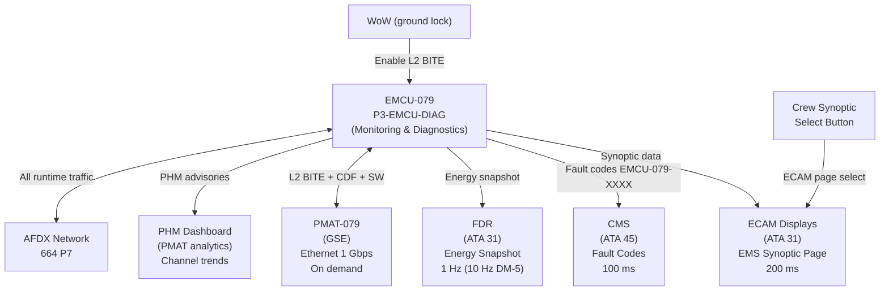
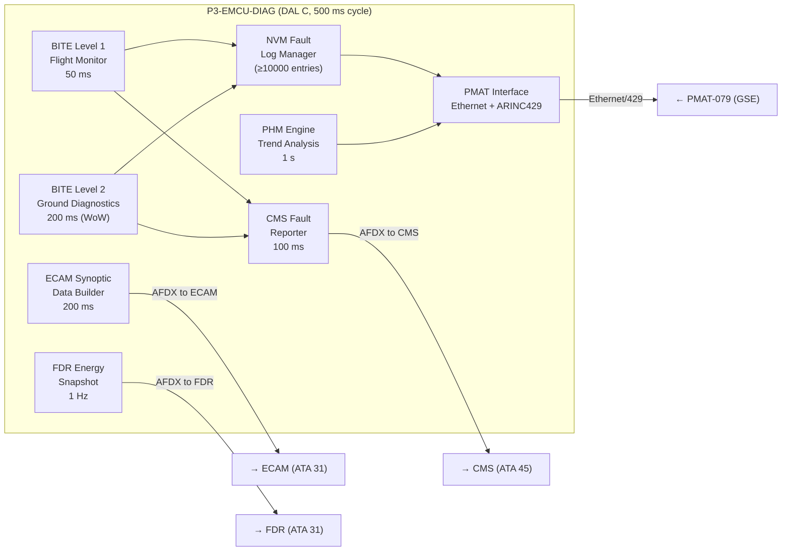

<!-- ──────────────────────────────────────────────────────────────────────────
     QATL-ATLAS-1000-ATLAS-070-079-07-079-080-ENERGY-MANAGEMENT-MONITORING-DIAGNOSTICS-AND-CONTROL-INTERFACES
     ATA 79 · Energy Management Monitoring, Diagnostics and Control Interfaces
     programme-defined aircraft type — ATLAS Register 1000
────────────────────────────────────────────────────────────────────────────── -->

# Energy Management Monitoring, Diagnostics and Control Interfaces

---

## §0 Hyperlink Policy

> All hyperlinks in this document are **relative** (five directory levels: `../../../../../`).
> Absolute URLs are forbidden. Every linked document must exist in the Q+ATLANTIDE repository
> before the link is activated. Broken links are treated as open issues and must be resolved
> before the document is promoted from `DRAFT` to `APPROVED`.

---

## §1 Purpose

This document defines the agnostic ATLAS standard-level architecture context for `Energy Management Monitoring, Diagnostics and Control Interfaces`.

It describes the controlled scope, functions, interfaces, safety considerations, lifecycle traceability, and S1000D/CSDB mapping logic that programme implementations shall instantiate when this node is applicable.

This document is not a programme design baseline. Programme-specific capacities, locations, part numbers, effectivity, operating limits, maintenance references, and data module codes shall be defined only inside the applicable programme implementation branch.
## §2 Applicability

| Applicability Level | Rule |
|---|---|
| Standard taxonomy | Applies to the ATLAS node `079` |
| Programme implementation | Conditional; determined by programme architecture, trade studies, certification basis, and applicability model |
| Product configuration | Defined in the programme-specific configuration baseline |
| Effectivity | Defined in the programme CSDB / applicability layer |
| Non-applicability | Must be explicitly stated in the programme impact-study branch when excluded |
## §3 Functional Description ![DRAFT]

### 3.1 BITE Architecture — Three Levels

The EMCU BITE is implemented in partition **P3-EMCU-DIAG** (DO-178C DAL C) and covers three levels of diagnostic coverage:

#### Level 1 — Flight BITE (In-flight continuous monitoring)
- **Cycle**: 50 ms continuous monitoring.
- **Scope**: Monitors EMCU hardware health (Channel A/B processing, CCCM agreement, PSU voltage, AFDX link status, NVM integrity, partition scheduling).
- **Fault storage**: NVM ring buffer — ≥ 10 000 fault events with timestamp, SCI version, and flight phase context.
- **Crew action**: No crew action required for Level 1 BITE faults; CMS advisory only.
- **ECAM**: Level 1 faults generate EMS system page status symbol change (green → amber for advisory faults).

#### Level 2 — Ground BITE (Extended ground diagnostics)
- **Activation**: WoW (weight-on-wheels) confirmed AND PMAT-079 connected OR CMS ground maintenance terminal session.
- **Cycle**: 200 ms diagnostic loop (reduced cycle time burden during ground operations).
- **Scope**: Extends Level 1 to include: AFDX message integrity checks, CDF parameter range verification, individual channel functional checks, EMCU-IO-079 discrete I/O verification, PSU voltage ripple analysis.
- **Fault isolation**: Level 2 can isolate faults to LRU level (EMCU-079, EMCU-IO-079, EMCU-PSUP-079) with ≥ 95 % confidence.
- **Output**: CMS fault code(s) EMCU-079-XXXX; PMAT-079 diagnostic report.

#### Level 3 — Shop BITE (Bench verification)
- **Activation**: EMCU bench test environment (EMCU-BENCH-SET GSE).
- **Scope**: Full verification of all EMCU internal circuits: FPGA logic, DSP operation, NVM read/write, HSM functions, all ARINC 600 connector pins, both channel boards, CCCM board, PSU regulation and ripple.
- **Output**: Pass/Fail for each subcomponent; go/no-go for return to service.

### 3.2 ECAM EMS Synoptic Page

The EMCU generates an **EMS Synoptic Page** displayed on ECAM (ATA 31). The synoptic is updated at **200 ms** via AFDX.

**EMS Synoptic Page Content:**

| Display Element | Description | Colour Coding |
|----------------|-------------|--------------|
| Total Generation Bar | Horizontal bar: 0–1 200 kW available | Green (normal), Amber (degraded) |
| Battery kW | Active battery power (discharge + / charge −) | Green/Amber |
| Battery SoC % | State of Charge percentage + trend arrow | Green (30–80%), Amber (<30% or >85%), Red (<20%) |
| PEMFC kW | PEMFC active output power | Green/Amber/Grey (offline) |
| PMSG-A kW | Engine A PMSG output power | Green/Grey (engine off) |
| PMSG-B kW | Engine B PMSG output power | Green/Grey |
| Total Load kW | Sum of all active load classes | Green (normal) |
| Class 1 Status | Class 1 loads — always powered | Green/Red (abnormal) |
| Class 2 Status | Class 2 loads status | Green (full) / Amber (partial shed) |
| Class 3 Status | Class 3 loads status | Green (full) / Amber (shed) |
| Active DM Flag | Degraded mode indicator (NORMAL / DM-1 / DM-5) | Green / Amber / Red |
| EMCU Status | Channel A/B status, CCCM status | Green (dual) / Amber (single) |
| AFDX Link Status | ES-A + ES-B link indicators | Green / Amber |

**Automatic ECAM EMS page pop-up:**
- DM-3, DM-4: EMS page automatic foreground on ECAM secondary display.
- DM-5: EMS page mandatory foreground + MASTER WARNING chime + synthesized voice "TOTAL POWER EMERGENCY".

### 3.3 CMS Fault Reporting

The EMCU reports fault codes to the **Central Maintenance System (ATA 45)** via AFDX at a **100 ms** reporting cycle.

**Fault code format:** `EMCU-079-XXXX` (4-digit hexadecimal)

| Code Range | Category | Examples |
|-----------|---------|---------|
| EMCU-079-00xx | HSM / Boot | 0001: HSM boot fail, 0002: SW hash mismatch |
| EMCU-079-01xx | PSU | 0100: PSU primary fail, 0101: PSU hot-backup fail |
| EMCU-079-02xx | I/O Expander | 0200: EMCU-IO-079 port fault |
| EMCU-079-03xx | AFDX | 0300: ES-A link loss, 0301: ES-B link loss, 0302: dual AFDX loss |
| EMCU-079-04xx | CCCM / Channel | 4000: CCCM disagree (DM-4), 4001: Channel A fail, 4002: Channel B fail |
| EMCU-079-10xx | DM-1 | 1001: PEMFC loss, 1002: PEMFC partial |
| EMCU-079-20xx | DM-2 | 2001: Battery SoC critical |
| EMCU-079-30xx | DM-3 | 3001: Engine A fail, 3002: Engine B fail, 3003: Dual engine fail |
| EMCU-079-40xx | DM-4 | See 04xx above |
| EMCU-079-50xx | DM-5 | 5001: Total power emergency |
| EMCU-079-06xx | CDF | 0600: CDF param out of range, 0601: CDF hash fail |
| EMCU-079-07xx | MPC | 0700: QP solver fail, 0701: Prediction accuracy < 90% |

**CMS fault persistence:**
- Flight faults: stored in EMCU NVM and transmitted to CMS. Cleared only after BITE Level 2 ground verification confirms resolution.
- Ground faults: stored in CMS maintenance database. Cleared by maintenance action + BITE Level 2 PASS.

### 3.4 PMAT-079 Maintenance Interface

**Physical interface:** Panel-accessible RJ-45 Ethernet 1 Gbps connector on EMCU front panel (accessible without removing EMCU from rack).

**Dual-port:** PMAT-079 also supports ARINC 429 high-speed legacy port for backward compatibility with legacy GSE tools.

**PMAT-079 capabilities:**

| Capability | Access Level | Protocol |
|-----------|-------------|---------|
| BITE Level 1 NVM log download | Line (no authentication) | SFTP |
| BITE Level 2 extended diagnostics | Line + WoW (password) | Custom PMAT protocol |
| SW configuration index readout | Line | SFTP |
| CDF parameter read/verify | Line | SFTP |
| CDF parameter update | Heavy (dual-key) | Custom PMAT protocol |
| SW image load | Heavy + WoW (dual-key) | SFTP + SHA-256 |
| MPC parameter trend analysis | Line | Custom PMAT analytics |
| AFDX message log export | Line | SFTP |

### 3.5 Prognostic Health Monitoring

The EMCU P3-EMCU-DIAG partition implements basic **prognostic health monitoring (PHM)**:

- **Channel trend analysis**: tracks CCCM disagreement frequency per flight → trend > 1 disagreement/10 FH triggers ADVISORY (not fault).
- **AFDX message error rate**: tracks CRC errors per AFDX port → trend > 0.1 errors/min triggers ADVISORY.
- **NVM wear monitoring**: tracks NVM write cycles → advisory at 80 % of rated write endurance.
- **PSU voltage trend**: tracks PSU output voltage drift → advisory if drift > ±2 % per 500 FH.
- PHM advisories appear in PMAT-079 prognostic dashboard (not on ECAM — maintenance only).

### 3.6 FDR Energy Data Interface

The EMCU transmits an **energy system snapshot** to the **Flight Data Recorder (ATA 31)** at **1 Hz**:

| Parameter | Resolution |
|-----------|-----------|
| Battery SoC (%) | 0.1 % |
| Battery active power (kW) | 1 kW |
| PEMFC output (kW) | 1 kW |
| PMSG-A output (kW) | 1 kW |
| PMSG-B output (kW) | 1 kW |
| Active degraded mode (DM-x) | Integer |
| Total load (kW) | 1 kW |
| EMCU channel status (A/B/dual) | Discrete |
| MPC prediction error (%) | 1 % |

During DM-5: FDR sampling increases to **10 Hz** for the energy emergency period.

---

## §4 Functional Breakdown

| ID | Function | Description | Cycle | DAL |
|----|----------|-------------|-------|-----|
| F-001 | BITE Level 1 monitoring | Continuous flight health monitoring, NVM fault storage | 50 ms | C |
| F-002 | BITE Level 2 diagnostics | Extended ground diagnostics, LRU isolation | 200 ms | C |
| F-003 | BITE Level 3 shop verification | Bench test all internal EMCU circuits | On demand | C |
| F-004 | ECAM EMS synoptic generation | Generate all synoptic page data items via AFDX | 200 ms | C |
| F-005 | ECAM automatic pop-up trigger | Trigger EMS page foreground on DM-3/4/5 | < 1 s | C |
| F-006 | CMS fault code reporting | Report EMCU-079-XXXX fault codes via AFDX | 100 ms | C |
| F-007 | CMS fault persistence management | Manage fault persistence (in-flight vs ground) | On event | C |
| F-008 | PMAT maintenance interface | Dual-port Ethernet+ARINC429 maintenance access | On demand | D |
| F-009 | Prognostic health monitoring | Channel trend, AFDX error rate, NVM wear, PSU trend | 1 s | C |
| F-010 | PHM advisory reporting | Deliver PHM advisories to PMAT prognostic dashboard | 1 s | C |
| F-011 | FDR energy snapshot (1 Hz) | Transmit 9-parameter energy snapshot to FDR | 1 Hz | C |
| F-012 | FDR enhanced snapshot (DM-5) | Increase FDR sampling to 10 Hz during DM-5 | 10 Hz | C |
| F-013 | AFDX message integrity monitoring | Monitor AFDX CRC error rates on all EMCU traffic | 1 s | C |

---

## §5 System Context — Mermaid Diagram

---

## §6 Internal Architecture — Mermaid Diagram

---

## §7 Components and LRUs

| LRU | ATA | Location | Role |
|-----|-----|----------|------|
| EMCU-079 | ATA 79 | EE Bay R-079 | Hosts P3-EMCU-DIAG (BITE/monitoring) |
| ECAM Display Units | ATA 31 | Cockpit | EMS synoptic display |
| CMS Computer | ATA 45 | EE Bay | Fault code storage + maintenance database |
| FDR | ATA 31 | EE Bay | Energy data recording |
| PMAT-079 | ATA 79 | GSE | Maintenance access + BITE level 2 |
| AFDX Switches ES-A/B | ATA 73 | EE Bay | AFDX infrastructure (shared) |

---

## §8 Interfaces

| Interface | Signal | Direction | Protocol | Cycle |
|-----------|--------|-----------|----------|-------|
| ECAM (ATA 31) | EMS synoptic data | Out | AFDX 664 P7 | 200 ms |
| ECAM (ATA 31) | DM pop-up trigger | Out | AFDX 664 P7 | On event |
| CMS (ATA 45) | Fault codes EMCU-079-XXXX | Out | AFDX 664 P7 | 100 ms |
| FDR (ATA 31) | Energy snapshot (9 params) | Out | AFDX 664 P7 | 1 Hz (10 Hz DM-5) |
| PMAT-079 Ethernet | BITE L2, CDF, SW | In/Out | Ethernet 1 Gbps | On demand |
| PMAT-079 ARINC 429 | Legacy access | In/Out | ARINC 429 hi-speed | On demand |
| WoW discrete | BITE Level 2 enable | In | 28 V DC discrete | Continuous |
| Crew ECAM select | EMS page request | In | AFDX 664 P7 | On event |
| P1-EMCU-CORE | Health data feed to P3 | Internal | ARINC 653 queuing port | 500 ms |
| P2-EMCU-COMMS | AFDX error statistics | Internal | ARINC 653 queuing port | 1 s |

---

## §9 Operating Modes

| Mode | BITE Level | ECAM Update | CMS Reporting | FDR |
|------|-----------|-------------|--------------|-----|
| Flight monitoring | L1 active | 200 ms | 100 ms | 1 Hz |
| Ground maintenance | L1 + L2 active | 200 ms | 100 ms | N/A (WoW) |
| Shop maintenance | L1 + L2 + L3 | N/A (bench) | N/A | N/A |
| DM-5 Emergency | L1 active | 200 ms — FORCED FG | 100 ms | 10 Hz |
| Normal ECAM | L1 active | 200 ms | 100 ms | 1 Hz |
| Emergency ECAM | L1 active | 200 ms — mandatory FG | 100 ms | 10 Hz |

---

## §10 Performance and Budgets ![DRAFT]

| Parameter | Requirement | Value |
|-----------|-------------|-------|
| BITE Level 1 cycle | 50 ms | 50 ms |
| BITE Level 2 cycle | 200 ms | 200 ms |
| ECAM synoptic update rate | 200 ms | 200 ms |
| CMS fault code latency | < 500 ms | < 100 ms (AFDX cycle) |
| PMAT download speed | > 1 MB/s | ~100 MB/s (Ethernet 1 Gbps limited by EMCU NVM read) |
| NVM fault log capacity | ≥ 10 000 entries | 10 000 |
| FDR snapshot rate | 1 Hz (10 Hz DM-5) | Per requirement |
| BITE fault isolation rate | ≥ 95 % to LRU | Design requirement |
| CMS fault code dictionary | All EMCU-079-XXXX codes | Coverage TBD |
| PHM advisory threshold (channel disagree) | > 1 event / 10 FH | Design |

---

## §11 Safety, Redundancy and Fault Tolerance

### 11.1 BITE Partition Isolation

- P3-EMCU-DIAG (DAL C) is strictly space-isolated from P1-EMCU-CORE (DAL B) by ARINC 653 MMU.
- A P3 failure (BITE fault) does **not** affect P1 MPC engine operation — EMCU continues full dispatch.
- BITE Level 2 ground activation (WoW required) cannot affect in-flight operations.

### 11.2 ECAM Read-Only

- ECAM displays are **output-only** from EMCU — no ECAM write-back to EMCU is possible.
- ECAM crew interactions (page select) are routed to ECAM controller, not to EMCU.

### 11.3 PMAT Ground Lock

- PMAT Level 2 access (CDF update, SW load) requires WoW signal confirmed — prevents inadvertent ground station update during flight.
- All PMAT write operations require dual-key authorization (see 079-060 §3.3).

---

## §12 Maintenance and Diagnostics

| Task | Interval | Tool | AMM |
|------|----------|------|-----|
| NVM fault log download | A-check | PMAT-079 | AMM 79-080-10 |
| BITE Level 2 diagnostic session | C-check | PMAT-079 | AMM 79-080-20 |
| ECAM EMS synoptic visual verification | C-check | GTU + visual | AMM 79-080-30 |
| CMS fault code dictionary verification | C-check | PMAT-079 | AMM 79-080-40 |
| PHM prognostic dashboard review | A-check | PMAT-079 | AMM 79-080-50 |
| FDR energy data validation | Post-flight sample | PMAT-079 / QAR | AMM 79-080-60 |

---

## §13 Footprint

Monitoring and diagnostics functions are hosted within EMCU-079 P3-EMCU-DIAG. No dedicated hardware footprint beyond EMCU-079.

| Software Partition | NVM (code) | RAM (runtime) |
|-------------------|-----------|--------------|
| P3-EMCU-DIAG | ~1 MB | ~8 MB |

PMAT-079 is portable GSE (3 kg). ECAM display hardware is ATA 31.

---

## §14 Safety and Certification References ![DRAFT]

| Reference | Description |
|-----------|-------------|
| ARINC 624 | Aircraft diagnostics / on-board maintenance systems |
| DO-178C DAL C | Software certification for P3-EMCU-DIAG |
| ARINC 664 P7 | AFDX — monitoring and reporting traffic |
| EASA AMC 25.1309 | Equipment and system monitoring requirements |
| ATA MSG-3 | Maintenance task development — BITE requirements |
| EASA Part-M | Continuing airworthiness — monitoring |
| ARINC 653 Issue 2 | Partition isolation for BITE / control separation |

---

## §15 V&V Approach ![TBD]

| Activity | Pass Criterion |
|----------|---------------|
| BITE Level 1 fault injection test | All Level 1 faults stored in NVM with correct fault code |
| BITE Level 2 LRU isolation test | ≥ 95 % fault isolation to LRU level confirmed |
| ECAM synoptic conformance test | All 14 data items display correctly per crew interface spec |
| CMS fault code test | All EMCU-079-XXXX codes transmitted and displayed correctly |
| FDR data validation | All 9 parameters recorded at 1 Hz; 10 Hz during simulated DM-5 |
| PMAT access test | L1 (no auth) and L2 (WoW + password) access levels verified |
| P3 fault isolation test | P3 failure does not affect P1 dispatch (ARINC 653 isolation) |
| PHM trend test | Channel disagreement trend advisory triggered correctly |

---

## §16 Glossary

| Acronym | Definition |
|---------|-----------|
| BITE | Built-In Test Equipment |
| CRC | Cyclic Redundancy Check |
| FDI | Fault Detection and Isolation |
| FDR | Flight Data Recorder |
| NVM | Non-Volatile Memory |
| PHM | Prognostic Health Monitoring |
| QAR | Quick Access Recorder |
| SFTP | Secure File Transfer Protocol |

---

## §17 Open Issues

| ID | Description | Owner | Target |
|----|-------------|-------|--------|
| OI-079-080-001 | Define complete ECAM EMS synoptic page visual layout with cockpit design team | Q-AIR | 2026-Q4 |
| OI-079-080-002 | Complete CMS fault code dictionary for all EMCU-079-XXXX codes | Q-GREENTECH | 2026-Q4 |
| OI-079-080-003 | Define PHM trend thresholds based on fleet reliability data | Q-HPC | 2027-Q2 |
| OI-079-080-004 | Confirm FDR 10 Hz DM-5 recording with FDR OEM (recording capacity check) | Q-GREENTECH | 2026-Q4 |
| OI-079-080-005 | Validate BITE fault isolation rate ≥ 95 % by fault injection test | Q-GREENTECH | 2027-Q1 |

---

## §18 Status Legend

| Badge | Meaning |
|-------|---------|
|  | Content drafted but not yet reviewed |
|  | Content to be determined |
|  | Reviewed, approved and baselined |
|  | Replaced by a later revision |

---

## §19 Related Documents (Siblings in this Subsection)

| Document ID | Title | SNS |
|-------------|-------|-----|
| [079-000](./079-000-Energy-Management-System-General.md) | Energy Management System General | 079-000-00 |
| [079-010](./079-010-Energy-Management-Architecture.md) | Energy Management Architecture | 079-010-00 |
| [079-020](./079-020-Power-Demand-Prediction-and-Allocation.md) | Power Demand Prediction and Allocation | 079-020-00 |
| [079-030](./079-030-Energy-Source-Prioritization-and-Load-Shedding.md) | Energy Source Prioritization and Load Shedding | 079-030-00 |
| [079-040](./079-040-Propulsion-and-ECS-Energy-Coordination.md) | Propulsion and ECS Energy Coordination | 079-040-00 |
| [079-050](./079-050-Energy-Degraded-Modes-and-Reconfiguration.md) | Energy Degraded Modes and Reconfiguration | 079-050-00 |
| [079-060](./079-060-Energy-Management-Software-and-Configuration.md) | Energy Management Software and Configuration | 079-060-00 |
| [079-070](./079-070-Energy-Management-Test-and-Maintenance.md) | Energy Management Test and Maintenance | 079-070-00 |
| [079-090](./079-090-S1000D-CSDB-Mapping-and-Traceability.md) | S1000D CSDB Mapping and Traceability | 079-090-00 |

**Cross-ATA References:**

| ATA | Relevance |
|-----|-----------|
| [ATA 31](../../031_Instruments/README.md) | ECAM — EMS synoptic display + FDR energy recording |
| [ATA 45](../../045_CMS/README.md) | CMS — fault code reception and maintenance database |

---

## §20 Change Log

| Rev | Date | Author | Description |
|-----|------|--------|-------------|
| 0.1 | 2026-05-12 | Q-GREENTECH | Initial DRAFT — baseline document creation |
