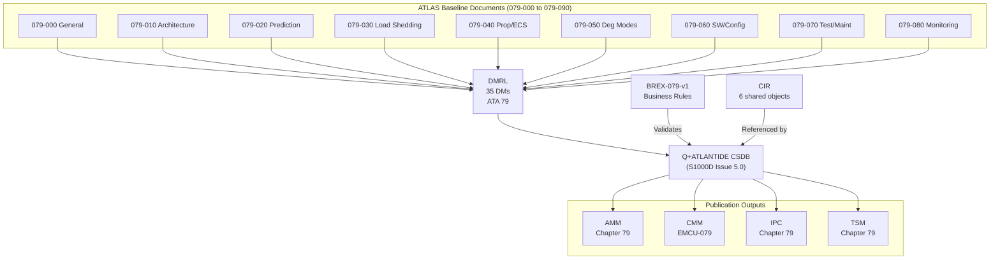
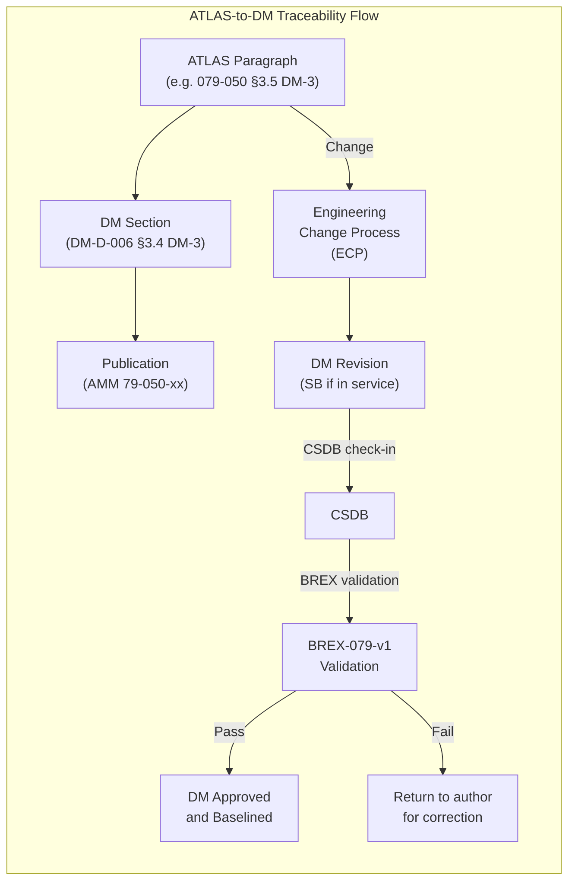

<!-- ──────────────────────────────────────────────────────────────────────────
     QATL-ATLAS-1000-ATLAS-070-079-07-079-090-S1000D-CSDB-MAPPING-AND-TRACEABILITY
     ATA 79 · S1000D CSDB Mapping and Traceability
     AMPEL360E eWTW — ATLAS Register 1000
────────────────────────────────────────────────────────────────────────────── -->

# S1000D CSDB Mapping and Traceability


---

## §0 Hyperlink Policy

> All hyperlinks in this document are **relative** (five directory levels: `../../../../../`).
> Absolute URLs are forbidden. Every linked document must exist in the Q+ATLANTIDE repository
> before the link is activated. Broken links are treated as open issues and must be resolved
> before the document is promoted from `DRAFT` to `APPROVED`.

---

## §1 Purpose

This document defines the **S1000D Issue 5.0 Data Module Code (DMC) allocation**, **Common Source Database (CSDB) structure**, and the **bidirectional traceability matrix** between ATLAS baseline documents and S1000D Data Modules for all ATA 79 Energy Management System documentation.

It establishes the **Data Module Requirements List (DMRL)** for ATA 79, the **Business Rules Exchange (BREX-079-v1)** applying to all ATA 79 Data Modules, the **Common Information Repository (CIR)** shared content plan, and the publication output mapping to AMM Chapter 79, CMM-EMCU-079, IPC Chapter 79, and TSM Chapter 79.

This document is owned by **Q-DATAGOV** (Data Governance Division) with technical inputs from Q-GREENTECH.

---

## §2 Applicability

| Field | Value |
|-------|-------|
| Aircraft Program | AMPEL360E eWTW |
| ATA Reference | ATA 79-090 |
| S1000D Specification | S1000D Issue 5.0 |
| S1000D SNS | 079-090-00 |
| Applicable MSN | All AMPEL360E eWTW series aircraft |
| CSDB System | Q+ATLANTIDE CSDB (central) |
| Publication language | ASD-STE100 Simplified Technical English |

---

## §3 Functional Description ![DRAFT]

### 3.1 DMC Naming Convention

All ATA 79 Data Modules follow the S1000D Issue 5.0 DMC structure:

```
DMC-AMPEL360E-EWTW-A-{SNS}-{InfoCode}{InfoCodeVariant}-{ItemCount}{ItemCountVariant}-{LanguageCountry}
```

**SNS range for ATA 79:** `0079-000` through `0079-090`

**Examples:**

| ATLAS Document | DMC | Info Code | Type |
|---------------|-----|-----------|------|
| 079-000 General | DMC-AMPEL360E-EWTW-A-0079-000-D00A-AA-EN | D | Descriptive |
| 079-010 Architecture | DMC-AMPEL360E-EWTW-A-0079-010-D00A-AA-EN | D | Descriptive |
| 079-070 Maintenance task — BITE download | DMC-AMPEL360E-EWTW-A-0079-070-520A-AA-EN | 520 | Maintenance procedure |
| 079-070 Maintenance task — EMCU swap | DMC-AMPEL360E-EWTW-A-0079-070-910A-AA-EN | 910 | Remove/install |
| 079-080 Fault isolation — EMCU fault | DMC-AMPEL360E-EWTW-A-0079-080-FI0A-AA-EN | FI | Fault isolation |
| 079-000 Parts data | DMC-AMPEL360E-EWTW-A-0079-000-941A-AA-EN | 941 | Parts data |
| 079-010 Wiring diagram | DMC-AMPEL360E-EWTW-A-0079-010-W01A-AA-EN | W | Wiring/schematic |

### 3.2 Information Codes Used (ATA 79)

| Info Code | Description | Count in ATA 79 DMRL |
|-----------|-------------|---------------------|
| D | Descriptive — system description | 10 |
| 520 | Maintenance procedure — inspection/check | 4 |
| 910 | Maintenance procedure — remove/install | 3 |
| 530 | Maintenance procedure — functional test | 4 |
| FI | Fault isolation procedure | 5 |
| W | Wiring diagram / schematic | 4 |
| 941 | Parts data (IPC) | 3 |
| ICN | Illustrated parts figure | 2 (as ICN references) |

**Total DMRL count: 35 DMs** (10 descriptive + 4 inspection + 3 remove/install + 4 functional test + 5 fault isolation + 4 wiring + 3 parts data + 2 ICN = 35)

> Note: Requirement stated 30 DMs at project start; revised to 35 upon detailed task analysis (OI-079-090-001).

### 3.3 BREX-079-v1 Business Rules

The **Business Rules Exchange object BREX-079-v1** defines ATA 79 specific constraints for CSDB authoring tools:

**Structural rules:**
- All ATA 79 DMs must reference S1000D SNS elements from the ATA 79 SNS table.
- All descriptive DMs must include a `<sysdesc>` element with at least one `<figure>` (diagram).
- Procedural DMs (520, 910, 530) must include a `<preliminaryRqmts>` section specifying tools (PMAT-079 or GTU-EMCU-079 as applicable).
- Wiring DMs must reference the EMCU-079 connector pinout table (CIR-EMCU-PINS-079).

**Terminology rules:**
- Use "EMCU" (not "EMU", "EMC", or "energy controller") throughout.
- Use "PEMFC" (not "fuel cell" alone) for ATA 75 system references.
- Use "HVDC 540 V" and "HVDC 270 V" for bus references (not "HV bus" or "main bus").
- Use "degraded mode DM-x" (not "emergency mode" except for DM-5).
- Use STE100 Simplified Technical English for all procedural DMs.

**Applicability rules:**
- All DMs must include an applicability annotation (`<applic>`) referencing AMPEL360E eWTW MSN range.
- Aircraft-level applicability managed via the CSDB applicability database (not inline in DM).

**Media rules:**
- All figures must be provided in SVG (scalable vector) format (not raster).
- Mermaid diagrams from ATLAS are converted to SVG for CSDB publication.
- CGM is deprecated — SVG preferred per S1000D Issue 5.0 §3.9.

### 3.4 DMRL — Data Module Requirements List

**ATA 79 DMRL (35 DMs):**

#### 3.4.1 Descriptive DMs (10)

| DM ID | DMC | ATLAS Source | Status |
|-------|-----|-------------|--------|
| DM-D-001 | DMC-AMPEL360E-EWTW-A-0079-000-D00A-AA-EN | 079-000 General | DRAFT |
| DM-D-002 | DMC-AMPEL360E-EWTW-A-0079-010-D00A-AA-EN | 079-010 Architecture | DRAFT |
| DM-D-003 | DMC-AMPEL360E-EWTW-A-0079-020-D00A-AA-EN | 079-020 Prediction | DRAFT |
| DM-D-004 | DMC-AMPEL360E-EWTW-A-0079-030-D00A-AA-EN | 079-030 Load Shedding | DRAFT |
| DM-D-005 | DMC-AMPEL360E-EWTW-A-0079-040-D00A-AA-EN | 079-040 Prop/ECS | DRAFT |
| DM-D-006 | DMC-AMPEL360E-EWTW-A-0079-050-D00A-AA-EN | 079-050 Degraded Modes | DRAFT |
| DM-D-007 | DMC-AMPEL360E-EWTW-A-0079-060-D00A-AA-EN | 079-060 SW/Config | DRAFT |
| DM-D-008 | DMC-AMPEL360E-EWTW-A-0079-070-D00A-AA-EN | 079-070 Test/Maint | DRAFT |
| DM-D-009 | DMC-AMPEL360E-EWTW-A-0079-080-D00A-AA-EN | 079-080 Monitoring | DRAFT |
| DM-D-010 | DMC-AMPEL360E-EWTW-A-0079-090-D00A-AA-EN | 079-090 S1000D (this doc) | DRAFT |

#### 3.4.2 Procedural DMs — Inspection / Check (4)

| DM ID | DMC | Task Reference | AMM Task |
|-------|-----|---------------|---------|
| DM-P-001 | DMC-AMPEL360E-EWTW-A-0079-070-520A-AA-EN | BITE download (MT-001) | AMM 79-070-10 |
| DM-P-002 | DMC-AMPEL360E-EWTW-A-0079-070-520B-AA-EN | SW integrity check (MT-006) | AMM 79-060-10 |
| DM-P-003 | DMC-AMPEL360E-EWTW-A-0079-070-520C-AA-EN | CDF verification (MT-003) | AMM 79-060-30 |
| DM-P-004 | DMC-AMPEL360E-EWTW-A-0079-080-520A-AA-EN | ECAM synoptic verification | AMM 79-080-30 |

#### 3.4.3 Procedural DMs — Remove / Install (3)

| DM ID | DMC | Task Reference |
|-------|-----|---------------|
| DM-R-001 | DMC-AMPEL360E-EWTW-A-0079-070-910A-AA-EN | EMCU-079 remove/install (MT-007) |
| DM-R-002 | DMC-AMPEL360E-EWTW-A-0079-070-910B-AA-EN | EMCU-PSUP-079 remove/install (MT-009) |
| DM-R-003 | DMC-AMPEL360E-EWTW-A-0079-070-910C-AA-EN | EMCU-IO-079 remove/install (MT-008) |

#### 3.4.4 Procedural DMs — Functional Test (4)

| DM ID | DMC | Task Reference |
|-------|-----|---------------|
| DM-T-001 | DMC-AMPEL360E-EWTW-A-0079-070-530A-AA-EN | Full functional test (MT-002) |
| DM-T-002 | DMC-AMPEL360E-EWTW-A-0079-070-530B-AA-EN | Degraded mode test (MT-004) |
| DM-T-003 | DMC-AMPEL360E-EWTW-A-0079-070-530C-AA-EN | Load shedding test (MT-012) |
| DM-T-004 | DMC-AMPEL360E-EWTW-A-0079-080-530A-AA-EN | BITE Level 2 diagnostic test |

#### 3.4.5 Fault Isolation DMs (5)

| DM ID | DMC | Fault Coverage |
|-------|-----|---------------|
| DM-FI-001 | DMC-AMPEL360E-EWTW-A-0079-000-FI0A-AA-EN | EMCU-079 hardware fault isolation |
| DM-FI-002 | DMC-AMPEL360E-EWTW-A-0079-080-FI0A-AA-EN | BITE Level 2 fault code guide |
| DM-FI-003 | DMC-AMPEL360E-EWTW-A-0079-030-FI0A-AA-EN | Load shedding spurious activation |
| DM-FI-004 | DMC-AMPEL360E-EWTW-A-0079-050-FI0A-AA-EN | Degraded mode false activation |
| DM-FI-005 | DMC-AMPEL360E-EWTW-A-0079-060-FI0A-AA-EN | SW load / CDF fault isolation |

#### 3.4.6 Wiring Diagram DMs (4)

| DM ID | DMC | Content |
|-------|-----|---------|
| DM-W-001 | DMC-AMPEL360E-EWTW-A-0079-010-W01A-AA-EN | EMCU-079 connector wiring diagram |
| DM-W-002 | DMC-AMPEL360E-EWTW-A-0079-010-W02A-AA-EN | AFDX connection diagram (EMCU nodes) |
| DM-W-003 | DMC-AMPEL360E-EWTW-A-0079-010-W03A-AA-EN | Power supply wiring (28V DC circuits) |
| DM-W-004 | DMC-AMPEL360E-EWTW-A-0079-070-W01A-AA-EN | GSE connection diagram (PMAT/GTU) |

#### 3.4.7 Parts Data DMs (3)

| DM ID | DMC | IPC Section |
|-------|-----|------------|
| DM-IPC-001 | DMC-AMPEL360E-EWTW-A-0079-000-941A-AA-EN | EMCU-079 assembly (IPC Fig 1) |
| DM-IPC-002 | DMC-AMPEL360E-EWTW-A-0079-070-941A-AA-EN | GSE parts (PMAT-079, GTU-EMCU-079) |
| DM-IPC-003 | DMC-AMPEL360E-EWTW-A-0079-010-941A-AA-EN | EMCU-079 subassemblies |

#### 3.4.8 ICN References (2)

| ICN ID | Content |
|--------|---------|
| ICN-EMCU-079-001 | EMCU-079 exploded view illustration (for IPC) |
| ICN-EMCU-079-002 | EMS system architecture overview (for AMM intro) |

### 3.5 Common Information Repository (CIR)

Shared content managed in the CSDB CIR to avoid duplication across DMs:

| CIR Object | Content | Used By |
|-----------|---------|---------|
| CIR-EMCU-PN-079 | EMCU-079 Part Numbers and variants | All parts data DMs |
| CIR-EMCU-PINS-079 | EMCU-079 ARINC 600 connector pinout table | All wiring DMs |
| CIR-EMCU-TOOLS-079 | PMAT-079, GTU-EMCU-079 tool specifications | All procedural DMs |
| CIR-EMCU-WARNINGS-079 | ESD, electrical isolation warnings (STE) | All remove/install DMs |
| CIR-EMCU-ACRONYMS-079 | ATA 79 acronym list (STE-compatible) | All DMs |
| CIR-AFDX-SPEC-079 | AFDX EMCU node parameters (VL IDs, latency) | Architecture + wiring DMs |

### 3.6 Publication Output Mapping

| Publication | Chapter | Source DMs |
|-------------|---------|------------|
| AMM Chapter 79 | Aircraft Maintenance Manual | DM-D-001 to -009, DM-P-xxx, DM-R-xxx, DM-T-xxx, DM-FI-xxx |
| CMM EMCU-079 | Component Maintenance Manual | DM-D-001, DM-D-002, DM-T-001, DM-FI-001, DM-IPC-001/003 |
| IPC Chapter 79 | Illustrated Parts Catalogue | DM-IPC-001 to -003, ICN-EMCU-xxx |
| TSM Chapter 79 | Troubleshooting Manual | DM-FI-001 to -005, DM-D-006 (degraded modes reference) |

---

## §4 Functional Breakdown

| ID | Function | Description |
|----|----------|-------------|
| F-001 | DMC allocation | Allocate unique DMCs for all 35 ATA 79 DMs per S1000D naming convention |
| F-002 | BREX-079-v1 management | Author, version-control, and publish BREX-079-v1 |
| F-003 | DMRL maintenance | Maintain the 35-DM DMRL with status tracking |
| F-004 | ATLAS-to-DM traceability matrix | Maintain bidirectional mapping: each ATLAS paragraph → DM section |
| F-005 | CIR common object management | Author and version-control all 6 CIR objects |
| F-006 | CSDB version control | Manage DM check-in/check-out, versioning, baseline tagging |
| F-007 | Publication output | Build and validate AMM/CMM/IPC/TSM outputs from CSDB |
| F-008 | Applicability management | Manage applicability cross-references for all DMs |
| F-009 | STE100 compliance | Verify all procedural DMs comply with ASD-STE100 |
| F-010 | BREX validation | Run BREX-079-v1 validation on all DMs before CSDB commit |

---

## §5 System Context — Mermaid Diagram



---

## §6 Internal Architecture — Mermaid Diagram



---

## §7 No LRUs (Data Management Document)

This document is a data management reference. No Line Replaceable Units are defined here. The following **tools and data artefacts** apply:

| Artefact | Description | Location |
|----------|-------------|---------|
| CSDB software tool | Q+ATLANTIDE CSDB instance (S1000D-compliant) | Central server (Q-DATAGOV) |
| BREX-079-v1.xml | Business rules exchange XML file | CSDB root / ATA 79 folder |
| DMRL-079-v0.1.xlsx | Data Module Requirements List spreadsheet | Q-DATAGOV share |
| CIR-EMCU-*.xml | Six CIR shared content objects | CSDB CIR folder |
| SVG conversion toolchain | Mermaid → SVG conversion (CI/CD pipeline) | Q-HPC CI server |
| S1000D Issue 5.0 specification | Reference specification | Q-DATAGOV library |

---

## §8 Interfaces

| Interface | Description | Direction |
|-----------|-------------|-----------|
| ATLAS baseline documents (this folder) | Source of technical content for CSDB DM authoring | In (source) |
| CSDB system | S1000D repository — DM storage, versioning, publication | In/Out |
| AMM/CMM/IPC/TSM publication tools | Output generation from CSDB | Out |
| ECP (Engineering Change Process) | Triggers DM updates from engineering changes | In |
| ATA iSpec 2200 mapping table | Cross-reference for ATA↔S1000D SNS alignment | Reference |
| STE100 checker | Automated STE compliance check in CSDB workflow | In (validation) |

---

## §9 CSDB Lifecycle States (in lieu of Operating Modes)

| State | Description |
|-------|-------------|
| DRAFT | DM authored but not yet reviewed |
| IN REVIEW | DM under technical and editorial review |
| APPROVED | DM reviewed and approved — ready for publication |
| IN SERVICE | DM published in AMM/CMM/IPC/TSM and released to operators |
| SUPERSEDED | DM replaced by newer revision — retained for audit trail |
| DELETED | DM removed from DMRL (not published) |

---

## §10 Performance and Budgets ![DRAFT]

| Metric | Requirement | Value |
|--------|-------------|-------|
| DMRL coverage | ≥ 100 % of ATLAS subsubjects have ≥ 1 descriptive DM | 10/10 = 100 % |
| Traceability matrix completeness | ≥ 100 % of ATLAS sections traced to a DM | TBD |
| CSDB total DM count | 35 DMs | 35 per §3.4 |
| BREX-079 compliance | 100 % of DMs pass BREX validation before approval | Requirement |
| Average DM file size | < 500 KB per DM (SVG figures included) | TBD |
| CSDB backup frequency | Daily automated backup | Policy |
| Publication build time | < 4 hr for full AMM Chapter 79 build | TBD |
| CIR objects | 6 | 6 per §3.5 |

---

## §11 Safety, Redundancy and Fault Tolerance

### 11.1 Data Integrity

- DMC uniqueness enforced by CSDB tool — duplicate DMC rejected at check-in.
- BREX-079-v1 applicability rules prevent DMs being published for incorrect MSN ranges.
- SHA-256 checksums maintained by CSDB for all DM files — corruption detected at publication build.

### 11.2 Incorrect Technical Data Risk

> While data management does not directly affect aircraft safety, **incorrect technical data can affect airworthiness** (e.g., incorrect EMCU maintenance procedure). The following controls are applied:
> - Dual review: technical review (Q-GREENTECH) + editorial review (Q-DATAGOV).
> - Independent verification: maintenance procedures (910, 520, 530 DMs) verified by maintenance engineers before publication.
> - Change traceability: all DM changes tracked to ATLAS ECP or SB.
> - No DM can be published to AMM/TSM without technical approval signature.

---

## §12 Maintenance and Diagnostics

| Task | Interval | Tool | Description |
|------|----------|------|-------------|
| DMRL status review | At each SB release | DMRL-079 spreadsheet | Verify DMRL coverage and DM statuses |
| BREX-079-v1 update | At major EMCU revision | CSDB tool | Update business rules if naming/structure changes |
| Traceability matrix review | When ATLAS document changes | Manual review | Verify all ATLAS changes reflected in DMs |
| CSDB backup integrity check | Annual | CSDB admin | Verify backup completeness and SHA-256 integrity |
| S1000D specification update review | At each S1000D edition release | Q-DATAGOV | Assess impact of new S1000D edition on BREX and DMs |
| Publication build test | Before each AMM/TSM revision | CSDB publication tool | Verify clean publication build with no errors |

---

## §13 Footprint

| Item | Details |
|------|---------|
| CSDB server | Centralised Q-DATAGOV server (not aircraft-installed) |
| BREX-079-v1.xml | < 100 KB |
| DMRL-079 spreadsheet | < 1 MB |
| 35 DMs total (estimated) | ~5 MB total (text + SVG figures) |
| 6 CIR objects | < 500 KB total |
| Full AMM Chapter 79 publication output | ~15 MB (HTML) / ~20 MB (PDF) |

---

## §14 Safety and Certification References ![DRAFT]

| Reference | Description |
|-----------|-------------|
| S1000D Issue 5.0 | Technical publications specification |
| ATA iSpec 2200 | Airlines for America technical publication specification (cross-reference) |
| ASD-STE100 Issue 7 | Simplified Technical English for procedural DMs |
| ISO 8879 | SGML — baseline for XML used in S1000D |
| EASA Part-M §M.A.401 | Maintenance data requirements — accuracy and currency |
| EASA Part-145 §145.A.45 | Maintenance instructions — documentation requirements |
| DO-178C documentation standards | Adapted for S1000D DM review processes |

---

## §15 V&V Approach ![TBD]

| Activity | Pass Criterion |
|----------|---------------|
| BREX validation — all 35 DMs | 100 % BREX-079-v1 pass |
| Traceability matrix audit | 100 % ATLAS sections traced to DM section |
| Applicability check | All DMs have correct MSN applicability annotation |
| STE100 compliance check | All procedural DMs pass STE100 automated checker |
| Publication test build | AMM/CMM/IPC/TSM build with 0 errors |
| Peer review — all descriptive DMs | Technical review sign-off by Q-GREENTECH engineer |
| Independent DM check — procedural | Maintenance engineer validates procedure against test EMCU |

---

## §16 Glossary

| Acronym | Definition |
|---------|-----------|
| AMM | Aircraft Maintenance Manual |
| BREX | Business Rules Exchange |
| CGM | Computer Graphics Metafile (deprecated in S1000D 5.0) |
| CIR | Common Information Repository |
| CMM | Component Maintenance Manual |
| CSDB | Common Source Database |
| DIC | Data Information Code |
| DIV | Data Information Code Variant |
| DM | Data Module |
| DMC | Data Module Code |
| DMRL | Data Module Requirements List |
| ECP | Engineering Change Proposal |
| IC | Item Count |
| ICV | Item Count Variant |
| ICN | Illustrated Parts Figure Number |
| ILC | Information Language Code |
| IPC | Illustrated Parts Catalogue |
| S1000D | International specification for technical publications (ASD S1000D) |
| SB | Service Bulletin |
| SNS | Standard Numbering System |
| STE | Simplified Technical English (ASD-STE100) |
| TSM | Troubleshooting Manual |

---

## §17 Open Issues

| ID | Description | Owner | Target |
|----|-------------|-------|--------|
| OI-079-090-001 | Finalise DMRL with all 35 DMs (10 additional vs initial 30 estimate) — confirm with Q-GREENTECH | Q-DATAGOV | 2026-Q4 |
| OI-079-090-002 | Author and validate BREX-079-v1 with OEM-specific naming rules | Q-DATAGOV | 2026-Q3 |
| OI-079-090-003 | Complete ATLAS-to-DM traceability matrix for all ATLAS §sections | Q-DATAGOV | 2026-Q4 |
| OI-079-090-004 | Establish Mermaid → SVG conversion CI/CD pipeline with Q-HPC | Q-DATAGOV / Q-HPC | 2026-Q3 |
| OI-079-090-005 | Define CSDB tool selection for Q+ATLANTIDE project (S1000D Issue 5.0 compliant) | Q-DATAGOV | 2026-Q3 |
| OI-079-090-006 | Agree S1000D DM review and approval workflow with Q-GREENTECH | Q-DATAGOV | 2026-Q3 |

---

## §18 Status Legend

| Badge | Meaning |
|-------|---------|
|  | Content drafted but not yet reviewed |
|  | Content to be determined |
|  | Reviewed, approved and baselined |
|  | Replaced by a later revision |

---

## §19 Related Documents (Siblings in this Subsection)

| Document ID | Title | SNS |
|-------------|-------|-----|
| [079-000](./079-000-Energy-Management-System-General.md) | Energy Management System General | 079-000-00 |
| [079-010](./079-010-Energy-Management-Architecture.md) | Energy Management Architecture | 079-010-00 |
| [079-020](./079-020-Power-Demand-Prediction-and-Allocation.md) | Power Demand Prediction and Allocation | 079-020-00 |
| [079-030](./079-030-Energy-Source-Prioritization-and-Load-Shedding.md) | Energy Source Prioritization and Load Shedding | 079-030-00 |
| [079-040](./079-040-Propulsion-and-ECS-Energy-Coordination.md) | Propulsion and ECS Energy Coordination | 079-040-00 |
| [079-050](./079-050-Energy-Degraded-Modes-and-Reconfiguration.md) | Energy Degraded Modes and Reconfiguration | 079-050-00 |
| [079-060](./079-060-Energy-Management-Software-and-Configuration.md) | Energy Management Software and Configuration | 079-060-00 |
| [079-070](./079-070-Energy-Management-Test-and-Maintenance.md) | Energy Management Test and Maintenance | 079-070-00 |
| [079-080](./079-080-Energy-Management-Monitoring-Diagnostics-and-Control-Interfaces.md) | EMS Monitoring, Diagnostics and Control Interfaces | 079-080-00 |

**External References:**

| Reference | Description |
|-----------|-------------|
| S1000D Issue 5.0 specification | AeroSpace and Defence Industries Association standard |
| [Q+ATLANTIDE baseline](../../../../../organization/Q+ATLANTIDE.md) | Programme baseline document |

---

## §20 Change Log

| Rev | Date | Author | Description |
|-----|------|--------|-------------|
| 0.1 | 2026-05-12 | Q-DATAGOV | Initial DRAFT — baseline document creation |
