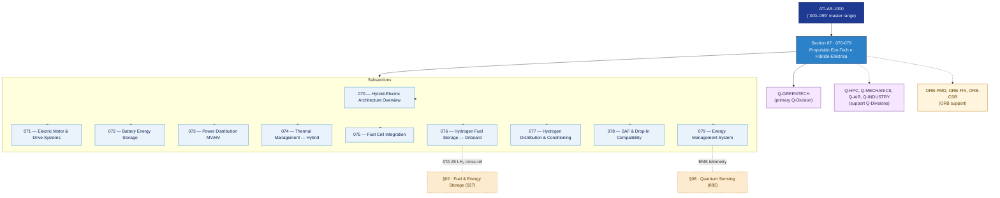

# ATLAS 070-079 · Section 07 — Propulsión Eco-Tech e Híbrido-Eléctrica

## 1. Purpose

Section-level index for *Propulsión Eco-Tech e Híbrido-Eléctrica* (`070-079`) within the ATLAS band. Arquitectura híbrido-eléctrica, motores y drives eléctricos, almacenamiento, distribución MV/HV, gestión térmica, fuel cells, hidrógeno, SAF y EMS.

This section is part of the **ATLAS-1000** register, a subpart of the controlled **Q+ATLANTIDE** baseline[^baseline][^n001]. Bands classify technologies, Q-Divisions provide technical authority and ORB-Functions provide enterprise support[^n002].

## 2. Scope

- Aggregates the subsections within the `070-079` code range listed in §3.
- Inherits Q-Division authority and ORB support from the parent row in [`../README.md` §3](../README.md#3-architecture-table)[^archtable].
- Each subsection folder contains its own `README.md` (subsection index) and may contain Overview and subsubject documents.

## 3. Subsection Index

| Code | Title | Folder | Status |
|---:|---|---|---|
| `070` | Hybrid-Electric Architecture Overview | [`070_Hybrid-Electric-Architecture-Overview/`](./070_Hybrid-Electric-Architecture-Overview/) | active |
| `071` | Electric Motor and Drive Systems | [`071_Electric-Motor-and-Drive-Systems/`](./071_Electric-Motor-and-Drive-Systems/) | active |
| `072` | Battery Energy Storage | [`072_Battery-Energy-Storage/`](./072_Battery-Energy-Storage/) | active |
| `073` | Power Distribution — MV/HV | [`073_Power-Distribution-MV-HV/`](./073_Power-Distribution-MV-HV/) | active |
| `074` | Thermal Management — Hybrid | [`074_Thermal-Management-Hybrid/`](./074_Thermal-Management-Hybrid/) | active |
| `075` | Fuel Cell Integration | [`075_Fuel-Cell-Integration/`](./075_Fuel-Cell-Integration/) | active |
| `076` | Hydrogen Fuel Storage — Onboard | [`076_Hydrogen-Fuel-Storage-Onboard/`](./076_Hydrogen-Fuel-Storage-Onboard/) | active |
| `077` | Hydrogen Distribution and Conditioning | [`077_Hydrogen-Distribution-and-Conditioning/`](./077_Hydrogen-Distribution-and-Conditioning/) | active |
| `078` | SAF and Drop-In Compatibility | [`078_SAF-and-Drop-In-Compatibility/`](./078_SAF-and-Drop-In-Compatibility/) | active |
| `079` | Energy Management System | [`079_Energy-Management-System/`](./079_Energy-Management-System/) | active |

## 4. Interfaces Diagram

*Solid arrows show parent→section→subsection ownership and primary Q-Division authority; dotted arrows show support Q-Divisions, ORB enterprise support, and notable cross-section interfaces.*

## 5. Footprint

| Metric | Value |
|---|---|
| Architecture | `ATLAS` — Aircraft Top Level Architecture Schema/System (controlled term) |
| Master range | `000–099` |
| Code range | `070-079` |
| Section | `07` — Propulsión Eco-Tech e Híbrido-Eléctrica |
| Subsections | 10 populated |
| Primary Q-Division | Q-GREENTECH[^qdiv] |
| Support Q-Divisions | Q-HPC, Q-MECHANICS, Q-AIR, Q-INDUSTRY |
| ORB support | ORB-PMO, ORB-FIN, ORB-CSR |
| Governance class | `baseline`[^gov] |
| Folder path | `Q+ATLANTIDE/000-099_ATLAS/070-079_Propulsion-Eco-Tech-e-Hibrido-Electrica/` |
| Document | `README.md` (this file) |
| Parent architecture | [`../README.md`](../README.md) |
| Parent baseline | [`organization/Q+ATLANTIDE.md`](../../../organization/Q+ATLANTIDE.md) |

## Governance

Governed by [`organization/Q+ATLANTIDE.md`](../../../organization/Q+ATLANTIDE.md)[^baseline]. All subsections under this section inherit `architecture_code = ATLAS`, `primary_q_division = Q-GREENTECH` and `governance_class = baseline` from this section header. Templates declared in this section must populate `architecture_band`, `architecture_code = ATLAS`, `q_division_owner` and `orb_function_support` per the Templates System[^templates]. The No-AAA Rule[^n004] applies.

## 6. References & Citations

[^baseline]: **Q+ATLANTIDE controlled baseline (v1.0.0)** — [`organization/Q+ATLANTIDE.md`](../../../organization/Q+ATLANTIDE.md). Defines the controlled `000-999` architecture-band taxonomy and the ATLAS-1000 register subpart.

[^archtable]: **§3 — Architecture Table (parent)** — [`../README.md` §3](../README.md#3-architecture-table). Source of authority for primary/support Q-Divisions and ORB support of this section.

[^qdiv]: **Q-Division authority** — [`organization/Q-Divisions/`](../../../organization/Q-Divisions/). Technical-authority units for the Q+ATLANTIDE baseline.

[^gov]: **Governance class** — `baseline` denotes documents under controlled change management within the Q+ATLANTIDE baseline.

[^templates]: **§5 — Templates System** — [`organization/Q+ATLANTIDE.md` §5](../../../organization/Q+ATLANTIDE.md#5-templates-system).

[^n001]: **Note N-001** — Q+ATLANTIDE (with its ATLAS-1000 register subpart) is a taxonomy and traceability ecosystem, not an organization chart. See [`organization/Q+ATLANTIDE.md` §4](../../../organization/Q+ATLANTIDE.md#4-notes).

[^n002]: **Note N-002** — Architecture bands classify technologies; Q-Divisions provide technical authority; ORB-Functions provide enterprise support. See [`organization/Q+ATLANTIDE.md` §4](../../../organization/Q+ATLANTIDE.md#4-notes).

[^n004]: **Note N-004 (No-AAA Rule)** — "AAA" is not a valid domain, division, architecture, interface or function in this baseline. See [`organization/Q+ATLANTIDE.md` §4](../../../organization/Q+ATLANTIDE.md#4-notes).
