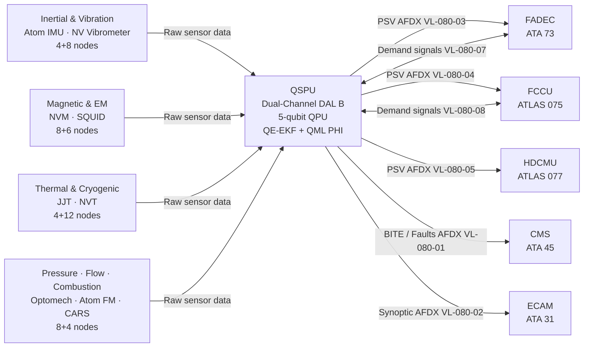
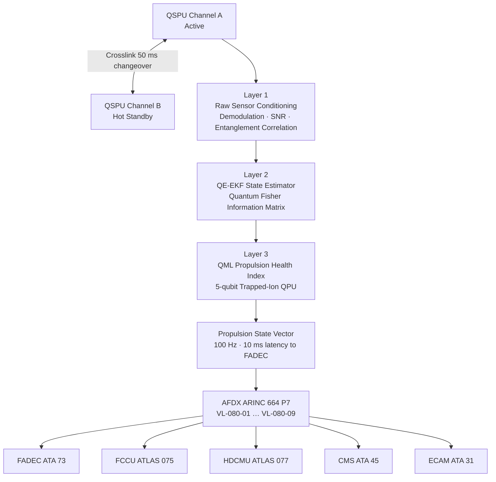

<!-- ──────────────────────────────────────────────────────────────────────────
     QATL-ATLAS-1000-ATLAS-080-089-08-080-000-QUANTUM-SENSING-FOR-PROPULSION-GENERAL
     ATLAS-080 (Quantum Sensing for Propulsion) · Quantum Sensing for Propulsion — General
     AMPEL360E eWTW — ATLAS Register 1000
────────────────────────────────────────────────────────────────────────────── -->

# Quantum Sensing for Propulsion — General

---

## §0 Hyperlink Policy

> All hyperlinks in this document are **relative** (five directory levels: `../../../../../`).
> Absolute URLs are forbidden. Every linked document must exist in the Q+ATLANTIDE repository
> before the link is activated. Broken links are treated as open issues and must be resolved
> before the document is promoted from `DRAFT` to `APPROVED`.

---

## §1 Purpose

ATLAS subsubject 080-000 establishes the general scope, top-level architecture, and governing standards for the Quantum Sensing for Propulsion (QSP) system of the AMPEL360E eWTW. This document is the apex reference for all subordinate subsubject documents (080-010 through 080-090).

The AMPEL360E eWTW integrates a **Quantum Sensing for Propulsion (QSP)** system that applies quantum-enhanced physical measurement to propulsion health monitoring, performance optimization, and safety-critical sensing across the full hybrid-electric propulsion chain. The QSP system provides measurement fidelity and sensitivity beyond the limits of classical sensor technology, enabling condition-based maintenance, predictive degradation detection, and closed-loop propulsion optimization strategies that are not achievable with conventional instrumentation.

All subsubject documents (080-010 through 080-090) are subordinate to this general baseline and inherit its governance class, Q-Division authority, and S1000D CSDB affiliation.

---

## §2 Applicability

| Parameter | Value |
|---|---|
| Aircraft Program | AMPEL360E eWTW |
| ATA reference | ATLAS-080 (Quantum Sensing for Propulsion) — 080-000 Quantum Sensing for Propulsion General |
| Certification basis | EASA CS-25 Amdt 27+; DO-178C DAL B; DO-254 DAL B; IEEE P2995; IEC 80001-1 |
| S1000D SNS | 080-000-00 |

---

## §3 Functional Description ![DRAFT]

The AMPEL360E eWTW **Quantum Sensing for Propulsion (QSP)** system applies quantum-physical measurement principles to all major propulsion sub-domains: turbofan shaft dynamics and blade health, hybrid-electric drive-chain electromagnetic state, cryogenic and high-temperature thermal management, and hydrogen fuel feed pressure and flow. The QSP system comprises four sensor families: (1) **Quantum Inertial and Vibration Sensors** — NV-center vibrometers and atom interferometer IMUs — used for propulsion shaft dynamics, blade tip timing, and bearing wear monitoring; (2) **Quantum Magnetic and Electromagnetic Sensors** — SQUID arrays and NV magnetometers — for non-contact EM field mapping and current monitoring in the hybrid-electric drive components; (3) **Quantum Thermal and Cryogenic Sensors** — Josephson junction thermometers and NV thermometry — spanning the full propulsion thermal envelope from 4 K (HTS motor windings, LH₂ lines) to 1 800 K (turbine hot section); and (4) **Quantum Pressure, Flow, and Combustion Sensors** — optomechanical quantum pressure sensors, atom-interferometer flow meters, and femtosecond-CARS combustion diagnostics.

All quantum sensor data streams are processed by the **Quantum Sensing Processing Unit (QSPU)** — a dual-channel controller (DO-178C DAL B / DO-254 DAL B) housed in the avionics EE bay. The QSPU executes quantum sensor signal demodulation, entanglement-enhanced multi-sensor correlation, a Quantum-Enhanced Extended Kalman Filter (QE-EKF) state estimator, and a Quantum Machine Learning (QML) Propulsion Health Index (PHI) algorithm running on an embedded 5-qubit trapped-ion co-processor. The combined output is a **Propulsion State Vector (PSV)** updated at 100 Hz.

The QSPU publishes processed PSV data to the FADEC (ATA 73), Fuel Cell Control Unit (FCCU, ATLAS 075), Hybrid Distribution and Conditioning Monitoring Unit (HDCMU, ATLAS 077), and Central Maintenance System (CMS, ATA 45) via AFDX ARINC 664 P7. Cockpit awareness is provided through the ECAM PROP QSP synoptic page (ECAM, ATA 31). The total quantum sensor network comprises **46 sensor nodes** across the four families, with a planned **32 S1000D data modules** (DMRL) under BREX-080-v1.

The QSP system is designed as an advisory and augmentation layer operating at DAL B; all receiving control systems retain their own DAL A classical sensor chains. A QSPU fault results in receiving controllers reverting to their classical sensor sets within 100 ms, with no degradation in primary control authority. This architecture enables incremental quantum sensing benefit while preserving the existing certified classical control loops.

---

## §4 Functional Breakdown

| ID | Name | Description | Lead Division |
|---|---|---|---|
| F-001 | QSP General / Overview | System scope, architecture baseline, DMRL, governing standards | Q-HPC |
| F-002 | Quantum Sensor Architecture | Physical node placement, AFDX VL topology, QSPU LRU definition, network zones | Q-HPC |
| F-003 | Quantum Inertial and Vibration Sensing | Atom interferometer IMUs, NV vibrometers; shaft dynamics, blade tip timing | Q-MECHANICS |
| F-004 | Quantum Magnetic and EM Sensing | NV magnetometers, SQUID arrays; non-contact current sensing, EM fault detection | Q-GREENTECH |
| F-005 | Quantum Thermal and Cryogenic Sensing | JJ thermometers (cryogenic), NV thermometry (hot section); full thermal envelope | Q-GREENTECH |
| F-006 | Quantum Pressure, Flow and Combustion Sensing | Optomechanical pressure, atom flow meters, femtosecond-CARS diagnostics | Q-AIR |
| F-007 | Quantum Sensor Fusion and Propulsion State Estimation | QE-EKF, QML PHI computation, PSV generation; 100 Hz update | Q-HPC |
| F-008 | Integration with Propulsion Control | PSV distribution to FADEC, FCCU, HDCMU, MCU, TMC, PDCU; fallback logic | Q-HPC |

---

## §5 System Context — Mermaid Diagram

---

## §6 Internal Architecture — Mermaid Diagram

---

## §7 Components and LRUs

| Component | Part Number | Qty | Location | Maintenance Interval | Notes |
|---|---|---|---|---|---|
| Quantum Sensing Processing Unit (QSPU) | QSPU-PN-TBD | 1 | EE bay rack (4-MCU) | Software update per SB; C-check BITE | Dual-channel; DO-178C DAL B; DO-254 DAL B; 5-qubit QPU integral |
| Atom Interferometer IMU Module | AI-IMU-PN-TBD | 4 | Fwd/aft propulsion mount, port/stbd nacelle | 5 000 h / C-check laser realignment | Rb-87 cold-atom; 10⁻⁹ g/√Hz; 10 Hz output |
| NV-Center Vibrometer Probe | NVVIB-PN-TBD | 8 | Turbofan N1/N2 blade tip clearance zone | 2 500 h visual inspection; C-check calibration | 1 nm sensitivity at 100 Hz–1 kHz |
| NV-Center Magnetometer Probe | NVM-PN-TBD | 8 | PMSM motor stator (2 per motor/generator) | A-check zero-field baseline check | 1 pT/√Hz; ambient temp; no cryocooling |
| SQUID Magnetometer Sensor Head | SQUID-PN-TBD | 6 | HV power distribution zone | 2 500 h cryo-cooler inspection | 5 fT/√Hz; 4.2 K JT cooled |
| Josephson Junction Thermometer Module | JJT-PN-TBD | 4 | LH₂ feed zone; cryo motor winding zone | 5 000 h calibration verification | 4–300 K; ±0.1 mK accuracy |
| NV-Center Thermometer Probe (hot section) | NVT-PN-TBD | 12 | Combustion zone; turbine blade TBC | C-check optical alignment | 300–1 800 K; ±0.5 K |
| Optomechanical Pressure Sensor Node | OMPS-PN-TBD | 8 | Combustion chamber P3/P4; GH₂ anode; fuel manifold | 2 500 h cavity finesse check | 10 µPa/√Hz; 0–100 bar |
| Atom Interferometer Flow Meter Node | AIFM-PN-TBD | 4 | GH₂ feed A/B; fuel feed A/B | 2 500 h atom source check | ±0.05 % accuracy; 0.1–5 g/s |

---

## §8 Interfaces

| Interface Type | Connected System | Protocol / Medium | Data / Function |
|---|---|---|---|
| Propulsion Control | FADEC — ATA 73 | AFDX ARINC 664 P7 VL-080-03/07 | PSV N1/N2 augmentation; combustion P3/P4; turbine blade temp; PHI for EHM |
| Fuel Cell Control | FCCU — ATLAS 075 | AFDX ARINC 664 P7 VL-080-04/08 | GH₂ flow actuals; quantum H₂ concentration; FCCU efficiency loop input |
| H₂ Distribution | HDCMU — ATLAS 077 | AFDX ARINC 664 P7 VL-080-05 | Cryogenic temperature map; optomechanical GH₂ pressure; thermal state |
| Motor Control | MCU — ATLAS 071 | AFDX ARINC 664 P7 VL-080-06 | EM field state; rotor imbalance data; demagnetisation compensation |
| Thermal Management | TMC — ATLAS 074 | AFDX ARINC 664 P7 VL-080-07 | Full-envelope thermal map from JJT + NVT sensor families |
| Maintenance | CMS — ATA 45 | AFDX ARINC 664 P7 VL-080-01 | QSPU BITE faults; PHI trend log; sensor health data |
| Cockpit Awareness | ECAM — ATA 31 | AFDX ARINC 664 P7 VL-080-02 | PROP QSP synoptic; PSV key parameters; QSPU mode indication |
| GSE / Calibration | QSPU-GSE-1 | USB-C 3.2 + quantum calibration RF port | Quantum sensor calibration, test, QML model upload |
| Electrical Power | HVDC 270 V bus — ATA 24 | HVDC cable | QSPU, QPU cryo-cooler, sensor node excitation power |

---

## §9 Operating Modes

| Mode | Trigger | System State | Actions / Consequences |
|---|---|---|---|
| Normal — Active | Both QSPU channels healthy; all sensor families nominal | CHA active; all 46 sensor nodes in acquisition; PSV published at 100 Hz | Continuous quantum-enhanced propulsion monitoring; PHI ≥ 0.95 |
| Monitor | PHI 0.80–0.95 | QSPU maintains full acquisition; QML detects early degradation signature | Trend logging intensified; CMS advisory; no crew message unless persisting > 30 min |
| Advisory | PHI 0.60–0.80 | QSPU raises ECAM amber advisory (PROP QSP PHI LOW) | FADEC/FCCU notified; maintenance action scheduled at next opportunity |
| Warning | PHI < 0.60 | QSPU raises ECAM red warning (PROP QSP PHI WARN) | Crew informed; FADEC executes conservative thrust management; dispatch restriction applies |
| Channel Changeover | CHA fault detected | CHB promoted to active within 50 ms | White ECAM advisory PROP QSP CHAN CHG; no loss of PSV; CMS fault logged |
| Sensor Degraded | One or more sensor nodes lost | QSPU recomputes PSV with reduced sensor set; QE-EKF covariance increases | Affected node flagged in synoptic; PHI uncertainty band widened; CMS advisory |
| Maintenance Mode | GSE connected and ECAM PROP QSP MAINT active | QSPU in test mode; PSV distribution to propulsion controllers suspended | Sensor calibration and BITE full runs executable; QPU coherence test mandatory before node access |
| Emergency Fallback | QSPU total loss | QSPU data removed from all propulsion control loops; classical sensor chains primary | No QSPU impact on primary control authority; receiving controllers fall back within 100 ms |

---

## §10 Performance and Budgets ![DRAFT]

| Parameter | Requirement | Target / Design Value | Status |
|---|---|---|---|
| Total quantum sensor nodes | 46 (4 families) | 46 nodes | ![TBD] |
| PSV update rate | ≥ 50 Hz | 100 Hz | ![TBD] |
| PSV latency to FADEC | ≤ 10 ms | 8 ms target | ![TBD] |
| PHI computation latency | ≤ 50 ms | 40 ms target | ![TBD] |
| BITE fault isolation time | ≤ 100 ms | 80 ms target | ![TBD] |
| Channel changeover time | ≤ 100 ms | 50 ms target | ![TBD] |
| QSPU availability | ≥ 99.99 % dispatch | Dual-channel architecture | ![TBD] |
| QPU coherence time (T1) | ≥ 100 µs per qubit | 120 µs target | ![TBD] |
| Atom interferometer IMU acceleration sensitivity | ≤ 10⁻⁹ g/√Hz | 10⁻⁹ g/√Hz | ![TBD] |
| NV vibrometer displacement sensitivity | ≤ 1 nm at 100 Hz–1 kHz | 1 nm | ![TBD] |
| NV magnetometer sensitivity | ≤ 1 pT/√Hz at 1–100 kHz | 1 pT/√Hz | ![TBD] |
| JJ thermometer accuracy (4–300 K) | ≤ ±0.5 mK | ±0.1 mK | ![TBD] |
| Optomechanical pressure sensor sensitivity | ≤ 50 µPa/√Hz | 10 µPa/√Hz | ![TBD] |
| Atom flow meter accuracy | ≤ ±0.1 % of reading | ±0.05 % of reading | ![TBD] |

---

## §11 Safety and Airworthiness Considerations

The QSP system is classified as a **safety-significant system** at DAL B for the QSPU and all its software functions, per EASA CS-25 §25.1309 failure condition analysis. The system operates in an advisory/augmentation role; no single failure within the QSP system can cause a hazardous or catastrophic propulsion outcome, because all propulsion control systems retain independent DAL A classical sensor chains as the primary authority. Key safety design provisions include:

- **Dual-channel QSPU architecture:** CHA (active) and CHB (hot-standby) with cross-channel monitoring; 50 ms automatic changeover on CHA failure; no loss of PSV publication.
- **Advisory-only data path:** QSPU PSV data is labelled as advisory/augmentation in all receiving controller data buses; each controller independently validates PSV data against its own classical sensor readings before incorporating into control loops.
- **Quantum coherence safeguard:** QSPU monitors QPU T1 coherence time continuously; QPU coherence degradation (T1 < 80 µs) raises QSPU QPU FAULT advisory and removes QML PHI computation, falling back to classical rule-based health index.
- **Cryogenic sensor safety:** SQUID sensor heads (4.2 K) and JJ thermometer modules employ micro-hermetic vacuum-sealed cryoheads; Joule-Thomson cooler failure results in passive safe warm-up; no LHe pressure vessel on board aircraft.
- **RF/EM isolation:** Quantum sensor nodes (atom interferometer, NV, SQUID) require < 100 nT background field during operation; QSPU monitors ambient field level and flags nodes out-of-specification.

---

## §12 Standards and Regulatory References

| Standard / Regulation | Title | Applicability |
|---|---|---|
| EASA CS-25 Amdt 27+ | Airworthiness Standards — Large Aeroplanes | Overall system airworthiness |
| DO-178C | Software Considerations in Airborne Systems | QSPU flight software — DAL B |
| DO-254 | Design Assurance Guidance for Airborne Electronic Hardware | QSPU hardware — DAL B |
| ARINC 664 P7 | Aircraft Data Network — AFDX | QSPU data bus |
| IEEE P2995 | Trial-Use Standard for Quantum Computing Definitions | Quantum terminology and metrics |
| IEC 80001-1 | Application of risk management to IT networks incorporating medical devices (adapted) | QSPU network safety assessment |
| MIL-STD-1553B | Digital Time Division Command/Response Multiplex Data Bus | Legacy compatibility layer |
| SAE ARP4754A | Guidelines for Development of Civil Aircraft and Systems | System development assurance |
| SAE ARP4761 | Guidelines for Conduct of FMEA / FTA | Safety assessment methodology |

---

## §13 Document Cross-References

| Document | Location | Relevance |
|---|---|---|
| 080-010 Quantum Sensor Architecture | [080-010-Quantum-Sensor-Architecture-for-Propulsion.md](./080-010-Quantum-Sensor-Architecture-for-Propulsion.md) | Physical node layout and AFDX VL topology |
| 080-020 Quantum Inertial and Vibration Sensing | [080-020-Quantum-Inertial-and-Vibration-Sensing.md](./080-020-Quantum-Inertial-and-Vibration-Sensing.md) | Atom IMU and NV vibrometer detail |
| 080-030 Quantum Magnetic and EM Sensing | [080-030-Quantum-Magnetic-and-Electromagnetic-Sensing.md](./080-030-Quantum-Magnetic-and-Electromagnetic-Sensing.md) | NV magnetometer and SQUID array detail |
| 080-040 Quantum Thermal and Cryogenic Sensing | [080-040-Quantum-Thermal-and-Cryogenic-Sensing.md](./080-040-Quantum-Thermal-and-Cryogenic-Sensing.md) | JJ thermometer and NV thermometry detail |
| 080-050 Quantum Pressure, Flow and Combustion Sensing | [080-050-Quantum-Pressure-Flow-and-Combustion-Sensing.md](./080-050-Quantum-Pressure-Flow-and-Combustion-Sensing.md) | Optomechanical pressure, atom flow, CARS detail |
| 080-060 Quantum Sensor Fusion and State Estimation | [080-060-Quantum-Sensor-Fusion-and-Propulsion-State-Estimation.md](./080-060-Quantum-Sensor-Fusion-and-Propulsion-State-Estimation.md) | QE-EKF, QML PHI, PSV definition |
| 080-070 Integration with Propulsion Control | [080-070-Quantum-Sensing-Integration-with-Propulsion-Control.md](./080-070-Quantum-Sensing-Integration-with-Propulsion-Control.md) | FADEC/FCCU/HDCMU/MCU integration |
| 080-080 Monitoring, Diagnostics and Control Interfaces | [080-080-Quantum-Sensing-Monitoring-Diagnostics-and-Control-Interfaces.md](./080-080-Quantum-Sensing-Monitoring-Diagnostics-and-Control-Interfaces.md) | QSPU hardware, ECAM messages, AFDX VLs |
| 080-090 S1000D / CSDB Mapping and Traceability | [080-090-S1000D-CSDB-Mapping-and-Traceability.md](./080-090-S1000D-CSDB-Mapping-and-Traceability.md) | DMRL, BREX-080, CSDB traceability |
| ATLAS 077 H₂ Distribution — General | [../../070-079_Propulsion-Eco-Tech-e-Hibrido-Electrica/077_Hydrogen-Distribution-and-Conditioning/077-000-Hydrogen-Distribution-and-Conditioning-General.md](../../070-079_Propulsion-Eco-Tech-e-Hibrido-Electrica/077_Hydrogen-Distribution-and-Conditioning/077-000-Hydrogen-Distribution-and-Conditioning-General.md) | HDCMU integration |
| ATLAS 075 Fuel Cell Integration — General | [../../070-079_Propulsion-Eco-Tech-e-Hibrido-Electrica/075_Fuel-Cell-Integration/075-000-Fuel-Cell-Integration-General.md](../../070-079_Propulsion-Eco-Tech-e-Hibrido-Electrica/075_Fuel-Cell-Integration/075-000-Fuel-Cell-Integration-General.md) | FCCU integration |

---

## §14 Revision History

| Rev | Date | Author | Description |
|---|---|---|---|
| 0.1 | 2026-05-12 | Q-HPC | Initial DRAFT baseline release |
