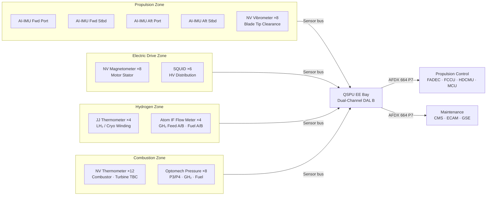

<!-- ──────────────────────────────────────────────────────────────────────────
     QATL-ATLAS-1000-ATLAS-080-089-08-080-010-QUANTUM-SENSOR-ARCHITECTURE-FOR-PROPULSION
     ATLAS-080 (Quantum Sensing for Propulsion) · Quantum Sensor Architecture for Propulsion
     AMPEL360E eWTW — ATLAS Register 1000
────────────────────────────────────────────────────────────────────────────── -->

# Quantum Sensor Architecture for Propulsion

---

## §0 Hyperlink Policy

> All hyperlinks in this document are **relative** (five directory levels: `../../../../../`).
> Absolute URLs are forbidden. Every linked document must exist in the Q+ATLANTIDE repository
> before the link is activated. Broken links are treated as open issues and must be resolved
> before the document is promoted from `DRAFT` to `APPROVED`.

---

## §1 Purpose

ATLAS subsubject 080-010 defines the physical and logical architecture of the Quantum Sensing for Propulsion (QSP) sensor network: the number, type, and placement of sensor nodes; the four sensor family groupings; the QSPU dual-channel hub LRU; and the AFDX virtual link (VL) topology. This document provides the architectural baseline from which all detailed sensor family documents (080-020 through 080-060) are derived.

---

## §2 Applicability

| Parameter | Value |
|---|---|
| Aircraft Program | AMPEL360E eWTW |
| ATA reference | ATLAS-080 (Quantum Sensing for Propulsion) — 080-010 Quantum Sensor Architecture |
| Certification basis | EASA CS-25 Amdt 27+; DO-178C DAL B; DO-254 DAL B; ARINC 664 P7; IEEE P2995 |
| S1000D SNS | 080-010-00 |

---

## §3 Functional Description ![DRAFT]

The QSP sensor network of the AMPEL360E eWTW consists of **46 quantum sensor nodes** distributed across four network zones: the **Propulsion Zone (PZ)** covering the turbofan nacelles (N1/N2 shaft dynamics, blade tip clearance); the **Electric Drive Zone (EDZ)** covering motor/generator stators and rotor assemblies; the **Hydrogen Zone (HZ)** covering LH₂/GH₂ distribution lines and cryogenic propulsion interfaces; and the **Combustion Zone (CZ)** covering the turbofan combustor and turbine hot section. Each zone is a logical grouping of sensor nodes sharing a common environmental envelope and maintenance access class.

The **Quantum Sensing Processing Unit (QSPU)** is a 4-MCU EE bay rack unit forming the centralised processing hub for all 46 nodes. The QSPU is dual-channel (CHA active / CHB hot-standby) with automatic channel changeover in < 50 ms upon CHA fault detection. Each channel contains a 64-bit safety-grade RISC-V CPU, an Artix-7 FPGA for quantum sensor signal demodulation, a 5-qubit trapped-ion QPU module (4.2 K cooled by Stirling cryocooler, 10 × 10 × 5 cm), and 256 GB NVM. The QSPU is qualified to DO-178C DAL B (software) and DO-254 DAL B (hardware).

The AFDX VL topology consists of **8 outbound VLs** from the QSPU (VL-080-01 through VL-080-08) and **2 inbound VLs** (VL-080-07 from FADEC, VL-080-08 from FCCU) carrying sensor demand and configuration signals. Sensor nodes communicate with the QSPU over dedicated sensor buses: RS-485 differential serial links for legacy-compatible nodes and bespoke quantum-optical fibre links for high-bandwidth optical readout nodes (optomechanical sensors, NV vibrometers, CARS probe). The MIL-STD-1553B bus is maintained as a legacy compatibility layer for integration with existing FADEC and CMS BITE chains.

The node-to-QSPU sensor bus harness is routed in dedicated conduits, separated from 270 V HVDC harnesses by ≥ 50 mm to avoid magnetic interference with NV-center and SQUID nodes. Shielded twisted-pair for RF-sensitive atom interferometer nodes uses a double-braid EMI shield, grounded at the QSPU chassis only (single-point ground) to prevent shield-loop currents.

---

## §4 Functional Breakdown

| ID | Name | Description | Lead Division |
|---|---|---|---|
| F-010-01 | Propulsion Zone (PZ) node set | 4× AI-IMU + 8× NV vibrometer probes in nacelle turbofan section | Q-MECHANICS |
| F-010-02 | Electric Drive Zone (EDZ) node set | 8× NV magnetometer probes + 6× SQUID sensor heads in motor/HV zone | Q-GREENTECH |
| F-010-03 | Hydrogen Zone (HZ) node set | 4× JJ thermometer + 4× atom interferometer flow meter nodes in H₂ zone | Q-GREENTECH |
| F-010-04 | Combustion Zone (CZ) node set | 12× NV thermometer probes + 8× optomechanical pressure sensors in hot section | Q-AIR |
| F-010-05 | QSPU LRU | 4-MCU dual-channel EE bay unit; CHA/CHB; 5-qubit QPU; RISC-V + FPGA | Q-HPC |
| F-010-06 | Sensor bus harness | RS-485 differential links; quantum-optical fibre links; EMI shielding | Q-INDUSTRY |
| F-010-07 | AFDX VL topology | 8 outbound + 2 inbound VLs; ARINC 664 P7; bandwidth allocation per VL | Q-HPC |
| F-010-08 | MIL-STD-1553B legacy bridge | QSPU 1553B sub-bus for FADEC and CMS legacy BITE integration | Q-HPC |

---

## §5 System Context — Mermaid Diagram

---

## §6 Internal Architecture — AFDX VL Table

| VL ID | Direction | Source | Destination | Bandwidth | Function |
|---|---|---|---|---|---|
| VL-080-01 | Outbound | QSPU | CMS ATA 45 | 256 kbps | BITE faults; sensor health; PHI trend log |
| VL-080-02 | Outbound | QSPU | ECAM ATA 31 | 512 kbps | PROP QSP synoptic; PSV key parameters |
| VL-080-03 | Outbound | QSPU | FADEC ATA 73 | 1 Mbps | PSV N1/N2 augmentation; blade temp; P3/P4 |
| VL-080-04 | Outbound | QSPU | FCCU ATLAS 075 | 512 kbps | GH₂ flow actuals; H₂ concentration |
| VL-080-05 | Outbound | QSPU | HDCMU ATLAS 077 | 512 kbps | Cryogenic temp map; optomechanical GH₂ pressure |
| VL-080-06 | Outbound | QSPU | MCU ATLAS 071 | 256 kbps | EM field state; rotor imbalance |
| VL-080-07 | Bi-directional | QSPU ↔ FADEC | FADEC ATA 73 | 256 kbps | Demand signals; N1/N2 reference; configuration |
| VL-080-08 | Bi-directional | QSPU ↔ FCCU | FCCU ATLAS 075 | 256 kbps | Fuel demand; flow setpoint; config |
| VL-080-09 | Outbound | QSPU | GSE Port | 100 Mbps | Calibration data; QML weight upload; test streams |

---

## §7 Components and LRUs

| Component | Part Number | Qty | Location | Maintenance Interval | Notes |
|---|---|---|---|---|---|
| QSPU — Quantum Sensing Processing Unit | QSPU-PN-TBD | 1 | EE bay rack 4-MCU | Software update per SB; C-check BITE | Dual-channel DAL B; 5-qubit QPU integral |
| Sensor Bus Controller (SBC) — RS-485 | SBC-485-PN-TBD | 4 | QSPU chassis (one per zone) | Replaced with QSPU LRU | Addressable RS-485 multipoint; 4 Mbps per zone bus |
| Quantum Optical Fibre Link Module | QOFL-PN-TBD | 2 | QSPU chassis | Replaced with QSPU LRU | 1 550 nm single-mode fibre; optomechanical + NV vibrometer readout |
| Sensor Node Harness Assembly — PZ | SHA-PZ-PN-TBD | 1 | Nacelle zone | On-condition; A-check continuity | Double-braid EMI shield; single-point QSPU ground |
| Sensor Node Harness Assembly — EDZ | SHA-EDZ-PN-TBD | 1 | Motor/HV zone | On-condition; A-check continuity | Dedicated magnetic-field-free conduit; ≥ 50 mm from HVDC |
| Sensor Node Harness Assembly — HZ | SHA-HZ-PN-TBD | 1 | H₂ zone | On-condition; A-check continuity | ATEX Group IIC rated insulation |
| Sensor Node Harness Assembly — CZ | SHA-CZ-PN-TBD | 1 | Combustion/turbine zone | On-condition; B-check continuity | High-temp mineral-insulated cable for NVT probes |
| MIL-STD-1553B Sub-Bus Interface Card | MIL1553-PN-TBD | 1 | QSPU chassis | Replaced with QSPU LRU | Remote terminal (RT) mode; FADEC and CMS legacy bridge |

---

## §8 Interfaces

| Interface Type | Connected System | Protocol / Medium | Data / Function |
|---|---|---|---|
| Sensor family PZ | Atom IMU, NV vibrometer nodes | RS-485 + optical fibre | Raw inertial and vibration data; 10 Hz IMU, 1 kHz vibrometer |
| Sensor family EDZ | NV magnetometer, SQUID nodes | RS-485 differential | EM field samples; 1 kHz sample rate |
| Sensor family HZ | JJ thermometer, atom flow meter nodes | RS-485 differential | Temperature; mass flow; 10 Hz update |
| Sensor family CZ | NV thermometer, optomechanical pressure nodes | Optical fibre + RS-485 | Temperature; pressure; 1 kHz bandwidth |
| Propulsion control bus | FADEC, FCCU, HDCMU, MCU | AFDX ARINC 664 P7 | PSV distribution; demand signals |
| Maintenance bus | CMS ATA 45 | AFDX ARINC 664 P7 | BITE faults; PHI trends |
| Cockpit bus | ECAM ATA 31 | AFDX ARINC 664 P7 | QSP synoptic |
| Legacy bus | FADEC and CMS legacy BITE | MIL-STD-1553B | Legacy BITE chain compatibility |
| GSE port | QSPU-GSE-1 calibration tool | USB-C 3.2 + RF calibration port | Sensor calibration; QML weight upload |

---

## §9 Operating Modes

| Mode | Trigger | System State | Actions / Consequences |
|---|---|---|---|
| Normal — Full network | All 46 nodes healthy | QSPU acquires all nodes; PSV 100 Hz; all VLs active | Optimal QE-EKF covariance; PHI at maximum confidence |
| Degraded — Node fault | 1–5 nodes out-of-specification or failed | QSPU recomputes PSV from remaining nodes; QE-EKF covariance increases proportionally | Affected nodes flagged on ECAM synoptic; CMS advisory; no PHI forced change unless critical node |
| Degraded — Zone fault | All nodes in one zone lost | QSPU continues with 3 sensor families; PHI uncertainty band substantially increased | ECAM amber for affected zone; downstream controllers notified; maintenance action required |
| Channel changeover | CHA fault | CHB promoted to active in < 50 ms | White ECAM advisory; QSPU logs fault; no PSV interruption |
| Maintenance / test | GSE connected; ECAM PROP QSP MAINT active | QSPU in test mode; PSV to propulsion controllers suspended | Sensor calibration and BITE runs active; AFDX outbound VLs held |
| Legacy-only mode | QSPU total loss | MIL-STD-1553B legacy sub-bus kept live for CMS BITE | Propulsion controllers fall back to classical sensors; no QSP contribution |

---

## §10 Performance and Budgets ![DRAFT]

| Parameter | Requirement | Target / Design Value | Status |
|---|---|---|---|
| Total sensor nodes | 46 | 46 | ![TBD] |
| QSPU rack space | ≤ 4 MCU | 4 MCU | ![TBD] |
| QSPU power consumption | ≤ 250 W total (both channels + QPU cryo) | 220 W target | ![TBD] |
| Sensor bus bandwidth — RS-485 per zone | ≥ 1 Mbps | 4 Mbps | ![TBD] |
| Optical fibre link bandwidth | ≥ 100 Mbps per link | 1 Gbps | ![TBD] |
| AFDX outbound VL aggregate | ≤ 3 Mbps | 2.8 Mbps | ![TBD] |
| EMI harness isolation (sensor vs. HVDC) | ≥ 50 mm clearance | 60 mm design | ![TBD] |
| Channel changeover latency | ≤ 100 ms | 50 ms target | ![TBD] |
| QSPU MTBF | ≥ 20 000 h | 25 000 h target | ![TBD] |
| Node replacement time (on-wing) | ≤ 2 h per node | 1.5 h target | ![TBD] |

---

## §11 Safety and Airworthiness Considerations

The QSPU LRU is the single centralised hub for all 46 quantum sensor nodes. Its dual-channel architecture (CHA/CHB) with automatic changeover ensures that no single hardware failure within the QSPU itself removes the advisory QSP data from the propulsion controllers without notification. The sensor bus harness architecture separates high-frequency quantum sensor readout lines from the HVDC power distribution harness to prevent magnetic field-induced decoherence in NV-center and SQUID nodes. All harness connectors in the hydrogen zone (HZ) are rated ATEX Group IIC. The 1553B legacy bridge ensures that even in a total AFDX failure scenario, a minimal BITE and health status signal reaches the CMS.

---

## §12 Standards and Regulatory References

| Standard / Regulation | Title | Applicability |
|---|---|---|
| EASA CS-25 Amdt 27+ | Airworthiness Standards — Large Aeroplanes | System airworthiness |
| DO-178C | Software Considerations — DAL B | QSPU software |
| DO-254 | Hardware Design Assurance — DAL B | QSPU hardware |
| ARINC 664 P7 | AFDX Data Network | VL topology |
| MIL-STD-1553B | Digital Time-Division Multiplex Bus | Legacy compatibility |
| IEEE P2995 | Quantum Computing Definitions | Quantum metrics |
| IEC 61000-4-3 | Electromagnetic Compatibility — Radiated Immunity | EMI harness shielding |
| SAE ARP4754A | Civil Aircraft System Development Assurance | Architecture development |

---

## §13 Document Cross-References

| Document | Location | Relevance |
|---|---|---|
| 080-000 QSP General | [080-000-Quantum-Sensing-for-Propulsion-General.md](./080-000-Quantum-Sensing-for-Propulsion-General.md) | Parent apex document |
| 080-020 Quantum Inertial and Vibration Sensing | [080-020-Quantum-Inertial-and-Vibration-Sensing.md](./080-020-Quantum-Inertial-and-Vibration-Sensing.md) | PZ node detail |
| 080-030 Quantum Magnetic and EM Sensing | [080-030-Quantum-Magnetic-and-Electromagnetic-Sensing.md](./080-030-Quantum-Magnetic-and-Electromagnetic-Sensing.md) | EDZ node detail |
| 080-040 Quantum Thermal and Cryogenic Sensing | [080-040-Quantum-Thermal-and-Cryogenic-Sensing.md](./080-040-Quantum-Thermal-and-Cryogenic-Sensing.md) | HZ node detail |
| 080-050 Quantum Pressure, Flow and Combustion | [080-050-Quantum-Pressure-Flow-and-Combustion-Sensing.md](./080-050-Quantum-Pressure-Flow-and-Combustion-Sensing.md) | CZ node detail |
| 080-080 Monitoring, Diagnostics and Control Interfaces | [080-080-Quantum-Sensing-Monitoring-Diagnostics-and-Control-Interfaces.md](./080-080-Quantum-Sensing-Monitoring-Diagnostics-and-Control-Interfaces.md) | QSPU hardware architecture detail |
| ATLAS 077 HDCMU General | [../../070-079_Propulsion-Eco-Tech-e-Hibrido-Electrica/077_Hydrogen-Distribution-and-Conditioning/077-000-Hydrogen-Distribution-and-Conditioning-General.md](../../070-079_Propulsion-Eco-Tech-e-Hibrido-Electrica/077_Hydrogen-Distribution-and-Conditioning/077-000-Hydrogen-Distribution-and-Conditioning-General.md) | H₂ distribution system interface |

---

## §14 Revision History

| Rev | Date | Author | Description |
|---|---|---|---|
| 0.1 | 2026-05-12 | Q-HPC | Initial DRAFT baseline release |
