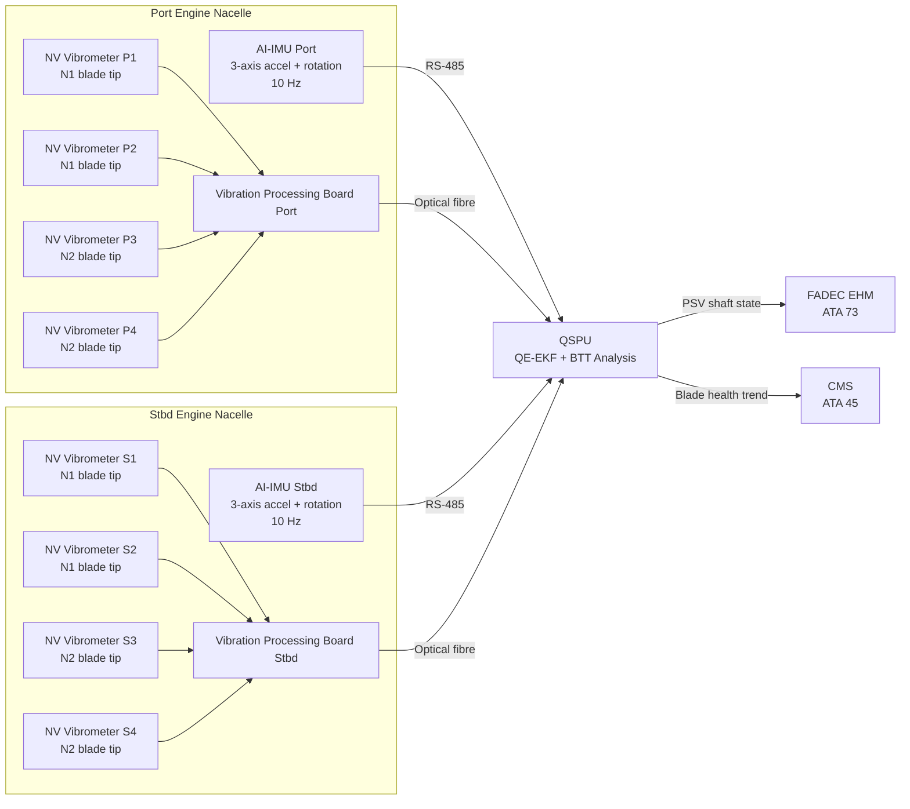
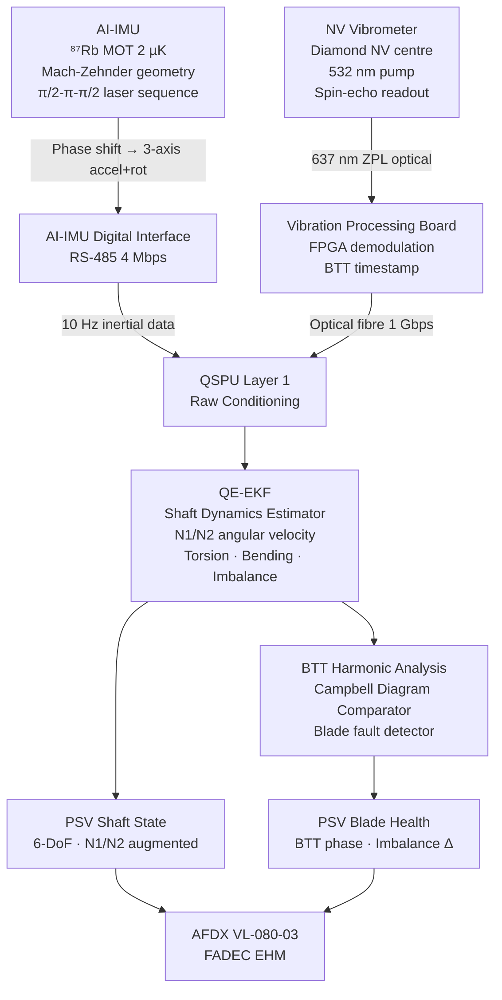

<!-- ──────────────────────────────────────────────────────────────────────────
     QATL-ATLAS-1000-ATLAS-080-089-08-080-020-QUANTUM-INERTIAL-AND-VIBRATION-SENSING
     ATLAS-080 (Quantum Sensing for Propulsion) · Quantum Inertial and Vibration Sensing
     AMPEL360E eWTW — ATLAS Register 1000
────────────────────────────────────────────────────────────────────────────── -->

# Quantum Inertial and Vibration Sensing

---

## §0 Hyperlink Policy

> All hyperlinks in this document are **relative** (five directory levels: `../../../../../`).
> Absolute URLs are forbidden. Every linked document must exist in the Q+ATLANTIDE repository
> before the link is activated. Broken links are treated as open issues and must be resolved
> before the document is promoted from `DRAFT` to `APPROVED`.

---

## §1 Purpose

ATLAS subsubject 080-020 covers the cold-atom atom interferometer Inertial Measurement Units (AI-IMUs) and NV-center quantum vibrometer probes deployed in the AMPEL360E eWTW Propulsion Zone (PZ). These sensors provide quantum-enhanced measurement of propulsion shaft dynamics, rotor imbalance, blade tip timing, and bearing wear — enabling condition-based structural health monitoring of the turbofan and hybrid-electric propulsion assemblies at sensitivities unachievable with classical piezoelectric or MEMS inertial sensors.

---

## §2 Applicability

| Parameter | Value |
|---|---|
| Aircraft Program | AMPEL360E eWTW |
| ATA reference | ATLAS-080 (Quantum Sensing for Propulsion) — 080-020 Quantum Inertial and Vibration Sensing |
| Certification basis | EASA CS-25 Amdt 27+; DO-178C DAL B; DO-254 DAL B; IEEE P2995 |
| S1000D SNS | 080-020-00 |

---

## §3 Functional Description ![DRAFT]

The **Atom Interferometer IMU (AI-IMU)** uses laser-cooled ⁸⁷Rb atoms captured in a magneto-optical trap (MOT) at approximately 2 µK. The atoms are released into free fall and interrogated in a Mach–Zehnder geometry using three counter-propagating laser pulses (π/2 – π – π/2 sequence). The resulting quantum-mechanical phase shift is directly proportional to the experienced acceleration or rotation rate, providing inertial measurement traceable to atomic physics constants rather than mechanical spring constants or micro-fabricated resonators. Four AI-IMU nodes are installed at the four propulsion mount points (forward port, forward starboard, aft port, aft starboard nacelle), providing 3-axis acceleration and 3-axis rotation rate at a **10 Hz update rate** with sensitivity of **10⁻⁹ g/√Hz** for acceleration and **10⁻⁸ rad/s/√Hz** for rotation rate. Interrogation time per cycle is 100 ms. The AI-IMU outputs are the primary quantum-enhanced input to the QE-EKF shaft dynamics estimator in the QSPU.

The **NV-center Quantum Vibrometer (NVVIB)** exploits the electron spin coherence of nitrogen-vacancy (NV) defect centres in synthetic diamond to perform contactless, laser-optical surface vibration measurement. A green (532 nm) pump laser polarises the NV spin into the |ms=0⟩ state; a resonant microwave drive and spin-echo sequence are used to transduce the NV ground-state zero-field splitting shift caused by local lattice strain (vibration) into an optical readout signal on the 637 nm zero-phonon line. The technique resolves nanometre-level surface displacement at bandwidths up to 1 kHz, without mechanical contact with the rotating assembly. **Eight NVVIB probes** are deployed in the turbofan nacelles — four per engine — positioned circumferentially in the blade tip clearance region of the N1 and N2 shafts, providing **Blade Tip Timing (BTT)** data for all rotor stages. Sensitivity is 1 nm vibration amplitude across the 100 Hz–1 kHz band. The BTT data are compared against the Campbell diagram resident in the FADEC BITE model to detect resonance crossings and blade modal frequency shifts indicative of fatigue initiation.

Propulsion shaft dynamics monitoring integrates AI-IMU 6-DoF acceleration/rotation data with the NVVIB BTT signal stream in the QSPU QE-EKF estimator. The fused output produces a continuous shaft torsion, bending mode amplitude, and angular velocity estimate, supplementing the classical FADEC N1/N2 tachometer chain. The QSPU publishes the quantum-augmented shaft state to the FADEC Engine Health Monitoring (EHM) loop, enabling detection of incipient bearing wear (sub-micron raceway spall signature in the NVVIB spectrum at bearing pass frequencies), rotor imbalance growth (AI-IMU lateral acceleration growth ≥ 0.5 µg over 100 flight cycles triggers advisory), and blade loss pre-cursor events (sudden BTT phase shift ≥ 0.1° on two circumferential probes within 1 revolution).

---

## §4 Functional Breakdown

| ID | Name | Description | Lead Division |
|---|---|---|---|
| F-020-01 | Atom Interferometer IMU | Cold-atom ⁸⁷Rb Mach–Zehnder IMU; 3-axis accel + rotation; 10 Hz | Q-MECHANICS |
| F-020-02 | NV-Center Vibrometer Probe | Diamond NV spin-echo contactless vibrometer; 1 nm / 100 Hz–1 kHz BTT | Q-MECHANICS |
| F-020-03 | Vibration Processing Board | Analog front-end + FPGA signal conditioning for NVVIB probes; mounted at nacelle | Q-INDUSTRY |
| F-020-04 | Shaft Dynamics Estimator (in QSPU) | QE-EKF fusion of AI-IMU + NVVIB data; N1/N2 shaft state vector | Q-HPC |
| F-020-05 | Blade Tip Timing Analysis (in QSPU) | BTT harmonic analysis; Campbell diagram comparison; blade fault detection | Q-MECHANICS |
| F-020-06 | FADEC EHM Interface | PSV shaft state to FADEC; EHM fusion; bearing wear and imbalance trend | Q-HPC |

---

## §5 System Context — Mermaid Diagram

---

## §6 Internal Architecture — Mermaid Diagram

---

## §7 Components and LRUs

| Component | Part Number | Qty | Location | Maintenance Interval | Notes |
|---|---|---|---|---|---|
| Atom Interferometer IMU Module (AI-IMU) | AI-IMU-PN-TBD | 4 | Fwd/aft prop mount, port/stbd nacelle | 5 000 h / C-check laser realignment | ⁸⁷Rb cold-atom; 10⁻⁹ g/√Hz; sealed vacuum cell; 10 Hz update |
| NV-Center Vibrometer Probe (NVVIB) | NVVIB-PN-TBD | 8 | Turbofan N1/N2 blade tip clearance ring | 2 500 h visual inspection; C-check calibration | Contactless; 1 nm / 100 Hz–1 kHz; diamond NV head |
| Vibration Processing Board (VPB) | VPB-PN-TBD | 2 | Nacelle (one per engine) | Replaced with NVVIB harness LRU | FPGA-based; BTT timestamp resolution ≤ 1 µs |
| AI-IMU Vacuum Cell Assembly | AIMU-VAC-PN-TBD | 4 | Integral to AI-IMU module | 10 000 h / vacuum check | ⁸⁷Rb getter-sealed glass cell; lifetime limited by Rb reservoir |
| Laser Subsystem (pump + Raman beams) | AIMU-LASER-PN-TBD | 4 | Integral to AI-IMU module | C-check power level verification | 780 nm Raman pair; 52 mW combined; class 3B |
| NV Probe Optical Fibre Assembly | NVVIB-OFA-PN-TBD | 8 | Blade tip ring to VPB | On-condition; A-check connector inspection | Single-mode 1 550 nm; APC connector; bend radius ≥ 30 mm |

---

## §8 Interfaces

| Interface Type | Connected System | Protocol / Medium | Data / Function |
|---|---|---|---|
| QSPU — sensor input | QSPU (ATLAS 080) | RS-485 4 Mbps + optical fibre 1 Gbps | AI-IMU 3-axis inertial; NVVIB BTT stream |
| FADEC EHM | FADEC — ATA 73 | AFDX VL-080-03 | Quantum-augmented N1/N2 shaft state; PHI shaft component |
| CMS blade health | CMS — ATA 45 | AFDX VL-080-01 | BTT trend log; imbalance growth history; bearing wear indicator |
| ECAM synoptic | ECAM — ATA 31 | AFDX VL-080-02 | Shaft vibration level; BTT alarm status in PROP QSP synoptic |
| Electrical power | HVDC 270 V via AI-IMU PDU | HVDC cable | AI-IMU laser subsystem + atom trap RF power |
| Avionics cooling | ECS cold rail — ATA 21 | Conductive cold plate | AI-IMU thermal management; ≤ 40 °C chassis temp |

---

## §9 Operating Modes

| Mode | Trigger | System State | Actions / Consequences |
|---|---|---|---|
| Acquisition — Normal | Engine running; N1 ≥ 15 % | AI-IMU atoms loading; NVVIB spin-echo active | Continuous 10 Hz inertial + 1 kHz BTT data; PSV shaft state published |
| High-resolution sweep | FADEC requests blade BTT sweep | NVVIB sampling rate increased to 4 kHz for 30 s burst | High-resolution Campbell diagram update; data logged to CMS |
| Ground-idle / low-N1 | N1 < 15 % | AI-IMU in standby (atom trap off); NVVIB probes in low-power mode | Reduced power; PSV shaft state from classical FADEC sensors only |
| Bearing trend | CMS daily health request | NVVIB spectrum analysed at bearing pass frequencies (BPFO, BPFI, BSF) | Bearing wear trend updated in CMS; alert if amplitude growth ≥ 6 dB over 100 cycles |
| Imbalance alert | AI-IMU lateral Δg ≥ 0.5 µg/100 cycles | QSPU sets PHI shaft degradation flag | ECAM PROP QSP advisory; FADEC EHM notified for trend confirmation |
| BITE self-test | Engine shutdown; maintenance request | AI-IMU performs laser power, MOT loading, and fringe-contrast self-test | BITE result to CMS; any failure logs AI-IMU node fault code |

---

## §10 Performance and Budgets ![DRAFT]

| Parameter | Requirement | Target / Design Value | Status |
|---|---|---|---|
| AI-IMU acceleration sensitivity | ≤ 10⁻⁸ g/√Hz | 10⁻⁹ g/√Hz | ![TBD] |
| AI-IMU rotation rate sensitivity | ≤ 10⁻⁷ rad/s/√Hz | 10⁻⁸ rad/s/√Hz | ![TBD] |
| AI-IMU update rate | ≥ 10 Hz | 10 Hz | ![TBD] |
| AI-IMU interrogation time | ≤ 150 ms | 100 ms | ![TBD] |
| NVVIB displacement sensitivity | ≤ 5 nm at 100 Hz–1 kHz | 1 nm | ![TBD] |
| NVVIB bandwidth | ≥ 500 Hz | 1 kHz | ![TBD] |
| BTT timestamp resolution | ≤ 2 µs | 1 µs | ![TBD] |
| Blade resonance detection limit (BTT) | 1st–3rd harmonic | 1st–5th harmonic target | ![TBD] |
| AI-IMU power consumption (per node) | ≤ 25 W | 20 W target | ![TBD] |
| NVVIB probe power (per node) | ≤ 2 W | 1.5 W target | ![TBD] |
| AI-IMU MTBF | ≥ 10 000 h | 12 000 h target | ![TBD] |
| NVVIB probe MTBF | ≥ 20 000 h | 25 000 h target | ![TBD] |

---

## §11 Safety and Airworthiness Considerations

The AI-IMU laser subsystem operates at 780 nm (class 3B per IEC 60825-1) and is hermetically enclosed within the LRU; no accessible laser aperture exists during normal installed operation. Laser interlock prevents beam emission when the LRU cover is removed. The NVVIB probes use a 532 nm pump laser (class 3R at probe head, delivered via fibre); the blade tip clearance installation prevents any direct line-of-sight access during engine operation. NV vibrometer probes are passive optical sensors with no moving parts and no electrical connection to the rotating assembly, eliminating any electrical contact hazard with the engine.

AI-IMU nodes contain a ⁸⁷Rb alkali metal vapour cell. The ⁸⁷Rb quantity per cell is < 10 mg (negligible chemical hazard); the cell is getter-sealed and rated to survive crash deceleration per DO-160G Section 7 without Rb release. Vibration Processing Boards are classified as standard avionics LRUs with no special hazardous material designation.

---

## §12 Standards and Regulatory References

| Standard / Regulation | Title | Applicability |
|---|---|---|
| EASA CS-25 Amdt 27+ | Airworthiness Standards — Large Aeroplanes | System airworthiness |
| DO-178C | Software Considerations — DAL B | QSPU shaft dynamics estimator software |
| DO-254 | Hardware Design Assurance — DAL B | VPB hardware |
| DO-160G | Environmental Conditions for Airborne Equipment | AI-IMU and NVVIB environmental qualification |
| IEC 60825-1 | Safety of Laser Products | AI-IMU laser subsystem; NVVIB pump laser |
| IEEE P2995 | Quantum Computing Definitions | Quantum sensor metrics |
| SAE ARP4761 | FMEA/FTA Guidelines | Safety assessment |

---

## §13 Document Cross-References

| Document | Location | Relevance |
|---|---|---|
| 080-000 QSP General | [080-000-Quantum-Sensing-for-Propulsion-General.md](./080-000-Quantum-Sensing-for-Propulsion-General.md) | Apex document |
| 080-010 Quantum Sensor Architecture | [080-010-Quantum-Sensor-Architecture-for-Propulsion.md](./080-010-Quantum-Sensor-Architecture-for-Propulsion.md) | PZ node placement and QSPU architecture |
| 080-060 Quantum Sensor Fusion | [080-060-Quantum-Sensor-Fusion-and-Propulsion-State-Estimation.md](./080-060-Quantum-Sensor-Fusion-and-Propulsion-State-Estimation.md) | QE-EKF processing of AI-IMU + NVVIB data |
| 080-070 Integration with Propulsion Control | [080-070-Quantum-Sensing-Integration-with-Propulsion-Control.md](./080-070-Quantum-Sensing-Integration-with-Propulsion-Control.md) | FADEC EHM integration |
| ATLAS 071 Electric Motor and Drive Systems | [../../070-079_Propulsion-Eco-Tech-e-Hibrido-Electrica/071_Electric-Motor-and-Drive-Systems/071-000-Electric-Motor-and-Drive-Systems-General.md](../../070-079_Propulsion-Eco-Tech-e-Hibrido-Electrica/071_Electric-Motor-and-Drive-Systems/071-000-Electric-Motor-and-Drive-Systems-General.md) | PMSM rotor imbalance context |

---

## §14 Revision History

| Rev | Date | Author | Description |
|---|---|---|---|
| 0.1 | 2026-05-12 | Q-MECHANICS | Initial DRAFT baseline release |
