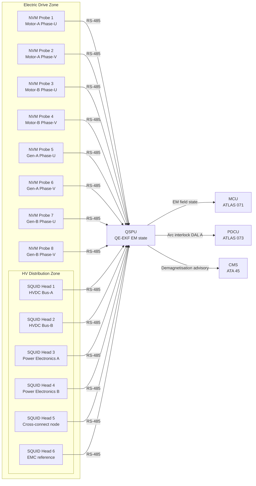
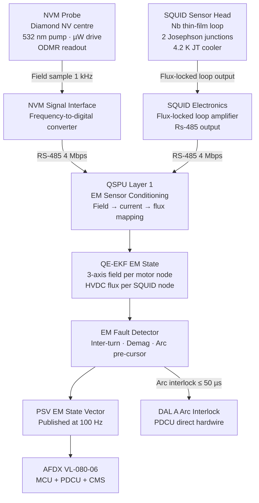

<!-- ──────────────────────────────────────────────────────────────────────────
     QATL-ATLAS-1000-ATLAS-080-089-08-080-030-QUANTUM-MAGNETIC-AND-ELECTROMAGNETIC-SENSING
     ATLAS-080 (Quantum Sensing for Propulsion) · Quantum Magnetic and Electromagnetic Sensing
     programme-defined aircraft type — ATLAS Register 1000
────────────────────────────────────────────────────────────────────────────── -->

# Quantum Magnetic and Electromagnetic Sensing

---

## §0 Hyperlink Policy

> All hyperlinks in this document are **relative** (five directory levels: `../../../../../`).
> Absolute URLs are forbidden. Every linked document must exist in the Q+ATLANTIDE repository
> before the link is activated. Broken links are treated as open issues and must be resolved
> before the document is promoted from `DRAFT` to `APPROVED`.

---

## §1 Purpose

This document defines the agnostic ATLAS standard-level architecture context for `Quantum Magnetic and Electromagnetic Sensing`.

It describes the controlled scope, functions, interfaces, safety considerations, lifecycle traceability, and S1000D/CSDB mapping logic that programme implementations shall instantiate when this node is applicable.

This document is not a programme design baseline. Programme-specific capacities, locations, part numbers, effectivity, operating limits, maintenance references, and data module codes shall be defined only inside the applicable programme implementation branch.
## §2 Applicability

| Applicability Level | Rule |
|---|---|
| Standard taxonomy | Applies to the ATLAS node `080` |
| Programme implementation | Conditional; determined by programme architecture, trade studies, certification basis, and applicability model |
| Product configuration | Defined in the programme-specific configuration baseline |
| Effectivity | Defined in the programme CSDB / applicability layer |
| Non-applicability | Must be explicitly stated in the programme impact-study branch when excluded |
## §3 Functional Description ![DRAFT]

**NV-center magnetometers (NVMs)** exploit the optically detected magnetic resonance (ODMR) of nitrogen-vacancy colour centres in synthetic diamond to measure local magnetic fields with picotesla sensitivity at room temperature, requiring no cryogenic cooling. The NV electron spin ground state (S = 1) exhibits a zero-field splitting of 2.87 GHz, which shifts linearly with applied field (28 MHz/mT). A green pump laser polarises the spin; a microwave sweep detects the resonance frequency shift; the resulting field measurement achieves **1 pT/√Hz sensitivity at 1–100 kHz**, sufficient to resolve the magnetic field signature of individual conductors carrying currents of < 1 A at a standoff distance of 5 mm. Eight NVM probes are installed in the EDZ — two probes per motor/generator unit — enabling non-contact phase current monitoring (±2 % accuracy versus a Rogowski coil reference), demagnetisation detection in PMSM permanent magnets, and inter-turn short detection in stator windings.

**SQUID magnetometers** (Superconducting QUantum Interference Devices) utilise the Josephson quantum interference effect in a niobium thin-film superconducting loop interrupted by two Josephson junctions. The device must be operated below the niobium critical temperature (9.2 K); each SQUID sensor head integrates a miniature Joule-Thomson (JT) cryocooler operating on clean nitrogen gas at 4.2 K equivalent, with an outer vacuum-jacketed housing. The SQUID achieves **5 fT/√Hz flux sensitivity at DC–1 kHz** — approximately 200× more sensitive than NVM — and is deployed in the HV power distribution zone for precision flux monitoring of the HVDC bus harness and power electronics module fault detection. Six SQUID sensor heads are installed at the most safety-critical nodes of the HVDC distribution architecture.

Key EM fault types detected and their physical signatures are: **inter-turn short** — NVM sensitivity resolves 0.5 A per-turn circulating current (field signature ~ 100 pT/turn·A at 5 mm standoff); **demagnetisation** — NVM flux baseline drift > 5 % over 500 operating hours triggers a DAL B warning to the MCU; **HVDC arc-fault pre-cursor** — SQUID detects the high-frequency transient magnetic signature 50 µs before arc initiation, providing a DAL A interlock signal to the Power Distribution Control Unit (PDCU). The 50 µs arc-fault pre-cursor detection capability is a key safety advancement over conventional current transformer (CT) protection schemes, which can only respond post-arc.

Integration with ATLAS 071 (Electric Motor and Drive Systems) and ATLAS 073 (Power Distribution MV-HV) ensures that NVM and SQUID data are fused with motor terminal voltage and PDCU current measurements for comprehensive drive-chain fault diagnosis in the QSPU QE-EKF estimator.

---

## §4 Functional Breakdown

| ID | Name | Description | Lead Division |
|---|---|---|---|
| F-030-01 | NV-Center Magnetometer Probes | Room-temperature diamond NVM; 8 probes (2 per motor/gen); 1 pT/√Hz | Q-GREENTECH |
| F-030-02 | SQUID Sensor Heads | 4.2 K JT-cooled niobium SQUID; 6 heads in HV zone; 5 fT/√Hz | Q-GREENTECH |
| F-030-03 | Inter-turn Short Detection | NVM per-turn circulating current signature (≥ 100 pT per shorted turn) | Q-MECHANICS |
| F-030-04 | Demagnetisation Monitoring | NVM PM flux baseline trend; 500 h drift threshold; DAL B warning | Q-GREENTECH |
| F-030-05 | HVDC Arc-Fault Pre-cursor Detection | SQUID 50 µs transient; DAL A PDCU interlock | Q-GREENTECH |
| F-030-06 | EM Field Mapping (EMC) | SQUID stray-field mapping during certification EM surveys | Q-INDUSTRY |
| F-030-07 | MCU / PDCU Integration | NVM+SQUID EM state vector to MCU (demagnetisation) and PDCU (arc interlock) | Q-HPC |

---

## §5 System Context — Mermaid Diagram

---

## §6 Internal Architecture — Mermaid Diagram

---

## §7 Components and LRUs

| Component | Part Number | Qty | Location | Maintenance Interval | Notes |
|---|---|---|---|---|---|
| NV-Center Magnetometer Probe (NVM) | NVM-PN-TBD | 8 | PMSM stator housing (2 per motor/gen) | A-check zero-field baseline calibration | 1 pT/√Hz; 1–100 kHz; room-temperature; class 3R laser |
| SQUID Sensor Head (SQUID) | SQUID-PN-TBD | 6 | HVDC distribution zone chassis | 2 500 h JT cooler inspection | 5 fT/√Hz; DC–1 kHz; 4.2 K JT cooled; Nb thin-film |
| SQUID JT Cryocooler Assembly | SQUID-JT-PN-TBD | 6 | Integral to SQUID head | 2 500 h gas filter replacement | GN₂ Joule-Thomson; no LHe; 4.2 K tip |
| NVM Signal Interface Module | NVM-SIF-PN-TBD | 2 | EDZ junction box (4 NVM per module) | Replaced with NVM LRU | Freq-to-digital; RS-485 4 Mbps output |
| SQUID Flux-Locked Loop Electronics | SQUID-FLL-PN-TBD | 6 | Integral to SQUID head | Replaced with SQUID LRU | Analog FLL; RS-485 digital output |
| Arc Interlock Relay Module | AIR-PN-TBD | 1 | PDCU chassis | A-check relay test | DAL A hardwire relay; SQUID arc signal → PDCU trip |

---

## §8 Interfaces

| Interface Type | Connected System | Protocol / Medium | Data / Function |
|---|---|---|---|
| QSPU — NVM input | QSPU (ATLAS 080) | RS-485 4 Mbps | NVM 3-axis field samples at 1 kHz; 8 nodes |
| QSPU — SQUID input | QSPU (ATLAS 080) | RS-485 4 Mbps | SQUID flux samples at 1 kHz; 6 nodes |
| Motor Control Unit | MCU — ATLAS 071 | AFDX VL-080-06 | EM field state; demagnetisation trend; inter-turn fault advisory |
| Power Distribution Control | PDCU — ATLAS 073 | AFDX VL-080-06 + DAL A hardwire | Arc pre-cursor interlock (hardwire, ≤ 50 µs); flux monitoring data |
| Central Maintenance | CMS — ATA 45 | AFDX VL-080-01 | Demagnetisation trend; fault history; SQUID JT cooler status |
| ECAM synoptic | ECAM — ATA 31 | AFDX VL-080-02 | EM state indication; arc fault advisory in PROP QSP synoptic |
| Electrical power — NVM | LVDC 28 V bus — ATA 24 | LVDC cable | NVM pump laser and microwave drive power (~3 W per probe) |
| Electrical power — SQUID | LVDC 28 V bus — ATA 24 | LVDC cable | SQUID FLL electronics; JT cooler compressor (~20 W per head) |

---

## §9 Operating Modes

| Mode | Trigger | System State | Actions / Consequences |
|---|---|---|---|
| Normal — Continuous monitoring | Motor/generators energised | All NVM and SQUID nodes active at 1 kHz sampling | EM state vector published at 100 Hz; no faults active |
| Demagnetisation baseline update | Engine ground maintenance (48 h interval) | NVM probes measure PM flux at zero current condition | Baseline flux value stored in QSPU NVM; drift computation resets 500 h timer |
| Inter-turn fault advisory | NVM per-turn field > 100 pT threshold | QSPU raises fault flag on affected motor winding | ECAM amber advisory; MCU notified; maintenance within 200 h |
| Arc pre-cursor interlock | SQUID transient > 50 nT in ≤ 50 µs window | DAL A hardwire relay triggers PDCU arc interlock | HVDC bus section isolated by PDCU in < 1 ms; ECAM red; crew informed |
| SQUID cryo warm-up | JT cooler failure detected | SQUID node(s) transition to warm-up safe state; measurement suspended | QSPU flags affected SQUID offline; arc interlock maintained via remaining SQUID nodes; CMS advisory |
| EMC mapping | Certification survey ground test | All NVM + SQUID nodes in survey mode; GPS-synced timestamps | Stray-field map recorded to CMS for EMC certification evidence |

---

## §10 Performance and Budgets ![DRAFT]

| Parameter | Requirement | Target / Design Value | Status |
|---|---|---|---|
| NVM sensitivity | ≤ 10 pT/√Hz at 1–100 kHz | 1 pT/√Hz | ![TBD] |
| NVM non-contact current accuracy | ≤ ±5 % vs Rogowski coil | ±2 % target | ![TBD] |
| NVM demagnetisation drift threshold | 5 % PM flux over 500 h | 5 % (configurable) | ![TBD] |
| SQUID sensitivity | ≤ 50 fT/√Hz at DC–1 kHz | 5 fT/√Hz | ![TBD] |
| SQUID arc pre-cursor detection latency | ≤ 50 µs | 40 µs target | ![TBD] |
| SQUID operating temperature | 4.2 K ± 0.1 K | 4.2 K | ![TBD] |
| NVM power per probe | ≤ 5 W | 3 W target | ![TBD] |
| SQUID head power (FLL + JT cooler) | ≤ 25 W | 20 W target | ![TBD] |
| SQUID JT cooler MTBF | ≥ 5 000 h | 6 000 h target | ![TBD] |
| NVM MTBF | ≥ 20 000 h | 25 000 h target | ![TBD] |

---

## §11 Safety and Airworthiness Considerations

The SQUID arc-fault pre-cursor interlock is the only element of the QSP system classified at **DAL A** (hazardous failure consequence per CS-25 §25.1309): an undetected HVDC arc event is a hazardous condition. The DAL A interlock is implemented as a hardwire relay path independent of the QSPU software, using a dedicated analog threshold comparator driven directly from the SQUID FLL output. This ensures that the DAL A arc interlock function is not dependent on the QSPU DO-178C DAL B software chain.

The SQUID JT cryocooler uses compressed GN₂ (not liquid helium), eliminating the cryogenic liquid hazard on the aircraft. GN₂ supply is drawn from the ATA 47 Nitrogen Generation System. The NVM diamond probe heads contain no hazardous materials and no moving parts. Both sensor types are fully qualified to DO-160G for the installed environment.

---

## §12 Standards and Regulatory References

| Standard / Regulation | Title | Applicability |
|---|---|---|
| EASA CS-25 Amdt 27+ | Airworthiness Standards — Large Aeroplanes | System airworthiness |
| DO-178C | Software Considerations — DAL B (QSP) / DAL A (arc interlock comparator firmware) | QSPU software; arc interlock |
| DO-254 | Hardware Design Assurance — DAL A (arc interlock relay) / DAL B (QSPU) | Arc interlock relay; QSPU hardware |
| DO-160G | Environmental Conditions for Airborne Equipment | NVM and SQUID environmental qualification |
| IEEE P2995 | Quantum Computing Definitions | Quantum sensor metrics |
| IEC 61000-4-8 | Electromagnetic Compatibility — Power-Frequency Magnetic Fields | NVM immunity to power-line fields |
| SAE ARP4754A | Civil Aircraft System Development Assurance | Architecture development |
| SAE ARP4761 | FMEA/FTA Guidelines | Safety assessment |

---

## §13 Document Cross-References

| Document | Location | Relevance |
|---|---|---|
| 080-000 QSP General | [080-000-Quantum-Sensing-for-Propulsion-General.md](./080-000-Quantum-Sensing-for-Propulsion-General.md) | Apex document |
| 080-010 Quantum Sensor Architecture | [080-010-Quantum-Sensor-Architecture-for-Propulsion.md](./080-010-Quantum-Sensor-Architecture-for-Propulsion.md) | EDZ node placement |
| 080-060 Quantum Sensor Fusion | [080-060-Quantum-Sensor-Fusion-and-Propulsion-State-Estimation.md](./080-060-Quantum-Sensor-Fusion-and-Propulsion-State-Estimation.md) | QE-EKF EM state processing |
| 080-070 Integration with Propulsion Control | [080-070-Quantum-Sensing-Integration-with-Propulsion-Control.md](./080-070-Quantum-Sensing-Integration-with-Propulsion-Control.md) | MCU and PDCU integration |
| ATLAS 071 Electric Motor and Drive Systems | [../../070-079_Propulsion-Eco-Tech-e-Hibrido-Electrica/071_Electric-Motor-and-Drive-Systems/071-000-Electric-Motor-and-Drive-Systems-General.md](../../070-079_Propulsion-Eco-Tech-e-Hibrido-Electrica/071_Electric-Motor-and-Drive-Systems/071-000-Electric-Motor-and-Drive-Systems-General.md) | PMSM motor demagnetisation context |
| ATLAS 073 Power Distribution MV-HV | [../../070-079_Propulsion-Eco-Tech-e-Hibrido-Electrica/073_Power-Distribution-MV-HV/073-000-Power-Distribution-MV-HV-General.md](../../070-079_Propulsion-Eco-Tech-e-Hibrido-Electrica/073_Power-Distribution-MV-HV/073-000-Power-Distribution-MV-HV-General.md) | HVDC arc protection context |

---

## §14 Revision History

| Rev | Date | Author | Description |
|---|---|---|---|
| 0.1 | 2026-05-12 | Q-GREENTECH | Initial DRAFT baseline release |
