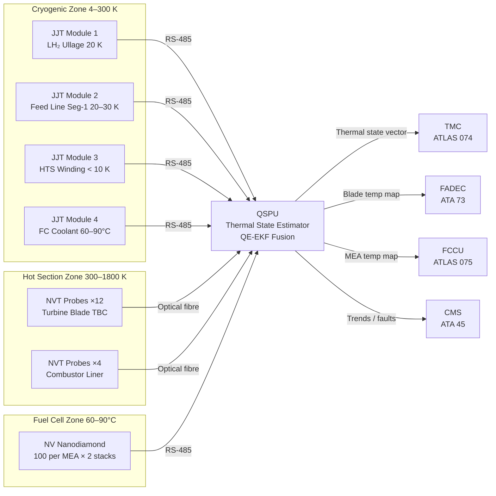
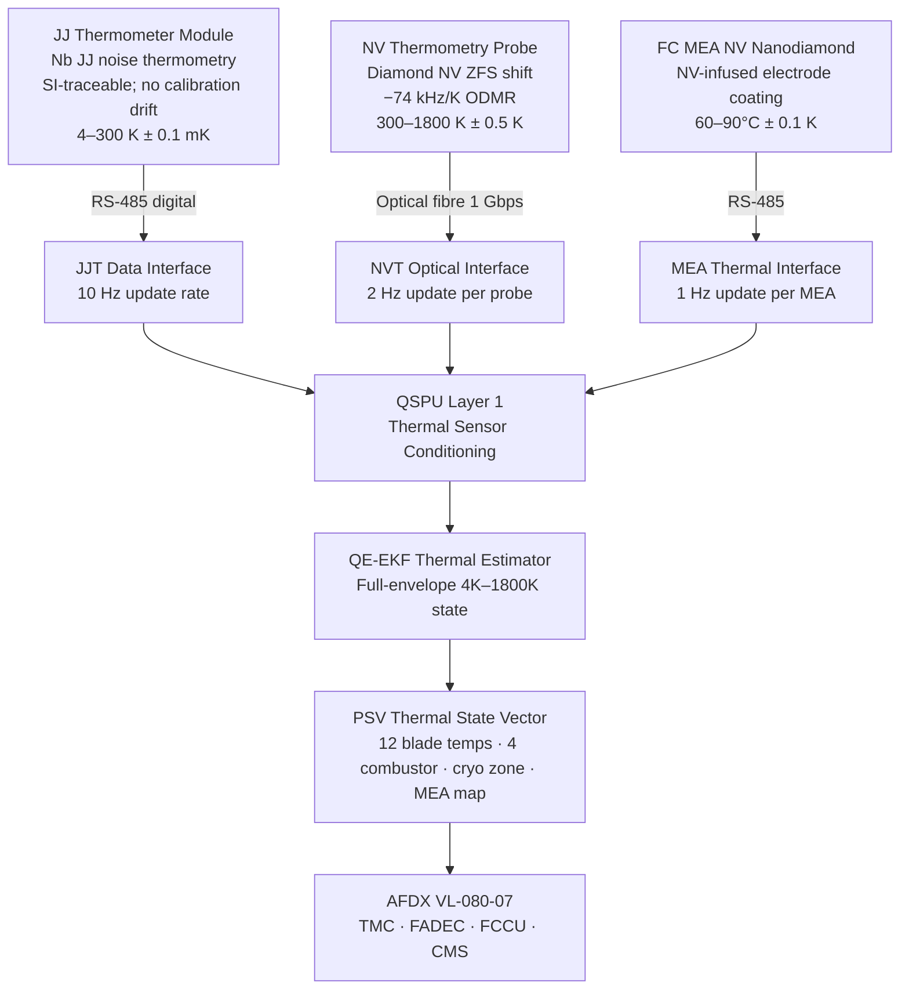

<!-- ──────────────────────────────────────────────────────────────────────────
     QATL-ATLAS-1000-ATLAS-080-089-08-080-040-QUANTUM-THERMAL-AND-CRYOGENIC-SENSING
     ATLAS-080 (Quantum Sensing for Propulsion) · Quantum Thermal and Cryogenic Sensing
     AMPEL360E eWTW — ATLAS Register 1000
────────────────────────────────────────────────────────────────────────────── -->

# Quantum Thermal and Cryogenic Sensing

---

## §0 Hyperlink Policy

> All hyperlinks in this document are **relative** (five directory levels: `../../../../../`).
> Absolute URLs are forbidden. Every linked document must exist in the Q+ATLANTIDE repository
> before the link is activated. Broken links are treated as open issues and must be resolved
> before the document is promoted from `DRAFT` to `APPROVED`.

---

## §1 Purpose

ATLAS subsubject 080-040 covers Josephson Junction (JJ) thermometers and NV-center thermometry systems deployed across the AMPEL360E eWTW propulsion thermal envelope, spanning the full range from 4 K (HTS motor windings and LH₂ cryogenic system) to 1 800 K (turbine hot section and combustion zone). These quantum thermometry technologies provide measurement accuracy 5–50× better than classical thermocouple or pyrometric instruments across their respective ranges, enabling unprecedented turbine blade temperature mapping, cryogenic system safety monitoring, and fuel cell MEA thermal management.

---

## §2 Applicability

| Parameter | Value |
|---|---|
| Aircraft Program | AMPEL360E eWTW |
| ATA reference | ATLAS-080 (Quantum Sensing for Propulsion) — 080-040 Quantum Thermal and Cryogenic Sensing |
| Certification basis | EASA CS-25 Amdt 27+; DO-178C DAL B; DO-254 DAL B; IEEE P2995 |
| S1000D SNS | 080-040-00 |

---

## §3 Functional Description ![DRAFT]

**Josephson Junction (JJ) thermometers** operate on the principle of Johnson-Nyquist noise thermometry: the spectral density of thermal voltage noise across a resistor is directly proportional to absolute temperature, with the proportionality constant involving only fundamental physical constants (Boltzmann constant k_B, resistance R). In the JJ implementation, the noise is measured relative to the precisely known Josephson voltage standard (Josephson constant K_J = 2e/h), providing temperature measurements traceable to the SI Kelvin definition without calibration against a reference thermometer. The range is 4–300 K with accuracy **±0.1 mK** — approximately 500× better than a Pt-100 RTD in this range. Four JJ thermometer modules are installed: two in the LH₂ feed zone (monitoring ullage gas temperature at 20 K and feed line Seg-1 at 20–30 K), one in the cryo motor winding zone (monitoring HTS winding temperature < 10 K), and one monitoring the FC coolant return loop (60–90 °C with mK accuracy for efficiency optimisation). Elimination of unreliable platinum resistance wire in LH₂ zones simplifies ATEX compliance significantly.

**NV-center thermometry (high-temperature regime)** utilises the temperature dependence of the zero-field splitting (ZFS) of the NV ground-state spin triplet. The ZFS parameter D decreases with temperature at a rate of approximately **−74 kHz/K** in the range 300–1 000 K, and this rate is measurable to < 1 kHz by ODMR spectroscopy, yielding sub-kelvin temperature resolution. At temperatures 1 000–1 800 K (turbine hot section), the NV-center thermometry is supplemented by the temperature dependence of the NV photoluminescence intensity. Twelve NV thermometry probes are installed: eight per engine embedded in the Thermal Barrier Coating (TBC) of the turbine blade leading edges (four on N1-stage turbine blades, four on N2-stage), providing spatial temperature mapping with 0.5 K resolution and 0.5 s update rate. An additional four NV probes monitor the combustor liner surface, providing a 2D surface temperature map at the combustion zone boundary wall for hot-spot detection. For the PEMFC system, 100 NV nanodiamond sensors are distributed across each Membrane Electrode Assembly (MEA) surface — delivered as a nanodiamond-infused electrode coating — providing 0.1 K resolution temperature mapping at 60–90 °C, enabling detection of membrane hot-spots that precede degradation.

The JJT and NVT data streams are fused in the QSPU QE-EKF thermal state estimator, producing a unified propulsion thermal state vector covering the full 4 K–1 800 K envelope. This thermal state feeds the Thermal Management Controller (TMC, ATLAS 074), FADEC turbine blade thermal management functions (ATA 73), and the FCCU MEA thermal protection (ATLAS 075).

---

## §4 Functional Breakdown

| ID | Name | Description | Lead Division |
|---|---|---|---|
| F-040-01 | JJ Thermometer — LH₂ Feed Zone | 2× JJT modules; LH₂ ullage (20 K) and feed line Seg-1 (20–30 K) | Q-GREENTECH |
| F-040-02 | JJ Thermometer — Cryo Motor Winding | 1× JJT module; HTS winding zone < 10 K; quench pre-detection | Q-GREENTECH |
| F-040-03 | JJ Thermometer — FC Coolant Loop | 1× JJT module; FC coolant return 60–90 °C; mK accuracy | Q-GREENTECH |
| F-040-04 | NV Thermometry — Turbine Blade TBC | 12× NVT probes; turbine blade leading edge; 300–1 800 K; 0.5 K | Q-AIR |
| F-040-05 | NV Thermometry — Combustor Liner | 4× NVT probes; combustor surface; hot-spot detection | Q-AIR |
| F-040-06 | NV Nanodiamond — FC MEA | 100 NV nanodiamond per MEA; 0.1 K at 60–90 °C; hot-spot map | Q-GREENTECH |
| F-040-07 | Thermal State Estimator (in QSPU) | QE-EKF fusion of JJT + NVT data; full-envelope thermal state vector | Q-HPC |
| F-040-08 | Integration with TMC / FADEC / FCCU | Thermal state to TMC, FADEC EHM, and FCCU MEA protection | Q-HPC |

---

## §5 System Context — Mermaid Diagram

---

## §6 Internal Architecture — Mermaid Diagram

---

## §7 Components and LRUs

| Component | Part Number | Qty | Location | Maintenance Interval | Notes |
|---|---|---|---|---|---|
| Josephson Junction Thermometer Module (JJT) | JJT-PN-TBD | 4 | LH₂ feed zone (×2); cryo winding zone (×1); FC coolant (×1) | 5 000 h calibration verification (SI-traceable, no drift expected) | 4–300 K; ±0.1 mK; Nb JJ element; no moving parts |
| NV Thermometry Probe — Hot Section (NVT) | NVT-PN-TBD | 12 | Turbine blade TBC (8×); combustor liner (4×) | C-check optical alignment and power check | 300–1 800 K; ±0.5 K; diamond NV in ceramic carrier |
| NV Nanodiamond MEA Electrode Coating (MEA-NVT) | MEA-NVT-PN-TBD | 2 (sets) | FC stack A MEA; FC stack B MEA | Replaced with MEA LRU | 100 NV per MEA; integrated into electrode substrate |
| NVT Optical Fibre Feed-Through | NVT-OFA-PN-TBD | 12 | Combustor/turbine zone wall penetration | On-condition; B-check seal check | High-temperature ceramic ferrule; 1 550 nm SM fibre |
| JJT Signal Processing Card | JJT-SPC-PN-TBD | 2 | QSPU chassis (2 JJT per card) | Replaced with QSPU LRU | Noise thermometry ADC; 24-bit; digital filtering |
| NVT ODMR Excitation/Readout Module | NVT-ORM-PN-TBD | 2 | Nacelle junction box (one per engine) | C-check laser power verification | 532 nm + 637 nm; µW drive; FPGA readout |

---

## §8 Interfaces

| Interface Type | Connected System | Protocol / Medium | Data / Function |
|---|---|---|---|
| QSPU — JJT input | QSPU (ATLAS 080) | RS-485 4 Mbps | JJT temperature samples at 10 Hz; 4 nodes |
| QSPU — NVT input | QSPU (ATLAS 080) | Optical fibre 1 Gbps | NVT ODMR spectra at 2 Hz per probe; 12 probes |
| QSPU — MEA NVT input | QSPU (ATLAS 080) | RS-485 4 Mbps | MEA temperature map at 1 Hz; 2 FC stacks |
| Thermal Management Controller | TMC — ATLAS 074 | AFDX VL-080-07 | Full-envelope thermal state; cryo + hot section |
| FADEC EHM | FADEC — ATA 73 | AFDX VL-080-03 | Turbine blade temperature map; combustor hot-spot data |
| Fuel Cell Control | FCCU — ATLAS 075 | AFDX VL-080-04 | MEA temperature map; hot-spot alarm; FC efficiency data |
| H₂ Distribution | HDCMU — ATLAS 077 | AFDX VL-080-05 | JJT cryogenic state; LH₂ feed-line temperatures |
| Central Maintenance | CMS — ATA 45 | AFDX VL-080-01 | JJT/NVT trends; BITE faults; blade thermal history |

---

## §9 Operating Modes

| Mode | Trigger | System State | Actions / Consequences |
|---|---|---|---|
| Normal — Full thermal monitoring | All JJT and NVT nodes healthy | Continuous JJT + NVT + MEA-NVT acquisition; thermal state vector published | Full 4 K–1 800 K coverage; TMC, FADEC, FCCU receive thermal state |
| Cryo warm-up detection | JJT cryo node reads > 30 K (LH₂ zone) | QSPU raises cryogenic over-temperature flag | HDCMU notified; FCCU advised of possible H₂ supply interruption; CMS advisory |
| HTS quench pre-warning | JJT cryo winding node reads > 12 K | QSPU raises HTS quench pre-warning flag | MCU executes controlled motor current reduction; TMC activates cryo-cooling boost |
| Turbine blade hot-spot | NVT blade probe reads > T_limit (fuel-type dependent, set in QSPU) | QSPU raises blade hot-spot advisory | FADEC EHM throttle back cycle; CMS trend log update |
| MEA hot-spot | MEA-NVT reads > 95 °C at any node | QSPU raises MEA hot-spot warning to FCCU | FCCU reduces stack load; TMC increases coolant flow |
| NVT probe degraded | NVT probe ODMR contrast < 10 % threshold | QSPU flags probe offline; thermal state estimated from remaining probes | CMS advisory; next C-check replacement scheduled; partial blade thermal coverage |

---

## §10 Performance and Budgets ![DRAFT]

| Parameter | Requirement | Target / Design Value | Status |
|---|---|---|---|
| JJT accuracy (4–300 K) | ≤ ±0.5 mK | ±0.1 mK | ![TBD] |
| JJT calibration interval | ≥ 5 000 h (SI-traceable, no drift) | 5 000 h | ![TBD] |
| NVT accuracy (300–1 800 K) | ≤ ±2 K | ±0.5 K | ![TBD] |
| NVT blade probe spatial resolution | ≤ 5 mm per probe footprint | 3 mm | ![TBD] |
| NVT ODMR update rate per probe | ≥ 1 Hz | 2 Hz | ![TBD] |
| MEA-NVT accuracy (60–90 °C) | ≤ ±0.5 K | ±0.1 K | ![TBD] |
| MEA-NVT node density | ≥ 50 nodes per MEA | 100 nodes per MEA | ![TBD] |
| JJT power per module | ≤ 5 W | 3 W target | ![TBD] |
| NVT probe power per probe | ≤ 2 W | 1.5 W target | ![TBD] |
| Thermal state latency to FADEC | ≤ 500 ms | 200 ms target | ![TBD] |
| JJT MTBF | ≥ 20 000 h | 25 000 h target | ![TBD] |
| NVT probe MTBF | ≥ 10 000 h | 12 000 h target | ![TBD] |

---

## §11 Safety and Airworthiness Considerations

JJ thermometers in the LH₂ feed zone allow elimination of the platinum resistance wire thermocouple (Pt-100) instrumentation traditionally used in cryogenic fuel lines. Pt-100 wiring in LH₂ zones presents a potential ignition risk (ATEX Group IIC, T4) and requires extensive wiring qualification for the cryogenic environment. The JJT module, with its hermetically sealed Josephson element and fibre-optic readout option, simplifies ATEX compliance and eliminates the metallic wiring vulnerability in the LH₂ zone. The HTS winding quench pre-warning function (JJT, cryo winding zone) provides the MCU with a minimum 500 ms advance warning of an impending superconducting quench, allowing controlled current reduction before the quench energy is deposited as heat, preventing motor winding damage.

NV thermometry probes in the turbine TBC provide 5× higher spatial resolution than the best single-point pyrometry currently deployed in turbine blades, enabling detection of localised hot-spots < 1 cm² area that are precursors to TBC spallation and blade oxidation. The probes are embedded in the outer layer of the TBC and do not penetrate the structural blade substrate.

---

## §12 Standards and Regulatory References

| Standard / Regulation | Title | Applicability |
|---|---|---|
| EASA CS-25 Amdt 27+ | Airworthiness Standards — Large Aeroplanes | System airworthiness |
| EASA CSH-2 | Certification Specifications — Hydrogen | Cryogenic zone instrumentation |
| DO-178C | Software Considerations — DAL B | QSPU thermal estimator software |
| DO-160G | Environmental Conditions for Airborne Equipment | JJT and NVT environmental qualification |
| IEC 60079-10-1 | Explosive Atmospheres — Zone Classification | LH₂ zone ATEX instrumentation |
| IEEE P2995 | Quantum Computing Definitions | Quantum thermometry metrics |
| BIPM MISE EN PRATIQUE for Kelvin | SI unit realization for temperature | JJ noise thermometry SI traceability |
| SAE ARP4761 | FMEA/FTA Guidelines | Safety assessment |

---

## §13 Document Cross-References

| Document | Location | Relevance |
|---|---|---|
| 080-000 QSP General | [080-000-Quantum-Sensing-for-Propulsion-General.md](./080-000-Quantum-Sensing-for-Propulsion-General.md) | Apex document |
| 080-010 Quantum Sensor Architecture | [080-010-Quantum-Sensor-Architecture-for-Propulsion.md](./080-010-Quantum-Sensor-Architecture-for-Propulsion.md) | HZ and CZ node placement |
| 080-060 Quantum Sensor Fusion | [080-060-Quantum-Sensor-Fusion-and-Propulsion-State-Estimation.md](./080-060-Quantum-Sensor-Fusion-and-Propulsion-State-Estimation.md) | QE-EKF thermal state processing |
| 080-070 Integration with Propulsion Control | [080-070-Quantum-Sensing-Integration-with-Propulsion-Control.md](./080-070-Quantum-Sensing-Integration-with-Propulsion-Control.md) | TMC / FADEC / FCCU integration |
| ATLAS 074 Thermal Management | [../../070-079_Propulsion-Eco-Tech-e-Hibrido-Electrica/074_Thermal-Management-Hybrid/074-000-Thermal-Management-Hybrid-General.md](../../070-079_Propulsion-Eco-Tech-e-Hibrido-Electrica/074_Thermal-Management-Hybrid/074-000-Thermal-Management-Hybrid-General.md) | Thermal management consumer of JJT/NVT data |
| ATLAS 075 Fuel Cell Integration | [../../070-079_Propulsion-Eco-Tech-e-Hibrido-Electrica/075_Fuel-Cell-Integration/075-000-Fuel-Cell-Integration-General.md](../../070-079_Propulsion-Eco-Tech-e-Hibrido-Electrica/075_Fuel-Cell-Integration/075-000-Fuel-Cell-Integration-General.md) | MEA thermal monitoring |
| ATLAS 076 H₂ Storage | [../../070-079_Propulsion-Eco-Tech-e-Hibrido-Electrica/076_Hydrogen-Fuel-Storage-Onboard/076-000-Hydrogen-Fuel-Storage-Onboard-General.md](../../070-079_Propulsion-Eco-Tech-e-Hibrido-Electrica/076_Hydrogen-Fuel-Storage-Onboard/076-000-Hydrogen-Fuel-Storage-Onboard-General.md) | LH₂ tank thermal context |
| ATLAS 077 H₂ Distribution | [../../070-079_Propulsion-Eco-Tech-e-Hibrido-Electrica/077_Hydrogen-Distribution-and-Conditioning/077-000-Hydrogen-Distribution-and-Conditioning-General.md](../../070-079_Propulsion-Eco-Tech-e-Hibrido-Electrica/077_Hydrogen-Distribution-and-Conditioning/077-000-Hydrogen-Distribution-and-Conditioning-General.md) | LH₂ feed-line thermal monitoring |

---

## §14 Revision History

| Rev | Date | Author | Description |
|---|---|---|---|
| 0.1 | 2026-05-12 | Q-GREENTECH | Initial DRAFT baseline release |
