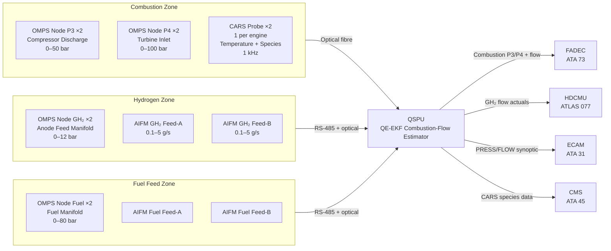
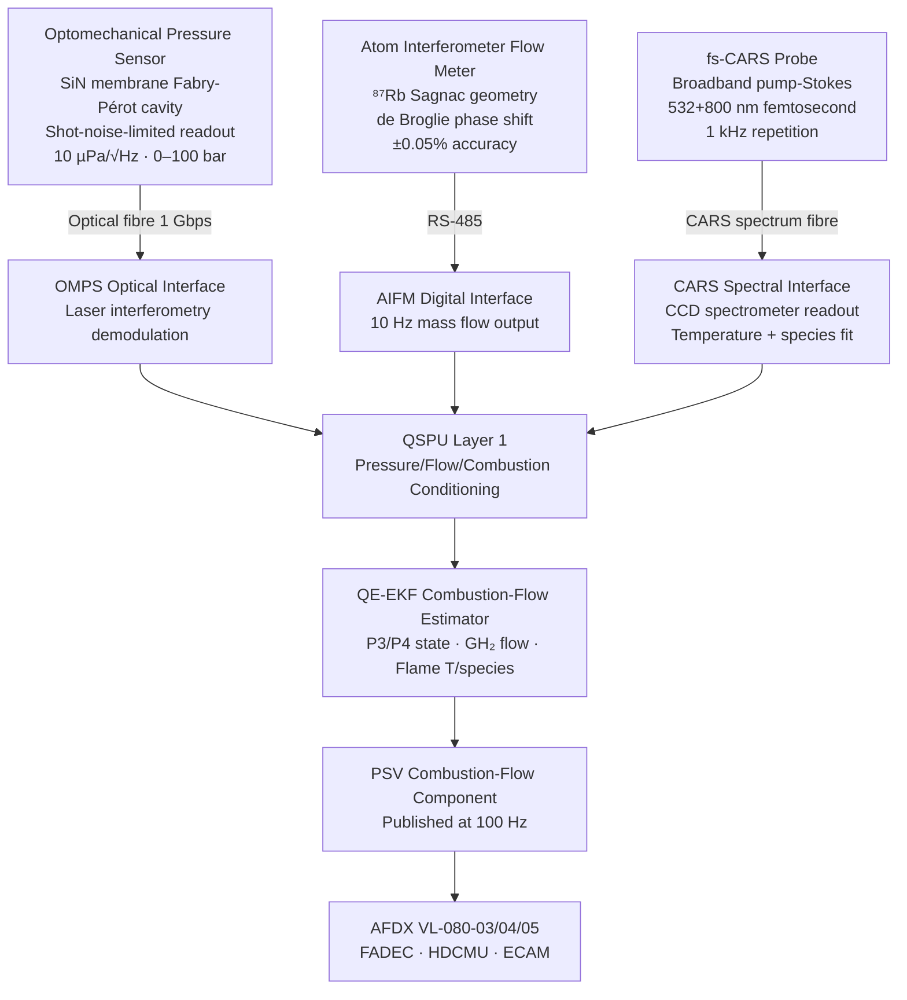

<!-- ──────────────────────────────────────────────────────────────────────────
     QATL-ATLAS-1000-ATLAS-080-089-08-080-050-QUANTUM-PRESSURE-FLOW-AND-COMBUSTION-SENSING
     ATLAS-080 (Quantum Sensing for Propulsion) · Quantum Pressure, Flow and Combustion Sensing
     programme-defined aircraft type — ATLAS Register 1000
────────────────────────────────────────────────────────────────────────────── -->

# Quantum Pressure, Flow and Combustion Sensing

---

## §0 Hyperlink Policy

> All hyperlinks in this document are **relative** (five directory levels: `../../../../../`).
> Absolute URLs are forbidden. Every linked document must exist in the Q+ATLANTIDE repository
> before the link is activated. Broken links are treated as open issues and must be resolved
> before the document is promoted from `DRAFT` to `APPROVED`.

---

## §1 Purpose

This document defines the agnostic ATLAS standard-level architecture context for `Quantum Pressure, Flow and Combustion Sensing`.

It describes the controlled scope, functions, interfaces, safety considerations, lifecycle traceability, and S1000D/CSDB mapping logic that programme implementations shall instantiate when this node is applicable.

This document is not a programme design baseline. Programme-specific capacities, locations, part numbers, effectivity, operating limits, maintenance references, and data module codes shall be defined only inside the applicable programme implementation branch.
## §2 Applicability

| Applicability Level | Rule |
|---|---|
| Standard taxonomy | Applies to the ATLAS node `080` |
| Programme implementation | Conditional; determined by programme architecture, trade studies, certification basis, and applicability model |
| Product configuration | Defined in the programme-specific configuration baseline |
| Effectivity | Defined in the programme CSDB / applicability layer |
| Non-applicability | Must be explicitly stated in the programme impact-study branch when excluded |
## §3 Functional Description ![DRAFT]

**Optomechanical quantum pressure sensors** employ a silicon nitride (SiN) membrane suspended within a Fabry–Pérot optical resonator cavity. Applied pressure displaces the membrane, shifting the optical resonance frequency of the cavity. This frequency shift is measured with shot-noise-limited laser interferometry, achieving a pressure sensitivity of **10 µPa/√Hz at 1 Hz–10 kHz** — approximately 100× better than commercial piezoresistive pressure transducers. The range spans 0–100 bar with no mechanical hysteresis and no electrostatic drift, eliminating the zero-point drift and calibration degradation that affect piezoresistive sensors under thermal cycling. Eight optomechanical pressure sensor nodes are deployed: two at the combustion chamber P3 station (compressor discharge), two at P4 (turbine inlet), two at the GH₂ anode feed manifold (0–12 bar), and two at the conventional fuel manifold (0–80 bar). The calibration interval is 4× longer than equivalent piezoresistive transducers.

**Atom interferometer flow meters (AIFM)** exploit the quantum de Broglie phase shift of laser-cooled atoms guided through the flowing fluid channel in a Sagnac interferometer geometry. The fluid mass flow rate imparts a Sagnac phase shift to the atom wavefunction proportional to the fluid angular momentum, providing a **pure quantum mass flow measurement** with accuracy **±0.05 % of reading** at GH₂ flows of 0.1–5 g/s — insensitive to fluid composition, temperature, and pressure variations that affect classical Coriolis meters. Four AIFM nodes are deployed: one on GH₂ feed line A (ATLAS 077), one on GH₂ feed line B (ATLAS 077), one on conventional fuel feed line A (ATA 73), and one on conventional fuel feed line B (ATA 73). The AIFM replaces the classical Coriolis meter for GH₂ lines (Coriolis meters are unreliable at GH₂ densities due to low fluid density coupling) while providing a quantum-accuracy cross-check on the conventional fuel lines.

**Femtosecond-CARS (Coherent Anti-Raman Stokes) combustion diagnostics** use a broadband femtosecond pump–Stokes laser pulse pair and a narrowband probe pulse, delivered through a fibre-optic probe inserted at the combustor liner window. The CARS signal spectrum encodes simultaneous temperature and multi-species concentration (CH₄, H₂, H₂O, CO, CO₂, NOₓ) with **temperature accuracy ±0.5 K and species concentration resolution 10 ppm**, at a **1 kHz repetition rate**. This enables real-time measurement of the combustion stoichiometry and flame temperature at the precise operating point, allowing FADEC to optimise the SAF/H₂ fuel blend ratio for minimum NOₓ formation and maximum combustion efficiency on a cycle-by-cycle basis.

The optomechanical pressure, AIFM flow, and CARS combustion data streams are conditioned in the QSPU Layer 1 and fed to the QE-EKF estimator, producing a unified combustion-and-flow state vector. The FADEC uses this for inner-loop combustion pressure control, the HDCMU uses GH₂ flow actuals for distribution management, and the ECAM PROP QSP synoptic displays a PRESS/FLOW page.

---

## §4 Functional Breakdown

| ID | Name | Description | Lead Division |
|---|---|---|---|
| F-050-01 | Optomechanical Pressure — Combustion | 4× OMPS nodes at P3/P4 stations; combustion pressure; 10 µPa/√Hz | Q-AIR |
| F-050-02 | Optomechanical Pressure — H₂/Fuel Lines | 4× OMPS nodes at GH₂ anode and fuel manifold; 0–12 bar and 0–80 bar | Q-GREENTECH |
| F-050-03 | Atom IF Flow Meter — GH₂ Feed | 2× AIFM nodes on GH₂ feed A/B; ±0.05 % accuracy; 0.1–5 g/s | Q-GREENTECH |
| F-050-04 | Atom IF Flow Meter — Fuel Feed | 2× AIFM nodes on conventional fuel feed A/B; cross-check with Coriolis | Q-AIR |
| F-050-05 | Femtosecond-CARS Combustion Diagnostics | 1× CARS probe per engine; temperature ±0.5 K; species at 1 kHz | Q-AIR |
| F-050-06 | Combustion-and-Flow State Estimator (QSPU) | QE-EKF fusion of OMPS + AIFM + CARS data; PSV combustion component | Q-HPC |
| F-050-07 | FADEC / HDCMU / ECAM Integration | PSV combustion state to FADEC inner loop; HDCMU GH₂ control; ECAM PRESS/FLOW | Q-HPC |

---

## §5 System Context — Mermaid Diagram

---

## §6 Internal Architecture — Mermaid Diagram

---

## §7 Components and LRUs

| Component | Part Number | Qty | Location | Maintenance Interval | Notes |
|---|---|---|---|---|---|
| Optomechanical Pressure Sensor Node (OMPS) | OMPS-PN-TBD | 8 | Combustion P3/P4 (×4); GH₂ anode (×2); fuel manifold (×2) | 2 500 h cavity finesse check; no zero-point calibration | SiN membrane; 10 µPa/√Hz; 0–100 bar; no hysteresis |
| Atom Interferometer Flow Meter Node (AIFM) | AIFM-PN-TBD | 4 | GH₂ feed A/B (×2); conventional fuel feed A/B (×2) | 2 500 h atom source check; 5 000 h vacuum cell | ⁸⁷Rb Sagnac; ±0.05 % accuracy; 0.1–5 g/s GH₂ |
| fs-CARS Combustion Diagnostic Probe | CARS-PN-TBD | 2 | Combustor liner window (one per engine) | C-check fibre alignment; laser power verification | Broadband fs pump-Stokes + narrowband probe; 1 kHz rep rate |
| CARS Laser Unit | CARS-LU-PN-TBD | 2 | Nacelle EE bay (one per engine) | C-check laser output power | Ti:Sa fs oscillator + OPA; class 4 laser in closed enclosure |
| CARS Spectrometer Unit | CARS-SU-PN-TBD | 2 | Nacelle EE bay (one per engine) | C-check CCD dark current | CCD spectrometer; 532–900 nm range; 0.1 nm resolution |
| OMPS Optical Interface Module | OMPS-OIM-PN-TBD | 1 | QSPU chassis | Replaced with QSPU LRU | 8-channel OMPS laser demodulation; shot-noise-limited |
| AIFM Signal Processing Card | AIFM-SPC-PN-TBD | 1 | QSPU chassis | Replaced with QSPU LRU | 4-channel AIFM; RS-485 interface |

---

## §8 Interfaces

| Interface Type | Connected System | Protocol / Medium | Data / Function |
|---|---|---|---|
| QSPU — OMPS input | QSPU (ATLAS 080) | Optical fibre 1 Gbps | 8-channel pressure at 1 kHz; shot-noise-limited readout |
| QSPU — AIFM input | QSPU (ATLAS 080) | RS-485 4 Mbps | 4-channel mass flow at 10 Hz |
| QSPU — CARS input | QSPU (ATLAS 080) | Optical fibre 10 Gbps | CARS spectrum at 1 kHz; temperature + species data |
| FADEC inner loop | FADEC — ATA 73 | AFDX VL-080-03 | Combustion P3/P4 quantum-augmented; flame temperature; fuel flow |
| H₂ Distribution | HDCMU — ATLAS 077 | AFDX VL-080-05 | GH₂ flow actuals (AIFM A/B); GH₂ pressure (OMPS) |
| Fuel Cell Control | FCCU — ATLAS 075 | AFDX VL-080-04 | GH₂ anode feed pressure; AIFM H₂ flow to FCCU efficiency loop |
| ECAM PRESS/FLOW synoptic | ECAM — ATA 31 | AFDX VL-080-02 | OMPS P3/P4 displays; GH₂ flow bar graphs; combustion temperature indicator |
| Central Maintenance | CMS — ATA 45 | AFDX VL-080-01 | CARS species history (NOₓ trend); OMPS calibration records; AIFM BITE |

---

## §9 Operating Modes

| Mode | Trigger | System State | Actions / Consequences |
|---|---|---|---|
| Normal — Combustion acquisition | Engine running (N1 ≥ 20 %) | OMPS, AIFM, CARS all active; PSV combustion-flow published at 100 Hz | FADEC uses quantum P3/P4 and flame temperature; HDCMU uses AIFM GH₂ actuals |
| SAF/H₂ blend optimisation | FADEC blend control loop active | CARS species data fed to FADEC blend algorithm at 1 kHz | NOₓ minimisation and combustion efficiency loop closed via CARS feedback |
| GH₂ flow cross-check | HDCMU requests AIFM vs. Coriolis compare | AIFM output compared against Coriolis meter reading in QSPU | Discrepancy > 0.5 % triggers CMS advisory; GH₂ leak suspected if AIFM < Coriolis |
| High-pressure combustion transient | P3/P4 OMPS spike > 10 % in < 100 ms | QSPU detects combustion instability signature | FADEC combustion damping algorithm activated; ECAM advisory |
| CARS probe degraded | CARS spectrum contrast < threshold | QSPU flags CARS offline; combustion state estimated from P3/P4 OMPS only | CMS advisory; FADEC falls back to P3/P4-only combustion model; scheduled C-check |
| Fuel manifold overpressure | OMPS fuel manifold > 82 bar | QSPU raises overpressure warning | FADEC isolates affected fuel feed line; ECAM red advisory |

---

## §10 Performance and Budgets ![DRAFT]

| Parameter | Requirement | Target / Design Value | Status |
|---|---|---|---|
| OMPS pressure sensitivity | ≤ 100 µPa/√Hz | 10 µPa/√Hz | ![TBD] |
| OMPS pressure range | 0–100 bar | 0–100 bar | ![TBD] |
| OMPS hysteresis | ≤ 0.01 % FS | < 0.001 % FS (none expected) | ![TBD] |
| OMPS calibration interval | ≥ 2 500 h | 2 500 h (extended from 500 h classical) | ![TBD] |
| AIFM accuracy | ≤ ±0.1 % of reading | ±0.05 % | ![TBD] |
| AIFM GH₂ flow range | 0.1–5 g/s | 0.05–6 g/s target | ![TBD] |
| CARS temperature accuracy | ≤ ±2 K | ±0.5 K | ![TBD] |
| CARS species resolution | ≤ 50 ppm | 10 ppm | ![TBD] |
| CARS repetition rate | ≥ 500 Hz | 1 kHz | ![TBD] |
| OMPS node power | ≤ 5 W | 3 W target | ![TBD] |
| AIFM node power | ≤ 25 W | 20 W target | ![TBD] |
| CARS laser unit power | ≤ 100 W per engine | 80 W target | ![TBD] |

---

## §11 Safety and Airworthiness Considerations

The CARS laser units (class 4, Ti:Sapphire femtosecond oscillator) are fully enclosed in the nacelle EE bay with interlocked access doors; no accessible laser aperture exists during normal installed operation or engine running. The laser interlock system de-energises the laser within 50 ms of enclosure door opening. The CARS fibre-optic probe at the combustor liner window is a passive waveguide (no power) in the installed engine direction; the high-energy femtosecond pulses travel from the EE bay to the probe at the combustor, and the CARS signal travels back, both via fibre — no free-beam laser in the nacelle during operation.

Optomechanical pressure sensors are passive optical devices with no electrical elements in the pressure-wetted cavity, eliminating ignition risk in the combustion pressure measurement zone. The SiN membrane and Fabry–Pérot cavity are rated to 120 bar proof pressure (1.2× max range) per DO-160G. AIFM atom interferometer nodes in the GH₂ zone use the same vacuum cell and Rb atom design as the AI-IMU units, with the same ATEX-compatible hermetically sealed design.

---

## §12 Standards and Regulatory References

| Standard / Regulation | Title | Applicability |
|---|---|---|
| EASA CS-25 Amdt 27+ | Airworthiness Standards — Large Aeroplanes | System airworthiness |
| EASA CSH-2 | Certification Specifications — Hydrogen | GH₂ zone instrumentation |
| DO-178C | Software Considerations — DAL B | QSPU combustion/flow estimator software |
| DO-160G | Environmental Conditions for Airborne Equipment | OMPS, AIFM, CARS environmental qualification |
| IEC 60825-1 | Safety of Laser Products | CARS laser system |
| IEEE P2995 | Quantum Computing Definitions | Quantum sensing metrics |
| SAE ARP4761 | FMEA/FTA Guidelines | Safety assessment |
| NFPA 2 | Hydrogen Technologies Code | GH₂ zone instrumentation and safety |

---

## §13 Document Cross-References

| Document | Location | Relevance |
|---|---|---|
| 080-000 QSP General | [080-000-Quantum-Sensing-for-Propulsion-General.md](./080-000-Quantum-Sensing-for-Propulsion-General.md) | Apex document |
| 080-010 Quantum Sensor Architecture | [080-010-Quantum-Sensor-Architecture-for-Propulsion.md](./080-010-Quantum-Sensor-Architecture-for-Propulsion.md) | CZ and HZ node placement |
| 080-060 Quantum Sensor Fusion | [080-060-Quantum-Sensor-Fusion-and-Propulsion-State-Estimation.md](./080-060-Quantum-Sensor-Fusion-and-Propulsion-State-Estimation.md) | QE-EKF combustion-flow processing |
| 080-070 Integration with Propulsion Control | [080-070-Quantum-Sensing-Integration-with-Propulsion-Control.md](./080-070-Quantum-Sensing-Integration-with-Propulsion-Control.md) | FADEC / HDCMU integration |
| ATLAS 077 H₂ Distribution | [../../070-079_Propulsion-Eco-Tech-e-Hibrido-Electrica/077_Hydrogen-Distribution-and-Conditioning/077-000-Hydrogen-Distribution-and-Conditioning-General.md](../../070-079_Propulsion-Eco-Tech-e-Hibrido-Electrica/077_Hydrogen-Distribution-and-Conditioning/077-000-Hydrogen-Distribution-and-Conditioning-General.md) | GH₂ flow metering context |
| ATLAS 075 Fuel Cell Integration | [../../070-079_Propulsion-Eco-Tech-e-Hibrido-Electrica/075_Fuel-Cell-Integration/075-000-Fuel-Cell-Integration-General.md](../../070-079_Propulsion-Eco-Tech-e-Hibrido-Electrica/075_Fuel-Cell-Integration/075-000-Fuel-Cell-Integration-General.md) | GH₂ anode pressure interface |

---

## §14 Revision History

| Rev | Date | Author | Description |
|---|---|---|---|
| 0.1 | 2026-05-12 | Q-AIR | Initial DRAFT baseline release |
