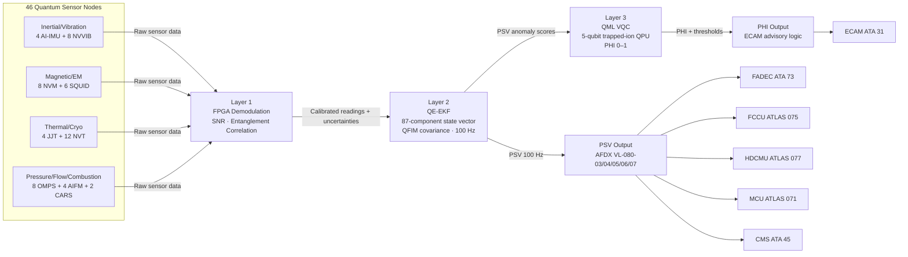
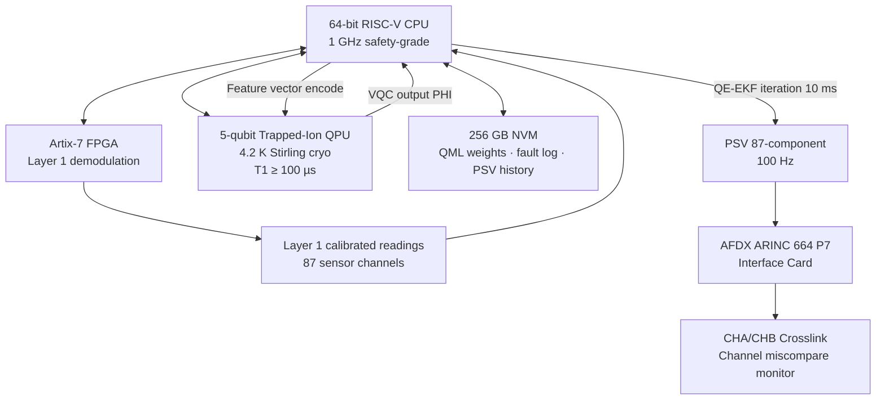

<!-- ──────────────────────────────────────────────────────────────────────────
     QATL-ATLAS-1000-ATLAS-080-089-08-080-060-QUANTUM-SENSOR-FUSION-AND-PROPULSION-STATE-ESTIMATION
     ATLAS-080 (Quantum Sensing for Propulsion) · Quantum Sensor Fusion and Propulsion State Estimation
     AMPEL360E eWTW — ATLAS Register 1000
────────────────────────────────────────────────────────────────────────────── -->

# Quantum Sensor Fusion and Propulsion State Estimation

---

## §0 Hyperlink Policy

> All hyperlinks in this document are **relative** (five directory levels: `../../../../../`).
> Absolute URLs are forbidden. Every linked document must exist in the Q+ATLANTIDE repository
> before the link is activated. Broken links are treated as open issues and must be resolved
> before the document is promoted from `DRAFT` to `APPROVED`.

---

## §1 Purpose

ATLAS subsubject 080-060 defines the multi-layer quantum sensor fusion algorithm executed by the QSPU, combining data from all 46 quantum sensor nodes across the four sensor families into a unified **Propulsion State Vector (PSV)** and a scalar **Propulsion Health Index (PHI)**. This document specifies the three processing layers — raw sensor conditioning, Quantum-Enhanced Extended Kalman Filter (QE-EKF) state estimation, and Quantum Machine Learning (QML) health index computation — and their outputs, latency targets, and PHI threshold logic.

---

## §2 Applicability

| Parameter | Value |
|---|---|
| Aircraft Program | AMPEL360E eWTW |
| ATA reference | ATLAS-080 (Quantum Sensing for Propulsion) — 080-060 Quantum Sensor Fusion and State Estimation |
| Certification basis | EASA CS-25 Amdt 27+; DO-178C DAL B; DO-254 DAL B; IEEE P2995 |
| S1000D SNS | 080-060-00 |

---

## §3 Functional Description ![DRAFT]

**Layer 1 — Raw Sensor Conditioning** is executed by the FPGA core in each QSPU channel. Layer 1 performs quantum sensor signal demodulation specific to each sensor type: lock-in demodulation and fringe-counting for atom interferometer sensors; spin-echo signal demodulation for NV-center sensors; flux-locked-loop output linearisation for SQUID sensors; Josephson noise spectral density integration for JJ thermometers; shot-noise-limited cavity resonance tracking for optomechanical sensors; and CARS spectral fitting for combustion diagnostics. Layer 1 also computes per-sensor shot-noise-limited SNR estimates and applies entanglement-enhanced multi-sensor correlation for co-located sensor pairs (where two quantum sensors of different types are installed within 10 cm of each other), exploiting quantum correlations to reduce effective measurement noise below the individual-sensor shot-noise limit. Layer 1 outputs are calibrated physical-unit sensor readings with associated uncertainty estimates.

**Layer 2 — Quantum-Enhanced Extended Kalman Filter (QE-EKF)** runs on the RISC-V CPU in each QSPU channel. The QE-EKF extends the classical EKF formulation by replacing the classical Fisher information matrix in the covariance update step with the **Quantum Fisher Information Matrix (QFIM)**, computed from the quantum state of the sensor ensemble. The QFIM provides the theoretically optimal (Cramér-Rao bound-saturating) covariance update, incorporating the full quantum uncertainty of each measurement in the state vector estimation. The QE-EKF state vector comprises: N1 and N2 angular velocity and torsion angle (from AI-IMU + NVVIB); rotor imbalance 3-axis (from AI-IMU lateral); EM field 3-axis at each motor node (from NVM + SQUID); temperature at 12 turbine blade locations and 4 combustor nodes (from NVT); cryogenic zone temperature at 4 JJT nodes; combustion chamber P3 and P4 pressure (from OMPS); GH₂ flow A and B (from AIFM); and FC coolant and MEA temperatures. The complete state vector has **87 components**, updated at 100 Hz with a filter settling time < 500 ms on cold start.

**Layer 3 — Quantum Machine Learning (QML) Propulsion Health Index** runs on the 5-qubit trapped-ion QPU co-processor within the QSPU. A variational quantum circuit (VQC) is trained offline on simulated and historical propulsion degradation data sets, with model weights stored in the QSPU NVM. During flight, the VQC encodes a feature vector derived from the QE-EKF PSV anomaly scores and computes a scalar PHI score in the range 0–1. PHI = 1 represents a perfectly healthy propulsion system; degradation manifests as a decrease in PHI. PHI thresholds map to operational consequences: **PHI ≥ 0.95** — NORMAL (no advisory); **0.80 ≤ PHI < 0.95** — MONITOR (CMS trend logging, no crew advisory unless sustained for > 30 min); **0.60 ≤ PHI < 0.80** — ADVISORY (ECAM amber PROP QSP PHI LOW, maintenance action at next opportunity); **PHI < 0.60** — WARNING (ECAM red PROP QSP PHI WARN, FADEC informed, conservative thrust management, dispatch restriction applies).

---

## §4 Functional Breakdown

| ID | Name | Description | Lead Division |
|---|---|---|---|
| F-060-01 | Layer 1 — FPGA Sensor Conditioning | Per-sensor-type demodulation; shot-noise SNR; entanglement correlation | Q-HPC |
| F-060-02 | Layer 2 — QE-EKF State Estimator | 87-component state vector; QFIM covariance update; 100 Hz | Q-HPC |
| F-060-03 | Layer 3 — QML PHI Computation | 5-qubit VQC on trapped-ion QPU; PHI 0–1; 50 ms computation | Q-HPC |
| F-060-04 | PHI Threshold Logic | NORMAL / MONITOR / ADVISORY / WARNING thresholds; ECAM and FADEC outputs | Q-HPC |
| F-060-05 | PSV Publication | PSV broadcast via AFDX to all propulsion control and maintenance consumers | Q-HPC |
| F-060-06 | BITE and Fault Isolation | 11-function BITE; channel miscompare; QPU coherence check; AFDX VL timeout | Q-HPC |
| F-060-07 | QML Model Update | Ground-based QML model weight update via GSE; QSPU-GSE-1 interface | Q-INDUSTRY |

---

## §5 System Context — Mermaid Diagram

---

## §6 Internal Architecture — Mermaid Diagram

---

## §7 Components and LRUs

| Component | Part Number | Qty | Location | Maintenance Interval | Notes |
|---|---|---|---|---|---|
| QSPU — Quantum Sensing Processing Unit | QSPU-PN-TBD | 1 | EE bay rack 4-MCU | C-check BITE; QPU coherence check; QML model update per SB | Dual-channel; 5-qubit QPU; RISC-V + FPGA per channel |
| 5-Qubit Trapped-Ion QPU Module | QPU-TI-PN-TBD | 2 (1 per channel) | Integral to QSPU | 5 000 h ion trap check; Stirling cryo service | 10 × 10 × 5 cm; 4.2 K Stirling cryocooler; T1 ≥ 100 µs |
| Stirling Cryocooler for QPU | QPU-CRYO-PN-TBD | 2 (1 per channel) | Integral to QSPU | 5 000 h cryo service | < 10 W input; 4.2 K cold tip; no cryogenic liquids |
| QSPU NVM Storage Module | QSPU-NVM-PN-TBD | 2 (1 per channel) | Integral to QSPU | Replaced with QSPU LRU | 256 GB NVM; DO-178C partitioned; QML + fault log |
| AFDX Interface Card | QSPU-AFDX-PN-TBD | 2 (1 per channel) | Integral to QSPU | Replaced with QSPU LRU | ARINC 664 P7 dual-port; 9 VL configuration |

---

## §8 Interfaces

| Interface Type | Connected System | Protocol / Medium | Data / Function |
|---|---|---|---|
| Layer 1 input — all sensor families | 46 sensor nodes (4 families) | RS-485 + optical fibre | Raw sensor data; 87 input channels |
| PSV output — FADEC | FADEC — ATA 73 | AFDX VL-080-03 | N1/N2 state; blade temps; P3/P4; PHI |
| PSV output — FCCU | FCCU — ATLAS 075 | AFDX VL-080-04 | GH₂ flow; H₂ concentration; FC thermal |
| PSV output — HDCMU | HDCMU — ATLAS 077 | AFDX VL-080-05 | Cryo zone temps; GH₂ pressure |
| PSV output — MCU | MCU — ATLAS 071 | AFDX VL-080-06 | EM field state; rotor imbalance |
| PHI output — ECAM | ECAM — ATA 31 | AFDX VL-080-02 | PHI bar graph; PROP QSP advisory messages |
| BITE/fault output — CMS | CMS — ATA 45 | AFDX VL-080-01 | QSPU partition faults; PHI history; PSV trends |
| QML model update — GSE | QSPU-GSE-1 | USB-C 3.2 + RF cal port | QML VQC weight update; post-maintenance calibration |

---

## §9 Operating Modes

| Mode | Trigger | System State | Actions / Consequences |
|---|---|---|---|
| Active — Full fusion | All layers operational; QPU T1 ≥ 100 µs | L1 → L2 → L3 pipeline at 100 Hz; PHI computed on QPU | Full PSV + PHI published; optimal QFIM covariance |
| Classical fallback — QPU degraded | QPU T1 < 80 µs | L3 replaced by rule-based scalar health index; L1/L2 unaffected | PHI computed classically; lower sensitivity to subtle degradation patterns; ECAM advisory |
| Channel changeover | CHA fault | CHB promoted; L1/L2/L3 pipeline transferred to CHB within 50 ms | PSV continuity maintained; white ECAM advisory; CMS fault logged |
| PSV reduced confidence | 5+ sensor nodes offline | QE-EKF covariance increases; PSV uncertainty flag set | PSV labelled "reduced confidence" in AFDX label; receiving controllers widen acceptance filters |
| PHI advisory (amber) | 0.60 ≤ PHI < 0.80 | QSPU maintains full pipeline; ECAM amber PROP QSP PHI LOW | Maintenance action at next opportunity; FADEC EHM trend logging intensified |
| PHI warning (red) | PHI < 0.60 | QSPU maintains full pipeline; ECAM red PROP QSP PHI WARN | FADEC conservative thrust management; dispatch restriction flag set in CMS |
| BITE self-test | Maintenance mode; GSE connected | All 11 BITE functions executed; QPU coherence test; AFDX VL timeout check | Full pass/fail report to GSE; any failure code logged to CMS |

---

## §10 Performance and Budgets ![DRAFT]

| Parameter | Requirement | Target / Design Value | Status |
|---|---|---|---|
| PSV state vector components | ≥ 60 | 87 | ![TBD] |
| PSV update rate | ≥ 50 Hz | 100 Hz | ![TBD] |
| QE-EKF iteration time | ≤ 15 ms | 10 ms | ![TBD] |
| PSV latency to FADEC | ≤ 10 ms | 8 ms target | ![TBD] |
| QPU gate fidelity (2-qubit) | ≥ 99 % | 99.5 % target | ![TBD] |
| QPU T1 coherence time | ≥ 100 µs | 120 µs target | ![TBD] |
| PHI computation time (QML VQC) | ≤ 50 ms | 40 ms target | ![TBD] |
| PHI update rate | ≥ 10 Hz | 20 Hz target | ![TBD] |
| BITE fault isolation time | ≤ 100 ms | 80 ms target | ![TBD] |
| Channel changeover latency | ≤ 100 ms | 50 ms target | ![TBD] |
| QML model weight NVM storage | ≤ 10 GB | 4 GB current model | ![TBD] |
| QPU Stirling cryo power | ≤ 15 W | 10 W target | ![TBD] |

---

## §11 Safety and Airworthiness Considerations

The QE-EKF and QML PHI algorithms are implemented in DO-178C DAL B software partitions within the QSPU. The QE-EKF partition is deterministic and has bounded execution time per cycle (≤ 10 ms on the RISC-V CPU at 1 GHz). The QML VQC execution on the QPU is also bounded: a worst-case 5-qubit circuit depth of 50 gates executes in < 40 ms on the trapped-ion QPU. Both timings are verified by DO-178C timing analysis and hardware-in-the-loop (HIL) testing.

The PHI < 0.60 warning threshold and its associated FADEC conservative thrust management response are the only QSPU outputs with potential impact on dispatch (a conditional DAL B consequence). All other PHI advisory outputs are for maintenance scheduling and do not affect airworthiness. The QML VQC model is updated only via the QSPU-GSE-1 port under maintenance control; no inflight model update is possible. Model validation and ground testing are required per the QSPU Software CM plan before any model weight update is applied to a production aircraft.

---

## §12 Standards and Regulatory References

| Standard / Regulation | Title | Applicability |
|---|---|---|
| EASA CS-25 Amdt 27+ | Airworthiness Standards — Large Aeroplanes | System airworthiness |
| DO-178C | Software Considerations — DAL B | QE-EKF and QML software partitions |
| DO-254 | Hardware Design Assurance — DAL B | QSPU hardware including QPU module |
| DO-160G | Environmental Conditions for Airborne Equipment | QSPU qualification |
| IEEE P2995 | Quantum Computing Definitions | QPU and QML metrics |
| ARINC 664 P7 | AFDX | PSV distribution VL topology |
| SAE ARP4754A | Civil Aircraft System Development Assurance | QML algorithm development assurance |
| SAE ARP4761 | FMEA/FTA Guidelines | Safety assessment |

---

## §13 Document Cross-References

| Document | Location | Relevance |
|---|---|---|
| 080-000 QSP General | [080-000-Quantum-Sensing-for-Propulsion-General.md](./080-000-Quantum-Sensing-for-Propulsion-General.md) | Apex document |
| 080-020 Quantum Inertial and Vibration | [080-020-Quantum-Inertial-and-Vibration-Sensing.md](./080-020-Quantum-Inertial-and-Vibration-Sensing.md) | AI-IMU + NVVIB Layer 1 inputs |
| 080-030 Quantum Magnetic and EM | [080-030-Quantum-Magnetic-and-Electromagnetic-Sensing.md](./080-030-Quantum-Magnetic-and-Electromagnetic-Sensing.md) | NVM + SQUID Layer 1 inputs |
| 080-040 Quantum Thermal and Cryo | [080-040-Quantum-Thermal-and-Cryogenic-Sensing.md](./080-040-Quantum-Thermal-and-Cryogenic-Sensing.md) | JJT + NVT Layer 1 inputs |
| 080-050 Quantum Pressure, Flow, Combustion | [080-050-Quantum-Pressure-Flow-and-Combustion-Sensing.md](./080-050-Quantum-Pressure-Flow-and-Combustion-Sensing.md) | OMPS + AIFM + CARS Layer 1 inputs |
| 080-070 Integration with Propulsion Control | [080-070-Quantum-Sensing-Integration-with-Propulsion-Control.md](./080-070-Quantum-Sensing-Integration-with-Propulsion-Control.md) | PSV consumers and integration |
| 080-080 Monitoring, Diagnostics and Control | [080-080-Quantum-Sensing-Monitoring-Diagnostics-and-Control-Interfaces.md](./080-080-Quantum-Sensing-Monitoring-Diagnostics-and-Control-Interfaces.md) | QSPU hardware detail; ECAM messages; BITE |

---

## §14 Revision History

| Rev | Date | Author | Description |
|---|---|---|---|
| 0.1 | 2026-05-12 | Q-HPC | Initial DRAFT baseline release |
