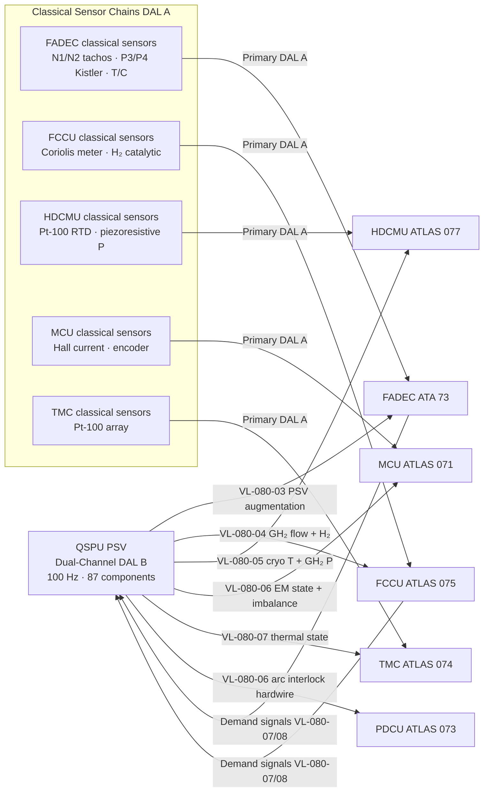
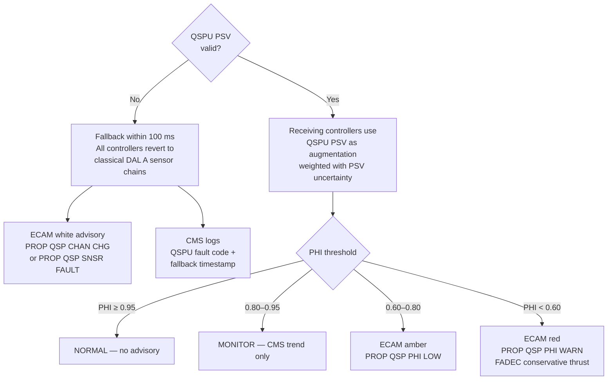

<!-- ──────────────────────────────────────────────────────────────────────────
     QATL-ATLAS-1000-ATLAS-080-089-08-080-070-QUANTUM-SENSING-INTEGRATION-WITH-PROPULSION-CONTROL
     ATLAS-080 (Quantum Sensing for Propulsion) · Quantum Sensing Integration with Propulsion Control
     AMPEL360E eWTW — ATLAS Register 1000
────────────────────────────────────────────────────────────────────────────── -->

# Quantum Sensing Integration with Propulsion Control

---

## §0 Hyperlink Policy

> All hyperlinks in this document are **relative** (five directory levels: `../../../../../`).
> Absolute URLs are forbidden. Every linked document must exist in the Q+ATLANTIDE repository
> before the link is activated. Broken links are treated as open issues and must be resolved
> before the document is promoted from `DRAFT` to `APPROVED`.

---

## §1 Purpose

ATLAS subsubject 080-070 defines the integration architecture, data interfaces, and control loop augmentation between the QSPU Propulsion State Vector (PSV) and the AMPEL360E eWTW propulsion control hierarchy: FADEC (ATA 73), Fuel Cell Control Unit (FCCU, ATLAS 075), Hydrogen Distribution and Conditioning Monitoring Unit (HDCMU, ATLAS 077), Motor Control Unit (MCU, ATLAS 071), Thermal Management Controller (TMC, ATLAS 074), and Power Distribution Control Unit (PDCU, ATLAS 073). This document defines the advisory-only integration paradigm, fallback logic, and the boundary between DAL B quantum sensing augmentation and DAL A primary control chains.

---

## §2 Applicability

| Parameter | Value |
|---|---|
| Aircraft Program | AMPEL360E eWTW |
| ATA reference | ATLAS-080 (Quantum Sensing for Propulsion) — 080-070 Integration with Propulsion Control |
| Certification basis | EASA CS-25 Amdt 27+; DO-178C DAL B; DO-254 DAL B; SAE ARP4754A; ARINC 664 P7 |
| S1000D SNS | 080-070-00 |

---

## §3 Functional Description ![DRAFT]

The QSPU Propulsion State Vector (PSV) is distributed to six propulsion control systems over the AFDX ARINC 664 P7 network. The core integration principle is **advisory and augmentation only at DAL B**: no receiving controller requires QSPU data for its primary control authority. Each controller retains its own independent DAL A classical sensor chain (FADEC N1/N2 tachometers; HDCMU Coriolis flow meters; MCU Hall-effect current sensors; TMC PT-100 RTDs) as the authoritative sensor source. QSPU PSV data is consumed as a supplementary high-fidelity input that augments the classical EHM/trend algorithms, improves control loop precision, or provides earlier detection of degradation than the classical sensors allow. A QSPU fault results in all receiving controllers automatically reverting to their classical sensor sets within 100 ms without any operator action.

The **FADEC interface** (AFDX VL-080-03, 1 Mbps) provides the deepest integration. The QSPU PSV subset delivered to FADEC includes: quantum-augmented N1/N2 angular velocity and torsion (atom interferometer, 10 Hz), combustion P3/P4 pressure from optomechanical sensors (replacing or cross-checking classical Kistler piezoelectric transducers), turbine blade leading-edge temperatures from NV probes (12 per aircraft, 2 Hz update), and the PHI (Propulsion Health Index) for fusion with FADEC's own Engine Health Monitoring (EHM) algorithm. The FADEC inner control loop uses the QSPU P3/P4 data as a secondary source with a confidence weight determined by the QSPU channel status and PSV uncertainty flag; the FADEC's own P3/P4 transducers remain the primary source. At PHI < 0.60, the FADEC receives a PSV flag that activates conservative thrust management scheduling.

The **FCCU interface** (AFDX VL-080-04, 512 kbps) delivers QSPU GH₂ flow-rate actuals from the atom interferometer flow meters (AIFM A/B) as the primary quantum-accurate source for the FCCU fuel-cell efficiency control loop. The FCCU's own Coriolis meter reading and the AIFM reading are compared in the FCCU cross-check logic; a discrepancy > 1 % triggers a FCCU advisory. Quantum H₂ concentration data (derived from SQUID-aided EM leak detection field signatures) is fed to the FCCU safety monitor as a secondary confirmation of the catalytic H₂ sensor readings.

The **HDCMU interface** (AFDX VL-080-05, 512 kbps) provides QSPU cryogenic temperature data from JJ thermometers as supplementary data to the HDCMU thermal map, complementing the classical PT-100 sensors in the cryogenic zone. Optomechanical GH₂ pressure sensor data from the QSPU supplements the HDCMU's pressure control loops as a secondary pressure source with 4× better resolution than the classical piezoresistive transducers.

The **MCU interface** (AFDX VL-080-06, 256 kbps) feeds the QSPU EM field state vector (NV magnetometer and SQUID data) to the Motor Control Unit for predictive demagnetisation compensation of the PMSM permanent magnets and for rotor imbalance-informed motor speed controller trim. The MCU applies the NVM demagnetisation flag to recalibrate the motor torque constant K_T in the vector control algorithm, maintaining torque accuracy over the motor's lifetime.

---

## §4 Functional Breakdown

| ID | Name | Description | Lead Division |
|---|---|---|---|
| F-070-01 | FADEC integration | PSV N1/N2 + P3/P4 + blade temps + PHI to FADEC; VL-080-03 | Q-HPC |
| F-070-02 | FCCU integration | AIFM GH₂ flow + H₂ concentration to FCCU efficiency loop; VL-080-04 | Q-HPC |
| F-070-03 | HDCMU integration | JJT cryo temps + OMPS GH₂ pressure to HDCMU; VL-080-05 | Q-GREENTECH |
| F-070-04 | MCU integration | NVM + SQUID EM state + rotor imbalance to MCU; VL-080-06 | Q-GREENTECH |
| F-070-05 | TMC integration | Full thermal state vector (JJT + NVT) to TMC; VL-080-07 | Q-GREENTECH |
| F-070-06 | PDCU integration | SQUID arc pre-cursor interlock (DAL A hardwire + AFDX) to PDCU; VL-080-06 | Q-GREENTECH |
| F-070-07 | Fallback logic design | All consumers fall back to classical sensors within 100 ms on QSPU fault | Q-HPC |
| F-070-08 | Demand signal ingestion | FADEC and FCCU demand signals inbound to QSPU for adaptive sampling rate | Q-HPC |

---

## §5 System Context — Mermaid Diagram

---

## §6 Internal Architecture — Fallback Logic

---

## §7 Components and LRUs

| Component | Part Number | Qty | Location | Maintenance Interval | Notes |
|---|---|---|---|---|---|
| QSPU — Quantum Sensing Processing Unit | QSPU-PN-TBD | 1 | EE bay rack | C-check BITE | Primary PSV source for all integration VLs |
| FADEC Data Concentrator Card (QSPU interface) | FADEC-QDC-PN-TBD | 1 | FADEC chassis | Replaced with FADEC LRU | AFDX VL-080-03 receiver; PSV label parser; fallback monitor |
| FCCU Quantum Sensor Input Card | FCCU-QIC-PN-TBD | 1 | FCCU chassis | Replaced with FCCU LRU | AFDX VL-080-04 receiver; AIFM/concentration input |
| HDCMU Quantum Augmentation Card | HDCMU-QAC-PN-TBD | 1 | HDCMU chassis | Replaced with HDCMU LRU | AFDX VL-080-05 receiver; JJT + OMPS input |
| MCU Quantum Input Card | MCU-QIC-PN-TBD | 1 | MCU chassis | Replaced with MCU LRU | AFDX VL-080-06 receiver; EM state + imbalance input |
| Arc Interlock Relay Module | AIR-PN-TBD | 1 | PDCU chassis | A-check relay test | DAL A hardwire relay; SQUID arc signal → PDCU trip |

---

## §8 Interfaces

| Interface Type | Connected System | Protocol / Medium | Data / Function |
|---|---|---|---|
| FADEC augmentation | FADEC — ATA 73 | AFDX VL-080-03 / VL-080-07 (bi-directional) | PSV N1/N2; blade temps; P3/P4; PHI; FADEC demand signals inbound |
| FCCU GH₂ augmentation | FCCU — ATLAS 075 | AFDX VL-080-04 / VL-080-08 (bi-directional) | AIFM GH₂ flow; H₂ concentration; FCCU demand inbound |
| HDCMU thermal augmentation | HDCMU — ATLAS 077 | AFDX VL-080-05 | JJT cryogenic temps; OMPS GH₂ pressure |
| MCU EM augmentation | MCU — ATLAS 071 | AFDX VL-080-06 | NVM EM field state; rotor imbalance; demagnetisation flag |
| TMC thermal state | TMC — ATLAS 074 | AFDX VL-080-07 | Full thermal state vector (JJT + NVT) |
| PDCU arc interlock | PDCU — ATLAS 073 | AFDX VL-080-06 + DAL A hardwire | SQUID arc pre-cursor; 50 µs relay interlock |
| CMS fault and trends | CMS — ATA 45 | AFDX VL-080-01 | QSPU BITE; PHI trends; integration fault events |
| ECAM advisory | ECAM — ATA 31 | AFDX VL-080-02 | PHI advisory messages; fallback status |

---

## §9 Operating Modes

| Mode | Trigger | System State | Actions / Consequences |
|---|---|---|---|
| Normal augmentation | QSPU PSV valid; all integration VLs live | All 6 propulsion controllers receive QSPU augmentation data | Optimal EHM sensitivity; GH₂ flow accuracy; blade thermal mapping active |
| FADEC classical fallback | QSPU FADEC VL timeout > 10 ms | FADEC reverts to classical N1/N2 tachos and P3/P4 Kistler transducers | No FADEC control degradation; EHM sensitivity reduced; ECAM advisory |
| FCCU Coriolis primary | QSPU FCCU VL timeout > 20 ms | FCCU uses Coriolis flow meter as primary GH₂ metering source | GH₂ flow accuracy reduced (Coriolis ±0.5 % vs. AIFM ±0.05 %); no FCCU fault |
| PHI conservative thrust | PHI < 0.60 received by FADEC | FADEC activates conservative thrust management schedule | Reduced max thrust; increased health check interval; dispatch restriction flag |
| Arc interlock active | SQUID arc pre-cursor relay fires | PDCU isolates HVDC bus section in < 1 ms | ECAM red; crew informed; affected bus section offline; maintenance required |
| Full QSPU loss | Both QSPU channels failed | All propulsion controllers revert to classical DAL A sensor sets; no quantum augmentation | No primary control degradation; dispatch permitted with CMS maintenance flag |

---

## §10 Performance and Budgets ![DRAFT]

| Parameter | Requirement | Target / Design Value | Status |
|---|---|---|---|
| PSV latency to FADEC | ≤ 10 ms | 8 ms | ![TBD] |
| PSV latency to FCCU | ≤ 20 ms | 15 ms | ![TBD] |
| PSV latency to HDCMU | ≤ 20 ms | 15 ms | ![TBD] |
| PSV latency to MCU | ≤ 20 ms | 15 ms | ![TBD] |
| Fallback time (any controller) | ≤ 100 ms from QSPU fault | 80 ms target | ![TBD] |
| FADEC VL-080-03 bandwidth | 1 Mbps | 1 Mbps allocated | ![TBD] |
| FCCU VL-080-04 bandwidth | 512 kbps | 512 kbps allocated | ![TBD] |
| HDCMU VL-080-05 bandwidth | 512 kbps | 512 kbps allocated | ![TBD] |
| MCU VL-080-06 bandwidth | 256 kbps | 256 kbps allocated | ![TBD] |
| Arc interlock relay response | ≤ 1 ms | 500 µs target | ![TBD] |
| QSPU total AFDX outbound load | ≤ 4 Mbps | 3.1 Mbps | ![TBD] |

---

## §11 Safety and Airworthiness Considerations

The advisory-only integration architecture is the fundamental safety design principle of the QSP system. Because no receiving controller depends on the QSPU for its primary control authority, the QSPU system failure mode is **loss of propulsion health augmentation** — not loss of propulsion control. This is assessed as a Minor failure condition (CS-25 §25.1309) at the system level, consistent with a DAL B system. The fallback logic in each receiving controller is independently verified during DO-178C DAL A qualification of those controllers; the fallback trigger is a simple AFDX VL timeout detected by the standard ARINC 664 P7 integrity monitoring already required in each controller.

The SQUID arc pre-cursor interlock (DAL A hardwire to PDCU) is the exception: it is treated as a separate function with its own DAL A fault tree, independent of the QSPU software and AFDX network. Its failure mode (interlock does not trip on genuine arc pre-cursor) is covered by the existing PDCU arc-fault protection scheme (conventional over-current protection), which provides the DAL A backup.

---

## §12 Standards and Regulatory References

| Standard / Regulation | Title | Applicability |
|---|---|---|
| EASA CS-25 Amdt 27+ | Airworthiness Standards — Large Aeroplanes | System airworthiness |
| DO-178C | Software Considerations — DAL B (QSPU) / DAL A (arc interlock) | Software integration |
| DO-254 | Hardware Design Assurance — DAL B | Integration hardware |
| SAE ARP4754A | Civil Aircraft System Development Assurance | Integration architecture |
| SAE ARP4761 | FMEA/FTA Guidelines | Fallback logic safety assessment |
| ARINC 664 P7 | AFDX | Integration VL topology |
| DO-160G | Environmental Conditions | Environmental qualification of integration hardware |

---

## §13 Document Cross-References

| Document | Location | Relevance |
|---|---|---|
| 080-000 QSP General | [080-000-Quantum-Sensing-for-Propulsion-General.md](./080-000-Quantum-Sensing-for-Propulsion-General.md) | Apex document |
| 080-060 Quantum Sensor Fusion | [080-060-Quantum-Sensor-Fusion-and-Propulsion-State-Estimation.md](./080-060-Quantum-Sensor-Fusion-and-Propulsion-State-Estimation.md) | PSV definition and PHI logic |
| 080-080 Monitoring, Diagnostics and Control | [080-080-Quantum-Sensing-Monitoring-Diagnostics-and-Control-Interfaces.md](./080-080-Quantum-Sensing-Monitoring-Diagnostics-and-Control-Interfaces.md) | AFDX VL detail; ECAM messages |
| ATLAS 071 Electric Motor and Drive Systems | [../../070-079_Propulsion-Eco-Tech-e-Hibrido-Electrica/071_Electric-Motor-and-Drive-Systems/071-000-Electric-Motor-and-Drive-Systems-General.md](../../070-079_Propulsion-Eco-Tech-e-Hibrido-Electrica/071_Electric-Motor-and-Drive-Systems/071-000-Electric-Motor-and-Drive-Systems-General.md) | MCU integration context |
| ATLAS 074 Thermal Management | [../../070-079_Propulsion-Eco-Tech-e-Hibrido-Electrica/074_Thermal-Management-Hybrid/074-000-Thermal-Management-Hybrid-General.md](../../070-079_Propulsion-Eco-Tech-e-Hibrido-Electrica/074_Thermal-Management-Hybrid/074-000-Thermal-Management-Hybrid-General.md) | TMC integration context |
| ATLAS 075 Fuel Cell Integration | [../../070-079_Propulsion-Eco-Tech-e-Hibrido-Electrica/075_Fuel-Cell-Integration/075-000-Fuel-Cell-Integration-General.md](../../070-079_Propulsion-Eco-Tech-e-Hibrido-Electrica/075_Fuel-Cell-Integration/075-000-Fuel-Cell-Integration-General.md) | FCCU integration context |
| ATLAS 077 H₂ Distribution | [../../070-079_Propulsion-Eco-Tech-e-Hibrido-Electrica/077_Hydrogen-Distribution-and-Conditioning/077-000-Hydrogen-Distribution-and-Conditioning-General.md](../../070-079_Propulsion-Eco-Tech-e-Hibrido-Electrica/077_Hydrogen-Distribution-and-Conditioning/077-000-Hydrogen-Distribution-and-Conditioning-General.md) | HDCMU integration context |

---

## §14 Revision History

| Rev | Date | Author | Description |
|---|---|---|---|
| 0.1 | 2026-05-12 | Q-HPC | Initial DRAFT baseline release |
