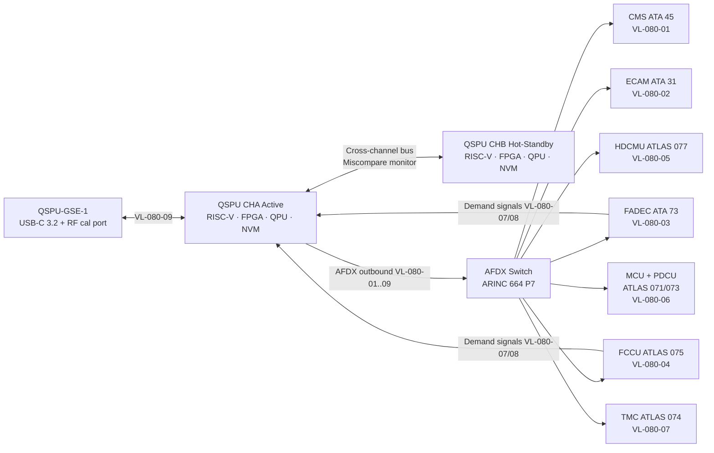

<!-- ──────────────────────────────────────────────────────────────────────────
     QATL-ATLAS-1000-ATLAS-080-089-08-080-080-QUANTUM-SENSING-MONITORING-DIAGNOSTICS-AND-CONTROL-INTERFACES
     ATLAS-080 (Quantum Sensing for Propulsion) · Quantum Sensing Monitoring, Diagnostics and Control Interfaces
     AMPEL360E eWTW — ATLAS Register 1000
────────────────────────────────────────────────────────────────────────────── -->

# Quantum Sensing Monitoring, Diagnostics and Control Interfaces

---

## §0 Hyperlink Policy

> All hyperlinks in this document are **relative** (five directory levels: `../../../../../`).
> Absolute URLs are forbidden. Every linked document must exist in the Q+ATLANTIDE repository
> before the link is activated. Broken links are treated as open issues and must be resolved
> before the document is promoted from `DRAFT` to `APPROVED`.

---

## §1 Purpose

ATLAS subsubject 080-080 documents the detailed hardware architecture of the QSPU LRU, the software partition structure, the ECAM PROP QSP synoptic page and message set, the Built-In Test Equipment (BITE) function table, the AFDX virtual link (VL) allocation, and the Ground Support Equipment (GSE) interface for maintenance and calibration of the QSP system.

---

## §2 Applicability

| Parameter | Value |
|---|---|
| Aircraft Program | AMPEL360E eWTW |
| ATA reference | ATLAS-080 (Quantum Sensing for Propulsion) — 080-080 Monitoring, Diagnostics and Control Interfaces |
| Certification basis | EASA CS-25 Amdt 27+; DO-178C DAL B; DO-254 DAL B; ARINC 664 P7 |
| S1000D SNS | 080-080-00 |

---

## §3 Functional Description ![DRAFT]

The **QSPU hardware architecture** consists of a 4-MCU EE bay rack unit with dual independent processing channels. **Channel A (CHA)** is the active channel; **Channel B (CHB)** is hot-standby, continuously cross-monitoring CHA. Automatic changeover to CHB occurs in < 50 ms on detection of any CHA fault (watchdog timeout, FPGA configuration error, QPU coherence failure, AFDX VL health monitor alert, or channel miscompare on the PSV output). Each channel contains: a **64-bit safety-grade RISC-V CPU** running at 1 GHz (DO-254 DAL B qualified ASIC); an **Artix-7 FPGA** (Xilinx, reconfigurable for sensor-family demodulation algorithms); a **5-qubit trapped-ion QPU module** (10 × 10 × 5 cm form factor, cooled to 4.2 K by an integral Stirling cryocooler drawing < 10 W, achieving T1 ≥ 120 µs and single-qubit gate fidelity ≥ 99.9 %); and **256 GB NVM** (non-volatile memory for QML model weights, fault log, PSV rolling history, and BITE records). The two channels share a QSPU backplane carrying the cross-channel data bus and power distribution; the backplane itself is not channel-specific and does not contain safety-critical logic.

The **QSPU software** is structured into **11 DO-178C DAL B partitions** with strict inter-partition memory and timing isolation via the RISC-V hardware partitioning unit: (1) Quantum Sensor I/O — manages all sensor bus communications; (2) Atom Interferometer Signal Processing — Layer 1 demodulation for AI-IMU and AIFM; (3) NV-Center Spin Echo Demodulation — Layer 1 for NVM and NVT probes; (4) SQUID/JJ Data Acquisition — Layer 1 for SQUID and JJT nodes; (5) Optomechanical Sensor Readout — Layer 1 for OMPS and CARS; (6) QE-EKF State Estimation — Layer 2 87-component state vector; (7) QML Health Index Computation — Layer 3 VQC PHI, including QPU interface; (8) Propulsion Control Interface — PSV labelling, AFDX VL transmission, PSV uncertainty flagging; (9) AFDX Communication Manager — VL health monitoring, timeout detection, fallback trigger; (10) BITE and Fault Logging — 11-function BITE, fault code generation, CMS interface; (11) GSE Data-Link — GSE protocol, QML model weight ingestion, calibration data transfer.

The **ECAM PROP QSP synoptic** is accessible from the PROP page on the ECAM lower display. It presents: an animated sensor node health map (46 nodes, each rendered as a coloured dot: green = healthy, amber = degraded/advisory, red = fault/offline); PSV key parameter displays (N1/N2 quantum vibration level bar graph, PHI bar graph with coloured zones, cryogenic zone ΔT indicator, EM field RMS indicator at the motor nodes); QSPU mode indication (ACTIVE CHA / ACTIVE CHB / DEGRADED / MAINT); and the FADEC EHM quantum-augmented blade temperature heat map (12 blade locations, colour-coded T/T_limit).

---

## §4 Functional Breakdown

| ID | Name | Description | Lead Division |
|---|---|---|---|
| F-080-01 | QSPU hardware — CHA/CHB | Dual-channel 4-MCU rack; RISC-V + FPGA + QPU + NVM per channel | Q-HPC |
| F-080-02 | QSPU software partitions | 11 DO-178C DAL B partitions; temporal/spatial isolation | Q-HPC |
| F-080-03 | ECAM PROP QSP synoptic | 46-node health map; PSV key params; PHI bar graph; QSPU mode | Q-HPC |
| F-080-04 | ECAM message set | 6 QSP-specific ECAM messages (amber/red/white) | Q-HPC |
| F-080-05 | BITE — 11 functions | Per-partition BITE; QPU coherence; AFDX VL; channel miscompare | Q-HPC |
| F-080-06 | AFDX VL allocation | VL-080-01 through VL-080-09; bandwidth table | Q-HPC |
| F-080-07 | GSE interface | QSPU-GSE-1 tool; USB-C 3.2 + quantum calibration RF port | Q-INDUSTRY |

---

## §5 System Context — Mermaid Diagram

---

## §6 BITE Function Table

| BITE ID | Partition | Test Description | Trigger | Pass Criterion | Fault Code |
|---|---|---|---|---|---|
| BT-080-01 | Quantum Sensor I/O | All sensor bus communications check; RS-485 loopback; optical fibre power | Power-on; maintenance request | All 46 nodes respond within 500 ms | QSP-SNSR-BUS-FAULT |
| BT-080-02 | Atom IF Signal Processing | AI-IMU fringe contrast ≥ 50 %; AIFM Sagnac offset ≤ 5 mrad | Power-on; scheduled 24 h | Fringe contrast ≥ 50 % | QSP-AIMU-FAULT |
| BT-080-03 | NV Spin Echo Demodulation | NVM ODMR contrast ≥ 20 %; NVT ZFS frequency check ±1 MHz | Power-on; scheduled 24 h | ODMR contrast ≥ 20 % | QSP-NV-FAULT |
| BT-080-04 | SQUID/JJ Data Acquisition | SQUID FLL lock status; JJT noise floor within ±10 % of spec | Power-on; scheduled 24 h | FLL locked; JJT noise within spec | QSP-SQUID-JJT-FAULT |
| BT-080-05 | Optomechanical Sensor Readout | OMPS cavity resonance trackable; CARS pump power ≥ 80 % spec | Power-on; scheduled 24 h | Cavity tracking stable; CARS power nominal | QSP-OMPS-CARS-FAULT |
| BT-080-06 | QE-EKF State Estimation | EKF convergence test with injected known state; state error < 0.1 % | Maintenance request | State error < 0.1 % over 10 cycles | QSP-EKF-FAULT |
| BT-080-07 | QPU Coherence Check | T1 coherence time measurement on all 5 qubits; gate fidelity 2-qubit test | Power-on; pre-flight; 8 h in-service | T1 ≥ 100 µs; 2-qubit fidelity ≥ 99 % | QSP-QPU-FAULT |
| BT-080-08 | QML PHI Computation | PHI VQC test run with known degradation signature; PHI ≤ 0.70 expected | Maintenance request | PHI output within ±0.05 of reference | QSP-QML-FAULT |
| BT-080-09 | AFDX VL Timeout Monitor | VL watchdog check for all 9 VLs; timeout threshold 10 ms | Continuous in operation | No VL timeout for > 10 ms | QSP-AFDX-FAULT |
| BT-080-10 | Channel Miscompare | CHA vs. CHB PSV spot-check on 10 state components; miscompare < 0.5 % | Continuous in operation; manual | Miscompare < 0.5 % on all checked components | QSP-CHAN-FAULT |
| BT-080-11 | GSE Data-Link | GSE handshake; QML model checksum; calibration data round-trip | GSE connection | Handshake OK; checksum match | QSP-GSE-FAULT |

---

## §7 Components and LRUs

| Component | Part Number | Qty | Location | Maintenance Interval | Notes |
|---|---|---|---|---|---|
| QSPU LRU — complete unit | QSPU-PN-TBD | 1 | EE bay rack 4-MCU | C-check BITE + QPU coherence | Dual-channel; DO-178C/254 DAL B; 5-qubit QPU per channel |
| QSPU-GSE-1 Ground Support Equipment | QSPU-GSE1-PN-TBD | 1 | Ground maintenance kit | Annual calibration of GSE calibration standards | USB-C 3.2 host + quantum calibration RF port |
| QPU Calibration Reference Source | QPU-CAL-PN-TBD | 1 | GSE kit | Annual recertification | RF reference for qubit gate frequency calibration |
| NVM Model Storage Module | QSPU-NVM-PN-TBD | 2 | Integral to QSPU | Replaced with QSPU LRU | 256 GB; DO-178C CM controlled; no field write except via GSE |

---

## §8 ECAM Message Set

| ECAM Message | Colour | Condition | Required Crew Action | CMS Code |
|---|---|---|---|---|
| PROP QSP SNSR FAULT | Amber | One or more quantum sensor nodes failed BITE or lost communications | Monitor; maintenance action at next opportunity | QSP-SNSR-FAULT |
| PROP QSP PHI LOW | Amber | PHI 0.60–0.80 for > 5 min | Monitor propulsion; schedule maintenance | QSP-PHI-LOW |
| PROP QSP PHI WARN | Red | PHI < 0.60 | Apply conservative thrust management per QRH; inform maintenance | QSP-PHI-WARN |
| PROP QSP QPU FAULT | Amber | QPU T1 < 80 µs or gate fidelity < 98 % | PHI computed classically; reduced health index sensitivity; maintenance | QSP-QPU-FAULT |
| PROP QSP CHAN CHG | White | QSPU channel changeover occurred (CHA → CHB) | Monitor; log in tech log; maintenance before next flight | QSP-CHAN-CHG |
| PROP QSP MAINT | White | QSPU in maintenance mode (GSE connected or maintenance mode commanded) | Normal if GSE is connected on ground; no flight in MAINT mode | QSP-MAINT |

---

## §9 Operating Modes

| Mode | Trigger | System State | Actions / Consequences |
|---|---|---|---|
| Normal — CHA active | Power-on; all BITE passed; QPU T1 ≥ 100 µs | CHA active; CHB monitoring; all 9 VLs live; PHI on QPU | Full QSP capability; ECAM PROP QSP shows 46 nodes green |
| Channel changeover | CHA fault (watchdog / FPGA / QPU / miscompare) | CHB promoted in < 50 ms; ECAM PROP QSP CHAN CHG white | PSV continuity maintained; fault logged; maintenance required |
| QPU degraded | QPU T1 < 80 µs on active channel | PHI computation falls back to classical rule-based index; Layers 1/2 unaffected | ECAM PROP QSP QPU FAULT amber; PHI less sensitive; maintenance at next opportunity |
| Sensor fault | Any sensor node BITE failure | Affected node flagged offline; QE-EKF runs with reduced node set | ECAM synoptic: affected node red; PROP QSP SNSR FAULT amber if ≥ 3 nodes |
| Maintenance | GSE connected; ECAM PROP QSP MAINT active | QSPU PSV transmission suspended; all 11 BITE functions available | Full calibration and QML weight update; QPU coherence check mandatory |
| Software update | QSPU-GSE-1 software load command | QSPU in ground maintenance mode; both channels in update state | New software loaded and checksummed; BIT run mandatory before return to service |

---

## §10 Performance and Budgets ![DRAFT]

| Parameter | Requirement | Target / Design Value | Status |
|---|---|---|---|
| QSPU rack size | ≤ 4 MCU | 4 MCU | ![TBD] |
| QSPU total power (both channels) | ≤ 250 W | 220 W target | ![TBD] |
| QPU Stirling cryo power (per channel) | ≤ 15 W | 10 W | ![TBD] |
| QPU T1 coherence time | ≥ 100 µs | 120 µs | ![TBD] |
| QPU 1-qubit gate fidelity | ≥ 99.5 % | 99.9 % target | ![TBD] |
| QPU 2-qubit gate fidelity | ≥ 99 % | 99.5 % target | ![TBD] |
| QSPU NVM write endurance | ≥ 100 000 cycles per block | Flash NVM class | ![TBD] |
| Channel changeover time | ≤ 100 ms | 50 ms | ![TBD] |
| BITE full-run time | ≤ 30 min | 20 min target | ![TBD] |
| GSE QML weight upload time | ≤ 10 min for full 4 GB model | 8 min target | ![TBD] |
| QSPU MTBF | ≥ 20 000 h | 25 000 h target | ![TBD] |

---

## §11 Safety and Airworthiness Considerations

The QSPU dual-channel architecture with automatic CHA/CHB changeover ensures that no single LRU hardware failure removes the QSP advisory data from the propulsion system without ECAM notification and CMS logging. The DO-178C DAL B 11-partition software structure ensures that a software error in any single partition cannot corrupt data in another partition (hardware-enforced memory protection unit). The QPU Stirling cryocooler is the only component with a wear mechanism that approaches the aircraft maintenance interval boundary; its 5 000 h service interval is set at 50 % of the MTBF target to maintain an on-wing reliability consistent with the QSPU availability requirement.

The ECAM PROP QSP MAINT advisory is mandatory whenever the GSE is connected, preventing inadvertent flight with the QSPU in a non-certified software configuration. Transition back to normal mode requires completion of the mandatory BITE full-run (BITE function table BT-080-01 through BT-080-11) and confirmation of QPU coherence (BT-080-07) before the QSPU PSV transmission is re-enabled.

---

## §12 Standards and Regulatory References

| Standard / Regulation | Title | Applicability |
|---|---|---|
| EASA CS-25 Amdt 27+ | Airworthiness Standards — Large Aeroplanes | System airworthiness |
| DO-178C | Software Considerations — DAL B | All 11 QSPU software partitions |
| DO-254 | Hardware Design Assurance — DAL B | QSPU hardware including QPU module |
| DO-160G | Environmental Conditions for Airborne Equipment | QSPU environmental qualification |
| ARINC 664 P7 | AFDX | 9-VL QSPU network |
| ARINC 429 | Digital Information Transfer (legacy reference) | Legacy sensor data format reference |
| IEEE P2995 | Quantum Computing Definitions | QPU metrics |
| SAE ARP4754A | Civil Aircraft System Development Assurance | Software partition architecture |
| SAE ARP4761 | FMEA/FTA Guidelines | BITE and fault logic safety assessment |

---

## §13 Document Cross-References

| Document | Location | Relevance |
|---|---|---|
| 080-000 QSP General | [080-000-Quantum-Sensing-for-Propulsion-General.md](./080-000-Quantum-Sensing-for-Propulsion-General.md) | Apex document |
| 080-010 Quantum Sensor Architecture | [080-010-Quantum-Sensor-Architecture-for-Propulsion.md](./080-010-Quantum-Sensor-Architecture-for-Propulsion.md) | AFDX VL topology overview |
| 080-060 Quantum Sensor Fusion | [080-060-Quantum-Sensor-Fusion-and-Propulsion-State-Estimation.md](./080-060-Quantum-Sensor-Fusion-and-Propulsion-State-Estimation.md) | Software partition functions detail |
| 080-070 Integration with Propulsion Control | [080-070-Quantum-Sensing-Integration-with-Propulsion-Control.md](./080-070-Quantum-Sensing-Integration-with-Propulsion-Control.md) | Propulsion controller VL usage |
| 080-090 S1000D / CSDB Mapping | [080-090-S1000D-CSDB-Mapping-and-Traceability.md](./080-090-S1000D-CSDB-Mapping-and-Traceability.md) | Maintenance DM references |
| ATLAS 077 HDCMU Monitoring | [../../070-079_Propulsion-Eco-Tech-e-Hibrido-Electrica/077_Hydrogen-Distribution-and-Conditioning/077-080-Hydrogen-Distribution-Monitoring-Diagnostics-and-Control-Interfaces.md](../../070-079_Propulsion-Eco-Tech-e-Hibrido-Electrica/077_Hydrogen-Distribution-and-Conditioning/077-080-Hydrogen-Distribution-Monitoring-Diagnostics-and-Control-Interfaces.md) | HDCMU ECAM/BITE pattern reference |

---

## §14 Revision History

| Rev | Date | Author | Description |
|---|---|---|---|
| 0.1 | 2026-05-12 | Q-HPC | Initial DRAFT baseline release |
