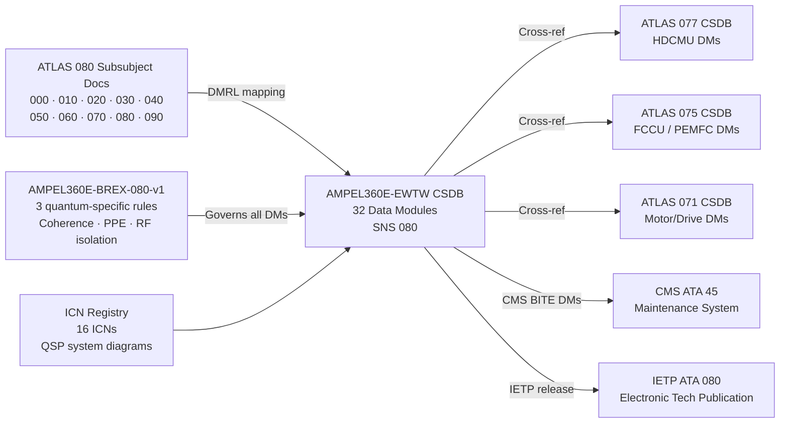

<!-- ──────────────────────────────────────────────────────────────────────────
     QATL-ATLAS-1000-ATLAS-080-089-08-080-090-S1000D-CSDB-MAPPING-AND-TRACEABILITY
     ATLAS-080 (Quantum Sensing for Propulsion) · S1000D / CSDB Mapping and Traceability
     AMPEL360E eWTW — ATLAS Register 1000
────────────────────────────────────────────────────────────────────────────── -->

# S1000D / CSDB Mapping and Traceability

---

## §0 Hyperlink Policy

> All hyperlinks in this document are **relative** (five directory levels: `../../../../../`).
> Absolute URLs are forbidden. Every linked document must exist in the Q+ATLANTIDE repository
> before the link is activated. Broken links are treated as open issues and must be resolved
> before the document is promoted from `DRAFT` to `APPROVED`.

---

## §1 Purpose

ATLAS subsubject 080-090 establishes the S1000D Data Module Requirements List (DMRL), BREX document reference and constraints, CSDB integration interfaces, ICN registry, and milestone plan for the AMPEL360E eWTW Quantum Sensing for Propulsion (QSP) system technical documentation. It provides the authoritative traceability table between ATLAS subsubject documents and their corresponding S1000D Data Modules (DMs) in the CSDB.

---

## §2 Applicability

| Parameter | Value |
|---|---|
| Aircraft Program | AMPEL360E eWTW |
| ATA reference | ATLAS-080 (Quantum Sensing for Propulsion) — 080-090 S1000D / CSDB Mapping and Traceability |
| Certification basis | EASA CS-25 Amdt 27+; S1000D Issue 5.0; BREX-080-v1 |
| S1000D SNS | 080-090-00 |

---

## §3 Functional Description ![DRAFT]

The QSP technical documentation suite comprises **32 S1000D Data Modules (DMs)** registered in the AMPEL360E-EWTW CSDB under the SNS 080 schema. The Data Module Code (DMC) pattern is `AMPEL360E-EWTW-080-{NNN}-00A-EN-US`, where `{NNN}` is the three-digit subsubject code (000–090) and the information code suffix identifies the DM type: `-040A` for descriptive, `-100A` for procedural (task), `-300A` for inspection, and `-520A` for removal/replacement. The BREX governing document is `AMPEL360E-BREX-080-v1`.

**BREX-080-v1** enforces three domain-specific quantum sensing constraints that apply across all DM types under SNS 080:

1. **Quantum Coherence Pre-Verification Rule** — All maintenance DMs of type 100 (procedural task), 300 (inspection), and 520 (removal/replacement) that require physical access to any QSPU subassembly or quantum sensor node (atom interferometer vacuum chamber, SQUID cryohead, QPU cryo module) must include a mandatory quantum coherence pre-verification step as the first pre-task action: (a) QSPU BITE BT-080-07 (QPU coherence check) must confirm QPU T1 ≥ 100 µs on the active channel before any sensor node access; (b) QSPU must be in MAINTENANCE mode, confirmed by ECAM advisory PROP QSP MAINT active, before the first mechanical step. The pre-verification step must be rendered in the DM as a WARNING-level caution preceding all procedural steps.

2. **Cryogenic Quantum Sensor PPE Rule** — All DMs for tasks on SQUID sensor heads (cooled to 4.2 K by JT cryocooler), Josephson Junction thermometer modules, and the QPU cryo module must include mandatory cryogenic Personal Protective Equipment (PPE) as the first pre-task step. Required PPE: full face shield (EN 166 / ANSI Z87.1 rated), cryogenic gauntlets (rated to 4.2 K, ISO 15025 class B), cryogenic apron (insulating to 4.2 K contact), and insulating footwear. The BREX note must state: "The Joule-Thomson cryocooler in SQUID sensor heads and the QPU cryo module reaches a cold-tip temperature of 4.2 K (−269 °C). Unprotected skin contact with any surface at this temperature causes immediate cryogenic tissue destruction. PPE as specified in the pre-task step is mandatory and non-deferrable."

3. **RF/EM Isolation Rule** — All DMs for tasks on or near any installed quantum sensor node — atom interferometer (AI-IMU, AIFM), NV-center device (NVM, NVT, NVVIB), or SQUID — must require confirmation of the RF and magnetic field environment in the work zone as a mandatory pre-condition before any mechanical sensor access. A portable calibrated Gauss meter reading of < 100 nT in the work zone is required (any ambient field exceeding 100 nT will collapse quantum coherence in NV and atom interferometer nodes, potentially causing the QSPU to log spurious fault codes during the maintenance task, and will saturate the SQUID FLL). Tasks must state: "Measure ambient magnetic field with calibrated Gauss meter at work zone centre point and within 30 cm of each sensor node to be accessed. If reading ≥ 100 nT, identify and eliminate magnetic field source before proceeding. Record Gauss meter reading in maintenance log."

---

## §4 DMRL — Data Module Requirements List

| DM Number | DMC | Type | Title | ATLAS Source Doc |
|---|---|---|---|---|
| DM-080-001 | AMPEL360E-EWTW-080-000-00A-040A-EN-US | 040 Descriptive | QSP General — System Overview | 080-000 |
| DM-080-002 | AMPEL360E-EWTW-080-000-00A-100A-EN-US | 100 Procedural | QSP System Activation / Deactivation | 080-000 |
| DM-080-003 | AMPEL360E-EWTW-080-010-00A-040A-EN-US | 040 Descriptive | Quantum Sensor Architecture — Description | 080-010 |
| DM-080-004 | AMPEL360E-EWTW-080-010-00A-300A-EN-US | 300 Inspection | QSPU LRU Visual and Electrical Inspection | 080-010 |
| DM-080-005 | AMPEL360E-EWTW-080-020-00A-040A-EN-US | 040 Descriptive | Quantum Inertial and Vibration Sensing — Description | 080-020 |
| DM-080-006 | AMPEL360E-EWTW-080-020-00A-100A-EN-US | 100 Procedural | AI-IMU BITE Self-Test Procedure | 080-020 |
| DM-080-007 | AMPEL360E-EWTW-080-020-00A-300A-EN-US | 300 Inspection | NV Vibrometer Probe Inspection and Alignment Check | 080-020 |
| DM-080-008 | AMPEL360E-EWTW-080-020-00A-520A-EN-US | 520 Removal/Replace | AI-IMU Module Removal and Replacement | 080-020 |
| DM-080-009 | AMPEL360E-EWTW-080-030-00A-040A-EN-US | 040 Descriptive | Quantum Magnetic and EM Sensing — Description | 080-030 |
| DM-080-010 | AMPEL360E-EWTW-080-030-00A-100A-EN-US | 100 Procedural | NV Magnetometer Zero-Field Baseline Calibration | 080-030 |
| DM-080-011 | AMPEL360E-EWTW-080-030-00A-300A-EN-US | 300 Inspection | SQUID Sensor Head JT Cooler Inspection | 080-030 |
| DM-080-012 | AMPEL360E-EWTW-080-030-00A-520A-EN-US | 520 Removal/Replace | SQUID Sensor Head Removal and Replacement | 080-030 |
| DM-080-013 | AMPEL360E-EWTW-080-040-00A-040A-EN-US | 040 Descriptive | Quantum Thermal and Cryogenic Sensing — Description | 080-040 |
| DM-080-014 | AMPEL360E-EWTW-080-040-00A-100A-EN-US | 100 Procedural | JJ Thermometer Module SI-Traceability Verification | 080-040 |
| DM-080-015 | AMPEL360E-EWTW-080-040-00A-300A-EN-US | 300 Inspection | NV Thermometry Probe Optical Alignment Inspection | 080-040 |
| DM-080-016 | AMPEL360E-EWTW-080-040-00A-520A-EN-US | 520 Removal/Replace | JJT Module Removal and Replacement | 080-040 |
| DM-080-017 | AMPEL360E-EWTW-080-050-00A-040A-EN-US | 040 Descriptive | Quantum Pressure, Flow and Combustion Sensing — Description | 080-050 |
| DM-080-018 | AMPEL360E-EWTW-080-050-00A-100A-EN-US | 100 Procedural | OMPS Cavity Finesse Check and Pressure Calibration | 080-050 |
| DM-080-019 | AMPEL360E-EWTW-080-050-00A-300A-EN-US | 300 Inspection | CARS Probe Fibre Alignment and Laser Power Check | 080-050 |
| DM-080-020 | AMPEL360E-EWTW-080-050-00A-520A-EN-US | 520 Removal/Replace | AIFM Node Removal and Replacement | 080-050 |
| DM-080-021 | AMPEL360E-EWTW-080-060-00A-040A-EN-US | 040 Descriptive | Quantum Sensor Fusion and PSV — Description | 080-060 |
| DM-080-022 | AMPEL360E-EWTW-080-060-00A-100A-EN-US | 100 Procedural | QE-EKF Convergence Test and PSV Validation | 080-060 |
| DM-080-023 | AMPEL360E-EWTW-080-060-00A-300A-EN-US | 300 Inspection | QPU Coherence Time Measurement Procedure | 080-060 |
| DM-080-024 | AMPEL360E-EWTW-080-070-00A-040A-EN-US | 040 Descriptive | QSP Integration with Propulsion Control — Description | 080-070 |
| DM-080-025 | AMPEL360E-EWTW-080-070-00A-100A-EN-US | 100 Procedural | AFDX VL Integration Test — FADEC/FCCU/HDCMU | 080-070 |
| DM-080-026 | AMPEL360E-EWTW-080-070-00A-300A-EN-US | 300 Inspection | Propulsion Controller Fallback Verification Test | 080-070 |
| DM-080-027 | AMPEL360E-EWTW-080-080-00A-040A-EN-US | 040 Descriptive | QSPU Hardware Architecture and ECAM Synoptic — Description | 080-080 |
| DM-080-028 | AMPEL360E-EWTW-080-080-00A-100A-EN-US | 100 Procedural | QSPU Full BITE Run Procedure (All 11 Functions) | 080-080 |
| DM-080-029 | AMPEL360E-EWTW-080-080-00A-300A-EN-US | 300 Inspection | QSPU Channel Changeover Functional Test | 080-080 |
| DM-080-030 | AMPEL360E-EWTW-080-080-00A-520A-EN-US | 520 Removal/Replace | QSPU LRU Removal and Replacement | 080-080 |
| DM-080-031 | AMPEL360E-EWTW-080-090-00A-040A-EN-US | 040 Descriptive | S1000D/CSDB Mapping and Traceability — Description | 080-090 |
| DM-080-032 | AMPEL360E-EWTW-080-080-00A-100B-EN-US | 100 Procedural | QSPU-GSE-1 QML Model Weight Update Procedure | 080-080 |

---

## §5 System Context — Mermaid Diagram

---

## §6 ICN Registry

| ICN | Title | Used In DMs | Format |
|---|---|---|---|
| ICN-080-001 | QSP System Overview Diagram | DM-080-001, DM-080-003 | SVG |
| ICN-080-002 | Sensor Node Physical Placement — Full Aircraft | DM-080-003 | SVG |
| ICN-080-003 | AFDX VL Topology Diagram | DM-080-003, DM-080-024 | SVG |
| ICN-080-004 | AI-IMU Internal Architecture | DM-080-005, DM-080-008 | SVG |
| ICN-080-005 | NVVIB Probe Installation Detail | DM-080-005, DM-080-007 | SVG |
| ICN-080-006 | NV Magnetometer Probe — Motor Installation | DM-080-009, DM-080-010 | SVG |
| ICN-080-007 | SQUID Sensor Head Cross-Section | DM-080-009, DM-080-012 | SVG |
| ICN-080-008 | JJT Module Installation — Cryogenic Zone | DM-080-013, DM-080-016 | SVG |
| ICN-080-009 | NVT Probe — Turbine Blade TBC Embedding | DM-080-013, DM-080-015 | SVG |
| ICN-080-010 | OMPS Sensor Node Cross-Section | DM-080-017, DM-080-018 | SVG |
| ICN-080-011 | CARS Probe — Combustor Window Installation | DM-080-017, DM-080-019 | SVG |
| ICN-080-012 | QSPU LRU Internal Architecture | DM-080-027, DM-080-030 | SVG |
| ICN-080-013 | QSPU Software Partition Structure | DM-080-027, DM-080-028 | SVG |
| ICN-080-014 | ECAM PROP QSP Synoptic Screen Layout | DM-080-027 | PNG |
| ICN-080-015 | QPU Module — Trapped-Ion Configuration | DM-080-023, DM-080-030 | SVG |
| ICN-080-016 | QSPU-GSE-1 Connection Diagram | DM-080-032 | SVG |

---

## §7 Components and LRUs

| Component | Part Number | Qty | Location | Maintenance Interval | Notes |
|---|---|---|---|---|---|
| CSDB Host Server (AMPEL360E programme) | CSDB-SERVER-TBD | — | Ground infrastructure | Annual CSDB export and integrity check | S1000D Issue 5.0 CSDB; 32 DMs registered under SNS 080 |
| BREX-080-v1 Validator | BREX-VAL-TBD | — | CSDB toolchain | Updated per BREX amendment | Validates DM authoring compliance to 3 quantum-specific rules |
| IETP Renderer — ATA 080 | IETP-TBD | — | Ground / MRO workstation | Per IETP software update | Electronic Tech Publication renderer; linked to CSDB |

---

## §8 Interfaces

| Interface Type | Connected System | Protocol / Medium | Data / Function |
|---|---|---|---|
| CSDB ingest | ATLAS 080 authoring tool | CSDB import API (S1000D XML) | DM XML ingest; ICN attachment; BREX validation |
| ATLAS 077 CSDB | HDCMU documentation CSDB | CSDB cross-reference link | DM cross-references for HDCMU/QSPU interfaces |
| ATLAS 075 CSDB | FCCU / PEMFC documentation CSDB | CSDB cross-reference link | DM cross-references for FCCU/QSPU interfaces |
| ATLAS 071 CSDB | Motor/Drive Systems CSDB | CSDB cross-reference link | DM cross-references for MCU/QSPU interfaces |
| ATA 45 CMS | Central Maintenance System CSDB | CSDB cross-reference link | BITE DM cross-references |
| BREX validator | AMPEL360E-BREX-080-v1 validation tool | CSDB toolchain | Enforce 3 quantum constraints on all SNS 080 DMs |
| IETP renderer | ATA 080 IETP | IETP export | Electronic maintenance publication output |
| QML model CM | QSPU-GSE-1 software CM system | Version-controlled file repository | QML model weight files; CM-controlled; linked to DM-080-032 |

---

## §9 CSDB Milestone Plan

| Milestone | Target Date | Deliverable | Responsible |
|---|---|---|---|
| DMRL-080 Baseline | 2026-06-30 | Approved DMRL with 32 DM entries; BREX-080-v1 published | Q-DATAGOV |
| ICN Registry Baseline | 2026-07-31 | 16 ICN entries registered in CSDB; source artwork complete | Q-HPC / Q-DATAGOV |
| DM First Issue — Descriptive (040A types) | 2026-09-30 | 10 descriptive DMs authored and BREX validated | Q-DATAGOV / Lead Divisions |
| DM First Issue — Procedural (100A/300A/520A) | 2027-01-31 | 22 procedural/inspection/R&R DMs authored and validated | Q-DATAGOV / Q-MECHANICS |
| CSDB Full Review | 2027-03-31 | All 32 DMs reviewed; cross-references validated; open issues < 5 | Q-DATAGOV |
| IETP ATA 080 First Release | 2027-06-30 | IETP rendered and validated; published to MRO workstation | Q-DATAGOV / Q-INDUSTRY |
| CSDB Final Issue (Certification Support) | 2027-12-31 | All DMs at APPROVED status; BREX conformance record archived | Q-DATAGOV |

---

## §10 Performance and Budgets ![DRAFT]

| Parameter | Requirement | Target / Design Value | Status |
|---|---|---|---|
| Total DMs in DMRL | ≥ 30 | 32 | ![TBD] |
| BREX-080-v1 conformant DMs | 100 % | 100 % | ![TBD] |
| ICNs registered | ≥ 12 | 16 | ![TBD] |
| DM XML schema (S1000D Issue) | S1000D Issue 5.0 | S1000D Issue 5.0 | ![TBD] |
| CSDB DM cross-reference completeness | 100 % of listed interfaces linked | 100 % | ![TBD] |
| BREX quantum coherence rule coverage | All 100/300/520 DMs accessing QSPU/sensor nodes | 22 DMs | ![TBD] |
| BREX cryo PPE rule coverage | All DMs for SQUID/JJT/QPU tasks | 6 DMs | ![TBD] |
| BREX RF/EM rule coverage | All DMs for quantum sensor node access | 16 DMs | ![TBD] |

---

## §11 Safety and Airworthiness Considerations

The three BREX-080-v1 domain-specific rules exist because the quantum sensor technologies in the QSP system introduce maintenance hazards and risks of data quality corruption that are not covered by the existing generic AMPEL360E BREX (BREX-001-v3). These rules are classified as **safety-significant BREX constraints**: failure to comply with the quantum coherence pre-verification rule could result in QSPU logging spurious fault codes during maintenance (which can invalidate a subsequent BITE pass), which is a data integrity hazard for airworthiness decision-making. Failure to apply the cryogenic PPE rule exposes maintenance technicians to immediate cryogenic tissue injury from the 4.2 K SQUID/QPU surfaces. Failure to confirm the RF/EM environment can cause quantum sensor decoherence during calibration, resulting in incorrect calibration data being stored in the QSPU, which is a latent airworthiness hazard.

All three BREX rules are therefore mandatory and non-deferrable, enforced both by the BREX validator tool and by the Q-DATAGOV review process before any DM is promoted to APPROVED status in the CSDB.

---

## §12 Standards and Regulatory References

| Standard / Regulation | Title | Applicability |
|---|---|---|
| S1000D Issue 5.0 | International Specification for Technical Publications | All DMs under SNS 080 |
| EASA CS-25 Amdt 27+ | Airworthiness Standards — Large Aeroplanes | Maintenance documentation airworthiness |
| ASD-STE100 | Simplified Technical English | All procedural DMs (100, 300, 520 type) |
| ISO 15025 | Protective clothing — Flame propagation (PPE reference) | BREX cryogenic PPE rule |
| EN 166 / ANSI Z87.1 | Personal Eye Protection | BREX cryogenic PPE rule (face shield) |
| IEC 60079-10-1 | Explosive Atmospheres — Zone Classification | LH₂ zone DM ATEX references |
| SAE ARP4754A | Civil Aircraft System Development Assurance | DM content assurance for safety-critical procedures |

---

## §13 Document Cross-References

| Document | Location | Relevance |
|---|---|---|
| 080-000 QSP General | [080-000-Quantum-Sensing-for-Propulsion-General.md](./080-000-Quantum-Sensing-for-Propulsion-General.md) | Apex document; DM-080-001 source |
| 080-010 Quantum Sensor Architecture | [080-010-Quantum-Sensor-Architecture-for-Propulsion.md](./080-010-Quantum-Sensor-Architecture-for-Propulsion.md) | DM-080-003/004 source |
| 080-020 Quantum Inertial and Vibration | [080-020-Quantum-Inertial-and-Vibration-Sensing.md](./080-020-Quantum-Inertial-and-Vibration-Sensing.md) | DM-080-005 through DM-080-008 source |
| 080-030 Quantum Magnetic and EM | [080-030-Quantum-Magnetic-and-Electromagnetic-Sensing.md](./080-030-Quantum-Magnetic-and-Electromagnetic-Sensing.md) | DM-080-009 through DM-080-012 source |
| 080-040 Quantum Thermal and Cryo | [080-040-Quantum-Thermal-and-Cryogenic-Sensing.md](./080-040-Quantum-Thermal-and-Cryogenic-Sensing.md) | DM-080-013 through DM-080-016 source |
| 080-050 Quantum Pressure, Flow, Combustion | [080-050-Quantum-Pressure-Flow-and-Combustion-Sensing.md](./080-050-Quantum-Pressure-Flow-and-Combustion-Sensing.md) | DM-080-017 through DM-080-020 source |
| 080-060 Quantum Sensor Fusion | [080-060-Quantum-Sensor-Fusion-and-Propulsion-State-Estimation.md](./080-060-Quantum-Sensor-Fusion-and-Propulsion-State-Estimation.md) | DM-080-021 through DM-080-023 source |
| 080-070 Integration with Propulsion Control | [080-070-Quantum-Sensing-Integration-with-Propulsion-Control.md](./080-070-Quantum-Sensing-Integration-with-Propulsion-Control.md) | DM-080-024 through DM-080-026 source |
| 080-080 Monitoring, Diagnostics and Control | [080-080-Quantum-Sensing-Monitoring-Diagnostics-and-Control-Interfaces.md](./080-080-Quantum-Sensing-Monitoring-Diagnostics-and-Control-Interfaces.md) | DM-080-027 through DM-080-032 source |
| ATLAS 077 S1000D Mapping | [../../070-079_Propulsion-Eco-Tech-e-Hibrido-Electrica/077_Hydrogen-Distribution-and-Conditioning/077-090-S1000D-CSDB-Mapping-and-Traceability.md](../../070-079_Propulsion-Eco-Tech-e-Hibrido-Electrica/077_Hydrogen-Distribution-and-Conditioning/077-090-S1000D-CSDB-Mapping-and-Traceability.md) | BREX and DMRL pattern reference |

---

## §14 Revision History

| Rev | Date | Author | Description |
|---|---|---|---|
| 0.1 | 2026-05-12 | Q-DATAGOV | Initial DRAFT baseline release |
