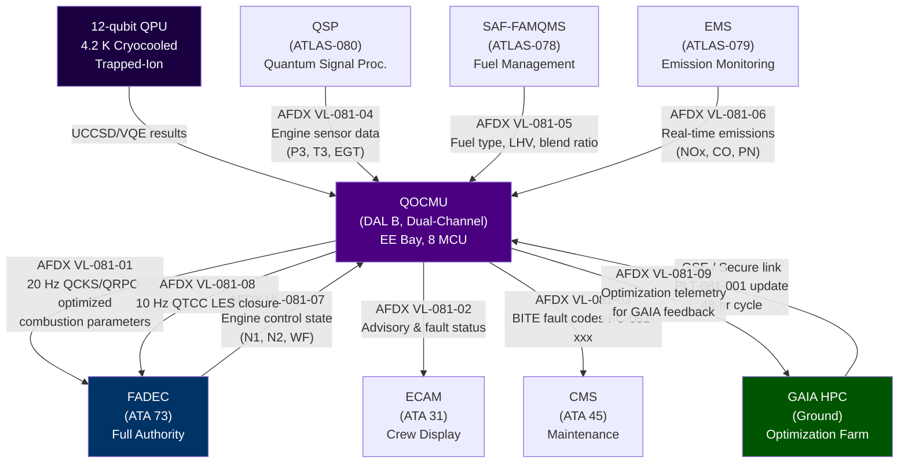
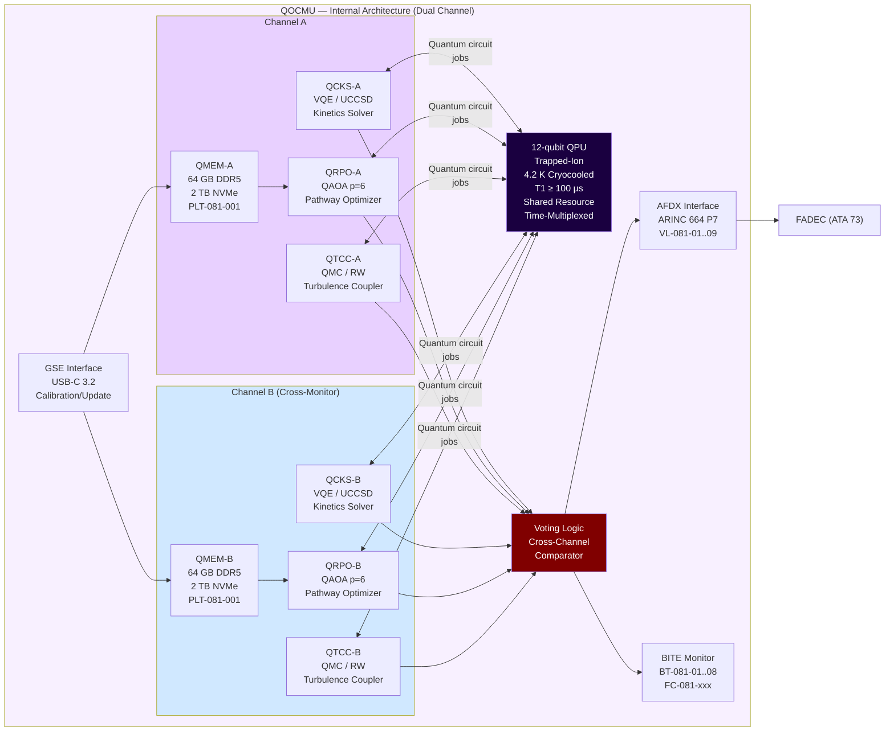

<!-- ──────────────────────────────────────────────────────────────────────────
     QATL-ATLAS-1000-ATLAS-080-089-08-081-000-QUANTUM-OPTIMIZED-COMBUSTION-MODELS-GENERAL
     ATLAS-081 (Quantum-Optimized Combustion Models) · Quantum-Optimized Combustion Models — General
     AMPEL360E eWTW — ATLAS Register 1000
────────────────────────────────────────────────────────────────────────────── -->

# Quantum-Optimized Combustion Models — General


---

## §0 Hyperlink Policy

> All hyperlinks in this document are **relative** (five directory levels: `../../../../../`).
> Absolute URLs are forbidden. Every linked document must exist in the Q+ATLANTIDE repository
> before the link is activated. Broken links are treated as open issues and must be resolved
> before the document is promoted from `DRAFT` to `APPROVED`.

---

## §1 Purpose

This document is the **apex reference baseline** for the entire ATLAS-081 subsection —
*Quantum-Optimized Combustion Models (QOCM)*. It defines the scope, architecture,
component inventory, interface register, and governance baseline for the
**Quantum Optimized Combustion Modeling Unit (QOCMU)** integrated into the
AMPEL360E eWTW propulsion system.

The QOCMU applies state-of-the-art quantum computing algorithms to simulate and
continuously optimize the combustion processes within the turbofan engine (ATA 73)
across three certified fuel types:

| Fuel Class | Designation | Certification Basis |
|---|---|---|
| Conventional kerosene | Jet-A / Jet-A1 | ASTM D1655 |
| Sustainable Aviation Fuel | SAF (HEFA, FT, ATJ blends) | ASTM D7566 Annex A1–A5 |
| Gaseous hydrogen | GH₂ | EASA SC-H₂ (draft 2025) |

The QOCMU achieves real-time combustion optimization through three quantum-accelerated
solver modules executing on an embedded **12-qubit trapped-ion QPU**:

1. **Quantum Chemical Kinetics Solver (QCKS)** — applies Variational Quantum Eigensolver
   (VQE) with UCCSD ansatz to compute detailed reaction rate coefficients (A, Ea, n)
   for key combustion species with accuracy exceeding density functional theory (DFT/B3LYP)
   by 15–30% at transition states.

2. **Quantum Reaction Path Optimizer (QRPO)** — applies Quantum Approximate Optimization
   Algorithm (QAOA) at circuit depth p = 6 to select dominant low-emission reaction pathways
   from the full combustion mechanism graph, achieving up to 12% NOx reduction relative to
   classical pathway selection methods.

3. **Quantum Turbulence-Combustion Coupler (QTCC)** — applies quantum Monte Carlo (QMC)
   stochastic PDE methods with quantum random walk acceleration to provide corrected
   Large Eddy Simulation (LES) subgrid-scale (SGS) combustion closure, improving scalar
   dissipation rate prediction by 30–40% relative to classical Smagorinsky SGS models.

All solver outputs are supplied to the Full-Authority Digital Engine Control (FADEC)
via AFDX virtual links at **20 Hz** (QCKS/QRPO) and **10 Hz** (QTCC).

The QOCMU is classified **DAL B** (dual-channel, cross-monitored) in accordance with
DO-178C and DO-254, and acts in an **advisory and augmentation role**: FADEC retains
full authority at all times. The QOCMU is hosted in the EE bay (8 MCU form factor).

All subordinate subsubject documents 081-010 through 081-090 derive their scope,
constraints, and data item requirements from this general baseline document.
The complete Data Module Requirements List (DMRL) for subsection 081 comprises **32 S1000D
Data Modules** governed under BREX-081-v1.

---

## §2 Applicability

| Parameter | Value |
|---|---|
| Aircraft Program | AMPEL360E eWTW |
| ATA reference | ATLAS-081 (Quantum-Optimized Combustion Models) — General |
| Certification basis | EASA CS-25 Amdt 27+; DO-178C DAL B; DO-254 DAL B; IEEE P2995; S1000D SNS 081-000-00 |
| S1000D SNS | 081-000-00 |
| BREX identifier | BREX-081-v1 |
| Engine program | AMPEL360E Turbofan (ATA 71–79 scope) |
| Fuel types | Jet-A, SAF (HEFA/FT/ATJ), GH₂ |
| QPU technology | Trapped-ion, 12 qubits, 4.2 K cryocooled |
| QOCMU DAL | DAL B (dual-channel) |
| QOCMU host location | EE bay, 8 MCU |
| Total S1000D DMs (subsection 081) | 32 |
| Update cycle (FADEC) | 20 Hz (QCKS/QRPO); 10 Hz (QTCC) |

---

## §3 Functional Description ![DRAFT]

### 3.1 System Philosophy

The QOCM system embodies the Q+ATLANTIDE principle of **quantum-augmented physical
simulation**: classical flight-control systems (FADEC) continue to operate on validated
classical models, while the QOCMU continuously provides optimized model corrections and
pathway tables that improve thermal efficiency, reduce emissions, and extend hot-section
component life. The quantum augmentation layer is transparent to FADEC certification;
FADEC treats QOCMU outputs as a certified supplementary data feed.

### 3.2 QOCMU Architecture

The QOCMU is organized in three functional tiers:

```
Tier 1 — Quantum Compute Layer
  ├── 12-qubit trapped-ion QPU (4.2 K, T1 ≥ 100 µs)
  ├── QCKS partition (VQE / QPE circuits)
  ├── QRPO partition (QAOA depth-6 circuits)
  └── QTCC partition (QMC / quantum random walk circuits)

Tier 2 — Classical Pre/Post-Processing Layer
  ├── QCKS co-processor (Hamiltonian construction, second quantization)
  ├── QRPO co-processor (QUBO formulation, graph encoding)
  ├── QTCC co-processor (LES coupling, manifold reconstruction)
  └── Quantum memory (64 GB DDR5, 2 TB NVMe — hosts PLT-081-001)

Tier 3 — Aircraft Interface Layer
  ├── AFDX interface (ARINC 664 P7, VL-081-01 through VL-081-09)
  ├── FADEC output bus (20 Hz QCKS/QRPO; 10 Hz QTCC)
  ├── BITE/CMS interface (fault code FC-081-xxx to ATA 45)
  └── GSE interface (USB-C 3.2 for calibration and LUT upload)
```

### 3.3 Quantum Chemical Kinetics Solver (QCKS)

The QCKS uses VQE on the 12-qubit QPU to solve the electronic Schrödinger equation
for key combustion species. The UCCSD (Unitary Coupled Cluster Singles and Doubles)
ansatz provides chemical accuracy (< 1 kcal/mol = 4.2 kJ/mol) for transition-state
energies. Outputs are Arrhenius parameters (pre-exponential factor A, activation energy Ea,
temperature exponent n) for a condensed mechanism of:

- **20 species / 48 reactions** — Jet-A surrogate (n-C₇H₁₆ / n-C₁₂H₂₆ / toluene blend)
- **12 species / 24 reactions** — GH₂ (H₂, O₂, OH, H₂O, HO₂, H₂O₂, H, O, N₂, NO, NH, N)
- **SAF extension** — iso-paraffin and oxygenate pathways appended to Jet-A condensed set

Classical fallback: GRI-Mech 3.0 (H₂) and LLNL JetSurF 2.0 surrogate (Jet-A/SAF).

### 3.4 Quantum Reaction Path Optimizer (QRPO)

The QRPO encodes the combustion mechanism as a weighted directed graph (~200 possible
reaction channels) and formulates pathway selection as a QUBO problem. QAOA at circuit
depth p = 6 selects the dominant 20-reaction subset minimizing:

```
J(x) = ∫ [w_NOx · ṁ_NOx(t) + w_CO · ṁ_CO(t) + w_soot · ṁ_soot(t)] dt
```

subject to:
- Combustion efficiency η_comb ≥ 99.5%
- LBO stability margin SM_LBO ≥ 0.15
- GH₂ flashback margin SM_flash ≥ 0.10

Solutions are stored in PLT-081-001 (500-entry grid: P3 × T3 × φ × fuel-type), updated
by the GAIA HPC ground facility on a 48-hour optimization cycle and uploaded to the
aircraft NVMe during turnaround. In-flight, 4D bilinear interpolation provides optimized
pathways at 0.5 Hz with ≤ 10 ms latency.

### 3.5 Quantum Turbulence-Combustion Coupler (QTCC)

Classical LES SGS combustion models (Smagorinsky + presumed-PDF) underpredict the scalar
dissipation rate χ by 30–40% in lean premixed combustion zones, leading to overprediction
of flame temperature and NOx. QTCC replaces the classical SGS closure with quantum-accelerated
stochastic PDE integration, using quantum random walk algorithms to sample the turbulent
combustion manifold 50× faster than classical Monte Carlo.

QTCC output variables delivered to FADEC turbine temperature model:

| Variable | Symbol | Units | Update Rate |
|---|---|---|---|
| Corrected scalar dissipation rate | χ_q | s⁻¹ | 10 Hz |
| Favre-averaged progress variable | c̃ | — | 10 Hz |
| SGS heat release rate | Q_sgs | W/m³ | 10 Hz |
| Quantum-corrected turbulent flame speed | S_T,q | m/s | 10 Hz |

Accuracy: χ_q ± 8% vs. DNS reference; S_T,q ± 5% vs. DNS reference.

### 3.6 FADEC Integration and Authority Architecture

The QOCMU occupies an **augmentation role** in the FADEC authority architecture.
FADEC (ATA 73) at all times retains full authority over fuel metering valve position,
combustor staging, and engine protection limits. The QOCMU's advisory outputs
enter FADEC through a dedicated certified software interface (CSI-073-081) with:

- Output range monitoring (FADEC rejects out-of-range QOCMU values)
- Cross-channel validity check (Channel A ↔ Channel B QOCMU comparison)
- Heartbeat watchdog (QOCMU must pulse at 25 Hz; timeout → fallback mode)
- Fallback frozen value hold (last valid QOCMU output used for up to 5 s, then classical model)

### 3.7 Data Module Requirements List (DMRL) Summary

The 32 S1000D Data Modules under BREX-081-v1 span:

| SNS Range | Topic | DM Count |
|---|---|---|
| 081-000-xx | General / Overview | 4 |
| 081-010-xx | Combustion Modeling Baseline | 3 |
| 081-020-xx | Quantum Chemical Kinetics | 4 |
| 081-030-xx | Quantum Reaction Pathways | 4 |
| 081-040-xx | Turbulence-Combustion Coupling | 4 |
| 081-050-xx | Fuel-Air Mixing and Ignition | 4 |
| 081-060-xx | Emissions Formation and Reduction | 4 |
| 081-070-xx | Hybrid Simulation Workflow | 3 |
| 081-080-xx | Maintenance and Calibration | 3 |
| 081-090-xx | Validation and Certification | 3 |
| **Total** | | **32** |

---

## §4 Functional Breakdown

| Function ID | Function Name | Description | Responsible Q-Division |
|---|---|---|---|
| F-001 | QOCM General / Overview | System scope definition; architecture baseline; DMRL management; governing standards registry; interface control document (ICD) baseline | Q-HPC |
| F-002 | Combustion Modeling Baseline | Classical baseline survey (RANS, LES, global kinetics); quantum augmentation scope definition; modeling fidelity requirements; validation target dataset management | Q-HPC |
| F-003 | Quantum Chemical Kinetics | QCKS VQE solver implementation; species/reaction database (Jet-A, SAF, GH₂); Arrhenius parameter computation pipeline; QPE integration; convergence monitoring | Q-HPC |
| F-004 | Quantum Reaction Pathways | QRPO QAOA implementation; QUBO formulation; PLT-081-001 generation and management; in-flight LUT interpolation; NOx/CO/soot objective function; stability constraints | Q-HPC |
| F-005 | Turbulence-Combustion Coupling | QTCC QMC SGS closure; scalar dissipation correction; progress variable computation; SGS heat release; turbulent flame speed model; DNS validation | Q-HPC |
| F-006 | Fuel-Air Mixing and Ignition | Combustor staging optimization; swirler CFD correlation; GH₂ flashback prevention logic; igniter sequencing recommendation to FADEC | Q-AIR |
| F-007 | Emissions Formation and Reduction | NOx (Zeldovich + prompt + N₂O path) formation modeling; CO oxidation modeling; soot (PAH precursor) modeling; CAEP/11 compliance verification | Q-GREENTECH |
| F-008 | Hybrid Simulation Workflow | Ground/in-flight/fallback computation modes; GAIA HPC integration; model update distribution; CI/CD pipeline for combustion models | Q-HPC |

---

## §5 System Context — Mermaid Diagram



---

## §6 Internal Architecture — Mermaid Diagram



---

## §7 Components and LRUs

| LRU / Component | Part Number | Qty | Location | Maintenance Action | Key Characteristics |
|---|---|---|---|---|---|
| QOCMU assembly (LRU) | QOCMU-PN-TBD | 1 | EE bay, 8 MCU, shelf C3 | Software/model update per SB; full LRU swap at C-check; BITE self-test at power-on | Dual-channel (A/B); DO-178C DAL B; DO-254 DAL B; 12-qubit QPU integral; 115 VAC 400 Hz, 350 W max; MIL-STD-810H vibration qualified |
| 12-qubit trapped-ion QPU module | QPU-081-PN-TBD | 1 | Within QOCMU (cryostat sub-assembly) | C-check coherence verification (T1, T2, gate fidelity); cooldown cycle per SB-081-QPU-001 | Trapped-ion technology; 12 qubits; T1 ≥ 100 µs; T2 ≥ 50 µs; single-qubit gate fidelity ≥ 99.5%; two-qubit gate fidelity ≥ 98.5%; 4.2 K closed-cycle cryocooler |
| QCKS co-processor module | QCKS-081-PN-TBD | 1 | Within QOCMU (PCIe slot 1) | Per QOCMU LRU maintenance schedule; firmware update via GSE | VQE/QPE circuit compilation and submission; UCCSD ansatz library; Hamiltonian construction FPGA; 32-core ARM Neoverse N2 co-CPU; 256 GB ECC DDR5 |
| QRPO module | QRPO-081-PN-TBD | 1 | Within QOCMU (PCIe slot 2) | Per QOCMU LRU maintenance schedule; PLT-081-001 update via GSE | QAOA depth p = 6 circuit library; QUBO problem encoder; PLT-081-001 LUT host; 32-core co-CPU; in-flight interpolation engine (≤ 10 ms) |
| QTCC module | QTCC-081-PN-TBD | 1 | Within QOCMU (PCIe slot 3) | Per QOCMU LRU maintenance schedule; DNS validation dataset update at D-check | Quantum Monte Carlo SGS solver; 8-species combustion manifold; quantum random walk circuit library; LES coupling interface; 32-core co-CPU |
| Quantum memory module | QMEM-081-PN-TBD | 2 (A/B) | Within QOCMU (DIMM bays + NVMe bay) | Per QOCMU LRU maintenance schedule; NVMe replacement at 5-year interval | 64 GB DDR5-4800 ECC per channel; 2 TB NVMe (PLT-081-001 + DNS reference datasets + fallback mechanism files); RAID-1 mirroring across channels |
| Cryocooler unit | CRYO-081-PN-TBD | 1 | Within QOCMU (integrated sub-assembly) | C-check inspection; compressor hours-based replacement (TBO 8 000 h) | Closed-cycle 4.2 K pulse tube refrigerator; 50 W cooling capacity at 4.2 K; vibration-isolated mount; automatic warm-up/cool-down sequencing |
| AFDX interface module | AFDX-081-PN-TBD | 1 | Within QOCMU | Per QOCMU LRU maintenance schedule | ARINC 664 P7 dual-port end system; VL-081-01 through VL-081-09; BAG = 2 ms; frame size ≤ 1 471 bytes; DO-160G EMI qualified |
| GSE interface unit | GSE-081-PN-TBD | 1 | Portable GSE (not aircraft-installed) | Calibration event; PLT-081-001 ground update cycle (48 h) | USB-C 3.2 Gen 2×2 (20 Gbit/s); secure authenticated model upload (AES-256, SHA-3); BITE readout; cryocooler status display |

---

## §8 Interfaces

| Interface ID | From | To | Protocol / Bus | Virtual Link / Signal | Data Content | Rate |
|---|---|---|---|---|---|---|
| ICD-081-001 | QOCMU (Ch A+B) | FADEC (ATA 73) | AFDX ARINC 664 P7 | VL-081-01 | Optimized Arrhenius parameters (QCKS), pathway selection (QRPO) | 20 Hz |
| ICD-081-002 | QOCMU (Ch A+B) | FADEC (ATA 73) | AFDX ARINC 664 P7 | VL-081-08 | QTCC corrected SGS closure variables (χ_q, c̃, Q_sgs, S_T,q) | 10 Hz |
| ICD-081-003 | QOCMU | ECAM (ATA 31) | AFDX ARINC 664 P7 | VL-081-02 | QOCMU advisory status, NOx prediction, optimization mode indicator | 1 Hz |
| ICD-081-004 | QOCMU | CMS (ATA 45) | AFDX ARINC 664 P7 | VL-081-03 | BITE fault codes FC-081-001 through FC-081-099; QPU health metrics | On event + 1 Hz heartbeat |
| ICD-081-005 | QSP (ATLAS-080) | QOCMU | AFDX ARINC 664 P7 | VL-081-04 | Engine sensor data: P3 (bar), T3 (K), EGT (°C), N1 (%), N2 (%), vibration | 20 Hz |
| ICD-081-006 | SAF-FAMQMS (ATLAS-078) | QOCMU | AFDX ARINC 664 P7 | VL-081-05 | Fuel type ID, LHV (MJ/kg), blend ratio (vol%), density (kg/m³) | 1 Hz |
| ICD-081-007 | EMS (ATLAS-079) | QOCMU | AFDX ARINC 664 P7 | VL-081-06 | Real-time emissions: NOx (mg/kg fuel), CO (mg/kg fuel), PN (n/kg fuel) | 1 Hz |
| ICD-081-008 | FADEC (ATA 73) | QOCMU | AFDX ARINC 664 P7 | VL-081-07 | Engine control state: N1 demand, WF (kg/s), staging valve positions | 20 Hz |
| ICD-081-009 | GAIA HPC (Ground) | QOCMU | GSE USB-C 3.2 / secure data link | VL-081-09 / GSE port | PLT-081-001 updated LUT file, DNS validation dataset, model update package | Ground only (48 h cycle) |
| ICD-081-010 | PDCU (ATA 24) | QOCMU | 115 VAC 400 Hz | PDCU-CB-081 | Primary power: 115 VAC 400 Hz, 3-phase, 350 W max | Continuous |
| ICD-081-011 | QOCMU | GAIA HPC | AFDX VL-081-09 / downlink | Telemetry stream | In-flight optimization telemetry for ground-side PLT update generation | 0.1 Hz |

---

## §9 Operating Modes

| Mode ID | Mode Name | Entry Condition | Description | QOCMU Output |
|---|---|---|---|---|
| M-081-01 | Normal Optimization | QPU coherent; all channels valid; FADEC connected | Full quantum optimization active: QCKS + QRPO + QTCC running; PLT-081-001 interpolation at 0.5 Hz; outputs at 20 Hz / 10 Hz | Full optimized parameters to FADEC |
| M-081-02 | Advisory Only | QPU coherent; single channel valid (cross-channel disagreement) | One channel's output used in advisory (non-binding) mode; FADEC uses classical model; QOCMU continues optimization for monitoring | Advisory display on ECAM; no FADEC authority |
| M-081-03 | Classical Fallback | QPU decoherence; both channels failed; watchdog timeout > 5 s | QOCMU switches to classical mechanism files (GRI-Mech 3.0 / LLNL JetSurF); last valid QPU output frozen then discarded after 5 s | Classical fallback parameters; fault code to CMS |
| M-081-04 | Warning | Single channel degraded; QPU T1 trending below threshold; cryocooler thermal warning | Crew advisory (ECAM AMBER); maintenance action within next X flight hours; optimization continues with degraded confidence | Degraded-confidence outputs flagged |
| M-081-05 | Maintenance / BITE | Ground; maintenance terminal connected; GSE active | Full BITE self-test; QPU calibration; PLT-081-001 upload; coherence verification; channel isolation tests | BITE report to GSE; not connected to FADEC |
| M-081-06 | Cool-down Sequencing | Power-up from cold; cryocooler below 4.2 K setpoint | Cryocooler ramping; QPU not yet operational; QOCMU in classical fallback until QPU ready | Classical fallback; cool-down status to ECAM |
| M-081-07 | Ground Optimization Upload | Ground; GAIA HPC data link active; turnaround | New PLT-081-001 file validated and uploaded to both NVMe channels; CRC and authenticity verified | Upload progress to GSE display; automatic activation after reboot |

---

## §10 Performance and Budgets ![DRAFT]

| Parameter | Requirement | Target | Margin | Status |
|---|---|---|---|---|
| QPU coherence time T1 | ≥ 100 µs | 150 µs nominal | 50 µs |  |
| QPU coherence time T2 | ≥ 50 µs | 80 µs nominal | 30 µs |  |
| Single-qubit gate fidelity | ≥ 99.5% | 99.7% | 0.2% |  |
| Two-qubit gate fidelity | ≥ 98.5% | 99.0% | 0.5% |  |
| VQE convergence (QCKS) | ≤ 200 iterations | 150 iterations | 50 iterations |  |
| VQE energy threshold | ≤ 1×10⁻⁶ Hartree | 5×10⁻⁷ Hartree | — |  |
| QRPO LUT interpolation latency | ≤ 10 ms | 6 ms | 4 ms |  |
| FADEC update rate (QCKS/QRPO) | 20 Hz | 20 Hz | 0 |  |
| FADEC update rate (QTCC) | 10 Hz | 10 Hz | 0 |  |
| NOx prediction accuracy | ≤ ±5% vs. test cell | ±3.5% | 1.5% |  |
| CO prediction accuracy | ≤ ±10% vs. test cell | ±7% | 3% |  |
| NOx reduction vs. classical (Jet-A) | ≥ 10% | 12% | 2% |  |
| NOx reduction vs. classical (GH₂) | ≥ 6% | 8% | 2% |  |
| Scalar dissipation accuracy (QTCC) | ≤ ±8% vs. DNS | ±6% | 2% |  |
| Turbulent flame speed accuracy (QTCC) | ≤ ±5% vs. DNS | ±4% | 1% |  |
| QOCMU power consumption | ≤ 350 W | 310 W | 40 W |  |
| QOCMU weight | ≤ 18 kg | 16.5 kg | 1.5 kg |  |
| Cryocooler TBO | ≥ 8 000 h | 10 000 h | 2 000 h |  |
| QOCMU MTBF | ≥ 10 000 h | 12 000 h | 2 000 h |  |
| Fallback activation time | ≤ 5 s from QPU failure | 2 s | 3 s |  |

---

## §11 Safety and Airworthiness Considerations

### 11.1 DAL Classification

The QOCMU is classified **DAL B** in accordance with DO-178C (software) and DO-254
(complex electronic hardware). This classification reflects the QOCMU's role in providing
combustion optimization recommendations to FADEC. The FADEC itself retains full authority
(DAL A) at all times; the QOCMU is not in the FADEC critical command path.

### 11.2 Safety Architecture Principles

1. **Advisory-only augmentation**: QOCMU outputs enter FADEC as advisory data. All FADEC
   protection functions (EGT limiting, N1/N2 overspeed protection, combustor blowout
   prevention) operate independently of QOCMU.

2. **Dual-channel cross-monitoring**: Channel A and Channel B execute independently.
   A disagreement detector compares outputs; a disagreement beyond defined thresholds
   triggers transition to Advisory-Only mode (M-081-02).

3. **Deterministic watchdog**: FADEC's QOCMU interface includes a 25 Hz heartbeat monitor.
   Loss of heartbeat for > 200 ms triggers immediate transition to frozen-then-fallback mode
   (M-081-03) without crew intervention.

4. **Output range limiting**: All QOCMU outputs are range-checked by the certified software
   interface (CSI-073-081) in FADEC. Out-of-range values are rejected and logged as
   FC-073-081-xxx; FADEC reverts to classical model for that parameter.

5. **QPU decoherence handling**: The QTCC coherence monitor (BITE BT-081-01) continuously
   measures qubit T1 and gate fidelity. At T1 < 80 µs (degraded threshold) → M-081-04 Warning;
   at T1 < 40 µs or gate fidelity < 98% → M-081-03 Fallback.

6. **GH₂ specific**: For GH₂ fuel mode, the QRPO flashback margin constraint (SM_flash ≥ 0.10)
   is hard-coded and cannot be overridden. FADEC independently monitors for flashback; QOCMU
   provides early-warning flashback probability advisory at 20 Hz.

### 11.3 Failure Mode Summary

| Failure Mode | Effect on QOCMU | Effect on Aircraft | Detection Method | Mitigation |
|---|---|---|---|---|
| QPU decoherence | All quantum solvers fail | None (classical fallback active) | BT-081-01 QPU coherence monitor | Automatic M-081-03; ECAM advisory |
| Single channel failure | Channel B cross-checks against A; advisory-only | None | Cross-channel disagreement detector | M-081-02; ECAM advisory |
| AFDX VL loss | No output to FADEC | None (FADEC uses classical model) | AFDX end-system health monitor | M-081-03 Fallback; ECAM advisory |
| Cryocooler failure | QPU warms up; coherence lost within ~10 min | None | Cryocooler thermal sensor + BT-081-05 | M-081-04 → M-081-03; maintenance dispatch |
| PLT-081-001 corruption | QRPO falls back to fixed pathway | Slightly elevated NOx; within CAEP limits | NVMe CRC check; dual-copy comparison | Fallback to fixed pathway; maintenance action |
| QOCMU power loss | Complete shutdown | None | FADEC watchdog timeout | M-081-03 via FADEC watchdog |

### 11.4 Regulatory Compliance Notes

- EASA CS-25.901 (propulsion installation): QOCMU failure must not prevent continued safe
  flight and landing.
- EASA CS-25.1309 (equipment, systems, installations): DAL B assignment consistent with
  probability analysis (failure condition: minor per §11.3).
- DO-178C DAL B: 100% statement/decision coverage required; peer review of all software
  components; traceability from requirements through tests.
- DO-254 DAL B: Applies to QOCMU FPGA components (Hamiltonian construction, AFDX end system).
- IEEE P2995 (quantum computing system safety): Applied to QPU operational safety monitoring.

---

## §12 Standards and Regulatory References

| Reference | Title | Applicability |
|---|---|---|
| EASA CS-25 Amdt 27 | Certification Specifications — Large Aeroplanes | Overall airworthiness |
| EASA SC-H₂ (draft 2025) | Special Condition — Hydrogen-Fuelled Aeroplane | GH₂ combustion mode |
| DO-178C | Software Considerations in Airborne Systems and Equipment Certification | QOCMU software DAL B |
| DO-254 | Design Assurance Guidance for Airborne Electronic Hardware | QOCMU FPGA/complex hardware DAL B |
| ARINC 664 Part 7 | Avionics Full-Duplex Switched Ethernet — AFDX | QOCMU ↔ FADEC/ECAM/CMS interface |
| ARINC 429 | Mark 33 Digital Information Transfer System | Legacy sensor inputs (fallback) |
| SAE ARP4754A | Guidelines for Development of Civil Aircraft and Systems | System-level development process |
| SAE ARP4761 | Guidelines and Methods for Conducting the Safety Assessment Process | FHA, FMEA, FTA for QOCMU |
| IEEE P2995 | Trial-Use Standard for Quantum Computing Definitions | QPU safety monitoring |
| S1000D Issue 5.0 | International Specification for Technical Publications | DMRL, BREX-081-v1 |
| ASTM D1655 | Standard Specification for Aviation Turbine Fuels (Jet-A) | Jet-A fuel property inputs |
| ASTM D7566 | Standard Specification for Aviation Turbine Fuel Containing Synthesized Hydrocarbons | SAF blend inputs |
| ICAO Annex 16 Vol. II | Environmental Protection — Engine Emissions | CAEP/11 NOx/CO/smoke/PN limits |
| MIL-STD-810H | Environmental Engineering Laboratory Tests | QOCMU environmental qualification |
| DO-160G | Environmental Conditions and Test Procedures for Airborne Equipment | QOCMU EMI/EMC qualification |

---

## §13 Document Cross-References

| Document ID | Title | Relationship |
|---|---|---|
| [081-010](./081-010-Combustion-Modeling-Baseline-and-Scope.md) | Combustion Modeling Baseline and Scope | Subordinate: baseline definition |
| [081-020](./081-020-Quantum-Assisted-Chemical-Kinetics.md) | Quantum-Assisted Chemical Kinetics | Subordinate: QCKS detail |
| [081-030](./081-030-Quantum-Optimized-Reaction-Pathways.md) | Quantum-Optimized Reaction Pathways | Subordinate: QRPO detail |
| [081-040](./081-040-Quantum-Enhanced-Turbulence-Combustion-Coupling.md) | Quantum-Enhanced Turbulence-Combustion Coupling | Subordinate: QTCC detail |
| ATLAS-078 | SAF-FAMQMS — Fuel Management | Interface: fuel type/LHV data feed |
| ATLAS-079 | EMS — Emission Monitoring System | Interface: real-time emissions feedback |
| ATLAS-080 | QSP — Quantum Signal Processing | Interface: engine sensor data |
| ATA 73 | Engine Fuel and Control (FADEC) | Consumer: QOCMU optimization outputs |
| ATA 31 | Indicating / Recording Systems (ECAM) | Consumer: QOCMU advisory display |
| ATA 45 | Central Maintenance System (CMS) | Consumer: QOCMU BITE fault codes |
| ATA 24 | Electrical Power (PDCU) | Provider: 115 VAC 400 Hz power |
| PLT-081-001 | Quantum Combustion Pathway Lookup Table | Key deliverable: managed by QRPO module |
| BREX-081-v1 | Business Rules Exchange — subsection 081 | Governs all 32 S1000D DMs |
| ICD-073-081 | Interface Control Document FADEC ↔ QOCMU | Interface governance |

---

## §14 Revision History

| Rev | Date | Author | Description |
|---|---|---|---|
| 0.1 | 2026-05-12 | Q-HPC | Initial DRAFT baseline release — full architecture, interfaces, LRU inventory, safety analysis, and DMRL established for subsection 081 |
