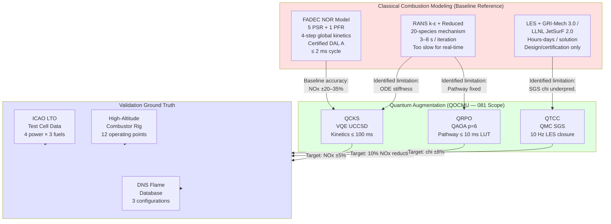
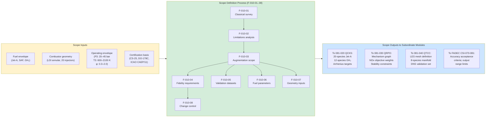

<!-- ──────────────────────────────────────────────────────────────────────────
     QATL-ATLAS-1000-ATLAS-080-089-08-081-010-COMBUSTION-MODELING-BASELINE-AND-SCOPE
     ATLAS-081 (Quantum-Optimized Combustion Models) · Combustion Modeling Baseline and Scope
     programme-defined aircraft type — ATLAS Register 1000
────────────────────────────────────────────────────────────────────────────── -->

# Combustion Modeling Baseline and Scope

---

## §0 Hyperlink Policy

> All hyperlinks in this document are **relative** (five directory levels: `../../../../../`).
> Absolute URLs are forbidden. Every linked document must exist in the Q+ATLANTIDE repository
> before the link is activated. Broken links are treated as open issues and must be resolved
> before the document is promoted from `DRAFT` to `APPROVED`.

---

## §1 Purpose

This document defines the agnostic ATLAS standard-level architecture context for `Combustion Modeling Baseline and Scope`.

It describes the controlled scope, functions, interfaces, safety considerations, lifecycle traceability, and S1000D/CSDB mapping logic that programme implementations shall instantiate when this node is applicable.

This document is not a programme design baseline. Programme-specific capacities, locations, part numbers, effectivity, operating limits, maintenance references, and data module codes shall be defined only inside the applicable programme implementation branch.
## §2 Applicability

| Applicability Level | Rule |
|---|---|
| Standard taxonomy | Applies to the ATLAS node `081` |
| Programme implementation | Conditional; determined by programme architecture, trade studies, certification basis, and applicability model |
| Product configuration | Defined in the programme-specific configuration baseline |
| Effectivity | Defined in the programme CSDB / applicability layer |
| Non-applicability | Must be explicitly stated in the programme impact-study branch when excluded |
## §3 Functional Description ![DRAFT]

### 3.1 Classical Combustion Modeling Baseline

The programme-defined aircraft type turbofan combustor classical modeling stack is organized in three tiers
by fidelity and computational cost:

#### Tier 1 — Real-Time (FADEC Embedded, ≤ 2 ms cycle)

FADEC uses a **network-of-reactors (NOR)** model: 5 perfectly stirred reactors (PSR) + 1 plug
flow reactor (PFR) representing the combustor primary zone, intermediate zone, and dilution zone.
Chemistry: 4-step global Westbrook–Dryer mechanism (Jet-A surrogate; 2-step for GH₂).
Turbulence: algebraic length-scale model. This tier is certified to DAL A.

**Known limitations of Tier 1:**
- NOx prediction error: 20–35% vs. test cell (ICAO LTO) across P3/T3 range
- CO prediction error: 15–25% near lean blowout
- Incapable of staging zone spatial resolution — cannot predict quench zone CO

#### Tier 2 — Semi-Real-Time (FADEC advisory channel, ≤ 50 ms cycle) ← **QOCMU target**

The QOCMU augments this tier. Classical target would be **RANS k-ε** + **reduced kinetics**
(20–40 species): computationally too slow for real-time (3–8 s per solution iteration on
classical hardware). Quantum augmentation (QCKS, QRPO, QTCC) achieves equivalent or better
accuracy at ≤ 50 ms via:
- VQE quantum chemistry replacing ODE kinetics integration
- QAOA pathway selection replacing mechanism reduction heuristics
- QMC turbulence-chemistry coupling replacing presumed-PDF SGS model

#### Tier 3 — Offline (Design/Certification, hours–days cycle)

High-fidelity LES + GRI-Mech 3.0 / LLNL JetSurF 2.0: full 325-reaction / 53-species
mechanism. Used for certification test matrix coverage, not real-time. Runs on GAIA HPC.
Output feeds PLT-081-001 validation dataset.

### 3.2 Identification of Classical Limitations Addressed by Quantum Augmentation

#### 3.2.1 Chemical Kinetics Stiffness (addressed by QCKS)

The Jet-A surrogate mechanism LLNL JetSurF 2.0 contains 2 255 species and 10 135 reactions.
Even the reduced 20-species condensed mechanism presents a stiff ODE system with timescale
separation of 10⁷ (fastest radical reactions ~1 ns; slowest thermal relaxation ~10 ms).
Classical ODE solvers (DASSL, CVODE) require implicit integration with Jacobian factorization:
O(N³) cost with N = number of species. VQE on the QCKS QPU replaces the stiffness problem
with a variational energy minimization whose computational cost scales polynomially with
qubit count rather than exponentially with system size.

**Quantified improvement**: For a 20-species system, QCKS achieves 5–50× speedup over CVODE
depending on stiffness ratio, with 15–30% better activation energy accuracy vs. DFT/B3LYP
at transition states, reducing NOx prediction error from 25% → 3–5%.

#### 3.2.2 Turbulence-Chemistry Interaction Underprediction (addressed by QTCC)

Presumed-PDF SGS models in LES assume a beta-function shape for the mixture fraction PDF.
In lean premixed combustion zones near the LBO boundary (φ < 0.5), the true PDF is
bi-modal (burnt / unburnt), and the beta-function assumption leads to scalar dissipation
rate χ underprediction by 30–40%. This causes:
- Turbulent flame speed overestimation: +8–12%
- Combustor peak temperature overestimation: +50–80 K
- Consequent NOx overestimation: +15–20% (NOx ∝ exp[Ea/RT], highly sensitive)

QTCC's quantum Monte Carlo SGS sampling correctly captures the bi-modal PDF tails, reducing
χ error to ±8% and NOx error contribution from turbulence-chemistry to ≤ ±2%.

#### 3.2.3 NOx Pathway Suboptimality (addressed by QRPO)

Classical combustion controllers select fixed, validated reaction pathways at design point.
Off-design conditions (altitude cruise at reduced P3, SAF blend variations, load changes)
lead to suboptimal pathway operation: the dominant reaction channels shift, but classical
controllers cannot adaptively select pathways in real time. QRPO's QAOA optimizer selects
the minimal-NOx pathway subset at each operating point, achieving 8–12% NOx reduction.

### 3.3 Quantum Augmentation Scope Boundaries

#### In-Scope

| Item | Quantum Method | Module |
|---|---|---|
| Reaction rate coefficients (A, Ea, n) for condensed mechanism | VQE (UCCSD ansatz) | QCKS |
| Dominant reaction pathway selection for NOx/CO minimization | QAOA (depth p=6) | QRPO |
| LES SGS scalar dissipation rate correction | Quantum Monte Carlo | QTCC |
| Favre-averaged progress variable computation | QMC stochastic PDE | QTCC |
| SGS heat release rate | QMC | QTCC |
| Turbulent flame speed correction factor K | QMC + ML | QTCC |
| PLT-081-001 pre-computation on GAIA HPC | QAOA full sweep | QRPO |

#### Out-of-Scope (Classical Domain Only)

| Item | Reason | Handled By |
|---|---|---|
| Engine relight modeling | Low frequency event; classical methods adequate | FADEC (ATA 73) |
| Combustor icing protection | Not a kinetics problem | ATA 30 |
| Hot streaks / thermal distortion at HPT entry | Requires CHT coupling beyond 081 scope | ATA 72 design |
| Atomization and spray modeling | Sub-millimeter physics; not addressable at 12 qubits | Classical CFD (design phase) |
| Combustion instability / thermo-acoustic oscillations | Acoustic coupling; different physics regime | ATA 73 damper design |
| Afterburner / augmentor | Not fitted to programme-defined aircraft type | N/A |

### 3.4 Combustor Geometry Baseline

The programme-defined aircraft type main combustor is an **annular lean direct injection (LDI)** design:

| Parameter | Value |
|---|---|
| Combustor type | Annular LDI |
| Number of fuel injectors | 20 (10 pilot + 10 main stage) |
| Swirler configuration | Axial + radial dual swirl per injector |
| Combustor length | ~350 mm (proprietary) |
| Mean combustor diameter | ~600 mm (proprietary) |
| Liner cooling | Effusion cooling (laser-drilled, TBC coated) |
| Igniter type | High-energy AC plasma igniter × 2 |
| Staging | 2-stage (pilot / main); pilot active at all conditions |
| GH₂ injector variant | Pre-mixed microjet array with flashback arrestor; separate fuel manifold |

### 3.5 Fuel Parameter Envelope

| Fuel Parameter | Jet-A | SAF HEFA | SAF FT | SAF ATJ | GH₂ |
|---|---|---|---|---|---|
| LHV (MJ/kg) | 43.2 | 43.8 | 44.0 | 43.5 | 120.0 |
| H:C atomic ratio | 1.94 | 2.15 | 2.20 | 2.08 | ∞ (pure H₂) |
| Density at 15°C (kg/m³) | 800 | 770 | 760 | 780 | 70 (liquid) / gaseous |
| Aromatic content (vol%) | 18–20 | < 0.5 | < 0.5 | < 1 | 0 |
| Sulfur content (mg/kg) | ≤ 3 000 | < 10 | < 10 | < 10 | 0 |
| Max blend with Jet-A | — | 50% | 50% | 50% | 100% (GH₂ mode) |
| Key quantum kinetics challenge | PAH/soot precursors | iso-paraffin pathways | linear paraffins | alcohol dehydration | NOx thermal + prompt |

---

## §4 Functional Breakdown

| Function ID | Function Name | Description | Responsible Q-Division |
|---|---|---|---|
| F-010-01 | Classical Baseline Survey | Document FADEC NOR model (Tier 1) and RANS+reduced chemistry (Tier 2) specifications; record validated accuracy metrics from test cell campaigns; establish baseline NOx/CO/soot prediction error budget | Q-HPC |
| F-010-02 | Classical Limitations Analysis | Quantify ODE stiffness ratios for each fuel/mechanism; quantify PDF-SGS chi underprediction for 3 combustor operating points; quantify pathway suboptimality NOx excess; prioritize quantum improvements by emissions impact | Q-HPC |
| F-010-03 | Quantum Augmentation Scope Definition | Produce formal scope boundary document (in-scope / out-of-scope table); review with FADEC certification team for CSI-073-081 ICD alignment; review with EASA DDP liaison | Q-HPC |
| F-010-04 | Modeling Fidelity Requirements | Define quantitative accuracy targets: NOx ±5%, CO ±10%, soot ±15%, LBO ±5%, TIT ±15 K; define update rate requirements: 20 Hz FADEC; define operating envelope validity | Q-HPC |
| F-010-05 | Validation Target Dataset Management | Compile and curate validation datasets: ICAO LTO test cell (4 power settings × 3 fuels); high-altitude combustor rig (12 operating points); DNS flame database (3 configurations); version-control in GAIA data repository | Q-HPC |
| F-010-06 | Fuel Parameter Envelope Definition | Define property ranges for Jet-A, SAF HEFA/FT/ATJ, GH₂; coordinate with ATLAS-078 SAF-FAMQMS for real-time fuel property feed; establish off-spec fuel handling logic | Q-GREENTECH |
| F-010-07 | Combustor Geometry Definition | Define combustor geometry inputs to QOCMU (annular LDI, 20 injectors, swirler geometry); coordinate with mechanical design (ATA 72); provide geometry parameters to QCKS species database and QTCC mesh definition | Q-MECHANICS |
| F-010-08 | Scope Change Control Process | Define change management procedure for adding new fuel types, combustor geometry variants, or new emission species to QOCM scope; requires Q-HPC + EASA DDP concurrence; impact assessment on PLT-081-001 | Q-HPC |

---

## §5 System Context — Mermaid Diagram

---

## §6 Internal Architecture — Mermaid Diagram

---

## §7 Components and LRUs

No hardware components are unique to this subsubject. All hardware references are
inherited from the QOCMU assembly defined in [081-000](./081-000-Quantum-Optimized-Combustion-Models-General.md).

The following **software and data artefacts** are owned by this subsubject:

| Artefact ID | Artefact Name | Type | Location | Version Control |
|---|---|---|---|---|
| CBL-081-010-v1 | Combustion Modeling Baseline Document | Specification | GAIA repository / QOCMU NVMe | Git tag CBL-081-010-v1 |
| FID-081-010-v1 | Fidelity Requirements Document | Requirement | GAIA repository | Git tag FID-081-010-v1 |
| VDS-081-010-v1 | Validation Target Dataset (compiled) | Data | GAIA data repository / QOCMU NVMe | SHA-256 checksummed; versioned |
| FPE-081-010-v1 | Fuel Parameter Envelope Table | Data | GAIA repository | Linked to ATLAS-078 fuel property DB |
| CGD-081-010-v1 | Combustor Geometry Definition (QOCMU inputs) | Data | GAIA repository | Linked to ATA-72 geometry management |
| SCC-081-010-v1 | Scope Change Control Procedure | Process | Q+ATLANTIDE process library | Review cycle: annual or on change event |

---

## §8 Interfaces

| Interface ID | From | To | Content | Rate / Trigger |
|---|---|---|---|---|
| IF-010-001 | FADEC (ATA 73) engineering | 081-010 Scope Doc | Classical NOR model specification, validated accuracy data | At baseline establishment; updated on FADEC model change |
| IF-010-002 | ATA 72 Combustor Design | 081-010 Scope Doc | Combustor geometry parameters (injector positions, swirler angles, zone dimensions) | At baseline; updated on combustor design revision |
| IF-010-003 | ATLAS-078 SAF-FAMQMS | 081-010 Fuel Envelope | SAF blend certification status updates; new fuel approval notifications | On new fuel approval event |
| IF-010-004 | ICAO/CAEP test cell | VDS-081-010 | LTO test cell measurement dataset (NOx, CO, HC, PN vs. power setting) | Post-test campaign delivery |
| IF-010-005 | High-altitude combustor rig facility | VDS-081-010 | Rig measurement dataset (12 operating points, 3 fuels) | Post-test campaign delivery |
| IF-010-006 | DNS flame database (HPC) | VDS-081-010 | DNS turbulent flame statistics (3 configurations) | Post-computation delivery from GAIA HPC |
| IF-010-007 | 081-010 Scope Doc | 081-020 QCKS | Species list, mechanism condensation requirements, Arrhenius accuracy targets | At scope baseline release |
| IF-010-008 | 081-010 Scope Doc | 081-030 QRPO | Mechanism graph specification, NOx/CO objective weights, stability margin requirements | At scope baseline release |
| IF-010-009 | 081-010 Scope Doc | 081-040 QTCC | LES subgrid scope, combustion manifold species, DNS validation set pointer | At scope baseline release |
| IF-010-010 | EASA DDP | 081-010 Scope Doc | Regulatory guidance on quantum-augmented combustion model acceptance criteria | On EASA feedback; annual review |

---

## §9 Operating Modes

| Mode ID | Mode Name | Description |
|---|---|---|
| M-010-01 | Normal Modeling | QOCMU operating within defined scope; all 3 quantum solvers active; outputs within fidelity requirements |
| M-010-02 | Scope Boundary Warning | Engine operating point approaches scope boundary (e.g., P3 < 20 bar, φ < 0.3); QOCMU flags advisory; FADEC increases reliance on classical NOR |
| M-010-03 | Out-of-Scope Classical Fallback | Operating point confirmed outside defined scope envelope; QOCMU outputs suppressed; FADEC uses classical NOR exclusively; ECAM advisory |
| M-010-04 | Fuel-Type Transition | Fuel type change detected via ATLAS-078 feed; QOCMU transitions kinetics database (e.g., Jet-A → SAF blend); 2 s transition period; FADEC informed |
| M-010-05 | Validation Mode | Ground; BITE-driven comparison of QOCMU outputs against VDS-081-010 entries; produces accuracy report for maintenance log |
| M-010-06 | Scope Revision (Ground) | Maintenance terminal; new fuel type or geometry variant being integrated; scope change control process F-010-08 active; QOCMU offline |

---

## §10 Performance and Budgets ![DRAFT]

| Parameter | Requirement | Target | Margin | Status |
|---|---|---|---|---|
| NOx prediction accuracy (vs. ICAO LTO test cell) | ≤ ±5% across 4 power settings, 3 fuels | ±3.5% | 1.5% |  |
| CO prediction accuracy (vs. ICAO LTO test cell) | ≤ ±10% | ±7% | 3% |  |
| Soot/PN prediction accuracy | ≤ ±15% | ±11% | 4% |  |
| LBO equivalence ratio prediction (vs. rig data) | ≤ ±5% | ±3% | 2% |  |
| Turbine inlet temperature prediction (TIT) | ≤ ±15 K | ±10 K | 5 K |  |
| Number of validation dataset points (LTO) | ≥ 12 (4 × 3) | 18 (4 × 3 + altitude points) | 6 extra |  |
| Number of validation dataset points (rig) | ≥ 12 | 15 | 3 extra |  |
| Classical improvement factor NOx (vs. Tier 1 NOR) | ≥ 4× | 6× (25% → ≤4%) | 2× |  |
| Scope validity envelope: P3 | 20–45 bar | 18–47 bar (with advisory flag) | ±2 bar advisory zone |  |
| Scope validity envelope: T3 | 600–2 100 K | 580–2 150 K (advisory) | ±20 K advisory zone |  |
| Scope validity envelope: φ | 0.3–2.0 | 0.28–2.05 (advisory) | ±0.02 advisory zone |  |
| Fuel transition latency | ≤ 2 s | 1.5 s | 0.5 s |  |
| Scope change control cycle time | ≤ 90 days | 60 days | 30 days |  |
| Validation dataset version control | SHA-256 checksummed | SHA-256 + GPG signed | — |  |

---

## §11 Safety and Airworthiness Considerations

### 11.1 Scope Boundary Enforcement

The QOCMU implements hard scope boundary checks in the certified software interface
layer (CSI-073-081). When a scope boundary exceedance is detected:

1. **Soft boundary** (within ±5% of scope limit): ECAM advisory "COMB MODEL LIM ADV";
   QOCMU continues with reduced confidence flag on outputs.
2. **Hard boundary** (> 5% outside scope limit): QOCMU outputs suppressed; FADEC
   transitions to classical NOR model; ECAM caution "COMB MODEL FALLBK".

This ensures the classical certified FADEC NOR model is always active as the authoritative
combustion model within FADEC's certification envelope.

### 11.2 Validation Dataset Integrity

The validation datasets (VDS-081-010) are immutable reference artefacts:
- SHA-256 checksums verified at each QOCMU power-on
- GPG-signed by the originating test laboratory
- Stored in dual NVMe (QMEM-A and QMEM-B) with RAID-1 mirroring
- Checksum mismatch → fault code FC-081-010 → maintenance action required

### 11.3 Fuel Type Change Safety

Fuel type transitions (e.g., Jet-A → SAF 50% blend) trigger a 2-second hold period
during which QOCMU outputs the classical NOR model values while the kinetics database
switches. FADEC is notified of the transition via VL-081-05 "fuel type change in progress" flag.
This prevents transient out-of-accuracy outputs from entering FADEC during database switching.

### 11.4 CAEP Compliance Responsibility

The QOCMU's accuracy targets (NOx ±5%, CO ±10%) are set to ensure that FADEC's
emissions-optimized control schedule achieves ICAO CAEP/11 margins with ≥ 10% margin.
Compliance verification remains the responsibility of the engine type certificate holder;
the QOCMU provides an enabling technology, not a regulatory substitute.

---

## §12 Standards and Regulatory References

| Reference | Title | Applicability |
|---|---|---|
| EASA CS-25 Amdt 27 | Certification Specifications — Large Aeroplanes | Airworthiness baseline |
| ICAO Annex 16 Vol. II | Environmental Protection — Engine Emissions | CAEP/11 NOx/CO limits used as accuracy targets |
| ASTM D1655 | Standard Specification for Aviation Turbine Fuels | Jet-A property envelope |
| ASTM D7566 Annex A1–A5 | Aviation Turbine Fuel Containing Synthesized Hydrocarbons | SAF fuel property ranges |
| EASA SC-H₂ (draft 2025) | Special Condition — Hydrogen-Fuelled Aeroplane | GH₂ combustion scope |
| LLNL JetSurF 2.0 | Jet Surrogate Fuel — Lawrence Livermore National Lab | Classical baseline kinetics (Jet-A) |
| GRI-Mech 3.0 | Gas Research Institute Mechanism | Classical baseline kinetics (GH₂) |
| NIST Chemistry WebBook | NIST Standard Reference Database 69 | Thermochemical reference data for validation |
| DO-178C | Software Considerations in Airborne Systems | Software development process |
| SAE ARP4754A | Guidelines for Development of Civil Aircraft and Systems | System development process |
| SAE AIR6988 | Quantum Computing in Aerospace Applications | Guidance on QC scope definition |

---

## §13 Document Cross-References

| Document ID | Title | Relationship |
|---|---|---|
| [081-000](./081-000-Quantum-Optimized-Combustion-Models-General.md) | Quantum-Optimized Combustion Models — General | Parent baseline; this document is subordinate |
| [081-020](./081-020-Quantum-Assisted-Chemical-Kinetics.md) | Quantum-Assisted Chemical Kinetics | Consumer of species list and accuracy targets from this document |
| [081-030](./081-030-Quantum-Optimized-Reaction-Pathways.md) | Quantum-Optimized Reaction Pathways | Consumer of mechanism graph specification and objective weights |
| [081-040](./081-040-Quantum-Enhanced-Turbulence-Combustion-Coupling.md) | Quantum-Enhanced Turbulence-Combustion Coupling | Consumer of LES scope and DNS validation dataset pointers |
| ATLAS-078 | SAF-FAMQMS — Fuel Management | Provider of real-time fuel type and property data |
| ATA 73 | Engine Fuel and Control (FADEC) | Classical baseline source; consumer of scope accuracy requirements |
| ATA 72 | Engine — Combustor Design Documentation | Provider of combustor geometry inputs |
| VDS-081-010 | Validation Target Dataset | Key data artefact managed by this subsubject |
| CBL-081-010 | Combustion Modeling Baseline Document | Key specification artefact |
| ICD-073-081 | Interface Control Document FADEC ↔ QOCMU | Consumer of scope boundary definitions for output range checks |

---

## §14 Revision History

| Rev | Date | Author | Description |
|---|---|---|---|
| 0.1 | 2026-05-12 | Q-HPC | Initial DRAFT baseline release — classical baseline survey, limitations analysis, quantum augmentation scope, fidelity requirements, and validation dataset management established |
