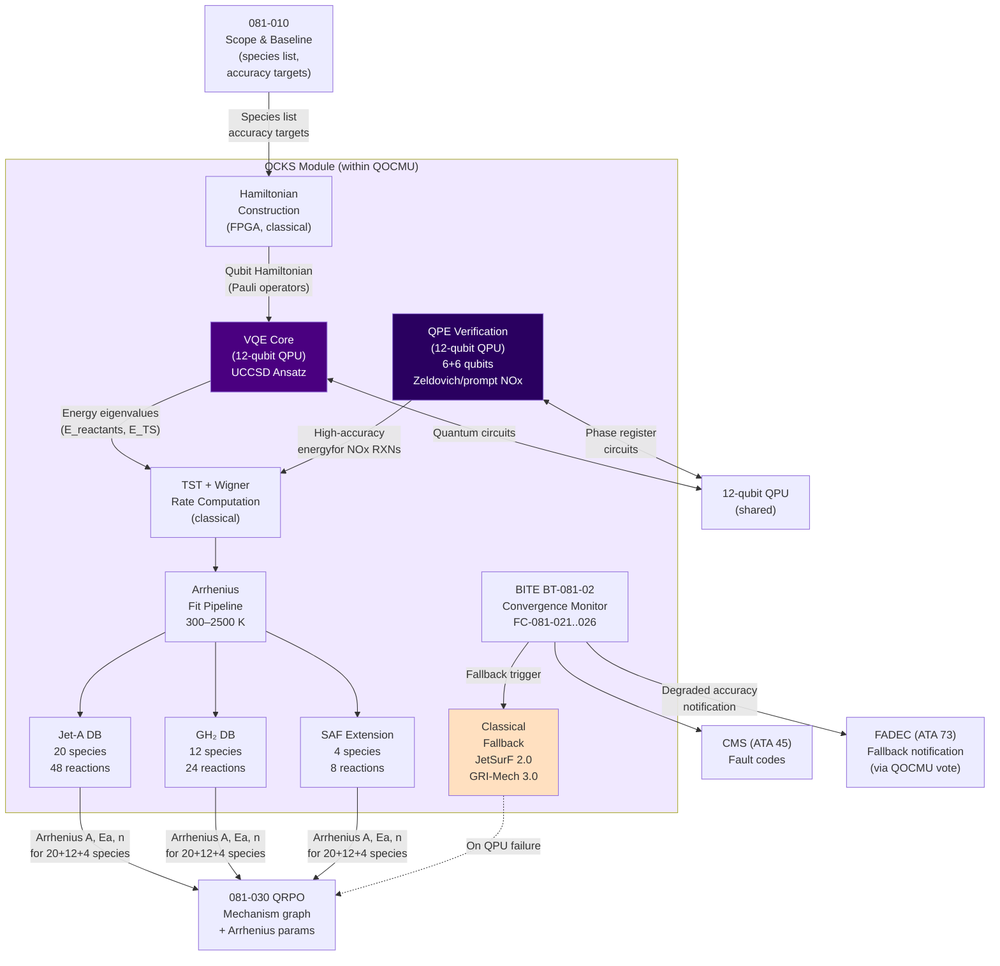
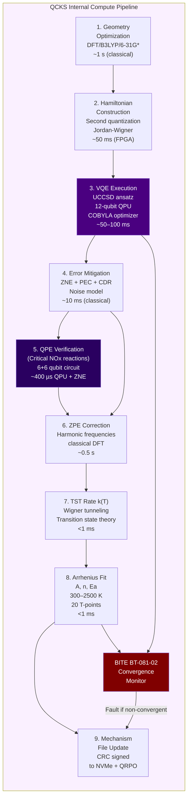

<!-- ──────────────────────────────────────────────────────────────────────────
     QATL-ATLAS-1000-ATLAS-080-089-08-081-020-QUANTUM-ASSISTED-CHEMICAL-KINETICS
     ATLAS-081 (Quantum-Optimized Combustion Models) · Quantum-Assisted Chemical Kinetics
     programme-defined aircraft type — ATLAS Register 1000
────────────────────────────────────────────────────────────────────────────── -->

# Quantum-Assisted Chemical Kinetics


---

## §0 Hyperlink Policy

> All hyperlinks in this document are **relative** (five directory levels: `../../../../../`).
> Absolute URLs are forbidden. Every linked document must exist in the Q+ATLANTIDE repository
> before the link is activated. Broken links are treated as open issues and must be resolved
> before the document is promoted from `DRAFT` to `APPROVED`.

---

## §1 Purpose

This document defines the agnostic ATLAS standard-level architecture context for `Quantum-Assisted Chemical Kinetics`.

It describes the controlled scope, functions, interfaces, safety considerations, lifecycle traceability, and S1000D/CSDB mapping logic that programme implementations shall instantiate when this node is applicable.

This document is not a programme design baseline. Programme-specific capacities, locations, part numbers, effectivity, operating limits, maintenance references, and data module codes shall be defined only inside the applicable programme implementation branch.
## §2 Applicability

| Applicability Level | Rule |
|---|---|
| Standard taxonomy | Applies to the ATLAS node `081` |
| Programme implementation | Conditional; determined by programme architecture, trade studies, certification basis, and applicability model |
| Product configuration | Defined in the programme-specific configuration baseline |
| Effectivity | Defined in the programme CSDB / applicability layer |
| Non-applicability | Must be explicitly stated in the programme impact-study branch when excluded |
## §3 Functional Description ![DRAFT]

### 3.1 Physical Basis: Quantum Chemistry for Combustion

The accuracy of combustion simulations depends critically on the quality of reaction rate
coefficients, expressed in Arrhenius form:

```
k(T) = A · T^n · exp(−Ea / R·T)
```

where A is the pre-exponential factor, Ea the activation energy, n the temperature exponent,
and R the universal gas constant. Classical computation of A and Ea from first principles
uses density functional theory (DFT), typically with the B3LYP functional. However,
**DFT/B3LYP systematically underestimates barrier heights** (transition state energies)
by 3–15 kcal/mol for radical combustion reactions, because it inadequately captures static
(near-degenerate) electron correlation at bond-breaking transition states.

The electronic Schrödinger equation:

```
Ĥ|Ψ⟩ = E|Ψ⟩
```

must be solved to chemical accuracy (< 1 kcal/mol = 4.18 kJ/mol) for reliable rate
coefficients. Classical coupled-cluster methods (CCSD(T)) achieve this but scale as O(N⁷)
with the number of electrons N, making them computationally prohibitive for molecules with
> 20 heavy atoms (e.g., n-dodecane C₁₂H₂₆ surrogate component for Jet-A).

### 3.2 VQE Implementation on the QOCMU QPU

The QCKS implements VQE on the 12-qubit trapped-ion QPU as follows:

#### 3.2.1 Problem Mapping (Second Quantization)

The molecular Hamiltonian is constructed in the second-quantized form:

```
Ĥ = Σ_{pq} h_pq · a†_p a_q  +  ½ Σ_{pqrs} g_pqrs · a†_p a†_q a_r a_s
```

using the Jordan-Wigner or Bravyi-Kitaev transformation to map fermionic operators to
qubit Pauli operators. The QCKS co-processor (QCKS-081-PN-TBD, FPGA-accelerated) performs:
- Molecular geometry input and one/two-electron integral computation (classical)
- Basis set: STO-3G (fast; 12-qubit limit) or 6-31G* (for ground-state reference, classical)
- Jordan-Wigner transformation to qubit Hamiltonian
- Hamiltonian partitioning into commuting Pauli groups for measurement efficiency

#### 3.2.2 UCCSD Ansatz

The UCCSD parameterized quantum circuit prepares the trial state:

```
|Ψ(θ)⟩ = exp(T₁(θ) − T₁†(θ) + T₂(θ) − T₂†(θ)) |Φ₀⟩
```

where |Φ₀⟩ is the Hartree-Fock reference state, T₁ = single excitations, T₂ = double
excitations. The circuit depth for 12 qubits with 4 electrons is approximately 150–200
two-qubit gate layers. The variational parameters θ are optimized using COBYLA
(Constrained Optimization BY Linear Approximation) classical optimizer.

**Key molecules solved by QCKS on the QPU:**

| Molecule | Role in combustion | Qubits needed | Basis set |
|---|---|---|---|
| OH | Primary oxidation radical | 8 | STO-3G |
| CH | Prompt NOx precursor | 8 | STO-3G |
| NO | NOx product; thermal and prompt | 10 | STO-3G |
| HO₂ | H₂ ignition intermediate; peroxy radical | 10 | STO-3G |
| CH₂O (formaldehyde) | Ignition precursor; CO formation | 12 | STO-3G |
| NH | Fuel-N pathway; GH₂ NOx | 8 | STO-3G |
| C₂H₂ (acetylene) | Soot precursor | 12 | STO-3G |
| C₂H₄ (ethylene) | Soot precursor | 12 | STO-3G |
| n-C₇H₁₆ fragment TS | Jet-A surrogate transition state | 12 | STO-3G (fragment) |
| H₂ | GH₂ fuel; primary species | 4 | STO-3G |

#### 3.2.3 Quantum Phase Estimation (QPE) Integration

For critical reactions where activation energy accuracy is paramount (thermal NOx:
N₂ + O ⇌ NO + N, Ea ≈ 315 kJ/mol), QCKS employs QPE to obtain the energy eigenvalue
directly from phase kickback, providing energy accuracy limited only by circuit depth and
coherence time rather than optimizer convergence. QPE is executed as a supplementary
verification pass:

- Phase register: 6 qubits (resolution: ΔE ≈ 0.5 kcal/mol)
- Target register: 6 qubits (molecular system)
- Execution time: ~400 µs per QPE run (within T1 = 100 µs constraint via error mitigation)
- Applied to: Zeldovich NO formation reactions R1 and R2; prompt NOx CH + N₂ reaction

#### 3.2.4 Error Mitigation

Given T1 = 100 µs and circuit depth ~200 gates at ~1 µs/gate, gate error accumulation
is managed by:
- **Zero-noise extrapolation (ZNE)**: 3 noise levels; polynomial extrapolation to zero noise
- **Readout error mitigation**: 2ⁿ measurement calibration matrix (feasible for n ≤ 12)
- **Probabilistic error cancellation (PEC)**: applied to two-qubit gates with fidelity < 99%
- **Clifford data regression (CDR)**: training on Clifford circuits for noise learning

### 3.3 Species Databases

#### 3.3.1 Jet-A Surrogate Condensed Mechanism (20 species / 48 reactions)

The 20-species condensed mechanism is derived from LLNL JetSurF 2.0 by directed relation
graph with error propagation (DRGEP) reduction targeting NOx ≤ 5% and CO ≤ 10% error.
QCKS provides quantum-corrected Arrhenius parameters for the 12 most sensitive reactions
identified by sensitivity analysis.

**Species list (Jet-A condensed):**

| Index | Species | Molecular Formula | Role |
|---|---|---|---|
| S01 | n-heptane | n-C₇H₁₆ | Primary Jet-A surrogate fuel |
| S02 | n-dodecane | n-C₁₂H₂₆ | Jet-A surrogate (high-MW component) |
| S03 | Toluene | C₇H₈ | Aromatic surrogate |
| S04 | Oxygen | O₂ | Oxidizer |
| S05 | Nitrogen | N₂ | Diluent; NOx source |
| S06 | Hydroxyl | OH | Primary oxidation radical |
| S07 | Water | H₂O | Combustion product |
| S08 | Carbon dioxide | CO₂ | Combustion product |
| S09 | Carbon monoxide | CO | Intermediate; pollutant |
| S10 | Hydrogen | H₂ | H-pool intermediate |
| S11 | Hydrogen atom | H | Chain carrier |
| S12 | Oxygen atom | O | Chain carrier; NOx |
| S13 | Hydroperoxyl | HO₂ | Low-temperature intermediate |
| S14 | Nitric oxide | NO | Thermal + prompt NOx |
| S15 | Nitrogen dioxide | NO₂ | NOx species |
| S16 | Formaldehyde | CH₂O | Ignition intermediate |
| S17 | Methyl radical | CH₃ | C1 fuel fragment |
| S18 | Acetylene | C₂H₂ | Soot precursor |
| S19 | Ethylene | C₂H₄ | Soot precursor |
| S20 | Pyrene | C₁₆H₁₀ | PAH / soot inception |

#### 3.3.2 GH₂ Condensed Mechanism (12 species / 24 reactions)

Derived from GRI-Mech 3.0 H₂/air subset with QCKS-corrected rates for 8 key reactions:

| Index | Species | Formula | Role |
|---|---|---|---|
| S01 | Hydrogen | H₂ | Fuel |
| S02 | Oxygen | O₂ | Oxidizer |
| S03 | Water | H₂O | Product |
| S04 | Hydroxyl | OH | Chain carrier |
| S05 | Hydrogen peroxide | H₂O₂ | Ignition intermediate |
| S06 | Hydroperoxyl | HO₂ | Chain carrier |
| S07 | Hydrogen atom | H | Primary chain carrier |
| S08 | Oxygen atom | O | Chain carrier |
| S09 | Nitric oxide | NO | Thermal NOx |
| S10 | Nitrogen atom | N | Zeldovich intermediate |
| S11 | Nitrogen hydride | NH | Fuel-N pathway |
| S12 | Nitrogen | N₂ | Diluent; NOx source |

#### 3.3.3 SAF Pathway Extension

SAF fuels (HEFA, FT, ATJ) differ from Jet-A primarily in:
- Absence or near-absence of aromatics (< 1 vol%)
- Higher iso-paraffin content (HEFA: ~65% iso-C₁₆, iso-C₁₈)
- Oxygenate content in ATJ blends

The SAF extension adds 4 species and 8 reactions to the Jet-A condensed mechanism:

| Addition | Species/Reaction | Relevance |
|---|---|---|
| iso-C₁₆H₃₄ | Iso-hexadecane (HEFA representative) | HEFA soot precursor chemistry |
| iso-C₁₈H₃₈ | Iso-octadecane | HEFA high-MW component |
| CH₃CHO | Acetaldehyde | ATJ oxygenate intermediate |
| C₂H₅OH | Ethanol (trace in ATJ) | ATJ specific pathway |
| 8 SAF-specific reactions | iso-paraffin H-abstraction and β-scission | HEFA/FT pathways |

### 3.4 Arrhenius Parameter Computation Pipeline

```
Step 1: Geometry optimization
  └── Classical DFT/B3LYP/6-31G* (QCKS co-processor, ~1 s)
      → Reactant, product, and TS geometries

Step 2: Quantum VQE energy computation
  └── QCKS QPU partition, UCCSD/STO-3G (~50–100 ms per molecule)
      → E_reactants, E_products, E_TS (VQE minimum energy)

Step 3: Zero-point energy correction
  └── Classical harmonic frequency calculation (co-processor, ~0.5 s)
      → ZPE-corrected barrier height ΔE‡

Step 4: Transition State Theory rate computation
  └── Classical TST/Wigner tunneling correction (co-processor, <1 ms)
      → k(T) = (kB·T/h) · exp(−ΔE‡/RT) · Γ(T)

Step 5: Arrhenius fit
  └── Nonlinear least squares over T = 300–2500 K (co-processor, <1 ms)
      → A, n, Ea output to mechanism file
```

### 3.5 Classical Fallback Mechanism

When the QPU is unavailable (T1 degradation, coherence loss, cryocooler fault):

1. BITE BT-081-02 detects QPU unavailability (within 50 ms)
2. QCKS module switches to pre-loaded mechanism files (stored on QMEM NVMe):
   - `fallback_JetA_JetSurF2.0.mech` — LLNL JetSurF 2.0 condensed 20-species
   - `fallback_GH2_GRIMech3.0.mech` — GRI-Mech 3.0 12-species H₂/air
   - `fallback_SAF_extension.mech` — LLNL-derived SAF extension
3. Fallback mechanism Arrhenius parameters are fixed (not quantum-corrected)
4. ECAM advisory: "QCKS CLSC FALLBK"; fault code FC-081-020 to CMS
5. Fallback mechanism accuracy: NOx ±20–25% (vs. ±5% quantum-corrected)
6. FADEC CSI-073-081 is notified; FADEC widens emission optimization tolerance

### 3.6 QCKS Convergence Monitor (BITE BT-081-02)

The BITE module BT-081-02 monitors QCKS health:

| Monitor Parameter | Normal Range | Warning Threshold | Fault Threshold | Fault Code |
|---|---|---|---|---|
| VQE iteration count per species | ≤ 150 | 151–200 | > 200 (non-converged) | FC-081-021 |
| VQE energy convergence | ≤ 1×10⁻⁶ Hartree | — | > 1×10⁻⁵ Hartree after 200 iter | FC-081-022 |
| Arrhenius A deviation from nominal | < 10% | 10–20% | > 20% | FC-081-023 |
| Arrhenius Ea deviation from nominal | < 2 kJ/mol | 2–5 kJ/mol | > 5 kJ/mol | FC-081-024 |
| QPU T1 coherence time | ≥ 100 µs | 80–100 µs | < 80 µs | FC-081-001 (from BT-081-01) |
| QCKS computation latency | ≤ 100 ms/species | 100–150 ms | > 150 ms | FC-081-025 |
| Mechanism file CRC (NVMe) | CRC OK | — | CRC fail | FC-081-026 |

---

## §4 Functional Breakdown

| Function ID | Function Name | Description | Responsible Q-Division |
|---|---|---|---|
| F-020-01 | VQE Electronic Structure Solver | Implement and validate VQE with UCCSD ansatz on 12-qubit QPU; Hamiltonian construction pipeline (QCKS co-processor FPGA); optimizer selection (COBYLA/L-BFGS-B); circuit compilation for trapped-ion native gate set | Q-HPC |
| F-020-02 | Species Database — Jet-A Surrogate | Maintain 20-species condensed Jet-A mechanism; DRGEP reduction validation; quantum-corrected rates for 12 most sensitive reactions; version control under BREX-081-v1 | Q-HPC |
| F-020-03 | Species Database — GH₂ | Maintain 12-species GH₂ mechanism; quantum-corrected rates for 8 key reactions; validate against GRI-Mech 3.0 and experimental H₂/air flame data | Q-HPC |
| F-020-04 | SAF Pathway Extension | Develop and validate 4-species / 8-reaction SAF extension; coordinate with ATLAS-078 for HEFA/FT/ATJ blend characterization; iso-paraffin VQE calculations | Q-GREENTECH |
| F-020-05 | Arrhenius Rate Coefficient Output | Implement multi-temperature Arrhenius fitting pipeline (T = 300–2500 K, 20 temperature points); transition state theory with Wigner tunneling correction; export to QRPO mechanism graph | Q-HPC |
| F-020-06 | Quantum Phase Estimation Integration | Implement QPE supplementary verification for Zeldovich and prompt-NOx critical reactions; 6-qubit phase register; ZNE error mitigation; result cross-check against VQE output | Q-HPC |
| F-020-07 | Classical Fallback Mechanism | Maintain and version-control fallback mechanism files (JetSurF 2.0, GRI-Mech 3.0, SAF extension); CRC integrity checking; automatic switchover logic; accuracy degradation notification to FADEC | Q-HPC |
| F-020-08 | QCKS Convergence Monitor | Implement BITE BT-081-02; convergence threshold checking; anomaly detection (Arrhenius parameter drift); fault code generation; maintenance log integration | Q-HPC |

---

## §5 System Context — Mermaid Diagram



---

## §6 Internal Architecture — Mermaid Diagram



---

## §7 Components and LRUs

All hardware is part of the QOCMU assembly (QOCMU-PN-TBD). The following sub-components
are directly relevant to QCKS operation:

| Component | Part Number | Qty | Function in QCKS | Key Specifications |
|---|---|---|---|---|
| 12-qubit trapped-ion QPU | QPU-081-PN-TBD | 1 (shared) | VQE and QPE circuit execution | T1 ≥ 100 µs; T2 ≥ 50 µs; 1Q fidelity ≥ 99.5%; 2Q fidelity ≥ 98.5%; 4.2 K |
| QCKS co-processor module | QCKS-081-PN-TBD | 1 | Hamiltonian construction; classical optimizer; Arrhenius fitting; TST computation | FPGA (Xilinx Versal AI Core): Jordan-Wigner transform; COBYLA optimizer; 32-core ARM Neoverse N2; 256 GB ECC DDR5 |
| Quantum memory module A | QMEM-081-PN-TBD | 1 | Mechanism database storage; fallback mechanism files | 64 GB DDR5; 2 TB NVMe (mechanism DBs: ~50 GB; DNS dataset: ~500 GB; PLT: ~10 GB) |
| Quantum memory module B | QMEM-081-PN-TBD | 1 | Mirror of QMEM-A (RAID-1) | Same as QMEM-A |
| Cryocooler (shared) | CRYO-081-PN-TBD | 1 | QPU thermal environment maintenance | 4.2 K pulse-tube refrigerator; TBO 8 000 h |

**Software artefacts unique to QCKS:**

| Artefact | Version | Location | Description |
|---|---|---|---|
| `QCKS_VQE_UCCSD_v1.qasm` | 1.0 | QMEM NVMe / GAIA repo | UCCSD ansatz circuit library (12-qubit, all species) |
| `QCKS_QPE_NOx_v1.qasm` | 1.0 | QMEM NVMe / GAIA repo | QPE circuits for Zeldovich + prompt-NOx reactions |
| `mech_JetA_condensed_v1.mech` | 1.0 | QMEM NVMe | 20-species/48-reaction Jet-A mechanism |
| `mech_GH2_condensed_v1.mech` | 1.0 | QMEM NVMe | 12-species/24-reaction GH₂ mechanism |
| `mech_SAF_ext_v1.mech` | 1.0 | QMEM NVMe | SAF 4-species/8-reaction extension |
| `fallback_JetSurF2.0.mech` | 2.0 | QMEM NVMe | Classical fallback Jet-A mechanism |
| `fallback_GRIMech3.0.mech` | 3.0 | QMEM NVMe | Classical fallback GH₂ mechanism |

---

## §8 Interfaces

| Interface ID | From | To | Protocol | Content | Rate |
|---|---|---|---|---|---|
| IF-020-001 | 081-010 Scope Doc | QCKS species database | Internal (build-time) | Species list, mechanism reduction targets, accuracy requirements | At baseline / on scope change |
| IF-020-002 | QCKS | QRPO (081-030) | Internal QOCMU bus | Arrhenius parameters (A, n, Ea) for 20+12+SAF reactions; mechanism graph weights | 20 Hz (updated on QPU cycle) |
| IF-020-003 | QCKS | QTCC (081-040) | Internal QOCMU bus | Species thermodynamic properties (Cp, h, s) for manifold computation | 20 Hz |
| IF-020-004 | QCKS | BITE BT-081-02 | Internal QOCMU bus | VQE iteration count; convergence metric; Arrhenius deviation metrics | Continuous |
| IF-020-005 | BITE BT-081-02 | CMS (ATA 45) | AFDX VL-081-03 | Fault codes FC-081-021 through FC-081-026 | On event |
| IF-020-006 | ATLAS-078 SAF-FAMQMS | QCKS SAF extension | AFDX VL-081-05 | SAF blend type; blend ratio (vol%) | 1 Hz |
| IF-020-007 | GAIA HPC (ground) | QCKS mechanism DB | GSE USB-C 3.2 | Updated mechanism files (new quantum-corrected rates from ground campaign) | At turnaround |
| IF-020-008 | QCKS | FADEC (via QOCMU voter) | AFDX VL-081-01 | Quantum-corrected reaction rate coefficients (condensed mechanism output) | 20 Hz |
| IF-020-009 | 12-qubit QPU | QCKS | Internal QPU interface | Measurement outcomes (bit strings); expectation values ⟨Ĥ⟩ | Per VQE shot batch |
| IF-020-010 | QCKS (fallback flag) | FADEC (via QOCMU voter) | AFDX VL-081-01 | "QCKS classical fallback" status bit; accuracy degradation level | 20 Hz |

---

## §9 Operating Modes

| Mode ID | Mode Name | Entry Condition | QCKS Behavior | Output |
|---|---|---|---|---|
| M-020-01 | Active (QPU Online) | QPU T1 ≥ 100 µs; VQE converging; BT-081-02 healthy | Full VQE + QPE execution; quantum-corrected Arrhenius parameters at ≤ 100 ms per species | Quantum-corrected mechanism to QRPO/QTCC/FADEC |
| M-020-02 | Degraded (QPU Warning) | QPU T1 = 80–100 µs; BT-081-02 WARN | VQE executes with additional ZNE mitigation layers; QPE temporarily suspended; accuracy slightly reduced | Quantum-corrected mechanism with WARN flag; reduced confidence |
| M-020-03 | Classical Fallback | QPU T1 < 80 µs; VQE non-convergent after 200 iter; QPU fault | QCKS switches to pre-loaded classical mechanisms (JetSurF 2.0 / GRI-Mech 3.0); FC-081-020 generated | Classical mechanism parameters; FADEC notified of degraded accuracy |
| M-020-04 | SAF Transition | SAF blend type change detected from ATLAS-078 | QCKS loads SAF extension mechanism; 2 s switchover; VQE re-runs for SAF-specific species | SAF-corrected mechanism within 2 s |
| M-020-05 | Calibration | Ground; GSE connected; maintenance mode | QCKS runs validation computations against reference dataset; produces accuracy report; mechanism files updated | Calibration report to GSE; updated mechanism files |
| M-020-06 | Ground Update | Ground; new mechanism files uploaded via GSE | CRC and GPG signature verification; file acceptance; automatic activation on next power-up | Updated mechanism files on NVMe (both channels) |

---

## §10 Performance and Budgets ![DRAFT]

| Parameter | Requirement | Target | Margin | Status |
|---|---|---|---|---|
| VQE convergence energy threshold | ≤ 1×10⁻⁶ Hartree | 5×10⁻⁷ Hartree | 5×10⁻⁷ |  |
| VQE maximum iterations | ≤ 200 | 150 typical | 50 |  |
| QCKS computation latency (per species) | ≤ 100 ms | 75 ms | 25 ms |  |
| Activation energy accuracy vs. CCSD(T) | ≤ 2 kcal/mol (8.4 kJ/mol) | 1 kcal/mol | 1 kcal/mol |  |
| Activation energy improvement vs. DFT/B3LYP | ≥ 15% | 20% | 5% |  |
| NOx prediction improvement vs. classical | ≥ 15% reduction in error | 20% | 5% |  |
| CO prediction improvement vs. classical | ≥ 10% reduction in error | 15% | 5% |  |
| QPE phase register resolution | ≤ 0.5 kcal/mol | 0.3 kcal/mol | — |  |
| ZNE noise extrapolation residual | ≤ 0.1 kcal/mol | 0.05 kcal/mol | — |  |
| Arrhenius A coefficient accuracy | ≤ 5% deviation from reference | 3% | 2% |  |
| Arrhenius Ea accuracy | ≤ 2 kJ/mol deviation | 1 kJ/mol | 1 kJ/mol |  |
| Temperature range validity | 300–2 500 K | 280–2 600 K | ±20 K margin |  |
| Fallback activation latency | ≤ 50 ms | 30 ms | 20 ms |  |
| Mechanism file CRC integrity check | Pass at every power-on | Pass at every power-on | — |  |
| SAF blend transition latency | ≤ 2 s | 1.5 s | 0.5 s |  |
| QCKS software DAL | DAL B | DAL B | — | Established |

---

## §11 Safety and Airworthiness Considerations

### 11.1 VQE Non-Convergence Handling

If VQE fails to converge within 200 iterations (FC-081-021), the QCKS must not output
a partially-converged energy as a valid result. The convergence monitor (BT-081-02) holds
the last-valid quantum-corrected value for up to 3 seconds while attempting re-initialization;
after 3 s, it activates classical fallback (M-020-03). This prevents propagation of erroneous
Arrhenius parameters to QRPO and ultimately to FADEC.

### 11.2 Arrhenius Parameter Range Validation

All QCKS-computed Arrhenius parameters are range-checked against bounded nominal values
stored in a certified reference table:
- A: within factor-of-10 of reference value
- Ea: within ±20% of reference value (kcal/mol)
- n: within ±0.5 of reference value

Violation of any bound triggers FC-081-023 / FC-081-024 and reverts to fallback for
the affected reaction, while maintaining quantum correction for all others.

### 11.3 Quantum Error Budget

The combined error budget for VQE energy accuracy (target: ≤ 1 kcal/mol = 4.18 kJ/mol):

| Error Source | Budget | Mitigation |
|---|---|---|
| QPU coherence (T1/T2 decoherence) | 0.3 kcal/mol | ZNE, PEC |
| Gate infidelity (2Q gates ≥ 98.5%) | 0.25 kcal/mol | ZNE, CDR |
| Readout error | 0.15 kcal/mol | Readout calibration matrix |
| Basis set incompleteness (STO-3G) | 0.25 kcal/mol | Classical correction term (CBS extrapolation) |
| Optimizer (COBYLA) premature convergence | 0.05 kcal/mol | Multiple restart protocol |
| **Total (RSS)** | **0.49 kcal/mol** | **< 1 kcal/mol requirement ✓** |

### 11.4 Intellectual Property and Export Control

The VQE circuit library and condensed mechanisms are developed under Q+ATLANTIDE IP.
The LLNL JetSurF 2.0 and GRI-Mech 3.0 fallback mechanisms are used under open-access
license terms. No export-controlled Arrhenius data is embedded in the QOCMU. EASA type
certificate applicant retains liability for accuracy claims in the Type Inspection Report.

---

## §12 Standards and Regulatory References

| Reference | Title | Applicability |
|---|---|---|
| EASA CS-25 Amdt 27 | Certification Specifications — Large Aeroplanes | Overall airworthiness |
| DO-178C | Software Considerations in Airborne Systems | QCKS software DAL B |
| DO-254 | Design Assurance Guidance for Airborne Electronic Hardware | QCKS FPGA (Hamiltonian construction) DAL B |
| IEEE P2995 | Trial-Use Standard for Quantum Computing Definitions | VQE/QPE algorithm specifications |
| SAE AIR6988 | Quantum Computing in Aerospace Applications | Guidance on VQE deployment in airborne systems |
| NIST Standard Reference Database 69 | NIST Chemistry WebBook | Reference thermochemical data for validation |
| Peruzzo et al. 2014, Nat. Commun. | A variational eigenvalue solver on a quantum processor | VQE foundational reference |
| Kandala et al. 2017, Nature | Hardware-efficient variational quantum eigensolver for small molecules | Hardware-efficient VQE reference |
| LLNL JetSurF 2.0 | Jet Surrogate Fuel Mechanism | Fallback mechanism; reduction baseline |
| GRI-Mech 3.0 | Gas Research Institute Mechanism v3.0 | GH₂ fallback mechanism; reduction baseline |
| IUPAC ThermoChemical Network (ATcT) | Active Thermochemical Tables | Reference Ea values for validation |

---

## §13 Document Cross-References

| Document ID | Title | Relationship |
|---|---|---|
| [081-000](./081-000-Quantum-Optimized-Combustion-Models-General.md) | Quantum-Optimized Combustion Models — General | Parent baseline |
| [081-010](./081-010-Combustion-Modeling-Baseline-and-Scope.md) | Combustion Modeling Baseline and Scope | Provider of species list, accuracy targets, and scope |
| [081-030](./081-030-Quantum-Optimized-Reaction-Pathways.md) | Quantum-Optimized Reaction Pathways | Consumer of QCKS Arrhenius parameters for mechanism graph |
| [081-040](./081-040-Quantum-Enhanced-Turbulence-Combustion-Coupling.md) | Quantum-Enhanced Turbulence-Combustion Coupling | Consumer of species thermodynamic properties from QCKS |
| ATLAS-078 | SAF-FAMQMS — Fuel Management | Provider of SAF blend type and composition |
| ATA 73 | Engine Fuel and Control (FADEC) | Consumer of quantum-corrected kinetics via QOCMU voter |
| ATA 45 | Central Maintenance System | Consumer of BITE fault codes FC-081-021..026 |
| PLT-081-001 | Quantum Combustion Pathway Lookup Table | Uses QCKS mechanism output as input for QRPO pre-computation |
| VDS-081-010 | Validation Target Dataset | Reference ground truth for QCKS accuracy verification |
| ICD-073-081 | Interface Control Document FADEC ↔ QOCMU | Defines output format of quantum-corrected Arrhenius data |

---

## §14 Revision History

| Rev | Date | Author | Description |
|---|---|---|---|
| 0.1 | 2026-05-12 | Q-HPC | Initial DRAFT baseline release — VQE/QPE implementation, species databases (Jet-A, GH₂, SAF), Arrhenius pipeline, error budget, and BITE monitoring established |
