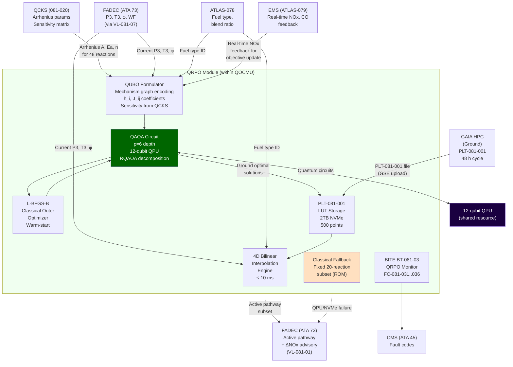
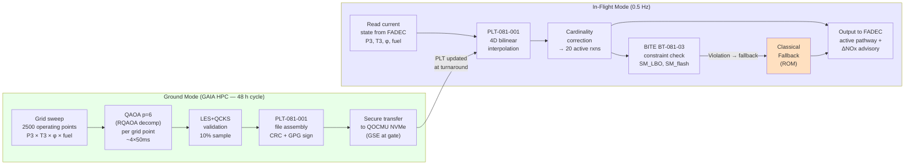

<!-- ──────────────────────────────────────────────────────────────────────────
     QATL-ATLAS-1000-ATLAS-080-089-08-081-030-QUANTUM-OPTIMIZED-REACTION-PATHWAYS
     ATLAS-081 (Quantum-Optimized Combustion Models) · Quantum-Optimized Reaction Pathways
     programme-defined aircraft type — ATLAS Register 1000
────────────────────────────────────────────────────────────────────────────── -->

# Quantum-Optimized Reaction Pathways


---

## §0 Hyperlink Policy

> All hyperlinks in this document are **relative** (five directory levels: `../../../../../`).
> Absolute URLs are forbidden. Every linked document must exist in the Q+ATLANTIDE repository
> before the link is activated. Broken links are treated as open issues and must be resolved
> before the document is promoted from `DRAFT` to `APPROVED`.

---

## §1 Purpose

This document defines the agnostic ATLAS standard-level architecture context for `Quantum-Optimized Reaction Pathways`.

It describes the controlled scope, functions, interfaces, safety considerations, lifecycle traceability, and S1000D/CSDB mapping logic that programme implementations shall instantiate when this node is applicable.

This document is not a programme design baseline. Programme-specific capacities, locations, part numbers, effectivity, operating limits, maintenance references, and data module codes shall be defined only inside the applicable programme implementation branch.
## §2 Applicability

| Applicability Level | Rule |
|---|---|
| Standard taxonomy | Applies to the ATLAS node `081` |
| Programme implementation | Conditional; determined by programme architecture, trade studies, certification basis, and applicability model |
| Product configuration | Defined in the programme-specific configuration baseline |
| Effectivity | Defined in the programme CSDB / applicability layer |
| Non-applicability | Must be explicitly stated in the programme impact-study branch when excluded |
## §3 Functional Description ![DRAFT]

### 3.1 Motivation: Why Pathway Optimization Matters

A combustion mechanism for Jet-A surrogate (20-species condensed, 48 reactions) contains
a directed reaction graph where at any given operating condition (P3, T3, φ), only a subset
of reactions dominates the heat release and species evolution. The classical approach selects
a fixed dominant pathway at design point and applies it across the operating envelope.

**The problem with fixed pathways:** At off-design conditions (e.g., altitude cruise at P3 =
22 bar vs. sea-level takeoff at P3 = 42 bar; SAF 30% blend vs. pure Jet-A; load change
from 75% to 90% thrust), the dominant reaction channels shift. Fixed-pathway operation:
- Uses thermally unfavorable reaction channels that produce excess thermal NOx (Zeldovich
  pathway dominant at high T, but other pathways offer lower NOx at intermediate T)
- Under-utilizes prompt-NOx suppression opportunities (by avoiding CH + N₂ pathway
  through equivalence ratio staging changes)
- Over-produces CO in the dilution zone (by failing to channel intermediate products
  through the optimal oxidation sequence)

QRPO solves this by continuously selecting the optimal pathway subset at 0.5 Hz, providing
FADEC with updated staging commands that route the combustion process through the
minimum-NOx pathway while maintaining stability.

### 3.2 QUBO Problem Formulation

The reaction pathway selection is encoded as a QUBO problem:

```
Binary variable: x_i ∈ {0, 1}  for each reaction i, i = 1..N_rxn (N_rxn ≤ 48 for Jet-A)
x_i = 1: reaction i is in the active pathway subset
x_i = 0: reaction i is excluded from the active subset

Objective (minimize):
  J(x) = Σ_i h_i · x_i  +  Σ_{i<j} J_ij · x_i · x_j  +  λ_pen · P(x)

where:
  h_i   = linear cost: NOx production rate contribution of reaction i at (P3, T3, φ)
  J_ij  = quadratic coupling: joint NOx/CO contribution of reaction pair (i, j)
  P(x)  = penalty: quadratic penalty for constraint violation
  λ_pen = penalty weight (set to 10 × objective range for hard constraint enforcement)

Constraints (encoded as quadratic penalties):
  η_comb(x) ≥ 99.5%  →  penalty if Σ_i [heat release of active reactions] < 99.5% of total
  SM_LBO(x) ≥ 0.15   →  penalty if active pathway LBO margin < 0.15
  SM_flash(x) ≥ 0.10  →  hard penalty (λ → ∞) for GH₂ flashback margin violation
  |active subset| = 20  →  penalty for deviation from 20-reaction cardinality constraint
```

The h_i and J_ij coefficients are computed by the QRPO co-processor using a linear
sensitivity analysis of the quantum-corrected Arrhenius parameters provided by QCKS.
This construction is refreshed at 0.5 Hz during flight and at each new operating point
in the ground PLT-081-001 sweep.

### 3.3 Mechanism Graph Encoding

The ~200 reaction channels of the full Jet-A mechanism are represented as a **weighted
directed reaction graph** G = (V, E):

- **Vertices V**: Combustion species (20 for Jet-A condensed; extended to ~35 for full graph)
- **Edges E**: Reaction channels, each weighted by:
  - Forward/reverse rate coefficient k(T) from QCKS (quantum-corrected)
  - NOx yield coefficient ν_NOx (moles NOx per mole reaction progress)
  - CO yield coefficient ν_CO
  - Heat release per unit reaction progress Δh_rxn
  - Sensitivity coefficient S_i = ∂(NOx)/∂(k_i) at current (P3, T3, φ)

For the QAOA problem encoding, the graph is reduced to the most sensitive 48 reactions
(Jet-A) or 24 reactions (GH₂) via sensitivity analysis, bringing the QUBO problem to
≤ 48 binary variables — executable on 12 qubits through graph decomposition techniques
(recursive QAOA with 12-qubit subproblem partitioning).

### 3.4 QAOA Circuit Implementation

The QAOA circuit implements p alternating layers of phase-separation and mixing operators:

```
|Ψ(β, γ)⟩ = U_M(β_p) · U_P(γ_p) · ... · U_M(β_1) · U_P(γ_1) · |s⟩

where:
  |s⟩        = uniform superposition = H⊗n |0⟩ⁿ (Hadamard initialization)
  U_P(γ_k)   = exp(−i γ_k Ĥ_C)  (phase separation; Ĥ_C = QUBO cost Hamiltonian)
  U_M(β_k)   = exp(−i β_k Ĥ_B)  (mixing; Ĥ_B = Σ_i σ^x_i)
  p = 6       (circuit depth; 6 phase-separation + 6 mixing layers)
  β = (β_1..β_6), γ = (γ_1..γ_6) = variational parameters (12 parameters total)
```

**12-qubit decomposition for 48-variable problem:**
The 48-reaction Jet-A QUBO is decomposed into 4 overlapping 12-qubit subproblems using
the RQAOA (Recursive QAOA) framework. Each subproblem reduces 12 binary variables to
one selected variable via correlator measurement, iteratively building the full 48-variable
solution. This decomposition requires 4 × QAOA circuits per update cycle.

**Classical outer optimizer**: L-BFGS-B (Limited-memory Broyden-Fletcher-Goldfarb-Shanno)
with warm-start initialization from the previous operating point's optimal (β, γ) parameters,
reducing convergence iterations from ~50 to ~10 at slowly-varying operating conditions.

**Execution time** per QAOA update (in-flight LUT mode):
- LUT interpolation: ≤ 10 ms (primary in-flight mode)
- QAOA full execution (not in-flight): 4 × ~50 ms = ~200 ms per full update (ground mode)

### 3.5 PLT-081-001 — Quantum Combustion Pathway Lookup Table

PLT-081-001 is the key data deliverable of the QRPO module:

**Grid definition:**

| Axis | Variable | Range | Grid points | Grid type |
|---|---|---|---|---|
| Axis 1 | Compressor delivery pressure P3 | 20–45 bar | 10 | Chebyshev spacing |
| Axis 2 | Compressor delivery temperature T3 | 600–900 K | 10 | Chebyshev spacing |
| Axis 3 | Equivalence ratio φ | 0.3–2.0 | 5 | Uniform spacing |
| Axis 4 | Fuel type | Jet-A, SAF-HEFA, SAF-FT, SAF-ATJ, GH₂ | 5 (discrete) | Categorical |

**Total entries:** 10 × 10 × 5 × 5 = 2 500 entries (PLT stores the 500 most
frequently traversed operating points based on flight profile analysis, with full
grid on GAIA HPC for any new point interpolation).

**Per-entry content:**
- Optimal binary selection vector x* (48-bit for Jet-A; 24-bit for GH₂)
- Corresponding active reaction subset (reaction IDs)
- Predicted ΔNOx vs. baseline (%)
- Combustion efficiency η_comb
- LBO stability margin SM_LBO
- Flashback margin SM_flash (GH₂ entries)
- QAOA solution quality metric (approximation ratio r = J*/J_classical)

**Ground generation cycle:**
1. GAIA HPC facility runs QAOA full sweep over all 2 500 grid points (~24 h)
2. Results validated against LES+QCKS reference at 10 randomly-selected points (~12 h)
3. PLT-081-001 file (CRC + GPG-signed) delivered to aircraft via GSE at turnaround
4. QRPO module verifies signature and CRC; activates new PLT on next power-up

### 3.6 In-Flight LUT Interpolation

In-flight, the QRPO uses PLT-081-001 to provide optimized pathway selection without
executing QAOA on the QPU in real time (which would be too slow at 0.5 Hz given the
4-subproblem decomposition ~200 ms total):

```
At each 0.5 Hz update:
  1. Read current (P3, T3, φ, fuel_type) from FADEC via VL-081-07 (20 Hz input)
  2. Locate surrounding grid cell in PLT-081-001 (P3 × T3 × φ axes)
  3. 4D bilinear interpolation of x* vector (for continuous axes P3, T3, φ)
     + nearest-neighbor lookup for fuel_type (discrete axis)
  4. Apply cardinality correction: round interpolated x* to nearest integer binary vector
     with exactly 20 active reactions (fuel-type dependent threshold)
  5. Output: active reaction subset + ΔNOx advisory to QRPO→FADEC interface (VL-081-01)
  
Latency: steps 1–5 ≤ 10 ms
QPU: not used in-flight LUT mode (QPU reserved for QCKS/QTCC)
```

### 3.7 NOx Objective Function Details

The QRPO objective function weights are tuned for ICAO CAEP/11 compliance:

```
J(x) = w_NOx · ΔNOx(x) + w_CO · ΔCO(x) + w_soot · Δsoot(x)
```

| Component | Weight | Physical Quantity | Target |
|---|---|---|---|
| w_NOx | 0.60 | Integrated NOx production (g/kN thrust) | Reduce by ≥ 10% vs. CAEP/10 |
| w_CO | 0.30 | Integrated CO production (g/kN thrust) | Stay within CAEP/11 limit |
| w_soot | 0.10 | Integrated soot/PN production (n/kN thrust) | < CAEP/11 PN limit |

Weights are fixed in PLT-081-001 generation. A weight update (e.g., for regulatory
change or new CAEP cycle) requires a new GAIA HPC optimization sweep and PLT-081-001
re-generation.

### 3.8 Classical Fallback Pathway

When QPU is unavailable and PLT-081-001 is inaccessible (NVMe failure):

- Fixed 20-reaction classical subset selected by DRGEP sensitivity at design-point
  (P3 = 35 bar, T3 = 800 K, φ = 0.55, Jet-A)
- Stored in QOCMU firmware (ROM, not NVMe)
- Known NOx performance: typically 8–15% above optimized PLT-081-001 selection
- Stability margins: conservatively validated (LBO SM ≥ 0.25, flashback SM ≥ 0.20
  — wider than constraints because design-point pathway is conservative)
- FADEC notified via status bit "QRPO CLASSIC FALLBACK" on VL-081-01
- ECAM advisory: "COMB PATH CLSC"

---

## §4 Functional Breakdown

| Function ID | Function Name | Description | Responsible Q-Division |
|---|---|---|---|
| F-030-01 | QUBO Problem Formulation | Encode mechanism graph as QUBO; compute h_i and J_ij from QCKS Arrhenius sensitivities; construct penalty functions for stability constraints; validate QUBO formulation against exact solver for small test cases | Q-HPC |
| F-030-02 | QAOA Circuit Implementation | Implement QAOA phase-separation and mixing operators; RQAOA 12-qubit decomposition for 48-variable problem; L-BFGS-B outer optimizer with warm-start; circuit compilation for trapped-ion native gates | Q-HPC |
| F-030-03 | PLT-081-001 Generation | Implement GAIA HPC QAOA sweep over 2 500 grid points; validation against LES+QCKS reference at 10% of points; CRC + GPG signing; 48-hour generation cycle management | Q-HPC |
| F-030-04 | In-Flight LUT Interpolation | Implement 4D bilinear interpolation on PLT-081-001; cardinality rounding; ≤ 10 ms latency; 0.5 Hz update cycle; out-of-bounds clamping with advisory flag | Q-HPC |
| F-030-05 | NOx Objective Function | Define and implement multi-component NOx/CO/soot objective; weight management; CAEP/11 compliance verification; objective sensitivity analysis | Q-GREENTECH |
| F-030-06 | Stability Constraint Implementation | Implement LBO margin SM_LBO ≥ 0.15; flashback margin SM_flash ≥ 0.10 (GH₂, hard-coded); QAOA penalty function and in-flight constraint enforcement | Q-AIR |
| F-030-07 | Ground Optimization Workflow | GAIA HPC pipeline automation (48 h cycle); scheduling; output validation; secure file transfer to aircraft; version management | Q-HPC |
| F-030-08 | Classical Fallback Pathway | Define, validate, and embed fixed classical fallback 20-reaction subset; ROM storage; automatic activation logic; FADEC notification; accuracy degradation characterization | Q-HPC |

---

## §5 System Context — Mermaid Diagram



---

## §6 Internal Architecture — Mermaid Diagram



---

## §7 Components and LRUs

All hardware is part of the QOCMU assembly (QOCMU-PN-TBD). QRPO-specific components:

| Component | Part Number | Qty | Function in QRPO | Key Specifications |
|---|---|---|---|---|
| 12-qubit trapped-ion QPU | QPU-081-PN-TBD | 1 (shared) | QAOA circuit execution (ground optimization mode; RQAOA subproblems) | T1 ≥ 100 µs; 2Q fidelity ≥ 98.5%; 4.2 K |
| QRPO module | QRPO-081-PN-TBD | 1 | QUBO formulation; QAOA circuit compilation; L-BFGS-B optimizer; 4D interpolation engine | 32-core ARM Neoverse N2 co-CPU; Versal AI Core FPGA for interpolation acceleration; 64 GB ECC DDR5 |
| Quantum memory A (NVMe) | QMEM-081-PN-TBD | 1 | PLT-081-001 storage; QUBO coefficient cache; classical fallback ROM partition | 2 TB NVMe (PLT: ~10 GB; coefficient cache: ~2 GB; fallback ROM partition: 1 MB) |
| Quantum memory B (NVMe, mirror) | QMEM-081-PN-TBD | 1 | RAID-1 mirror of QMEM-A PLT partition | Same specifications as QMEM-A |

**Software and data artefacts unique to QRPO:**

| Artefact | Version | Location | Description |
|---|---|---|---|
| `QRPO_QAOA_p6_v1.qasm` | 1.0 | QMEM NVMe / GAIA repo | QAOA p=6 circuit library (phase + mixing operators; all fuel types) |
| `QRPO_RQAOA_decomp_v1.py` | 1.0 | QMEM NVMe / GAIA repo | Recursive QAOA 12-qubit decomposition for 48-variable problem |
| `PLT-081-001_v1.h5` | 1.0 | QMEM NVMe (dual) | Quantum Combustion Pathway LUT (HDF5 format; 500 entries; CRC + GPG signed) |
| `QRPO_fallback_classical_v1.rxn` | 1.0 | QOCMU ROM | Fixed classical 20-reaction fallback subset (read-only; cannot be overwritten) |
| `QRPO_objective_weights_v1.json` | 1.0 | QMEM NVMe / GAIA repo | NOx/CO/soot weight vector (w_NOx=0.60, w_CO=0.30, w_soot=0.10) |

---

## §8 Interfaces

| Interface ID | From | To | Protocol | Content | Rate |
|---|---|---|---|---|---|
| IF-030-001 | QCKS (081-020) | QRPO | Internal QOCMU bus | Arrhenius parameters (A, n, Ea) for 48 Jet-A / 24 GH₂ reactions; sensitivity matrix | 20 Hz (kinetics update) |
| IF-030-002 | FADEC (ATA 73) | QRPO | AFDX VL-081-07 | Current engine state: P3 (bar), T3 (K), φ (equiv. ratio), N1 (%), WF (kg/s) | 20 Hz |
| IF-030-003 | ATLAS-078 SAF-FAMQMS | QRPO | AFDX VL-081-05 | Fuel type ID (enum: JetA/HEFA/FT/ATJ/GH₂); blend ratio (vol%) | 1 Hz |
| IF-030-004 | EMS (ATLAS-079) | QRPO | AFDX VL-081-06 | Real-time measured NOx (mg/kg), CO (mg/kg), PN (n/kg) — for closed-loop objective feedback | 1 Hz |
| IF-030-005 | QRPO | FADEC (ATA 73) | AFDX VL-081-01 | Active reaction pathway subset (20-bit mask); predicted ΔNOx (%); QRPO status | 0.5 Hz (LUT update) |
| IF-030-006 | GAIA HPC | QRPO (PLT storage) | GSE USB-C 3.2 | PLT-081-001 updated file (HDF5, CRC + GPG signed); upload at turnaround | Per 48 h ground cycle |
| IF-030-007 | QRPO | BITE BT-081-03 | Internal QOCMU bus | Interpolation latency; constraint satisfaction (SM_LBO, SM_flash); LUT CRC status | Continuous |
| IF-030-008 | BITE BT-081-03 | CMS (ATA 45) | AFDX VL-081-03 | Fault codes FC-081-031 through FC-081-036 | On event |
| IF-030-009 | QRPO | QTCC (081-040) | Internal QOCMU bus | Active pathway species source terms (for manifold construction) | 0.5 Hz |
| IF-030-010 | QPU (shared) | QRPO | Internal QPU interface | QAOA measurement bitstrings; expectation values ⟨Ĥ_C⟩ (ground mode only) | Per QAOA shot batch |

---

## §9 Operating Modes

| Mode ID | Mode Name | Entry Condition | QRPO Behavior | Output |
|---|---|---|---|---|
| M-030-01 | Real-Time LUT Optimization | PLT-081-001 loaded; QCKS active; LUT integrity verified | 4D bilinear interpolation of PLT-081-001 at 0.5 Hz; ≤ 10 ms latency; cardinality correction; constraint checks | Optimized pathway subset + ΔNOx to FADEC at 0.5 Hz |
| M-030-02 | LUT Boundary Warning | Current operating point within 5% of PLT-081-001 grid boundary | Continue interpolation with reduced confidence; boundary flag set; FADEC advisory issued | Pathway with "boundary advisory" flag |
| M-030-03 | LUT Out-of-Bounds Fallback | Operating point confirmed outside PLT-081-001 grid bounds | Clamp to nearest grid boundary; use boundary-point pathway; increase stability margin constraint by 10% as safety buffer | Boundary-clamped pathway; advisory to FADEC |
| M-030-04 | Classical Fallback | PLT-081-001 CRC fail (both NVMe channels); QPU unavailable | Activate ROM classical fallback (20-reaction fixed subset); FC-081-031 generated | Fixed classical pathway; NOx performance degraded; conservative SM |
| M-030-05 | Fuel Type Transition | Fuel type change detected from ATLAS-078 | Switch PLT-081-001 lookup table to new fuel type; 2 s transition to new pathway; FADEC informed of transition | New fuel-type optimized pathway within 2 s |
| M-030-06 | Ground Optimization | Ground; GAIA HPC connected; maintenance mode | Full QAOA sweep over 2 500 grid points; RQAOA decomposition; PLT-081-001 generation; validation | New PLT-081-001 file for GSE upload |
| M-030-07 | PLT Upload Verification | Ground; new PLT-081-001 received via GSE | CRC verification; GPG signature validation; dual NVMe write (A and B); activation on next power-up | Upload report to GSE |

---

## §10 Performance and Budgets ![DRAFT]

| Parameter | Requirement | Target | Margin | Status |
|---|---|---|---|---|
| LUT interpolation latency | ≤ 10 ms | 6 ms | 4 ms |  |
| QRPO update rate (in-flight) | 0.5 Hz | 0.5 Hz | — |  |
| NOx reduction vs. classical (Jet-A) | ≥ 10% | 12% | 2% |  |
| NOx reduction vs. classical (GH₂) | ≥ 6% | 8% | 2% |  |
| NOx reduction vs. classical (SAF HEFA) | ≥ 8% | 10% | 2% |  |
| CO objective function compliance | Within CAEP/11 limit | 5% below limit | 5% |  |
| LBO stability margin SM_LBO | ≥ 0.15 | 0.20 | 0.05 |  |
| GH₂ flashback margin SM_flash | ≥ 0.10 (hard) | 0.15 | 0.05 | Established (hard-coded) |
| Combustion efficiency η_comb | ≥ 99.5% | 99.7% | 0.2% |  |
| QAOA approximation ratio r (ground) | ≥ 0.85 vs. exact QUBO | 0.90 | 0.05 |  |
| PLT-081-001 grid coverage | 500 points (flight-envelope) | 500 + 2000 extrapolation grid | Full 2500-point GAIA HPC |  |
| Ground optimization cycle time | ≤ 48 h | 36 h | 12 h |  |
| PLT upload and verification time | ≤ 30 min | 20 min | 10 min |  |
| Fallback activation time (NVMe fail) | ≤ 50 ms | 30 ms | 20 ms |  |
| PLT-081-001 file integrity (CRC) | ≥ 99.999% integrity | 99.9999% (dual NVMe RAID-1) | — |  |
| Fuel type transition latency | ≤ 2 s | 1.5 s | 0.5 s |  |

---

## §11 Safety and Airworthiness Considerations

### 11.1 GH₂ Flashback Hard Constraint

The SM_flash ≥ 0.10 constraint for GH₂ operation is implemented as a **hard-coded,
non-overridable constraint** in the QRPO firmware. Even if the QAOA optimizer finds a
theoretically lower-NOx solution that violates this constraint, the QRPO will:
1. Reject the QAOA solution
2. Select the constraint-satisfying solution with minimum NOx among valid solutions
3. Log the constraint activation event as FC-081-035

This is a safety-critical design element because GH₂ flashback in lean premixed combustors
can cause rapid flame anchoring upstream of the injector, potentially leading to hardware
damage and loss of thrust control within seconds. The constraint is set at SM_flash = 0.10
with a 50% safety factor above the analytically predicted flashback boundary.

### 11.2 FADEC Authority Preservation

The QRPO pathway recommendations are delivered as **advisory staging inputs** to FADEC.
FADEC implements its own independent combustor staging safety logic (LBO detection,
EGT limiting, surge margin monitoring) that operates independently of QRPO outputs.
If QRPO recommends a staging configuration that FADEC's independent monitors flag as
unsafe (e.g., EGT limit approach), FADEC overrides the staging recommendation without
notification to QRPO. This one-way authority ensures that QRPO optimization benefits
are captured only when safe operating conditions are confirmed by FADEC.

### 11.3 PLT-081-001 Integrity and Authenticity

PLT-081-001 files are protected by:
- **CRC-32C checksum**: checked at every power-on and after each GSE upload
- **GPG digital signature** (GAIA HPC key pair; key managed by Q-HPC configuration manager)
- **Dual NVMe storage** (RAID-1 mirroring; CRC mismatch between channels → FC-081-032)
- **Version numbering**: monotonically increasing; QRPO rejects downgrades (anti-rollback)

A corrupted or tampered PLT immediately triggers classical fallback (M-030-04) and
fault code FC-081-031. The aircraft can continue safe flight on classical fallback until
next maintenance action restores a valid PLT.

### 11.4 Emissions Non-Degradation Guarantee

The classical fallback pathway (ROM, M-030-04) is validated to produce emissions within
CAEP/11 limits (not CAEP/10 limits; the quantum-optimized PLT achieves the CAEP/10-minus-10%
target; fallback achieves CAEP/11 compliance). This ensures that even in the worst-case
QPU+NVMe failure scenario, the aircraft meets regulatory compliance.

### 11.5 QAOA Solution Quality Monitoring

At each GAIA HPC ground optimization run, the QAOA approximation ratio r = J*/J_classical
is verified:
- If r < 0.80 for any grid point: the classical pathway is used for that grid point in PLT-081-001
- If r < 0.80 for > 10% of grid points: QRPO flag set; Q-HPC engineering review required
- Target: r ≥ 0.85 for ≥ 95% of grid points; r ≥ 0.90 on average

---

## §12 Standards and Regulatory References

| Reference | Title | Applicability |
|---|---|---|
| EASA CS-25 Amdt 27 | Certification Specifications — Large Aeroplanes | Airworthiness |
| ICAO CAEP/11 Doc 9889 | ICAO Engine Exhaust Emission Databank | NOx/CO emission limits (target and compliance) |
| EASA SC-H₂ (draft 2025) | Special Condition — Hydrogen-Fuelled Aeroplane | GH₂ flashback margin requirements |
| DO-178C | Software Considerations in Airborne Systems | QRPO software DAL B |
| DO-254 | Design Assurance Guidance for Airborne Electronic Hardware | QRPO FPGA (interpolation engine) |
| IEEE P2995 | Trial-Use Standard for Quantum Computing Definitions | QAOA algorithm specification |
| Farhi, Goldstone, Gutmann 2014 | A Quantum Approximate Optimization Algorithm | QAOA foundational reference |
| Bravyi et al. 2020 | Obstacles to Variational Quantum Optimization | QAOA depth requirements guidance |
| SAE ARP4761 | Safety Assessment Process Guidelines | FMEA for PLT integrity failure modes |
| ARINC 664 Part 7 | Avionics Full-Duplex Switched Ethernet | AFDX interface for pathway output |
| HDF5 Specification 1.12 | Hierarchical Data Format | PLT-081-001 file format |

---

## §13 Document Cross-References

| Document ID | Title | Relationship |
|---|---|---|
| [081-000](./081-000-Quantum-Optimized-Combustion-Models-General.md) | Quantum-Optimized Combustion Models — General | Parent baseline |
| [081-010](./081-010-Combustion-Modeling-Baseline-and-Scope.md) | Combustion Modeling Baseline and Scope | Provider of mechanism graph specification, objective weights, stability constraints |
| [081-020](./081-020-Quantum-Assisted-Chemical-Kinetics.md) | Quantum-Assisted Chemical Kinetics | Provider of Arrhenius parameters and sensitivity matrix for QUBO formulation |
| [081-040](./081-040-Quantum-Enhanced-Turbulence-Combustion-Coupling.md) | Quantum-Enhanced Turbulence-Combustion Coupling | Consumer of QRPO active pathway species source terms for manifold construction |
| ATLAS-078 | SAF-FAMQMS — Fuel Management | Provider of fuel type ID and blend ratio |
| ATLAS-079 | EMS — Emission Monitoring | Provider of real-time NOx/CO feedback for objective validation |
| ATA 73 | Engine Fuel and Control (FADEC) | Consumer of QRPO pathway recommendations; authority holder |
| PLT-081-001 | Quantum Combustion Pathway Lookup Table | Key deliverable; managed and owned by this subsubject |
| GAIA HPC | Ground High-Performance Computing Facility | Generator of PLT-081-001 via QAOA sweep |
| VDS-081-010 | Validation Target Dataset | Used for PLT-081-001 validation at 10% sample points |
| ICD-073-081 | Interface Control Document FADEC ↔ QOCMU | Defines output format of pathway recommendations |

---

## §14 Revision History

| Rev | Date | Author | Description |
|---|---|---|---|
| 0.1 | 2026-05-12 | Q-HPC | Initial DRAFT baseline release — QUBO formulation, QAOA implementation, PLT-081-001 specification, in-flight interpolation, objective function, safety constraints, and classical fallback pathway established |
