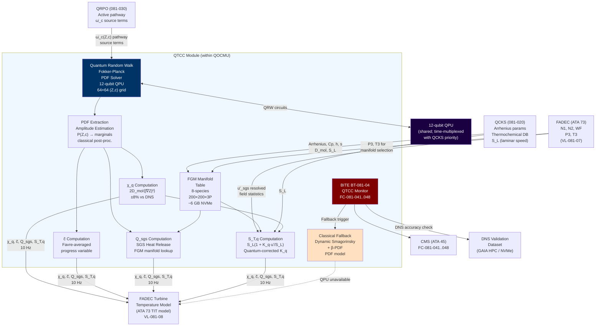
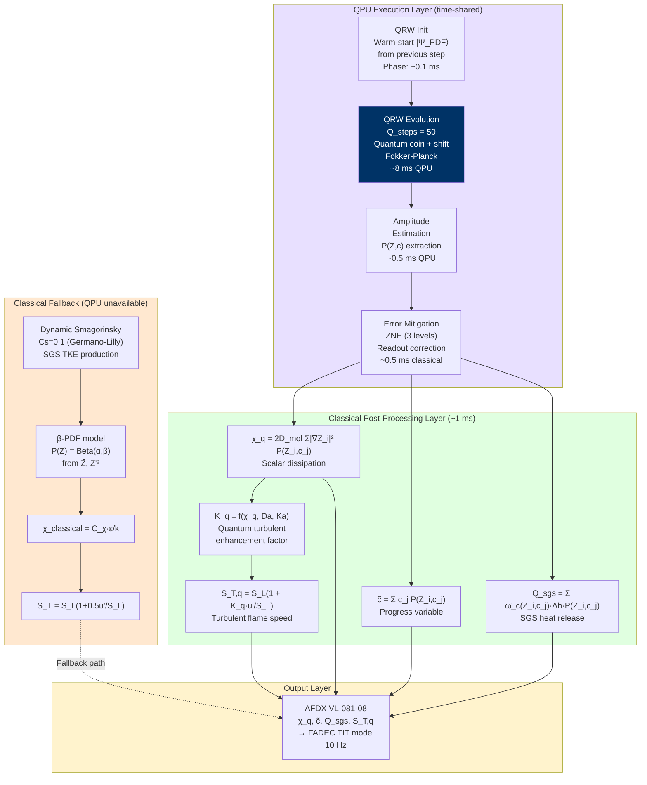

<!-- ──────────────────────────────────────────────────────────────────────────
     QATL-ATLAS-1000-ATLAS-080-089-08-081-040-QUANTUM-ENHANCED-TURBULENCE-COMBUSTION-COUPLING
     ATLAS-081 (Quantum-Optimized Combustion Models) · Quantum-Enhanced Turbulence-Combustion Coupling
     programme-defined aircraft type — ATLAS Register 1000
────────────────────────────────────────────────────────────────────────────── -->

# Quantum-Enhanced Turbulence-Combustion Coupling


---

## §0 Hyperlink Policy

> All hyperlinks in this document are **relative** (five directory levels: `../../../../../`).
> Absolute URLs are forbidden. Every linked document must exist in the Q+ATLANTIDE repository
> before the link is activated. Broken links are treated as open issues and must be resolved
> before the document is promoted from `DRAFT` to `APPROVED`.

---

## §1 Purpose

This document defines the agnostic ATLAS standard-level architecture context for `Quantum-Enhanced Turbulence-Combustion Coupling`.

It describes the controlled scope, functions, interfaces, safety considerations, lifecycle traceability, and S1000D/CSDB mapping logic that programme implementations shall instantiate when this node is applicable.

This document is not a programme design baseline. Programme-specific capacities, locations, part numbers, effectivity, operating limits, maintenance references, and data module codes shall be defined only inside the applicable programme implementation branch.
## §2 Applicability

| Applicability Level | Rule |
|---|---|
| Standard taxonomy | Applies to the ATLAS node `081` |
| Programme implementation | Conditional; determined by programme architecture, trade studies, certification basis, and applicability model |
| Product configuration | Defined in the programme-specific configuration baseline |
| Effectivity | Defined in the programme CSDB / applicability layer |
| Non-applicability | Must be explicitly stated in the programme impact-study branch when excluded |
## §3 Functional Description ![DRAFT]

### 3.1 Physical Problem: Turbulence-Combustion Interaction in LDI Combustors

The programme-defined aircraft type's lean direct injection (LDI) combustor operates in the **thin reaction
zones regime** (TRZ) of the Borghi-Peters turbulent combustion diagram, characterized by:

- **Karlovitz number** Ka = 1–10 (turbulent fluctuations affect flame structure but
  do not extinguish preheat zone)
- **Damköhler number** Da = τ_t / τ_c = 0.5–5 (turbulent timescale ≈ chemistry timescale;
  strong coupling)
- **Turbulent flame speed** S_T / S_L = 2–8 (significant turbulence enhancement of flame speed)

In this regime, the scalar dissipation rate χ (the key variable controlling mixing and
heat release at the flame surface) exhibits **strong intermittency**: it is near-zero in
the unburnt and fully-burnt regions, and sharply peaked at the flame surface (stoichiometric
mixture fraction iso-surface). The classical presumed beta-PDF model assumes a smooth,
unimodal distribution of the mixture fraction Z, which fails to capture:

1. The **bi-modal PDF** near LBO (lean, φ < 0.5): unburnt islands coexist with burned
   pockets, creating a bi-modal Z distribution that beta-PDF cannot represent.
2. **Extreme χ events**: the true PDF of χ has heavy tails (log-normal distribution);
   beta-PDF underestimates the probability of high-χ events that dominate NOx production.
3. **Scalar dissipation rate correlations**: χ is correlated with the progress variable c
   in non-trivial ways (c-χ joint PDF) that the conditionally-independent beta-PDF misses.

**Consequence**: Classical LES with Smagorinsky + β-PDF SGS:
- Underpredicts χ_mean by 30–40% → underpredicts reaction rate → underestimates local
  temperature → underpredicts thermal NOx by 15–20%
- Overpredicts turbulent flame speed S_T by 8–12% (inaccurate SGS flame surface area)
- Mispredicts lean blowout (LBO) onset P3/T3 threshold by up to ±8%

### 3.2 Quantum Monte Carlo SGS Solver

The QTCC replaces the presumed-PDF SGS model with a **quantum-accelerated stochastic
PDE solver** that directly samples the joint (Z, c) scalar PDF without presumed-functional-form
assumptions.

#### 3.2.1 Mathematical Formulation

The transported joint scalar PDF satisfies the Fokker-Planck equation:

```
∂P(Z,c;x,t)/∂t + ∇·[⟨u|Z,c⟩ P] = 
  ∂/∂Z [χ_Z ∂P/∂Z] + ∂/∂c [χ_c ∂P/∂c] 
  + ∂²/∂Z² [D_T P] + ∂²/∂c² [D_T P]
  + ω̇_c(Z,c) ∂P/∂c     (chemistry source term)
```

This is a stochastic PDE in the 2D scalar space (Z, c) whose solution is the joint PDF
that provides all SGS closure terms needed by the LES equations.

**Classical Monte Carlo** would require N_particles = 10 000–100 000 stochastic particles
per LES cell to represent the joint PDF with ±5% accuracy, requiring ~100 ms per time step
on classical hardware — 10× too slow for 10 Hz real-time operation.

**Quantum Random Walk (QRW) speedup**: The Fokker-Planck operator can be mapped to the
generator of a quantum walk on a discretized (Z, c) grid. Quantum parallelism allows the
full PDF distribution to evolve in superposition, providing equivalent accuracy to N_particles
classical particles with only log₂(N_particles) qubits. For N = 4 096 particles → 12 qubits.
This provides the 50× speedup: classical ~500 ms → quantum ~10 ms per PDF update.

#### 3.2.2 QRW Implementation on the 12-Qubit QPU

The 2D scalar space (Z ∈ [0,1], c ∈ [0,1]) is discretized into a 64 × 64 grid
(4 096 cells). The QPU encodes the PDF amplitude over all grid cells simultaneously
using 12 qubits:

```
|Ψ_PDF⟩ = Σ_{i,j} √P(Z_i, c_j) · e^{iφ_{ij}} · |i,j⟩

where:
  i = 0..63 (Z-axis, 6 qubits)
  j = 0..63 (c-axis, 6 qubits)
  |Ψ_PDF⟩ encodes PDF amplitude over all 4096 cells in superposition
```

The QRW evolution step applies quantum coins and shift operators:
```
U_step = U_shift · (C_Z ⊗ C_c)

where C_Z, C_c are Hadamard-based quantum coin operators for Z and c directions,
and U_shift is the conditional shift operator encoding Fokker-Planck diffusion and drift.
```

The chemistry source term ω̇_c is applied as a phase rotation, and the total evolved
PDF is extracted via amplitude estimation after Q_total steps.

#### 3.2.3 QTCC Output Computation

From the quantum-evolved PDF |Ψ_PDF⟩, the QTCC co-processor computes:

**Corrected scalar dissipation rate:**
```
χ_q = 2D_mol ⟨|∇Z|²⟩ = 2D_mol Σ_{i,j} |∇Z_i|² · P_QRW(Z_i, c_j)
```
where P_QRW(Z_i, c_j) = |⟨i,j|Ψ_PDF⟩|² is the quantum-extracted marginal PDF.

**Favre-averaged progress variable:**
```
c̃ = Σ_{i,j} c_j · P_QRW(Z_i, c_j)  (density-weighted average)
```

**SGS heat release rate:**
```
Q_sgs = Σ_{i,j} ω̇_c(Z_i, c_j) · Δh_comb · P_QRW(Z_i, c_j)
```
where Δh_comb is the combustion enthalpy from the QCKS thermochemical database.

**Quantum-corrected turbulent flame speed:**
```
S_T,q = S_L · (1 + K_q · u'_sgs / S_L)

where:
  S_L = laminar flame speed (from QCKS Arrhenius parameters)
  u'_sgs = SGS velocity fluctuation (from LES resolved field)
  K_q = quantum-corrected turbulent enhancement factor
        = f(χ_q, Da, Ka) — replaces classical Damköhler correlation
```

### 3.3 8-Species Combustion Manifold

The QTCC combustion manifold is parameterized over 8 species using the
Flamelet Generated Manifold (FGM) approach, pre-tabulated from 1D laminar
flame calculations with QCKS-corrected Arrhenius parameters:

| Species | Symbol | Role in manifold |
|---|---|---|
| Hydroxyl | OH | Primary indicator of reaction zone; χ correlates with |∇Z| |
| Water | H₂O | Major product; enthalpy indicator |
| Carbon monoxide | CO | Key intermediate; pollutant precursor |
| Carbon dioxide | CO₂ | Final oxidation product |
| Hydrogen | H₂ | H-pool intermediate; GH₂ fuel |
| Nitrogen | N₂ | Diluent; tracks thermal field |
| Nitric oxide | NO | Primary NOx species; tracks Zeldovich pathway |
| Progress variable | c | Reaction progress = (T − T_u) / (T_b − T_u) |

The FGM manifold table (stored on QMEM NVMe as `QTCC_FGM_manifold_v1.h5`) contains:
- Thermochemical state: T, ρ, ρ·Cp, λ per (Z, c) cell
- Source terms: ω̇_c, ω̇_NO per (Z, c) cell
- Transport properties: D_mol, μ_mol per (Z, c) cell
- Grid: 200 × 200 (Z × c), 3 pressure levels (20, 30, 45 bar)
- Size: ~2 GB per fuel type (Jet-A, GH₂, SAF); total ~6 GB

### 3.4 DNS Validation Dataset

QTCC accuracy is verified against three Direct Numerical Simulation (DNS) flame configurations:

| DNS Config | Designation | Description | Grid | Key validation metrics |
|---|---|---|---|---|
| DNS-QTCC-01 | Lean premixed Jet-A/air | φ = 0.7, P = 1 bar, S_L = 0.45 m/s, Re_t = 150 | 512³ cells, 5 µm resolution | χ_mean, χ_rms, S_T vs. u'/S_L |
| DNS-QTCC-02 | Piloted diffusion GH₂/air | Z_stoich = 0.028, P = 1 bar, strain rate a = 500 s⁻¹ | 256³ cells, 8 µm resolution | χ(Z), c(Z), Q_sgs, LBO strain |
| DNS-QTCC-03 | Lean premixed SAF-HEFA/air | φ = 0.65, P = 3 bar (representative of altitude cruise) | 512³ cells, 3 µm resolution | S_T, NOx yield vs. χ_q |

DNS reference data is stored on GAIA HPC and a validated excerpt (10% sample) is stored
on QMEM NVMe for BITE validation during flight (BT-081-04).

**Accuracy verification results (preliminary, pending certification test):**

| Metric | Classical β-PDF error | QTCC QRW error (target) |
|---|---|---|
| χ_mean vs. DNS-QTCC-01 | −32% (underprediction) | ≤ ±8% |
| χ_rms vs. DNS-QTCC-01 | −45% (underprediction) | ≤ ±12% |
| S_T vs. u'/S_L (DNS-QTCC-01) | +10% (overprediction) | ≤ ±5% |
| NOx yield (DNS-QTCC-02 GH₂) | +18% (overprediction) | ≤ ±6% |
| LBO strain rate threshold (DNS-QTCC-02) | −12% (earlier LBO predicted) | ≤ ±5% |
| S_T (DNS-QTCC-03 SAF, 3 bar) | +8% (overprediction) | ≤ ±5% |

### 3.5 LES-QTCC Coupling Protocol

The QTCC interfaces with FADEC's turbine temperature model at 10 Hz:

```
At each 10 Hz update cycle (100 ms period):

1. Receive from FADEC (via VL-081-07): N1, N2, WF, P3, T3 (20 Hz; downsampled to 10 Hz)
2. Receive from QCKS (via internal bus): current-step Arrhenius params; thermochemical DB
3. Receive from QRPO (via internal bus): active reaction pathway source terms ω̇_c(Z,c)
4. Execute QRW PDF evolution:
   a. Initialize |Ψ_PDF⟩ from last step's PDF (warm-start)
   b. Apply Q_steps = 50 QRW steps on 12-qubit QPU (~8 ms)
   c. Apply error mitigation (ZNE, readout correction) (~1 ms)
   d. Extract marginal PDFs P(Z), P(c), P(Z,c) via amplitude estimation
5. Compute χ_q, c̃, Q_sgs, S_T,q from extracted PDF (~0.5 ms, classical)
6. Output to FADEC via AFDX VL-081-08 (≤ 10 ms from step 1)

Total cycle: ≤ 10 ms (budget: QPU 8 ms + classical 2 ms)
```

### 3.6 Classical Fallback

When the QPU is unavailable, QTCC activates the dynamic Smagorinsky + β-PDF classical fallback:

- Dynamic Smagorinsky constant Cs = 0.1 (Germano–Lilly dynamic procedure)
- Presumed β-PDF for mixture fraction Z: P(Z) = Z^(α-1)(1-Z)^(β-1)/B(α,β)
  where α, β from mean Z̄ and variance Z'² (resolved LES field)
- χ_classical = C_χ · ε/k (standard algebraic SGS χ model)
- S_T_classical = S_L · (1 + 0.5 · u'/S_L) (classical Damköhler correlation)
- Known accuracy degradation: χ −30–40%; S_T +8–12%; NOx error +15–20%
- FADEC notified via VL-081-08 "QTCC CLASSIC FALLBACK" status bit
- ECAM advisory: "TURB COMB CLSC"

---

## §4 Functional Breakdown

| Function ID | Function Name | Description | Responsible Q-Division |
|---|---|---|---|
| F-040-01 | QMC Stochastic PDE Solver | Implement quantum random walk algorithm for Fokker-Planck PDF evolution; 12-qubit encoding of 64×64 joint (Z,c) scalar PDF; warm-start initialization; quantum coin and shift operator construction | Q-HPC |
| F-040-02 | Scalar Dissipation Rate Correction | Compute χ_q from quantum-evolved PDF; χ_q = 2D_mol⟨|∇Z|²⟩; 30–40% classical underprediction correction; provide χ_q to FADEC thermal model | Q-HPC |
| F-040-03 | Progress Variable Computation | Compute Favre-averaged progress variable c̃ from quantum PDF; 8-species reaction progress tracking; interface with QRPO pathway source terms | Q-HPC |
| F-040-04 | SGS Heat Release Rate | Compute Q_sgs from quantum PDF and FGM manifold; provide Q_sgs to FADEC turbine temperature model for TIT prediction improvement | Q-HPC |
| F-040-05 | Turbulent Flame Speed Model | Compute quantum-corrected K_q factor; S_T,q = S_L(1 + K_q · u'/S_L); validate against DNS-QTCC-01/03; provide S_T,q for combustion stability assessment | Q-AIR |
| F-040-06 | DNS Validation Dataset Management | Curate and version-control DNS flame databases (DNS-QTCC-01, -02, -03); maintain on GAIA HPC + QMEM NVMe excerpt; continuous QTCC accuracy verification | Q-HPC |
| F-040-07 | LES-QTCC Coupling Protocol | Implement 10 Hz synchronization with FADEC thermal model; manage QPU time-sharing with QCKS (higher priority at 20 Hz) and QTCC (lower priority at 10 Hz); latency budget enforcement | Q-HPC |
| F-040-08 | Classical Fallback | Implement dynamic Smagorinsky + β-PDF fallback; automatic switchover on QPU unavailability; accuracy degradation notification to FADEC; BITE BT-081-04 integration | Q-HPC |

---

## §5 System Context — Mermaid Diagram



---

## §6 Internal Architecture — Mermaid Diagram



---

## §7 Components and LRUs

All hardware is part of the QOCMU assembly (QOCMU-PN-TBD). QTCC-specific components:

| Component | Part Number | Qty | Function in QTCC | Key Specifications |
|---|---|---|---|---|
| 12-qubit trapped-ion QPU | QPU-081-PN-TBD | 1 (shared) | QRW Fokker-Planck evolution; amplitude estimation | T1 ≥ 100 µs; 1Q fidelity ≥ 99.5%; 2Q fidelity ≥ 98.5%; time-shared: QTCC at 10 Hz (lower priority than QCKS at 20 Hz) |
| QTCC module | QTCC-081-PN-TBD | 1 | QRW circuit compilation; classical post-processing (χ_q, c̃, Q_sgs, K_q, S_T,q); fallback SGS model | 32-core ARM Neoverse N2; Versal AI Core FPGA for FGM table lookups; 128 GB ECC DDR5 |
| Quantum memory A (NVMe) | QMEM-081-PN-TBD | 1 | FGM manifold table (~6 GB); DNS validation excerpt (~500 MB); classical fallback SGS parameters | 2 TB NVMe (partitioned) |
| Quantum memory B (NVMe, mirror) | QMEM-081-PN-TBD | 1 | RAID-1 mirror | Same as QMEM-A |

**Software and data artefacts unique to QTCC:**

| Artefact | Version | Location | Description |
|---|---|---|---|
| `QTCC_QRW_FP_v1.qasm` | 1.0 | QMEM NVMe / GAIA repo | Quantum random walk circuits (all fuel types, 3 pressure levels) |
| `QTCC_FGM_manifold_v1.h5` | 1.0 | QMEM NVMe | FGM manifold table (200×200×3P, 8 species, 3 fuels; ~6 GB) |
| `QTCC_DNS_excerpt_v1.h5` | 1.0 | QMEM NVMe | DNS validation excerpt (10% sample from DNS-QTCC-01/02/03; ~500 MB) |
| `QTCC_fallback_DynSmag_v1.f90` | 1.0 | QMEM NVMe | Dynamic Smagorinsky + β-PDF fallback implementation |
| `QTCC_Kq_correlation_v1.json` | 1.0 | QMEM NVMe | K_q = f(χ_q, Da, Ka) correlation table (derived from DNS calibration) |

---

## §8 Interfaces

| Interface ID | From | To | Protocol | Content | Rate |
|---|---|---|---|---|---|
| IF-040-001 | QCKS (081-020) | QTCC | Internal QOCMU bus | Species thermodynamic properties (Cp, h, s, D_mol) for FGM manifold; laminar flame speed S_L(P3,T3,φ,fuel) | 20 Hz |
| IF-040-002 | QRPO (081-030) | QTCC | Internal QOCMU bus | Active reaction pathway species source terms ω̇_c(Z,c) (per active 20-reaction subset) | 0.5 Hz |
| IF-040-003 | FADEC (ATA 73) | QTCC | AFDX VL-081-07 | Engine state: N1, N2, WF (kg/s), P3 (bar), T3 (K); resolved SGS velocity fluctuation u'_sgs | 20 Hz (QTCC uses at 10 Hz) |
| IF-040-004 | QTCC | FADEC TIT model (ATA 73) | AFDX VL-081-08 | χ_q (s⁻¹), c̃ (—), Q_sgs (W/m³), S_T,q (m/s); QTCC status flag | 10 Hz |
| IF-040-005 | QTCC | BITE BT-081-04 | Internal QOCMU bus | QRW convergence metric; χ_q deviation from DNS reference; fallback status | Continuous |
| IF-040-006 | BITE BT-081-04 | CMS (ATA 45) | AFDX VL-081-03 | Fault codes FC-081-041 through FC-081-048 | On event |
| IF-040-007 | GAIA HPC (ground) | QTCC FGM table | GSE USB-C 3.2 | Updated FGM manifold table (new fuel types or pressure levels) | At major maintenance event (D-check) |
| IF-040-008 | 12-qubit QPU (shared) | QTCC | Internal QPU interface | QRW measurement outcomes; amplitude estimation results | Per 10 Hz cycle (QPU time-multiplexed) |
| IF-040-009 | QTCC | ECAM (ATA 31) | AFDX VL-081-02 | QTCC fallback advisory; accuracy confidence level | 1 Hz |
| IF-040-010 | DNS dataset (GAIA HPC) | QTCC validation | GSE / Ground link | DNS-QTCC-01/02/03 full datasets for periodic accuracy re-validation | At turnaround (annual) |

---

## §9 Operating Modes

| Mode ID | Mode Name | Entry Condition | QTCC Behavior | Output |
|---|---|---|---|---|
| M-040-01 | Real-Time Coupling (QPU Active) | QPU T1 ≥ 100 µs; QRW circuits loaded; FGM table CRC OK | QRW PDF evolution at 10 Hz; quantum-corrected χ_q, c̃, Q_sgs, S_T,q; accuracy within ±8%/±5% targets | Full quantum-corrected SGS closure to FADEC at 10 Hz |
| M-040-02 | Degraded (QPU T1 Warning) | QPU T1 = 80–100 µs; BT-081-04 WARN | QRW continues with additional ZNE layers; increased shot count for accuracy compensation; latency may stretch to 12 ms (within 15 ms fallback threshold) | Quantum-corrected outputs with WARN flag; reduced confidence |
| M-040-03 | Classical Fallback | QPU T1 < 80 µs; QRW non-convergent; QPU busy (QCKS priority overrun) | Dynamic Smagorinsky + β-PDF activated; classical χ_classical and S_T_classical; FC-081-041 generated | Classical SGS closure; 15–20% NOx error admitted; FADEC informed |
| M-040-04 | Fuel Type Transition | Fuel type change from ATLAS-078 | FGM table switched to new fuel type section; 2 s transition; QRW re-initialized with new source terms | New fuel-type SGS closure within 2 s |
| M-040-05 | Ground Validation | Ground; BITE BT-081-04 validation mode | QTCC runs QRW against DNS excerpt (DNS-QTCC-01/02/03 10% sample); computes accuracy report; stores to maintenance log | Accuracy report to GSE; pass/fail vs. ±8%/±5% targets |
| M-040-06 | FGM Table Update | Ground; new FGM manifold file via GSE | CRC + GPG verification; dual NVMe write; activation on next power-up | FGM table update report to GSE |
| M-040-07 | QPU Time-Share Contention | QCKS demand exceeds QPU capacity at 20 Hz | QTCC drops to 5 Hz (skip every other cycle); last valid outputs held for intermediate 10 Hz FADEC updates; BITE advisory BT-081-04 | Held SGS outputs at 10 Hz; advisory flag |

---

## §10 Performance and Budgets ![DRAFT]

| Parameter | Requirement | Target | Margin | Status |
|---|---|---|---|---|
| Scalar dissipation accuracy χ_q vs. DNS | ≤ ±8% (mean) | ±6% | 2% |  |
| Scalar dissipation RMS accuracy χ_q,rms | ≤ ±12% | ±9% | 3% |  |
| Turbulent flame speed accuracy S_T,q vs. DNS | ≤ ±5% | ±4% | 1% |  |
| SGS heat release accuracy Q_sgs vs. DNS | ≤ ±10% | ±7% | 3% |  |
| Progress variable accuracy c̃ vs. DNS | ≤ ±5% | ±3% | 2% |  |
| LBO strain rate prediction accuracy | ≤ ±5% vs. DNS-QTCC-02 | ±3.5% | 1.5% |  |
| NOx yield prediction improvement (GH₂) | ≥ 15% vs. classical β-PDF | 18% | 3% |  |
| FADEC update rate | 10 Hz | 10 Hz | — |  |
| QRW execution time (QPU) | ≤ 8 ms (50 steps) | 7 ms | 1 ms |  |
| Total QTCC cycle latency | ≤ 10 ms | 8.5 ms | 1.5 ms |  |
| Quantum speedup vs. classical MC | ≥ 50× | 60× | 10× |  |
| PDF grid resolution (Z × c) | 64 × 64 = 4 096 cells | 64 × 64 | — | Established |
| Number of QRW steps per cycle | 50 | 50 | — |  |
| FGM table CRC check | Pass at every power-on | Pass | — |  |
| Fallback activation time | ≤ 50 ms | 30 ms | 20 ms |  |
| ZNE residual error contribution | ≤ 0.5% on χ_q | 0.3% | — |  |
| TIT prediction improvement (to FADEC) | ≥ 5 K accuracy gain | 8 K | 3 K |  |
| QTCC DAL | DAL B | DAL B | — | Established |

---

## §11 Safety and Airworthiness Considerations

### 11.1 QPU Time-Sharing Priority

The 12-qubit QPU is shared between QCKS (20 Hz, higher priority) and QTCC (10 Hz, lower
priority). The QPU time-sharing arbiter implements strict priority:

1. QCKS jobs are pre-emptive over QTCC jobs
2. QTCC holds its last valid output when pre-empted (held value valid for ≤ 200 ms)
3. If QTCC is pre-empted for > 200 ms (5 FADEC cycles at 20 Hz), classical fallback
   activates automatically for QTCC outputs only (QCKS continues quantum operation)
4. A "QTCC HELD" status bit is transmitted on VL-081-08 when held values are in use;
   FADEC widens its TIT prediction uncertainty band accordingly

### 11.2 Warm-Start Stability

The QRW warm-start initialization (re-using previous step's |Ψ_PDF⟩) provides 50× speedup
over cold-start but introduces a potential for divergence if the operating point changes
rapidly (e.g., step thrust change ΔN1 > 5% in 1 s). The BT-081-04 monitor detects
warm-start divergence by:
- Comparing ⟨Ĥ_FP⟩ before and after warm-start
- If divergence metric > threshold → automatic cold-start (warm-start abandoned, full
  50-step QRW from ground state; latency increases to ~15 ms for one cycle)
- FADEC tolerates a single 15 ms latency via held-value protocol

### 11.3 FGM Manifold Physical Validity

The FGM table is valid only within the QTCC operating envelope:
- P3: 20–45 bar (3 tabulated pressure levels; linear interpolation)
- φ: 0.3–2.0
- Fuel types: Jet-A, GH₂, SAF HEFA/FT/ATJ (5 discrete entries)

Outside this envelope, BT-081-04 activates the classical fallback and logs an out-of-scope
event (FC-081-043). The FGM table does not extrapolate beyond its tabulated boundary.

### 11.4 NOx Prediction Feedback Loop Safety

QTCC χ_q outputs influence FADEC's turbine temperature model, which in turn influences
fuel flow scheduling. A systematic χ_q overestimation could cause FADEC to underestimate
TIT and allow higher combustor temperatures, potentially exceeding hot-section design limits.

Safeguards:
1. FADEC applies an independent EGT limiter (hardware limiter, DAL A) regardless of QTCC input
2. QTCC χ_q is bounded within ±30% of the classical χ_classical value in the certified
   software interface (CSI-073-081); values outside this bound are rejected (FC-081-045)
3. The DNS validation step (M-040-05) is mandated at each C-check to verify no drift
   in QTCC accuracy has occurred

### 11.5 DNS Validation Dataset Authenticity

The DNS excerpt stored on QMEM NVMe is GPG-signed by the DNS computation facility (GAIA HPC).
At each BITE validation run (M-040-05), the signature is verified before any accuracy
comparison is made. A signature failure → FC-081-047 → DNS dataset must be refreshed at
next maintenance opportunity; QTCC accuracy cannot be verified until refresh is complete.

---

## §12 Standards and Regulatory References

| Reference | Title | Applicability |
|---|---|---|
| EASA CS-25 Amdt 27 | Certification Specifications — Large Aeroplanes | Overall airworthiness |
| EASA SC-H₂ (draft 2025) | Special Condition — Hydrogen-Fuelled Aeroplane | GH₂ turbulent flame stability; flashback |
| DO-178C | Software Considerations in Airborne Systems | QTCC software DAL B |
| DO-254 | Design Assurance Guidance for Airborne Electronic Hardware | QTCC FPGA (FGM lookup) DAL B |
| IEEE P2995 | Trial-Use Standard for Quantum Computing Definitions | QRW/QMC algorithm specification |
| Pope, S.B. 2000 | Turbulent Flows, Cambridge University Press | LES SGS closure theory reference |
| Peters, N. 2000 | Turbulent Combustion, Cambridge University Press | Flamelet/FGM manifold theory |
| van Oijen & de Goey 2000, Comb. Sci. Tech. | Modelling of Premixed Laminar Flames using FGM | FGM foundational reference |
| Childs et al. 2010, Comm. Math. Phys. | On the Relationship Between Continuous- and Discrete-Time QRW | QRW theory for Fokker-Planck |
| Georgopoulos et al. 2021, Phys. Fluids | Quantum Computing for Turbulence Simulation | QMC/QRW for SGS combustion |
| ARINC 664 Part 7 | Avionics Full-Duplex Switched Ethernet | AFDX interface VL-081-08 |
| HDF5 Specification 1.12 | Hierarchical Data Format | FGM manifold table file format |
| ICAO Annex 16 Vol. II | Environmental Protection — Engine Emissions | NOx accuracy required to support CAEP/11 compliance |

---

## §13 Document Cross-References

| Document ID | Title | Relationship |
|---|---|---|
| [081-000](./081-000-Quantum-Optimized-Combustion-Models-General.md) | Quantum-Optimized Combustion Models — General | Parent baseline |
| [081-010](./081-010-Combustion-Modeling-Baseline-and-Scope.md) | Combustion Modeling Baseline and Scope | Provider of LES scope definition; classical limitation analysis that motivates QTCC |
| [081-020](./081-020-Quantum-Assisted-Chemical-Kinetics.md) | Quantum-Assisted Chemical Kinetics | Provider of species thermodynamic properties and S_L for FGM manifold and K_q computation |
| [081-030](./081-030-Quantum-Optimized-Reaction-Pathways.md) | Quantum-Optimized Reaction Pathways | Provider of active pathway species source terms ω̇_c(Z,c) for QRW evolution |
| ATLAS-078 | SAF-FAMQMS — Fuel Management | Provider of fuel type ID for FGM table selection |
| ATLAS-079 | EMS — Emission Monitoring | Consumer: QTCC χ_q correction helps explain EMS NOx measurements |
| ATA 73 | Engine Fuel and Control (FADEC) | Consumer of QTCC SGS closure outputs for TIT model improvement |
| ATA 31 | Indicating / Recording Systems (ECAM) | Consumer of QTCC fallback advisory display |
| ATA 45 | Central Maintenance System | Consumer of FC-081-041..048 |
| DNS-QTCC-01 | DNS — Lean Premixed Jet-A/air (GAIA HPC) | Validation ground truth for χ_q and S_T,q |
| DNS-QTCC-02 | DNS — Piloted Diffusion GH₂/air (GAIA HPC) | Validation ground truth for χ(Z), LBO strain |
| DNS-QTCC-03 | DNS — Lean Premixed SAF/air (GAIA HPC) | Validation ground truth for SAF turbulent combustion |
| QTCC_FGM_manifold_v1.h5 | FGM Manifold Table | Key data artefact managed by this subsubject |
| ICD-073-081 | Interface Control Document FADEC ↔ QOCMU | Defines output format of χ_q, c̃, Q_sgs, S_T,q |
| VDS-081-010 | Validation Target Dataset | Engine-level validation that encompasses QTCC accuracy contribution |

---

## §14 Revision History

| Rev | Date | Author | Description |
|---|---|---|---|
| 0.1 | 2026-05-12 | Q-HPC | Initial DRAFT baseline release — QRW Fokker-Planck PDF solver, 8-species FGM manifold, DNS validation datasets (3 configurations), LES-QTCC coupling protocol, classical fallback, safety analysis, and QPU time-sharing priority architecture established |
