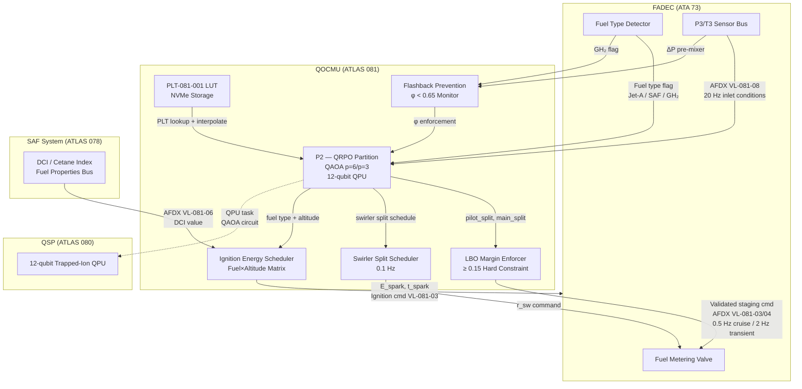
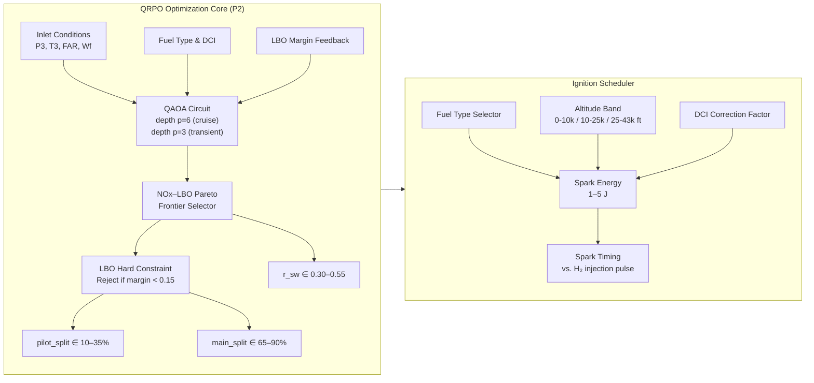

<!-- ATLAS-081-050 | Fuel-Air Mixing and Ignition Optimization | programme-defined aircraft type | ATLAS-1000
     Aircraft: programme-defined aircraft type | Register: ATLAS-1000 | Section: 080-089 | Subsection: 081-050
     BREX: BREX-081-v1 | Controller: QOCMU (DAL B, dual-channel) | QPU: 12-qubit trapped-ion
     Primary Q-Division: Q-AIR | Status: DRAFT v0.1 | Date: 2026-05-12
     S1000D DMC: DMC-<PROGRAMME>-<VARIANT>-0081-050-00A-040A-EN-US
     Related DMs: DM-081-016 (Descriptive), DM-081-017 (Staging Upload), DM-081-018 (Ignition Inspection) -->

# Fuel-Air Mixing and Ignition Optimization

---

## §0 Hyperlink Policy

> All hyperlinks in this document are **relative** (five directory levels: `../../../../../`).
> No absolute URLs or external links are used within cross-reference tables. All ATLAS document
> references resolve within the ATLAS-1000 register tree. S1000D DMC references are canonical
> identifiers and do not constitute navigable hyperlinks in this markdown rendering.
>
> Exception: Badge image links (shields.io) are external and used for visual status indication only.
> They carry no normative content.

---

## §1 Purpose

This document defines the agnostic ATLAS standard-level architecture context for `Fuel-Air Mixing and Ignition Optimization`.

It describes the controlled scope, functions, interfaces, safety considerations, lifecycle traceability, and S1000D/CSDB mapping logic that programme implementations shall instantiate when this node is applicable.

This document is not a programme design baseline. Programme-specific capacities, locations, part numbers, effectivity, operating limits, maintenance references, and data module codes shall be defined only inside the applicable programme implementation branch.
## §2 Applicability

| Applicability Level | Rule |
|---|---|
| Standard taxonomy | Applies to the ATLAS node `081` |
| Programme implementation | Conditional; determined by programme architecture, trade studies, certification basis, and applicability model |
| Product configuration | Defined in the programme-specific configuration baseline |
| Effectivity | Defined in the programme CSDB / applicability layer |
| Non-applicability | Must be explicitly stated in the programme impact-study branch when excluded |
## §3 Functional Description ![DRAFT]

### 3.1 Multi-Objective Fuel Staging Optimization

The QRPO partition (ARINC 653 partition P2 of QOCMU) executes a **Quantum Approximate Optimization
Algorithm (QAOA)** circuit on the 12-qubit trapped-ion QPU to solve the following multi-objective
optimization problem at each staging update cycle:

**Minimize:** *J* = w₁·NOx_pred + w₂·(1/LBO_margin) + w₃·Combustion_Instability_Index

**Subject to:**
- `pilot_split` ∈ [0.10, 0.35] (10–35% of total fuel flow)
- `main_split` = 1 − `pilot_split` ∈ [0.65, 0.90]
- LBO_margin ≥ 0.15 (hard constraint, enforced pre-output)
- EGT < EGT_limit − 20 K (thermal margin)
- NOx < CAEP/8 × 0.70 (70% of CAEP/8 limit)

Weights *w₁*, *w₂*, *w₃* are adapted by the fuel type:

| Fuel   | w₁ (NOx) | w₂ (LBO safety) | w₃ (stability) |
|--------|-----------|-----------------|----------------|
| Jet-A  | 0.50      | 0.35            | 0.15           |
| SAF    | 0.55      | 0.30            | 0.15           |
| GH₂    | 0.40      | 0.45            | 0.15           |

The QAOA circuit depth *p* = 6 provides a Pareto-efficient solution within the 500 ms QRPO budget
for steady-state cruise, and depth *p* = 3 within the 250 ms reduced budget for 2 Hz transient
updates.

### 3.2 Swirler Air Split Control

The combustor features a **dual-swirler configuration**: co-rotating inner swirler (IS) and counter-
rotating outer swirler (OS). The IS/OS airflow split ratio *r*_sw controls the size and precession
frequency of the TRZ. QOCMU optimizes *r*_sw in the range [0.30, 0.55] (inner fraction) to:

- Maximize TRZ stability (minimize coherent oscillation at Strouhal number St > 0.3)
- Minimize TRZ blow-off risk at low-power idle operation (Wf/P3 < 0.004 kg/(s·kPa))
- Suppress thermoacoustic instability modes identified by QTCC (see 081-040)

The swirler split is a **scheduled parameter** updated at 0.1 Hz (slower than staging) via a
separate schedule table stored in QOCMU NVMe partition. It is not transmitted real-time but is
applied during the next FADEC authority window via VL-081-03.

### 3.3 Ignition Timing and Energy Management

The ignition system consists of two independent igniter plugs (IGNA, IGNB) per engine, each rated
for 2–10 J/spark at up to 8 sparks/second. QOCMU manages ignition solely during:

- **Engine start** (ground and in-flight relight)
- **Altitude relight events** (triggered by FADEC flameout detection)
- **Crosswind relight** (tested to 43 000 ft, M 0.87 per certification basis)

The ignition energy schedule is optimized per fuel type and altitude band, balancing plug erosion
life against assured ignition probability (P_ign ≥ 0.995 per CS-E 740):

| Fuel   | Altitude Band  | Spark Energy (J) | Spark Rate (Hz) | Min Sparks |
|--------|----------------|------------------|-----------------|------------|
| Jet-A  | 0–10 000 ft    | 2.0–3.0          | 4               | 3          |
| Jet-A  | 10 000–25 000 ft | 3.0–4.0        | 6               | 4          |
| Jet-A  | 25 000–43 000 ft | 4.0–5.0        | 8               | 5          |
| SAF    | 0–10 000 ft    | 2.5–3.5          | 4               | 3          |
| SAF    | 10 000–25 000 ft | 3.5–4.5        | 6               | 4          |
| SAF    | 25 000–43 000 ft | 4.5–5.0        | 8               | 5          |
| GH₂    | 0–10 000 ft    | 1.0–1.5          | 4               | 2          |
| GH₂    | 10 000–25 000 ft | 1.5–2.0        | 6               | 3          |
| GH₂    | 25 000–43 000 ft | 2.0–3.0        | 8               | 4          |

GH₂ requires lower ignition energy due to its wider flammability limits (LEL 4%, UEL 75% vol.) but
requires tighter timing relative to the pre-mixer H₂ injection pulse.

### 3.4 GH₂ Flashback Prevention

Hydrogen combustion at equivalence ratios φ > 0.7 risks **boundary-layer flashback** into the
premixer duct due to H₂'s high laminar flame speed (S_L up to 3.0 m/s at φ = 1.0, 600 K inlet).
QOCMU implements a quantum-optimized **vortex breakdown criterion** for the H₂ pre-mixer:

- The swirl number *S* is monitored via FADEC P3/T3 and pre-mixer ΔP sensors.
- QOCMU enforces a minimum axial velocity *u*_ax > S_L × 2.5 at the pre-mixer outlet.
- If FADEC reports Wf_H₂ causing φ > 0.65 (5% margin below flashback threshold), QOCMU
  commands reduction of pilot H₂ split and increase of bypass air fraction.
- **Flashback margin** ≥ 0.10 maintained at all certified GH₂ operating points.

BITE function BT-081-11 validates fuel-type parameter consistency before GH₂ mode activation.

### 3.5 SAF Ignition Profile Adaptation

SAF blends (HEFA, FT, ATJ) differ from Jet-A in their derived cetane index (DCI) and distillation
curve. QOCMU applies a **DCI correction** to ignition energy:

`E_ign_SAF = E_ign_JetA × (1 + 0.015 × (45 − DCI_SAF))`

For HEFA at DCI 55: E_ign_SAF = E_ign_JetA × 0.85 (lower energy required — HEFA ignites more
readily). For ATJ at DCI 40: E_ign_SAF = E_ign_JetA × 1.075. The DCI value is read from the SAF
system data (ATLAS 078) via AFDX VL-081-06.

---

## §4 Functional Breakdown

| Function ID  | Function Name                    | Description                                                                                        | Q-Division  |
|--------------|----------------------------------|----------------------------------------------------------------------------------------------------|-------------|
| F-050-01     | Pilot/Main Fuel Split Optimization | QAOA-based multi-objective staging; NOx vs. LBO Pareto frontier; p=6 depth (cruise), p=3 (transient) | Q-AIR    |
| F-050-02     | Swirler Air Split Control        | Inner/outer swirler ratio optimization [0.30–0.55]; TRZ stability; 0.1 Hz schedule update         | Q-AIR       |
| F-050-03     | GH₂ Flashback Prevention         | Vortex breakdown criterion; φ < 0.65 enforcement; axial velocity > 2.5×S_L; flashback margin ≥ 0.10 | Q-AIR    |
| F-050-04     | SAF Ignition Profile Adjustment  | DCI correction to ignition energy; HEFA/FT/ATJ variants; cetane index from ATLAS 078 via VL-081-06 | Q-GREENTECH |
| F-050-05     | Altitude Relight Envelope        | 0–43 000 ft relight schedule; P_ign ≥ 0.995 per CS-E 740; ignition timing vs. FAR                | Q-AIR       |
| F-050-06     | Transient Staging Protocol       | Acceleration/deceleration staging; 2 Hz FADEC update; QAOA depth reduction to p=3                | Q-HPC       |
| F-050-07     | LBO Margin Enforcement           | Real-time LBO margin ≥ 0.15; hard constraint; emergency pilot-only fallback (pilot_split = 1.0)   | Q-AIR       |
| F-050-08     | GSE Staging Schedule Loader      | Pilot/main table file upload via GSE-081; SFTP; CRC-32 integrity; CM version tagging              | Q-HPC       |

---

## §5 System Context — Mermaid Diagram

---

## §6 Internal Architecture — Mermaid Diagram

---

## §7 Components and LRUs

| LRU / Component         | Part Number (TBD)  | Location     | DAL | Function                                                      | Qty |
|-------------------------|--------------------|--------------|-----|---------------------------------------------------------------|-----|
| QOCMU                   | QOCMU-001-TBD      | EE Bay, Pos 4A | B  | QRPO partition (P2): QAOA fuel staging and ignition scheduling | 1  |
| QOCMU QPU Module        | QPU-TI-12Q-001     | QOCMU internal | B  | 12-qubit trapped-ion co-processor for QAOA execution          | 1   |
| FADEC (ATA 73)          | OEM-supplied       | Engine nacelle | A  | Fuel metering valve actuation; staging command receiver       | 2   |
| Igniter Plug A/B        | IGN-PLG-001/002    | Combustor casing | C | Spark ignition 2–10 J; 8 sparks/sec max                      | 2/eng |
| GSE-081 Maintenance Tool | GSE-081-TBD       | Ground only   | —  | Staging schedule and PLT upload; BITE interface               | 1   |

> **Note:** FADEC is an external LRU (ATA 73). QOCMU does not replace or redundantly implement FADEC
> functions. In fallback mode, FADEC autonomously uses stored classical staging tables.

---

## §8 Interfaces

| Interface ID   | From             | To               | Protocol        | AFDX VL       | Data Content                                      | Rate          |
|----------------|------------------|------------------|-----------------|---------------|---------------------------------------------------|---------------|
| IF-050-01      | FADEC (ATA 73)   | QOCMU P2         | AFDX            | VL-081-08     | P3, T3, N1, N2, Wf, FAR, fuel_type flag           | 20 Hz         |
| IF-050-02      | QOCMU P2         | FADEC (ATA 73)   | AFDX            | VL-081-03     | pilot_split, main_split, r_sw, ignition_cmd CHA   | 0.5/2 Hz      |
| IF-050-03      | QOCMU P2         | FADEC (ATA 73)   | AFDX            | VL-081-04     | pilot_split, main_split, r_sw, ignition_cmd CHB   | 0.5/2 Hz      |
| IF-050-04      | ATLAS 078 SAF    | QOCMU P2         | AFDX            | VL-081-06     | DCI, blend_ratio, fuel_type (HEFA/FT/ATJ)         | 1 Hz          |
| IF-050-05      | ATLAS 080 QSP    | QOCMU QPU        | QPU Bus         | VL-081-05     | QPU calibration state; coherence T1 monitor       | 1 Hz          |
| IF-050-06      | QOCMU P4         | CMS (ATA 45)     | AFDX            | VL-081-01     | BITE results BT-081-01..12; LRU health            | On-event      |
| IF-050-07      | QOCMU P4         | ECAM (ATA 31)    | AFDX            | VL-081-02     | PROP QOCM synoptic data; mode; LBO margin display | 1 Hz          |
| IF-050-08      | GSE-081          | QOCMU            | USB-C 3.2       | VL-081-09     | Staging schedule table upload; PLT-081-001 update | Maintenance   |

---

## §9 Operating Modes

| Mode ID | Mode Name              | Trigger                            | QOCMU P2 Behavior                                                            | FADEC Response                           |
|---------|------------------------|------------------------------------|------------------------------------------------------------------------------|------------------------------------------|
| M-050-01 | Normal Cruise          | N1 stable ±2%, altitude stable     | QAOA p=6, 0.5 Hz staging update, 0.1 Hz swirler update, LBO monitoring       | Applies quantum-optimized staging tables |
| M-050-02 | Transient Acceleration | dN1/dt > +5%/s                     | QAOA p=3, 2 Hz staging update, priority on LBO margin (w₂ increased to 0.55) | Rapid fuel staging response              |
| M-050-03 | Transient Deceleration | dN1/dt < −5%/s                     | QAOA p=3, 2 Hz staging update, priority on LBO margin and EGT cooling        | Progressive main split reduction         |
| M-050-04 | Altitude Relight       | FADEC flameout detect, alt ≤ 43 kft | Ignition schedule active; fuel-specific E_spark and timing applied           | Igniter activation per QOCMU command     |
| M-050-05 | GH₂ Flashback Monitor  | GH₂ fuel_type active               | Continuous φ monitor; vortex breakdown check; axial velocity enforcement     | Pre-mixer bypass valve command if needed |
| M-050-06 | Classical Fallback     | QOCMU BITE fault (any channel)     | Quantum staging suspended; stored classical pilot_split tables used           | FADEC autonomous classical mode          |
| M-050-07 | Maintenance            | GSE-081 connected; aircraft grounded | BITE full cycle; staging table upload; PLT integrity check                  | FADEC ground maintenance mode            |

---

## §10 Performance and Budgets ![DRAFT]

| Parameter                          | Requirement          | Current Estimate     | Status               |
|------------------------------------|----------------------|----------------------|----------------------|
| Staging update rate (cruise)       | 0.5 Hz               | 0.5 Hz               |  |
| Staging update rate (transient)    | 2.0 Hz               | 2.0 Hz               |  |
| QAOA circuit execution time (p=6)  | ≤ 450 ms             | ~380 ms est.         |  |
| QAOA circuit execution time (p=3)  | ≤ 200 ms             | ~160 ms est.         |  |
| LBO margin (all conditions)        | ≥ 0.15               | ≥ 0.17 (sim.)        |  |
| Pilot split range                  | 10–35%               | 10–35%               |  |
| Main split range                   | 65–90%               | 65–90%               |  |
| Ignition energy (Jet-A)            | 2–5 J                | 2–5 J                |  |
| Ignition energy (GH₂)              | 1–3 J                | 1–3 J                |  |
| Flashback margin (GH₂)             | ≥ 0.10               | ≥ 0.12 (sim.)        |  |
| Ignition probability (P_ign)       | ≥ 0.995 per CS-E 740 | 0.997 (sim.)         |  |
| NOx reduction vs. CAEP/8           | ≤ CAEP/8 × 0.70      | 0.68 × CAEP/8 (sim.) |  |
| Swirler split update rate          | 0.1 Hz               | 0.1 Hz               |  |

---

## §11 Safety and Airworthiness Considerations

### 11.1 DAL Assignment

QOCMU is assigned **DAL B** (Development Assurance Level B) per SAE ARP4754A. The QRPO partition
(P2) is DAL B. LBO margin enforcement function (F-050-07) is considered a **mitigating function**
for the hazard "Engine Flameout — Both Engines" (classified as Catastrophic, FHA severity 1) and
receives full DAL B rigor. The hard constraint enforcement of LBO ≥ 0.15 has software assurance
evidence per DO-178C at DAL B.

### 11.2 Dual-Channel Safety

Both QOCMU channels (A and B) independently compute pilot/main staging and ignition commands.
FADEC uses a **select-high/select-low** strategy for staging commands from channels A and B (selects
the command closer to the conservative baseline in ambiguous cases). Channel changeover latency ≤ 50 ms
(see ARINC 653 partition management in 081-080).

### 11.3 LBO Margin Monitoring

The LBO margin is computed using the QCKS-derived reduced mechanism's laminar flame speed and the
FADEC-reported combustor ΔP and Wf. The LBO margin is defined as:

`LBO_margin = (FAR_current − FAR_LBO) / FAR_LBO`

A margin < 0.15 triggers an amber ECAM advisory `PROP QOCM NOx HIGH` (overloaded for low LBO
margin monitoring in absence of a dedicated ECAM item) and increases w₂ in the QAOA cost function
to 0.65, prioritizing LBO safety above NOx minimization.

### 11.4 GH₂ Flashback Hazard

Hydrogen flashback is classified as a **Major** hazard (FHA severity 3) — potential engine damage
without safety shutdown. QOCMU flashback prevention function (F-050-03) is a **DAL C** monitoring
function. FADEC independently implements a φ > 0.75 fuel cutback independent of QOCMU.

### 11.5 Certification Basis

| Regulation           | Topic                                               |
|----------------------|-----------------------------------------------------|
| CS-E 740             | Altitude relight; ignition probability ≥ 0.995      |
| CS-25 Appendix M     | Fuel system compatibility; SAF blends               |
| ICAO Annex 16 Vol. II CAEP/8 | NOx emission limits at LTO cycle         |
| DO-178C DAL B        | QOCMU QRPO partition software                       |
| DO-254 DAL B         | QOCMU QPU control logic                             |
| SAE ARP4754A         | QOCMU system DAL allocation                         |

---

## §12 Standards and Regulatory References

| Standard / Reference           | Title                                                                  | Applicability                          |
|--------------------------------|------------------------------------------------------------------------|----------------------------------------|
| CS-E 740                       | EASA Altitude Relight Requirements                                     | Ignition scheduling; P_ign ≥ 0.995    |
| CS-25 Appendix M               | Fuel Compatibility — SAF Blends                                        | SAF DCI correction; HEFA/FT/ATJ        |
| ICAO Annex 16 Vol. II CAEP/8   | Aircraft Engine Emissions Standards                                    | NOx targets; LTO cycle compliance      |
| DO-178C                        | Software Considerations in Airborne Systems                            | QOCMU DAL B software                   |
| DO-254                         | Design Assurance Guidance for Airborne Electronic Hardware             | QPU control logic                      |
| SAE ARP4754A                   | Guidelines for Development of Civil Aircraft and Systems               | QOCMU system DAL allocation            |
| SAE AS6081                     | Fraudulent/Counterfeit Electronic Parts — Avoidance Protocol           | QPU module procurement                 |
| ARINC 653-1                    | Avionics Application Software Standard Interface                       | QOCMU partition temporal isolation     |
| ARINC 429                      | Digital Information Transfer System                                    | Legacy FADEC data bus compatibility    |
| MIL-DTL-38999                  | Circular Threaded Electrical Connectors                                | QOCMU harness connectors               |

---

## §13 Document Cross-References

| Document ID                      | Title                                           | Relationship                                         |
|----------------------------------|-------------------------------------------------|------------------------------------------------------|
| `081-000-QOCM-System-Overview`   | QOCM System Overview                           | Parent system document; QOCMU architecture           |
| `081-020-Quantum-Chemical-Kinetics` | Quantum Chemical Kinetics (QCKS)            | QCKS provides laminar flame speed for LBO margin     |
| `081-030-Quantum-Reaction-Pathways` | Quantum Reaction Pathway Optimizer (QRPO)   | QRPO partition and PLT-081-001 LUT architecture      |
| `081-040-Quantum-Turbulence-Combustion-Coupling` | QTCC                         | Thermoacoustic instability identification            |
| `081-060-Emissions-Formation-and-Reduction-Modeling` | Emissions Models          | NOx predictions fed to EMS via VL-081-07            |
| `081-070-Hybrid-Classical-Quantum-Simulation-Workflow` | Hybrid Workflow          | Transient protocol; QTQ-081 priority scheduling      |
| `081-080-Combustion-Model-Monitoring-Diagnostics` | QOCMU Hardware & BITE        | BITE BT-081-01..12; ECAM messages; VL allocation     |
| `081-090-S1000D-CSDB-Mapping`    | S1000D CSDB Mapping                             | DM-081-016/017/018 cover this subsection             |
| `../../../README.md`             | ATLAS 080-089 Section README                    | Parent section architecture                          |
| ATLAS 073 (FADEC)                | Full Authority Digital Engine Control           | Primary staging command receiver; ATA 73 interface   |
| ATLAS 078 (SAF)                  | Sustainable Aviation Fuel System                | DCI and fuel property data via VL-081-06             |
| ATLAS 079 (EMS)                  | Emissions Monitoring System                     | Downstream emissions accounting                      |
| ATLAS 080 (QSP)                  | Quantum Sensing Platform                        | QPU calibration; VL-081-05                           |

---

## §14 Revision History

| Revision | Date       | Author(s)        | Change Description                                                                 | Approved By    |
|----------|------------|------------------|------------------------------------------------------------------------------------|----------------|
| 0.1      | 2026-05-12 | Q-AIR / Q-HPC    | Initial DRAFT — all sections §0–§14 populated; QAOA staging model defined; GH₂ flashback prevention; SAF DCI correction; full LBO margin enforcement logic | TBD |

> **DRAFT status:** All performance values in §10 are simulation estimates pending engine test
> campaign (planned Q3 2026). PLT-081-001 LUT generation from ground simulation sweep is the
> gate item for revision 1.0 baseline.
