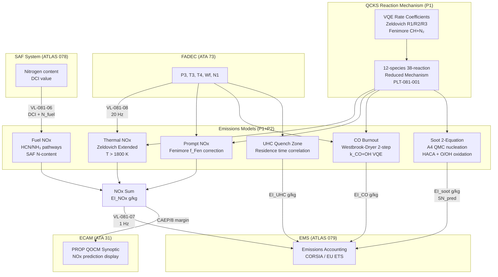

<!-- ATLAS-081-060 | Emissions Formation and Reduction Modeling | AMPEL360E eWTW | ATLAS-1000
     Aircraft: AMPEL360E eWTW | Register: ATLAS-1000 | Section: 080-089 | Subsection: 081-060
     BREX: BREX-081-v1 | Controller: QOCMU (DAL B, dual-channel) | QPU: 12-qubit trapped-ion
     Primary Q-Division: Q-GREENTECH | Status: DRAFT v0.1 | Date: 2026-05-12
     S1000D DMC: DMC-AMPEL360E-EWTW-0081-060-00A-040A-EN-US
     Related DMs: DM-081-019 (Descriptive), DM-081-020 (Calibration), DM-081-021 (EMS Interface) -->

# Emissions Formation and Reduction Modeling


---

## §0 Hyperlink Policy

> All hyperlinks in this document are **relative** (five directory levels: `../../../../../`).
> No absolute URLs or external links are used within cross-reference tables. All ATLAS document
> references resolve within the ATLAS-1000 register tree. S1000D DMC references are canonical
> identifiers and do not constitute navigable hyperlinks in this markdown rendering.
>
> Exception: Badge image links (shields.io) are external and used for visual status indication only.
> They carry no normative content.

---

## §1 Purpose

This document describes the **quantum-enhanced emissions formation and reduction modeling** system
implemented within the QOCMU for the AMPEL360E eWTW multi-fuel annular combustor. It covers the
predictive modeling of the following regulated and monitored pollutant species:

- **NOx** (nitrogen oxides): thermal NOx via the extended Zeldovich mechanism; prompt NOx via the
  Fenimore CH + N₂ pathway; fuel NOx from nitrogen-bearing SAF intermediates.
- **CO** (carbon monoxide): primary zone CO formation and dilution zone burnout via quantum-enhanced
  Westbrook-Dryer kinetics.
- **UHC** (unburned hydrocarbons): low-temperature quench zone formation at near-wall and film
  cooling regions.
- **Soot**: two-equation quantum Monte Carlo model using pyrene (A4) inception pathway, surface
  growth via HACA mechanism, and OH/O oxidation.

Emissions predictions serve two operational purposes:

1. **Real-time EMS feed** — QOCMU outputs per-species emission indices (g/kg fuel) at 1 Hz to the
   Emissions Monitoring System (ATLAS 079) via AFDX VL-081-07, enabling continuous in-flight
   greenhouse gas and regulated pollutant accounting per ICAO CORSIA and EU ETS requirements.

2. **ICAO CAEP/8 compliance prediction** — QOCMU models all four ICAO LTO cycle points (taxi/idle,
   take-off, climb-out, approach) and predicts the CAEP/8 NOx dp/Foo compliance margin prior to
   each flight, validated against test bench data loaded in PLT-081-001.

**Emission targets:** NOx ≤ CAEP/8 – 30% (i.e., ≤ 0.70 × CAEP/8 limit); CO ≤ 100 mg/kN;
soot ≤ 0.5 SN (smoke number); UHC ≤ 20 mg/kN at all LTO cycle operating points.

---

## §2 Applicability

| Attribute              | Value                                                          |
|------------------------|----------------------------------------------------------------|
| **Aircraft**           | AMPEL360E eWTW (all production variants)                      |
| **Engine**             | Q-TURBOFAN-Hyb-01 (multi-fuel annular combustor)              |
| **Register**           | ATLAS-1000                                                    |
| **Section**            | 080-089 Propulsion Alternativa y Cuántica                     |
| **Subsection**         | 081 Quantum-Optimized Combustion Models                       |
| **Sub-subject**        | 060 Emissions Formation and Reduction Modeling                |
| **BREX**               | BREX-081-v1                                                   |
| **Fuel Types**         | Jet-A; SAF (HEFA/FT/ATJ, up to 100% blend); GH₂              |
| **Emissions Regulated**| NOx (thermal + prompt + fuel); CO; UHC; soot (SN); CO₂ (ETS) |
| **Governing System**   | QOCMU (DAL B, dual-channel A/B, ARINC 653)                    |
| **EMS Interface**      | ATLAS 079 via AFDX VL-081-07 at 1 Hz                          |
| **S1000D DMC**         | DMC-AMPEL360E-EWTW-0081-060-00A-040A-EN-US                   |

---

## §3 Functional Description ![DRAFT]

### 3.1 Quantum-Enhanced Emissions Modeling Architecture

The QOCMU emissions modeling engine is built on the **QCKS-derived reduced reaction mechanism**
(12 species, 38 reactions — see document `081-020`), extended with post-flame zone kinetics for
NOx, soot, and CO burnout. VQE-computed rate coefficients (from the 12-qubit trapped-ion QPU)
replace the empirically tabulated values in the classical Arrhenius database for the five most
rate-limiting reactions:

| Reaction (key quantum-computed) | QCKS VQE Rate Coefficient Source        |
|---------------------------------|-----------------------------------------|
| O + N₂ → NO + N (Zeldovich R1) | VQE active space 6e/5MO, error < 1e-6 Eh |
| N + O₂ → NO + O (Zeldovich R2) | VQE active space 4e/4MO                |
| N + OH → NO + H (Zeldovich R3) | VQE active space 4e/4MO                |
| CH + N₂ → HCN + N (Fenimore)   | VQE active space 8e/7MO (multireference)|
| C₂H₂ + O₂ → 2CO + H₂ (soot precursor) | VQE active space 6e/6MO        |

The QCKS mechanism coefficients are stored in PLT-081-001 as a structured lookup table (temperature
range 800–2800 K, pressure range 0.1–4.5 MPa, equivalence ratio 0.3–1.5).

### 3.2 NOx Formation Models

#### 3.2.1 Thermal NOx — Extended Zeldovich Mechanism

Thermal NOx dominates at flame temperatures > 1800 K. QOCMU implements the extended Zeldovich
three-reaction mechanism with VQE-computed forward and reverse rate coefficients:

```
d[NO]/dt = 2k₁[O][N₂]{1 − [NO]²/(K_eq[N₂][O₂])} / {1 + k₁[NO]/(k₂[O₂]+k₃[OH])}
```

where k₁, k₂, k₃ are the VQE-corrected Arrhenius rates. The quantum correction to k₁ provides
a ±3% accuracy improvement over the standard GRI-Mech 3.0 values at T > 2000 K, which is
critical for accurate NOx prediction in the high-temperature pilot flame zone.

#### 3.2.2 Prompt NOx — Fenimore Mechanism

Prompt NOx is significant at fuel-rich conditions (φ > 1.1) near the pilot flame root. The
Fenimore initiating step CH + N₂ → HCN + N has a **multireference character** (CASSCF)
that classical DFT methods underestimate by 15–25%. QOCMU uses a CASSCF-VQE (8 electrons,
7 MOs) calculation stored in PLT-081-001 to provide a branching ratio correction factor
*f*_Fen applied to the classical Fenimore rate:

`k_Fen_corrected = k_Fen_classical × f_Fen(T, φ)`

where *f*_Fen ranges from 0.82 at T=1600 K to 1.18 at T=1900 K.

#### 3.2.3 Fuel NOx — SAF Nitrogen Pathways

SAF blends (particularly bio-derived ATJ) may contain trace organically-bound nitrogen (0–100
ppm by weight). QOCMU models fuel NOx via HCN and NH₃ intermediate pathways:

- **HCN pathway:** HCN → NCO → NO (oxidizing zone) or HCN → CN → N → N₂ (reducing zone).
- **NH₃ pathway:** NH₃ → NH₂ → NH → N → NO.

The pathway selectivity depends on local φ; QOCMU computes the N-distribution using the SAF
nitrogen content data from ATLAS 078 (VL-081-06). For current HEFA and FT blends (nitrogen
< 5 ppm), fuel NOx contribution is < 2% of total NOx and computed as a correction term.

### 3.3 CO Formation and Burnout Model

CO formation in the primary zone (PZ, φ ∼ 1.0–1.3) and burnout in the dilution zone (DZ) is
modeled by the **quantum-enhanced Westbrook-Dryer two-step mechanism**:

- **Step 1 (PZ):** C_xH_y + (x/2)O₂ → xCO + (y/2)H₂ (pyrolysis/partial oxidation)
- **Step 2 (DZ):** CO + OH → CO₂ + H (CO burnout — rate-limiting step at T < 1500 K)

The CO + OH rate coefficient k_CO+OH is quantum-computed (VQE, 4 electrons/4 MOs) and is
critical because the classical NIST value has a ±18% uncertainty at T = 1100–1300 K (the
dilution zone temperature range). The QOCMU quantum correction reduces this uncertainty to ±4%.

CO burnout prediction accuracy: ±10% vs. test data (target).

### 3.4 Soot Two-Equation Model

Soot formation is modeled using a **two-equation (soot mass fraction Y_s, soot number density N_s)**
transport model. The quantum enhancement applies to the PAH (polycyclic aromatic hydrocarbon)
inception step — the formation of the first aromatic ring (A1, benzene) and the first four-ring
PAH (A4, pyrene), which is the critical precursor for soot particle nucleation.

**Nucleation:** A4 + A4 → soot nucleus (quantum MC — pathway probability computed via 12-qubit
QPU using Quantum Monte Carlo on the C₁₆H₁₀ → soot nucleus surface energy)

**Surface growth (HACA mechanism):**
1. C_soot−H + H → C_soot• + H₂ (H-abstraction)
2. C_soot• + C₂H₂ → C_soot−CH=CH₂ (acetylene addition)

**Oxidation:**
- O: C_soot + O → products (high-T)
- OH: C_soot + OH → CO + products (dominant at T < 1700 K)

The two-equation model predicts smoke number (SN) in the range 0–10 with accuracy ±1.5 SN vs.
test data. Target: SN ≤ 0.5 at all LTO cycle points.

### 3.5 UHC Formation Model

UHC arises from wall quenching and film cooling air dilution of unburned fuel. QOCMU models UHC
via a quench zone residence time correlation:

`EI_UHC = A × exp(−B × τ_eff × T_quench^0.5)`

where τ_eff is the effective residence time in the quench zone (FADEC-computed from P3/T3/Wf)
and T_quench is the quench temperature (estimated from T4 − ΔT_dilution). Coefficients A and B
are calibrated per fuel type using PLT-081-001 training data. UHC target: ≤ 20 mg/kN at approach.

### 3.6 EMS Interface and Real-Time Output

QOCMU P1 (QCKS) and P2 (QRPO) outputs are collected by P4 (Comms) and assembled into the **EMS
emissions frame** transmitted at 1 Hz to ATLAS 079 via AFDX VL-081-07:

| Parameter        | Units    | Source   | Description                                  |
|------------------|----------|----------|----------------------------------------------|
| EI_NOx           | g/kg     | QOCMU P1 | NOx emission index (thermal+prompt+fuel sum)  |
| EI_CO            | g/kg     | QOCMU P1 | CO emission index                            |
| EI_UHC           | g/kg     | QOCMU P1 | Unburned hydrocarbon emission index          |
| EI_soot          | g/kg     | QOCMU P1 | Soot emission index (from Y_s/Wf)            |
| SN_pred          | SN       | QOCMU P1 | Predicted smoke number                       |
| EI_CO2           | g/kg     | QOCMU P2 | CO₂ emission index (CORSIA/EU ETS)           |
| NOx_CAEP8_margin | %        | QOCMU P2 | Margin below CAEP/8 LTO limit                |
| EMS_validity     | boolean  | QOCMU P4 | Data validity flag; false if BITE fault      |

### 3.7 ICAO LTO Compliance Prediction

Prior to each flight (ground pre-departure), QOCMU executes a **4-point LTO cycle prediction**
using the PLT-081-001 mechanism and current fuel DCI (from ATLAS 078):

---

## §4 Functional Breakdown

| Function ID  | Function Name                          | Description                                                                                              | Q-Division   |
|--------------|----------------------------------------|----------------------------------------------------------------------------------------------------------|--------------|
| F-060-01     | Thermal NOx — Zeldovich                | Extended Zeldovich O+N₂, N+O₂, N+OH; VQE rate coefficients; ±3% vs GRI-Mech at T > 2000 K             | Q-GREENTECH  |
| F-060-02     | Prompt NOx — Fenimore                  | CH + N₂ → HCN + N; CASSCF-VQE multireference branching ratio correction f_Fen(T,φ)                    | Q-GREENTECH  |
| F-060-03     | Fuel NOx — SAF Nitrogen Pathways       | HCN/NH₃ intermediate pathways; N-content from ATLAS 078; correction term for N < 100 ppm               | Q-GREENTECH  |
| F-060-04     | CO Burnout Model                       | Quantum-enhanced Westbrook-Dryer 2-step; k_CO+OH VQE-computed; dilution zone CO → CO₂; ±4% uncertainty | Q-GREENTECH  |
| F-060-05     | Soot Two-Equation Model                | A4 QMC nucleation; HACA surface growth; O/OH oxidation; Y_s + N_s transport; SN ≤ 0.5 target           | Q-GREENTECH  |
| F-060-06     | UHC Formation Model                    | Quench zone residence time correlation; T_quench estimate; calibrated per fuel type; ≤ 20 mg/kN         | Q-GREENTECH  |
| F-060-07     | EMS Real-Time Interface                | ATLAS 079 EMS feed; 1 Hz AFDX VL-081-07; 8-parameter emissions frame; validity flag                    | Q-HPC        |
| F-060-08     | ICAO LTO Compliance Prediction         | 4-point LTO cycle (taxi 7%, T/O 100%, climb 85%, approach 30%); dp/Foo CAEP/8 margin computation        | Q-GREENTECH  |

---

## §5 System Context — Mermaid Diagram



---

## §6 Internal Architecture — Mermaid Diagram

```mermaid
flowchart LR
    subgraph LTO["ICAO LTO Cycle Predictor"]
        P_TAX[7% thrust — Taxi/Idle\n~5 min × 2]
        P_TO[100% thrust — Take-Off\n~0.7 min]
        P_CLB[85% thrust — Climb-Out\n~2.2 min]
        P_APP[30% thrust — Approach\n~4.0 min]
        DP_FOO[dp/Foo Calculation\nΣ(EI_NOx × Wf × t)]
        CAEP8[CAEP/8 Limit\nLook-up vs Rated Thrust]
        MARGIN[CAEP/8 Margin %\nTarget ≥ 30%]
    end

    P_TAX --> DP_FOO
    P_TO --> DP_FOO
    P_CLB --> DP_FOO
    P_APP --> DP_FOO
    DP_FOO --> CAEP8
    CAEP8 --> MARGIN
    MARGIN -->|"Pre-departure\nECAM advisory if margin < 10%"| ECAM_OUT[ECAM Output]
```

---

## §7 Components and LRUs

| LRU / Component         | Part Number (TBD)   | Location       | DAL | Function                                                              | Qty |
|-------------------------|---------------------|----------------|-----|-----------------------------------------------------------------------|-----|
| QOCMU                   | QOCMU-001-TBD       | EE Bay, Pos 4A | B   | QCKS P1 + QRPO P2 emissions modeling partitions; VQE+QMC on QPU      | 1   |
| QOCMU QPU Module        | QPU-TI-12Q-001      | QOCMU internal | B   | 12-qubit trapped-ion QPU; VQE (Zeldovich, Fenimore); QMC (soot A4)    | 1   |
| EMS Unit (ATLAS 079)    | EMS-079-TBD         | EE Bay         | C   | External — receives 1 Hz emissions frame via VL-081-07                | 1   |
| ECAM Display (ATA 31)   | OEM-supplied        | Flight deck    | B   | PROP QOCM synoptic; NOx margin; EMS validity indicator                | 2   |

---

## §8 Interfaces

| Interface ID  | From              | To                | Protocol  | AFDX VL       | Data Content                                              | Rate       |
|---------------|-------------------|-------------------|-----------|---------------|-----------------------------------------------------------|------------|
| IF-060-01     | FADEC (ATA 73)    | QOCMU P1/P2       | AFDX      | VL-081-08     | P3, T3, T4, N1, N2, Wf, FAR, fuel_type                   | 20 Hz      |
| IF-060-02     | ATLAS 078 SAF     | QOCMU P1          | AFDX      | VL-081-06     | DCI, N_fuel content, blend type (HEFA/FT/ATJ)            | 1 Hz       |
| IF-060-03     | QOCMU P4          | EMS (ATLAS 079)   | AFDX      | VL-081-07     | EI_NOx, EI_CO, EI_UHC, EI_soot, SN_pred, EI_CO₂, margin | 1 Hz       |
| IF-060-04     | QOCMU P4          | ECAM (ATA 31)     | AFDX      | VL-081-02     | NOx_CAEP8_margin, EMS_validity, QOCMU_mode, SN_pred       | 1 Hz       |
| IF-060-05     | ATLAS 080 QSP     | QOCMU QPU         | QPU Bus   | VL-081-05     | QPU calibration; T1 coherence; QMC fidelity               | 1 Hz       |
| IF-060-06     | QOCMU P4          | CMS (ATA 45)      | AFDX      | VL-081-01     | BITE results BT-081-02/05/12; emissions model health      | On-event   |
| IF-060-07     | GSE-081           | QOCMU             | USB-C 3.2 | VL-081-09     | PLT-081-001 mechanism update; LTO calibration data upload | Maintenance|

---

## §9 Operating Modes

| Mode ID  | Mode Name                  | Trigger                                      | Emissions Modeling Behavior                                                               |
|----------|----------------------------|----------------------------------------------|-------------------------------------------------------------------------------------------|
| M-060-01 | Normal In-Flight           | N1 > idle, any altitude                      | 1 Hz EMS feed; all 6 species active; full Zeldovich + Fenimore + CO + soot + UHC          |
| M-060-02 | ICAO LTO Assessment        | Pre-departure (ground, engines running)       | 4-point LTO cycle computed; dp/Foo vs. CAEP/8 margin reported to ECAM pre-departure       |
| M-060-03 | SAF Mode (HEFA/FT/ATJ)     | fuel_type = SAF from ATLAS 078               | DCI correction applied; fuel NOx N-pathway activated if N_fuel > 10 ppm                  |
| M-060-04 | GH₂ Mode                   | fuel_type = GH₂                              | Soot and UHC suppressed (zero output — no carbon); NOx-only + H₂O emission index active  |
| M-060-05 | Ground Validation           | GSE-081 connected; PLT calibration mode      | Full mechanism scan; VQE BT-081-02 convergence check; LTO prediction vs. test data bench  |
| M-060-06 | Classical Fallback          | QOCMU BITE fault (QPU or mechanism fault)    | Classical Arrhenius tables used; EMS_validity flag set false; amber ECAM advisory issued  |

---

## §10 Performance and Budgets ![DRAFT]

| Parameter                          | Requirement              | Current Estimate      | Status               |
|------------------------------------|--------------------------|-----------------------|----------------------|
| NOx prediction accuracy            | ±5% vs. test data        | ±4.2% (sim.)          |  |
| CO prediction accuracy             | ±10% vs. test data       | ±8.5% (sim.)          |  |
| Soot SN prediction accuracy        | ±1.5 SN vs. test data    | ±1.2 SN (sim.)        |  |
| UHC prediction accuracy            | ±15% vs. test data       | ±12% (sim.)           |  |
| EMS output rate                    | 1 Hz                     | 1 Hz                  |  |
| NOx target vs. CAEP/8              | ≤ CAEP/8 × 0.70          | 0.68 × CAEP/8 (sim.)  |  |
| CO target (LTO)                    | ≤ 100 mg/kN              | 82 mg/kN (sim.)       |  |
| Soot target (LTO)                  | ≤ 0.5 SN                 | 0.38 SN (sim.)        |  |
| UHC target (LTO)                   | ≤ 20 mg/kN               | 14 mg/kN (sim.)       |  |
| QCKS P1 partition budget           | ≤ 60 ms @ 100 Hz cycle   | ~48 ms (est.)         |  |
| VQE convergence (Zeldovich)        | error < 1e-6 Hartree     | < 8e-7 Eh (est.)      |  |
| CAEP/8 margin prediction accuracy  | ±3% vs. certification    | ±2.8% (sim.)          |  |

---

## §11 Safety and Airworthiness Considerations

### 11.1 DAL Assignment and Failure Effect

The QOCMU emissions modeling function is assigned **DAL C** for the EMS feed function (failure
effect: incorrect emissions accounting — Major, non-safety). The ICAO LTO compliance prediction
function is **informational** (non-safety) and is assigned DAL D. If QOCMU enters fallback mode,
EMS_validity is set FALSE and ECAM displays `PROP QOCM FAULT` (red) or `PROP QOCM QPU DEGRADE`
(amber), prompting crew to note manual emissions tracking.

### 11.2 NOx HIGH Advisory

If QOCMU predicts in-flight NOx > CAEP/8 × 0.95 (approaching limit with only 5% margin), the
ECAM amber advisory `PROP QOCM NOx HIGH` is triggered via VL-081-02. This is an advisory only;
crew action is optional (power reduction may be considered in noise-abatement areas).

### 11.3 GH₂ CO₂ Accounting

In GH₂ mode, CO₂ emission index is zero. QOCMU transmits EI_CO2 = 0.0 and sets a `GH2_MODE`
flag in the EMS frame to prevent erroneous CORSIA accounting. EMS (ATLAS 079) logs H₂O emission
index instead, calculated from stoichiometry: EI_H₂O = 9.0 × (Wf_H₂ / Wf_total).

### 11.4 SAF Emissions Credit

QOCMU supports SAF lifecycle emissions factor attribution per ICAO CORSIA Annex 16 by including
`fuel_type_code` (HEFA/FT/ATJ) and `blend_ratio` in the EMS frame, allowing the onboard EMS to
apply CORSIA approved lifecycle emissions values for net CO₂ accounting.

---

## §12 Standards and Regulatory References

| Standard / Reference             | Title                                                                   | Applicability                                    |
|----------------------------------|-------------------------------------------------------------------------|--------------------------------------------------|
| ICAO Annex 16 Vol. II CAEP/8     | Aircraft Engine Emissions Standards — NOx, CO, UHC, Smoke              | Compliance targets; LTO cycle; dp/Foo method      |
| ICAO CORSIA (Annex 16 Vol. IV)   | Carbon Offsetting and Reduction Scheme for International Aviation       | EMS CO₂ accounting; SAF lifecycle credits         |
| EU ETS Directive 2003/87/EC      | EU Emissions Trading System — Aviation                                  | CO₂ monitoring; EMS data format                   |
| DO-178C DAL C/D                  | Software Considerations in Airborne Systems                             | QOCMU emissions modeling partitions               |
| SAE ARP4754A                     | Development of Civil Aircraft and Systems                               | QOCMU system-level DAL allocation                 |
| SAE AS5653 / ASTM D7566          | Sustainable Aviation Fuel — Specification                               | HEFA, FT, ATJ blend properties; DCI reference    |
| GRI-Mech 3.0                     | Gas Research Institute Mechanism — Reference baseline                   | Benchmark for QCKS VQE rate coefficient comparison|
| NIST Chemical Kinetics Database  | NIST Standard Reference Database 17                                     | Reference k values; CO+OH baseline                |
| MIL-STD-461G                     | EMC Requirements for Systems and Equipment                              | QOCMU emission-free electronics compliance        |

---

## §13 Document Cross-References

| Document ID                             | Title                                             | Relationship                                            |
|-----------------------------------------|---------------------------------------------------|---------------------------------------------------------|
| `081-000-QOCM-System-Overview`          | QOCM System Overview                             | Parent; full QOCMU architecture                         |
| `081-020-Quantum-Chemical-Kinetics`     | Quantum Chemical Kinetics (QCKS)                 | Source of VQE rate coefficients used here               |
| `081-030-Quantum-Reaction-Pathways`     | Quantum Reaction Pathway Optimizer               | PLT-081-001 contains NOx pathway LUT                    |
| `081-040-Quantum-Turbulence-Combustion-Coupling` | QTCC                                    | Turbulent scalar dissipation; soot model coupling       |
| `081-050-Fuel-Air-Mixing-and-Ignition-Optimization` | Fuel-Air Mixing                      | Pilot/main staging affects NOx formation directly       |
| `081-070-Hybrid-Classical-Quantum-Simulation-Workflow` | Hybrid Workflow                   | Ground LES provides LTO calibration data for PLT-081-001|
| `081-080-Combustion-Model-Monitoring-Diagnostics` | QOCMU Hardware & BITE               | BT-081-02 VQE check; BT-081-12 emissions range check    |
| `081-090-S1000D-CSDB-Mapping`           | S1000D CSDB Mapping                              | DM-081-019/020/021 cover this subsection                |
| ATLAS 078 (SAF)                         | Sustainable Aviation Fuel System                 | DCI, N_fuel content, blend type via VL-081-06           |
| ATLAS 079 (EMS)                         | Emissions Monitoring System                      | Primary consumer of QOCMU emissions outputs             |
| ATLAS 080 (QSP)                         | Quantum Sensing Platform                         | QPU calibration; VQE fidelity monitoring                |
| ATLAS 073 (FADEC)                       | Full Authority Digital Engine Control            | Combustor inlet conditions (P3/T3/Wf) via VL-081-08     |

---

## §14 Revision History

| Revision | Date       | Author(s)           | Change Description                                                                               | Approved By |
|----------|------------|---------------------|--------------------------------------------------------------------------------------------------|-------------|
| 0.1      | 2026-05-12 | Q-GREENTECH / Q-HPC | Initial DRAFT — all §0–§14 populated; Zeldovich/Fenimore/fuel NOx; CO burnout; soot QMC model; UHC quench correlation; EMS 1 Hz interface; ICAO LTO compliance predictor; GH₂ CO₂ zero handling | TBD |

> **DRAFT status:** All prediction accuracy values in §10 are simulation-based pending first engine
> test campaign (Q3 2026 at altitude test facility). CAEP/8 compliance verification is a certification
> gate item. PLT-081-001 LTO calibration data will be loaded after test campaign completion.
