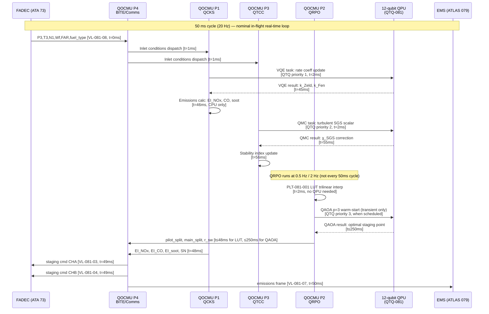

<!-- ATLAS-081-070 | Hybrid Classical-Quantum Simulation Workflow | programme-defined aircraft type | ATLAS-1000
     Aircraft: programme-defined aircraft type | Register: ATLAS-1000 | Section: 080-089 | Subsection: 081-070
     BREX: BREX-081-v1 | Controller: QOCMU (DAL B, dual-channel) | QPU: 12-qubit trapped-ion
     Primary Q-Division: Q-HPC | Status: DRAFT v0.1 | Date: 2026-05-12
     S1000D DMC: DMC-<PROGRAMME>-<VARIANT>-0081-070-00A-040A-EN-US
     Related DMs: DM-081-022 (Descriptive), DM-081-023 (In-Flight Validation), DM-081-024 (Fallback Test) -->

# Hybrid Classical-Quantum Simulation Workflow


---

## §0 Hyperlink Policy

> All hyperlinks in this document are **relative** (five directory levels: `../../../../../`).
> No absolute URLs or external links are used within cross-reference tables. All ATLAS document
> references resolve within the ATLAS-1000 register tree. S1000D DMC references are canonical
> identifiers and do not constitute navigable hyperlinks in this markdown rendering.
>
> Exception: Badge image links (shields.io) are external and used for visual status indication only.
> They carry no normative content.

---

## §1 Purpose

This document defines the agnostic ATLAS standard-level architecture context for `Hybrid Classical-Quantum Simulation Workflow`.

It describes the controlled scope, functions, interfaces, safety considerations, lifecycle traceability, and S1000D/CSDB mapping logic that programme implementations shall instantiate when this node is applicable.

This document is not a programme design baseline. Programme-specific capacities, locations, part numbers, effectivity, operating limits, maintenance references, and data module codes shall be defined only inside the applicable programme implementation branch.
## §2 Applicability

| Applicability Level | Rule |
|---|---|
| Standard taxonomy | Applies to the ATLAS node `081` |
| Programme implementation | Conditional; determined by programme architecture, trade studies, certification basis, and applicability model |
| Product configuration | Defined in the programme-specific configuration baseline |
| Effectivity | Defined in the programme CSDB / applicability layer |
| Non-applicability | Must be explicitly stated in the programme impact-study branch when excluded |
## §3 Functional Description ![DRAFT]

### 3.1 Three-Tier Hybrid Workflow Architecture

The QOCM simulation workflow is organized in three operational tiers with clearly defined data
flows and boundaries:

#### Tier 1 — Ground Simulation (GAIA HPC)

**Platform:** GAIA HPC Cluster (4096 CPU cores, 8 QPU nodes, 512 TB NVMe storage, InfiniBand HDR
interconnect). **Turnaround time:** 4 hours per full operating point sweep (100 points covering the
full P3/T3/FAR/fuel-type matrix). **Purpose:** Generate PLT-081-001 LUT and FADEC staging schedule
files for onboard QOCMU.

Ground simulation pipeline stages:

1. **LES CFD mesh generation** — 120M cell unstructured hexahedral mesh of annular combustor
   (CGNS format, automated from CAD via Pointwise scripting).
2. **QCKS ground execution** — Full 38-reaction quantum chemical kinetics with VQE rate coefficients;
   18-species chemistry (not reduced) on GAIA QPU nodes (1024-qubit superconducting QPU per node).
3. **QRPO ground optimization** — QAOA at depth p=12 (higher fidelity than onboard p=6) over full
   operating space; generates complete NOx–LBO Pareto surface stored in PLT-081-001.
4. **QTCC ground coupling** — LES turbulent scalar PDF models combined with quantum-enhanced SGS
   models; thermoacoustic stability map generated.
5. **PLT-081-001 generation** — LUT assembly from all operating points; JSON format; 2.8 GB per
   fuel type; CRC-32 checksum; version tag (semantic versioning MAJOR.MINOR.PATCH).
6. **FADEC schedule files** — pilot_split/main_split/r_sw tables extracted; binary FADEC format;
   encrypted (AES-256); signed (RSA-2048).

#### Tier 2 — In-Flight Real-Time (QOCMU Onboard)

**Platform:** QOCMU EE Bay LRU — 12-qubit trapped-ion QPU + Xeon CPU + 64 GB DDR5 + 2 TB NVMe.
**Real-time constraint:** FADEC update at 20 Hz (50 ms hard deadline). **Update rates:**
- QCKS (P1): 100 Hz, 60 ms budget per cycle
- QRPO (P2): 0.5 Hz cruise / 2 Hz transient, PLT LUT lookup + interpolation
- QTCC (P3): 10 Hz, 100 ms budget per cycle

The onboard QOCMU does **not** re-execute full LES CFD. Instead, it uses the PLT-081-001 LUT
for rapid multi-dimensional interpolation (trilinear, 4D: P3 × T3 × FAR × fuel_type) to retrieve
pre-computed optimal staging and emissions predictions in real time.

The 12-qubit onboard QPU executes reduced QAOA circuits (p=3 for transients) for last-mile
optimization around the current operating point, using the PLT LUT value as the warm-start
initial state for the QAOA circuit. This hybrid LUT+QAOA approach provides both speed (< 250 ms
for transient) and accuracy (within 2% of full ground optimization).

#### Tier 3 — Classical Fallback (Stored Tables)

**Trigger conditions:**
- QOCMU BITE: any BT-081-01 through BT-081-12 failure latching both channels
- QPU T1 coherence time < 80 µs (ATLAS 080 QSP report via VL-081-05)
- QOCMU channel A and channel B both report FAULT within 50 ms

**Fallback behavior:**
- QOCMU transitions to stored **classical staging tables** (pre-loaded at last ground maintenance)
- Tables contain baseline pilot_split/main_split as function of P3/T3/N1 (classical RANS-derived)
- No quantum updates; FADEC uses classical schedule for remainder of flight
- ECAM `PROP QOCM FAULT` (red) triggered if both channels failed; `PROP QOCM QPU DEGRADE` (amber)
  if only QPU is degraded but CPU channels are operational
- Changeover from active to fallback: ≤ 100 ms (requirement per F-070-03)

### 3.2 Quantum Task Queue (QTQ-081)

The **QTQ-081** is the QOCMU internal task scheduler managing QPU resource allocation among QCKS,
QRPO, and QTCC partitions. Priority order (highest to lowest):

| Priority | Partition | Task                          | Deadline   | Rationale                                   |
|----------|-----------|-------------------------------|------------|---------------------------------------------|
| 1 (HIGH) | P1 — QCKS | VQE rate coefficient update   | 60 ms      | Rate-limiting for emissions model accuracy  |
| 2 (MED)  | P3 — QTCC | QMC turbulent scalar sampling | 100 ms     | Required for thermoacoustic stability check |
| 3 (LOW)  | P2 — QRPO | QAOA staging optimization     | 500 ms     | Lower rate; LUT interpolation as fallback   |
| 4 (BKG)  | P4 — BITE | QPU self-test circuits        | Background | Non-interfering with flight tasks           |

QPU time-slice allocation:
- QCKS: 60 ms per 100 Hz QCKS cycle = 60% QPU utilization
- QTCC: 30 ms per 10 Hz QTCC cycle = 30% QPU utilization
- QRPO: 10 ms per 2 Hz QRPO cycle (warm-start QAOA p=3) = ~10% QPU utilization

Total nominal QPU utilization: ~70%. Burst utilization (transient QRPO p=3 + QTCC simultaneous):
≤ 95%. QTQ-081 monitors missed deadlines and escalates to BITE P4 if any task misses > 3
consecutive deadlines.

### 3.3 PLT-081-001 File Transfer Protocol

PLT-081-001 is generated on GAIA HPC after each combustion model update or engine variant change.
The file transfer protocol to the QOCMU NVMe is:

1. **GAIA HPC → Ground Server:** Internal GAIA infrastructure transfer; not aircraft-facing.
2. **Ground Server → GSE-081:** SFTP (SSH, RSA-2048 certificate); file: `PLT-081-001-vX.Y.Z.json.enc`
   (AES-256 encrypted, RSA-2048 signed); integrity: SHA-256 hash + CRC-32.
3. **GSE-081 → QOCMU:** USB-C 3.2 connection (AFDX VL-081-09 maintenance link); protocol:
   QOCMU proprietary secure loader (`QLOAD-081`); authentication: maintenance access card + PIN.
4. **QOCMU Load Sequence:**
   a. Verify RSA-2048 signature of PLT-081-001 file.
   b. Decrypt AES-256 payload.
   c. Verify CRC-32 of decrypted content.
   d. Execute BITE BT-081-10 (PLT-081-001 LUT integrity check).
   e. Execute BITE BT-081-02 (VQE convergence check with new mechanism).
   f. Compare NOx prediction at reference operating point (P3=1.5 MPa, T3=700 K, FAR=0.025) 
      with previous PLT version — must be within ±5%.
   g. If all checks pass: activate new PLT, update version CM log on QOCMU NVMe.
   h. If any check fails: reject new PLT; retain previous version; log event to CMS.
5. **Transfer time budget:** GAIA HPC generation 4 h + transfer ≤ 10 min + QOCMU load ≤ 20 min.
   Total: PLT updated within ≤ 30 min from GAIA job completion (maintenance window).

### 3.4 FADEC Data Exchange Protocol

QOCMU communicates with FADEC via two dedicated AFDX virtual links (channel A and B redundancy):

| Direction         | VL          | Data                                     | Rate   | Latency Requirement |
|-------------------|-------------|------------------------------------------|--------|---------------------|
| FADEC → QOCMU     | VL-081-08   | P3, T3, N1, N2, Wf, FAR, fuel_type, EGT | 20 Hz  | ≤ 10 ms             |
| QOCMU → FADEC CHA | VL-081-03   | pilot_split, main_split, r_sw, ignition  | 20 Hz  | ≤ 50 ms end-to-end  |
| QOCMU → FADEC CHB | VL-081-04   | pilot_split, main_split, r_sw, ignition  | 20 Hz  | ≤ 50 ms end-to-end  |

The FADEC applies the QOCMU staging command with a **one-cycle delay** (50 ms) to allow for
command validation and cross-comparison between CHA and CHB outputs. If CHA and CHB outputs differ
by > 2% for pilot_split or > 5% for any staging parameter, FADEC discards both commands and uses
the previous cycle's validated command, alerting QOCMU via VL-081-08 with a `CMD_MISMATCH` flag.

### 3.5 QPU Decoherence Recovery

The 12-qubit trapped-ion QPU requires periodic re-cooling (laser cooling) to maintain coherence.
ATLAS 080 QSP monitors individual qubit T1 (energy relaxation) and T2 (dephasing) times, reported
to QOCMU P4 via VL-081-05 at 1 Hz.

Decoherence recovery protocol:

| T1 Status            | QOCMU Action                                                                     | ECAM Indication          |
|----------------------|----------------------------------------------------------------------------------|--------------------------|
| T1 ≥ 100 µs (nominal)| No action — normal QPU operation                                                 | None                     |
| 80 µs ≤ T1 < 100 µs  | QOCMU P4 logs warning; P2 reduces QAOA depth to p=2; QTCC reduces QMC samples   | None (monitoring only)   |
| 60 µs ≤ T1 < 80 µs   | QOCMU triggers QPU re-cooling request to QSP (VL-081-05); QAOA uses LUT only    | PROP QOCM QPU DEGRADE (amber) |
| T1 < 60 µs (3 cycles) | QOCMU transitions to classical fallback for affected partition                  | PROP QOCM QPU DEGRADE (amber) |
| T1 < 40 µs (any cycle)| Immediate classical fallback for all QPU partitions; BT-081-01 FAIL latched     | PROP QOCM FAULT (red) if both channels |

QPU re-cooling (laser re-initialization) requires approximately 30 seconds. During re-cooling,
QOCMU operates on LUT interpolation only (no active QAOA computation). Re-cooling is transparent
to FADEC if completed within 60 seconds; otherwise classical fallback is activated.

---

## §4 Functional Breakdown

| Function ID  | Function Name                        | Description                                                                                                        | Q-Division |
|--------------|--------------------------------------|--------------------------------------------------------------------------------------------------------------------|------------|
| F-070-01     | Ground Simulation Orchestration      | GAIA HPC LES CFD; 100 operating points; QCKS/QRPO/QTCC full fidelity; PLT-081-001 generation; 4-hour turnaround   | Q-HPC      |
| F-070-02     | In-Flight Real-Time Orchestration    | QOCMU QTQ-081; 20 Hz FADEC; PLT LUT trilinear interpolation + warm-start QAOA p=3 transient                       | Q-HPC      |
| F-070-03     | Classical Fallback Logic             | QOCMU fault trigger; stored classical staging tables; ≤ 100 ms changeover; ECAM indication                        | Q-HPC      |
| F-070-04     | QTQ-081 Task Queue Manager           | Priority scheduling QCKS > QTCC > QRPO > BITE; deadline monitoring; missed deadline escalation                    | Q-HPC      |
| F-070-05     | PLT-081-001 File Transfer Protocol   | GAIA HPC → GSE-081 (SFTP); GSE-081 → QOCMU NVMe (QLOAD-081); AES-256 + RSA-2048 + CRC-32; ≤ 30 min total        | Q-HPC      |
| F-070-06     | FADEC Data Exchange Protocol         | AFDX VL-081-03/04/08; 20 Hz staging command; ≤ 50 ms end-to-end; CMD_MISMATCH detection                          | Q-HPC      |
| F-070-07     | QPU Decoherence Recovery             | T1 monitoring from QSP; degrade/fallback thresholds (80/60/40 µs); re-cooling coordination; 30 s window          | Q-HPC      |
| F-070-08     | Hybrid Workflow Validation           | Ground-to-flight data consistency check; staging schedule regression; NOx prediction ±5% vs. previous PLT version  | Q-HPC      |

---

## §5 System Context — Mermaid Diagram (Three-Tier Workflow)

```mermaid
flowchart TD
    subgraph GAIA["GAIA HPC Cluster (Ground — Tier 1)"]
        LES[LES CFD\n120M cell mesh\nAnnular combustor]
        QCKS_G[QCKS Ground\n18-species / 38-reactions\n1024-qubit QPU nodes]
        QRPO_G[QRPO Ground\nQAOA p=12\nFull Pareto surface]
        QTCC_G[QTCC Ground\nLES turbulent PDF\nStability map]
        PLT_GEN[PLT-081-001 Assembler\nJSON 2.8 GB per fuel\nCRC-32 + AES-256]
        SCH_GEN[FADEC Schedule\nFile Generator\nBinary + RSA-2048 sign]
    end

    subgraph GSE["GSE-081 (Ground Support Equipment)"]
        SFTP_RCV[SFTP Receiver\nRSA-2048 cert]
        QLOAD[QLOAD-081\nSecure Loader]
    end

    subgraph QOCMU["QOCMU Onboard (Tier 2)"]
        NVMe_PLT[NVMe\nPLT-081-001 LUT\n2 TB storage]
        QTQ[QTQ-081\nTask Queue Manager]
        QCKS_RT[P1 — QCKS\n60 ms / 100 Hz]
        QRPO_RT[P2 — QRPO\nLUT + QAOA p=3\n0.5/2 Hz]
        QTCC_RT[P3 — QTCC\nQMC SGS\n100 ms / 10 Hz]
        FALL[P2 Fallback\nClassical Tables\nFADEC autonomous]
        QPU12[12-qubit Trapped-Ion QPU]
    end

    subgraph FADEC_S["FADEC (ATA 73) — Tier 2/3 Receiver"]
        FMV2[Fuel Metering Valve]
        CLASS_TB[Classical Staging\nTables (Tier 3)]
    end

    LES --> QCKS_G --> PLT_GEN
    QRPO_G --> PLT_GEN
    QTCC_G --> PLT_GEN
    PLT_GEN -->|SFTP AES-256| SFTP_RCV
    SFTP_RCV --> QLOAD
    QLOAD -->|USB-C 3.2 VL-081-09| NVMe_PLT

    NVMe_PLT --> QRPO_RT
    QTQ --> QCKS_RT
    QTQ --> QRPO_RT
    QTQ --> QTCC_RT
    QCKS_RT & QRPO_RT & QTCC_RT -.->|QPU tasks| QPU12

    QRPO_RT -->|"VL-081-03/04\n20 Hz staging"| FMV2
    FALL -->|Classical fallback| CLASS_TB
    CLASS_TB --> FMV2

    SCH_GEN -->|"SFTP + QLOAD\ninitial load"| NVMe_PLT
```

---

## §6 Internal Architecture — Mermaid Diagram (In-Flight 20 Hz Cycle)



---

## §7 Components and LRUs

| LRU / Component            | Part Number (TBD)   | Location            | DAL | Function                                                               | Qty |
|----------------------------|---------------------|---------------------|-----|------------------------------------------------------------------------|-----|
| QOCMU                      | QOCMU-001-TBD       | EE Bay, Pos 4A      | B   | All real-time workflow tiers; QTQ-081; PLT NVMe storage; AFDX comms   | 1   |
| QOCMU QPU Module           | QPU-TI-12Q-001      | QOCMU internal      | B   | 12-qubit trapped-ion QPU; QCKS VQE; QTCC QMC; QRPO QAOA warm-start    | 1   |
| GSE-081 Maintenance Tool   | GSE-081-TBD         | Ground only         | —   | PLT-081-001 upload (QLOAD-081); SFTP client; BITE access               | 1   |
| GAIA HPC Cluster           | GAIA-HPC-v4         | Q-HPC Cloud / Ground| —   | Tier 1 ground simulation; 4096 CPU + QPU nodes; PLT generation         | —   |
| FADEC (ATA 73)             | OEM-supplied        | Engine nacelle      | A   | Staging command receiver; CMD_MISMATCH monitor; classical table store  | 2   |

---

## §8 Interfaces

| Interface ID  | From               | To                  | Protocol  | AFDX VL     | Data Content                                                    | Rate         |
|---------------|--------------------|---------------------|-----------|-------------|------------------------------------------------------------------|--------------|
| IF-070-01     | FADEC (ATA 73)     | QOCMU P4/P1/P2/P3   | AFDX      | VL-081-08   | P3, T3, N1, N2, Wf, FAR, fuel_type, EGT, CMD_MISMATCH flag      | 20 Hz        |
| IF-070-02     | QOCMU P4           | FADEC CHA           | AFDX      | VL-081-03   | Staging cmd: pilot_split, main_split, r_sw, ignition, validity  | 20 Hz        |
| IF-070-03     | QOCMU P4           | FADEC CHB           | AFDX      | VL-081-04   | Staging cmd (mirror CHA): pilot_split, main_split, r_sw         | 20 Hz        |
| IF-070-04     | ATLAS 080 QSP      | QOCMU P4            | AFDX      | VL-081-05   | QPU T1/T2 coherence; qubit health; re-cooling status            | 1 Hz         |
| IF-070-05     | QOCMU P4           | EMS (ATLAS 079)     | AFDX      | VL-081-07   | Emissions frame: EI_NOx/CO/soot/UHC, EMS_validity, mode        | 1 Hz         |
| IF-070-06     | QOCMU P4           | ECAM (ATA 31)       | AFDX      | VL-081-02   | QOCMU mode; QPU status; CAEP/8 margin; LBO margin              | 1 Hz         |
| IF-070-07     | QOCMU P4           | CMS (ATA 45)        | AFDX      | VL-081-01   | BITE results; missed QTQ deadlines; fallback events; PLT version | On-event     |
| IF-070-08     | GSE-081            | QOCMU NVMe          | USB-C 3.2 | VL-081-09   | PLT-081-001 file (QLOAD-081 protocol); staging schedule         | Maintenance  |
| IF-070-09     | ATLAS 078 SAF      | QOCMU P1/P2         | AFDX      | VL-081-06   | DCI, fuel type, N_fuel content for emissions correction          | 1 Hz         |

---

## §9 Operating Modes

| Mode ID  | Mode Name                   | Trigger                                      | Workflow Tier       | QPU Utilization     | FADEC Supply              |
|----------|-----------------------------|----------------------------------------------|---------------------|---------------------|---------------------------|
| M-070-01 | Ground Simulation           | Manual GAIA HPC job submission               | Tier 1 (GAIA)       | 1024-qubit (GAIA)   | N/A (ground only)         |
| M-070-02 | In-Flight Real-Time Normal  | N1 > idle, QPU T1 ≥ 100 µs                  | Tier 2 (QOCMU)      | ~70% nominal        | Quantum-optimized staging |
| M-070-03 | In-Flight Reduced           | QPU 80 µs ≤ T1 < 100 µs                     | Tier 2 (LUT only)   | LUT interp, no QAOA | PLT LUT-based staging     |
| M-070-04 | QPU Degraded                | QPU T1 < 80 µs; re-cooling active            | Tier 2 (partial)    | CPU only during cool | LUT interpolation only   |
| M-070-05 | Classical Fallback          | QOCMU BITE fault both channels               | Tier 3 (fallback)   | None (QPU offline)  | Classical stored tables   |
| M-070-06 | Maintenance / PLT Update    | GSE-081 connected; aircraft grounded         | Ground maintenance  | BITE self-test only | Ground/test mode          |

---

## §10 Performance and Budgets ![DRAFT]

| Parameter                                  | Requirement            | Current Estimate      | Status               |
|--------------------------------------------|------------------------|-----------------------|----------------------|
| FADEC staging update rate                  | 20 Hz (50 ms cycle)    | 20 Hz                 |  |
| Staging update rate (cruise)               | 0.5 Hz (LUT)           | 0.5 Hz                |  |
| Staging update rate (transient)            | 2 Hz (QAOA p=3)        | 2 Hz                  |  |
| FADEC staging command latency (end-to-end) | ≤ 50 ms                | ~49 ms est.           |  |
| QTQ QCKS task completion                   | < 60 ms                | ~48 ms est.           |  |
| QTQ QTCC task completion                   | < 100 ms               | ~72 ms est.           |  |
| QTQ QRPO task (LUT interp)                 | < 50 ms                | ~8 ms est.            |  |
| QTQ QRPO task (QAOA p=3 warm-start)        | < 250 ms               | ~200 ms est.          |  |
| PLT-081-001 GAIA HPC generation            | 4 hours per sweep      | 3.8 h est.            |  |
| PLT file transfer (SFTP + QLOAD-081)       | ≤ 30 min               | ≤ 25 min est.         |  |
| Classical fallback changeover time         | ≤ 100 ms               | ~80 ms est.           |  |
| GAIA HPC LES CFD mesh size                 | 120M cells             | 118M cells (plan)     |  |
| PLT-081-001 LUT size per fuel type         | 2.8 GB                 | 2.6 GB est.           |  |
| QPU nominal utilization (in-flight)        | ≤ 80%                  | ~70% est.             |  |

---

## §11 Safety and Airworthiness Considerations

### 11.1 DAL Allocation

The hybrid workflow orchestration function (QTQ-081, PLT file management, fallback logic) is
assigned **DAL B** as part of QOCMU, consistent with the FADEC staging function. The PLT file
integrity (CRC-32, RSA signature) is a security and data integrity function, not a primary
safety function, and is DAL C. Ground simulation tools (GAIA HPC) are not airborne and are
subject to engineering quality assurance (DO-330 Tool Qualification) rather than DO-178C.

### 11.2 Fallback Independence

The classical fallback tables (Tier 3) are derived from classical RANS data independent of the
QOCM system. They are validated to maintain LBO margin ≥ 0.12 (slightly lower than quantum-
optimized ≥ 0.15 but within safe envelope) and NOx within CAEP/8 limit (without the –30%
margin). Fallback is tested during certification ground test as part of FADEC-QOCMU interface
qualification.

### 11.3 Security of PLT File Chain

The PLT-081-001 file chain (GAIA HPC → GSE-081 → QOCMU) uses **AES-256 encryption** and
**RSA-2048 signing** to prevent tampered or malicious staging schedule files. This is consistent
with DO-326A (Airworthiness Security Process for Commercial Aircraft) requirements for ground-
loaded data integrity. The QOCMU QLOAD-081 loader rejects any file with invalid RSA signature
before decryption.

---

## §12 Standards and Regulatory References

| Standard / Reference   | Title                                                                    | Applicability                                    |
|------------------------|--------------------------------------------------------------------------|--------------------------------------------------|
| DO-178C DAL B          | Software Considerations in Airborne Systems                              | QOCMU QTQ-081 and fallback logic                 |
| DO-254 DAL B           | Design Assurance Guidance for Airborne Electronic Hardware               | QPU control logic; AFDX ASIC                     |
| DO-326A                | Airworthiness Security Process                                           | PLT file chain security; AES-256/RSA-2048        |
| DO-330                 | Software Tool Qualification Considerations                               | GAIA HPC simulation tools (ground only)          |
| SAE ARP4754A           | Guidelines for Development of Civil Aircraft and Systems                 | QOCMU system DAL allocation                      |
| ARINC 653-1            | Avionics Application Software Standard Interface                         | QOCMU partition temporal/spatial isolation       |
| ARINC 664 Part 7       | AFDX Network Interface Specification                                     | VL-081-01 through VL-081-09 allocation           |
| MIL-DTL-38999          | Circular Threaded Electrical Connectors                                  | QOCMU harness; USB-C GSE-081 connector housing   |
| IEEE 754-2019          | IEEE Standard for Floating-Point Arithmetic                              | PLT LUT interpolation; QAOA numerical precision  |

---

## §13 Document Cross-References

| Document ID                                     | Title                                          | Relationship                                              |
|-------------------------------------------------|------------------------------------------------|-----------------------------------------------------------|
| `081-000-QOCM-System-Overview`                  | QOCM System Overview                          | Parent system document; QOCMU overall architecture        |
| `081-020-Quantum-Chemical-Kinetics`             | Quantum Chemical Kinetics (QCKS)              | P1 partition in QTQ-081; GAIA full vs. onboard reduced    |
| `081-030-Quantum-Reaction-Pathways`             | QRPO and PLT-081-001                          | PLT-081-001 LUT generated by GAIA QRPO; used by P2        |
| `081-040-Quantum-Turbulence-Combustion-Coupling`| QTCC                                          | P3 partition; QMC SGS in QTQ-081; GAIA LES coupling       |
| `081-050-Fuel-Air-Mixing-and-Ignition-Optimization` | Fuel Staging                              | P2 QRPO output; transient 2 Hz in this workflow           |
| `081-060-Emissions-Formation-and-Reduction-Modeling` | Emissions Modeling                        | P1 QCKS output; EMS feed at 1 Hz                          |
| `081-080-Combustion-Model-Monitoring-Diagnostics`| QOCMU Hardware & BITE                        | Hardware basis of QTQ-081; BITE BT-081-01..12             |
| `081-090-S1000D-CSDB-Mapping`                   | S1000D CSDB Mapping                           | DM-081-022/023/024 cover this subsection                  |
| ATLAS 080 (QSP)                                 | Quantum Sensing Platform                      | QPU T1/T2 coherence monitor; re-cooling coordination      |
| ATLAS 073 (FADEC)                               | Full Authority Digital Engine Control         | Staging command receiver; CMD_MISMATCH; VL-081-03/04/08   |
| ATLAS 079 (EMS)                                 | Emissions Monitoring System                   | 1 Hz emissions frame consumer; CORSIA/EU ETS              |

---

## §14 Revision History

| Revision | Date       | Author(s)       | Change Description                                                                                   | Approved By |
|----------|------------|-----------------|------------------------------------------------------------------------------------------------------|-------------|
| 0.1      | 2026-05-12 | Q-HPC / Q-AIR   | Initial DRAFT — all §0–§14 populated; three-tier workflow; QTQ-081 priority scheduling; PLT-081-001 transfer protocol; QPU decoherence recovery; fallback logic; sequence diagram; GAIA HPC/QOCMU interface definition | TBD |

> **DRAFT status:** QTQ-081 task timing estimates in §10 are based on QPU vendor characterization
> data and pre-integration simulation. Actual onboard timing will be validated during QOCMU system
> integration test (SIT) campaign scheduled Q4 2026.
