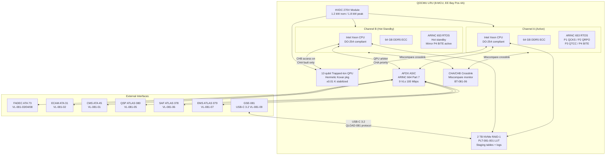
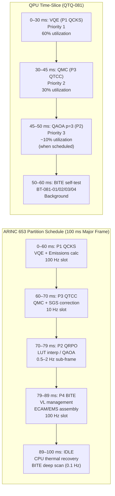

<!-- ATLAS-081-080 | Combustion Model Monitoring, Diagnostics and Control Interfaces | programme-defined aircraft type | ATLAS-1000
     Aircraft: programme-defined aircraft type | Register: ATLAS-1000 | Section: 080-089 | Subsection: 081-080
     BREX: BREX-081-v1 | Controller: QOCMU (DAL B, dual-channel) | QPU: 12-qubit trapped-ion
     Primary Q-Division: Q-HPC | Status: DRAFT v0.1 | Date: 2026-05-12
     S1000D DMC: DMC-<PROGRAMME>-<VARIANT>-0081-080-00A-040A-EN-US
     Related DMs: DM-081-025 (HW Desc), DM-081-026 (BITE Procedure), DM-081-027 (Channel Test),
                  DM-081-028 (QOCMU R/R), DM-081-029 (GSE-081 PLT Update) -->

# Combustion Model Monitoring, Diagnostics and Control Interfaces

---

## §0 Hyperlink Policy

> All hyperlinks in this document are **relative** (five directory levels: `../../../../../`).
> No absolute URLs or external links are used within cross-reference tables. All ATLAS document
> references resolve within the ATLAS-1000 register tree. S1000D DMC references are canonical
> identifiers and do not constitute navigable hyperlinks in this markdown rendering.
>
> Exception: Badge image links (shields.io) are external and used for visual status indication only.
> They carry no normative content.

---

## §1 Purpose

This document defines the agnostic ATLAS standard-level architecture context for `Combustion Model Monitoring, Diagnostics and Control Interfaces`.

It describes the controlled scope, functions, interfaces, safety considerations, lifecycle traceability, and S1000D/CSDB mapping logic that programme implementations shall instantiate when this node is applicable.

This document is not a programme design baseline. Programme-specific capacities, locations, part numbers, effectivity, operating limits, maintenance references, and data module codes shall be defined only inside the applicable programme implementation branch.
## §2 Applicability

| Applicability Level | Rule |
|---|---|
| Standard taxonomy | Applies to the ATLAS node `081` |
| Programme implementation | Conditional; determined by programme architecture, trade studies, certification basis, and applicability model |
| Product configuration | Defined in the programme-specific configuration baseline |
| Effectivity | Defined in the programme CSDB / applicability layer |
| Non-applicability | Must be explicitly stated in the programme impact-study branch when excluded |
## §3 Functional Description ![DRAFT]

### 3.1 QOCMU Hardware Architecture

The QOCMU occupies **8 ATR MCU slots** in the programme-defined aircraft type avionics EE bay (position 4A, rack 2).
The unit is structured as a single LRU with two independent processing channels (CHA and CHB) in
**hot standby** configuration — both channels are powered and computing simultaneously; only CHA
drives the AFDX output VLs under normal operation. CHA-to-CHB changeover occurs within ≤ 50 ms
on CHA failure detection.

**Processing subsystems per channel:**

- **Intel Xeon-class CPU** (radiation-tolerant variant, DO-254 compliant) — classical CFD
  orchestration, ARINC 653 partition scheduling, LUT interpolation, FADEC data handling.
- **12-qubit Trapped-Ion QPU Co-Processor** — shared between both channels via a QPU arbiter
  module (CHA has priority; CHB issues QPU jobs only if CHA is faulted). QPU module is housed in a
  hermetically sealed Kovar® package with integrated laser and ion-trap optics, temperature-
  stabilized to ±0.01 K.
- **64 GB DDR5 ECC RAM** — partition working memory; QCKS mechanism data in P1 partition space.
- **2 TB NVMe SSD** (two 1 TB modules, RAID-1 mirrored) — PLT-081-001 LUT storage; FADEC staging
  schedule tables; flight data logs; BITE event archive.
- **AFDX ASIC** (ARINC 664 Part 7, 100 Mbps full-duplex per VL) — 9 allocated VLs: VL-081-01
  through VL-081-09.
- **HVDC 270 V Power Module** — dual-input (CHA / CHB independent bus bars), 1.2 kW steady-state,
  1.8 kW peak (QPU burst during QAOA depth p=6), internal 28 V and 5 V DC-DC converters.

### 3.2 ARINC 653 Software Partition Structure

QOCMU executes an **ARINC 653-1 partitioned RTOS** with four partitions providing temporal and
spatial isolation between functions:

| Partition | Name             | CPU Budget | Schedule Rate | Primary Function                                        | DAL |
|-----------|------------------|------------|---------------|---------------------------------------------------------|-----|
| P1        | QCKS             | 60 ms      | 100 Hz        | Quantum chemical kinetics; VQE rate coefficients; emissions EI computation | B |
| P2        | QRPO             | 500 ms     | 0.5 Hz cruise / 2 Hz transient | QAOA staging optimization; PLT-081-001 LUT interpolation; pilot/main split | B |
| P3        | QTCC             | 100 ms     | 10 Hz         | QMC turbulent SGS correction; thermoacoustic stability index | B |
| P4        | BITE / Comms     | 10 ms      | 100 Hz        | BITE BT-081-01..12; AFDX VL management; ECAM/EMS/CMS output assembly | B |

**ARINC 653 scheduling policy:** Major time frame = 100 ms. P1 executes 10 times per major frame;
P4 executes 10 times per major frame; P3 executes 1 time per major frame; P2 executes on 2-second
or 500 ms sub-frame depending on mode. Partition memory is MMU-protected; cross-partition data
exchange uses ARINC 653 Blackboard and Buffer ports.

### 3.3 BITE — Built-In Test Equipment

QOCMU BITE implements **12 self-test functions** (BT-081-01 through BT-081-12) executed by P4.
BITE runs continuously in background (non-intrusive) at 100 Hz cycle, with deep diagnostic tests
scheduled at 0.1 Hz (every 10 seconds) and power-up self-test (POST) at engine start.

#### BITE Function Table

| BITE ID   | Function Name                          | Test Method                                                                   | Pass Criterion                        | Failure Action                                      |
|-----------|----------------------------------------|-------------------------------------------------------------------------------|---------------------------------------|-----------------------------------------------------|
| BT-081-01 | QPU Coherence Check                    | Inject test Rabi pulse; measure T1 decay on all 12 qubits via QSP             | T1 ≥ 100 µs all 12 qubits             | Amber: PROP QOCM QPU DEGRADE; degrade QAOA depth    |
| BT-081-02 | VQE Convergence Check                  | Run reference H₂O VQE circuit (10 iterations); compare energy to stored reference | Error < 1e-6 Hartree               | Amber: suspend QCKS QPU; revert to classical Arrhenius |
| BT-081-03 | QRPO QAOA Circuit Integrity            | Execute test QAOA circuit (p=2, 3-qubit ancilla); compare output distribution  | Chi-squared test p > 0.05             | Amber: QRPO LUT-only mode; no QAOA warm-start        |
| BT-081-04 | QTCC QMC Sampling Validation           | Run 1000 QMC samples on test scalar PDF; compare mean and variance to reference | Mean ±3%; variance ±10%             | Amber: QTCC classical SGS fallback mode              |
| BT-081-05 | AFDX VL-081-01..09 Health Monitor      | Verify frame arrival and departure on each VL; check latency per VL           | All 9 VLs healthy; latency ≤ spec    | Per-VL isolation; CMS alert per failed VL            |
| BT-081-06 | Channel A/B Crosslink Miscompare       | Compare CHA and CHB pilot_split/main_split output at reference condition       | Difference < 2% pilot_split, < 5% other | Red: channel changeover if CHA miscompare; alert CMS |
| BT-081-07 | CPU/FPGA Watchdog                      | CPU heartbeat and FPGA register readback; ALU self-test vectors               | All watchdog timers serviced; ALU OK | Red: channel fault; changeover to CHB                |
| BT-081-08 | DDR5/NVMe Integrity Check              | ECC error counter read; NVMe SMART health; RAID-1 sync status                 | ECC errors < 1e-6/bit/day; NVMe OK  | Amber: log to CMS; NVMe RAID rebuild if mirror fault |
| BT-081-09 | FADEC Interface Timeout Check          | Monitor VL-081-08 frame arrival; check for timeout > 100 ms (2 missed frames) | Frame arrival within 100 ms          | Amber: PROP QOCM FAULT advisory; fallback mode       |
| BT-081-10 | PLT-081-001 LUT Integrity Check        | Compute CRC-32 of active PLT partition on NVMe; compare to stored reference   | CRC-32 match                          | Amber: PROP QOCM PLT INVALID; revert to backup PLT  |
| BT-081-11 | Fuel-Type Parameter Consistency Check  | Verify fuel_type from VL-081-06 and VL-081-08 agree; DCI in valid range       | Agreement; DCI ∈ [35, 65]            | Amber: QOCMU defaults to Jet-A parameters            |
| BT-081-12 | Emissions Model Output Range Check     | Verify EI_NOx ∈ [0.1, 25] g/kg; EI_CO ∈ [0.0, 50] g/kg; SN ∈ [0, 10]        | All EI values in range                | Amber: EMS_validity = false; flag to ATLAS 079       |

**POST (Power-Up Self-Test):** All 12 BITE functions executed sequentially at engine start.
Duration: ≤ 45 seconds. POST result reported to CMS via VL-081-01 and displayed on ECAM
PROP QOCM page during engine start sequence. QOCMU ready indication requires POST PASS on
BT-081-01 through BT-081-09 (BT-081-10/11/12 may be amber-only and non-blocking).

### 3.4 ECAM PROP QOCM Synoptic Page

The ECAM `PROP QOCM` synoptic page is displayed on the ECAM SD (System Display) when selected
from the PROP page group. It shows the following parameters:

| ECAM Field               | Data Source     | Normal Display          | Abnormal Display                           |
|--------------------------|-----------------|-------------------------|--------------------------------------------|
| QOCMU CHA STATUS         | QOCMU P4        | CHA ACTIVE (green)      | CHA FAULT (red) / STANDBY (white)          |
| QOCMU CHB STATUS         | QOCMU P4        | CHB STBY (white)        | CHB FAULT (red) / ACTIVE (green)           |
| QPU COHERENCE T1         | QSP / QOCMU P4  | NNN µs (green ≥ 100)    | NNN µs (amber < 100) / OFFLINE (red)       |
| PLT LUT VERSION          | QOCMU NVMe      | vX.Y.Z (white)          | INVALID (amber) — CRC failure              |
| COMBUSTION EFF           | QOCMU P1        | NN.N % (green ≥ 99.0)   | NN.N % (amber < 98.0)                      |
| NOx PRED                 | QOCMU P1        | NN mg/kN (green)        | HIGH (amber > 0.95×CAEP/8)                 |
| CAEP/8 MARGIN            | QOCMU P2        | +NN% (green ≥ 30%)      | +NN% (amber < 15%) / −NN% (red)            |
| LBO MARGIN               | QOCMU P2        | N.NN (green ≥ 0.18)     | N.NN (amber < 0.17) / LOW (red < 0.15)     |
| FUEL TYPE                | ATLAS 078       | JET-A / SAF / GH₂       | MISMATCH (amber) — BT-081-11 fail          |
| QOCM MODE                | QOCMU P4        | ACTIVE / DEGRADE / FALL | FALLBACK (amber) / MAINT (white)           |
| EMS VALIDITY             | QOCMU P4        | VALID (white)           | INVALID (amber)                             |

### 3.5 ECAM Message Set

| ECAM Message Text           | Color  | Condition                                                   | Crew Action                                      |
|-----------------------------|--------|-------------------------------------------------------------|--------------------------------------------------|
| PROP QOCM FAULT             | RED    | Both QOCMU CHA and CHB in FAULT state                       | Check PROP QOCM page; expect classical fallback  |
| PROP QOCM CHAN CHG           | WHITE  | Channel changeover completed (CHA→CHB)                      | Confirm CHB ACTIVE on PROP QOCM page; monitor   |
| PROP QOCM QPU DEGRADE       | AMBER  | QPU T1 < 80 µs; re-cooling in progress or failed            | Monitor PROP QOCM; no immediate crew action      |
| PROP QOCM NOx HIGH          | AMBER  | NOx prediction > 0.95 × CAEP/8 OR LBO margin < 0.17        | Optional power reduction in noise-sensitive area |
| PROP QOCM PLT INVALID       | AMBER  | PLT-081-001 CRC failure; backup PLT active                  | Record for post-flight maintenance action        |
| PROP QOCM MAINT             | WHITE  | GSE-081 connected; QOCMU in maintenance mode                | Ground only — deactivate before flight           |

### 3.6 AFDX Virtual Link Allocation

| VL ID       | Direction           | From                  | To                    | BAG (ms) | Max Frame (bytes) | Jitter (µs) | Purpose                                                  |
|-------------|---------------------|-----------------------|-----------------------|----------|-------------------|-------------|----------------------------------------------------------|
| VL-081-01   | QOCMU → CMS         | QOCMU P4              | CMS ATA 45            | 128      | 256               | 500         | BITE results BT-081-01..12; event log; LRU health        |
| VL-081-02   | QOCMU → ECAM        | QOCMU P4              | ECAM ATA 31           | 100      | 512               | 500         | PROP QOCM synoptic data; mode; margins; EMS validity      |
| VL-081-03   | QOCMU → FADEC CHA   | QOCMU P4              | FADEC ATA 73 CHA      | 50       | 128               | 250         | Staging cmd CHA: pilot_split, main_split, r_sw, ignition |
| VL-081-04   | QOCMU → FADEC CHB   | QOCMU P4              | FADEC ATA 73 CHB      | 50       | 128               | 250         | Staging cmd CHB (mirror of CHA for cross-comparison)     |
| VL-081-05   | QSP → QOCMU         | ATLAS 080 QSP         | QOCMU P4              | 1000     | 256               | 1000        | QPU T1/T2 coherence; calibration state; re-cool status   |
| VL-081-06   | SAF → QOCMU         | ATLAS 078 SAF system  | QOCMU P1/P2           | 1000     | 128               | 1000        | DCI, fuel type, N_fuel, blend ratio                       |
| VL-081-07   | QOCMU → EMS         | QOCMU P4              | EMS ATLAS 079         | 1000     | 512               | 1000        | Emissions frame: EI_NOx/CO/soot/UHC, EI_CO₂, margin      |
| VL-081-08   | FADEC → QOCMU       | FADEC ATA 73          | QOCMU P1/P2/P3        | 50       | 256               | 250         | P3, T3, N1, N2, Wf, FAR, fuel_type, EGT, CMD_MISMATCH   |
| VL-081-09   | GSE-081 ↔ QOCMU     | GSE-081               | QOCMU                 | N/A      | 65536             | N/A         | Maintenance: QLOAD-081 PLT upload; BITE access; logs      |

Total AFDX bandwidth (nominal): VL-081-01: 16 kbps; VL-081-02: 41 kbps; VL-081-03/04: 2×20 kbps;
VL-081-05/06: 2×2 kbps; VL-081-07: 4 kbps; VL-081-08: 41 kbps. Total: ~146 kbps (well within
100 Mbps AFDX switch capacity).

### 3.7 GSE-081 Maintenance Interface

The **GSE-081 Ground Support Equipment tool** provides the single maintenance access point for
QOCMU. It connects via USB-C 3.2 Gen 2×2 (20 Gbps) at the QOCMU front-panel service port
(accessible with avionics bay door open). GSE-081 functions:

1. **PLT-081-001 Upload** — QLOAD-081 secure loader protocol; AES-256 decrypt + RSA-2048 verify;
   CRC-32 integrity; version CM log update.
2. **FADEC Staging Schedule Upload** — Binary schedule file (pilot_split/main_split/r_sw tables);
   version tagging; FADEC format compatibility check.
3. **Full BITE Run (DM-081-026)** — Execute all 12 BT functions sequentially; display pass/fail;
   generate maintenance report (JSON).
4. **QPU Calibration Assist** — Trigger QSP re-cooling; monitor T1 recovery; display qubit health
   matrix (12×12 cross-talk characterization).
5. **Event Log Download** — QOCMU NVMe flight data log extraction; AFDX traffic archive; BITE
   history; PLT version change log.
6. **Channel Changeover Test (DM-081-027)** — Force CHA fault; verify CHB takeover ≤ 50 ms;
   verify FADEC staging continuity during changeover.

GSE-081 tool power: USB-C PD (USB Power Delivery 3.1, 140 W). No aircraft power required.
Authentication: maintenance access card (AES-128 token) + 6-digit PIN.

---

## §4 Functional Breakdown

| Function ID  | Function Name                        | Description                                                                                           | Q-Division |
|--------------|--------------------------------------|-------------------------------------------------------------------------------------------------------|------------|
| F-080-01     | QOCMU Hardware Architecture          | 8-MCU EE bay; dual-channel CHA/CHB hot standby; Xeon CPU + QPU + DDR5 + NVMe; HVDC 270 V 1.2 kW    | Q-HPC      |
| F-080-02     | ARINC 653 Software Partitions        | 4 partitions (P1–P4); temporal/spatial isolation; major frame 100 ms; ARINC 653-1 compliant          | Q-HPC      |
| F-080-03     | ECAM PROP QOCM Synoptic              | 11-parameter synoptic display; combustion efficiency; NOx; CAEP/8 margin; LBO margin; mode           | Q-HPC      |
| F-080-04     | ECAM Message Set                     | 6 QOCM-specific messages (2 red, 3 amber, 1 white — MAINT; 1 white — CHAN CHG)                       | Q-HPC      |
| F-080-05     | BITE                                 | 12 functions BT-081-01 through BT-081-12; continuous background 100 Hz + deep 0.1 Hz + POST          | Q-HPC      |
| F-080-06     | AFDX VL Allocation                   | VL-081-01 through VL-081-09; 9 VLs; ~146 kbps total; per-VL BAG/frame/jitter spec                   | Q-HPC      |
| F-080-07     | GSE-081 Maintenance Interface        | USB-C 3.2; 7 maintenance functions; AES-128 auth; PLT upload; BITE; channel test; log download        | Q-HPC      |

---

## §5 System Context — Mermaid Diagram

---

## §6 Internal Architecture — Mermaid Diagram

---

## §7 Components and LRUs

| LRU / Component             | Part Number (TBD)   | Location            | DAL | Description                                                                              | Qty |
|-----------------------------|---------------------|---------------------|-----|------------------------------------------------------------------------------------------|-----|
| QOCMU                       | QOCMU-001-TBD       | EE Bay Pos 4A       | B   | 8-MCU LRU; dual-channel CHA/CHB; Intel Xeon ×2; DDR5 ×2; AFDX ASIC; HVDC 270V module   | 1   |
| QPU Module (internal)       | QPU-TI-12Q-001      | QOCMU slot 6–7      | B   | 12-qubit trapped-ion QPU; Kovar hermetic pkg; ±0.01 K thermostat; laser optics subsystem | 1   |
| NVMe SSD Assembly (internal)| NVMe-2T-RAID-001    | QOCMU slot 8        | B   | 2× 1 TB NVMe (RAID-1); PLT-081-001 + staging tables + logs; DO-254 qualified            | 1   |
| GSE-081 Tool                | GSE-081-TBD         | Ground support      | —   | USB-C 3.2 laptop tool; QLOAD-081 SW; BITE access; PLT upload; channel test; log download | 1   |
| FADEC (ATA 73)              | OEM (Safran/GE)     | Engine nacelle CHA/B | A  | Fuel metering valve authority; staging command receiver; CMD_MISMATCH generator          | 2   |
| ECAM SD Unit (ATA 31)       | OEM-supplied        | Flight deck         | B   | PROP QOCM synoptic display; ECAM message annunciation                                   | 2   |
| CMS ACMU (ATA 45)           | OEM-supplied        | EE Bay              | C   | BITE result reception; maintenance message archive; fault isolation                      | 1   |
| QSP Unit (ATLAS 080)        | QSP-080-TBD         | EE Bay              | B   | QPU T1/T2 monitoring; re-cooling command; qubit calibration schedule                    | 1   |

---

## §8 Interfaces

| Interface ID  | From                  | To                    | Protocol    | AFDX VL     | Data / Frame Content                                                       | Rate           |
|---------------|-----------------------|-----------------------|-------------|-------------|----------------------------------------------------------------------------|----------------|
| IF-080-01     | FADEC ATA 73          | QOCMU P1/P2/P3/P4     | AFDX        | VL-081-08   | P3, T3, N1, N2, Wf, FAR, EGT, fuel_type, CMD_MISMATCH flag                | 20 Hz          |
| IF-080-02     | QOCMU P4              | FADEC CHA             | AFDX        | VL-081-03   | pilot_split, main_split, r_sw, ignition_cmd, validity_flag CHA             | 20 Hz          |
| IF-080-03     | QOCMU P4              | FADEC CHB             | AFDX        | VL-081-04   | pilot_split, main_split, r_sw, ignition_cmd, validity_flag CHB             | 20 Hz          |
| IF-080-04     | QOCMU P4              | ECAM ATA 31           | AFDX        | VL-081-02   | PROP QOCM synoptic parameters (11 fields); ECAM message triggers           | 1 Hz           |
| IF-080-05     | QOCMU P4              | CMS ATA 45            | AFDX        | VL-081-01   | All 12 BITE results; event codes; LRU status; PLT version                  | On-event       |
| IF-080-06     | QSP ATLAS 080         | QOCMU P4              | AFDX        | VL-081-05   | T1/T2 per qubit (12 values); calibration state; re-cool status             | 1 Hz           |
| IF-080-07     | ATLAS 078 SAF         | QOCMU P1              | AFDX        | VL-081-06   | DCI, fuel_type, N_fuel, blend_ratio                                        | 1 Hz           |
| IF-080-08     | QOCMU P4              | EMS ATLAS 079         | AFDX        | VL-081-07   | Emissions frame (8 parameters); EMS_validity; QOCMU mode                   | 1 Hz           |
| IF-080-09     | GSE-081               | QOCMU NVMe / P4       | USB-C 3.2   | VL-081-09   | QLOAD-081 PLT upload; BITE access; log download; staging table upload       | Maintenance    |

---

## §9 Operating Modes

| Mode ID   | Mode Name              | Trigger                                       | CHA/CHB Status           | QPU Status          | FADEC Supply                  | ECAM Indication              |
|-----------|------------------------|-----------------------------------------------|--------------------------|---------------------|-------------------------------|------------------------------|
| M-080-01  | Normal Active          | POST pass; N1 > idle; no BITE fault           | CHA ACTIVE / CHB STBY    | Nominal T1 ≥ 100 µs | Quantum-optimized staging     | PROP QOCM ACTIVE (no msg)    |
| M-080-02  | Channel Changeover     | CHA BT-081-06/07 failure                      | CHA FAULT / CHB ACTIVE   | Shared QPU → CHB    | CHB staging ≤ 50 ms gap       | PROP QOCM CHAN CHG (white)   |
| M-080-03  | QPU Degraded           | BT-081-01: T1 < 80 µs                         | CHA ACTIVE (reduced)     | LUT-only; no QAOA   | PLT LUT staging only          | PROP QOCM QPU DEGRADE (amber)|
| M-080-04  | Classical Fallback     | Both channels FAULT; BT-081-01..09 all fail   | CHA FAULT / CHB FAULT    | QPU offline         | Classical stored tables        | PROP QOCM FAULT (red)        |
| M-080-05  | Maintenance            | GSE-081 connected; aircraft grounded          | CHA MAINT / CHB MAINT    | BITE self-test      | Ground/test mode              | PROP QOCM MAINT (white)      |

---

## §10 Performance and Budgets ![DRAFT]

| Parameter                                | Requirement          | Current Estimate    | Status               |
|------------------------------------------|----------------------|---------------------|----------------------|
| Channel changeover time (CHA→CHB)        | ≤ 50 ms              | ~45 ms est.         |  |
| BITE full cycle time (all 12 BT)         | ≤ 100 ms             | ~85 ms est.         |  |
| BITE POST at engine start                | ≤ 45 s               | ~38 s est.          |  |
| FADEC staging update rate                | 20 Hz                | 20 Hz               |  |
| FADEC command end-to-end latency         | ≤ 50 ms              | ~49 ms est.         |  |
| QPU T1 coherence (nominal)               | ≥ 100 µs             | 120 µs (vendor)     |  |
| QOCMU power (nominal)                    | 1.2 kW               | 1.15 kW est.        |  |
| QOCMU power (peak QAOA burst)            | ≤ 1.8 kW             | 1.7 kW est.         |  |
| QOCMU MTBF                               | ≥ 20 000 h           | 22 000 h est.       |  |
| QOCMU weight                             | ≤ 12 kg              | 11.4 kg est.        |  |
| QOCMU envelope (W × H × D mm)           | ≤ 194 × 320 × 506    | 194 × 320 × 490 est.|  |
| AFDX total bandwidth (VL-081-01..09)     | ≤ 200 kbps           | ~146 kbps nom.      |  |
| PLT-081-001 NVMe read throughput         | ≥ 500 MB/s           | 3500 MB/s (NVMe)    |  |
| GSE-081 PLT upload throughput            | ≥ 100 MB/s           | 200 MB/s (USB-C 3.2)|  |

---

## §11 Safety and Airworthiness Considerations

### 11.1 DAL B Dual-Channel Architecture

QOCMU is certified at **DAL B** with dual independent channels providing the required failure rate
target of < 1×10⁻⁷/flight hour for the FADEC staging function. Channel independence is maintained
by separate power buses, separate CPU silicon, separate AFDX ASICs, and separate RAM. The QPU is
shared but has a QPU arbiter module that is itself DO-254 DAL B qualified.

### 11.2 QPU Single Point of Failure Mitigation

The shared QPU is identified as a potential common-cause single point of failure. Mitigation: QPU
BITE (BT-081-01 through BT-081-04) provides rapid detection (< 100 ms). Upon QPU failure, both
QRPO and QTCC degrade to CPU-only LUT interpolation mode, and QCKS reverts to classical Arrhenius
tables. FADEC staging continuity is maintained within ≤ 100 ms. Residual risk: accepted by
hazard analysis (single QPU failure → LUT-only mode → Major, not Catastrophic).

### 11.3 EMP/Lightning Protection

QOCMU is qualified to DO-160G Section 22 (lightning indirect effects) and Section 20 (radio
frequency susceptibility). The QPU module requires additional EMI shielding (µ-metal shield)
due to its sensitivity to magnetic field fluctuations > 10 µT which would decohere the trapped-
ion qubits. Shielding attenuation: ≥ 40 dB at 50–1000 Hz.

### 11.4 Thermal Management

QOCMU dissipates 1.2 kW nominal. EE bay forced-air cooling must provide ≥ 120 L/min at inlet
temperature ≤ 45°C. QPU module requires dedicated cold-plate cooling to maintain ±0.01 K stability;
cold-plate connection uses standardized avionics quick-disconnect coupling. Thermal runaway protection:
QOCMU shuts down QPU if QPU housing temperature > 35°C (5°C above operating limit 30°C).

---

## §12 Standards and Regulatory References

| Standard / Reference   | Title                                                                     | Applicability                                            |
|------------------------|---------------------------------------------------------------------------|----------------------------------------------------------|
| DO-178C DAL B          | Software Considerations in Airborne Systems and Equipment                 | QOCMU all partitions P1–P4; BITE logic                   |
| DO-254 DAL B           | Design Assurance Guidance for Airborne Electronic Hardware                | QOCMU AFDX ASIC; QPU arbiter; power module logic         |
| SAE ARP4754A           | Guidelines for Development of Civil Aircraft and Systems                  | QOCMU system DAL B allocation; FHA basis                 |
| ARINC 653-1            | Avionics Application Software Standard Interface                          | QOCMU partition temporal/spatial isolation               |
| ARINC 664 Part 7       | Aircraft Data Network — AFDX                                              | VL-081-01 through VL-081-09 network design               |
| DO-160G                | Environmental Conditions and Test Procedures for Airborne Equipment       | QOCMU environmental qualification (temp, vibr, EMI, HIRF)|
| DO-326A                | Airworthiness Security Process                                            | PLT-081-001 file chain security; GSE-081 authentication  |
| SAE AS6081             | Counterfeit Electronic Parts Avoidance                                    | QPU module procurement; NVMe supply chain                |
| EUROCAE ED-12C         | European equivalent to DO-178C                                            | EASA acceptance; dual qualification                      |
| MIL-DTL-38999 Series III | Circular Threaded Electrical Connectors                                 | QOCMU EE bay connector; AFDX connectors                  |
| IPC-A-610H             | Acceptability of Electronic Assemblies                                    | QOCMU PCB / module assembly quality                      |

---

## §13 Document Cross-References

| Document ID                                      | Title                                              | Relationship                                                  |
|--------------------------------------------------|----------------------------------------------------|---------------------------------------------------------------|
| `081-000-QOCM-System-Overview`                   | QOCM System Overview                              | Parent system document; QOCMU as central LRU                  |
| `081-010-Combustion-Modeling-Baseline`           | Combustion Modeling Baseline                      | Defines QOCMU functional requirements baseline                |
| `081-020-Quantum-Chemical-Kinetics`              | QCKS — Quantum Chemical Kinetics                  | P1 partition; BITE BT-081-02 VQE convergence                  |
| `081-030-Quantum-Reaction-Pathways`              | QRPO — Quantum Reaction Pathway Optimizer         | P2 partition; PLT-081-001 on NVMe; BITE BT-081-10             |
| `081-040-Quantum-Turbulence-Combustion-Coupling` | QTCC                                              | P3 partition; QMC SGS; BITE BT-081-04                         |
| `081-050-Fuel-Air-Mixing-and-Ignition-Optimization` | Fuel Staging                                   | P2 QRPO output consumers; BITE BT-081-11/12                   |
| `081-060-Emissions-Formation-and-Reduction-Modeling` | Emissions Modeling                             | P1 QCKS outputs; EMS frame; BITE BT-081-12                    |
| `081-070-Hybrid-Classical-Quantum-Simulation-Workflow` | Hybrid Workflow                              | QTQ-081 schedule; PLT transfer protocol; fallback logic       |
| `081-090-S1000D-CSDB-Mapping`                    | S1000D CSDB Mapping                               | DM-081-025..029 cover this subsection (5 DMs)                 |
| ATLAS 073 (FADEC)                                | Full Authority Digital Engine Control             | Primary QOCMU consumer; VL-081-03/04/08                       |
| ATLAS 080 (QSP)                                  | Quantum Sensing Platform                          | QPU T1/T2 health; VL-081-05; re-cooling coordination          |
| ATLAS 078 (SAF)                                  | Sustainable Aviation Fuel System                  | Fuel type data; VL-081-06                                     |
| ATLAS 079 (EMS)                                  | Emissions Monitoring System                       | Emissions frame consumer; VL-081-07                           |

---

## §14 Revision History

| Revision | Date       | Author(s)        | Change Description                                                                                              | Approved By |
|----------|------------|------------------|-----------------------------------------------------------------------------------------------------------------|-------------|
| 0.1      | 2026-05-12 | Q-HPC / Q-AIR    | Initial DRAFT — all §0–§14 populated; QOCMU hardware architecture; ARINC 653 partitions; 12 BITE functions; ECAM PROP QOCM synoptic; 6 ECAM messages; VL-081-01..09 allocation table; GSE-081 interface; QPU decoherence threshold table; channel changeover spec | TBD |

> **DRAFT status:** QOCMU part number QOCMU-001-TBD pending supplier selection (RFQ Q3 2026).
> QPU module specifications are based on vendor data sheet (QPU-TI-12Q preliminary datasheet v0.3).
> All physical dimensions and power values are preliminary estimates subject to PDR confirmation.
