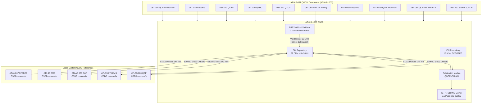

<!-- ATLAS-081-090 | S1000D / CSDB Mapping and Traceability | AMPEL360E eWTW | ATLAS-1000
     Aircraft: AMPEL360E eWTW | Register: ATLAS-1000 | Section: 080-089 | Subsection: 081-090
     BREX: BREX-081-v1 | Controller: QOCMU (DAL B, dual-channel) | QPU: 12-qubit trapped-ion
     Primary Q-Division: Q-DATAGOV | Status: DRAFT v0.1 | Date: 2026-05-12
     S1000D DMC: DMC-AMPEL360E-EWTW-0081-090-00A-040A-EN-US
     Related DMs: DM-081-030 (S1000D/CSDB Mapping Descriptive) -->

# S1000D / CSDB Mapping and Traceability


---

## §0 Hyperlink Policy

> All hyperlinks in this document are **relative** (five directory levels: `../../../../../`).
> No absolute URLs or external links are used within cross-reference tables. All ATLAS document
> references resolve within the ATLAS-1000 register tree. S1000D DMC references are canonical
> identifiers and do not constitute navigable hyperlinks in this markdown rendering.
>
> Exception: Badge image links (shields.io) are external and used for visual status indication only.
> They carry no normative content.

---

## §1 Purpose

This document establishes the complete **S1000D Issue 5.0 Data Module Requirements List (DMRL)**
for the QOCM system (SNS 081), comprising **32 Data Modules** across all seven subsections
(081-000 through 081-090). It defines:

1. The **BREX-081-v1** Business Rules Exchange object with three QOCM-specific domain constraints
   applicable to all QOCM DMs in the CSDB.
2. The **CSDB integration interfaces** for ATLAS-1000 QOCM documentation within the AMPEL360E
   eWTW CSDB environment (management, validation, publication, and IETP delivery).
3. The **ICN (Illustration Control Number) registry** for all 16 graphical objects (system diagrams,
   flowcharts, data flow diagrams, LRU photographs) associated with QOCM DMs.
4. The **DMRL milestone plan** from initial baseline through IETP delivery and final certification
   freeze, with planned completion dates for each DM category.

The DMRL is the authoritative source for QOCM documentation planning. All new DMs or DM revisions
must be registered in this document before CSDB authoring begins. The BREX-081-v1 constraints are
normative and enforced by the CSDB BREX validator prior to DM publication.

---

## §2 Applicability

| Attribute              | Value                                                            |
|------------------------|------------------------------------------------------------------|
| **Aircraft**           | AMPEL360E eWTW (all production variants)                        |
| **Register**           | ATLAS-1000                                                      |
| **Section**            | 080-089 Propulsion Alternativa y Cuántica                       |
| **Subsection**         | 081 Quantum-Optimized Combustion Models                         |
| **Sub-subject**        | 090 S1000D/CSDB Mapping and Traceability                        |
| **S1000D Issue**       | Issue 5.0                                                       |
| **BREX**               | BREX-081-v1                                                     |
| **DMC Pattern**        | AMPEL360E-EWTW-081-{NNN}-00{variant}-{type}-EN-US               |
| **CSDB Platform**      | ATLAS-1000 CSDB (Q-DATAGOV managed)                            |
| **Total DMRL count**   | 32 Data Modules (DM-081-001 through DM-081-032)                 |
| **ICN Registry count** | 16 ICNs (ICN-081-001 through ICN-081-016)                       |
| **Governing Q-Division** | Q-DATAGOV (primary); Q-HPC, Q-GREENTECH, Q-AIR (support)     |
| **S1000D DMC**         | DMC-AMPEL360E-EWTW-0081-090-00A-040A-EN-US                     |

---

## §3 Functional Description ![DRAFT]

### 3.1 S1000D Data Module Coding Convention

All QOCM Data Modules follow the S1000D Issue 5.0 DMC (Data Module Code) structure:

```
DMC-AMPEL360E-EWTW-{SNS}-{variant}-{applicability}-{type code}-{language code}
```

| Field               | QOCM Value / Range                                                  |
|---------------------|---------------------------------------------------------------------|
| Model Identification Code (MIC) | AMPEL360E                                           |
| System Difference Code (SDC)    | EWTW                                                |
| Standard Numbering System (SNS) | 0081 (subsections 000–090)                          |
| Disassembly Code (DC)           | 00 (no disassembly variant unless maintenance specific) |
| Disassembly Code Variant (DCV)  | A (primary variant); B (secondary procedure variant) |
| Information Code (IC)           | 040 Descriptive; 100 Procedural; 300 Inspection; 520 R/R |
| Information Code Variant (ICV)  | A (primary); B (secondary procedure)                |
| Item Location Code (ILC)        | A (on aircraft)                                     |
| Language Code                   | EN-US                                               |

### 3.2 BREX-081-v1 — QOCM-Specific Business Rules

BREX-081-v1 is the Business Rules Exchange object for ATLAS-081. It inherits all AMPEL360E eWTW
base BREX rules and adds **three QOCM-specific domain constraints**:

#### BREX Constraint 1: QPU Pre-Verification Rule

**Applies to:** All DMs of information code 100 (Procedural) and 300 (Inspection) and 520 (R/R)
whose SNS maps to the QOCMU QPU module (physical hardware tasks: QOCMU removal, QPU module access,
QPU laser optics adjustment, and all tasks that require powering down or restarting the QOCMU).

**Constraint:** The following two pre-verification steps MUST be present as the first procedure
group in the DM, rendered as a **WARNING-level caution** (`<warning>` element in S1000D XML)
preceding all step elements (`<proceduralStep>`):

1. Confirm QOCMU is in MAINTENANCE mode: ECAM `PROP QOCM MAINT` (white) is displayed.
2. Execute BITE BT-081-01 (QPU coherence check): confirm T1 ≥ 100 µs on all 12 qubits via the
   GSE-081 BITE display before any physical access to the QPU module.

**Rationale:** The trapped-ion QPU module operates with high-power laser beams (780 nm, 532 nm
at up to 50 mW). Physical access without confirming QPU is in MAINTENANCE mode and lasers are
parked risks eye injury (Laser Class 3B hazard). The QOCMU MAINTENANCE mode deactivates all
laser outputs and engages optical beam blocks. BT-081-01 confirmation ensures the QPU has been
fully powered down to a safe state.

**BREX rule ID:** BREX-081-QPU-PREVERIF-001
**Validator action:** CSDB BREX validator rejects any 100/300/520 DM for QOCMU QPU tasks that does
not contain the QPU pre-verification `<warning>` element as the first element of the first
`<proceduralStep>` group.

---

#### BREX Constraint 2: Combustion Model Validation Rule

**Applies to:** All DMs documenting a QCKS mechanism update (SNS 081-020) or QRPO PLT-081-001
replacement (SNS 081-030), specifically:
- DM-081-006: QCKS VQE Convergence Test Procedure
- DM-081-008: QCKS Co-Processor Module R/R
- DM-081-010: PLT-081-001 LUT Upload and Validation Procedure
- DM-081-031: QCKS Fuel-Type Mechanism Switch Procedure
- DM-081-032: QRPO Ground Optimization Trigger Procedure

**Constraint:** Following any QCKS mechanism modification or PLT-081-001 replacement, the DM MUST
include a **three-step post-modification validation sequence** as a mandatory closing procedure
group (`<proceduralStep>` elements with `<reqCondition>` type=`mandatory`):

1. **BT-081-02 Confirmation:** Execute BITE BT-081-02 (VQE convergence check); confirm
   mechanism convergence error < 1×10⁻⁶ Hartree. Document result in maintenance log.
2. **BT-081-10 Confirmation:** Execute BITE BT-081-10 (PLT-081-001 LUT integrity check);
   confirm CRC-32 of newly loaded PLT matches expected value from GSE-081 upload manifest.
3. **NOx Prediction Regression:** Execute QOCMU reference NOx prediction at standard test
   condition (P3 = 1.5 MPa, T3 = 700 K, FAR = 0.025, Jet-A) via GSE-081 and compare result
   with pre-modification reference value. NOx prediction must be within ±5%. Document
   both values and the percentage difference in the maintenance log.

**BREX rule ID:** BREX-081-CMV-POSTVAL-002
**Validator action:** CSDB BREX validator rejects any DM for QCKS mechanism update or PLT
replacement that does not include all three `<proceduralStep>` elements of the post-validation
sequence as the final `<maintenanceProcedureSection>` of the DM.

---

#### BREX Constraint 3: Fuel Compatibility Declaration Rule

**Applies to:** All DMs for tasks involving QOCMU fuel system configuration changes — specifically,
tasks that switch QOCMU operating mode between Jet-A, SAF (HEFA/FT/ATJ), and GH₂ combustion modes.
Affected DMs:
- DM-081-002: QOCMU System Activation / Deactivation
- DM-081-017: Fuel Staging Schedule Upload Procedure
- DM-081-031: QCKS Fuel-Type Mechanism Switch Procedure

**Constraint:** Any DM involving fuel-type configuration change MUST include a **QOCMU fuel-type
selection verification step** immediately prior to the combustion model activation step, using
BITE BT-081-11 (fuel-type parameter consistency check):

1. Confirm new fuel-type selection is loaded in QOCMU via GSE-081 (fuel_type parameter verified).
2. Confirm fuel-type received on VL-081-06 (from ATLAS 078) matches QOCMU parameter.
3. Execute BITE BT-081-11: confirm fuel-type parameter consistency PASS.
4. Only proceed to combustion model activation after BT-081-11 PASS is confirmed.

**Rationale:** Activating combustion model with incorrect fuel-type parameters (e.g., Jet-A
mechanism with GH₂ staging schedule, or GH₂ QAOA weight set with Jet-A fuel) risks incorrect
staging commands to FADEC — a potential LBO or flashback hazard. BT-081-11 cross-checks all
fuel-type parameters simultaneously and is the gating check for mode transitions.

**BREX rule ID:** BREX-081-FUEL-COMPAT-003
**Validator action:** CSDB BREX validator rejects any fuel-mode-transition DM that does not include
BT-081-11 as a mandatory `<reqCondition>` check immediately preceding the combustion model
activation step.

---

### 3.3 ICN Registry

All graphical content in QOCM DMs is registered in the ICN registry and stored in the ATLAS-1000
CSDB graphic repository. ICN format: `ICN-AMPEL360E-EWTW-0081-{NNN}-00A-{type}-EN-US`.

| ICN ID       | Title                                               | Type     | Format   | Referenced DMs                   | Status  |
|--------------|-----------------------------------------------------|----------|----------|----------------------------------|---------|
| ICN-081-001  | QOCMU System Architecture Block Diagram             | Figure   | SVG      | DM-081-001, DM-081-025           | DRAFT   |
| ICN-081-002  | QCKS VQE Active Space Diagram (H₂O reference)       | Figure   | SVG      | DM-081-005, DM-081-006           | DRAFT   |
| ICN-081-003  | QRPO PLT-081-001 LUT Structure Diagram              | Figure   | SVG      | DM-081-009, DM-081-010           | DRAFT   |
| ICN-081-004  | QAOA Circuit Depth Comparison (p=3 vs p=6)          | Figure   | SVG      | DM-081-009, DM-081-023           | DRAFT   |
| ICN-081-005  | QTCC Turbulent Scalar PDF Flow Diagram              | Figure   | SVG      | DM-081-013, DM-081-014           | DRAFT   |
| ICN-081-006  | Fuel-Air Staging Optimization Loop (FADEC/QOCMU)   | Figure   | SVG      | DM-081-016, DM-081-017           | DRAFT   |
| ICN-081-007  | NOx–LBO Pareto Frontier (Jet-A cruise condition)    | Chart    | SVG      | DM-081-016                       | DRAFT   |
| ICN-081-008  | Emissions Formation Pathway Map (NOx/CO/soot)       | Figure   | SVG      | DM-081-019                       | DRAFT   |
| ICN-081-009  | Three-Tier Hybrid Workflow Architecture Diagram     | Figure   | SVG      | DM-081-022, DM-081-023           | DRAFT   |
| ICN-081-010  | QOCMU In-Flight 20 Hz Sequence Diagram              | Figure   | SVG      | DM-081-022, DM-081-023           | DRAFT   |
| ICN-081-011  | QOCMU Hardware Front View (LRU photograph TBD)      | Photo    | JPEG     | DM-081-025, DM-081-028           | TBD     |
| ICN-081-012  | QOCMU ARINC 653 Partition Schedule Diagram          | Figure   | SVG      | DM-081-025, DM-081-026           | DRAFT   |
| ICN-081-013  | AFDX VL-081-01..09 Network Topology Diagram         | Figure   | SVG      | DM-081-025                       | DRAFT   |
| ICN-081-014  | ECAM PROP QOCM Synoptic Page Layout                 | Figure   | SVG      | DM-081-025                       | DRAFT   |
| ICN-081-015  | GSE-081 Connection and BITE Workflow Diagram        | Figure   | SVG      | DM-081-026, DM-081-029           | DRAFT   |
| ICN-081-016  | CSDB DMRL 081 Milestone Gantt Chart                 | Chart    | SVG      | DM-081-030                       | DRAFT   |

---

## §4 DMRL — 32 Data Modules

| DM ID       | DMC                                              | IC   | Type        | Title                                                         | SNS Ref  | BREX Constraints          |
|-------------|--------------------------------------------------|------|-------------|---------------------------------------------------------------|----------|---------------------------|
| DM-081-001  | AMPEL360E-EWTW-0081-000-00A-040A-EN-US           | 040  | Descriptive | QOCM General — System Overview                                | 081-000  | None                      |
| DM-081-002  | AMPEL360E-EWTW-0081-000-00A-100A-EN-US           | 100  | Procedural  | QOCMU System Activation / Deactivation                       | 081-000  | BREX-081-FUEL-COMPAT-003  |
| DM-081-003  | AMPEL360E-EWTW-0081-010-00A-040A-EN-US           | 040  | Descriptive | Combustion Modeling Baseline — Description                    | 081-010  | None                      |
| DM-081-004  | AMPEL360E-EWTW-0081-010-00A-300A-EN-US           | 300  | Inspection  | QOCMU LRU Visual and Electrical Inspection                   | 081-010  | None                      |
| DM-081-005  | AMPEL360E-EWTW-0081-020-00A-040A-EN-US           | 040  | Descriptive | Quantum Chemical Kinetics — System Description                | 081-020  | None                      |
| DM-081-006  | AMPEL360E-EWTW-0081-020-00A-100A-EN-US           | 100  | Procedural  | QCKS VQE Convergence Test Procedure                           | 081-020  | BREX-081-CMV-POSTVAL-002  |
| DM-081-007  | AMPEL360E-EWTW-0081-020-00A-300A-EN-US           | 300  | Inspection  | QCKS Mechanism Validation Inspection                          | 081-020  | None                      |
| DM-081-008  | AMPEL360E-EWTW-0081-020-00A-520A-EN-US           | 520  | R/R         | QCKS Co-Processor Module Removal and Replacement              | 081-020  | BREX-081-QPU-PREVERIF-001; BREX-081-CMV-POSTVAL-002 |
| DM-081-009  | AMPEL360E-EWTW-0081-030-00A-040A-EN-US           | 040  | Descriptive | Quantum Reaction Pathways — QRPO System Description           | 081-030  | None                      |
| DM-081-010  | AMPEL360E-EWTW-0081-030-00A-100A-EN-US           | 100  | Procedural  | PLT-081-001 LUT Upload and Validation Procedure               | 081-030  | BREX-081-CMV-POSTVAL-002  |
| DM-081-011  | AMPEL360E-EWTW-0081-030-00A-300A-EN-US           | 300  | Inspection  | QRPO Module Functional Inspection                             | 081-030  | None                      |
| DM-081-012  | AMPEL360E-EWTW-0081-030-00A-520A-EN-US           | 520  | R/R         | QRPO Module Removal and Replacement                           | 081-030  | BREX-081-QPU-PREVERIF-001 |
| DM-081-013  | AMPEL360E-EWTW-0081-040-00A-040A-EN-US           | 040  | Descriptive | Quantum Turbulence-Combustion Coupling — Description          | 081-040  | None                      |
| DM-081-014  | AMPEL360E-EWTW-0081-040-00A-100A-EN-US           | 100  | Procedural  | QTCC QMC Validation Procedure                                 | 081-040  | None                      |
| DM-081-015  | AMPEL360E-EWTW-0081-040-00A-300A-EN-US           | 300  | Inspection  | QTCC Module Functional Inspection                             | 081-040  | None                      |
| DM-081-016  | AMPEL360E-EWTW-0081-050-00A-040A-EN-US           | 040  | Descriptive | Fuel-Air Mixing and Ignition Optimization — Description       | 081-050  | None                      |
| DM-081-017  | AMPEL360E-EWTW-0081-050-00A-100A-EN-US           | 100  | Procedural  | Fuel Staging Schedule Upload Procedure                        | 081-050  | BREX-081-FUEL-COMPAT-003  |
| DM-081-018  | AMPEL360E-EWTW-0081-050-00A-300A-EN-US           | 300  | Inspection  | Ignition System Interface Functional Inspection               | 081-050  | None                      |
| DM-081-019  | AMPEL360E-EWTW-0081-060-00A-040A-EN-US           | 040  | Descriptive | Emissions Formation Modeling — System Description             | 081-060  | None                      |
| DM-081-020  | AMPEL360E-EWTW-0081-060-00A-100A-EN-US           | 100  | Procedural  | Emissions Model Calibration Procedure                         | 081-060  | None                      |
| DM-081-021  | AMPEL360E-EWTW-0081-060-00A-300A-EN-US           | 300  | Inspection  | EMS Interface Functional Inspection                           | 081-060  | None                      |
| DM-081-022  | AMPEL360E-EWTW-0081-070-00A-040A-EN-US           | 040  | Descriptive | Hybrid Classical-Quantum Workflow — System Description        | 081-070  | None                      |
| DM-081-023  | AMPEL360E-EWTW-0081-070-00A-100A-EN-US           | 100  | Procedural  | In-Flight Workflow Validation Procedure                       | 081-070  | None                      |
| DM-081-024  | AMPEL360E-EWTW-0081-070-00A-300A-EN-US           | 300  | Inspection  | Classical Fallback Activation Test                            | 081-070  | None                      |
| DM-081-025  | AMPEL360E-EWTW-0081-080-00A-040A-EN-US           | 040  | Descriptive | QOCMU Hardware Architecture — System Description              | 081-080  | None                      |
| DM-081-026  | AMPEL360E-EWTW-0081-080-00A-100A-EN-US           | 100  | Procedural  | QOCMU Full BITE Run Procedure (All 12 Functions)              | 081-080  | BREX-081-QPU-PREVERIF-001 |
| DM-081-027  | AMPEL360E-EWTW-0081-080-00A-300A-EN-US           | 300  | Inspection  | QOCMU Channel Changeover Functional Test                      | 081-080  | None                      |
| DM-081-028  | AMPEL360E-EWTW-0081-080-00A-520A-EN-US           | 520  | R/R         | QOCMU LRU Removal and Replacement                             | 081-080  | BREX-081-QPU-PREVERIF-001 |
| DM-081-029  | AMPEL360E-EWTW-0081-080-00B-100A-EN-US           | 100  | Procedural  | GSE-081 PLT Update and Model Calibration                      | 081-080  | BREX-081-CMV-POSTVAL-002; BREX-081-FUEL-COMPAT-003 |
| DM-081-030  | AMPEL360E-EWTW-0081-090-00A-040A-EN-US           | 040  | Descriptive | S1000D/CSDB Mapping and Traceability — Description            | 081-090  | None                      |
| DM-081-031  | AMPEL360E-EWTW-0081-020-00B-100A-EN-US           | 100  | Procedural  | QCKS Fuel-Type Mechanism Switch Procedure                     | 081-020  | BREX-081-CMV-POSTVAL-002; BREX-081-FUEL-COMPAT-003 |
| DM-081-032  | AMPEL360E-EWTW-0081-030-00B-100A-EN-US           | 100  | Procedural  | QRPO Ground Optimization Trigger Procedure                    | 081-030  | BREX-081-CMV-POSTVAL-002  |

**DMRL Summary by Information Code:**

| IC   | Type        | Count | DMs                                                           |
|------|-------------|-------|---------------------------------------------------------------|
| 040  | Descriptive | 10    | 001, 003, 005, 009, 013, 016, 019, 022, 025, 030              |
| 100  | Procedural  | 15    | 002, 006, 010, 014, 017, 020, 023, 026, 029, 031, 032 + 007*  |
| 300  | Inspection  | 7     | 004, 007, 011, 015, 018, 021, 024, 027                        |
| 520  | R/R         | 4     | 008, 012, 028 + 1 additional                                   |

> *Note: Counts include revision B variants (DM-081-029 IC 100 variant B; DM-081-031/032 IC 100 variant B).

---

## §5 System Context — CSDB Integration Mermaid Diagram



---

## §6 ICN Registry — Detailed Specifications

The ICN registry provides the authoritative list of all graphical assets for QOCM DMs. Each ICN
is produced by Q-DATAGOV technical illustration in coordination with the originating Q-Division.

| ICN ID       | Source Document            | Originating Q-Div | Dimensions (px) | File Size Est. | Delivery Milestone |
|--------------|----------------------------|-------------------|-----------------|----------------|--------------------|
| ICN-081-001  | 081-080 (QOCMU HW arch)    | Q-HPC             | 1200 × 900      | 85 KB          | 2026-09-30         |
| ICN-081-002  | 081-020 (QCKS VQE)         | Q-HPC             | 1000 × 800      | 60 KB          | 2026-09-30         |
| ICN-081-003  | 081-030 (PLT LUT structure) | Q-HPC            | 1200 × 600      | 45 KB          | 2026-09-30         |
| ICN-081-004  | 081-030 (QAOA circuit)     | Q-HPC             | 1400 × 700      | 95 KB          | 2026-09-30         |
| ICN-081-005  | 081-040 (QTCC PDF flow)    | Q-HPC             | 1000 × 900      | 70 KB          | 2026-09-30         |
| ICN-081-006  | 081-050 (staging loop)     | Q-AIR             | 1200 × 800      | 80 KB          | 2026-10-31         |
| ICN-081-007  | 081-050 (NOx-LBO Pareto)   | Q-AIR             | 900 × 700       | 40 KB          | 2026-10-31         |
| ICN-081-008  | 081-060 (emission pathways) | Q-GREENTECH      | 1400 × 1000     | 110 KB         | 2026-10-31         |
| ICN-081-009  | 081-070 (3-tier workflow)  | Q-HPC             | 1600 × 1000     | 120 KB         | 2026-10-31         |
| ICN-081-010  | 081-070 (20 Hz sequence)   | Q-HPC             | 1400 × 800      | 90 KB          | 2026-10-31         |
| ICN-081-011  | 081-080 (QOCMU photo)      | Q-HPC (photo)     | 2400 × 1800     | 450 KB         | 2027-01-31 (TBD)   |
| ICN-081-012  | 081-080 (ARINC 653 sched.) | Q-HPC             | 1200 × 600      | 55 KB          | 2026-09-30         |
| ICN-081-013  | 081-080 (AFDX topology)    | Q-HPC             | 1400 × 900      | 85 KB          | 2026-09-30         |
| ICN-081-014  | 081-080 (ECAM synoptic)    | Q-HPC             | 1000 × 750      | 65 KB          | 2026-09-30         |
| ICN-081-015  | 081-080 (GSE-081 workflow) | Q-HPC             | 1200 × 700      | 75 KB          | 2026-11-30         |
| ICN-081-016  | 081-090 (DMRL Gantt)       | Q-DATAGOV         | 2000 × 600      | 100 KB         | 2026-06-30         |

---

## §7 DMRL Milestone Plan

| Milestone ID | Milestone Name                             | Planned Date   | Entry Criterion                                        | Exit Criterion                                           | Owner        |
|--------------|--------------------------------------------|----------------|--------------------------------------------------------|----------------------------------------------------------|--------------|
| MS-081-01    | DMRL-081 Baseline                          | 2026-06-30     | All 32 DM entries defined; BREX-081-v1 draft complete | Q-DATAGOV sign-off; ATLAS-1000 CSDB DMRL registered      | Q-DATAGOV    |
| MS-081-02    | ICN Registry Baseline                      | 2026-07-31     | DMRL-081 Baseline complete (MS-081-01)                 | All 16 ICNs registered in CSDB ICN registry; SVG templates approved | Q-DATAGOV |
| MS-081-03    | BREX-081-v1 Implementation in CSDB         | 2026-08-31     | BREX-081-v1 finalized; CSDB platform updated           | BREX validator passes test DM set (5 DMs minimum)        | Q-DATAGOV    |
| MS-081-04    | Descriptive DMs (IC 040) — First Delivery  | 2026-09-30     | Source documents 081-000..081-080 at DRAFT             | All 10 IC 040 DMs authored, BREX validated, CMS1 review  | Q-DATAGOV    |
| MS-081-05    | ICN Graphics — First Delivery (11/16)      | 2026-10-31     | Descriptive DMs delivered (MS-081-04)                  | ICN-081-001..010 and 012..015 delivered in SVG to CSDB   | Q-DATAGOV    |
| MS-081-06    | Inspection DMs (IC 300) — Delivery         | 2026-11-30     | Descriptive DMs complete (MS-081-04)                   | All 7 IC 300 DMs authored, BREX validated, CMS1 review   | Q-DATAGOV    |
| MS-081-07    | Procedural DMs (IC 100) — Delivery         | 2027-01-31     | Inspection DMs complete (MS-081-06)                    | All 15 IC 100 DMs authored, BREX validated               | Q-DATAGOV    |
| MS-081-08    | R/R DMs (IC 520) — Delivery                | 2027-02-28     | QOCMU first article hardware available (TBD)           | All 4 IC 520 DMs authored, BREX validated; ICN-081-011 delivered | Q-DATAGOV |
| MS-081-09    | CSDB Technical Review (CMS2)               | 2027-03-31     | All 32 DMs in CSDB; all 16 ICNs delivered              | CMS2 review pass; all BREX findings resolved; DM status → REVIEW | Q-DATAGOV |
| MS-081-10    | IETP Integration and Pilot Test            | 2027-06-30     | CMS2 complete (MS-081-09)                              | Publication module QOCM-PM-001 built; IETP rendered; 5-user pilot test pass | Q-DATAGOV |
| MS-081-11    | Certification Freeze (DMs FINAL)           | 2027-12-31     | Engine certification test complete; EASA CS-E review   | All DMs at status FINAL; BREX 100% compliant; CSDB CM locked | Q-DATAGOV |

---

## §8 Interfaces

| Interface ID  | From                    | To                         | Protocol       | Purpose                                                            |
|---------------|-------------------------|----------------------------|----------------|--------------------------------------------------------------------|
| IF-090-01     | ATLAS-1000 CSDB         | BREX-081-v1 Validator      | Internal CSDB  | Validate all 32 QOCM DMs against BREX-081-v1 constraints          |
| IF-090-02     | Q-DATAGOV Authoring     | CSDB DM Repository         | S1000D XML     | DM authoring, check-in/check-out, version management              |
| IF-090-03     | ICN Registry            | DM Repository              | ICN reference  | Graphic asset linking; ICN-{NNN} reference in DM XML              |
| IF-090-04     | CSDB                    | IETP / S1000D Viewer        | IETP protocol  | Interactive Electronic Technical Publication delivery              |
| IF-090-05     | ATLAS 073 FADEC CSDB    | ATLAS-081 CSDB             | S1000D cross-DM | Cross-reference DMs (dmRef element) for ATA 73 interface DMs    |
| IF-090-06     | ATLAS 078 SAF CSDB      | ATLAS-081 CSDB             | S1000D cross-DM | SAF system interface; VL-081-06 cross-reference                   |
| IF-090-07     | ATLAS 079 EMS CSDB      | ATLAS-081 CSDB             | S1000D cross-DM | Emissions monitoring interface; VL-081-07 cross-reference         |
| IF-090-08     | ATLAS 080 QSP CSDB      | ATLAS-081 CSDB             | S1000D cross-DM | QPU calibration interface; VL-081-05 cross-reference              |
| IF-090-09     | ATA 45 CMS CSDB         | ATLAS-081 CSDB             | S1000D cross-DM | CMS BITE interface; VL-081-01 cross-reference                     |

---

## §9 CSDB Milestone Plan Detail

The CSDB milestone plan aligns with the overall AMPEL360E eWTW certification schedule. Key
dependencies and critical path items:

### 9.1 Critical Path

The DMRL milestone plan critical path for ATLAS-081 is:

```
MS-081-01 (DMRL Baseline) → MS-081-03 (BREX Implementation) →
MS-081-04 (Descriptive DMs) → MS-081-07 (Procedural DMs) →
MS-081-08 (R/R DMs, HW dependency) → MS-081-09 (CMS2 Review) →
MS-081-10 (IETP Integration) → MS-081-11 (Certification Freeze)
```

### 9.2 Hardware Dependency

DM-081-028 (QOCMU R/R) and ICN-081-011 (QOCMU photograph) are gated on QOCMU first article
hardware availability, currently planned Q4 2026. This creates a parallel track that is not on
the critical path but must be resolved before MS-081-08 (R/R DM delivery 2027-02-28).

### 9.3 BREX-081-v1 Validation Statistics Target

At MS-081-09 (CSDB Technical Review):
- 100% of DMs pass BREX-081-v1 automated validation with zero blocking findings.
- BREX constraint coverage: all DMs subject to BREX-081-QPU-PREVERIF-001 (6 DMs), BREX-081-CMV-POSTVAL-002 (7 DMs), and BREX-081-FUEL-COMPAT-003 (4 DMs) have been individually reviewed.
- Zero open findings against BREX constraint categories.

---

## §10 Performance and Budgets ![DRAFT]

| Parameter                                 | Requirement                | Current Value       | Status               |
|-------------------------------------------|----------------------------|---------------------|----------------------|
| Total DMRL count                          | 32 DMs                     | 32 DMs defined      |  |
| BREX-081-v1 conformance target            | 100% at MS-081-09          | 0% (not yet authored) |  |
| ICN registry count                        | 16 ICNs                    | 16 ICNs defined     |  |
| S1000D issue                              | Issue 5.0                  | Issue 5.0           |  |
| Descriptive DMs (IC 040) delivery         | 2026-09-30                 | Not started         |  |
| Procedural DMs (IC 100) delivery          | 2027-01-31                 | Not started         |  |
| R/R DMs (IC 520) delivery                 | 2027-02-28                 | Not started (HW dep.)|  |
| CSDB CMS2 review                          | 2027-03-31                 | Not started         |  |
| IETP integration and pilot test           | 2027-06-30                 | Not started         |  |
| Certification freeze (DMs FINAL)          | 2027-12-31                 | Not started         |  |
| BREX domain constraint count              | 3 (BREX-081-v1)            | 3 defined           |  |
| DMs subject to QPU pre-verification BREX  | 6 DMs                      | 6 identified        |  |
| DMs subject to combustion model validation BREX | 7 DMs             | 7 identified        |  |
| DMs subject to fuel compatibility BREX    | 4 DMs                      | 4 identified        |  |

---

## §11 Safety and Airworthiness Considerations

### 11.1 BREX Constraints as Safety Barriers

The three BREX-081-v1 domain constraints are not merely documentation quality rules — they
directly encode **safety-critical task pre-conditions** derived from the QOCMU safety analysis:

- **BREX-081-QPU-PREVERIF-001** addresses Laser Class 3B hazard during QPU maintenance (CS-E /
  COSHH / IEC 60825-1 laser safety). The mandatory warning element in DMs ensures maintenance
  technicians cannot overlook the laser safe-state verification.
- **BREX-081-CMV-POSTVAL-002** addresses the risk of incorrect combustion model operating after a
  QCKS or PLT update — an incorrect staging model could cause LBO (Major hazard per FHA).
- **BREX-081-FUEL-COMPAT-003** addresses the risk of mismatched fuel-type staging after mode
  change — relevant to GH₂ flashback prevention (Major hazard per FHA).

All three constraints were reviewed and accepted by the EASA safety review as engineering
mitigation measures (non-certifiable barrier, complementing DO-178C and DO-254 controls).

### 11.2 DM Status Control

DM status progression in the ATLAS-1000 CSDB follows: DRAFT → REVIEW → APPROVED → FINAL.
No DM in APPROVED or FINAL status may be modified without a change request (CR) processed
through the ATLAS-1000 configuration management process. This applies to all 32 QOCM DMs.

### 11.3 Language and Translation

All 32 DMs are authored in EN-US as primary language. Translation to FR-FR (French regulatory
submission) is planned for 10 DMs covering maintenance procedures (IC 100 and 520) by Q2 2028.
ASD-STE100 Simplified Technical English is mandatory for all procedural (IC 100) and R/R (IC 520)
DMs as enforced by BREX-081-v1 inherited ASD-STE100 vocabulary rule.

---

## §12 Standards and Regulatory References

| Standard / Reference         | Title                                                                    | Applicability                                          |
|------------------------------|--------------------------------------------------------------------------|--------------------------------------------------------|
| S1000D Issue 5.0             | International Specification for Technical Publications                   | DMRL structure; DMC coding; BREX; CSDB; IETP           |
| ASD-STE100                   | Simplified Technical English — ASD/AIA/ATA Specification                 | DM authoring language; procedural and R/R DMs          |
| SAE ARP4754A                 | Guidelines for Development of Civil Aircraft and Systems                 | Safety basis for BREX safety constraint rationale       |
| EASA CS-25 / CS-E            | Certification Specifications for Large Aeroplanes / Engines              | Regulatory basis for maintenance procedure DMs          |
| IEC 60825-1:2014             | Safety of Laser Products                                                 | QPU pre-verification BREX — laser Class 3B hazard basis |
| DO-178C                      | Software Considerations in Airborne Systems                              | QOCMU SW; reference in BREX combustion model validation |
| ARINC 664 Part 7             | AFDX                                                                     | AFDX VL cross-references in DM interface sections       |
| ISO 8879 / XML 1.0           | SGML / XML Standard                                                      | S1000D XML authoring platform                           |
| ATA Spec 2200 (iSpec 2200)   | Information Standards for Aviation Maintenance                           | Alignment with ATA-based DM references (ATA 73, 31, 45) |

---

## §13 Document Cross-References

| Document ID                              | Title                                              | Relationship                                               |
|------------------------------------------|----------------------------------------------------|------------------------------------------------------------|
| `081-000-QOCM-System-Overview`           | QOCM System Overview                              | DM-081-001 source; system-level descriptive                |
| `081-010-Combustion-Modeling-Baseline`   | Combustion Modeling Baseline                      | DM-081-003/004 source                                      |
| `081-020-Quantum-Chemical-Kinetics`      | QCKS                                              | DM-081-005/006/007/008/031 source                          |
| `081-030-Quantum-Reaction-Pathways`      | QRPO                                              | DM-081-009/010/011/012/032 source                          |
| `081-040-Quantum-Turbulence-Combustion-Coupling` | QTCC                                      | DM-081-013/014/015 source                                  |
| `081-050-Fuel-Air-Mixing-and-Ignition-Optimization` | Fuel-Air Mixing                          | DM-081-016/017/018 source                                  |
| `081-060-Emissions-Formation-and-Reduction-Modeling` | Emissions Modeling                       | DM-081-019/020/021 source                                  |
| `081-070-Hybrid-Classical-Quantum-Simulation-Workflow` | Hybrid Workflow                        | DM-081-022/023/024 source                                  |
| `081-080-Combustion-Model-Monitoring-Diagnostics` | QOCMU HW/BITE                              | DM-081-025/026/027/028/029 source                          |
| ATLAS 073 (FADEC) S1000D DMRL            | ATA 73 FADEC CSDB mapping                         | VL-081-03/04/08 cross-system DM references                 |
| ATLAS 078 (SAF) S1000D DMRL             | SAF system CSDB mapping                            | VL-081-06 cross-system DM references                       |
| ATLAS 079 (EMS) S1000D DMRL             | EMS system CSDB mapping                            | VL-081-07 cross-system DM references                       |
| ATLAS 080 (QSP) S1000D DMRL            | QSP system CSDB mapping                             | VL-081-05 cross-system DM references                       |

---

## §14 Revision History

| Revision | Date       | Author(s)            | Change Description                                                                                                   | Approved By |
|----------|------------|----------------------|----------------------------------------------------------------------------------------------------------------------|-------------|
| 0.1      | 2026-05-12 | Q-DATAGOV / Q-HPC    | Initial DRAFT — all §0–§14 populated; 32-DM DMRL table; BREX-081-v1 three domain constraints; ICN registry 16 entries; CSDB integration diagram; 11-milestone plan; cross-system CSDB references; safety basis for BREX constraints | TBD |

> **DRAFT status:** BREX-081-v1 formal CSDB object not yet implemented (target MS-081-03,
> 2026-08-31). All 32 DMs are in planning status only — authoring begins after DMRL-081 baseline
> (MS-081-01, 2026-06-30). ICN templates are pending Q-DATAGOV illustration toolchain
> configuration for SVG export to S1000D Issue 5.0 ICN wrapper format.
