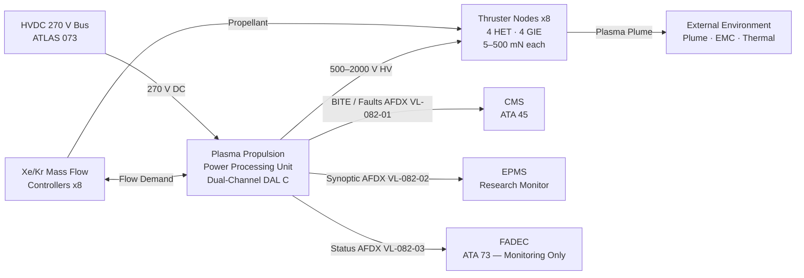
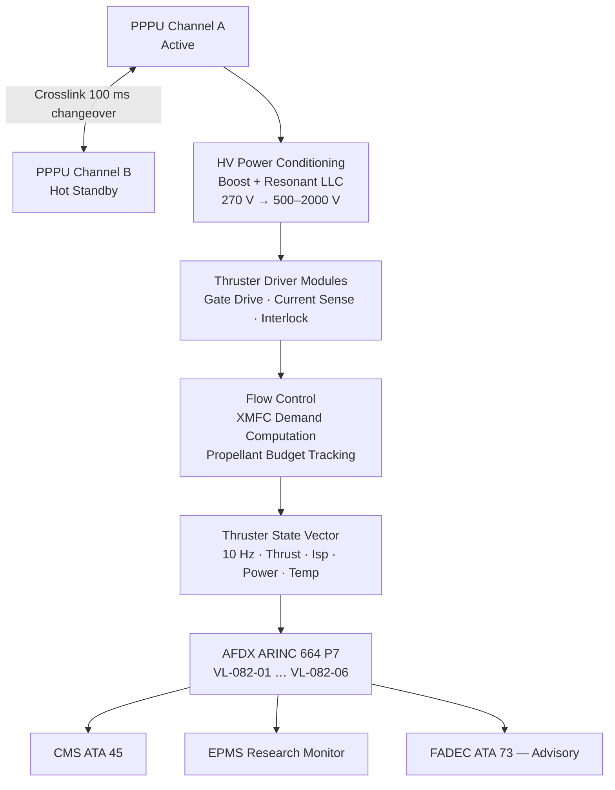

<!-- ──────────────────────────────────────────────────────────────────────────
     QATL-ATLAS-1000-ATLAS-080-089-08-082-000-PLASMA-AND-IONIC-PROPULSION-CONCEPTS-GENERAL
     ATLAS-082 (Plasma and Ionic Propulsion Concepts) · General
     programme-defined aircraft type — ATLAS Register 1000
────────────────────────────────────────────────────────────────────────────── -->

# Plasma and Ionic Propulsion Concepts — General

---

## §0 Hyperlink Policy

> All hyperlinks in this document are **relative** (five directory levels: `../../../../../`).
> Absolute URLs are forbidden. Every linked document must exist in the Q+ATLANTIDE repository
> before the link is activated. Broken links are treated as open issues and must be resolved
> before the document is promoted from `DRAFT` to `APPROVED`.

---

## §1 Purpose

This document defines the agnostic ATLAS standard-level architecture context for `Plasma and Ionic Propulsion Concepts — General`.

It describes the controlled scope, functions, interfaces, safety considerations, lifecycle traceability, and S1000D/CSDB mapping logic that programme implementations shall instantiate when this node is applicable.

This document is not a programme design baseline. Programme-specific capacities, locations, part numbers, effectivity, operating limits, maintenance references, and data module codes shall be defined only inside the applicable programme implementation branch.
## §2 Applicability

| Applicability Level | Rule |
|---|---|
| Standard taxonomy | Applies to the ATLAS node `082` |
| Programme implementation | Conditional; determined by programme architecture, trade studies, certification basis, and applicability model |
| Product configuration | Defined in the programme-specific configuration baseline |
| Effectivity | Defined in the programme CSDB / applicability layer |
| Non-applicability | Must be explicitly stated in the programme impact-study branch when excluded |
## §3 Functional Description ![DRAFT]

The programme-defined aircraft type **Plasma and Ionic Propulsion Concepts (PIPC)** programme investigates three families of electrostatic and electromagnetic thruster technologies for application within the hybrid-electric propulsion architecture:

1. **Hall-Effect Thrusters (HET)** — Cross-field ExB devices that ionise xenon or krypton propellant in an annular discharge channel and accelerate ions through an electric field balanced by an electron-trapping magnetic field. HETs provide specific impulses in the range of 1 500–3 000 s and thrust levels of 5–500 mN per unit, making them candidates for drag-reduction augmentation and auxiliary station-keeping in extended-range cruise profiles.

2. **Gridded Ion Engines (GIE)** — Electrostatic thrusters that generate a quasi-neutral plasma in a discharge chamber (RF or electron bombardment ionisation) and extract/accelerate ions through multi-grid ion optics. GIEs offer specific impulses of 2 500–10 000 s at thrust levels of 10–250 mN, providing higher efficiency at lower thrust density than HETs. The PIPC programme evaluates GIEs for ultra-low-drag boundary layer thinning at high altitude.

3. **Magnetoplasmadynamic (MPD) Thrusters** — Electromagnetic accelerators in which a self-induced or applied magnetic field interacts with the propellant discharge current to produce a Lorentz (JxB) body force on the plasma. MPD thrusters can accept a wide range of propellants (Xe, Ar, H₂, Li) and achieve thrust densities significantly higher than electrostatic devices, relevant to short-duration high-impulse manoeuvres.

All three thruster families are powered from the HVDC 270 V distribution bus (ATLAS 073) through a dedicated **Plasma Propulsion Power Processing Unit (PPPУ)** — a dual-channel controller (DO-178C DAL C / DO-254 DAL C) located in the aft avionics bay. The PPPU converts aircraft HVDC 270 V to the high-voltage (500–2 000 V) regulated DC supplies required by each thruster type, provides propellant flow control via xenon mass flow controllers (XMFC), and publishes thruster state to the aircraft CMS (ATA 45) and experimental propulsion monitoring system (EPMS) via AFDX ARINC 664 P7.

The PIPC programme operates as a **research augmentation layer** at DAL C. All receiving primary propulsion controllers (FADEC, FCCU, MCU) retain their own certified classical control loops and are not dependent on PIPC output for primary thrust authority. A PPPU fault results in plasma propulsion shutdown with no degradation of primary propulsion authority. The conceptual fleet installation provides **8 thruster nodes** (4 HET + 4 GIE, distributed across aft fuselage and aft nacelle positions) with a planned **28 S1000D data modules (DMRL)** under BREX-082-v1.

---

## §4 Functional Breakdown

| ID | Name | Description | Lead Division |
|---|---|---|---|
| F-001 | PIPC General / Overview | System scope, architecture baseline, DMRL, governing standards | Q-GREENTECH |
| F-002 | Plasma Propulsion Baseline and Scope | Mission analysis, thrust budget, Isp targets, technology selection rationale | Q-GREENTECH |
| F-003 | Ionic Propulsion Concepts and Operating Principles | GIE and HET first-principles physics, performance equations, propellant mass budget | Q-HORIZON |
| F-004 | E-Field and B-Field Acceleration Mechanisms | Ion optics grids, Hall channel ExB physics, MPD Lorentz acceleration, electrode design | Q-HPC |
| F-005 | Propellant Ionization and Plasma Generation | RF ionisation, electron bombardment, helicon antenna, discharge chamber design | Q-GREENTECH |
| F-006 | Thruster Chamber, Grid and Electrode Interfaces | Physical geometry, material selection (Mo, C-C composite, TZM), erosion life model | Q-STRUCTURES |
| F-007 | Power Processing and High-Voltage Interfaces | PPPU architecture, HV isolation, EMC zoning, HVDC 270 V interface | Q-INDUSTRY |
| F-008 | Thermal, EMC and Plume Interaction Constraints | Thermal loads, plume impingement analysis, RF emission control, shielding | Q-GREENTECH |

---

## §5 System Context — Mermaid Diagram

---

## §6 Internal Architecture — Mermaid Diagram

---

## §7 Components and LRUs

| Component | Part Number | Qty | Location | Maintenance Interval | Notes |
|---|---|---|---|---|---|
| Plasma Propulsion Power Processing Unit (PPPU) | PPPU-PN-TBD | 1 | Aft avionics bay (4-MCU) | Software update per SB; C-check BITE | Dual-channel; DO-178C DAL C; DO-254 DAL C; HVDC 270 V input |
| Hall-Effect Thruster Module (HET) | HET-PN-TBD | 4 | Aft fuselage lower quadrant (2 port, 2 stbd) | 5 000 h ceramic channel inspection; C-check neutraliser replace | Xe propellant; 1 500–3 000 s Isp; 50–500 mN per unit |
| Gridded Ion Engine Module (GIE) | GIE-PN-TBD | 4 | Aft nacelle fairing (2 per nacelle) | 8 000 h grid erosion inspection; C-check screen/accel grid replace | Xe propellant; 2 500–5 000 s Isp; 10–250 mN per unit |
| Xenon Mass Flow Controller (XMFC) | XMFC-PN-TBD | 8 | Propellant feed manifold (1 per thruster) | A-check leak check; 2 500 h calibration | 0.1–10 mg/s; ±1 % accuracy; piezo-actuated |
| High-Pressure Xenon Storage Vessel | HPXV-PN-TBD | 2 | Aft bay (port/stbd) | Annual hydrostatic proof test; 15-year life | COPV; 150 bar Xe; ATEX zone; PRV ← 165 bar |
| HV Isolation Module | HVIM-PN-TBD | 8 | Between PPPU and each thruster | C-check HiPot test (2 500 V DC, 1 min) | Galvanic isolation 2 500 V DC; EMC filter integral |
| Plasma Sensor Array (PSA) | PSA-PN-TBD | 8 | Thruster exit plane (1 per thruster) | 2 500 h probe tip replacement | Ion current density + electron temperature; Langmuir triple probe |

---

## §8 Interfaces

| Interface Type | Connected System | Protocol / Medium | Data / Function |
|---|---|---|---|
| Primary Power | HVDC 270 V bus — ATLAS 073 | HVDC cable (IRM-protected feed) | PPPU main power; up to 15 kW total plasma propulsion power |
| Maintenance / Faults | CMS — ATA 45 | AFDX ARINC 664 P7 VL-082-01 | PPPU BITE faults; thruster health log; propellant mass remaining |
| Experimental Monitor | EPMS Research Monitor | AFDX ARINC 664 P7 VL-082-02 | Full thruster state vector (10 Hz); plume diagnostics |
| Propulsion Advisory | FADEC — ATA 73 | AFDX ARINC 664 P7 VL-082-03 | Plasma propulsion status; power demand (advisory only) |
| Propellant Telemetry | XMFC-to-PPPU | CAN bus (internal, PPPU bay) | Flow rate actuals; propellant manifold pressure; XMFC health |
| Thermal | TMS — ATLAS 074 | AFDX ARINC 664 P7 VL-082-04 | PPPU heat sink temperature; thruster thermal state |
| Ground Support | PPPU-GSE-1 | USB-C 3.2 + HV test port | PPPU programming, thruster checkout, Xe fill/drain |
| Electrical Power Return | HVDC 270 V bus — ATA 24 | HVDC return cable | PPPU power return; EMC bonding |

---

## §9 Operating Modes

| Mode | Trigger | System State | Actions / Consequences |
|---|---|---|---|
| Standby | HVDC power applied; no thrust demand | PPPU powered; thrusters cold; XMFCs closed; Xe vessel isolated | BITE running; PSA on-line; AFDX heartbeat active |
| Warm-Up | Thrust demand received; PPPU enables | Xe vessel open; XMFCs ramp flow; discharge initiation sequence | 120 s warm-up before full thrust; HV ramps from 0 to operating voltage |
| Operational — Low Thrust | Thrust demand 5–50 mN | HET nodes active at partial throttle | PPPU regulates HV and flow; PSA monitors plasma; thermal model active |
| Operational — High Thrust | Thrust demand 50–500 mN | All HET nodes at full throttle; GIE nodes at partial load | PPPU power up to 12 kW total; plume interaction monitoring active |
| Research Diagnostic | EPMS commanded diagnostic mode | PSA full acquisition; Langmuir sweeps; plume camera integration | Not concurrent with high-thrust mode; 10 Hz telemetry to EPMS |
| Channel Changeover | PPPU CHA fault | CHB promoted to active within 100 ms | PPPU-CHA fault logged; thrust reduced 50 % for 2 s during changeover |
| Shutdown | Thrust demand removed or fault isolation | XMFCs close; HV ramps down in 5 s; thrusters extinguish | Xe vessel isolated; PPPU in Standby after 60 s cool-down |
| Emergency Shutdown | FIRE/ELEC emergency or HVDC bus loss | PPPU HV inhibited within 50 ms; Xe vessel PRV retained | PPPU BITE logs event; CMS fault code generated; manual reset required |

---

## §10 Performance and Budgets ![DRAFT]

| Parameter | Requirement | Target / Design Value | Status |
|---|---|---|---|
| Total thruster nodes | 8 (4 HET + 4 GIE) | 8 nodes | ![TBD] |
| Maximum total thrust | ≥ 2 N combined | 2.5 N (all HET full throttle) | ![TBD] |
| Specific impulse (HET) | ≥ 1 500 s | 2 000 s at nominal | ![TBD] |
| Specific impulse (GIE) | ≥ 2 500 s | 3 500 s at nominal | ![TBD] |
| Total power consumption | ≤ 15 kW from HVDC 270 V | 12 kW nominal; 15 kW peak | ![TBD] |
| PPPU availability | ≥ 99.9 % (research platform) | Dual-channel architecture | ![TBD] |
| PPPU channel changeover | ≤ 100 ms | 80 ms target | ![TBD] |
| HV isolation level | ≥ 2 500 V DC | 3 000 V DC tested | ![TBD] |
| Propellant budget (Xe) | ≥ 10 kg per flight test | 12 kg nominal load | ![TBD] |
| Thruster warm-up time | ≤ 180 s | 120 s target | ![TBD] |
| Plume impingement zone | No direct impingement on primary structure | Plume half-angle < 30°; exclusion zone enforced | ![TBD] |
| EMC radiated emission | Compliant IEC 60068-2-13 at platform boundary | PPPU RF filter + HV shielding | ![TBD] |

---

## §11 Safety and Certification Constraints

| Constraint | Requirement Source | Description |
|---|---|---|
| HV Personnel Safety | IEC 60479-1; CS-25 AMC 1309 | PPPU output HV rail (up to 2 000 V) must be isolated and interlocked; double-pole switch with mechanical guard; no HV accessible without LOTO |
| Xe Vessel Pressure | DOT-SP / EASA STC | COPV rated 200 bar; proof test at 300 bar; PRV set 165 bar; no Xe vessel in pressurised cabin zone |
| Plume Exclusion Zone | CS-25.1309 / structure team ICD | All primary structure, fuel lines, and pressure vessels must be outside 30° half-angle plume cone; analysis required per thruster firing condition |
| EMC | DO-160G Section 21 (RF Emission) | PPPU switching frequency and harmonics must not interfere with ATC/TCAS/ILS; shielding + filter plan in 082-060 |
| Fire / Xe Leak | CS-25.1193; ATEX 94/9/EC | Xe zone classified ATEX; leak detection sensor per manifold zone; Xe is inert but asphyxiation risk; ventilation mandatory |
| Research Phase DAL | DO-178C DAL C | PPPU software and GIE/HET firmware operated at DAL C for research phase; upgrade to DAL B required before revenue service integration |

---

## §12 Document Lineage

| Predecessor | Document ID | Notes |
|---|---|---|
| ATLAS-082 README | QATL-ATLAS-1000-ATLAS-080-089-08-082-README | Subsection index; status updated to active by this document |
| ATLAS-080 General | QATL-ATLAS-1000-ATLAS-080-089-08-080-000-QUANTUM-SENSING-FOR-PROPULSION-GENERAL | Sibling subsection — quantum sensing baseline |
| ATLAS-073 Power | QATL-ATLAS-1000-ATLAS-080-089-08-073-* | HVDC 270 V source for PPPU |
| ATLAS-074 TMS | QATL-ATLAS-1000-ATLAS-080-089-08-074-* | Thermal management — PPPU heat sink interface |

---

## §13 Open Issues

| ID | Description | Owner | Target |
|---|---|---|---|
| OI-082-001 | Propellant selection trade (Xe vs Kr): mass budget and regulatory alignment | Q-GREENTECH | Next PDR |
| OI-082-002 | Plume impingement CFD analysis against aft fuselage structural geometry | Q-STRUCTURES | Next PDR |
| OI-082-003 | EMC emission characterisation — PPPU switching harmonics vs. ATC band | Q-INDUSTRY | CDR |
| OI-082-004 | DAL C → DAL B upgrade roadmap for any revenue-service candidate thruster | Q-HORIZON | Phase 2 |
| OI-082-005 | Xe COPV ATEX certification path under EASA STC | Q-GREENTECH | Phase 2 |

---

## §14 References

| Ref | Title | Source |
|---|---|---|
| [R-001] | EASA CS-25 Amendment 27+ | EASA |
| [R-002] | DO-178C Software Considerations in Airborne Systems | RTCA |
| [R-003] | DO-254 Design Assurance Guidance for Airborne Electronic Hardware | RTCA |
| [R-004] | ECSS-E-ST-20-07C Space Engineering — Electromagnetic Compatibility | ESA/ECSS |
| [R-005] | AIAA-2003-5270 Hall-Effect Thruster Technology Review | AIAA |
| [R-006] | AIAA-2012-3915 Gridded Ion Engine Performance Assessment | AIAA |
| [R-007] | IEC 60479-1 Effects of Current on Human Beings | IEC |
| [R-008] | S1000D Issue 5.0 — Technical Publications Specification | ASD/AIA |
| [R-009] | ATLAS-073 Power Distribution (QATL-073-000) | Q+ATLANTIDE |
| [R-010] | ATLAS-074 Thermal Management (QATL-074-000) | Q+ATLANTIDE |
