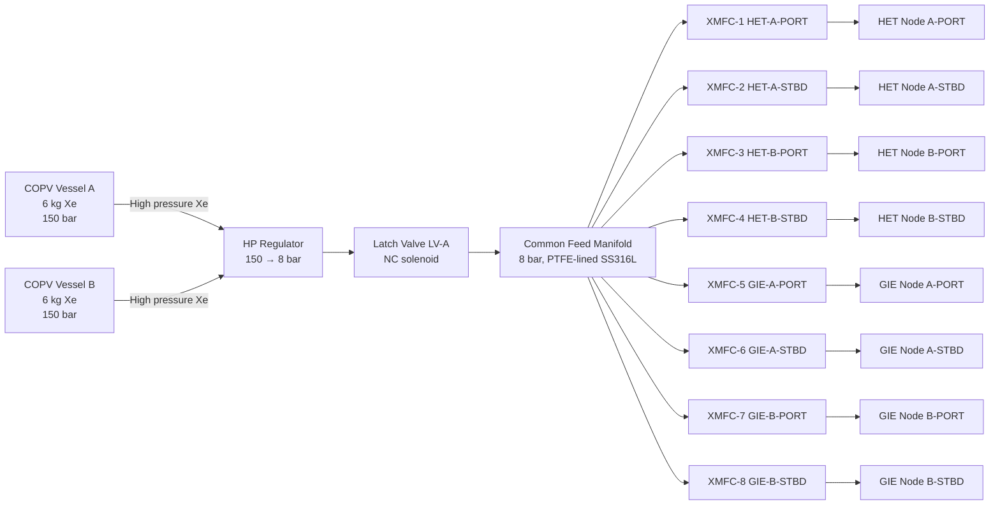

<!-- ──────────────────────────────────────────────────────────────────────────
     QATL-ATLAS-1000-ATLAS-080-089-08-082-040-PROPELLANT-IONIZATION-AND-PLASMA-GENERATION
     ATLAS-082 (Plasma and Ionic Propulsion Concepts) · Propellant Ionization and Plasma Generation
     AMPEL360E eWTW — ATLAS Register 1000
────────────────────────────────────────────────────────────────────────────── -->

# Propellant Ionization and Plasma Generation

---

## §0 Hyperlink Policy

> All hyperlinks in this document are **relative** (five directory levels: `../../../../../`).
> Absolute URLs are forbidden.

---

## §1 Purpose

ATLAS subsubject 082-040 covers the propellant selection, storage, feed system, ionisation mechanisms, and plasma generation methods used in the AMPEL360E eWTW PIPC programme. It addresses xenon and krypton propellant properties, discharge chamber ionisation techniques (electron bombardment and radiofrequency), hollow cathode neutraliser design, and the plasma parameter targets that drive thruster performance.

---

## §2 Applicability

| Parameter | Value |
|---|---|
| Aircraft Program | AMPEL360E eWTW |
| ATA reference | ATLAS-082 — 082-040 Propellant Ionization and Plasma Generation |
| Certification basis | EASA CS-25 Amdt 27+ (research ref.); ATEX Directive 2014/34/EU (Xe pressure zone) |
| S1000D SNS | 082-040-00 |

---

## §3 Propellant Selection

### 3.1 Primary Propellant: Xenon (Xe)

Xenon is the baseline propellant for the AMPEL360E eWTW PIPC programme for the following reasons:

| Property | Value | Significance |
|---|---|---|
| Atomic mass | 131.3 u | High mass → high momentum transfer per ion → reasonable thrust |
| First ionisation potential | 12.13 eV | Low → efficient electron-impact ionisation |
| Ionisation cross-section (peak) | ~70 × 10⁻²⁰ m² at ~100 eV electron energy | High → dense plasma achievable |
| Boiling point (1 atm) | −108.1 °C (165 K) | Stored as supercritical fluid at ambient temperature at > 57.6 bar |
| Critical pressure | 58.4 bar | Xe stored at 150 bar (supercritical, single phase) simplifies feed |
| Non-flammable, non-toxic | Inert noble gas | No combustion hazard; asphyxiation risk at > 30 % concentration |
| Propellant cost | ~$1 200/kg (2025 est.) | Higher than krypton but established supply chain |

### 3.2 Alternative Propellant: Krypton (Kr)

| Property | Value vs. Xenon |
|---|---|
| Atomic mass | 83.8 u (vs. 131.3) — lighter |
| First ionisation potential | 14.0 eV (vs. 12.13) — harder to ionise |
| Achievable Isp at same voltage | ~15–20 % higher (lower mass → higher exhaust velocity) |
| Propellant cost (2025 est.) | ~$300/kg (4× cheaper than Xe) |
| Storage pressure | 150 bar — similar to Xe |
| Trade-off | Higher Isp but lower ionisation efficiency → power penalty ~10–15 % |

**Decision:** Xenon is the baseline for PIPC Phase 1 (TRL 5→7). Krypton trade study is captured in OI-082-010-001 for Phase 2 assessment.

---

## §4 Propellant Storage and Feed System

### 4.1 High-Pressure Storage

| Item | Specification |
|---|---|
| Vessel type | Carbon-overwrapped pressure vessel (COPV) |
| Working pressure | 150 bar |
| Proof pressure | 225 bar (1.5× WP) |
| Burst pressure | 300 bar (2.0× WP) |
| PRV set pressure | 165 bar |
| Material (liner) | Al-6061-T6 (compatibility confirmed vs. Xe) |
| Overwrap | T800 carbon fibre / epoxy |
| Quantity | 2 vessels (1 per side of aft bay) |
| Nominal Xe load | 6 kg per vessel = 12 kg total |
| ATEX zone classification | Zone 2 (occasional Xe vapour release possible) |

### 4.2 Propellant Feed System Architecture

### 4.3 Xenon Mass Flow Controller (XMFC) Specifications

| Parameter | Value |
|---|---|
| Type | Piezoelectric-actuated MEMS thermal MFC |
| Flow range | 0.05–10 mg/s Xe |
| Accuracy | ± 1 % of full scale |
| Response time (10–90 %) | ≤ 500 ms |
| Inlet pressure | 8 bar |
| Outlet pressure | 0.5–2 bar (thruster inlet) |
| Electrical interface | PPPU CAN bus (12 V DC logic) |
| Fail-safe state | Closed on power loss (fail-closed) |

---

## §5 Ionisation Mechanisms

### 5.1 Electron Bombardment Ionisation (GIE Discharge Chamber)

The GIE discharge chamber uses a hollow cathode as the primary electron source:

1. A hollow cathode orifice plate is heated to ~ 1 200 °C (thermionic emission).
2. Emitted electrons are accelerated into the discharge chamber by the keeper electrode (+25 V above cathode).
3. Electrons collide with neutral Xe atoms, producing Xe⁺ ions via electron impact ionisation: `Xe + e⁻ → Xe⁺ + 2e⁻`
4. Ionisation efficiency (fraction of Xe converted to Xe⁺) target: ≥ 95 %.
5. Plasma parameters in GIE discharge chamber:

| Parameter | Value |
|---|---|
| Electron temperature T_e | 3–7 eV |
| Ion number density n_i | 10¹⁷–10¹⁸ m⁻³ |
| Plasma potential V_p | +5 to +15 V above screen grid |
| Neutral pressure in chamber | 0.5–2 × 10⁻² Pa |
| Xe utilisation efficiency η_m | 90–95 % |

### 5.2 RF Ionisation (Alternative GIE / RIT)

For the RF ion thruster (RIT) variant evaluated in the PIPC programme, ionisation is achieved by an RF antenna coil (13.56 MHz ISM band, 50–200 W) wound around the discharge chamber. The oscillating magnetic field induces eddy currents in the plasma electrons (inductive coupling), heating them to Te ≈ 8–15 eV and sustaining ionisation without a hollow cathode. RIT advantages: no keeper/cathode erosion in discharge region; disadvantages: lower ionisation efficiency at low flow rates.

### 5.3 Hall Thruster Ionisation (HET)

In the HET, ionisation occurs via electron-impact in the Hall current annular zone at the discharge channel exit. The trapped electrons (Ωe >> 1) sustain sufficient electron–neutral collision frequency to achieve ≥ 90 % propellant ionisation. The primary design lever is the magnetic field topology (peak B_r location relative to neutral injection point). Ionisation and acceleration zones partially overlap in the HET, unlike the fully separated zones of the GIE.

---

## §6 Hollow Cathode Neutraliser

Each thruster (HET and GIE) is paired with an external hollow cathode neutraliser that:
1. Emits electrons to neutralise the ion beam (preventing charge build-up on the aircraft)
2. Maintains the plasma beam at near-zero potential relative to aircraft ground
3. Provides keeper-discharge ignition current for HET startup

**Hollow cathode design parameters:**

| Parameter | Value |
|---|---|
| Cathode material | BaO-impregnated W porous insert |
| Operating temperature | 1 050–1 150 °C |
| Keeper voltage | +12–20 V |
| Keeper current | 0.5–1.0 A |
| Emission current capacity | 4–6 A (HET); 3–4 A (GIE) |
| Lifetime | ≥ 10 000 h (target) |
| Heater power (warm-up) | 20–30 W for 120 s |
| Propellant (cathode feed) | Xe; 0.02–0.05 mg/s |

---

## §7 Plasma Parameters Targets

| Parameter | HET (channel exit) | GIE (beam) |
|---|---|---|
| Ion beam current I_b | 8–15 A | 2–3 A |
| Ion energy E_i | 200–300 eV | 900–1 100 eV |
| Beam divergence half-angle | ≤ 20° | ≤ 15° |
| Ion energy spread ΔE_i | < 50 eV | < 20 eV |
| Double-ion fraction (Xe²⁺/Xe⁺) | < 5 % | < 3 % |
| Neutral propellant utilisation η_m | ≥ 90 % | ≥ 93 % |
| Thruster efficiency η_t | 55–65 % | 70–80 % |

---

## §8 Propellant Safety and ATEX Requirements

| Requirement | Specification |
|---|---|
| Xe leak detection | 4 zone-mounted electrochemical oxygen depletion sensors; alarm at O₂ < 18 % v/v |
| Ventilation rate | Aft bay: ≥ 6 air changes/hour (forced ventilation fan) |
| Bonding and earthing | All Xe feed components bonded to airframe ground; < 1 Ω bond resistance |
| Pressure relief | PRV set 165 bar; discharge to external vent port (non-occupied zone) |
| LOTO procedure | Xe vessel isolation valve lockout required before any maintenance within ATEX zone |
| Maximum permissible Xe concentration (maintenance) | < 1 000 ppm (oxygen-displacement risk; no toxicity) |

---

## §9 Open Issues

| ID | Description | Owner | Target |
|---|---|---|---|
| OI-082-040-001 | BaO cathode insert lifetime validation for aviation vibration environment (5–500 Hz, 5 g) | Q-GREENTECH | CDR |
| OI-082-040-002 | COPV water absorption impact on Xe purity after ground storage > 6 months | Q-INDUSTRY | PDR |
| OI-082-040-003 | Xe leak detection sensor selection — electrochemical vs. catalytic bead for aviation certification | Q-GREENTECH | PDR |
