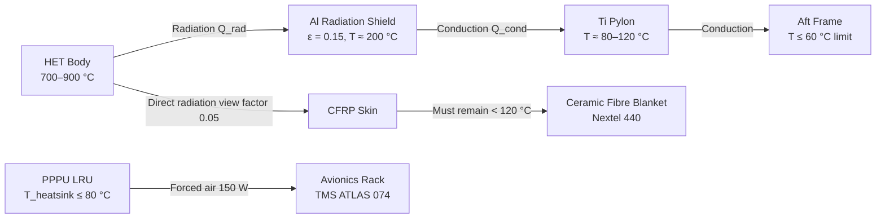
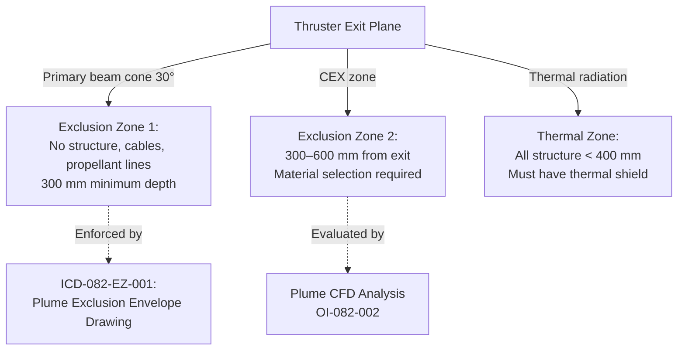

<!-- ──────────────────────────────────────────────────────────────────────────
     QATL-ATLAS-1000-ATLAS-080-089-08-082-070-THERMAL-EMC-AND-PLUME-INTERACTION-CONSTRAINTS
     ATLAS-082 (Plasma and Ionic Propulsion Concepts) · Thermal, EMC and Plume Interaction Constraints
     AMPEL360E eWTW — ATLAS Register 1000
────────────────────────────────────────────────────────────────────────────── -->

# Thermal, EMC and Plume Interaction Constraints

---

## §0 Hyperlink Policy

> All hyperlinks in this document are **relative** (five directory levels: `../../../../../`).
> Absolute URLs are forbidden.

---

## §1 Purpose

ATLAS subsubject 082-070 defines the thermal management constraints, electromagnetic compatibility (EMC) requirements, and plasma plume interaction assessment methodology for the AMPEL360E eWTW PIPC programme. It establishes the exclusion zones for plume impingement, the thermal load envelope for thruster installation, and the RF emission control strategy required to prevent interference with aircraft navigation and communication systems.

---

## §2 Applicability

| Parameter | Value |
|---|---|
| Aircraft Program | AMPEL360E eWTW |
| ATA reference | ATLAS-082 — 082-070 Thermal, EMC and Plume Interaction Constraints |
| Certification basis | EASA CS-25 Amdt 27+; DO-160G Sections 17, 18, 20, 21; CS-25.1309 (system safety) |
| S1000D SNS | 082-070-00 |

---

## §3 Thermal Constraints

### 3.1 Thruster Thermal Loads

Ion thrusters generate significant radiative and convective thermal loads on adjacent structure. The primary heat sources and their estimated flux densities are:

| Heat Source | Peak Temperature | Mechanism | Flux at 100 mm |
|---|---|---|---|
| HET discharge channel | 700–900 °C (ceramic walls) | Radiation (ε ≈ 0.8) | ≈ 6–15 W/cm² |
| HET anode | 600–800 °C (TZM) | Radiation + conduction to mount | ≈ 4–10 W/cm² |
| HET hollow cathode | 1 050–1 150 °C | Radiation (ε ≈ 0.9) | ≈ 12–20 W/cm² |
| GIE discharge chamber | 400–600 °C (Mo/BN) | Radiation | ≈ 3–8 W/cm² |
| PPPU heatsink | ≤ 80 °C | Forced-air convection | < 0.5 W/cm² |

### 3.2 Thermal Management Requirements

All primary structure within the thruster installation zones must be protected to comply with the following temperature limits:

| Structure Type | Max Allowable Temperature | Protection Method |
|---|---|---|
| CFRP aft fuselage skin | 120 °C continuous; 150 °C short-term | Ceramic fibre blanket + Al radiation shield |
| Al alloy pylon | 200 °C continuous | Al thermal shield + Ti standoffs |
| HV cables (PTFE) | 200 °C | PTFE sleeving; minimum 50 mm from thruster body |
| COPV Xe vessel | 60 °C (pressure rise limitation) | Insulation blanket + temperature alarm TH-082-01 |
| Control cables | 85 °C (ETFE) | 100 mm separation + conduit |

### 3.3 Thermal Model (Mermaid)

---

## §4 Plasma Plume Characteristics and Interaction

### 4.1 Plume Physical Properties

A Xe ion beam at typical HET operating conditions forms a diverging plasma plume with the following characteristics:

| Parameter | HET (500 mN) | GIE (250 mN) |
|---|---|---|
| Beam half-angle (1/e ion current density) | 18–25° | 10–15° |
| Core ion energy | 250–350 eV | 900–1 200 eV |
| Charge-exchange (CEX) ion energy | < 20 eV (isotropic) | < 10 eV |
| Peak ion current density at 100 mm | 5–15 mA/cm² | 2–8 mA/cm² |
| Electron temperature in plume (T_e) | 1–3 eV | 0.5–2 eV |
| Neutral Xe pressure in plume (at 200 mm) | 10⁻⁴–10⁻³ Pa | 10⁻⁵–10⁻⁴ Pa |

### 4.2 Plume Impingement Exclusion Zone

**Primary Plume Zone (direct ion beam):** All primary structural surfaces, HV cables, Xe feed tubes, and elastomeric isolators must be outside the 30° half-angle direct ion beam cone centred on each thruster thrust vector axis. Within this zone, ion bombardment at energies > 200 eV causes significant sputtering of most metallic and polymeric materials.

**Charge-Exchange (CEX) Plume Zone:** CEX ions are created by resonant charge exchange between fast beam ions and slow background neutral Xe. CEX ions have low energy (< 20 eV) but are distributed nearly isotropically. CEX ion fluxes at > 50 mA/cm² sustained over > 1 000 h cause measurable sputtering of Mo and Al (Y_sp ~ 0.1–0.5 atoms/ion at 20 eV). All surfaces within 400 mm of the thruster exit plane must be evaluated for CEX flux.

**Plume-Induced Contamination:** Sputtered material from thruster grids, channel walls, and exposed structure deposits on optical windows, sensor apertures, and solar cells (if any). All optical sensors within 1 m of any thruster must have contamination cover provisions.

### 4.3 Plume Exclusion Zone Definition (Airframe Level)

---

## §5 EMC Requirements and Constraints

### 5.1 RF Emission Control

| Source | Emission Type | Frequency | Control Method |
|---|---|---|---|
| PPPU LLC converter | Conducted + radiated, harmonic-rich | Fundamental 100 kHz; harmonics to 30 MHz | EMC input filter 40 dB; PPPU shielded enclosure |
| DBD HV AC generator | Conducted + radiated | 5–30 kHz fundamental; harmonics | ISM band lock 13.56 MHz; cable shielding |
| HET Hall current oscillation | Radiated (broadband) | 1–100 kHz (breathing mode, ionisation wave) | PPPU shielded HV output cable |
| GIE RF ionisation source | Radiated (discrete) | 13.56 MHz ± harmonics | RF enclosure around discharge chamber |

**Protected avionic frequency bands (must not exceed CISPR 22 Class B limits):**

| System | Protected Band |
|---|---|
| VHF COM | 118–137 MHz |
| VHF NAV / ILS / VOR | 108–118 MHz |
| ATC/TCAS | 1 030 / 1 090 MHz |
| GPS L1/L2 | 1 575.42 / 1 227.6 MHz |
| SATCOM | 1.5–1.6 GHz |
| ADS-B | 1 090 MHz |

### 5.2 Magnetic Field Constraints

The HET magnetic circuit produces a stray field outside the thruster body. At 300 mm from the thruster centreline, the expected stray field B < 0.5 mT (within 1 mT limit at avionics equipment level per DO-160G Section 15). Permanent magnets (SmCo, if used in magnetic circuit) generate residual fields after power-off; thruster removal and storage must account for 50 mT residual at magnet surface.

### 5.3 Plasma RF Noise Injection

Plasma discharge processes in both HET and GIE produce broadband RF noise (thermal noise + ionisation oscillations). This noise is coupled through HV cables to PPPU outputs. The PPPU output filter must provide ≥ 20 dB attenuation between 10 kHz and 30 MHz on all HV rails before the signal reaches the aircraft HVDC 270 V bus. Measurement baseline to be established during PPU EMC qualification per DO-160G Section 21.

---

## §6 Environmental Constraints at Altitude

At FL 350 (cruise altitude), ambient pressure is ≈ 24 kPa (240 mbar), significantly reducing air convective cooling effectiveness. Thermal management calculations must use FL 350 ambient conditions for worst-case PPPU heatsink sizing. Plume expansion is also greater at altitude (mean free path >> thruster dimensions), increasing plume divergence to 30–35° at FL 350 vs. 18–25° at sea level — exclusion zones must be re-evaluated at FL 350.

---

## §7 Alarm and Alert Thresholds

| Parameter | Sensor | Advisory Threshold | Warning Threshold | Action |
|---|---|---|---|---|
| Thruster mount structure temperature | TH-082-01 (PT100) | 100 °C | 130 °C | Advisory: reduce throttle; Warning: shutdown affected thruster |
| Xe vessel temperature | TH-082-02 (PT100) | 50 °C | 60 °C | Advisory: check Xe cooling; Warning: close Xe vessel valve |
| PPPU heatsink temperature | TH-082-03 (NTC) | 70 °C | 80 °C | Advisory: increase rack ventilation; Warning: PPPU protective shutdown |
| EM field at avionics bay (stray) | MAG-082-01 (Hall probe) | 0.5 mT | 1.0 mT | Advisory: thruster current check; Warning: PPPU magnetic overcurrent fault |

---

## §8 Open Issues

| ID | Description | Owner | Target |
|---|---|---|---|
| OI-082-070-001 | Full plume CFD at FL 350 conditions: beam divergence and CEX flux at aft structure (open from OI-082-002) | Q-STRUCTURES | PDR |
| OI-082-070-002 | PPPU EMC test plan against DO-160G Section 21 — test facility identified; schedule coordination needed | Q-INDUSTRY | CDR |
| OI-082-070-003 | DBD HV AC cable routing plan finalisation vs. GPS/TCAS antenna proximity (from OI-082-060-003) | Q-INDUSTRY | PDR |
