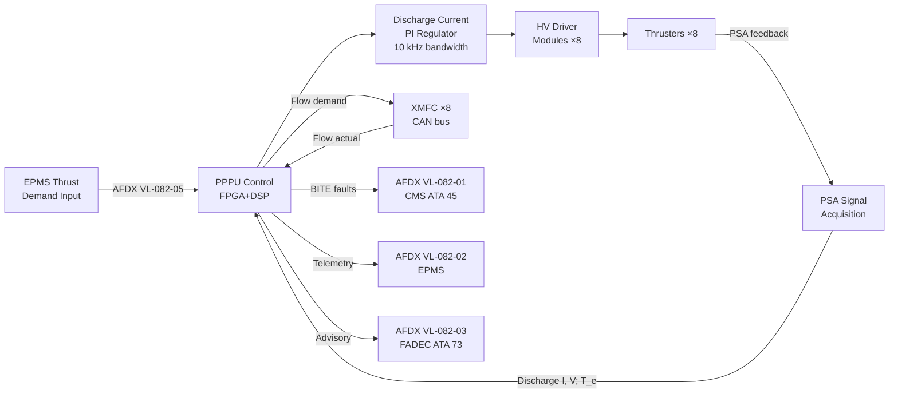

<!-- ──────────────────────────────────────────────────────────────────────────
     QATL-ATLAS-1000-ATLAS-080-089-08-082-080-PLASMA-IONIC-MONITORING-DIAGNOSTICS-AND-CONTROL-INTERFACES
     ATLAS-082 (Plasma and Ionic Propulsion Concepts) · Monitoring, Diagnostics and Control Interfaces
     AMPEL360E eWTW — ATLAS Register 1000
────────────────────────────────────────────────────────────────────────────── -->

# Plasma/Ionic Monitoring, Diagnostics and Control Interfaces

---

## §0 Hyperlink Policy

> All hyperlinks in this document are **relative** (five directory levels: `../../../../../`).
> Absolute URLs are forbidden.

---

## §1 Purpose

ATLAS subsubject 082-080 defines the sensor network, diagnostic instrumentation, control interfaces, BITE architecture, and data management provisions for the AMPEL360E eWTW PIPC programme. It covers the Plasma Sensor Array (PSA) per thruster, PPPU BITE architecture, AFDX virtual link assignments, EPMS data acquisition, FADEC advisory interface, and the CMS fault code set for plasma propulsion.

---

## §2 Applicability

| Parameter | Value |
|---|---|
| Aircraft Program | AMPEL360E eWTW |
| ATA reference | ATLAS-082 — 082-080 Plasma/Ionic Monitoring, Diagnostics and Control Interfaces |
| Certification basis | EASA CS-25 Amdt 27+; DO-178C DAL C; DO-160G; S1000D Issue 5.0 |
| S1000D SNS | 082-080-00 |

---

## §3 Sensor Network

### 3.1 Plasma Sensor Array (PSA)

Each thruster node (8 total) is equipped with a co-located Plasma Sensor Array (PSA) providing in-situ plasma diagnostics:

| Sensor | Type | Measured Parameter | Range | Accuracy |
|---|---|---|---|---|
| Langmuir probe (triple) | Electrostatic probe | Ion saturation current, T_e, n_e | 10¹⁵–10¹⁹ m⁻³; 0.5–20 eV | ± 10 % (plasma parameters) |
| Ion current density probe | Faraday cup | Ion current density in beam | 0.01–50 mA/cm² | ± 5 % |
| Discharge current sensor | Hall-effect clamp (non-contact) | HET/GIE discharge current | 0–25 A DC | ± 0.2 A |
| Discharge voltage monitor | Precision divider (3 000:1) | HET anode or GIE screen voltage | 0–2 500 V | ± 2 V |
| Anode/channel temperature | K-type thermocouple (embedded) | HET anode and channel outer wall | 0–1 200 °C | ± 5 °C |
| Cathode temperature | K-type thermocouple | Hollow cathode body | 500–1 300 °C | ± 10 °C |
| Xe flow actual | XMFC internal RTD bridge | Xe mass flow rate | 0.01–10 mg/s | ± 1 % FS |
| Xe manifold pressure | Piezoresistive absolute | Feed manifold pressure | 0–10 bar | ± 0.02 bar |

### 3.2 Supporting Platform Sensors

| Sensor ID | Type | Location | Measured Parameter |
|---|---|---|---|
| TH-082-01 | PT100 RTD | HET mount pylon | Mount structure temperature |
| TH-082-02 | PT100 RTD | Xe COPV vessel | Xe vessel skin temperature |
| TH-082-03 | NTC thermistor | PPPU heatsink | PPPU internal thermal state |
| MAG-082-01 | Hall probe sensor | Aft avionics bay bulkhead | Stray magnetic field (PPPU HET magnet circuit) |
| PRS-082-01 | Piezoresistive | HP Xe supply line (150 bar) | COPV supply pressure |
| LKD-082-01..04 | Electrochemical O₂ sensor | 4 zones in aft bay | O₂ depletion (Xe leak detection) |

---

## §4 PPPU BITE Architecture

### 4.1 BITE Coverage

The PPPU implements a Built-In Test Equipment (BITE) function covering ≥ 95 % of all detectable PPPU failure modes. BITE operates at three levels:

| BITE Level | Trigger | Coverage |
|---|---|---|
| Power-On Self Test (POST) | PPPU power-up | HV rail continuity; FPGA CRC; signal I/O discrete check; DC-DC converter pre-charge |
| Continuous Built-In Test (CBIT) | In-operation, 10 Hz | Discharge current monitoring (overcurrent/undercurrent); Xe flow deviation; temperature alarm; HV rail deviation > 5 %; CAN comms health |
| Maintenance BITE | GSE-commanded or CMS request | Full HV HiPot simulation (no actual HV); thruster characterisation sweep; grid conductance check |

### 4.2 BITE Fault Code Set

| Fault Code | Description | Severity | Action |
|---|---|---|---|
| PPPU-082-001 | PPPU Channel A loss | Warning | Changeover to Channel B; CMS alert |
| PPPU-082-002 | PPPU Channel B loss | Caution | Monitor Channel A; schedule maintenance |
| PPPU-082-003 | HET discharge overcurrent (I > 110 % nominal) | Warning | Auto-shutdown affected HET within 10 µs |
| PPPU-082-004 | GIE screen voltage deviation > 5 % | Caution | Log and alert; thrust reduced |
| PPPU-082-005 | Xe flow deviation > 10 % commanded | Caution | Log and alert; XMFC check at next opportunity |
| PPPU-082-006 | Xe manifold pressure low (< 2 bar) | Warning | Close Xe vessel SOV; shutdown all thrusters |
| PPPU-082-007 | Mount temperature TH-082-01 ≥ 130 °C | Warning | Shutdown affected thruster; alert crew |
| PPPU-082-008 | Xe vessel temperature TH-082-02 ≥ 60 °C | Warning | Close Xe vessel; alert crew |
| PPPU-082-009 | Xe leak detected (LKD-082-xx < 18 % O₂) | Emergency | Immediate Xe isolation; alert crew; activate ventilation |
| PPPU-082-010 | HV cable insulation fault (leakage > 1 mA) | Warning | Inhibit affected HV rail; isolate thruster |
| PPPU-082-011 | Hollow cathode temperature out of range | Caution | Check cathode heater; reduce thrust |
| CAT-082-HC | Hollow cathode depletion (life model) | Maintenance | Schedule cathode replacement at next C-check |
| GIE-082-GRID | GIE accel grid life limit reached | Maintenance | Schedule grid replacement at next C-check |

---

## §5 Control Interfaces

### 5.1 PPPU Internal Control Loop

### 5.2 Thrust Demand Interface

Thrust demand is generated by the EPMS research monitor (not by the flight management system in research phase). The EPMS sends a normalised thrust demand signal (0.0–1.0 per thruster) via AFDX VL-082-05 at 5 Hz. The PPPU translates demand to discharge current set-point using a throttle map characterised during ground testing.

In future operational phase (post-Phase 2 certification upgrade), thrust demand may be integrated with the FADEC autothrottle via VL-082-03. In research phase, FADEC receives only a status advisory (no demand input from FADEC to PPPU).

### 5.3 DBD Actuator Control

DBD zone activation is commanded independently from thrust demand via AFDX VL-082-06 (EPMS → PPPU DBD controller). Zones 1–8 can be activated/deactivated individually. Zone power level is controlled by PPPU HV AC amplitude adjustment (0–15 kV range). Zone current monitoring confirms actuator continuity.

---

## §6 AFDX Virtual Link Assignments

| VL ID | Direction | Source | Destination | Content | Bandwidth |
|---|---|---|---|---|---|
| VL-082-01 | PPPU → CMS | PPPU | CMS ATA 45 | BITE faults, propellant mass, system health | 100 kbps |
| VL-082-02 | PPPU → EPMS | PPPU | EPMS | Full telemetry (10 Hz): thrust, Isp, power, plasma params | 500 kbps |
| VL-082-03 | PPPU → FADEC | PPPU | FADEC ATA 73 | Status advisory: plasma system on/off, thrust increment | 10 kbps |
| VL-082-04 | PPPU → TMS | PPPU | TMS ATLAS 074 | PPPU heatsink temp, thruster mount temp | 10 kbps |
| VL-082-05 | EPMS → PPPU | EPMS | PPPU | Thrust demand (research phase) | 10 kbps |
| VL-082-06 | EPMS → PPPU | EPMS | PPPU | DBD zone activation commands | 10 kbps |

---

## §7 CMS Maintenance Interface

The PPPU publishes a structured maintenance data package to the CMS (ATA 45) at 1 Hz over VL-082-01. The package includes:

| Data Item | Description |
|---|---|
| System status | PIPC on/off; PPPU channel A/B active; fault count |
| Propellant remaining | Xe mass (kg) per COPV vessel (calculated from cumulative XMFC integral) |
| Thruster life hours | Cumulative operating hours per thruster node |
| Erosion life index | Channel erosion estimate (% of life consumed) per HET node |
| Grid life index | Accel grid erosion estimate (% of life consumed) per GIE node |
| Cathode life index | Estimated remaining life per hollow cathode (% of 10 000 h) |
| Last BITE result | POST result code; CBIT fault history (last 50 events) |
| Maintenance alerts | Active CAT-082-HC and GIE-082-GRID flags |

---

## §8 EPMS Research Data Acquisition

The Experimental Propulsion Monitoring System (EPMS) acquires research-grade telemetry from the PPPU at 10 Hz via VL-082-02. In addition, dedicated research instrumentation is installed for flight test phases:

| Instrument | Location | Data |
|---|---|---|
| Retarding Potential Analyser (RPA) | Plume zone, 200 mm from HET exit | Ion energy distribution function (IEDF) |
| Faraday probe array (3 probes) | Plume field, fixed ring at 300 mm from exit | Spatial beam current density map |
| High-speed camera (UV/visible) | Aft fairing viewport | Plume luminescence, cathode spot imaging |
| Thrust balance (reaction) | HET structural mount (strain gauge bridge) | Direct thrust measurement ± 5 mN resolution |

EPMS data is stored to onboard SSD (512 GB) and downlinked via SATCOM after each flight test segment. Retention period: 5 years minimum.

---

## §9 Open Issues

| ID | Description | Owner | Target |
|---|---|---|---|
| OI-082-080-001 | Retarding Potential Analyser (RPA) certification as flight test instrumentation under EASA experimental permit | Q-HORIZON | Phase 2 |
| OI-082-080-002 | EPMS AFDX VL bandwidth validation — 500 kbps telemetry vs. AFDX switch capacity at aft bay | Q-HPC | CDR |
| OI-082-080-003 | CMS fault code integration with airline MRO database format — mapping to ATA iSpec 2200 structure | Q-INDUSTRY | Phase 2 |
