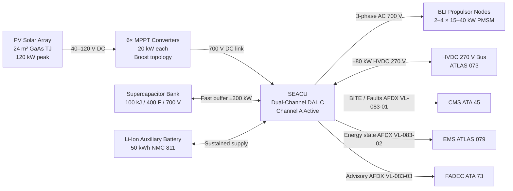
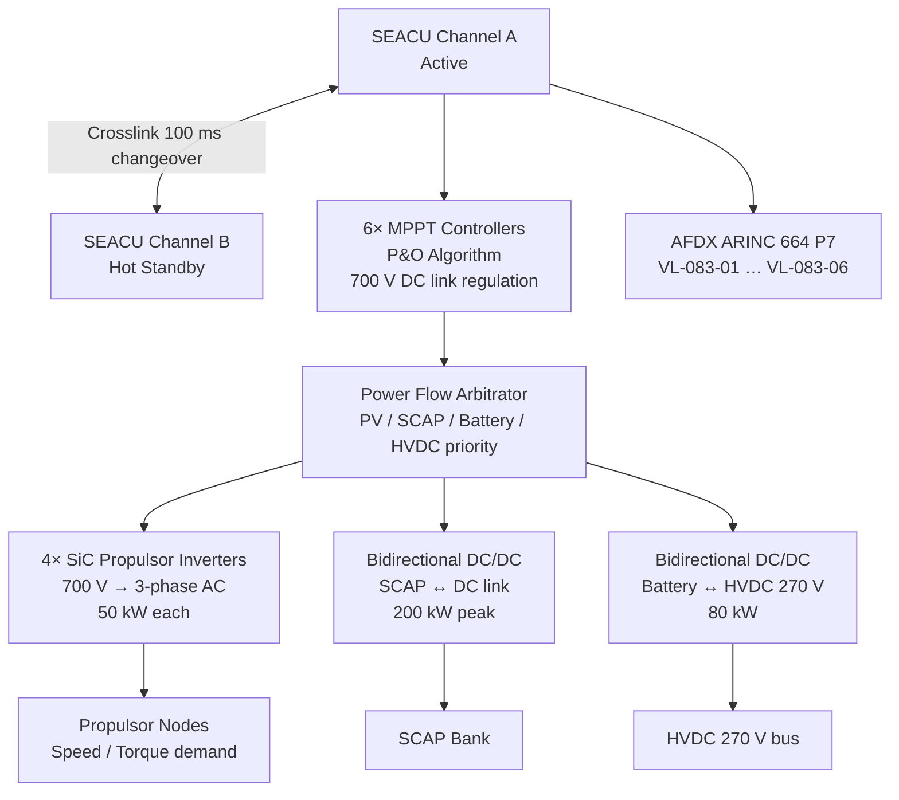

<!-- ──────────────────────────────────────────────────────────────────────────
     QATL-ATLAS-1000-ATLAS-080-089-08-083-000-SOLAR-ELECTRIC-AUXILIARY-GENERAL
     ATLAS-083 (Solar-Electric Auxiliary) · General
     AMPEL360E eWTW — ATLAS Register 1000
────────────────────────────────────────────────────────────────────────────── -->

# Solar-Electric Auxiliary — General

---

## §0 Hyperlink Policy

> All hyperlinks in this document are **relative** (five directory levels: `../../../../../`).
> Absolute URLs are forbidden. Every linked document must exist in the Q+ATLANTIDE repository
> before the link is activated. Broken links are treated as open issues and must be resolved
> before the document is promoted from `DRAFT` to `APPROVED`.

---

## §1 Purpose

ATLAS subsubject 083-000 establishes the general scope, top-level architecture, and governing standards for the Solar-Electric Auxiliary (SEA) system of the AMPEL360E eWTW. This document is the apex reference for all subordinate subsubject documents (083-010 through 083-090).

The AMPEL360E eWTW integrates a **Solar-Electric Auxiliary (SEA)** system that harvests photovoltaic (PV) energy from conformal GaAs triple-junction solar arrays embedded in the upper fuselage and wing skin surfaces. The harvested energy supplements the aircraft HVDC 270 V main bus for auxiliary propulsion purposes — driving boundary-layer-ingestion (BLI) fan propulsors and distributed leading-edge fans — and provides an emergency power reserve independent of the main turbofan generator chain.

All subsubject documents (083-010 through 083-090) are subordinate to this general baseline and inherit its governance class, Q-Division authority, and S1000D CSDB affiliation.

---

## §2 Applicability

| Parameter | Value |
|---|---|
| Aircraft Program | AMPEL360E eWTW |
| ATA reference | ATLAS-083 (Solar-Electric Auxiliary) — 083-000 General |
| Certification basis | EASA CS-25 Amdt 27+ (research ref.); DO-178C DAL C (concept phase); DO-254 DAL C; DO-160G (environmental); IEC 62109-1 (PV power converter safety) |
| S1000D SNS | 083-000-00 |

---

## §3 Functional Description ![DRAFT]

The AMPEL360E eWTW **Solar-Electric Auxiliary (SEA)** system comprises four integrated subsystems:

1. **Photovoltaic (PV) Solar Array** — GaAs triple-junction cells laminated into CFRP skin panels covering the upper fuselage crown (8 m²), wing upper skin (14 m²), and winglet panels (2 m²), yielding a total active area of **24 m²**. At FL350 in clear sky conditions, incident irradiance reaches 1 350 W/m² and the array delivers a **peak harvest of 120 kW** at standard test condition (STC) efficiency of 31 %. Six independent maximum-power-point tracking (MPPT) converters (20 kW each) extract maximum power from each array zone, compensating for partial shading, cell temperature variation, and incidence angle changes during manoeuvre.

2. **Dual-Tier Energy Storage Subsystem** — A **supercapacitor bank (SCAP)** of 100 kJ / 400 F / 700 V handles fast transient buffering (±200 kW peak for up to 0.5 s), absorbing propulsor start surges and regenerative capture peaks. A **50 kWh Li-Ion auxiliary battery subset** (NMC 811, dedicated BMS channel, subset of the ATLAS 072 main battery pack) provides sustained auxiliary power during cloud occlusion, night operation, or emergency scenarios.

3. **Solar-Electric Auxiliary Controller Unit (SEACU)** — A dual-channel controller (DO-178C DAL C / DO-254 DAL C) located in the forward avionics bay (4-MCU). The SEACU hosts six MPPT algorithms, power flow arbitration between PV, SCAP and battery, bidirectional DC/DC interfaces to the HVDC 270 V main bus (ATLAS 073), and propulsor inverter command outputs. Channel A is active; Channel B is hot-standby with automatic 100 ms changeover. The SEACU publishes the full system state to the CMS (ATA 45) and Energy Management System (ATLAS 079) via AFDX ARINC 664 P7.

4. **Auxiliary Electric Propulsor Nodes** — 2–4 BLI fan units (15–40 kW each, permanent-magnet synchronous motors, PMSM) installed at the aft fuselage BLI duct intake. At cruise (M 0.78, FL350) the BLI propulsors re-energise the momentum-deficient fuselage boundary layer, delivering an estimated **8 % propulsive efficiency improvement** relative to free-stream podded fans of equivalent thrust.

The SEA system is a **research augmentation layer** operating at DAL C. All primary propulsion controllers (FADEC, FCCU) retain their certified control loops and are not dependent on SEA output for primary thrust. A complete SEA failure results in graceful shutdown with no degradation of primary propulsion authority. The system has **30 planned S1000D Data Modules (DMRL)** under **BREX-083-v1**.

---

## §4 Functional Breakdown

| ID | Name | Description | Lead Division |
|---|---|---|---|
| F-001 | SEA General / Overview | System scope, architecture baseline, DMRL, governing standards | Q-GREENTECH |
| F-002 | SEA Baseline and Scope | Mission trade space, power targets, technology selection rationale | Q-GREENTECH |
| F-003 | Solar Array Integration | PV panel area, cell type, laminate ICD, MPPT architecture, harvest model | Q-STRUCTURES |
| F-004 | Energy Storage and Buffering | SCAP bank, Li-Ion battery subset, energy arbitration, SoC/SoH management | Q-GREENTECH |
| F-005 | Power Conditioning and Distribution | MPPT converters, bidirectional DC/DC, SiC propulsor inverters, HVDC 270 V bus tie | Q-INDUSTRY |
| F-006 | Auxiliary Electric Propulsor Concepts | BLI fan, distributed leading-edge fan, winglet pusher pod — trade study | Q-GREENTECH |
| F-007 | Emergency and Degraded Mode Auxiliary Power | 5 degraded modes, FMEA, channel failover, CS-25.1309 compliance | Q-GREENTECH |
| F-008 | Airframe Integration, Thermal and Structural Constraints | PV laminate ICD, BLI duct structure, SiC thermal budget, weight allocation | Q-STRUCTURES |
| F-009 | SEA Monitoring, Diagnostics and Control Interfaces | BITE, AFDX VL mapping, CMS fault codes, MPPT control loop, GSE | Q-HPC |
| F-010 | S1000D / CSDB Mapping and Traceability | DMRL 30 DMs, BREX-083-v1, ICN registry, milestones | Q-DATAGOV |

---

## §5 System Context — Mermaid Diagram

---

## §6 Internal Architecture — Mermaid Diagram

---

## §7 Components and LRUs

| Component | Part Number | Qty | Location | Maintenance Interval | Notes |
|---|---|---|---|---|---|
| Solar-Electric Auxiliary Controller Unit (SEACU) | SEACU-PN-TBD | 1 | Forward avionics bay (4-MCU) | Software update per SB; C-check BITE | Dual-channel DAL C; DO-178C / DO-254; HVDC 270 V bus tie |
| GaAs Triple-Junction PV Panel — Fuselage Crown | PVFC-PN-TBD | 12 | Upper fuselage crown (8 m²) | B-check visual inspection; C-check EL imaging | η = 31 % STC; laminated CFRP sandwich |
| GaAs Triple-Junction PV Panel — Wing Upper Skin | PVWS-PN-TBD | 24 | Wing upper skin (14 m²) | B-check visual; C-check EL imaging | Aerodynamic step ≤ 0.5 mm |
| GaAs Triple-Junction PV Panel — Winglet | PVWL-PN-TBD | 4 | Winglet surfaces (2 m²) | B-check visual; C-check EL imaging | — |
| MPPT Converter Module | MPPTM-PN-TBD | 6 | Forward equipment bay | A-check functional test; C-check full | 20 kW each; boost topology; 40–120 V → 700 V |
| Supercapacitor Bank (SCAP) | SCAP-PN-TBD | 1 | Under-floor centre bay | 2 500 h capacitance check; C-check full | 100 kJ; 400 F; 700 V; >1 M cycle life |
| Li-Ion Auxiliary Battery Subset | LIAB-PN-TBD | 1 | Aft equipment bay | Per ATLAS 072 BMS schedule | 50 kWh NMC 811; dedicated BMS channel; Novec 1230 TR suppression |
| BLI Propulsor Node (PMSM + Fan) | BLIP-PN-TBD | 2–4 | Aft fuselage BLI duct | 2 500 h bearing inspection; C-check full | 15–40 kW PMSM; direct drive; folding stator vanes |
| SiC Propulsor Inverter | SIPCI-PN-TBD | 4 | Adjacent to SEACU bay | C-check thermal paste; HiPot 1 500 V | 50 kW; SiC MOSFET; 700 V DC → 3-phase AC |
| DC Link Capacitor Bank | DCLC-PN-TBD | 1 | SEACU bay | C-check ESR check | 700 V; 5 mF film capacitor |

---

## §8 Interfaces

| Interface Type | Connected System | Protocol / Medium | Data / Function |
|---|---|---|---|
| PV Power Input | PV Solar Arrays (24 m²) | MPPT input cables 40–120 V DC | Solar energy harvest; 120 kW peak |
| Main Bus Tie | HVDC 270 V bus — ATLAS 073 | HVDC cable (IRM-protected bidirectional) | Export surplus solar / import deficit; ±80 kW |
| Energy Management | EMS — ATLAS 079 | AFDX ARINC 664 P7 VL-083-02 | SEACU energy state, SoC, power demand forecast |
| Propulsion Advisory | FADEC — ATA 73 | AFDX ARINC 664 P7 VL-083-03 | SEA auxiliary thrust status (advisory only) |
| Maintenance / Faults | CMS — ATA 45 | AFDX ARINC 664 P7 VL-083-01 | SEACU BITE faults, PV string health, SCAP/battery state |
| Research Data | EPMS Research Monitor | AFDX ARINC 664 P7 VL-083-04 | Full state vector 10 Hz; irradiance model; propulsor efficiency |
| Thermal | TMS — ATLAS 074 | AFDX ARINC 664 P7 VL-083-05 | SEACU cold plate temperature; battery thermal state |
| Ground Support | SEACU-GSE-1 | USB-C 3.2 + Ethernet 1000BASE-T | SEACU programming, PV string test, SCAP drain/charge |

---

## §9 Operating Modes

| Mode | Trigger | System State | Actions / Consequences |
|---|---|---|---|
| Standby | HVDC power applied; no solar or propulsion demand | SEACU powered; MPPT tracking idle; propulsors cold | BITE running; AFDX heartbeat; SCAP at resting voltage |
| Solar Harvest | Irradiance > 200 W/m²; no propulsion demand | MPPT active; excess power exported to HVDC 270 V bus | Up to 120 kW exported; SCAP fully charged; battery topped up |
| Solar-Augmented Cruise | Propulsion demand received; solar available | MPPT + SCAP + battery combined → propulsors | BLI propulsors at demand; surplus to HVDC 270 V bus |
| Battery-Only Cruise | No solar (cloud/night); battery SoC > 20 % | SCAP + battery → propulsors at 40 % throttle | 50 kWh sustains 30 min at 40 kW total propulsor output |
| Emergency Backup Power | Primary generator failure | SEA feeds HVDC 270 V bus up to 80 kW from battery | Non-propulsion loads prioritised; propulsors shutdown if bus demand > 80 kW |
| Channel Changeover | SEACU Channel A fault | Channel B promoted active within 100 ms | Propulsor thrust reduced 50 % for 2 s during changeover; fault logged |
| Regenerative Capture | Propulsor motoring (descent / deceleration) | Propulsor PMSM in generator mode | Regenerated energy → SCAP first, then battery; up to 30 kW captured |
| Emergency Shutdown | FIRE or ELEC emergency | SEACU inhibited within 50 ms; PV arrays isolated | Contactors open; SCAP bleed resistor active; manual reset required |

---

## §10 Performance and Budgets ![DRAFT]

| Parameter | Requirement | Target / Design Value | Status |
|---|---|---|---|
| PV array total area | ≥ 20 m² | 24 m² (8+14+2) | ![TBD] |
| PV cell efficiency (STC) | ≥ 28 % | 31 % GaAs triple-junction | ![TBD] |
| Peak solar harvest (FL350 clear sky) | ≥ 100 kW | 120 kW | ![TBD] |
| MPPT channels | ≥ 4 | 6 × 20 kW | ![TBD] |
| MPPT efficiency | ≥ 97 % | 98 % target | ![TBD] |
| SCAP energy | ≥ 80 kJ | 100 kJ / 400 F / 700 V | ![TBD] |
| SCAP peak power | ≥ 150 kW / 0.5 s | 200 kW / 0.5 s | ![TBD] |
| Li-Ion battery subset capacity | ≥ 40 kWh | 50 kWh NMC 811 | ![TBD] |
| HVDC 270 V bus tie power | ±50 kW min | ±80 kW bidirectional | ![TBD] |
| BLI propulsor count | 2–4 | 2 (growth to 4) | ![TBD] |
| BLI propulsor power per node | 15–40 kW | 40 kW per node | ![TBD] |
| Propulsive efficiency improvement (BLI) | ≥ 5 % | 8 % (CFD estimate) | ![TBD] |
| SEACU channel changeover time | ≤ 100 ms | 80 ms target | ![TBD] |
| Total SEA structural weight addition | ≤ 200 kg | 180 kg target | ![TBD] |

---

## §11 Safety and Certification Constraints

| Constraint | Requirement Source | Description |
|---|---|---|
| PV Open-Circuit Voltage | IEC 62109-1; DO-160G Section 22 | PV strings present up to 600 V DC in any ambient light including hangar; opaque blanket required before connector handling; SEACU SOLAR ARRAY ISOLATED indicator must confirm 0 A string current |
| SCAP Pre-Access Discharge | IEC 62109-1; CS-25.1309 | SCAP retains up to 700 V DC after shutdown; bleeder circuit requires ≥ 60 s; SEACU SCAP DISCHARGED indicator < 50 V must be confirmed before any SCAP terminal access |
| BLI Fan Exclusion Zone | CS-25.1309; structural team ICD | 2 m radius from each propulsor intake and exhaust must be clear of personnel and loose objects during on-aircraft run-up; SEACU GSE BLI FAN ZONE CLEAR confirmation mandatory |
| Battery Thermal Runaway | CS-25.981 (analogous); DO-160G Section 25 | 50 kWh subset has Novec 1230 TR suppression; BMS over-temperature relay isolates pack within 200 ms of Tj > 80 °C |
| Lightning Strike | DO-160G Section 22 | PV panels and MPPT inputs bonded to airframe; surge arrestors rated 10 kA (8/20 µs) on each MPPT input string |
| Research Phase DAL | DO-178C DAL C | SEACU software and propulsor firmware at DAL C for research phase; DAL B upgrade required before revenue service |

---

## §12 Document Lineage

| Predecessor | Document ID | Notes |
|---|---|---|
| ATLAS-083 README | QATL-ATLAS-1000-ATLAS-080-089-08-083-README | Subsection index; status updated to active by this document |
| ATLAS-079 EMS | QATL-ATLAS-1000-ATLAS-080-089-07-079-000-* | Energy Management System — primary energy dispatch interface |
| ATLAS-073 Power | QATL-ATLAS-1000-ATLAS-080-089-08-073-* | HVDC 270 V bus — SEA bus tie interface |
| ATLAS-072 Battery | QATL-ATLAS-1000-ATLAS-080-089-07-072-* | Li-Ion battery main pack — 50 kWh subset |
| ATLAS-074 TMS | QATL-ATLAS-1000-ATLAS-080-089-07-074-* | Thermal management — SEACU cold plate |

---

## §13 Open Issues

| ID | Description | Owner | Target |
|---|---|---|---|
| OI-083-001 | PV laminate CTE mismatch detailed analysis (GaAs on CFRP) under −55 °C / +85 °C cycle | Q-STRUCTURES | PDR |
| OI-083-002 | BLI duct intake aerodynamic sizing and bird-strike CS-25.631 analysis | Q-STRUCTURES | PDR |
| OI-083-003 | MPPT algorithm performance under partial shading (cloud shadow, self-shadow) — flight test characterisation plan | Q-GREENTECH | CDR |
| OI-083-004 | DAL C → DAL B upgrade roadmap for SEACU if SEA enters revenue service | Q-HORIZON | Phase 2 |
| OI-083-005 | SCAP bank qualification under DO-160G Section 8 (vibration) and Section 16 (power input) | Q-INDUSTRY | PDR |

---

## §14 References

| Ref | Title | Source |
|---|---|---|
| [R-001] | EASA CS-25 Amendment 27+ | EASA |
| [R-002] | DO-178C Software Considerations in Airborne Systems | RTCA |
| [R-003] | DO-254 Design Assurance Guidance for Airborne Electronic Hardware | RTCA |
| [R-004] | DO-160G Environmental Conditions and Test Procedures for Airborne Equipment | RTCA |
| [R-005] | IEC 62109-1 Safety for Power Converters for Use in Photovoltaic Power Systems | IEC |
| [R-006] | AIAA-2018-4606 Boundary Layer Ingestion Propulsion Benefits | AIAA |
| [R-007] | S1000D Issue 5.0 — Technical Publications Specification | ASD/AIA |
| [R-008] | ATLAS-073 Power Distribution (QATL-073-000) | Q+ATLANTIDE |
| [R-009] | ATLAS-074 Thermal Management (QATL-074-000) | Q+ATLANTIDE |
| [R-010] | ATLAS-079 Energy Management System (QATL-079-000) | Q+ATLANTIDE |
