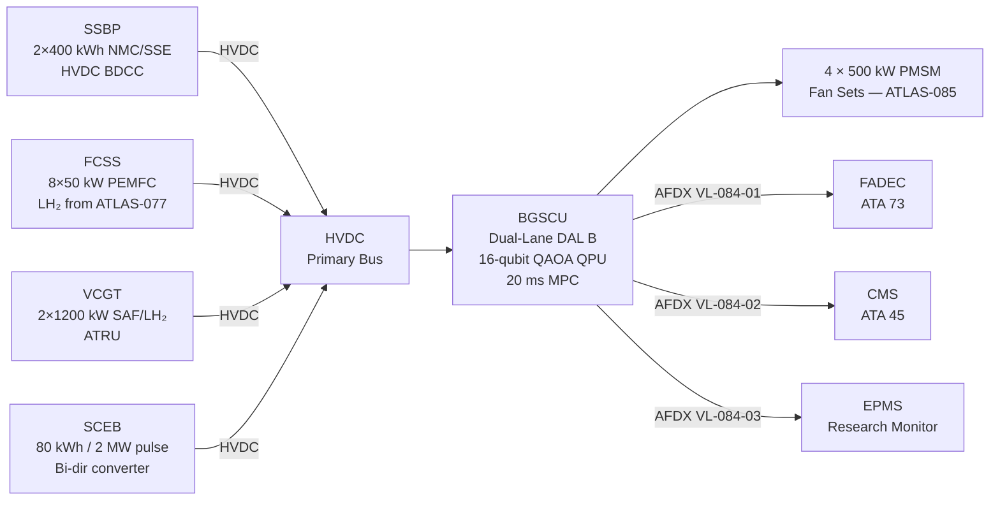
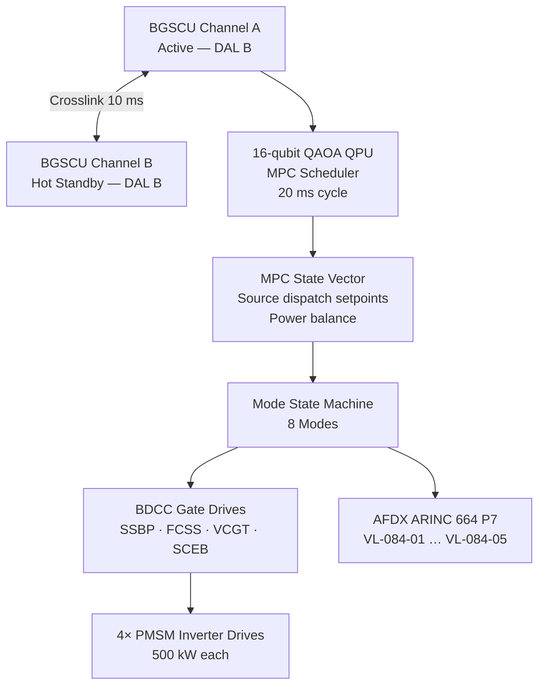

<!-- ──────────────────────────────────────────────────────────────────────────
     QATL-ATLAS-1000-ATLAS-080-089-08-084-000-HYBRID-ARCHITECTURES-BEYOND-GEN-2-GENERAL
     ATLAS-084 (Hybrid Architectures — Beyond Gen-2) · General
     programme-defined aircraft type — ATLAS Register 1000
────────────────────────────────────────────────────────────────────────────── -->

# Hybrid Architectures Beyond Gen-2 — General

---

## §0 Hyperlink Policy

> All hyperlinks in this document are **relative** (five directory levels: `../../../../../`).
> Absolute URLs are forbidden. Every linked document must exist in the Q+ATLANTIDE repository
> before the link is activated. Broken links are treated as open issues and must be resolved
> before the document is promoted from `DRAFT` to `APPROVED`.

---

## §1 Purpose

This document defines the agnostic ATLAS standard-level architecture context for `Hybrid Architectures Beyond Gen-2 — General`.

It describes the controlled scope, functions, interfaces, safety considerations, lifecycle traceability, and S1000D/CSDB mapping logic that programme implementations shall instantiate when this node is applicable.

This document is not a programme design baseline. Programme-specific capacities, locations, part numbers, effectivity, operating limits, maintenance references, and data module codes shall be defined only inside the applicable programme implementation branch.
## §2 Applicability

| Applicability Level | Rule |
|---|---|
| Standard taxonomy | Applies to the ATLAS node `084` |
| Programme implementation | Conditional; determined by programme architecture, trade studies, certification basis, and applicability model |
| Product configuration | Defined in the programme-specific configuration baseline |
| Effectivity | Defined in the programme CSDB / applicability layer |
| Non-applicability | Must be explicitly stated in the programme impact-study branch when excluded |
## §3 Functional Description

The programme-defined aircraft type **Beyond-Gen-2 Hybrid Architecture (BGHA)** integrates four energy sources onto a common HVDC <NOMINAL-VOLTAGE> bus:

1. **Solid-State Battery Pack (SSBP):** Two packs of 400 kWh each (total 800 kWh) using NMC/SSE (Nickel-Manganese-Cobalt / Solid-State Electrolyte) chemistry, interfaced to the <NOMINAL-VOLTAGE> bus through bidirectional DC-DC converters (BDCCs). The SSBP provides high-energy sustained discharge for climb and cruise phases and accepts regenerative energy during descent.

2. **PEMFC Stack (FCSS):** Eight 50 kW proton-exchange membrane fuel cell stacks (total 400 kW) drawing liquid hydrogen (LH₂) from the ATLAS-076 cryogenic storage via the ATLAS-077 hydrogen distribution and conditioning system. The FCSS is the primary zero-emission power source for cruise operations.

3. **Variable-Cycle Gas Turbine (VCGT):** Two SAF/LH₂ bi-fuel turbines with shaft off-takes of 1 200 kW each (total 2 400 kW electrical), feeding the HVDC <NOMINAL-VOLTAGE> bus via auto-transformer rectifier units (ATRUs). The VCGT provides reserve power, rapid response during transient demand, and sustains operations when hydrogen supply is constrained.

4. **Supercapacitor Energy Buffer (SCEB):** 80 kWh / 2 MW peak pulse capability for transient power injection (STOL boost, emergency go-around, regenerative braking spikes). The SCEB responds within 500 ms.

The **BGSCU**, qualified to DAL B (DO-178C software / DO-254 hardware), operates with a dual-lane ARINC 653 partitioned architecture on separate processing modules. A 16-qubit QAOA quantum processing unit (QPU) executes the Model Predictive Control (MPC) scheduler at a 20 ms cycle to minimise fuel burn and maximise energy recovery. The BGSCU drives four 500 kW permanent-magnet synchronous motor (PMSM) fan sets (coordinated with ATLAS-085) through HVDC <NOMINAL-VOLTAGE> power electronics.

---

## §4 Functional Breakdown

| ID | Name | Description | Lead Division |
|---|---|---|---|
| F-001 | BGHA General / Overview | System scope, architecture baseline, DMRL, governing standards | Q-GREENTECH |
| F-002 | Beyond-Gen-2 Baseline and Scope | Gen-1/Gen-2/BGHA comparison, TRL status, mission trade space | Q-GREENTECH |
| F-003 | Advanced Hybrid Propulsion Topology | Series-parallel tri-brid topology, HVDC <NOMINAL-VOLTAGE> bus, BDCC architecture | Q-HORIZON |
| F-004 | Multi-Source Energy Architecture | SSBP, FCSS, VCGT, SCEB descriptions, dispatch priority, SoC/SoH | Q-HPC |
| F-005 | Source Coupling Interfaces | FCSS/SSBP/VCGT/SCEB power conditioning and cross-protection | Q-INDUSTRY |
| F-006 | Control and Mode Management | BGSCU dual-lane DAL B, QAOA MPC 16-qubit, 8-mode state machine | Q-GREENTECH |
| F-007 | Degraded Modes and Redundancy | 6 degraded modes, FMEA top-10, MEL cross-reference | Q-GREENTECH |
| F-008 | Airframe Integration, Thermal, Safety | BGHA-TML cooling loop, HVDC <NOMINAL-VOLTAGE> safety zones, H₂ ATEX | Q-STRUCTURES |

---

## §5 System Context — Mermaid Diagram

---

## §6 Internal BGSCU Architecture — Mermaid Diagram

---

## §7 Components and LRUs

| Component | Part Number | Qty | Location | Maint. Interval | Notes |
|---|---|---|---|---|---|
| BGSCU (Dual-Lane) | BGSCU-PN-TBD | 1 | Forward avionics bay (6-MCU) | Software update per SB; C-check BITE | DO-178C DAL B; DO-254 DAL B; ARINC 653 |
| QPU Module (16-qubit QAOA) | QPU-PN-TBD | 1 | Integrated in BGSCU | C-check calibration; 5 000 h coherence check | Cryogenic isolation module; −196 °C local |
| SSBP Pack | SSBP-PN-TBD | 2 | Forward cargo bay (port/stbd) | A-check SoH; 2-year capacity check | 400 kWh each; NMC/SSE; BMS per pack |
| FCSS Assembly | FCSS-PN-TBD | 1 | Aft bay centre | 500 h stack inspection; 4 000 h MEA replace | 8 × 50 kW PEMFC; LH₂ fed |
| VCGT | VCGT-PN-TBD | 2 | Under-wing pylon | Per VCGT CMM; A-check ground run | SAF/LH₂ bi-fuel; 1 200 kW shaft off-take each |
| SCEB Module | SCEB-PN-TBD | 1 | Mid-fuselage rack | C-check capacitance check; 10-year ESVT | 80 kWh / 2 MW; bi-directional converter integral |
| BGHA-TML Pump | TML-PUMP-TBD | 2 | Aft bay (redundant pair) | A-check flow check; 4 000 h replace | EGW coolant loop; 15 L/min each |
| ATRU (VCGT-to-HVDC <NOMINAL-VOLTAGE>) | ATRU-PN-TBD | 2 | VCGT nacelle (1 per engine) | C-check insulation check | Variable-frequency AC → HVDC <NOMINAL-VOLTAGE> |

---

## §8 Interfaces

| Interface Type | Connected System | Protocol / Medium | Data / Function |
|---|---|---|---|
| Primary Power — SSBP | SSBP packs × 2 | HVDC <NOMINAL-VOLTAGE> BDCC | 800 kWh energy; peak 1 600 kW discharge |
| Primary Power — FCSS | PEMFC stacks (ATLAS-075 heritage) | HVDC <NOMINAL-VOLTAGE> boost converter | 400 kW continuous |
| Primary Power — VCGT | Variable-cycle turbines × 2 | HVDC <NOMINAL-VOLTAGE> ATRU | 2 400 kW combined |
| Pulse Power — SCEB | Supercapacitor buffer | HVDC <NOMINAL-VOLTAGE> bi-dir converter | 80 kWh / 2 MW; < 500 ms response |
| FADEC Advisory | FADEC — ATA 73 | AFDX ARINC 664 P7 VL-084-01 | BGHA power demand advisory; mode status |
| CMS / Maintenance | CMS — ATA 45 | AFDX ARINC 664 P7 VL-084-02 | BGSCU BITE faults; LRU health; energy logs |
| Research Monitor | EPMS | AFDX ARINC 664 P7 VL-084-03 | Full 50 Hz telemetry; QPU optimizer state |
| Thermal | TMS — ATLAS-074 | AFDX ARINC 664 P7 VL-084-04 | BGHA-TML coolant temps; BGSCU heat load |
| Hydrogen Supply | ATLAS-077 H₂ Distribution | Physical LH₂ feed line; CAN bus flow demand | LH₂ to FCSS; GH₂ purge |
| Ground Support | BGSCU-GSE-1 | USB-C 3.2 + HV test port | BGSCU programming; diagnostic download; SSBP conditioning |

---

## §9 Operating Modes

| Mode | Trigger | Active Sources | BGSCU State | Thrust Available |
|---|---|---|---|---|
| Standby (GND) | Aircraft powered; engines off | SSBP (trickle); BGSCU self-test | BITE running; QPU initialising | 0 % |
| Ground Pre-Flight | Crew pre-flight sequence | SSBP full; FCSS warm-up | MPC calibration; SCEB charge verify | Ground taxi only |
| Takeoff Boost | Throttle TOGA | SSBP + VCGT + SCEB (peak) | All sources max dispatch; QAOA override | 100 % + 5 % boost |
| Climb Eco | Gear up + FMS climb profile | VCGT primary; SSBP partial | MPC eco-climb optimisation | 85–95 % |
| Cruise Opt | FL 350, M 0.78 steady | FCSS primary; SSBP top-up | QAOA energy minimisation loop | 70–80 % |
| Descent Regen | FMS descent; throttle idle | PMSM fans as generators → SSBP | Regenerative charging mode | 0–20 % |
| Emergency Min-Power | Dual source failure | Remaining source(s) only | Degraded mode per 084-060 | 40–60 % (DM-dependent) |
| QAOA Offline Fallback | QPU fault or latency > 25 ms | All available sources | Rule-based classical dispatch | Full (reduced optimality) |

---

## §10 Performance and Budgets

| Parameter | Requirement | Target / Design Value | Status |
|---|---|---|---|
| Total installed propulsion power | ≥ 4 000 kW | 4 400 kW (4×500 kW PMSM + VCGT reserve) | TBD |
| HVDC bus voltage | <NOMINAL-VOLTAGE> ± 2 % | <NOMINAL-VOLTAGE> regulated | TBD |
| SSBP total energy | ≥ 700 kWh | 800 kWh (2×400 kWh) | TBD |
| FCSS continuous power | ≥ 350 kW | 400 kW (8×50 kW) | TBD |
| VCGT electrical shaft off-take | ≥ 2 000 kW combined | 2 400 kW (2×1 200 kW) | TBD |
| SCEB peak pulse | ≥ 1.5 MW for 500 ms | 2 MW for 500 ms | TBD |
| BGSCU MPC cycle time | ≤ 20 ms | 20 ms (QPU-assisted QAOA) | TBD |
| QPU classical fallback activation | QPU latency > 25 ms | Automatic; < 50 ms switchover | TBD |
| Overall propulsion efficiency (cruise) | ≥ 65 % well-to-thrust | 70 % (FCSS dominant) | TBD |
| Zero-emission cruise fraction | ≥ 40 % of flight time | 55 % (FCSS + SSBP) | TBD |
| Degraded mode coverage | ≥ 6 defined modes | 6 modes (DM-1…DM-6) | TBD |
| BGSCU availability | ≥ 99.97 % (DAL B) | Dual-lane hot standby | TBD |

---

## §11 Safety and Certification Constraints

| Constraint | Requirement Source | Description |
|---|---|---|
| HVDC <NOMINAL-VOLTAGE> Personnel Safety | IEC 60479-1; CS-25 AMC 1309 | All HVDC <NOMINAL-VOLTAGE> rails isolated by double-pole SSPC with mechanical guard; LOTO mandatory before access; HiPot test 1 500 V DC at each C-check |
| H₂ ATEX Zone | CS-25.1193; ATEX 94/9/EC | FCSS and LH₂ feed zones classified ATEX Zone 2; O₂ monitoring mandatory; ventilation before entry |
| BGSCU Partitioning | DO-178C DAL B; ARINC 653 | Software partitions must not share memory domains; each lane runs independent RTOS partition; QPU module isolated from flight-critical partition |
| Quantum MPC Fallback | CS-25.1309 (no single-point failure) | QPU failure must not degrade primary propulsion authority; classical rule-based fallback activates within 50 ms |
| SSBP Thermal Runaway | UN 38.3; CS-25.1353 | SSE chemistry reduces TR risk vs. NMC liquid; nevertheless each pack has dedicated Novec 1230 suppression and blow-out panel |
| VCGT Bi-Fuel Certification | EASA STC; ASTM D7566 (SAF) | VCGT certified for SAF blends up to 100 % and LH₂; separate fuel train isolation per fuel type |

---

## §12 Document Lineage

| Predecessor | Document ID | Notes |
|---|---|---|
| ATLAS-084 README | QATL-ATLAS-1000-ATLAS-080-089-08-084-README | Subsection index; status updated to active |
| ATLAS-070 Gen-2 Overview | QATL-...-070-000-... | Gen-2 hybrid-electric architecture baseline |
| ATLAS-073 Power Distribution | QATL-...-073-000-... | HVDC 270 V heritage bus; BGHA <NOMINAL-VOLTAGE> is up-rated |
| ATLAS-074 TMS | QATL-...-074-000-... | Thermal management integration |
| ATLAS-075 Fuel Cell | QATL-...-075-000-... | PEMFC heritage for FCSS |
| ATLAS-076 H₂ Storage | QATL-...-076-000-... | LH₂ cryogenic storage for FCSS |
| ATLAS-077 H₂ Distribution | QATL-...-077-000-... | LH₂/GH₂ conditioning for FCSS |
| ATLAS-085 DEP | QATL-...-085-000-... | Distributed electric propulsion fan sets |

---

## §13 Open Issues

| ID | Description | Owner | Target |
|---|---|---|---|
| OI-084-001 | HVDC <NOMINAL-VOLTAGE> bus certification path (EASA STC or advisory material) | Q-INDUSTRY | PDR |
| OI-084-002 | QPU coherence maintenance in airborne environment (vibration, EMI) | Q-HPC | CDR |
| OI-084-003 | SSBP NMC/SSE fire test certification under CS-25.1353 | Q-STRUCTURES | Phase 2 |
| OI-084-004 | VCGT LH₂ bi-fuel STC scope definition and test plan | Q-GREENTECH | PDR |
| OI-084-005 | SCEB certification under DO-160G shock/vibe for 2 MW pulse unit | Q-INDUSTRY | CDR |

---

## §14 References

| Ref | Title | Source |
|---|---|---|
| [R-001] | EASA CS-25 Amendment 27+ | EASA |
| [R-002] | DO-178C Software Considerations in Airborne Systems | RTCA |
| [R-003] | DO-254 Design Assurance Guidance for Airborne Electronic Hardware | RTCA |
| [R-004] | DO-160G Environmental Conditions and Test Procedures | RTCA |
| [R-005] | ARINC 653 Avionics Application Software Standard Interface | ARINC |
| [R-006] | S1000D Issue 5.0 Technical Publications Specification | ASD/AIA |
| [R-007] | IEC 60479-1 Effects of Current on Human Beings | IEC |
| [R-008] | ATLAS-070 Hybrid-Electric Architecture Overview (QATL-070-000) | Q+ATLANTIDE |
| [R-009] | ATLAS-074 Thermal Management Hybrid (QATL-074-000) | Q+ATLANTIDE |
| [R-010] | ATLAS-075 Fuel Cell Integration (QATL-075-000) | Q+ATLANTIDE |
| [R-011] | ATLAS-085 Distributed Electric Propulsion Architecture (QATL-085-000) | Q+ATLANTIDE |
