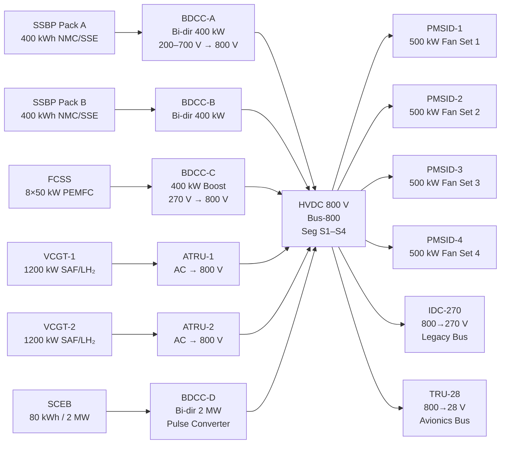

<!-- ──────────────────────────────────────────────────────────────────────────
     QATL-ATLAS-1000-ATLAS-080-089-08-084-020-ADVANCED-HYBRID-PROPULSION-TOPOLOGY
     ATLAS-084 (Hybrid Architectures — Beyond Gen-2) · Advanced Hybrid Propulsion Topology
     AMPEL360E eWTW — ATLAS Register 1000
────────────────────────────────────────────────────────────────────────────── -->

# Advanced Hybrid Propulsion Topology

---

## §0 Hyperlink Policy

> All hyperlinks in this document are **relative** (five directory levels: `../../../../../`).
> Absolute URLs are forbidden.

---

## §1 Purpose

ATLAS subsubject 084-020 defines the propulsion topology of the BGHA — how energy sources connect to propulsive loads, how the HVDC 800 V backbone is structured, and what bidirectional power conversion elements are deployed. This document is the authoritative topology reference from which hardware interface control documents (ICDs) and detailed power-electronics designs are derived.

---

## §2 Applicability

| Parameter | Value |
|---|---|
| Aircraft Program | AMPEL360E eWTW |
| ATA Reference | ATLAS-084 — 084-020 Advanced Hybrid Propulsion Topology |
| Certification Basis | EASA CS-25 Amdt 27+; DO-160G |
| S1000D SNS | 084-020-00 |

---

## §3 Topology Description

The BGHA employs a **quantum-adaptive series-parallel tri-brid topology** with the following hierarchy:

1. **HVDC 800 V Primary Bus (Bus-800):** Single symmetrical bus connecting all sources and all primary loads. All source converters present constant 800 V ± 16 V (2 %) to the bus. Bus-800 is split into four segments (S1–S4) via normally-closed Bus Tie Breakers (BTBs) to allow fault isolation without full bus loss.

2. **Source-Side Bidirectional DC-DC Converters (BDCCs):** Each energy source is coupled through a dedicated BDCC that provides voltage matching (source voltage → 800 V) and bidirectional energy flow (SSBP and SCEB accept regenerative energy). BDCCs are rated at 200 % of nominal source power for 5 s (transient) and include soft-start and current limiting.

3. **Load-Side PMSM Inverter Drives (PMSIDs):** Four 500 kW three-phase PMSID units draw from Bus-800 and drive the PMSM fan sets. Each PMSID includes active front-end rectification (AFE) to allow regenerative braking energy return to Bus-800 during descent.

4. **HVDC 270 V Legacy Sub-Bus:** Derived from Bus-800 via a 800→270 V isolated DC-DC converter block (IDC-270). Supplies Gen-2 heritage loads (ATLAS-073 legacy equipment) without modification.

5. **LVDC 28 V Avionics Bus:** Derived from Bus-800 via a 800→28 V TRU. Supplies BGSCU avionics, QPU cryo controller, CMS, EPMS.

---

## §4 Topology Variants

| Variant | Description | Conditions | BGSCU Mode |
|---|---|---|---|
| A — Full-Parallel | All sources active simultaneously; BGSCU allocates load proportionally | Takeoff Boost, STOL | All-source dispatch |
| B — Series-Dominant | VCGT as primary; SSBP/SCEB as peak-shaving buffers only | Cruise (turbine-on) | VCGT primary MPC |
| C — Quantum-Adaptive | QAOA optimally selects source mix each 20 ms cycle | All phases | QAOA MPC active |
| D — Zero-Combustion | FCSS + SSBP only; VCGT off | TOC cruise, ZE taxi | FCSS primary |
| E — Emergency Minimum | Single remaining source; BTBs reconfigure bus segmentation | Degraded modes DM-1…DM-6 | Classical fallback |

---

## §5 Full BGHA Power Topology — Mermaid Diagram

---

## §6 Bus Architecture

| Bus | Voltage | Source | Key Loads | Isolation |
|---|---|---|---|---|
| Bus-800 (S1–S4) | 800 V DC ± 2 % | All source BDCCs / ATRUs | 4 × PMSID fan sets; IDC-270; TRU-28 | 4× BTB (normally-closed) |
| Legacy Bus-270 | 270 V DC ± 5 % | IDC-270 from Bus-800 | ATLAS-073 heritage loads (FADEC feeders, legacy ECS) | SSPC bank |
| Avionics Bus-28 | 28 V DC ± 2 % | TRU-28 from Bus-800 | BGSCU, QPU cryo unit, CMS, EPMS | Essential bus relay |

Bus-800 segmentation (S1–S4) allows any single segment to be isolated while the remaining three continue to supply loads, protecting against fault propagation. Segment boundaries are located at the mid-fuselage junction, the aft fuselage junction, and the wing-root junctions.

---

## §7 Bidirectional DC-DC Converters (BDCCs)

| Unit | Source | Power Rating | Input Voltage Range | Output | Bi-dir | Location |
|---|---|---|---|---|---|---|
| BDCC-A | SSBP Pack A | 400 kW nom / 800 kW peak 5 s | 500–750 V | 800 V | Yes (regen) | Forward cargo bay port |
| BDCC-B | SSBP Pack B | 400 kW nom / 800 kW peak 5 s | 500–750 V | 800 V | Yes (regen) | Forward cargo bay stbd |
| BDCC-C | FCSS | 400 kW nom / 440 kW peak | 240–300 V | 800 V | No | Aft bay centre |
| BDCC-D | SCEB | 2 000 kW peak / 200 kW cont | 400–750 V | 800 V | Yes (regen) | Mid-fuselage rack |
| ATRU-1 | VCGT-1 | 1 200 kW nom | Variable AC (360–800 Hz) | 800 V | No | VCGT-1 nacelle |
| ATRU-2 | VCGT-2 | 1 200 kW nom | Variable AC (360–800 Hz) | 800 V | No | VCGT-2 nacelle |
| IDC-270 | Bus-800 | 100 kW | 800 V | 270 V | No | Mid-fuselage avionics bay |
| TRU-28 | Bus-800 | 20 kW | 800 V | 28 V | No | Forward avionics bay |

---

## §8 Load Groups and Power Allocation

| Load Group | Connected Bus | Nominal Power | Priority | Shed Level |
|---|---|---|---|---|
| PMSM Fan Sets (×4) | Bus-800 | 2 000–2 400 kW | Flight-critical | Last shed |
| BGSCU / QPU | Bus-28 | 15 kW | Flight-critical | Never shed |
| Legacy Bus-270 loads | Bus-270 | 80 kW | Essential | Level 2 shed |
| BGHA-TML pumps | Bus-270 | 10 kW | Essential | Level 3 shed |
| EPMS / research loads | Bus-28 | 5 kW | Non-essential | Level 1 shed |

---

## §9 Interfaces

| Interface | Connected System | Protocol | Data |
|---|---|---|---|
| Bus-800 → PMSID drives | ATLAS-085 PMSM fans | HVDC 800 V cable | Propulsion power |
| Bus-800 → IDC-270 | ATLAS-073 legacy power | HVDC 270 V cable | Legacy load supply |
| BDCC gate drives | BGSCU | CAN bus (internal) | Duty cycle, current limit, fault |
| ATRU control | BGSCU | RS-422 serial (per ATRU) | Rectifier mode, fault |
| BTB control | BGSCU | Discrete hardwired | Open/close command; position feedback |

---

## §10 Open Issues

| ID | Description | Owner | Target |
|---|---|---|---|
| OI-084-020-001 | Bus-800 segment S3/S4 boundary location — wing-root ICD to be finalised | Q-STRUCTURES | PDR |
| OI-084-020-002 | BDCC-D 2 MW pulse converter EMC emission assessment vs. DO-160G Section 21 | Q-INDUSTRY | CDR |
| OI-084-020-003 | BTB arc-interrupt rating at 800 V / full bus fault current (TBD kA) | Q-INDUSTRY | PDR |
| OI-084-020-004 | ATRU variable-frequency range validation for VCGT off-design speed range | Q-HORIZON | CDR |
