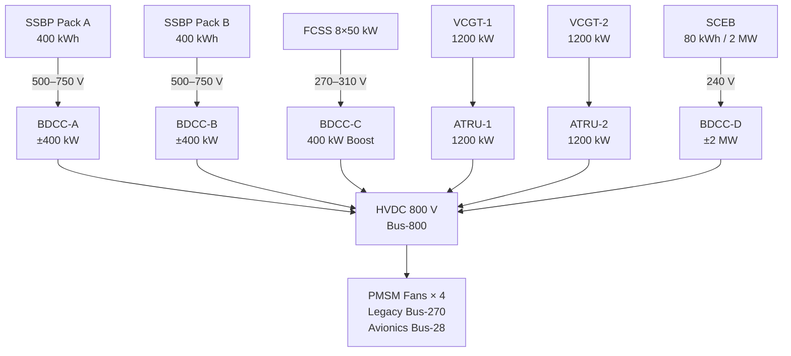

<!-- ──────────────────────────────────────────────────────────────────────────
     QATL-ATLAS-1000-ATLAS-080-089-08-084-030-MULTI-SOURCE-ENERGY-ARCHITECTURE
     ATLAS-084 (Hybrid Architectures — Beyond Gen-2) · Multi-Source Energy Architecture
     AMPEL360E eWTW — ATLAS Register 1000
────────────────────────────────────────────────────────────────────────────── -->

# Multi-Source Energy Architecture

---

## §0 Hyperlink Policy

> All hyperlinks in this document are **relative** (five directory levels: `../../../../../`).
> Absolute URLs are forbidden.

---

## §1 Purpose

ATLAS subsubject 084-030 provides detailed characterisation of each energy source in the BGHA — the Solid-State Battery Pack (SSBP), the PEMFC Stack (FCSS), the Variable-Cycle Gas Turbine (VCGT), and the Supercapacitor Energy Buffer (SCEB) — covering electrochemical / thermodynamic properties, energy and power density, response time, lifetime, and operational constraints. It also defines the dispatch priority table and State-of-Charge / State-of-Health monitoring requirements for each source.

---

## §2 Applicability

| Parameter | Value |
|---|---|
| Aircraft Program | AMPEL360E eWTW |
| ATA Reference | ATLAS-084 — 084-030 Multi-Source Energy Architecture |
| Certification Basis | EASA CS-25 Amdt 27+; DO-160G; UN 38.3 (battery transport) |
| S1000D SNS | 084-030-00 |

---

## §3 Source Descriptions

### 3.1 Solid-State Battery Pack (SSBP)

Two packs installed in the forward cargo bay (port and starboard). Each pack contains 2 800 NMC/SSE prismatic cells arranged in a 700 s × 4 p configuration (series-parallel). The solid-state electrolyte (SSE) eliminates liquid electrolyte fire hazard, reduces cell swelling, and enables operation at higher cell voltage (4.4 V max vs. 4.2 V NMC-liquid). A dedicated Battery Management System (BMS) per pack monitors cell voltage (±2 mV), temperature (±0.5 °C), and state of charge (SoC) and state of health (SoH) via Coulomb counting + Kalman filter.

**Key parameters (per pack):** 400 kWh nominal; peak discharge 800 kW (2C) for 5 s; nominal discharge rate 200 kW (0.5C); cycle life ≥ 2 000 cycles at 80 % DoD; operating temperature −20 °C to +55 °C; weight ~1 200 kg; volume ~1.8 m³.

### 3.2 PEMFC Stack (FCSS)

Eight 50 kW PEM fuel cell stacks sharing a common LH₂ feed manifold from ATLAS-077 and a common air supply via cabin-bleed-free electrochemical air compressors (EACs). The FCSS operates at stack voltage 270–310 V DC; a boost BDCC (BDCC-C) up-converts to 800 V. Stack humidification uses external membrane humidifiers. Stack coolant is EGW (ethylene glycol-water 40/60) shared with the BGHA-TML loop.

**Key parameters:** 400 kW continuous; 440 kW peak (10 % overload, 30 s); H₂ consumption at full load: 1.5 kg/min (LHV efficiency ~58 %); stack operating temperature 65–80 °C; stack lifetime target 15 000 h; 50 000 start/stop cycles.

### 3.3 Variable-Cycle Gas Turbine (VCGT)

Two under-wing VCGTs, each capable of operating on SAF (up to 100 % HEFA blend per ASTM D7566) or LH₂ with a dedicated hydrogen combustor sector. Each VCGT drives a permanent-magnet synchronous generator (PMSG) rated 1 200 kW at 3 600 rpm nominal. Output is variable-frequency AC (360–800 Hz depending on power lever setting), rectified by ATRU to 800 V DC.

**Key parameters:** 1 200 kW each (2 400 kW total); fuel types: SAF 100 % or LH₂; start time: 90 s from cold; ATRU conversion efficiency ≥ 96 %; SFC (SAF): 0.38 kg/kWh; SFC (LH₂): 0.11 kg/kWh (LHV basis); VCGT lifetime: per OEM CMM (TBD hours).

### 3.4 Supercapacitor Energy Buffer (SCEB)

One mid-fuselage rack unit containing electrochemical double-layer capacitors (EDLCs) assembled into a 240 V nominal pack, boosted to 800 V via BDCC-D. The SCEB accepts charge from regenerative braking (PMSM fan regen) and SSBP overflow. It discharges for STOL boost and emergency power peaks.

**Key parameters:** 80 kWh; 2 MW peak discharge ≤ 500 ms; continuous power 200 kW; charge acceptance ≤ 2 MW; cycle life ≥ 500 000 cycles; operating temperature −40 °C to +65 °C; weight ~280 kg.

---

## §4 Source Comparison

| Attribute | SSBP | FCSS | VCGT | SCEB |
|---|---|---|---|---|
| Energy density (Wh/kg) | 333 | N/A (flow) | N/A (fuel) | 285 |
| Power density (kW/kg) | 0.33 | 0.13 | 0.83 | 7.1 |
| Specific energy (system) | ~167 Wh/kg | — | — | ~80 Wh/kg |
| Response time (10→100 %) | 2 s | 10–30 s | 90 s cold / 5 s warm | < 500 ms |
| Cycle life | ≥ 2 000 cycles | 15 000 h / 50 000 starts | Per CMM | ≥ 500 000 cycles |
| Zero-emission output | Yes | Yes | No (SAF / LH₂ combustion) | Yes |
| Regenerative capable | Yes | No | No | Yes |
| Operating temperature | −20 to +55 °C | 65–80 °C (stack) | −55 to +55 °C ambient | −40 to +65 °C |
| Current TRL | 4 | 6 | 4 | 5 |

---

## §5 Energy Dispatch Priority

The BGSCU QAOA MPC assigns source dispatch in real time. The following priority table governs the rule-based fallback when the QPU is offline:

| Priority | Phase | Primary Source | Secondary Source | Buffer (Peak) | Shed Trigger |
|---|---|---|---|---|---|
| 1 (Highest) | Emergency | Any surviving source | Any surviving source | SCEB | Load shed at 60 % bus |
| 2 | Takeoff | VCGT (both) + SSBP | SCEB boost | — | None |
| 3 | Climb | VCGT primary | SSBP partial | SCEB (if demand spike) | EPMS shed |
| 4 | Cruise (turbine-on) | VCGT | FCSS | SSBP (SoC recovery) | Research loads shed |
| 5 | Cruise (turbine-off) | FCSS | SSBP | SCEB (demand spike) | Legacy bus shed if < 40 % SoC |
| 6 | Descent | PMSM regen → SSBP / SCEB | FCSS idle | — | — |
| 7 | Ground taxi | SSBP | — | — | FCSS/VCGT remain off |

---

## §6 SoC and SoH Monitoring

| Source | SoC Method | SoH Method | Update Rate | Alarm Thresholds |
|---|---|---|---|---|
| SSBP | Coulomb counting + dual-EKF | Capacity fade tracking (cycle count + temperature integral) | 100 ms | SoC < 20 %: WARNING; SoC < 10 %: CRITICAL; SoH < 80 %: MEL action |
| FCSS | H₂ mass flow integration (Faradaic equivalent) | Polarisation curve shift (weekly ground check) | 500 ms | H₂ < 50 kg: WARNING; stack voltage drop > 10 %: WARNING |
| VCGT | Fuel flow totaliser | Trend monitoring EGT/fuel ratio (per VCGT CMM) | 1 s | EGT margin < 15 °C: WARNING |
| SCEB | Voltage-based SoC (EDLC linear) | ESR increase vs. baseline (weekly ground check) | 50 ms | SoC < 15 %: WARNING; ESR > 2× baseline: MEL action |

---

## §7 Energy Source Coupling to Bus-800 — Mermaid Diagram

---

## §8 Interfaces

| Interface | Connected System | Protocol | Data |
|---|---|---|---|
| SSBP BMS → BGSCU | BGSCU via CAN bus (per pack) | CAN ISO 11898 | SoC, SoH, cell temps, contactor status |
| FCSS stack controller → BGSCU | FCSS controller (FCCU) | AFDX VL-084-05 | Stack current/voltage, H₂ flow, stack temp, fault codes |
| VCGT controller → BGSCU | VCGT FADEC (per engine) | AFDX VL-084-01 | Power off-take demand; ATRU status; shaft speed |
| SCEB controller → BGSCU | SCEB BDU | CAN ISO 11898 | SCEB SoC, ESR, temperature, converter status |
| BGHA-TML → FCSS coolant | ATLAS-074 TMS | Physical EGW circuit + CAN temp data | Stack coolant in/out temperatures |

---

## §9 Open Issues

| ID | Description | Owner | Target |
|---|---|---|---|
| OI-084-030-001 | SSBP NMC/SSE cell supplier confirmation and qualification test plan | Q-GREENTECH | PDR |
| OI-084-030-002 | FCSS stack lifetime 15 000 h validation — accelerated test protocol | Q-HORIZON | CDR |
| OI-084-030-003 | SCEB ESR degradation model — temperature correction factor | Q-HPC | CDR |
| OI-084-030-004 | VCGT LH₂ bi-fuel SFC measurement protocol (in-flight test) | Q-GREENTECH | Phase 2 |
| OI-084-030-005 | SoH alarm thresholds — calibration procedure on-aircraft for SSBP pack | Q-INDUSTRY | CDR |
