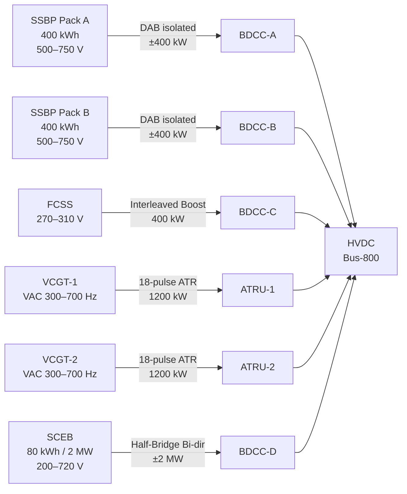

<!-- ──────────────────────────────────────────────────────────────────────────
     QATL-ATLAS-1000-ATLAS-080-089-08-084-040-FUEL-CELL-BATTERY-TURBINE-AND-ADVANCED-SOURCE-COUPLING
     ATLAS-084 (Hybrid Architectures — Beyond Gen-2) · Fuel-Cell Battery Turbine and Advanced Source Coupling
     programme-defined aircraft type — ATLAS Register 1000
────────────────────────────────────────────────────────────────────────────── -->

# Fuel-Cell Battery Turbine and Advanced Source Coupling

---

## §0 Hyperlink Policy

> All hyperlinks in this document are **relative** (five directory levels: `../../../../../`).
> Absolute URLs are forbidden.

---

## §1 Purpose

This document defines the agnostic ATLAS standard-level architecture context for `Fuel-Cell Battery Turbine and Advanced Source Coupling`.

It describes the controlled scope, functions, interfaces, safety considerations, lifecycle traceability, and S1000D/CSDB mapping logic that programme implementations shall instantiate when this node is applicable.

This document is not a programme design baseline. Programme-specific capacities, locations, part numbers, effectivity, operating limits, maintenance references, and data module codes shall be defined only inside the applicable programme implementation branch.
## §2 Applicability

| Applicability Level | Rule |
|---|---|
| Standard taxonomy | Applies to the ATLAS node `084` |
| Programme implementation | Conditional; determined by programme architecture, trade studies, certification basis, and applicability model |
| Product configuration | Defined in the programme-specific configuration baseline |
| Effectivity | Defined in the programme CSDB / applicability layer |
| Non-applicability | Must be explicitly stated in the programme impact-study branch when excluded |
## §3 FCSS Coupling (PEMFC → HVDC <NOMINAL-VOLTAGE>)

The FCSS outputs at 270–310 V DC (stack terminal voltage, load dependent). BDCC-C is a two-level interleaved boost converter (8-phase, 400 kHz switching, SiC MOSFET) that boosts FCSS output to regulated <NOMINAL-VOLTAGE> DC on Bus-800.

**BDCC-C specifications:**
- Topology: 8-phase interleaved boost (SiC MOSFET, 1 700 V rated)
- Input voltage: 240–320 V DC (FCSS output range)
- Output voltage: <NOMINAL-VOLTAGE> ± 8 V
- Rated power: 400 kW continuous / 440 kW peak 30 s
- Switching frequency: 400 kHz (reduces ripple current on FCSS output)
- Conversion efficiency: ≥ 97.5 % at rated power
- Inrush current limiting: soft-start ramp 100 ms; current limit 120 % rated
- H₂ flow control coordination: BDCC-C current demand is mirrored to FCCU to compute H₂ flow setpoint via electrochemical stoichiometry (λ = 1.4 anode, λ = 2.0 cathode)
- Galvanic isolation: No (common return); EMC filter integral to BDCC-C input and output

**FCSS start sequence:** FCCU initiates stack purge → H₂ flow opened → stack voltage rises to ≥ 240 V within 30 s → BDCC-C soft-start enabled → full power available within 10 s of soft-start completion.

---

## §4 SSBP Coupling (Solid-State Battery → HVDC <NOMINAL-VOLTAGE>)

Each SSBP pack is coupled via a dedicated BDCC (BDCC-A for Pack A, BDCC-B for Pack B) that is bidirectional — allowing both discharge (pack → Bus-800) and regenerative charging (Bus-800 → pack during descent regen).

**BDCC-A / BDCC-B specifications:**
- Topology: Bidirectional dual-active-bridge (DAB) with galvanic isolation transformer (<NOMINAL-VOLTAGE>:750 V, ferrite core, 50 kHz)
- Input voltage: 500–750 V DC (SSBP pack terminal)
- Output voltage: <NOMINAL-VOLTAGE> DC (bus side)
- Rated power: 400 kW discharge / 400 kW charge
- Peak power: 800 kW for 5 s (2C pack discharge)
- Conversion efficiency: ≥ 97 % at rated power
- Main contactor: Dual-pole pyrotechnic IRM-type; precharge resistor 10 Ω 5 s ramp
- BMS interface: CAN ISO 11898 — BDCC receives current limit setpoint from BMS every 100 ms; respects BMS cell-voltage and temperature limits
- Thermal protection: BDCC shuts down if transformer winding temperature > 130 °C; integrates with BGHA-TML coolant plate

---

## §5 VCGT Coupling (Variable-Cycle Turbine → HVDC <NOMINAL-VOLTAGE>)

Each VCGT drives a PMSG at variable shaft speed (3 000–4 200 rpm). The PMSG output is three-phase AC at variable frequency (300–700 Hz) and variable voltage. An Auto-Transformer Rectifier Unit (ATRU) — 18-pulse for low harmonic content — converts this to HVDC <NOMINAL-VOLTAGE> DC.

**ATRU specifications:**
- Type: 18-pulse ATR (3× six-pulse diode bridge, interleaved via auto-transformer)
- Input: 3-phase variable AC, 300–700 Hz, 400–1 200 V line-to-line
- Output: <NOMINAL-VOLTAGE> DC ± 3 % (line-droop regulation via BGSCU VCGT power lever)
- Rated power: 1 200 kW continuous
- Conversion efficiency: ≥ 96 %
- Harmonic content: THD < 5 % on AC side; ripple < 1 % on DC output
- Protection: Over-current crowbar; over-voltage clamp (850 V); thermal cutback above 105 °C winding
- Power control: BGSCU sends power off-take demand via RS-422 to VCGT FADEC; VCGT FADEC adjusts fuel flow to match shaft speed → PMSG → ATRU output power

---

## §6 SCEB Coupling (Supercapacitor → HVDC <NOMINAL-VOLTAGE>)

The SCEB EDLC pack terminal voltage varies from 240 V (20 % SoC) to 720 V (100 % SoC). BDCC-D is a bidirectional half-bridge converter with a large DC-link capacitor, capable of 2 MW peak injection for ≤ 500 ms.

**BDCC-D specifications:**
- Topology: Bidirectional half-bridge (SiC MOSFET, 1 700 V)
- Input voltage: 200–750 V DC (SCEB terminal)
- Output voltage: <NOMINAL-VOLTAGE> DC
- Rated continuous power: 200 kW
- Peak power: 2 000 kW for ≤ 500 ms (limited by SCEB internal ESR and BDCC thermal mass)
- Charge acceptance: 2 MW from Bus-800 (regen braking energy)
- Switching frequency: 200 kHz (SiC allows high frequency at 2 MW)
- SCEB discharge initiation: BGSCU sends "SCEB BOOST ENABLE" discrete → BDCC-D ramps to demanded current within 100 ms
- EMC: BDCC-D generates highest switching noise on Bus-800; common-mode choke and Y-capacitor filter mandated at output

---

## §7 Combined Coupling — Mermaid Diagram

---

## §8 Cross-Source Protection

| Protection Function | Implementation | Threshold | Response |
|---|---|---|---|
| Over-voltage Bus-800 | Hardware OV clamp (SCEB BDCC-D crowbar absorbs) | > 840 V (5 % over-nominal) | BDCC-D crowbar active; source converters reduce output |
| Under-voltage Bus-800 | BGSCU monitors bus; dispatches SCEB if bus < 760 V | < 760 V for > 50 ms | SCEB BDCC-D ramp-in; BGSCU increases source setpoints |
| Cross-current (source fight) | BGSCU current-sharing loop (droop control, 2 % droop) | Imbalance > 20 % rated | BGSCU adjusts droop setpoints; isolates worst offender |
| Single-source isolation | BTB opens on BGSCU command or BDCC internal fault | BDCC fault flag | BTB opens within 5 ms; CMS fault logged |
| Ground fault | Isolation monitoring unit (IMU) on Bus-800 | Insulation resistance < 100 kΩ | BGSCU alert; ground fault location via IMU pulse injection |
| Inrush limit | BDCC-C soft-start; BDCC-A/B precharge contactor | Peak inrush < 200 % rated for 100 ms | Precharge complete signal before main contactor closes |

---

## §9 Interfaces

| Interface | Connected System | Protocol | Data |
|---|---|---|---|
| BDCC gate drives ↔ BGSCU | BGSCU CAN bridge | CAN ISO 11898 | PWM duty cycle; current limit; fault flags |
| ATRU control ↔ VCGT FADEC | VCGT FADEC | RS-422 | Power off-take demand; ATRU output power actual |
| BMS ↔ BDCC-A/B | SSBP BMS per pack | CAN ISO 11898 | Cell voltage min/max; current limit; contactor command |
| FCCU ↔ BDCC-C | FCCU (fuel cell control) | CAN ISO 11898 | H₂ flow demand derived from BDCC-C current; stack fault |
| SCEB BDU ↔ BDCC-D | SCEB battery data unit | CAN ISO 11898 | SoC; peak power available; temperature; ESR |
| IMU ↔ BGSCU | Isolation monitoring unit | Discrete + CAN | Ground fault detection; insulation resistance value |

---

## §10 Open Issues

| ID | Description | Owner | Target |
|---|---|---|---|
| OI-084-040-001 | BDCC-D 2 MW SiC module supplier qualification at 200 kHz / 1 700 V | Q-INDUSTRY | PDR |
| OI-084-040-002 | DAB transformer isolation voltage rating — <NOMINAL-VOLTAGE> bus to 750 V SSBP; creepage/clearance | Q-INDUSTRY | CDR |
| OI-084-040-003 | ATRU harmonic injection into VCGT PMSG — rotor loss heating analysis | Q-HORIZON | CDR |
| OI-084-040-004 | FCSS H₂ flow control latency between BDCC-C current demand and XMFC actuation | Q-GREENTECH | CDR |
| OI-084-040-005 | IMU pulse-injection method compatibility with SCEB BDCC-D switching noise | Q-INDUSTRY | CDR |
