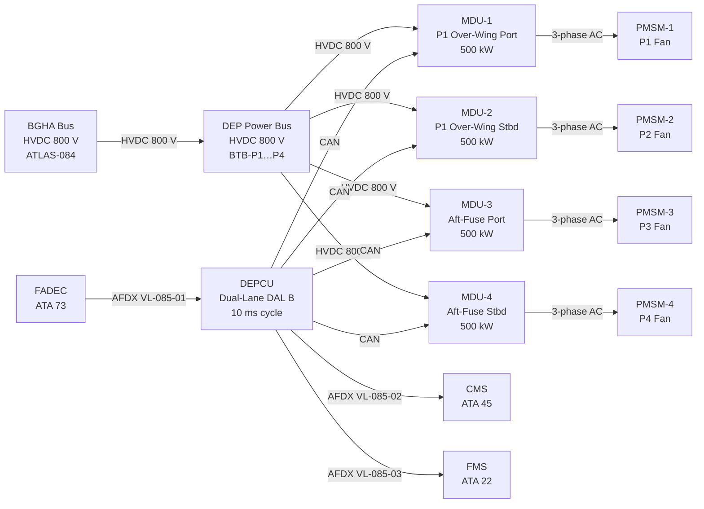
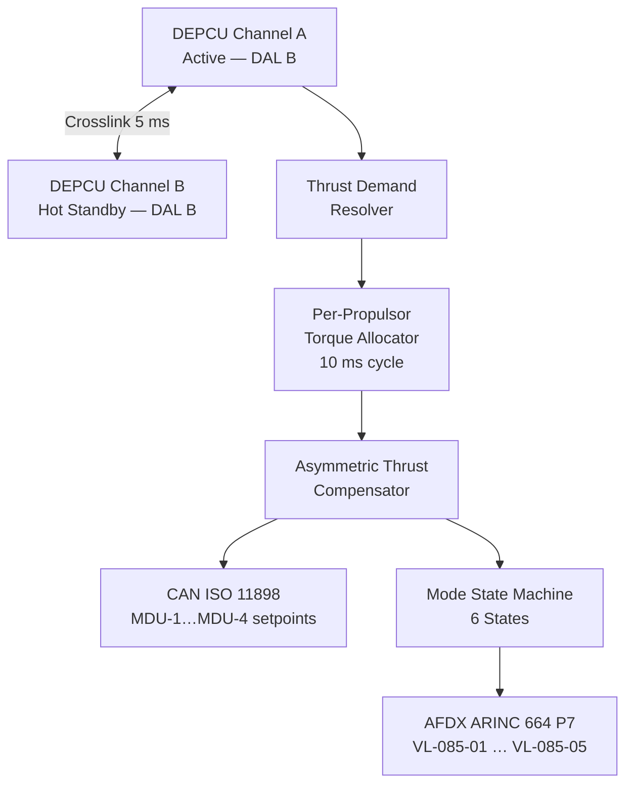

<!-- ──────────────────────────────────────────────────────────────────────────
     QATL-ATLAS-1000-ATLAS-080-089-08-085-000-DISTRIBUTED-ELECTRIC-PROPULSION-ARCHITECTURE-GENERAL
     ATLAS-085 (Distributed Electric Propulsion Architecture) · General
     AMPEL360E eWTW — ATLAS Register 1000
────────────────────────────────────────────────────────────────────────────── -->

# Distributed Electric Propulsion Architecture — General

---

## §0 Hyperlink Policy

> All hyperlinks in this document are **relative** (five directory levels: `../../../../../`).
> Absolute URLs are forbidden. Every linked document must exist in the Q+ATLANTIDE repository
> before the link is activated. Broken links are treated as open issues and must be resolved
> before the document is promoted from `DRAFT` to `APPROVED`.

---

## §1 Purpose

ATLAS subsubject 085-000 is the **apex reference** for the Distributed Electric Propulsion Architecture (DEPA) subsection of the AMPEL360E eWTW. It establishes the overall system description, functional decomposition, interface catalogue, operating mode inventory, and certification constraints applicable across the full DEPA scope. All subordinate subsubject documents (085-010 through 085-090) are governed by, and must be consistent with, this general baseline document.

The DEPA distributes propulsive thrust across four boundary-layer-ingestion (BLI) fan propulsors arranged symmetrically on the AMPEL360E eWTW airframe: two over-wing root units (P1 — port, P2 — starboard) and two aft-fuselage units (P3 — port, P4 — starboard). Each propulsor is driven by a dedicated 500 kW permanent-magnet synchronous motor (PMSM) and motor drive unit (MDU), all fed from the HVDC 800 V bus provided by the Beyond-Gen-2 Hybrid Architecture (BGHA, ATLAS-084). The Distributed Electric Propulsion Control Unit (DEPCU), qualified to DAL B (DO-178C software / DO-254 hardware), operates as a dual-lane ARINC 653 partitioned controller that receives thrust demand from FADEC (ATA 73) and issues torque setpoints to each MDU at a 10 ms control cycle to maintain aero-propulsive coupling targets while satisfying BLI efficiency and asymmetric thrust management requirements.

---

## §2 Applicability

| Attribute | Value |
|---|---|
| Aircraft Program | AMPEL360E eWTW |
| ATA Reference | ATLAS-085 (Distributed Electric Propulsion Architecture) |
| Certification Basis | DO-178C DAL B (DEPCU software); DO-254 DAL B (DEPCU hardware); DO-160G (environmental); EASA CS-25 Amendment 27+ |
| S1000D SNS | 085-000-00 |
| DMRL Reference | BREX-085-v1; 30 Data Modules |
| Effectivity | All AMPEL360E eWTW aircraft from MSN 001 |

---

## §3 Functional Description

The AMPEL360E eWTW **Distributed Electric Propulsion Architecture (DEPA)** comprises four HVDC-fed BLI fan propulsors driven by individual 500 kW PMSMs:

1. **Propulsor P1 — Over-Wing Root Port:** 500 kW PMSM with co-located MDU (MDU-1), mounted at the port wing-root leading edge in a flush-nacelle BLI duct. P1 ingests the port fuselage boundary layer, reducing effective inlet drag and improving propulsive efficiency.

2. **Propulsor P2 — Over-Wing Root Starboard:** Mirror of P1 at starboard. 500 kW PMSM with MDU-2, ingesting the starboard fuselage boundary layer.

3. **Propulsor P3 — Aft-Fuselage Port:** 500 kW PMSM with MDU-3, mounted in the aft-fuselage tailcone nacelle port station. P3 ingests the combined fuselage aft boundary layer, providing the highest BLI efficiency gain fraction (~12 % drag reduction at cruise).

4. **Propulsor P4 — Aft-Fuselage Starboard:** Mirror of P3 at starboard. 500 kW PMSM with MDU-4.

The **DEPCU**, qualified to DAL B (DO-178C software / DO-254 hardware), operates with a dual-lane ARINC 653 partitioned architecture on separate processing modules. It receives a consolidated thrust demand from the FADEC via AFDX ARINC 664 P7 VL-085-01 and resolves it into per-propulsor torque setpoints transmitted to MDU-1 through MDU-4 via redundant CAN ISO 11898 buses at a 10 ms control cycle. The DEPCU also manages differential thrust allocation for asymmetric flight conditions, yaw coordination with the flight management system (FMS), and degrades gracefully through five defined degraded modes (DM-1 through DM-5) as propulsors or MDUs are lost.

---

## §4 Functional Breakdown

| ID | Name | Description | Lead Division |
|---|---|---|---|
| F-001 | DEPA General / Overview | System scope, architecture baseline, DMRL, governing standards | Q-GREENTECH |
| F-002 | DEP Baseline and Scope | Technology comparison, TRL status, design targets, mission roles | Q-GREENTECH |
| F-003 | Distributed Propulsor Layout and Topology | P1–P4 locations, BLI duct geometry, nacelle envelope, thrust vector | Q-HORIZON |
| F-004 | Electric Motor and Drive Allocation | PMSM specs, MDU architecture, torque control bandwidth, thermal limits | Q-INDUSTRY |
| F-005 | Power Distribution and Energy Management Interfaces | HVDC 800 V feed from BGHA, per-propulsor BTBs, power budgets | Q-INDUSTRY |
| F-006 | Propulsor Airframe Integration and Aero-Propulsive Coupling | BLI interaction, fan-wake impingement, trim drag, aero-propulsive gain model | Q-STRUCTURES |
| F-007 | Redundancy, Fault Tolerance and Degraded Modes | 5 DMs, FMEA top-10, MEL cross-reference, DEPCU reconfiguration logic | Q-GREENTECH |
| F-008 | Thermal, EMC and Structural Integration Constraints | DEP-TML cooling loops, EMC filtering, PMSM structural mounts, vibration | Q-STRUCTURES |
| F-009 | DEP Monitoring, Diagnostics and Control Interfaces | DEPCU BITE, synoptic page, AFDX outputs, ground support equipment | Q-GREENTECH |

---

## §5 System Context — Mermaid Diagram

---

## §6 Internal DEPCU Architecture — Mermaid Diagram

---

## §7 Components and LRUs

| Component | Part Number | Qty | Location | Maint. Interval | Notes |
|---|---|---|---|---|---|
| DEPCU (Dual-Lane) | DEPCU-PN-TBD | 1 | Forward avionics bay (4-MCU) | Software update per SB; C-check BITE | DO-178C DAL B; DO-254 DAL B; ARINC 653 |
| PMSM-1 (P1) | PMSM-500-PN-TBD | 1 | Port over-wing root nacelle | A-check vibration; 6 000 h winding inspect | 500 kW; 6 000 RPM; HVDC 800 V fed via MDU-1 |
| PMSM-2 (P2) | PMSM-500-PN-TBD | 1 | Starboard over-wing root nacelle | As PMSM-1 (mirror) | Mirror of P1 |
| PMSM-3 (P3) | PMSM-500-PN-TBD | 1 | Aft-fuselage port nacelle | A-check vibration; 6 000 h winding inspect | Highest BLI gain; ~12 % drag reduction |
| PMSM-4 (P4) | PMSM-500-PN-TBD | 1 | Aft-fuselage starboard nacelle | As PMSM-3 (mirror) | Mirror of P3 |
| MDU-1 | MDU-500-PN-TBD | 1 | P1 nacelle (co-located) | C-check insulation; 4 000 h gate drive inspect | 500 kW IGBT inverter; HVDC 800 V → 3-phase AC |
| MDU-2 | MDU-500-PN-TBD | 1 | P2 nacelle (co-located) | As MDU-1 | Mirror of MDU-1 |
| MDU-3 | MDU-500-PN-TBD | 1 | P3 nacelle (co-located) | As MDU-1 | Aft station; longer HVDC cable run |
| MDU-4 | MDU-500-PN-TBD | 1 | P4 nacelle (co-located) | As MDU-3 | Mirror of MDU-3 |
| BTB-P1…P4 (Bus Tie Breakers) | BTB-HV-PN-TBD | 4 | Forward power distribution panel | C-check functional test | HVDC 800 V; open/close per DEPCU command |
| DEP-TML Pump (pair) | TML-DEP-PUMP-TBD | 2 | Aft avionics bay (redundant) | A-check flow; 4 000 h replace | EGW coolant; 12 L/min each; serves MDU-1…4 |

---

## §8 Interfaces

| Interface Type | Connected System | Protocol / Medium | Data / Function |
|---|---|---|---|
| Primary Power — DEP Bus | BGHA HVDC 800 V Bus (ATLAS-084) | HVDC 800 V cable | 4 × 500 kW propulsor feed |
| Propulsor BTBs (×4) | BTB-P1…P4 | Hardwired discrete | Open/close command; position feedback |
| Thrust Demand | FADEC — ATA 73 | AFDX ARINC 664 P7 VL-085-01 | Total DEP thrust demand; phase (T/O, climb, cruise, idle) |
| Per-Propulsor Torque | MDU-1…MDU-4 | CAN ISO 11898 redundant | Torque setpoints; speed feedback; fault flags |
| CMS / Maintenance | CMS — ATA 45 | AFDX ARINC 664 P7 VL-085-02 | DEPCU BITE faults; MDU health; energy logs |
| FMS Yaw Coordination | FMS — ATA 22 | AFDX ARINC 664 P7 VL-085-03 | Differential thrust advisory for yaw trim |
| Research Monitor | EPMS | AFDX ARINC 664 P7 VL-085-04 | Full 100 Hz DEP telemetry; per-propulsor power; BLI pressure |
| Thermal | TMS — ATLAS-074 | AFDX ARINC 664 P7 VL-085-05 | DEP-TML coolant temps; MDU junction temperatures |
| Ground Support | DEPCU-GSE-1 | USB-C 3.2 + HV test port | DEPCU programming; BITE download; MDU calibration |

---

## §9 Operating Modes

| Mode | Trigger | Active Propulsors | DEPCU State | Thrust Available |
|---|---|---|---|---|
| Standby (GND) | Aircraft powered; BGHA Bus live | None (MDUs on standby) | BITE running; PMSM spin-check | 0 % |
| Ground Pre-Flight | Crew pre-flight sequence | Low-speed taxi (P3+P4 only) | Asymmetric compensator calibrated | Taxi only |
| Takeoff Full-DEP | Throttle TOGA | P1 + P2 + P3 + P4 full power | Torque max dispatch; BLI ingestion mode | 100 % |
| Climb Eco | Gear up + FMS climb profile | P1–P4 eco torque schedule | MPC-coordinated with BGSCU climb | 80–95 % |
| Cruise Opt | FL 350, M 0.78 steady | P3 + P4 primary; P1 + P2 partial | BLI aero-propulsive gain maximised | 70–80 % |
| Descent Regen | FMS descent; throttle idle | P1–P4 as generators | Regenerative braking → BGHA Bus | 0–10 % (fan drag assist) |
| Asymmetric DEP | Single propulsor loss | Remaining 3 propulsors | Asymmetric thrust compensation active | 75 % (DM-1/DM-2) |
| Emergency Min-Power | Two or more propulsors lost | Remaining propulsors | Degraded mode per 085-060 | 50–65 % (DM-dependent) |

---

## §10 Performance and Budgets

| Parameter | Requirement | Target / Design Value | Status |
|---|---|---|---|
| Total DEP installed power | ≥ 1 800 kW | 2 000 kW (4 × 500 kW) | TBD |
| Per-propulsor power | ≥ 450 kW | 500 kW | TBD |
| HVDC bus voltage (DEP rail) | 800 V ± 2 % | 800 V regulated from BGHA bus | TBD |
| BLI drag reduction (aft propulsors, cruise) | ≥ 8 % | 12 % (P3+P4 combined) | TBD |
| DEPCU torque command cycle | ≤ 10 ms | 10 ms | TBD |
| Asymmetric thrust correction bandwidth | ≤ 100 ms | 50 ms | TBD |
| Regenerative power recovery (descent) | ≥ 50 kW total | 80 kW (4 × 20 kW) | TBD |
| DEPCU availability | ≥ 99.97 % (DAL B) | Dual-lane hot standby | TBD |
| Degraded mode coverage | ≥ 5 defined modes | 5 modes (DM-1…DM-5) | TBD |
| DEP-TML coolant temperature (MDU inlet) | ≤ 55 °C | < 50 °C at max power | TBD |

---

## §11 Safety and Certification Constraints

| Constraint | Requirement Source | Description |
|---|---|---|
| HVDC 800 V Personnel Safety | IEC 60479-1; CS-25 AMC 1309 | All HVDC 800 V feeds to MDUs isolated by BTB with mechanical guard; LOTO mandatory before nacelle access; HiPot test 1 500 V DC at each C-check |
| DEPCU Partitioning | DO-178C DAL B; ARINC 653 | Software partitions must not share memory domains; each lane runs independent RTOS partition; asymmetric compensator function is DAL B isolated |
| Asymmetric Thrust | CS-25.143; CS-25.147 | Loss of any single propulsor must not create uncontrollable yaw; DEPCU compensates within 50 ms; FMS notified |
| BLI Structural Interface | CS-25.571 (damage tolerance) | BLI nacelle fan-blade-off event must be contained within the nacelle without structural failure of the wing root or fuselage skin |
| Rotating Machinery | CS-25.903(d) | Uncontained fan disc failure analysis required; nacelle burst zone must not penetrate pressure vessel, fuel tanks, or flight control lines |
| EMC | DO-160G Section 21 (RE102/CE102) | MDU high-frequency switching (IGBT ≥ 10 kHz) must meet Class L/M emissions; EMC filter integral to each MDU |

---

## §12 Document Lineage

| Predecessor | Document ID | Notes |
|---|---|---|
| ATLAS-085 README | QATL-ATLAS-1000-ATLAS-080-089-08-085-README | Subsection index; status updated to active |
| ATLAS-071 Electric Motor and Drive Systems | QATL-...-071-000-... | Gen-2 PMSM/MDU heritage; 085 scales to 500 kW per unit |
| ATLAS-073 Power Distribution MV-HV | QATL-...-073-000-... | HVDC 270/540 V heritage; 085 uses BGHA HVDC 800 V bus |
| ATLAS-074 Thermal Management Hybrid | QATL-...-074-000-... | DEP-TML cooling loop integrated with TMS |
| ATLAS-084 Beyond-Gen-2 Hybrid | QATL-...-084-000-... | BGHA provides HVDC 800 V bus and BGSCU supervisory control |
| ATLAS-086 BLI Propulsion | QATL-...-086-000-... | BLI aerodynamic interaction details; cross-reference for duct geometry |

---

## §13 Open Issues

| ID | Description | Owner | Target |
|---|---|---|---|
| OI-085-001 | HVDC 800 V per-propulsor BTB certification (EASA STC path) | Q-INDUSTRY | PDR |
| OI-085-002 | BLI fan-blade-off containment analysis (P3, P4 aft fuselage station) | Q-STRUCTURES | CDR |
| OI-085-003 | Asymmetric thrust CS-25.147 compliance demonstration plan | Q-GREENTECH | PDR |
| OI-085-004 | MDU IGBT switching frequency EMC impact on avionics bay (DO-160G) | Q-INDUSTRY | CDR |
| OI-085-005 | BLI drag reduction model validation (CFD vs. wind-tunnel test plan) | Q-HORIZON | Phase 2 |

---

## §14 References

| Ref | Title | Source |
|---|---|---|
| [R-001] | EASA CS-25 Amendment 27+ | EASA |
| [R-002] | DO-178C Software Considerations in Airborne Systems | RTCA |
| [R-003] | DO-254 Design Assurance Guidance for Airborne Electronic Hardware | RTCA |
| [R-004] | DO-160G Environmental Conditions and Test Procedures | RTCA |
| [R-005] | ARINC 653 Avionics Application Software Standard Interface | ARINC |
| [R-006] | S1000D Issue 5.0 Technical Publications Specification | ASD/AIA |
| [R-007] | IEC 60479-1 Effects of Current on Human Beings | IEC |
| [R-008] | ATLAS-071 Electric Motor and Drive Systems (QATL-071-000) | Q+ATLANTIDE |
| [R-009] | ATLAS-073 Power Distribution MV-HV (QATL-073-000) | Q+ATLANTIDE |
| [R-010] | ATLAS-074 Thermal Management Hybrid (QATL-074-000) | Q+ATLANTIDE |
| [R-011] | ATLAS-084 Beyond-Gen-2 Hybrid Architecture (QATL-084-000) | Q+ATLANTIDE |
| [R-012] | ATLAS-086 Boundary Layer Ingestion Propulsion (QATL-086-000) | Q+ATLANTIDE |
