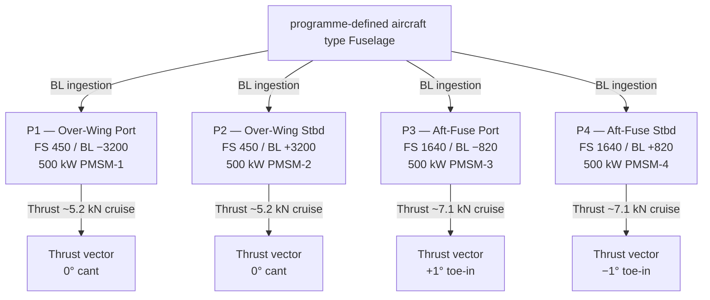

<!-- ──────────────────────────────────────────────────────────────────────────
     QATL-ATLAS-1000-ATLAS-080-089-08-085-020-DISTRIBUTED-PROPULSOR-LAYOUT-AND-TOPOLOGY
     ATLAS-085 (Distributed Electric Propulsion Architecture) · Distributed Propulsor Layout and Topology
     programme-defined aircraft type — ATLAS Register 1000
────────────────────────────────────────────────────────────────────────────── -->

# Distributed Propulsor Layout and Topology

---

## §0 Hyperlink Policy

> All hyperlinks in this document are **relative** (five directory levels: `../../../../../`).
> Absolute URLs are forbidden.

---

## §1 Purpose

This document defines the agnostic ATLAS standard-level architecture context for `Distributed Propulsor Layout and Topology`.

It describes the controlled scope, functions, interfaces, safety considerations, lifecycle traceability, and S1000D/CSDB mapping logic that programme implementations shall instantiate when this node is applicable.

This document is not a programme design baseline. Programme-specific capacities, locations, part numbers, effectivity, operating limits, maintenance references, and data module codes shall be defined only inside the applicable programme implementation branch.
## §2 Applicability

| Applicability Level | Rule |
|---|---|
| Standard taxonomy | Applies to the ATLAS node `085` |
| Programme implementation | Conditional; determined by programme architecture, trade studies, certification basis, and applicability model |
| Product configuration | Defined in the programme-specific configuration baseline |
| Effectivity | Defined in the programme CSDB / applicability layer |
| Non-applicability | Must be explicitly stated in the programme impact-study branch when excluded |
## §3 Propulsor Station Locations

| Propulsor | Station ID | Airframe Location | Fuselage Station (FS) | Buttock Line (BL) | Waterline (WL) | Notes |
|---|---|---|---|---|---|---|
| P1 | DEP-P1 | Over-wing root port — leading-edge nacelle | FS 450 | BL −3 200 mm | WL +1 850 mm | BLI inlet ingests port wing-root fuselage boundary layer |
| P2 | DEP-P2 | Over-wing root starboard — leading-edge nacelle | FS 450 | BL +3 200 mm | WL +1 850 mm | Mirror of P1 |
| P3 | DEP-P3 | Aft-fuselage tailcone — port nacelle | FS 1 640 | BL −820 mm | WL +480 mm | BLI inlet ingests aft fuselage boundary layer (highest efficiency) |
| P4 | DEP-P4 | Aft-fuselage tailcone — starboard nacelle | FS 1 640 | BL +820 mm | WL +480 mm | Mirror of P3 |

---

## §4 BLI Duct Inlet Geometry

| Parameter | P1 / P2 (over-wing) | P3 / P4 (aft-fuselage) |
|---|---|---|
| Inlet type | Flush NACA-style; semi-elliptic lip | D-duct with ramp diffuser |
| Inlet capture area | 0.38 m² | 0.52 m² |
| Fan face diameter | 0.70 m | 0.82 m |
| Fan tip speed (max) | 320 m/s | 300 m/s |
| Inlet duct length | 0.55 m | 0.90 m |
| Inlet duct area ratio (inlet/fan face) | 1.15 | 1.22 |
| Design inlet boundary layer thickness | 120 mm (at FS 450) | 180 mm (at FS 1 640) |
| BL displacement thickness (cruise) | 18 mm | 30 mm |
| Fan pressure ratio (design point) | 1.35 | 1.40 |
| Fan bypass ratio | Single-stream (no core flow) | Single-stream (no core flow) |

---

## §5 Nacelle Envelope and Structural Envelope

| Parameter | P1 / P2 | P3 / P4 |
|---|---|---|
| Nacelle outer diameter (max) | 820 mm | 970 mm |
| Nacelle length (inlet lip to nozzle exit) | 1 100 mm | 1 350 mm |
| Nozzle exit area | 0.31 m² | 0.43 m² |
| Nozzle exit velocity (cruise) | ~215 m/s | ~200 m/s |
| Nacelle material | CFRP outer shell; titanium fan case | CFRP outer shell; titanium fan case |
| Fan blade material | Titanium alloy (Ti-6Al-4V) | Titanium alloy (Ti-6Al-4V) |
| Fan blade count | 18 | 20 |
| Stator blade count | 24 | 26 |
| Tip clearance (cold / hot) | 0.8 mm / 1.2 mm | 0.8 mm / 1.2 mm |

---

## §6 Propulsive Topology Diagram

---

## §7 Thrust Vector Orientation

| Propulsor | Cant Angle (Lateral) | Toe Angle (Longitudinal) | Rationale |
|---|---|---|---|
| P1 | 0° | 0° | Wing-root constraint; aligned with fuselage axis |
| P2 | 0° | 0° | Mirror of P1 |
| P3 | 0° | +1° toe-in | Convergent aft thrust vectoring for reduced base drag |
| P4 | 0° | −1° toe-in | Mirror of P3 (toe-in symmetric) |

---

## §8 Aero-Propulsive Interaction Zones

| Zone | Propulsors | Interaction Type | Design Consequence |
|---|---|---|---|
| Wing-root wake / P1-P2 intake | P1, P2 | Wing-root BL ingested at fan face | Distortion index DC60 ≤ 0.25 required; fan map must include distorted inlet |
| P1 exhaust / P2 cross-flow | P1 ↔ P2 | Exhaust plume interaction at mid-fuselage low chord | Plume separation > 800 mm at cruise — acceptable; no thrust vectoring penalty |
| Aft-fuselage BL / P3-P4 intake | P3, P4 | Thick aft-fuselage BL at FS 1 640 ingested | Highest BLI gain; DC60 ≤ 0.32 at max power; ramp diffuser required |
| P3-P4 exhaust / tailplane | P3, P4 | Exhaust impingement on horizontal tailplane | Tailplane leading edge > 1 200 mm downstream of P3/P4 nozzle exit; no thermal concern at max fan temperature 200 °C |
| Wake-body interaction (cruise) | All | Fan slipstream re-energises aft fuselage wake | Estimated base drag reduction: 4 % (P3+P4); 2 % (P1+P2) |

---

## §9 Fan Acoustics Baseline

| Source | Mechanism | Predicted SPL (A-weighted, 150 m sideline) | Mitigation |
|---|---|---|---|
| Fan tone (BPF) | Blade passing frequency | 72 dB(A) | Blade count / stator count ratio optimised (18/24 and 20/26 = non-integer) |
| BLI distortion broadband | Unsteady loading from ingested BL | +3 dB vs. clean-inflow estimate | Ramp diffuser; acoustic liner 0.10 m in duct |
| Fuselage shielding (P3, P4) | Aft nacelle shielded by fuselage | −6 dB vs. wing-mounted equivalent | Preferred station; noise benefit quantified at approach |
| Combined DEP noise estimate | All four fans | 68 dB(A) EPNL approach (preliminary) | Meets Chapter 14 threshold; detailed EPNL analysis at CDR |

---

## §10 Interfaces

| Interface | Connected System | Protocol | Data |
|---|---|---|---|
| PMSM shaft / fan rotor | PMSM-1…4 mechanical shaft | Rigid coupling | Torque transmission; fan speed feedback |
| Nacelle structural attachment | Wing-root rib structure (P1/P2); aft fuselage frame (P3/P4) | Structural bolted joint | Load path; fan-blade-off reaction |
| BLI inlet / airframe | Fuselage outer mould line | Structural cut-out + aerodynamic fairing | Boundary-layer capture |
| Acoustic liner | Nacelle duct inner wall | Bonded CFRP honeycomb | Broadband noise attenuation 0.10 m treatment |

---

## §11 Open Issues

| ID | Description | Owner | Target |
|---|---|---|---|
| OI-085-020-001 | DC60 distortion index validation at P1/P2 fan face — large-scale WT test plan | Q-HORIZON | PDR |
| OI-085-020-002 | P3/P4 nozzle toe-in angle optimisation — CFD parametric sweep | Q-HORIZON | CDR |
| OI-085-020-003 | Fan blade titanium vs. composite trade study (weight vs. FOD resistance) | Q-INDUSTRY | PDR |
| OI-085-020-004 | P3/P4 tailplane impingement thermal analysis — exhaust plume at TOGA | Q-STRUCTURES | CDR |
| OI-085-020-005 | EPNL approach noise prediction refinement — full acoustic model at CDR | Q-HORIZON | CDR |
