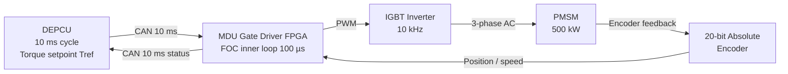

<!-- ──────────────────────────────────────────────────────────────────────────
     QATL-ATLAS-1000-ATLAS-080-089-08-085-030-ELECTRIC-MOTOR-AND-DRIVE-ALLOCATION
     ATLAS-085 (Distributed Electric Propulsion Architecture) · Electric Motor and Drive Allocation
     AMPEL360E eWTW — ATLAS Register 1000
────────────────────────────────────────────────────────────────────────────── -->

# Electric Motor and Drive Allocation

---

## §0 Hyperlink Policy

> All hyperlinks in this document are **relative** (five directory levels: `../../../../../`).
> Absolute URLs are forbidden.

---

## §1 Purpose

ATLAS subsubject 085-030 specifies the electrical and mechanical characteristics of the four permanent-magnet synchronous motors (PMSM-1 through PMSM-4) and their co-located motor drive units (MDU-1 through MDU-4), defines torque control bandwidth requirements, establishes thermal derating curves, allocates each motor-drive pair to a propulsor station, and provides the motor-drive signal and power interface specification.

---

## §2 Applicability

| Parameter | Value |
|---|---|
| Aircraft Program | AMPEL360E eWTW |
| ATA Reference | ATLAS-085 — 085-030 Electric Motor and Drive Allocation |
| Certification Basis | DO-178C DAL B (DEPCU); DO-254 DAL B (MDU gate driver); DO-160G; CS-25.1353 |
| S1000D SNS | 085-030-00 |

---

## §3 PMSM Specifications

| Parameter | PMSM-1 (P1) | PMSM-2 (P2) | PMSM-3 (P3) | PMSM-4 (P4) |
|---|---|---|---|---|
| Continuous power | 500 kW | 500 kW | 500 kW | 500 kW |
| Peak power (≤ 90 s) | 560 kW | 560 kW | 560 kW | 560 kW |
| Rated speed | 6 000 RPM | 6 000 RPM | 6 000 RPM | 6 000 RPM |
| Maximum speed | 6 600 RPM | 6 600 RPM | 6 600 RPM | 6 600 RPM |
| Rated torque (continuous) | 796 N·m | 796 N·m | 796 N·m | 796 N·m |
| Peak torque (≤ 90 s) | 890 N·m | 890 N·m | 890 N·m | 890 N·m |
| Specific power (target) | ≥ 4.0 kW/kg | ≥ 4.0 kW/kg | ≥ 4.0 kW/kg | ≥ 4.0 kW/kg |
| Mass (target) | ≤ 125 kg | ≤ 125 kg | ≤ 125 kg | ≤ 125 kg |
| Efficiency (continuous, rated) | ≥ 96 % | ≥ 96 % | ≥ 96 % | ≥ 96 % |
| Back-EMF (line-to-line, rated speed) | 640 V peak | 640 V peak | 640 V peak | 640 V peak |
| Stator winding configuration | Star (Y), 3-phase | Star (Y), 3-phase | Star (Y), 3-phase | Star (Y), 3-phase |
| Pole pairs | 8 | 8 | 8 | 8 |
| Winding insulation class | Class H (180 °C) | Class H (180 °C) | Class H (180 °C) | Class H (180 °C |
| Cooling method | EGW liquid-cooled housing | EGW liquid-cooled housing | EGW liquid-cooled housing | EGW liquid-cooled housing |
| Bearing lubrication | Grease-packed sealed; 6 000 h replace | As PMSM-1 | As PMSM-1 | As PMSM-1 |
| Encoder type | Absolute optical encoder 20-bit | As PMSM-1 | As PMSM-1 | As PMSM-1 |

---

## §4 MDU Specifications

| Parameter | MDU-1 | MDU-2 | MDU-3 | MDU-4 |
|---|---|---|---|---|
| Input voltage | HVDC 800 V | HVDC 800 V | HVDC 800 V | HVDC 800 V |
| Input voltage range | 760–840 V DC | Same | Same | Same |
| Output | 3-phase AC variable frequency | Same | Same | Same |
| Output frequency range | 0–880 Hz (0–6 600 RPM × 8 poles / 60) | Same | Same | Same |
| Continuous output current | 450 A (phase peak) | Same | Same | Same |
| Peak output current (≤ 90 s) | 504 A | Same | Same | Same |
| Switching frequency | 10 kHz (IGBT) | Same | Same | Same |
| MDU efficiency (rated) | ≥ 98 % | Same | Same | Same |
| MDU mass (target) | ≤ 85 kg | Same | Same | Same |
| MDU specific power (target) | ≥ 5.9 kW/kg | Same | Same | Same |
| Gate driver DAL | DO-254 DAL B | Same | Same | Same |
| Communication | CAN ISO 11898 (redundant A+B) | Same | Same | Same |
| EMC filter | Integral common-mode choke + X/Y capacitors | Same | Same | Same |
| DC link capacitance | 3 000 µF (film type) | Same | Same | Same |
| Over-current protection | Hardware crowbar ≤ 5 µs | Same | Same | Same |
| Cooling | EGW liquid-cooled cold plate (shared DEP-TML loop) | Same | Same | Same |

---

## §5 Torque Control Architecture

The MDU gate drivers implement a **field-oriented control (FOC)** inner loop at 100 µs sample rate, driven by DEPCU torque setpoints received via CAN at a 10 ms outer-loop cycle. The FOC inner loop executes on an FPGA (DO-254 DAL B) co-located in the MDU. The DEPCU outer loop computes per-propulsor torque demand from the total thrust resolver and asymmetric compensator and writes CAN frames at 10 ms intervals.

---

## §6 Thermal Derating Curve

| MDU Cold-Plate Inlet Temperature | Max Continuous Power | Notes |
|---|---|---|
| ≤ 40 °C | 500 kW (100 %) | Normal operating zone |
| 41–50 °C | 450 kW (90 %) | DEPCU reduces torque setpoint automatically |
| 51–55 °C | 350 kW (70 %) | Advisory to crew; CMS fault logged |
| > 55 °C | MDU shutdown commanded | DEPCU isolates BTB; degraded mode activates |

---

## §7 PMSM Stator Winding Temperature Limits

| Winding Temperature | DEPCU Action |
|---|---|
| ≤ 155 °C | Normal — no action |
| 156–170 °C | Derate to 80 % continuous; crew advisory |
| 171–180 °C | Derate to 60 %; CMS FAULT logged |
| > 180 °C | DEPCU commands BTB open; PMSM isolated; degraded mode |

---

## §8 Motor-Drive Allocation Table

| Propulsor | PMSM Unit | MDU Unit | BTB | CAN Bus A | CAN Bus B | Location |
|---|---|---|---|---|---|---|
| P1 (over-wing port) | PMSM-1 | MDU-1 | BTB-P1 | CAN-A bus P1 | CAN-B bus P1 | Port over-wing nacelle |
| P2 (over-wing stbd) | PMSM-2 | MDU-2 | BTB-P2 | CAN-A bus P2 | CAN-B bus P2 | Starboard over-wing nacelle |
| P3 (aft-fuse port) | PMSM-3 | MDU-3 | BTB-P3 | CAN-A bus P3 | CAN-B bus P3 | Aft-fuselage port nacelle |
| P4 (aft-fuse stbd) | PMSM-4 | MDU-4 | BTB-P4 | CAN-A bus P4 | CAN-B bus P4 | Aft-fuselage starboard nacelle |

---

## §9 Interfaces

| Interface | Connected System | Protocol | Data |
|---|---|---|---|
| HVDC 800 V power feed | BGHA bus via BTB | HVDC 800 V cable | Up to 500 kW per MDU |
| Torque setpoints | DEPCU | CAN ISO 11898 redundant | 10 ms torque demand; mode commands |
| Speed / position feedback | PMSM encoder | CAN (via MDU) | 20-bit position; speed for FOC |
| Thermal telemetry | DEP-TML coolant loop (ATLAS-074 heritage) | 4–20 mA + CAN | MDU cold-plate temp; PMSM winding temp |
| Fault flags | MDU gate driver FPGA | CAN ISO 11898 | Over-current; over-temp; encoder fault; CAN timeout |
| Ground calibration | DEPCU-GSE-1 | USB-C 3.2 | MDU FOC parameter update; encoder calibration |

---

## §10 Open Issues

| ID | Description | Owner | Target |
|---|---|---|---|
| OI-085-030-001 | PMSM supplier qualification — 500 kW Class H airborne motor selection | Q-INDUSTRY | PDR |
| OI-085-030-002 | MDU switching frequency 10 kHz vs. 20 kHz trade — EMC vs. switching losses | Q-INDUSTRY | CDR |
| OI-085-030-003 | PMSM encoder absolute position accuracy — fan synchronisation requirement | Q-INDUSTRY | PDR |
| OI-085-030-004 | PMSM winding temperature sensor certification (CS-25.1353 Class H verify) | Q-GREENTECH | CDR |
| OI-085-030-005 | MDU DC link capacitor DO-160G shock/vibration qualification | Q-INDUSTRY | CDR |
